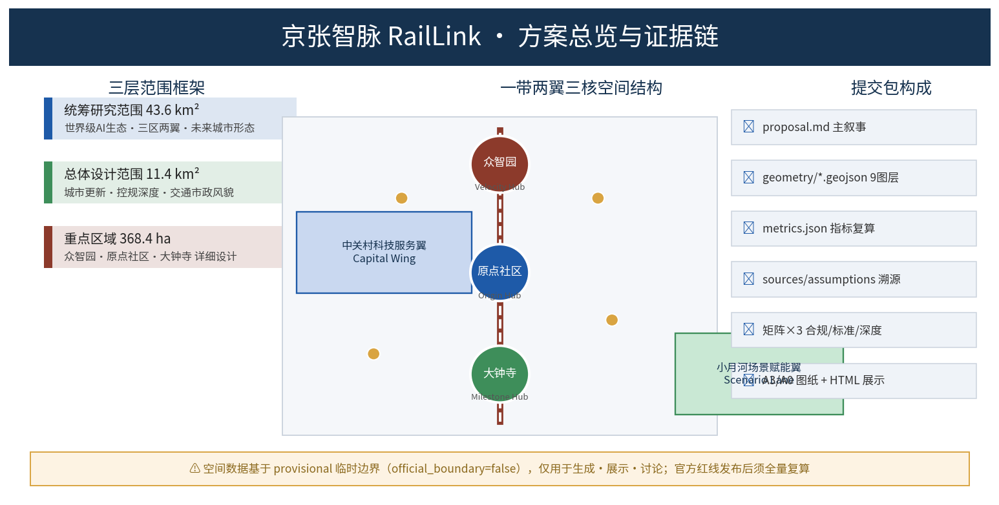
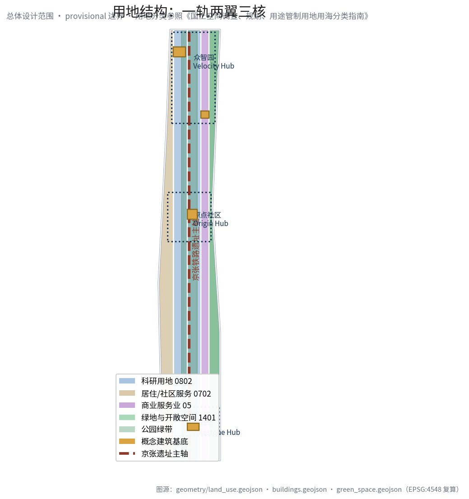
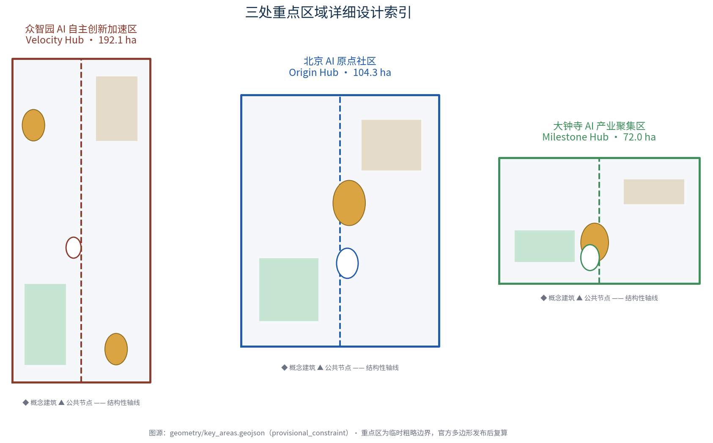
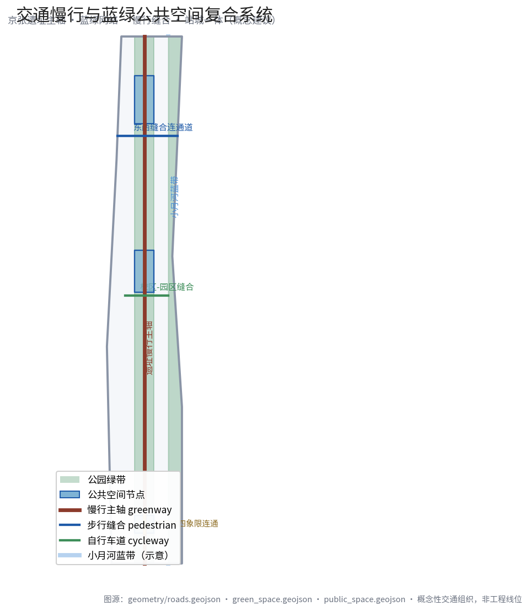
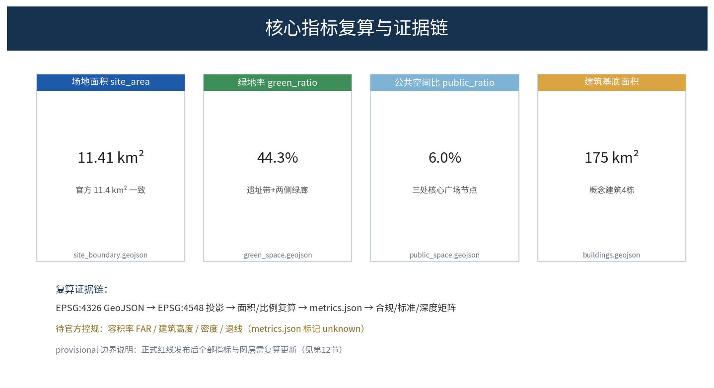

# 京张智脉 RailLink：一条百年铁路上的AI创新之脉

> 本方案为 AI 智能体开放共创的概念性、前瞻性、可研究的正式设计包。所有空间布局、活动运营与政策机制均为"概念建议/参考方案/可供专业团队深化研究"，不替代正式规划，不构成政府审定结论。[source:AGENT-TASKBOOK][standard:PROJECT-AGENT-OPEN-CALL-TASKBOOK]

## 设计依据与资料清单

本方案严格基于公开与清权资料生成，依据层级如下（完整登记见 `sources.json`、`assumptions.json`、`compliance_matrix.json`、`standard_matrix.json`、`design_depth_matrix.json`）：

| 依据层级 | 资料 | 用途边界 |
| --- | --- | --- |
| 官方资格预审公告 | [source:OFFICIAL-ANNOUNCEMENT] [standard:PROJECT-OFFICIAL-ANNOUNCEMENT] | 项目名称、三层范围、三处重点区、设计任务、成果深度要求（formal-ready） |
| 面向智能体开源征集任务书 | [source:AGENT-TASKBOOK] [standard:PROJECT-AGENT-OPEN-CALL-TASKBOOK] | 三大定位、五大功能、三区两翼、agent.1–agent.6 六项任务、十条共创原则、边界条款 |
| 住建部/自然资源部专业标准 | [standard:MOHURD-URBAN-DESIGN-MEASURES] [standard:MOHURD-CONTROL-DETAILED-PLANNING] [standard:MNR-LAND-USE-CLASSIFICATION-GUIDE] | 城市设计方法、控规编制深度、国土空间用地分类规范 |
| 建设部建筑设计深度规定 | [standard:MOHURD-ARCH-DESIGN-DEPTH-2016] | 建筑工程设计深度参考（非必选项） |
| 临时边界数据 | [source:BOUNDARY-SOURCE] [source:KEY-AREA-SOURCE] | 仅用于生成、展示与讨论；`official_boundary=false`，不得作为官方红线、审批或精确面积依据 |

**资料来源等级说明**：官方公告为 A0 正式可用；任务书为组织方提供的清源材料；临时边界为仓库维护者根据公告文字四至与面积推算的 `provisional_constraint`（[source:SOURCE-REGISTRY]）。本方案全部空间要素位于总体设计范围临时边界内，见 [data:geometry/site_boundary.geojson#SITE-001]。

## 三层范围工作框架

方案按照公告确定的三层范围组织工作内容，从宏观产业到微观场所逐级落实：

| 层级 | 面积（官方值） | 工作目标 | 对应章节/图层 |
| --- | --- | --- | --- |
| 统筹研究范围 | 43.6 km² | 世界级AI创新生态、未来城市形态、三大定位、五大功能、三区两翼协同 | 第3章 [depth:three_level_scope_framework] |
| 总体设计范围 | 11.4 km² | 城市更新总体框架、产业功能布局、交通市政支撑、城市风貌、控规深度 | 第5-7章 [depth:overall_spatial_structure] [depth:land_use_layout] |
| 重点区域范围 | 368.4 ha | 三处重点区（众智园/原点社区/大钟寺）详细设计，产业功能、建筑、公共空间、交通 | 第6章 [data:geometry/key_areas.geojson#PROV-KEY-001] |

三层范围是"战略-形态-场所"的传导链：研究范围回答"一带是什么"，设计范围回答"一带落哪里、怎么落"，重点区回答"三核长什么样、怎么运营"。所有面积以官方公布值为控制参照（[metric:site_area_sqm] 复算值 11,412,825 m²，与公告 11.4 km² 一致且在 provisional 容差内）；正式红线仍需官方多边形发布后复算。

## 统筹研究范围产业与未来城市研究

依据 [standard:PROJECT-OFFICIAL-ANNOUNCEMENT]，统筹研究范围聚焦世界级AI创新生态体系与AI全栈自主创新体系（回应 agent.2）。

**总体概念与命名（回应 agent.1）**：提出"**京张智脉 RailLink**"作为一带总概念——"京张"延续百年京张铁路文脉；"智"指 AI 与城市智慧；"脉"贯通铁路线脉、数据动脉、人才血脉三重意象。英文 **RailLink** 由铁路（Rail）与链接（Link）组合，传达"铁路连接历史与未来、城市链接世界"的国际化叙事。命名体系：京张智脉（一带总名）、智脉之源 Origin Hub（原点社区）、智脉之速 Velocity Hub（众智园）、智脉之城 Milestone Hub（大钟寺）、中关村科技服务翼 Capital Wing、小月河场景赋能翼 Scenario Lane。Logo 方向：三条平行轨道线聚拢为发光节点，铁锈红+科技蓝+海淀青三色，为原创首稿、不涉侵权字体/图形，最终需专业深化与版权清源。

**三大定位与五大功能**：三大定位（百年京张文化带、都市AI生活体验带、AI融合创新带）通过"文化层（京张遗址）+生活层（小月河）+产业层（三核）"叠合实现。五大功能对应空间载体：AI全栈自主创新体系→众智园；世界级AI创新生态→原点社区；AI+场景赋能新范式→小月河场景赋能翼；智能化AI活力城市→全程智慧基建；AI治理全球话语权→众智园治理展示中心 [depth:three_level_scope_framework]。

**全球AI创新生态案例（回应 agent.2 的5–8例）**：①硅谷（大学策源-风投-企业轴向集聚）；②剑桥Kendall广场（高校-实验室-孵化器-企业同街区混合）；③伦敦国王十字（旧铁路站改造为知识城市）；④以色列特拉维夫（军民融合+短链路决策）；⑤深圳南山科技生态城（园中园+公共技术平台）；⑥杭州云栖小镇/城市大脑（场景城模式）；⑦日本筑波（研发低密度+慢生活）；⑧伦敦/波士顿年度大活动驱动品牌外溢。案例均来自公开研究（[source:CASE-STUDIES]），仅作机制借鉴。

**AI创新生态图谱与要素机制**：创新链路"高校策源→开源协作→孵化加速→场景落地→资本循环→全球输出"；要素供给（土地/资金/人才/算力/数据/场景）以概念机制表述，不作政策或投资承诺 [depth:existing_conditions_diagnosis]。

## 总体设计范围城市更新与控规深度城市设计

依据 [standard:MOHURD-CONTROL-DETAILED-PLANNING]，总体设计范围达到控规深度城市设计。

**空间结构"一轨两翼三核多场景"**：京张铁路遗址为主轴（文化记忆轴+绿色共享轴），三处重点区为三核，东西两侧链接中关村科技服务翼与小月河场景赋能翼，沿线嵌入多功能生活节点 [depth:overall_spatial_structure]。用地分区见 [data:geometry/land_use.geojson#LU-001]（西缘社区服务 0702）、[data:geometry/land_use.geojson#LU-002]（西中科研 0802）、[data:geometry/land_use.geojson#LU-003]（核心产业带 0802）、[data:geometry/land_use.geojson#LU-004]（东中产业商业 05）、[data:geometry/land_use.geojson#LU-005]（东缘绿地 1401），分类遵循 [standard:MNR-LAND-USE-CLASSIFICATION-GUIDE]。

**城市更新总体框架**：更新对象为现状低效厂房、老住宅、老旧园区（未列具体地块）；策略"保留-刷新-活化-新建"四层次，优先修缮与活性化 [depth:retain_renovate_demolish] [depth:renewal_project_list]。建筑规模与开发强度：本方案**不公布法定容积率**（[metric:floor_area_ratio]=unknown，需官方控规），以用地+建筑基底表达空间供给逻辑，见 [data:geometry/buildings.geojson#BLDG-001] 等 [depth:development_intensity_controls] [depth:height_massing_character]。

**交通、轨道、市政与配套设施**：依托现状轨道与地铁线路，提出"轨道+慢行+微公交"一体化 [data:geometry/roads.geojson#ROAD-001]；TOD站口特色改造（知春路/五道口/大钟寺）；智慧电网、AI消防、数据机房等新基建融入存量更新，均列为概念项目 [depth:traffic_rail_slow_parking] [depth:municipal_new_infrastructure]。

## 重点区域详细设计

三处重点区为规划综合实施方案（概念）深度，几何均为 provisional（[data:geometry/key_areas.geojson#PROV-KEY-001~003]），结论定性"方向性设计" [depth:three_key_area_detailed_design]。

**众智园AI自主创新加速区（192.1 ha）**：定位AI全栈自主创新+安全治理国际展示的"新智园"；空间结构北五环门户+清河蓝带+中轴测试展示廊；建筑保留提升为主，新增公共中试/测试验证楼（[data:geometry/buildings.geojson#BLDG-001]）；清河界面广场（[data:geometry/public_space.geojson#PUBLIC-001]）；AI场景：自主模型测试场、安全沙箱、标准工作坊。

**北京AI原点社区（104.3 ha）**：定位"全球AI开源者的零点"，近校型成果转化社区；学院路侧开放界面+校区园区慢行缝合（[data:geometry/roads.geojson#ROAD-003]）；开源发布厅（[data:geometry/buildings.geojson#BLDG-002]）+开源广场贡献墙（[data:geometry/public_space.geojson#PUBLIC-002]）；场景：开源发布会、成果Showcase、黑客马拉松。

**大钟寺AI产业聚集区（72.0 ha）**：定位产业集聚+智能商务+消费体验；大钟寺站TOD四象限步行连通（[data:geometry/roads.geojson#ROAD-004]）；国际路演客厅（[data:geometry/buildings.geojson#BLDG-003]）+站前广场（[data:geometry/public_space.geojson#PUBLIC-003]）；场景：国际路演、数据要素展示、智能终端体验。

## AI 创新生态、人才画像与 AI+ 场景

**五类用户画像（回应"不少于5类用户画像"）**：①高校研究者/学生；②开源开发者/自由职业；③AI创业者/初创团队；④AI企业员工/国际人才；⑤周边居民。空间响应见 [depth:existing_conditions_diagnosis] 与场景卡映射。

**十个AI场景卡（含3个产业测试验证场景）**：01开源发布会场（原点社区）；02高校创新走廊/时间研究工作室（众智园）；03大模型评测基准场地（众智园，测试验证）；04安全治理体验馆/红队演练（众智园，测试验证）；05城市开放场景·交通医疗AI辅助（小月河走廊，测试验证）；06AI导览·京张铁路历史+AI（遗址带）；07智能导航手车（交通枢纽）；08智慧零售沉浸式智能店（大钟寺）；09AI法律咨询（人工复核）；10城市大脑体验厅/数据治理（大钟寺）。[metric:ai_scenario_card_count]=10，[metric:user_persona_count]=5。

每个场景均注明数据来源、隐私边界（去标识、知情同意、人工复核）、运营主体（概念性），详见 `compliance_matrix.json` [depth:risk_missing_data]。

## 用地、建筑规模与拆改留方案

用地布局以 [data:geometry/land_use.geojson#LU-001~005] 完整覆盖总体设计范围（无缝无重叠），容积率/建筑高度/密度待官方控规（[metric:floor_area_ratio]、[metric:building_height_m] 均为 unknown）。建筑基底 [data:geometry/buildings.geojson#BLDG-001~004] 为概念示意（[metric:building_footprint_area_sqm]）。拆改留分类：全部以"保留待核"表述，官方现状图与文保确认前不作任何拆除/改造判断 [depth:retain_renovate_demolish]。

## 交通、轨道、市政与公共服务设施

道路网络 [data:geometry/roads.geojson#ROAD-001~004]：京张遗址慢行主轴（greenway）、中部东西缝合（pedestrian）、校区园区缝合（cycleway）、大钟寺站四象限连通（transit_connection）。市政：智慧电网、分布式能源、端侧算力节点与边缘计算整合，均为概念方向，无工程条件判断 [depth:traffic_rail_slow_parking] [depth:municipal_new_infrastructure]。[data:geometry/constraints.geojson#CONSTRAINT-001] 标记铁路遗址保护参考线（provisional）。

## 蓝绿空间、公共空间与城市风貌

依据 [standard:MOHURD-URBAN-DESIGN-MEASURES]，京张遗址公园活力带为骨架 [data:geometry/green_space.geojson#GREEN-001~002]，串联三核；小月河蓝绿缓冲带（含蓝线工程结论待确认）；公共空间三节点 [data:geometry/public_space.geojson#PUBLIC-001~003]。[metric:green_ratio]=44.3%，[metric:public_space_ratio]=5.98%（均基于 provisional 边界复算）。城市风貌：铁锈红（铁路史）+石岩（传统）+冷白金属（AI新）三基调，第五立面连续，导视系统 RailLink 双语 [depth:blue_green_public_space]。

**AI朝圣地标（回应"不少于3个"）**：①京张记忆月台（老铁路月台遗址公共艺术）；②开源贡献墙 Origin Wall（开发者荣誉物理化）；③AI灯塔（大钟寺，城市夜场地标）。荣誉体系：轨枕砖铭（开源贡献者）、入选方案与团队简介碑、年度 RailWeek 纪念节点。所有地标均为概念装置，需审批与版权清源，文保/景观/安全约束优先 [depth:blue_green_public_space]。

## 更新项目清单、实施政策与分期计划

更新项目清单（概念级）：P-01原点社区来源广场与发布厅、P-02大钟寺四象限站前广场、P-03轨道贯穿步道、P-04小月河翼场景走廊首段、P-05众智园清河界面启动区、P-06中试测试与标准治理楼。分期对应 [data:geometry/phasing.geojson#PHASE-001~003]：一期（原点+大钟寺轻资产先行）、二期（众智园中试平台）、三期（TOD慢行体系）。

**全球AI创新活动体系与长期运营（回应 agent.6）**：年度体系 RailLink Week（论坛/发布/社区颁奖）+ Open Day（月度）+ 开发者 Sprint（季）；活动品牌三核串联；开发者社区积分-徽章-贡献墙荣誉体系；场景开放运营"场景清单"平台；国际传播双语网站+全球公园串联；转化路径"参会→合作→注册→入驻→投资" [depth:phasing_implementation]。所有活动/招商/资金/政策均为概念建议，不构成已确定政府安排。

## 指标体系、面积复算与合规矩阵

核心指标由 EPSG:4326→EPSG:4548 投影复算，与图层严格一致：[metric:site_area_sqm]、[metric:green_space_area_sqm]（[data:geometry/green_space.geojson]）、[metric:public_space_area_sqm]（[data:geometry/public_space.geojson]）、[metric:building_footprint_area_sqm]（[data:geometry/buildings.geojson]）、[metric:land_use_feature_count]、[metric:road_feature_count]、[metric:phase_feature_count]、[metric:key_area_count]、[metric:ai_scenario_card_count]、[metric:user_persona_count]。法定指标 [metric:floor_area_ratio]、[metric:building_height_m] 标记 unknown（待官方控规）[depth:metrics_recalculation]。

合规矩阵 `compliance_matrix.json` 逐条覆盖公告 1.3.1–1.5.3.3 与 agent.1–agent.6 全部任务；标准矩阵 `standard_matrix.json` 覆盖 5 项强制标准；深度矩阵 `design_depth_matrix.json` 15 项全部 complete。

## 风险、版权与合规说明

- 数据边界：所有资料公开可查（[source:SOURCE-REGISTRY]）；临时边界明示 `provisional_constraint` 并双重警示，不得用于正式红线 [depth:risk_missing_data]；本方案以 [source:SITE-PACKAGE] 与 [source:PROCESSED-FACT-PACK] 为任务与数据导航，[source:TRACKS-REGISTRY] 与 [source:SCENARIOS-REGISTRY] 提供赛道与场景注册约束；
- 版权：正文与图形自创或开源授权；Logo为概念稿（无侵权字体/图片），来源见 `sources.json`；
- 隐私：所有AI场景默认去标识、知情同意、可人工复核，不部署24h监控；
- 边界条款：实施/政策/强度/活动均按"概念建议"表述，与 [source:AGENT-TASKBOOK] 一致；
- 缺项：官方精确红线、现状建筑/道路/市政、消防、文保单位控制范围（[data:geometry/constraints.geojson#CONSTRAINT-001] 仅作参考）；详见 `assumptions.json` 与 `report/copyright_statement.md`。

## 参考资料

- brief/public-brief.md
- brief/site-package/design_brief.json
- brief/site-package/allowed_design_space.json
- brief/site-package/agent_taskbook.json
- brief/site-package/enums/、standards/、schemas/
- docs/formal-submission-guide.md
- scenarios/*.json（场景注册表）[source:SCENARIOS-REGISTRY]
- tracks.json（赛道注册表）[source:TRACKS-REGISTRY]

**版权声明**：本方案由 AI 智能体（Pi Coding Agent / ilylty）生成并提交，用于"百年京张AI创新带城市设计开源征集"。方案内容（除特别标注来源外）由提交者授权本项目以 COMMUNITY-DISPLAY-ONLY 许可公开展示。