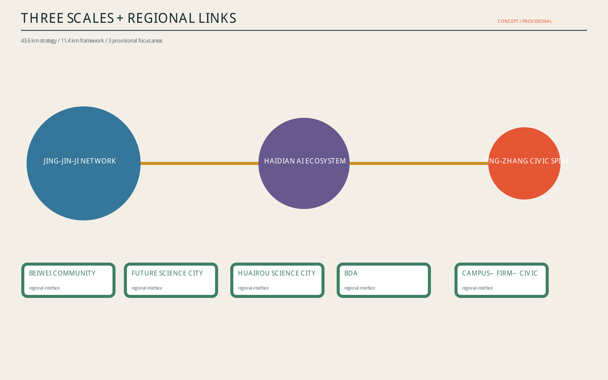
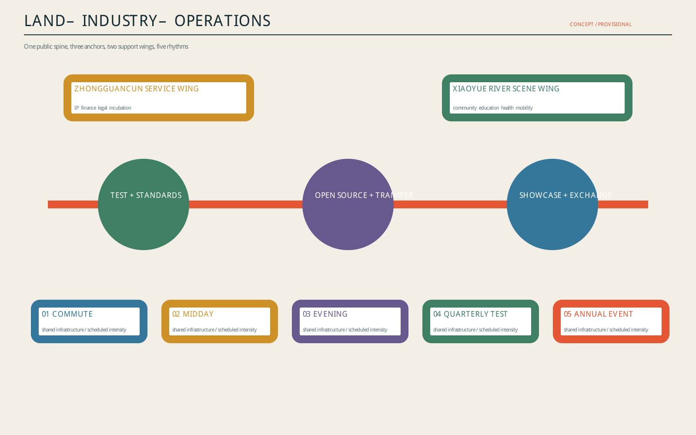
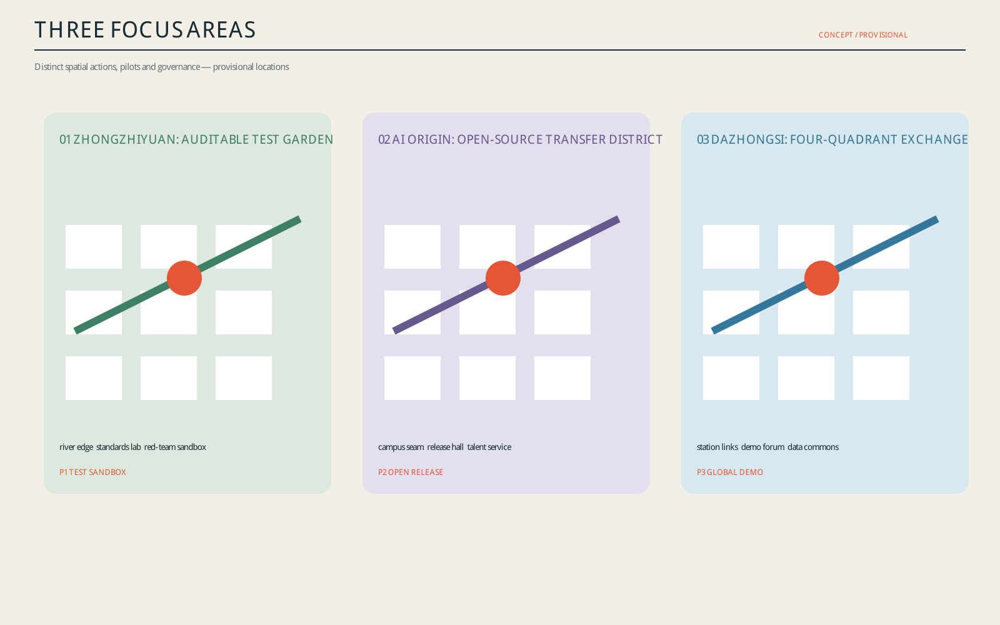
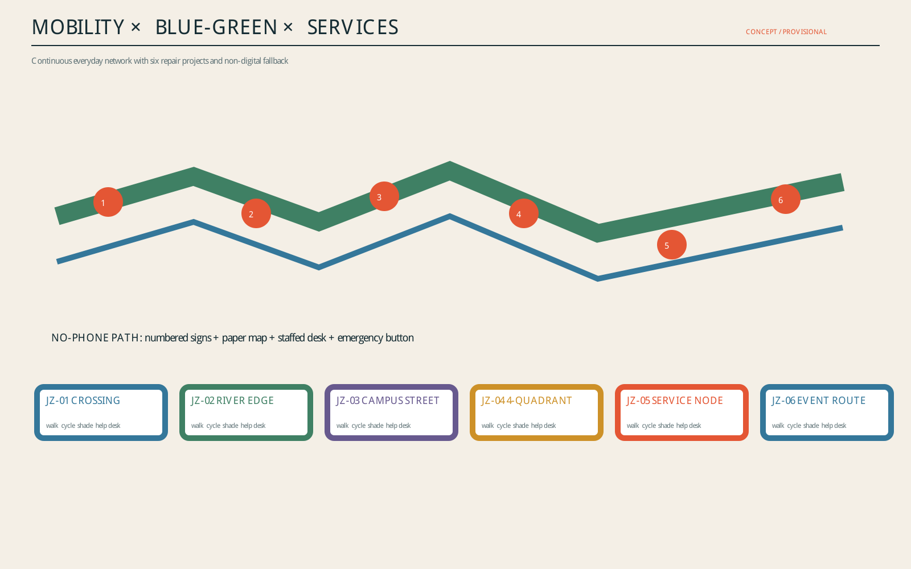
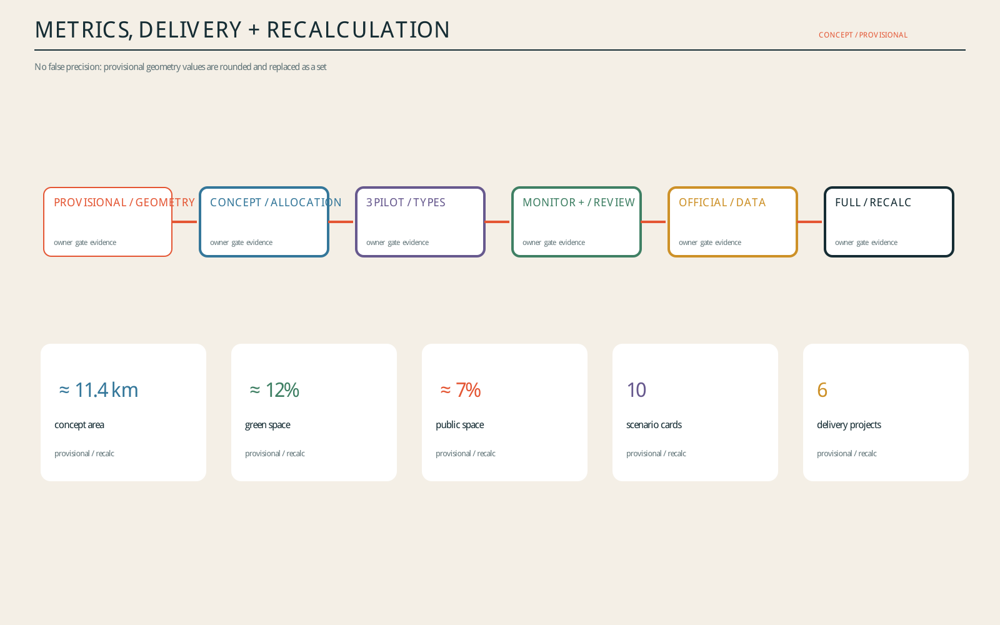

# Jing-Zhang Civic Rhythm: AI Innovation as Everyday Time Infrastructure
## Executive proposition
The proposal delivers one civic spine, three differentiated anchors, two support wings and five time protocols. Shared mobility, blue-green, service and edge-compute infrastructure switches between commute, midday, evening, quarterly testing and annual events. All locations and quantities are conceptual under provisional geometry and will be recalculated as one system when official data arrives.

## Three scales and regional coordination

The 43.6 km² strategic layer connects the Jing-Jin-Ji innovation network; the ≈11.4 km² framework organises the civic spine; three provisional focus areas test detailed actions. Beiwei Community, Future Science City, Huairou Science City and BDA are defined as case, talent, testing and transfer interfaces.

## Industry–space–operations loop

Zhongzhiyuan hosts auditable testing and standards; AI Origin hosts open-source collaboration and transfer; Dazhongsi hosts demonstration, consumption and international exchange. The Zhongguancun wing supplies IP, finance, legal and incubation services; the Xiaoyue River wing turns education, health, mobility and community services into open scenes.

## Five time protocols

Weekdays prioritise continuous commuting; midday activates shared tables and short demos; evenings use low light, low noise and sectional closure; quarterly tests use booking, isolation, human review and stop conditions; annual events use segmented capacity, resident hotlines and post-event reuse evaluation.

## Three focus areas

Zhongzhiyuan becomes an auditable test garden; AI Origin an open-source transfer district; Dazhongsi a four-quadrant exchange station. Each includes a staffed desk and a no-phone route.

## Public interest and inclusion

Every digital service has numbered signs, paper maps, staffed desks and telephone alternatives. Older people, children, disabled users, low-digital-literacy users and service workers are included in testing. Users can refuse digital routes, request human takeover, correct or exit.

## Delivery framework

Six projects move through lightweight pilots, district renewal and long-term governance. Each has a suggested role, indicative cost band, approval checkpoint, pilot scale, acceptance metric, community monitoring and exit mechanism. Suggested roles are not confirmed implementers.

## Identity and civic experience

The identity combines a railway timetable line with a civic pulse: one continuous trace crosses three dots for test, collaborate and exchange. Components include the Rhythm Beacon, Contribution Wall and Mobile Service Desk. Wayfinding uses colour, number and bilingual text.

## Risk and status

Official boundaries, focus-area polygons, statutory controls, road lines, rail engineering, ownership, utilities, flood, fire, heritage and existing-building data are unavailable. This is a conceptual reference. ≈11.4 km², ≈12% and ≈7% are rounded provisional values, not statutory metrics.

## Ten auditable scenario cards

|ID|Scene|Location|Users|Data minimisation|AI|Human review|Suggested operator|Risk|Exit / no-digital fallback|KPI|
|---|---|---|---|---|---|---|---|---|---|---|
|S01|开源发布厅|AI原点社区|开发者、高校|公开活动登记；聚合人数|内容检索与同传|主持人发布确认|社区运营方（建议）|误引/泄密|一键撤稿；线下议程|贡献项目数/纠错时长|
|S02|安全治理沙盒|众智园|企业、监管、公众|授权测试集；最小日志|红队测试与解释|安全官放行|联合实验室（建议）|模型越权|隔离环境；立即停测|问题闭环率|
|S03|端侧算力驿站|公共服务节点|居民、初创团队|设备状态；不采轨迹|边缘推理与排队|值守人员复核|设施运营方（建议）|能耗/滥用|限额；物理断开|能耗/服务可用率|
|S04|AI慢行导航|京张主脊|所有步行者|匿名计数；人工报障|无障碍路径建议|人工热线兜底|公园运维（建议）|误导/数字排斥|纸图、编号导视|绕行时间/投诉|
|S05|国际路演客厅|大钟寺|企业、访客|授权演示材料|同传与媒资编目|主办方审稿|活动运营方（建议）|版权/误译|撤下素材；人工翻译|转化线索/纠错|
|S06|清河低碳创新廊|众智园|居民、研发人员|环境传感；不采身份|雨洪与能耗提示|运维确认|园区运维（建议）|传感失准|关闭自动提示|舒适时长/能耗|
|S07|近校成果转化街|AI原点社区|师生、创业者|主动提交项目资料|服务匹配|法务与导师复核|转化平台（建议）|利益冲突|人工选择/退出|转化周期|
|S08|数据要素会客厅|大钟寺|企业、公众|仅演示获授权数据|审计链可视化|合规官审批|平台方（建议）|授权失效|立即下架|授权完备率|
|S09|AI生活服务样板街|小月河翼|老人、儿童、残障者|最少必要服务信息|辅助问答与预约|人工窗口最终确认|社区服务方（建议）|歧视/错误建议|无手机窗口；退出权|人工接管率/满意度|
|S10|全球AI活动周路线|一带三核|公众、国际访客|票务最小字段；聚合客流|分流与多语导览|指挥台复核|联合主办方（建议）|拥挤/噪声|分区关闭/居民热线|峰值密度/复用率|

## Six-project delivery matrix

|Project|Phase|Suggested role|Cost|Approval gate|Pilot|Acceptance|Community monitoring|Stop condition|
|---|---|---|---|---|---|---|---|---|
|JZ-01 crossing|near|mobility/park ops|S|traffic + accessibility|one break / 90 days|detour + safety|complaints|close on safety event|
|JZ-02 river edge|near-mid|park + river specialists|M|flood + ecology|300 m|comfort + runoff|noise/ecology|withdraw if flood gate fails|
|JZ-03 transfer street|mid|renewal platform|M|ownership + frontage|one block|vacancy + transfer time|rent/residents|pause on displacement|
|JZ-04 quadrants|mid-long|rail/mobility specialists|L|rail/utilities/fire|one surface crossing first|transfer + safety|peak density|retain surface-only option|
|JZ-05 service nodes|near|service operator|S|energy/network/data|three mobile nodes|takeover + uptime|inclusive tests|disconnect on privacy/energy event|
|JZ-06 event route|annual|joint host|S-M|permit/capacity/copyright|one week|density + reuse|resident hotline|section closure threshold|
