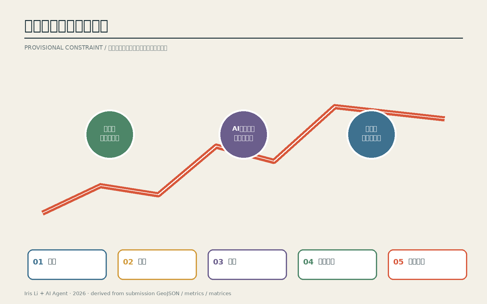
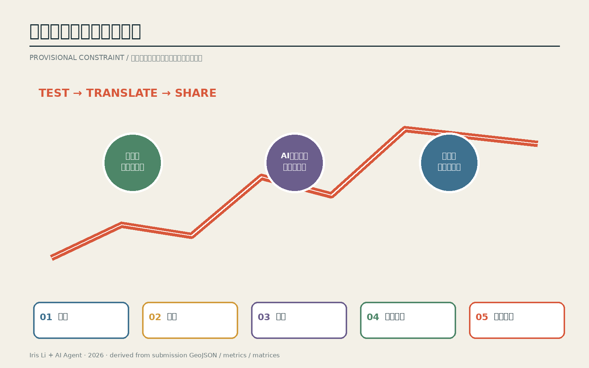
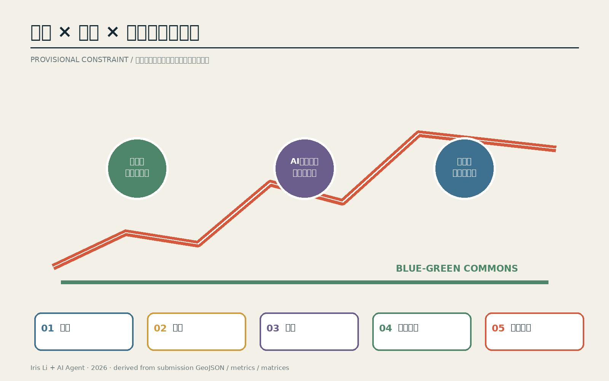
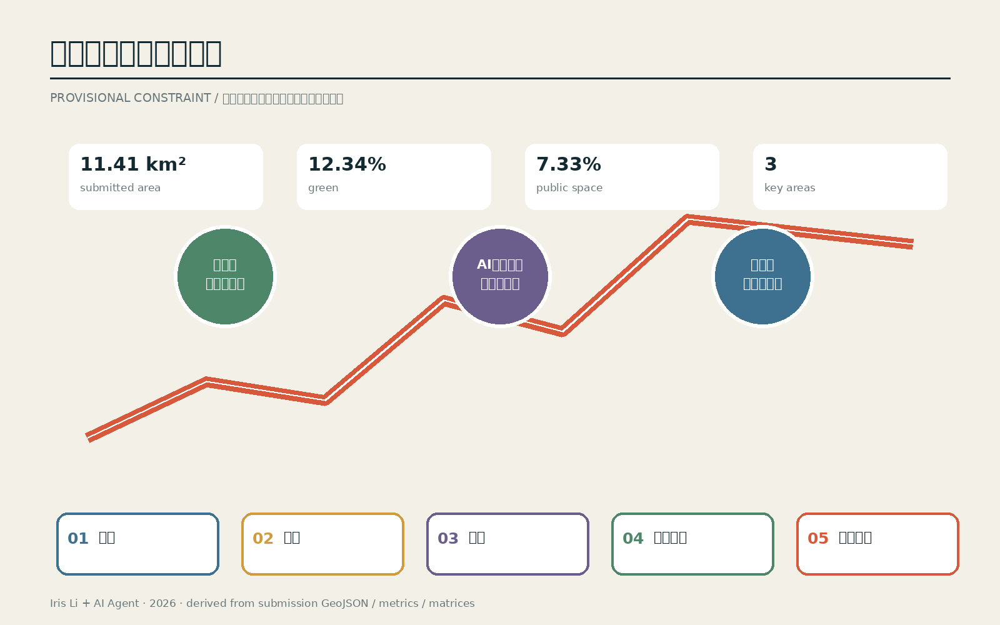

# 京张节律场：把AI创新带做成可日常使用的时间基础设施
## 设计依据与资料清单

本方案以资格预审公告、面向智能体任务书、仓库来源登记和临时几何为依据。公告和任务书定义三层范围、三处重点区及六项智能体任务；sources、assumptions、metrics、standard matrix 与 design depth matrix 分别记录来源、假设、指标、标准和设计深度。当前总体边界和三处重点区均为 provisional constraint，只能支持概念生成、空间讨论和流程验证，不能升级为官方红线、法定控规或工程条件 [source:OFFICIAL-ANNOUNCEMENT] [source:AGENT-TASKBOOK] [source:BOUNDARY-SOURCE]。

资料使用遵循三条规则：临时面积和比例按资料精度舍入；权属、道路红线、轨道、市政、防洪、消防、文保和现状建筑属性缺失时，相关结论保持待确认；正式多边形到位后，边界、重点区、用地、道路、绿地、公共空间、建筑、分期、指标、图件和网页作为一个依赖集合整体重算。

## 结论先行
本方案交付“一条公共主脊、三个差异化锚点、两条协同翼、五种时间协议”。它不是把AI贴到传统规划上，而是用同一套慢行、蓝绿、服务和端侧设施，在通勤、午间、夜间、季度测试与年度活动之间切换。所有位置和面积均为临时几何下的概念建议，待正式边界到位后整体重算。

## 三层范围工作框架

43.6平方公里统筹层连接京津冀创新网络；约11.4平方公里总体层组织京张主脊；三处临时重点区验证详细动作。北纬社区、未来科学城、怀柔科学城和经开区被定义为案例、人才、测试与转化接口，而非空泛外部名称。

## 统筹研究范围产业与未来城市研究

众智园承担可审计测试与标准化，AI原点社区承担开源协作与成果转化，大钟寺承担展示、消费与国际交换。中关村科技服务翼提供知识产权、金融、法务和孵化；小月河场景翼把教育、健康、交通和社区服务转成开放场景。每个锚点同时绑定空间载体、运营角色、数据边界和绩效指标。

## 五种时间协议

工作日优先连续通勤；午间开放共享桌与短路演；夜间以低照度、低噪声和可分区关闭服务社区；季度测试采用预约、隔离、人工复核和停止条件；年度活动采用分段容量、居民热线与活动后复用评估。同一空间避免建设低频专用场馆。

## 重点区域详细设计

众智园以清河界面、标准工坊、红队沙盒和低碳算力花园形成“测试花园”；AI原点以校园缝合、开源发布厅、人才服务与成果转化形成“开源街区”；大钟寺以站城四象限连通、国际路演客厅、数据会客厅和夜间消费形成“交换站”。三处均设置人工服务台和无手机路径。

## AI 创新生态、人才画像与 AI+ 场景

所有数字服务均提供编号导视、纸质地图、人工窗口和电话替代。老人、儿童、行动或视听障碍者、低数字素养者和服务人员被纳入场景测试。用户可以拒绝数字路径、要求人工接管、纠错或退出；聚合客流不得反推个人轨迹。

## 更新项目清单、实施政策与分期计划

六个项目按“轻量试点—街区更新—长期治理”推进。每个项目设置建议责任角色、概念成本级别、审批核验点、试点规模、验收指标、社区影响监测和退出机制；建议角色不构成已确定实施主体。正式红线、权属、市政、防洪、消防和文保条件未到位前，不进入工程承诺。

## 品牌与城市体验

折线标识来自铁路时刻线与城市脉搏：一个连续轨迹穿过三个圆点，分别代表测试、协作和交换。组件库包含节律柱、贡献墙和可移动服务台；导视以颜色+编号+中英文文字三重编码，避免仅靠颜色传达。

## 风险、版权与合规说明

正式边界、重点区多边形、控规、道路红线、轨道工程、权属、市政、防洪、消防、文保和现状建筑属性均未提供。本方案只作概念建议和专业深化参考；≈11.4 km²、≈12%和≈7%均为临时几何下舍入值，不是正式规划指标。

## 总体设计范围城市更新与控规深度城市设计

总体设计以京张遗址公园公共主脊为骨架，把产业服务、慢行网络、蓝绿空间、公共服务和端侧设施组织为可分期的更新组合。用地与功能结构不提供伪精确的容积率、高度或退线，而是明确保留连续公共空间、缝合慢行断点、激活可转换首层和嵌入轻量服务节点的方法。JZ-01至JZ-06分别对应交通缝合、清河界面、近校转化、站城连通、公共服务和年度运营，并与道路、绿地、建筑、公共空间和分期图层建立联系 [depth:overall_spatial_structure] [depth:renewal_project_list]。

空间更新遵循先运营验证、再轻量建设、后专业深化。近期以纸质导视、移动服务台、可撤设施和九十天测试获取反馈；中期在权属、交通与市政核验后推进街区界面和首层更新；长期项目只有在正式控规与工程条件明确后才进入设计。建议责任角色始终标注为 proposed，不构成实施承诺。

## 用地、建筑规模与拆改留方案

临时几何下的用地表达用于识别公共主脊、三处锚点、两条协同翼及服务节点之间的关系。建筑采取保留、适应性改造、待核验更新三级方法：具有日常价值和街道界面的建筑优先保留；可通过首层开放、共享设施和无障碍改善承载新服务的建筑进入适应性改造；涉及结构、产权、文保或大规模拆建的对象全部待核验 [data:geometry/buildings.geojson#BLDG-001]。

建筑规模、容积率、高度、密度、退线和停车指标在缺少正式控规时保持 unknown。三处重点区图中的白色体块是空间组织示意，不代表真实建筑轮廓；正式现状建筑与地块数据到位后必须重做拆改留图和容量校核。

## 交通、轨道、市政与公共服务设施

交通策略把步行、骑行、轨道接驳和无手机替代路径并置。绿色粗线表示连续遮荫与慢行主路径，蓝线表示蓝绿公共空间联系，六个编号节点对应六个更新项目。每个数字服务均配置连续编号导视、纸质地图、人工服务台、电话渠道和紧急按钮；AI导航只提供辅助建议 [data:geometry/roads.geojson#ROAD-001] [depth:traffic_rail_slow_parking]。

端侧算力驿站采用可断开、有限额、可审计的轻量原型。能源、网络、数据安全、消防和维护主体未确认前只进行离线或模拟测试。大钟寺四象限先验证地面过街与导视，再讨论轨道工程；清河界面先核验防洪与生态条件。所有设施均设置人工复核、暂停条件和撤除路径。

## 蓝绿空间、公共空间与城市风貌

蓝绿系统是五种时间协议的共同承载层：工作日提供连续通勤和遮荫；午间承载共享桌与短路演；夜间采用低照度、低噪声与分区关闭；季度测试设置隔离边界和人工值守；年度活动按路段容量分时预约并监测活动后复用 [data:geometry/green_space.geojson#GREEN-001] [data:geometry/public_space.geojson#PUBLIC-001]。

城市风貌以铁路时刻线和城市脉搏形成折线母题，三个色点代表测试、协作与交换。导视采用颜色、编号和中英文文字三重编码。组件库包括节律柱、贡献墙和移动服务台，分别显示开放协议、展示经授权贡献并为老人、儿童、残障人士和非智能手机用户提供人工兜底。

## 指标体系、面积复算与合规矩阵

指标分为三类：可由当前几何复算但精度有限的概念指标；需要正式控规和工程资料的待确认指标；需要运营试点持续采集的绩效指标。约11.4平方公里、约12%绿色空间和约7%公共空间属于第一类并统一标注 provisional。容积率、高度、道路红线和设施容量属于第二类并保持 unknown。场景可用率、人工接管率、纠错时长、活动峰值密度和居民投诉属于第三类。

合规矩阵已将六项智能体任务分别映射到对应章节、图件、图层、指标、来源、假设与自检项。指标链按临时几何、概念配置、三类试点、监测复盘、官方数据和整体重算运行；任何上游数据替换都会触发受影响成果整体再生成 [metric:site_area_sqm] [depth:metrics_recalculation]。

## 参考资料

- 百年京张AI创新带城市设计国际方案征集资格预审公告 [source:OFFICIAL-ANNOUNCEMENT]
- 面向智能体任务书 [source:AGENT-TASKBOOK]
- 场地包、数据schema、枚举与允许设计空间
- 任务、范围、来源与缺口清单
- 来源、假设、指标、标准、设计深度与合规矩阵
- 版权声明与专业评审修复记录

## 十张可审查场景卡

|ID|场景|位置|使用者|数据与最小化|AI能力|人工复核|建议运营角色|风险|退出与无数字替代|KPI|
|---|---|---|---|---|---|---|---|---|---|---|
|S01|开源发布厅|AI原点社区|开发者、高校|公开活动登记；聚合人数|内容检索与同传|主持人发布确认|社区运营方（建议）|误引/泄密|一键撤稿；线下议程|贡献项目数/纠错时长|
|S02|安全治理沙盒|众智园|企业、监管、公众|授权测试集；最小日志|红队测试与解释|安全官放行|联合实验室（建议）|模型越权|隔离环境；立即停测|问题闭环率|
|S03|端侧算力驿站|公共服务节点|居民、初创团队|设备状态；不采轨迹|边缘推理与排队|值守人员复核|设施运营方（建议）|能耗/滥用|限额；物理断开|能耗/服务可用率|
|S04|AI慢行导航|京张主脊|所有步行者|匿名计数；人工报障|无障碍路径建议|人工热线兜底|公园运维（建议）|误导/数字排斥|纸图、编号导视|绕行时间/投诉|
|S05|国际路演客厅|大钟寺|企业、访客|授权演示材料|同传与媒资编目|主办方审稿|活动运营方（建议）|版权/误译|撤下素材；人工翻译|转化线索/纠错|
|S06|清河低碳创新廊|众智园|居民、研发人员|环境传感；不采身份|雨洪与能耗提示|运维确认|园区运维（建议）|传感失准|关闭自动提示|舒适时长/能耗|
|S07|近校成果转化街|AI原点社区|师生、创业者|主动提交项目资料|服务匹配|法务与导师复核|转化平台（建议）|利益冲突|人工选择/退出|转化周期|
|S08|数据要素会客厅|大钟寺|企业、公众|仅演示获授权数据|审计链可视化|合规官审批|平台方（建议）|授权失效|立即下架|授权完备率|
|S09|AI生活服务样板街|小月河翼|老人、儿童、残障者|最少必要服务信息|辅助问答与预约|人工窗口最终确认|社区服务方（建议）|歧视/错误建议|无手机窗口；退出权|人工接管率/满意度|
|S10|全球AI活动周路线|一带三核|公众、国际访客|票务最小字段；聚合客流|分流与多语导览|指挥台复核|联合主办方（建议）|拥挤/噪声|分区关闭/居民热线|峰值密度/复用率|

## 六项目实施矩阵

|项目|阶段|建议责任角色|成本级别|审批核验|试点规模|验收|社区监测|停止条件|
|---|---|---|---|---|---|---|---|---|
|JZ-01 慢行断点|近期|交通/公园运维|S|交通组织与无障碍核验|1处断点、90天|绕行下降、零严重事故|投诉与观察|安全事件即关闭|
|JZ-02 清河界面|近期—中期|园区/河道专业团队|M|防洪与生态核验|300m示范段|舒适时长、雨洪表现|噪声与生态|防洪条件不符即撤回|
|JZ-03 近校转化街|中期|街区更新平台|M|权属与首层业态|1个街坊|空置下降、转化周期|租金与居民反馈|排挤效应超阈值暂停|
|JZ-04 四象限连通|中长期|轨道/交通专业团队|L|轨道、市政、消防|先做1个地面过街|换乘时间与安全|峰值密度|工程条件不满足则仅保留地面改善|
|JZ-05 服务节点|近期|公共服务运营方|S|能源、网络和数据安全|3个移动节点|人工接管率、可用率|弱势用户测试|隐私或能耗异常即断开|
|JZ-06 活动路线|年度|联合主办方|S-M|活动许可、容量、版权|1周、分段预约|峰值密度、复用率|居民热线|拥挤/噪声阈值触发分区关闭|
