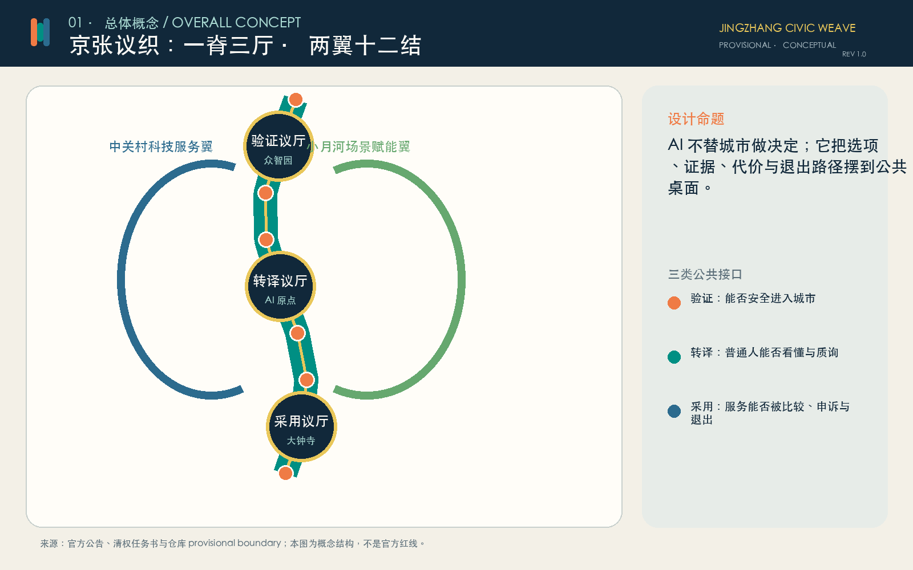
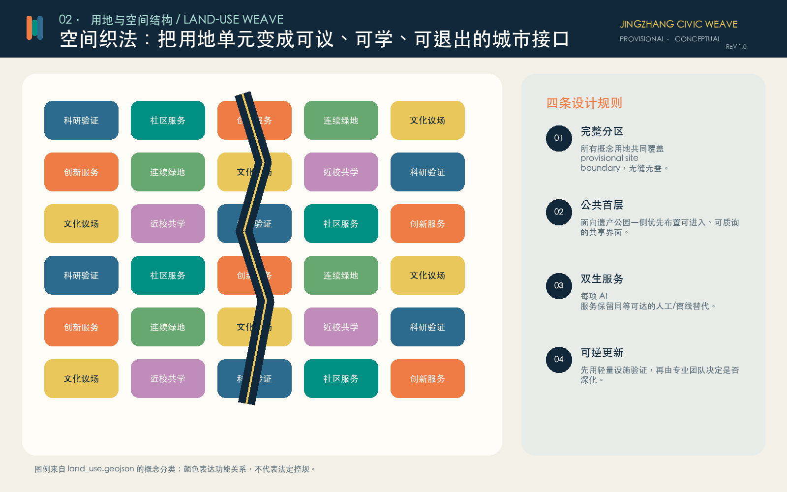
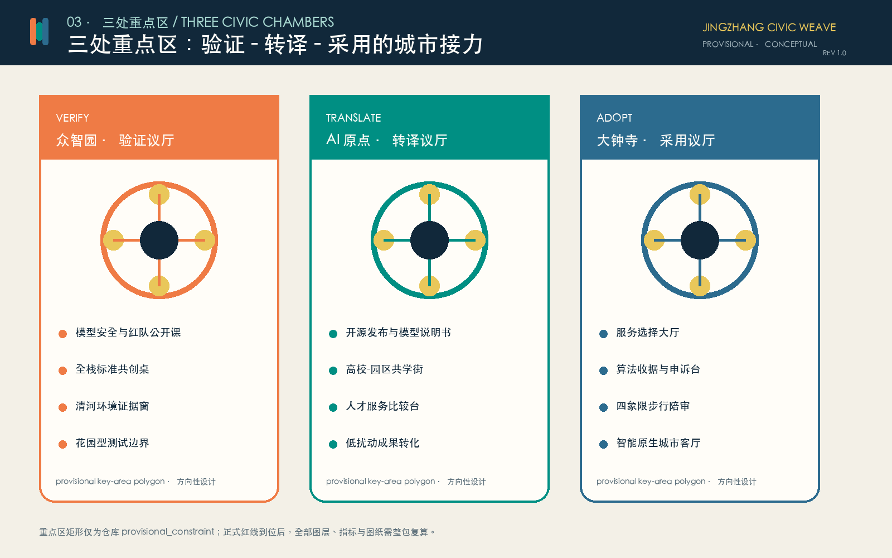
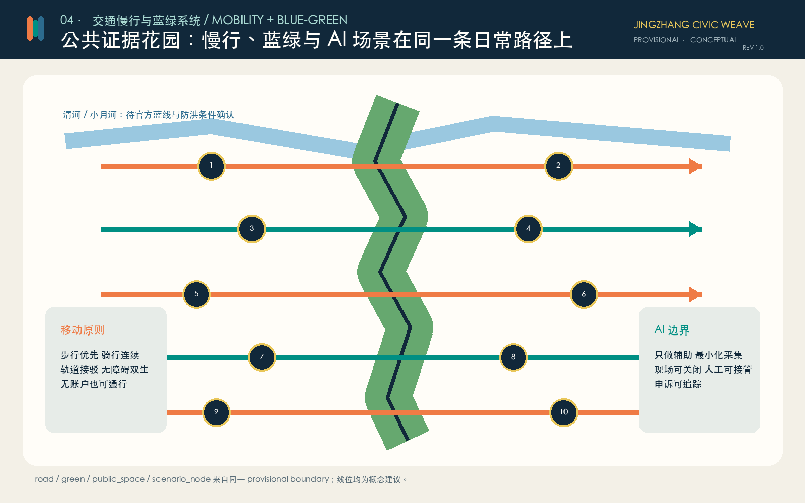
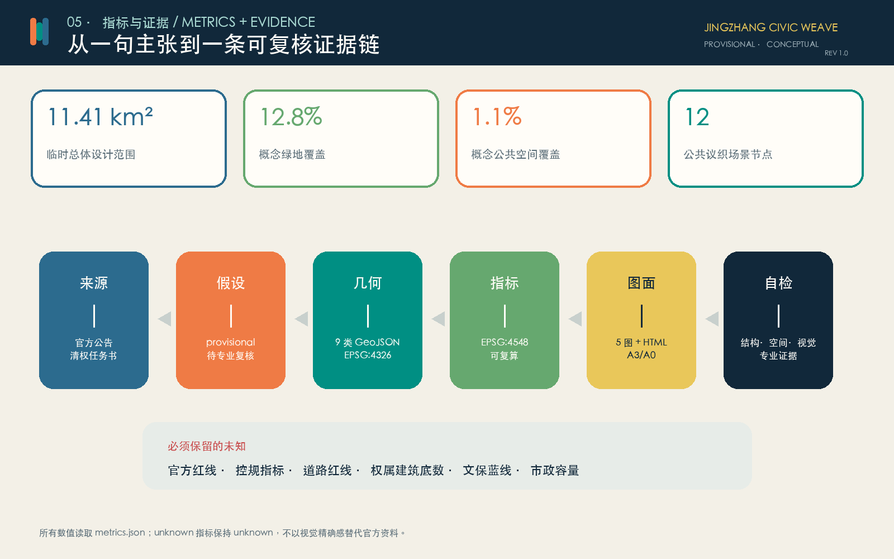

# 京张议织 JINGZHANG CIVIC WEAVE

> 把算法选择织进公共协商。AI 不替城市做决定；它把选项、证据、代价、责任和退出路径摆到公共桌面。

版本 v1.1 已完成中文字体、A3/A0 版式与离线展示的视觉校对。

## 设计依据与资料清单

本方案首先回应官方公告确定的三层范围、三处重点区域和 1.3-1.5 设计任务，并以面向智能体任务书的三大定位、五大功能、三区两翼和 agent.1-agent.6 为共创任务。[source:OFFICIAL-ANNOUNCEMENT] [source:AGENT-TASKBOOK] [standard:PROJECT-OFFICIAL-ANNOUNCEMENT] [standard:PROJECT-AGENT-OPEN-CALL-TASKBOOK]

机器证据来自仓库 site package、来源登记表和处理事实包；处理文件只作阅读导航，不升级为新权威。[source:SITE-PACKAGE] [source:SOURCE-REGISTRY] [source:PROCESSED-FACT-PACK]。城市设计、控规深度和用地术语分别参考本地标准快照：[standard:MOHURD-URBAN-DESIGN-MEASURES] [standard:MOHURD-CONTROL-DETAILED-PLANNING] [standard:MNR-LAND-USE-CLASSIFICATION-GUIDE]。建筑工程设计深度文件尚无可用官方正文，因此仅保留缺口，不冒充权威依据。[standard:MOHURD-ARCH-DESIGN-DEPTH-2016]

当前仓库没有官方精确红线。`site_boundary.geojson` 与三个 `KEY_AREA` 采用维护者登记的临时粗略 polygon，属性为 `official_boundary=false`、`geometry_role=provisional_constraint`。[source:BOUNDARY-SOURCE] [source:KEY-AREA-SOURCE] [data:geometry/site_boundary.geojson#SITE-001] [data:geometry/key_areas.geojson#PROV-KEY-001]。它们可以支撑投稿生成、拓扑自检和视觉讨论，不能支撑官方红线、精确面积、权属、控规或工程结论。官方 polygon 到位后，边界、用地、建筑、道路、绿地、公共空间、场景、分期、指标、图片、HTML 和 PDF 必须整包重算。[depth:existing_conditions_diagnosis] [depth:risk_missing_data]

本方案新增六个外部案例，只作为方法背景：Barcelona 22@ 的城市、经济与社会更新；STATION F 的遗产建筑复用与一站式创业服务；Helsinki AI Register 的公共透明和反馈；UK AISI 的模型测试研究；NIST AI RMF 的全生命周期风险管理；Singapore AI Verify 的技术测试与过程检查。[source:CASE-22BARCELONA] [source:CASE-STATION-F] [source:CASE-HELSINKI-AI-REGISTER] [source:CASE-UK-AISI] [source:CASE-NIST-AI-RMF] [source:CASE-SINGAPORE-AI-VERIFY]。这些案例不等于北京政策，不提供项目红线，也不构成对具体机构或供应商的推荐。

## 三层范围工作框架

三层范围不是三张孤立图，而是一条从战略判断到空间检验的证据链。[depth:three_level_scope_framework]

| 层级 | 已知任务 | 京张议织的工作方式 | 权威边界 |
| --- | --- | --- | --- |
| 43.6 km² 统筹研究范围 | 三区两翼、AI 生态、未来城市与全球协作 | 建立“验证-转译-采用”创新接力和两翼支撑机制 | 公告面积与文字四至可用；polygon 临时 |
| 约 11.4 km² 总体设计范围 | 城市更新、用地、交通、市政、蓝绿、风貌和实施 | 一条公共证据主脊、七条东西缝合线、完整概念用地与三期实施 | [data:geometry/site_boundary.geojson#SITE-001] 为 provisional |
| 368.4 ha 重点区域范围 | 三处片区详细设计 | 众智园验证议厅、AI 原点转译议厅、大钟寺采用议厅 | [data:geometry/key_areas.geojson#PROV-KEY-001] 至 `003` 均为 provisional |

总体结构为“一脊三厅、两翼十二结”。一脊是京张遗址公园上的“公共证据主脊”；三厅分别把模型从实验室带到日常生活；两翼连接中关村科技服务与小月河场景赋能；十二结把透明、质询、人工接管和退出做成可进入的公共节点。[depth:overall_spatial_structure] [data:geometry/roads.geojson#ROAD-001] [metric:scenario_node_count]

## 统筹研究范围产业与未来城市研究

### 名称、Logo 与识别系统

主名称为“京张议织”，英文名为 `JINGZHANG CIVIC WEAVE`。`议`强调公共讨论与人类最终判断，`织`强调把铁路遗产、产业链、公共生活和治理协议织在一起。Logo 由橙、青、蓝三条错位竖带构成：橙色代表质询，青色代表协作，蓝色代表证据；三条线既像轨道，也像编织经线。识别系统使用自绘几何和系统字体，不复制企业商标。

三大定位被转译为三条可执行的线：百年京张文化带是“记忆线”，都市 AI 生活体验带是“选择线”，AI 融合创新带是“证据线”。五大功能则进入三厅两翼：全栈自主创新与 AI 治理在众智园验证，世界级创新生态在原点社区转译，AI+ 场景与活力城市在大钟寺采用，中关村翼补足法务、资本与服务，小月河翼承担公共场景和生活反馈。这些都是概念性组织，不是机构分工或政府承诺。

### 六个全球案例与可转化机制

| 案例 | 可取机制 | 京张转化 | 保留的警惕 |
| --- | --- | --- | --- |
| Barcelona 22@ [source:CASE-22BARCELONA] | 更新与创新生态并行 | 用地织补同时回应产业、社区和公共空间 | 不照搬空间强度或开发政策 |
| STATION F [source:CASE-STATION-F] | 历史建筑、创业服务与活动集中 | 原点社区设置开放转译、导师和成果发布接口 | 不承诺企业、投资或规模 |
| Helsinki AI Register [source:CASE-HELSINKI-AI-REGISTER] | 城市 AI 系统公开说明并接受反馈 | 每项公共 AI 配“算法收据”和公众反馈入口 | 透明页面不能替代问责和申诉 |
| UK AISI [source:CASE-UK-AISI] | 模型能力、风险与缓解措施的技术研究 | 众智园设置隔离测试、红队和专业放行 | 测试不等于绝对安全 |
| NIST AI RMF [source:CASE-NIST-AI-RMF] | Govern-Map-Measure-Manage 生命周期 | 场景从治理、情境、度量到处置逐步放行 | 自愿框架不替代中国法律标准 |
| Singapore AI Verify [source:CASE-SINGAPORE-AI-VERIFY] | 技术测试和过程检查共同验证主张 | 将“系统声称什么”与“测试显示什么”并列展示 | 通过测试不保证无风险无偏差 |

因此，世界级 AI 生态不只追求企业数量，而是具备五个公共能力：可验证的模型、可转译的成果、可比较的服务、可追责的运营和可积累的开放知识。土地、空间、产业、资金、人才、算力、数据和场景八类要素都必须留下来源、权限与退出条件，不能以招商愿景替代事实。[depth:overall_spatial_structure]

## 总体设计范围城市更新与控规深度城市设计

总体空间把细长的 provisional site 划分为拓扑连续的概念用地单元，并以公共证据主脊连接三处重点区域。[data:geometry/land_use.geojson#LU-001] [depth:land_use_layout]。用地采用标准代码 `05/0701/0702/0802/0803/0804/1401/1403`，但仅表达功能关系，不能解释为已批用途。[standard:MNR-LAND-USE-CLASSIFICATION-GUIDE]

建筑图层由概念性参考基底组成，分为 `retain_candidate`、`renovate_candidate` 和 `new_build_reference`，用于测试公共首层、空间容量和步行界面。[data:geometry/buildings.geojson#BLDG-001]。由于缺少现状建筑、权属、层数、年代与安全评估，任何单体的拆改留都不是结论。[depth:retain_renovate_demolish]。容积率、建筑高度、建筑密度控制值和退线保持待确认；本方案只提出“遗产主脊低扰动、重点节点可识别、街道界面可进入、屋顶设备集约隐藏”的方向。[depth:development_intensity_controls] [depth:height_massing_character]

交通系统以步行、骑行和轨道接驳为首要对象：南北公共证据主脊连接三厅，七条东西“议事缝合线”连接社区、园区与服务翼。[data:geometry/roads.geojson#ROAD-001]。它们不是道路红线或工程线位；五道口、清华东路西口、大钟寺站和跨环路节点必须在官方道路、轨道、市政和现场数据到位后由专业团队深化。[depth:traffic_rail_slow_parking]

新型基础设施不被理解为遍布摄像头，而是四类可控接口：可关闭的端侧计算柜、公开用途的数据授权台、人工接管席和服务恢复/退出工具。分布式能源、排水、防洪、消防和算力负荷仅提出体系建议，不做容量结论。[depth:municipal_new_infrastructure] [data:geometry/constraints.geojson#SCENARIO-01]

## 重点区域详细设计

### 众智园 AI 自主创新加速区：验证议厅

定位为“技术进入城市之前的公共验证门”。空间结构由安全验证花园、红队公开课、标准共创桌和清河环境证据窗构成。[data:geometry/key_areas.geojson#PROV-KEY-001]。产业团队在隔离环境中测试模型能力、滥用风险、稳健性和人类接管；公众看到的是测试问题、适用边界和仍未解决的风险，而不是宣传性分数。清河界面采取低扰动花园式公共空间，涉及河道蓝线、防洪和生态要求的内容全部待专业核查。

### 北京 AI 原点社区：转译议厅

定位为“让研究成果、规则与城市需求互相读懂的近校型街区”。核心包括开源发布议场、模型说明书长廊、成果转译门诊、AI 教育共学桌和人才服务比较台。[data:geometry/key_areas.geojson#PROV-KEY-002]。校区、园区和街区通过概念慢行缝合线连接；建筑更新优先利用可逆的首层空间和预约共享，不预设拆除或增量规模。每项成果必须说明训练/评测范围、不可用情形、责任人和撤回方式。

### 大钟寺 AI 产业聚集区：采用议厅

定位为“城市在采用 AI 服务之前公开比较与质询的会客厅”。大钟寺选择大厅并列展示 AI、人工和离线方案；算法收据驿站交付用途、数据、自动化程度、责任、申诉和退出说明；四象限步行陪审由残障使用者和日常通勤者主持路线体验。[data:geometry/key_areas.geojson#PROV-KEY-003]。轨道站点连通、路口工程、非机动车组织和企业周边更新均需交通、市政、权属与安全复核。

三处片区的共同成果不是统一形象，而是一套可接力的公共协议：众智园回答“能不能进入城市”，原点社区回答“普通人能不能理解和质询”，大钟寺回答“采用后能不能比较、申诉和退出”。[depth:three_key_area_detailed_design] [metric:key_area_count]

## AI 创新生态、人才画像与 AI+ 场景

### 六类用户画像

| 用户 | 关键需求 | 空间回应 | 防护边界 |
| --- | --- | --- | --- |
| 模型研究者与安全评测者 | 隔离测试、基准、同行复核 | 众智园验证议厅 | 数据授权、红队隔离、专业放行 |
| 开源开发者与初创团队 | 发布、协作、法务、转化 | 原点开源议场与成果门诊 | 不以贡献排名替代真实能力与公共价值 |
| 周边居民与家庭 | 可达服务、安静环境、知情选择 | 社区服务比较台和非数字替代 | 不做个人画像营销，不默认采集 |
| 教师、学生与高校团队 | AI 素养、科研转化、学习自主 | AI 教育共学桌 | 教师和学生保留最终判断与拒绝权 |
| 公共服务人员与运营者 | 责任分工、接管、恢复、退场 | 算法收据与人工接管席 | 不让自动化遮蔽责任或压缩人工服务 |
| 国际访客、老年人和残障使用者 | 多语、无障碍、低门槛、可求助 | 无障碍路线陪审和选择大厅 | 无账户可通行，人工帮助同等可达 |

### 十二张场景卡

所有场景均为概念试点，通用闸门是：自愿进入、数据最小化、公开说明、人工复核、非数字替代、可申诉、可暂停和可退出。[data:geometry/constraints.geojson#SCENARIO-01] [metric:scenario_node_count]

| ID | 场景与空间 | 服务对象 / 运行数据 | 人工复核与退出 |
| --- | --- | --- | --- |
| SC-01★ | 众智园模型安全红队公开课 | 研究者；隔离测试集和攻击记录 | 专业主持决定放行，失败结果保留，测试可停止 |
| SC-02★ | 众智园标准共创桌 | 开发者、监管研究者；标准草案和异议 | 记录分歧，不自动形成标准或审批 |
| SC-03★ | 清河环境证据窗 | 环境专业人员和公众；公开环境数据 | 生态、防洪专业人员解释，传感可关闭 |
| SC-04 | 原点开源发布议场 | 高校与初创；代码、模型卡、许可证 | 维护者与领域专家复核，可撤回版本 |
| SC-05 | 成果转译门诊 | 居民、企业、法务；用户自愿提供的问题 | 人工顾问负责解释，问题可匿名/删除 |
| SC-06 | AI 教育共学桌 | 教师、学生、家长；课程材料和反馈 | 教师最终判断，保留完全非 AI 教学路径 |
| SC-07 | 城市服务比较台 | 居民与服务人员；聚合时效、成本、申诉数据 | 人工核验口径，服务可回到人工渠道 |
| SC-08 | 无障碍路线陪审 | 残障使用者、老年人；自愿路线观察 | 使用者主持评价，不采集人脸与连续轨迹 |
| SC-09 | 算法收据驿站 | 所有公共服务使用者；用途、数据、责任元数据 | 现场可咨询、申诉、导出和退出 |
| SC-10 | 大钟寺选择大厅 | 居民、企业、访客；方案比较记录 | 不默认绑定，人工/离线方案同屏 |
| SC-11 | 夜间活力守望 | 运营与夜间使用者；聚合照度、噪声、客流 | 人类负责安全判断，拒绝个体追踪 |
| SC-12 | 百年贡献索引 | 开发者、居民、专业团队；可验证贡献与失败教训 | 不做个人信用评分，可更正、撤回和申诉 |

带 ★ 的 SC-01、SC-02、SC-03 是三类产业测试验证场景；它们验证的是可重复的技术和治理问题，不代表已批准运营。

## 用地、建筑规模与拆改留方案

概念用地由 28 个裁剪单元构成，共同覆盖 submitted provisional boundary，不留未标注空间，也不重叠。八类用地面积均从 `land_use.geojson` 在 EPSG:4548 下复算：[metric:land_use_05_area_sqm] [metric:land_use_0701_area_sqm] [metric:land_use_0702_area_sqm] [metric:land_use_0802_area_sqm] [metric:land_use_0803_area_sqm] [metric:land_use_0804_area_sqm] [metric:land_use_1401_area_sqm] [metric:land_use_1403_area_sqm]。这些数值只描述本次概念分区，不能当作法定用途比例。

建筑参考基底合计约 68.94 万平方米，占临时总体范围约 6.04%。[metric:building_footprint_area_sqm] [metric:building_density]。该比例只反映示意基底在 provisional geometry 上的几何结果；由于没有层数、现状轮廓和官方强度，`total_floor_area_sqm`、`floor_area_ratio` 和 `building_height_m` 保持 unknown。拆改留方法是“先核查、再分类、再试点”：有文化/结构价值者优先保留；界面封闭但结构可用者可讨论可逆改造；新建只在正式控规、权属和承载复核通过后研究。[depth:retain_renovate_demolish]

## 交通、轨道、市政与公共服务设施

概念慢行网络总长约 17.73 km，由一条南北主脊和七条东西缝合线组成。[metric:road_network_length_m] [data:geometry/roads.geojson#ROAD-001]。道路面积保持 unknown，因为没有官方道路红线和断面。设计优先级为：连续步行与骑行、无障碍双生路径、轨道站点接驳、非机动车停放、再到机动车组织。任何桥隧、跨环路、站点改造或路口工程都需要专业论证。

公共服务设施采用“四件套”：服务说明书、人工接管席、非数字替代和退出工具。新型基础设施采用可关闭端侧节点、最小化数据接口和可维护模块，不将持续感知设为默认。能源、供水、排水、消防、通信和算力负荷属于待补工程条件。[depth:municipal_new_infrastructure]

## 蓝绿空间、公共空间与城市风貌

绿地概念面积约 146.33 万平方米，约占临时总体范围 12.82%；公共空间节点约 12.09 万平方米，约占 1.06%。[metric:green_space_area_sqm] [metric:green_ratio] [metric:public_space_area_sqm] [metric:public_space_ratio] [data:geometry/green_space.geojson#GREEN-001] [data:geometry/public_space.geojson#PUBLIC-001]。它们由遗产公园主脊、三座重点区花园和十二个小尺度议织节点构成，重点不是铺设智能设备，而是提供可坐、可问、可比较、可求助的公共界面。[depth:blue_green_public_space]

城市风貌以“工业记忆的克制骨架 + 中关村开放创新的可读界面 + AI 时代可质询的公共符号”为基调。所有新增设施优先采用可逆、耐久、可维修构件；夜间照明不制造持续刺激；Logo 与导视不混用企业标志。

四处 AI 朝圣/荣誉节点为：

1. **百年贡献索引**：把可验证贡献、失败教训和修订记录按时间展开，不做个人信用评分。
2. **模型说明书长廊**：以普通语言展示用途、限制、数据、责任与撤回机制。
3. **算法收据驿站**：用户当场获得服务说明、申诉与退出路径。
4. **城市选择大厅**：并列体验 AI、人工和离线服务，公开比较而非默认绑定。

文化叙事从 1909 年京张铁路的自主工程实践，走向中关村的开放创新，再走向 AI 时代“人类保留最终判断”的公共能力。所有节点都是参考方案，文保范围、蓝绿控制和工程位置待官方资料确认。

## 更新项目清单、实施政策与分期计划

分期图层以三段 provisional geometry 表达“先织接口、再织协作、形成长期网络”，总面积与 submitted boundary 的微小数值差异来自投影和切割计算，需要正式边界后复核。[data:geometry/phasing.geojson#PHASE-001] [metric:phase_area_sqm] [depth:phasing_implementation]

| 项目 | 阶段 | 内容 | 前置条件 |
| --- | --- | --- | --- |
| CW-01 算法收据最小原型 | 近期 | 统一用途、数据、责任、人工接管、申诉和退出字段 | 公共服务主管、法务、无障碍和隐私评审 |
| CW-02 公共证据主脊走查 | 近期 | 与居民、残障使用者、园区运营共同识别断点 | 现场核查、交通安全、文保和公园管理 |
| CW-03 三座议厅轻量试点 | 近期-中期 | 临时展陈、工作坊和人工服务，不先建永久建筑 | 权属、消防、运营主体和撤场计划 |
| CW-04 东西议事缝合线 | 中期 | 慢行、导视、休憩和轨道接驳概念深化 | 道路红线、站点、市政与交管资料 |
| CW-05 公共证据花园 | 中期 | 蓝绿空间、公开数据解释和低扰动活动 | 蓝线、绿线、文保、防洪与生态评估 |
| CW-06 城市 AI 议会周 | 长期运营 | 全球案例、红队演练、公众陪审、开发者大会 | 活动许可、安全、国际合作与独立评估 |
| CW-07 开放基准与贡献索引 | 长期运营 | 可复现任务、失败档案、版本治理和署名 | 持续维护、许可证、纠错与撤回机制 |

年度运营建议包括春季“城市出题”、夏季“众智验证周”、秋季“原点开源节”、冬季“大钟寺采用议会”。开发者社区以维护而非热度为核心；场景开放实行任务公告、伦理/专业预审、隔离测试、小规模试点、公众反馈、年度复评和退出归档。国际传播统一说明 `submitted / reviewed / selected / implemented` 四种状态，不把投稿写成入选或落地。[depth:renewal_project_list]

## 指标体系、面积复算与合规矩阵

总体临时边界复算为 11,412,825.386 m²，与公告“约 11.4 km²”接近，但不能借面积拟合升级为官方红线。[metric:site_area_sqm]。建筑基底、绿地、公共空间、道路长度、场景数量和分期均由对应 GeoJSON 复算；known 指标是提交几何的确定结果，不是法定规划结论。[depth:metrics_recalculation]

证据链分六级：`sources.json` 说明资料能做什么；`assumptions.json` 说明缺什么；GeoJSON 记录空间；`metrics.json` 记录公式；图片、HTML 和 PDF 解释设计；`self_check.json` 记录机器检查。authority 顺序以结构化数据为先，视觉不能覆盖机器数据。

合规矩阵覆盖公告 1.3.1-1.3.3、1.4.1-1.4.3、1.5.1.1-1.5.3.3 与 agent.1-agent.6；专业矩阵覆盖全部 mandatory standards；深度矩阵覆盖现状诊断、三层范围、总体结构、用地、强度缺口、形态、拆改留、交通、市政、蓝绿、三处重点区、项目、分期、指标和风险。`PASS` 只表示可进入内容评审，不代表优秀、入选、批准或可施工。

## 风险、版权与合规说明

1. **边界风险**：总体和重点区均为 provisional；禁止官方红线、精确面积、审批或权属解释。
2. **控规风险**：容积率、高度、密度、退线和建筑控制线缺失；所有强度与形态只作概念建议。
3. **现状风险**：缺建筑、地块、权属、公共服务底数；参考基底不代表拆改留结论。
4. **交通市政风险**：缺道路红线、断面、站点接口、管线、消防、防洪和能源容量；禁止工程可行性结论。
5. **文保生态风险**：缺完整文保、蓝绿控制 GIS；公共空间和地标采用低扰动原则并等待专业复核。
6. **AI 风险**：场景必须自愿、最小化采集、人工复核、非数字替代、申诉和退出；不得用公共空间进行隐蔽追踪或社会评分。
7. **版权风险**：核心图由提交数据本地生成，不使用商业地图、新闻图片、人物肖像、企业商标或未清权素材。生成工具与字体说明见 `report/copyright_statement.md`。

本方案全部空间落地内容均为“概念建议”“参考方案”或“可供专业团队深化研究”。它不替代正式规划，不构成政府审定结论，不承诺投资、招商、建设、活动或政策安排。[depth:risk_missing_data]

## 参考资料

- [source:OFFICIAL-ANNOUNCEMENT] 官方公告本地快照与登记记录。
- [source:AGENT-TASKBOOK] 面向智能体的清权任务书摘录。
- [source:SOURCE-REGISTRY] 公开/清权/provisional 资料用途登记。
- [source:CASE-22BARCELONA]、[source:CASE-STATION-F]、[source:CASE-HELSINKI-AI-REGISTER]、[source:CASE-UK-AISI]、[source:CASE-NIST-AI-RMF]、[source:CASE-SINGAPORE-AI-VERIFY] 全球案例官方页面。
- 结构化证据：[data:geometry/site_boundary.geojson#SITE-001]、[data:geometry/key_areas.geojson#PROV-KEY-001]、[data:geometry/land_use.geojson#LU-001]、[data:geometry/buildings.geojson#BLDG-001]、[data:geometry/roads.geojson#ROAD-001]、[data:geometry/green_space.geojson#GREEN-001]、[data:geometry/public_space.geojson#PUBLIC-001]、[data:geometry/constraints.geojson#SCENARIO-01]、[data:geometry/phasing.geojson#PHASE-001]。
