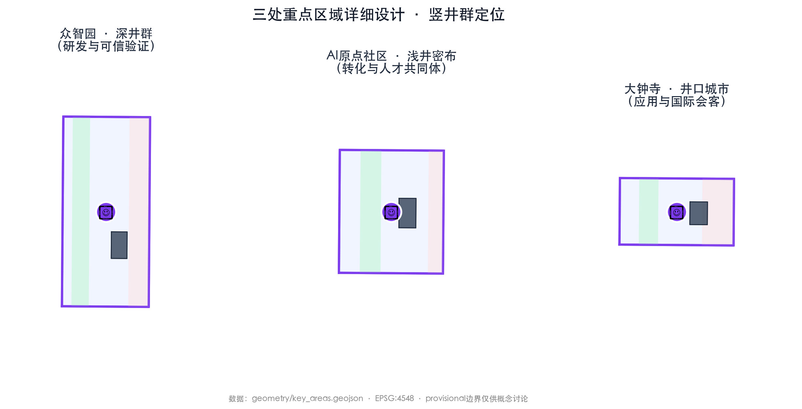
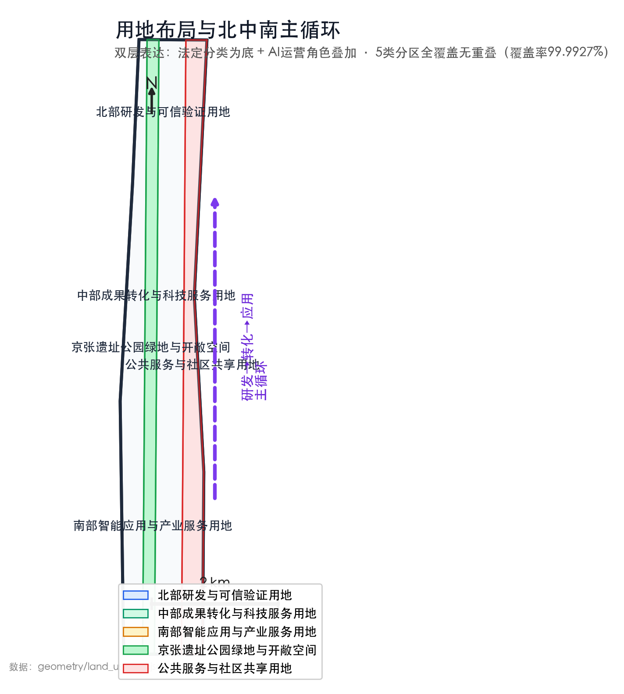

# 京张智脉 / Jing-Zhang AI Commons

> **把一条铁路遗产带，转化为一条人人可进入、创新可验证、失败可退出的 AI 城市公共基础设施。**

本方案为概念建议，不替代法定规划、专业设计、政府审定或项目审批，也不构成投资、建设与运营承诺。所有空间边界与复算数值均沿用现有资料包并保留其置信度标记；取得正式底图后须整体复核。

## 评审摘要

### 一句话方案

京张智脉不是沿线摆放 AI 装置，而是把“研发—验证—转化—应用—反馈”组织成一条城市创新闭环：北部众智园负责可信研发与测试，中部 AI 原点社区负责成果转化与人才服务，南部大钟寺负责城市应用与国际交流；京张遗址公园成为贯穿三处重点区的公共脊柱，科技服务翼和小月河社区生态翼持续输入专业能力与真实需求。

### 方案解决什么问题

AI 产业并不缺展示空间，真正稀缺的是低门槛、可信任的中途验证：研发成果难以进入真实城市，城市需求难以准确回到研发端，公众往往在系统上线后才被动承受风险。本方案以**中途验证密度**为主线统领空间、创新、公共价值和安全指标：让团队更早遇到用户、更早暴露问题、更早修正，也让居民在技术获得持续运行权之前就能知情、反馈和申诉。

中途验证密度不压缩成一个漂亮总分，而公开为四项可核验数据：一定步行时间内可到达的验证节点数、其中 L1/L2/L3 各有多少、节点覆盖的服务对象与设施类型、相邻节点之间的实际步行网络距离。它首先用于比较“哪里缺少中途工作面”和“新增节点是否真的可达”，不预设它与创新产出之间已经存在因果关系。

### 五个可被评审记住的设计承诺

1. **一条公共脊柱**：京张遗址公园首先是连续、无障碍、非消费性的公共空间，其次才承载 AI 场景。
2. **三个差异化节点**：众智园做研发验证，AI 原点社区做转化服务，大钟寺做城市应用，避免三区同质化招商。
3. **六类登记场景＋一项核心测试**：完整回应元数据登记的交通、文化、企业服务、公共安全、机器人和健康六类场景，并以开放模型评测突出产业验证能力。
4. **三级运行权限**：L1 公开说明、L2 受控测试、L3 边界内持续服务；任何场景都能暂停、回退或退出。
5. **一套公共账本**：按商定周期公开场景状态、验证周期、公共反馈、事件整改与退出结果，不以活动数量代替真实成效。

### 与常规“AI 园区”方案的区别

| 常规做法 | 京张智脉的选择 |
| --- | --- |
| 以企业入驻和设备展示定义创新 | 以成果能否被验证、复用和纠错定义创新 |
| 三个片区分别建设、分别招商 | 用同一条研发—转化—应用闭环组织分工 |
| 先建设完整空间，再寻找运营内容 | 先做可逆试点与公共底盘，以证据决定是否扩展 |
| 系统上线即视为“成熟” | 运行权限限时、限域、可撤销，持续服务也要复核 |
| 公众只作为体验者 | 公众同时是需求提出者、影响评估者和申诉者 |

## 设计依据与资料清单

本稿以现有项目包中的公告、任务书、临时边界、GeoJSON、指标和合规矩阵为依据。[source:OFFICIAL-ANNOUNCEMENT] [source:AGENT-TASKBOOK] [source:SOURCE-REGISTRY] 其中，公告和任务书用于确认目标、范围层级与成果任务；临时边界只用于概念表达与复算，不用于权属、退界、强度、征拆或工程判断。[source:BOUNDARY-SOURCE] [source:KEY-AREA-SOURCE]

证据包由 `sources.json`、`assumptions.json`、`metrics.json`、`compliance_matrix.json`、`standard_matrix.json`、`design_depth_matrix.json` 与 `geometry/*.geojson` 共同组成。当前最重要的资料缺口是正式红线、法定控规、现状建筑与权属、市政容量、道路红线、消防、文保、蓝线和防洪条件；这些未知项必须进入下一阶段任务书，不能被概念图替代。

## 三层范围工作框架

三层范围采用“战略—结构—节点”传导：

| 工作层级 | 约面积与作用 | 本方案交付重点 | 不在本阶段冒充的结论 |
| --- | --- | --- | --- |
| 统筹研究范围 | 约 43.6 km²；研究产业链、创新网络与区域协同 | 研发—转化—应用价值闭环、两翼支撑、跨机构协同 | 精确产业容量、投资承诺、正式空间边界 |
| 总体设计范围 | 约 11.4 km²；统筹更新、交通、蓝绿和公共服务 | 一脊三核、两翼多链，慢行与公共空间底盘 | 法定用地、开发强度、道路和市政工程方案 |
| 三处重点区域 | 合计约 368.4 ha；形成可继续深化的场景设计 | 众智园、AI 原点社区、大钟寺的差异化项目包 | 地块权属、单体建筑方案、审批或建设时序 |

以上为公告约值；现有 polygon 复算值另存于 `metrics.json`，置信度为低，不与法定指标混用。[metric:coordinated_research_area_sqm] [metric:overall_design_area_sqm] [metric:key_detailed_design_area_sqm]

### 现状诊断：把事实、线索和假设分开

| 规划必答题 | 当前已知 | 下一阶段必须补齐 | 未补齐时的默认动作 |
| --- | --- | --- | --- |
| 范围与用地 | 公告的文字范围、约面积和三处重点区名称 | 正式红线、控规、现状地形和权属 | 不计算强度，不提出征拆或工程线位 |
| 城市更新 | 任务提出低效空间、校园街区融合和差异化更新 | 逐栋安全、使用、产权、历史与租赁调查 | 只提出保留/轻改/新建的判定流程 |
| 交通与公共空间 | 任务明确慢行、站点连通和非机动车秩序问题 | 入口级步行网络、过街、坡度、客流和无障碍调查 | 只形成断点台账与概念连接 |
| 市政与安全 | 需要兼顾传统设施和新型基础设施 | 水电热、排水、消防、通信、算力和运维容量 | 容量为 `UNKNOWN` 时不启动真实作用场景 |
| 文保与蓝绿 | 京张铁路文化、遗址公园、清河/小月河是核心语境 | 文保范围、建设控制地带、蓝线、行洪与生态条件 | 不提出地下、跨越或永久构筑物结论 |

## 统筹研究范围产业与未来城市研究

### 核心概念：竖井协同

“竖井”在本方案中不是地下工程，而是一个组织隐喻：长距离创新链通常只在起点研发、终点应用，中途缺少可进入的工作面；每增加一个公开、受控、可复核的中途节点，就能让更多团队并行测试，也能更早发现错误。为避免历史叙事失真，工程史类比须待铁路史与文保一手资料核实后再用于正式解说。

竖井协同落实为三条简单规则：

- **空间可进入**：每个节点都有清晰入口、公共说明、无障碍路径和线下服务，不把验证藏在封闭园区。
- **运行可分级**：场景从 L1 披露开始，具备空间、安全、数据和责任条件后才进入 L2/L3。
- **结果可回流**：验证结果、公众意见、事件和整改以统一口径返回研发端，失败不被隐去，退出也算成果。

品牌主名建议保留“京张智脉”，英文采用 **Jing-Zhang AI Commons**。中文强调百年基础设施持续输送创新动能，英文强调共同使用、共同治理和共同记忆。视觉母题采用“一轨多井”：一条连续轨线代表京张公共脊柱，沿线开口代表面向城市的验证工作面；正式 Logo、字体与色彩须另行原创或清权。

### 产业闭环与两翼支撑

北中南主循环为：**众智园研发 → AI 原点社区转化 → 大钟寺应用 → 社区与城市反馈 → 再研发**。科技服务翼提供知识产权、标准、人才、融资和国际协作；小月河翼提供居民议题、生态观察、服务评价和公共利益校验。两翼不是剩余空间，而是防止产业链自我循环的必要接口。

全球案例只作方法对标，不直接移植指标：Kendall Square 关注高校—产业步行联系，MaRS 关注成果转化服务，one-north 关注研发与生活复合，King’s Cross 关注遗产更新与公共空间，Paris-Saclay 关注跨机构协同，深圳南山关注产品化速度。下一阶段应使用一手资料比较其租金、公平、治理和可复制条件，而不是只比较形象。

## 总体设计范围城市更新与控规深度城市设计

总体结构为“**一脊三核、两翼多链**”。这一结构表达的是拓扑关系，不冒充精确总平：现有临时边界只能说明南北顺序，尚不足以确定两翼范围、横链数量、断点位置与工程线位。

- **一脊**：京张遗址公园公共脊柱，连续承载步行骑行、文化解释、非消费停留、公共服务和低风险 AI 体验。
- **三核**：众智园研发验证核、AI 原点社区转化人才核、大钟寺城市应用核。
- **两翼**：科技服务翼与小月河社区生态翼。
- **多链**：连接高校、社区、园区和轨道站点的东西向慢行与服务横链。

城市更新遵循“**公共底盘先行、存量空间优先、场景插件可逆、永久建设后决策**”。近期先解决遮阴、座椅、饮水、厕所、导视、无障碍、过街和非机动车秩序；AI 设备只能作为可关闭、可维护的小型组件叠加。任何试点退出后，普惠空间改善仍应保留。

总体层不直接给出容积率、高度或建筑总量，而提出下一步的控制方法：正式底图到位后，以公共空间连续性、交通与市政承载、文保视线、蓝绿安全和社区影响共同约束开发容量；“AI 产业需要”不能单独成为增加强度的理由。空间深化必须补齐五张关键图：现状资源与矛盾图、入口级慢行断点图、公共界面与首层类型图、市政/文保/蓝绿约束叠合图、三处重点区改造前后对照图。没有这五张图，方案不得以“控规深度城市设计”自居。

## 重点区域详细设计

下表中的三区分工来自任务书要求与整条创新闭环的方案推演，不是对现状产业、人口、客流或可用建筑的实测结论。[source:AGENT-TASKBOOK] 下一阶段须分别用机构与企业名录、建筑使用调查、站点客流、慢行网络和公共空间台账验证其适配性；若证据不支持，应调整项目组合，而不是维护概念完整性。

| 重点区 | 核心定位 | 空间锚点 | 首批可逆项目 | 面向公众的直接收益 | 不可越过的红线 |
| --- | --- | --- | --- | --- | --- |
| 众智园 AI 自主创新加速区 | 研发与可信验证核 | 开放工程院＋花园测试庭院 | 开放模型评测、机器人低速测试、共享中试接口、首层展廊 | 看得见测试边界、知道谁负责；公园游憩与测试物理/时段分离 | 无安全员接管、无急停、容量未知时不得进行真实物理动作 |
| 北京 AI 原点社区 | 转化与人才共同体核 | 开源客厅＋成果转化街区 | 企业服务助手、知识产权与法务门诊、青年协作空间、社区共用首层 | 居民和小商户可使用同一套服务；保留日常通行和可负担空间 | 不以“人才服务”封闭公共资源，不建立居民个人画像库 |
| 大钟寺 AI 产业聚集区 | 城市应用与国际会客核 | 站城客厅＋四象限慢行门户 | 无障碍慢行助手、京张文化导览、智能生活体验、国际协作会客厅 | 改善站点识别、非机动车秩序和不消费也可停留的城市客厅 | 不以企业展示替代公共空间，不模糊数据用途和投诉入口 |

三处重点区都必须保留 L1 公开界面、责任入口、线下替代服务和投诉通道。L2/L3 只授予具体场景和具体运行边界，不能把整个片区包装为“已验证园区”。

## AI 创新生态、人才画像与 AI+ 场景

### 五类服务对象

开发者需要共享工具、真实测试与可携带的验证记录；初创企业需要法务、知识产权、场地和首批用户；高校师生需要跨校协作与成果转化；居民和小商户需要安静、安全、便利、可负担的日常环境；国际人才和访客需要多语种、无障碍、家庭友好与可信服务。画像仅用于设计服务，不建立个人画像库。

### 六类登记场景与一项核心产业测试

| 场景 | 首选区域 | 核心价值 | 最小数据原则 | 人工与退出机制 |
| --- | --- | --- | --- | --- |
| 开放模型评测 | 众智园 | 降低中小团队评测门槛，形成可比较证据 | 只用授权模型、公开基准或明确许可数据 | 第三方复核争议；结果可更正，不等同安全认证 |
| 机器人低速测试 | 众智园受控庭院 | 验证端侧设备与真实环境适配 | 不默认采集人脸和无关轨迹 | 现场安全员、独立急停、越界即停、试点结束可撤场 |
| 企业服务助手 | AI 原点社区 | 串联政策、法务、知识产权和设施预约 | 只访问公开或授权文件，分场景授权 | 专业人员签核；提供线下窗口和人工转办 |
| 无障碍慢行助手 | 公共脊柱与东西横链 | 识别障碍、辅助路径选择、形成整改台账 | 自愿反馈，不做人脸识别，不持续跟踪个人 | 人工核验障碍；断网可用静态导视；错误路线可申诉 |
| 京张文化导览 | 遗址公园—大钟寺 | 把铁路、中关村与 AI 新文化连成可校正叙事 | 只使用清权史料和授权素材 | 史实编辑负责；显著纠错入口；未核实内容不作事实播报 |
| 社区健康导航 | AI 原点社区 | 帮助寻找服务，不替代诊疗 | 不诊断、不留存病历、最小化咨询内容 | 医护或人工客服最终判断；可匿名、可退出、可线下办理 |
| 公共安全运营复核 | 三处重点区公共节点 | 复盘活动人流、设备事件与应急响应，不作自动执法 | 以聚合统计和事件记录为主，不做无差别人脸布控 | 运营与安全责任人联合复核；发现风险时暂停相关能力 |

表中后六项分别对应前置元数据登记的六个标准场景 ID；“开放模型评测”是本方案为研发验证核增加的自定义产业测试项目，不冒充标准场景枚举。其余设想进入储备库，不以数量作为竞争力。涉及健康、教育、法律、交通、公共安全和公共资源的 AI 只能辅助决策；具有物理动作的系统必须在受控环境内运行并保留人工接管。

## 用地、建筑规模与拆改留方案

用地采用“双层表达”：下层沿用科研、教育、商业服务、社区服务、道路、公园绿地等法定分类；上层叠加研发、验证、转化、体验等运营角色，避免自造法定用地类别。产业与生活服务应在步行尺度内混合，并提供可短租、可分隔、可恢复的弹性单元。

建筑处置使用“**保留—轻改—整治—新建待定**”四类清单，但须先完成逐栋调查：

1. 有历史、公共或持续使用价值的建筑优先保留；
2. 结构与使用条件较好的空间优先轻改，先激活首层和公共界面；
3. 存在安全、消防或环境问题的对象经专项鉴定后整治；
4. 新建量仅在控规、权属、市政、生态和交通承载明确后论证。

当前不提供建筑面积、强度、高度或单体拆除清单。`buildings.geojson` 只表达示意基底，不是现状建筑数据库。[metric:building_footprint_area_sqm]

## 交通、轨道、市政与公共服务设施

交通优先序为“**轨道到达—步骑串联—公交接驳—服务车辆分时—测试车辆受控**”。南北公共脊柱负责连续体验，东西横链解决站点、校园、社区和园区之间的最后一公里。众智园重点复核五环与清河方向联系，AI 原点社区重点复核近校站点换乘，大钟寺重点复核四象限过街与非机动车秩序。桥隧、路口改造和道路断面仍须交通专项论证。

市政与数字基础设施分四层：安全底座（水、电、热、排水、消防）；边缘设施（通信、定位、充电、感知）；可信数据层（授权目录、访问日志、能耗计量）；服务接口层（预约、告知、事件上报、线下客服）。每个场景在进入 L2 前必须提交峰值负荷、现状余量、接入方式、失效安全态和运维责任。任一关键容量为 `UNKNOWN`，默认不启动真实主动能力。

## 蓝绿空间、公共空间与城市风貌

京张遗址公园首先是一条日常公共空间：连续绿荫、无障碍步道、骑行、饮水、卫生间、安静停留和儿童友好空间构成底盘。小月河翼承担生态与社区反馈，清河方向强化北段研发区与滨水联系。正式文保、蓝线、绿地和防洪条件未确认前，不提出跨越、地下或永久构筑物判断。

三处贡献节点不做超尺度地标：北部“开放评测里程碑”展示可复核的技术贡献；中部“中关村贡献谱”记录开源、标准和公共服务；南部“全球协作会客厅”承载持续交流。贡献记录须授权、可更正、可撤回；导视使用轨枕节奏、里程刻度和开放括号，中文为主并提供英文与无障碍信息。

## 更新项目清单、实施政策与分期计划

分期采用“证据阶段”而非假定批准年份或启动后月数。每一阶段都设置进入门槛和退出动作，避免一张总图被误读为既定建设计划。

| 阶段 | 重点项目包 | 可交付成果 | 进入下一阶段的硬门 | 失败后的保留项 |
| --- | --- | --- | --- | --- |
| 阶段一：校准与公开 | 正式边界和底图补齐；建筑/遗产/慢行/容量台账；三处 L1 公开界面；社区议题征集 | 一张可信底图、四类基线台账、登记场景与核心测试清单、责任与投诉入口 | 边界、权属、文保、蓝绿、消防、市政和公众影响均形成可核验记录 | 保留调查成果、导视、座椅、遮阴和慢行问题清单 |
| 阶段二：三点试验 | 众智园开放评测；原点企业服务；大钟寺慢行与文化导览。机器人低速测试仅在安全与容量前提完整时进入 | 每区优先形成一个边界清晰的 L2 试点、公共账本、独立复核与回滚演练 | 观察窗口闭合，无未结关键事件，容量与安全持续有效，公众影响复核通过 | 撤销运行权限、拆除插件，空间退回普通公共用途 |
| 阶段三：跨区协同 | 设施预约、证明互认、知识贡献、公众反馈与绩效公开 | 跨三区协作接口；仅成熟场景进入 L3；形成可复制的节点手册 | 验证周期缩短、证据复用增加且治理健康未恶化 | 退回 L2/L1 或退役；普惠公共空间继续保留 |

建议采用“五方责任制”：公共部门确认政策与公共底线；片区运营方管理空间与设施；场景责任方承担产品和事件责任；独立验证方复核证据；社区与受影响者参与议题、评价和申诉。资金组合可由公共底盘投入、共享服务收入和社会合作构成，但基础投诉、公共知情和安全复核不得依赖付费。

各阶段没有预设批准年份或固定工期。阶段一完成基线、预算、团队与审批路径后，再由责任主体确定日历计划；进入下一阶段只看证据门，不因时间到期自动升级。年度运营可采用“四季一账本”：春季开源维护，夏季城市验证，秋季 Jing-Zhang AI Commons Week，冬季公共价值复盘。活动必须回到项目、证据与整改，不以峰值人流或媒体曝光作为唯一绩效。

## 指标体系、面积复算与合规矩阵

### 评审看得懂的核心记分板

| 维度 | 核心指标 | 口径 | 首轮试点目标 |
| --- | --- | --- | --- |
| 空间 | 已复核慢行断点完成率；无障碍双入口覆盖率 | 完成复核点数/登记点数；具备线上和线下可用入口的节点/全部节点 | 阶段一建立基线；以后按公开周期披露分子、分母和未完成清单 |
| 创新 | 中位验证周期；跨节点证据复用率 | 从完整申请到状态决定的中位天数；复用有效证据的申请/全部申请 | 每区优先形成一个 L2 试点，验证周期较首批基线持续下降 |
| 公共价值 | 非消费开放时长达成率；公众问题响应率 | 实际开放/计划开放；在公开服务时限内首次回应的问题/有效问题 | 三处重点区均有非消费入口；先公布受理范围、服务时限、责任主体，再报告响应数据 |
| 安全治理 | 运行边界完整率；回滚演练通过率；申诉闭环率 | 要素齐全场景/活动场景；通过演练/应演练；按期结案/到期案件 | L2/L3 场景三项均须逐场景公开，关键缺失即暂停 |

现有面积、绿地、公共空间、慢行和分期指标均来自 provisional 图层，适合检查包内一致性，不适合作为现状绩效或法定目标。[metric:land_use_coverage_ratio] [metric:green_ratio] [metric:public_space_ratio] [metric:slow_mobility_network_length_m] [metric:slow_mobility_connectivity_ratio] 取得正式边界后应在同一投影与口径下整体复算，而不是只替换总面积。

专业响应与机器可读证据继续由 `compliance_matrix.json`、`standard_matrix.json` 和 `design_depth_matrix.json` 管理：[standard:PROJECT-OFFICIAL-ANNOUNCEMENT] [standard:PROJECT-AGENT-OPEN-CALL-TASKBOOK] [standard:MOHURD-URBAN-DESIGN-MEASURES] [standard:MOHURD-CONTROL-DETAILED-PLANNING] [standard:MNR-LAND-USE-CLASSIFICATION-GUIDE]

## 京张验证协议（JZ-VP）：从机制到协议

JZ-VP 不是一条区块链，也不是新的审批制度；它是一套跨节点通用的场景记录格式，让“谁负责、验证什么、允许做什么、失败怎么退”能够被复核。低风险场景优先使用普通表单、文件摘要和人工签章，不为技术完整性增加不必要负担。

### 最小五张单

1. **场景清单**：责任主体、制品版本、影响对象、时空与数据边界；
2. **标准清单**：测试前冻结通过条件、失败条件和缺失值处理；
3. **证据目录**：记录证据来源、时间、保管者和访问级别；
4. **状态与权限单**：记录 L1/L2/L3、有效期、运行范围和可撤销权限；
5. **异议与回滚单**：记录投诉、急停、安全态、整改和退出结果。

### L1/L2/L3 运行权限

| 等级 | 可以做什么 | 升级前必须证明什么 | 失效时默认动作 |
| --- | --- | --- | --- |
| L1 公开披露 | 说明、离线演示、公众咨询，不产生真实城市作用 | 责任人、用途、版本、边界、投诉入口清楚 | 更正或撤回说明 |
| L2 受控测试 | 在限定人群、空间、时段、数据和人工接管条件下测试 | 专业前提、预登记标准、数据最小化、急停和回滚演练齐全 | 立即暂停，退回 L1 或整改后重测 |
| L3 边界内持续服务 | 在有效证明所列包络内提供持续服务 | L2 观察窗口闭合、独立复核通过、事件整改完成、条件持续有效 | 撤销能力租约，退回 L2/L1 或退役 |

PoV（Proof of Verification）只证明某一版本在某一边界内获得了哪些证据与责任签署，不是安全证书，也不替代法定审批。场景版本、运行范围、数据用途或责任主体发生实质变化时，必须重新验证。

## 城市验证经济学：把“创新快”改写为“纠错早”

本方案不以企业数量和活动场次作为唯一竞争力，而观察四件事：

- **验证能力 VCI**：场地、人才、设备、专业服务和公共反馈是否真正可用；
- **验证密度 VDR**：可达节点数量、等级和步行可达性是否提高；
- **信任飞轮 TFC**：一处形成的有效证据能否被另一处复用，从而减少重复审查；
- **纠错成本曲线**：问题是在 L1/L2 早期被发现，还是到 L3 后才造成更高社会成本。

这些指标在没有真实基线前只作为观测框架，不生成综合排名。首轮试点最重要的经济目标不是把分数做高，而是让验证周期缩短、证据复用增加、晚期失败减少，并同步公开团队、社区与管理者承担的时间和费用。VCI、VDR、TFC 是证据包中的技术简称；面向公众发布时优先使用中文全称与原始分子、分母。

## 竖井空间语法：把治理要求翻译成城市体验

“竖井”只保留为总体概念，不再要求公众记忆七套部件名称。每个节点在空间上只需回答四件事：**从哪里进入**（公众入口与告知）、**在哪里测试**（与必经路分离的受控区）、**在哪里复核**（议事、人工服务与证据展示）、**退出后留下什么**（遮阴、座椅、饮水、无障碍等公共底盘）。

组合规则同样只有四条：先做公共底盘，再装技术设备；L2/L3 必须清楚显示责任、状态和人工接管；测试区与公众必经路分离；临时构件可以拆除，退出后不损害基本公共空间。井口、井筒等术语只作为设计团队内部的构件索引，不进入面向公众的主要导视。

## 协议治理与防滥用

治理先固定五项不可让渡的公众权利：知情与解释、最小必要数据、人工复核、无报复申诉、能力撤销与现实补救。规则制定、设施运营、场景申请、独立复核和申诉裁决不得由同一主体包办。

L1/L2/L3 是 JZ-VP 内部的运行状态，不是行政许可。规划、建设、文保、消防、数据和行业事项仍由法定主体决定；协议运营方只能在法定前提内记录、暂停或撤销其设施和系统所提供的能力，不能替代行政机关授权。试点启动前，应由公共部门牵头确定运营主体、通过公开程序形成独立验证名册和回避规则，并落实基础运维、申诉与复核经费；这些条件未落实时只开展 L1。

建议采用三级争议机制：运营方内部复议解决记录与程序错误；独立专家组处理专业证据争议；包含社区和公共利益代表的申诉委员会处理基本权利、系统性冲突和广泛影响。出现可信、紧迫的安全风险时立即暂停受影响能力；一般隐私、歧视或程序异议先冻结升级和扩围，由受理人按公开分级规则判断是否暂停现有服务，防止投诉被忽视，也防止机制被滥用。外部行政、行业和司法救济始终保留。

协议每次修订都应公开变更理由、利益冲突、影响评估、生效和退出时间。费用、评测和专家网络应接受成本、关联关系与公平接入审查；不能让验证变成只对大企业可负担的“入场税”，也不能让投诉者承担证明运营方所保管事实的全部成本。

## AI 原生性与可复核机制

- **一份数据驱动多种成果**：GeoJSON、EPSG:4548 复算、图件、HTML 与图纸使用同一数据源，减少图数不一致。
- **关键判断可追溯**：正文使用 `[source:]`、`[standard:]`、`[depth:]`、`[data:]` 和 `[metric:]` 标签连接来源、标准、图层与口径。
- **未知值不被填成答案**：边界、容量、文保、消防和权属等关键前提保留 `UNKNOWN`，并转化为下一阶段任务。
- **AI 参与有责任边界**：AI 可辅助生成、整理、仿真和导航，但外部事实、专业判断和高影响决定必须由责任人复核。
- **退出也形成知识**：暂停、回滚、纠错和退役结果进入公共账本，使失败成为下一轮设计的证据，而不是被删除的负面记录。

## 风险、版权与合规说明

| 主要风险 | 预防措施 | 触发后的动作 |
| --- | --- | --- |
| 临时边界被误读为正式红线 | 图文持续标记 provisional、来源和置信度 | 正式边界到位后整体替换并复算 |
| 技术测试影响公共安全 | L2/L3 分级、专业复核、人工急停与隔离 | 立即暂停、保留证据、补救并重新验证 |
| 数据采集超出必要范围 | 最小字段、用途限定、分级访问、线下替代 | 撤销访问、通知受影响者、删除或依法处置 |
| 更新抬升租金并排斥原有社区 | 非消费入口、可负担空间、小商户与居民参与评估 | 调整项目、提供补救，不以创新名义强制排斥 |
| 协议被运营方或专家网络俘获 | 角色分离、利益冲突披露、独立申诉、公开成本 | 冻结相关决定，回避并重新复核 |
| 历史文化被符号化或失真 | 只使用清权一手史料，设置史实编辑和纠错入口 | 下线争议内容，补证后再发布 |
| 活动热闹但长期失养 | 四季一账本、全生命周期成本和退出责任 | 停止扩张，优先保障公共底盘与必要运维 |

文字、图像、字体、Logo、人物肖像和地图素材均须原创或获得授权。AI 生成内容由提交者承担校核责任；历史、法律、规划、工程和安全判断须由相应专业人员复核。现有 VCI/VDR/TFC 等仅为概念观测框架，不是现状成绩或法定指标。

## 参考资料与证据索引

- 来源登记：`sources.json`；资料使用边界见 `SOURCE-REGISTRY`。[source:SOURCE-REGISTRY]
- 假设与缺口：`assumptions.json`、`self_check.json`。
- 空间数据：`geometry/site_boundary.geojson`、`key_areas.geojson`、`land_use.geojson`、`buildings.geojson`、`roads.geojson`、`green_space.geojson`、`public_space.geojson`、`phasing.geojson`、`constraints.geojson`。[data:geometry/site_boundary.geojson#PROV] [data:geometry/key_areas.geojson#PROV]
- 指标口径：`metrics.json`；面积统一按 EPSG:4548 复算，provisional 边界仅用于概念讨论。
- 合规与深度：`compliance_matrix.json`、`standard_matrix.json`、`design_depth_matrix.json`。

### 结语

京张智脉的价值不在于创造更多“AI 地标”，而在于建立一种新的城市创新能力：研发可以更早接触真实问题，城市可以更低成本试用新技术，公众可以在风险扩大前参与判断，失败可以被安全地记录和退出。百年京张曾用基础设施连接城市；下一阶段，它可以用公共空间、共同验证和持续纠错连接智能时代。
