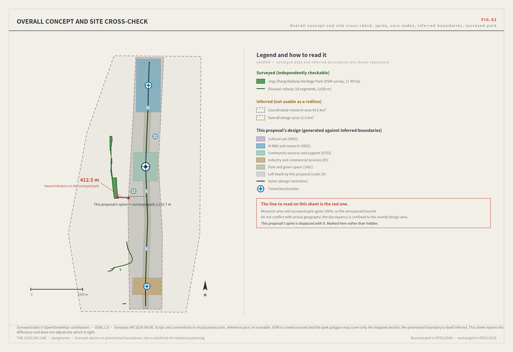
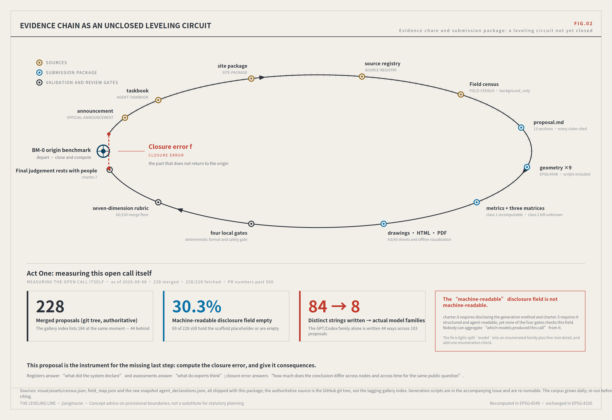
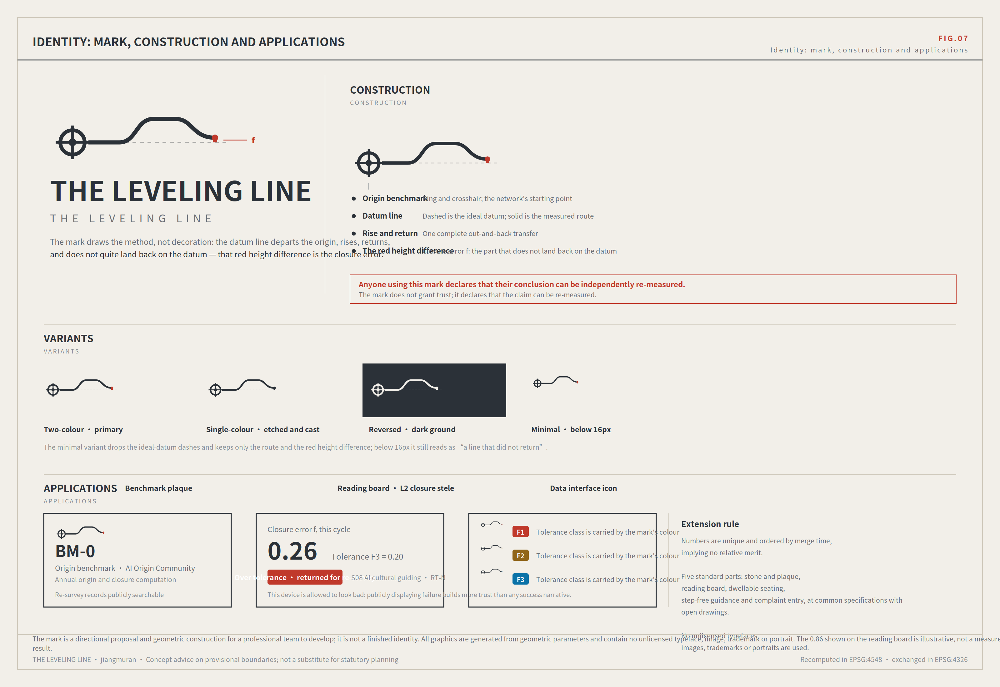
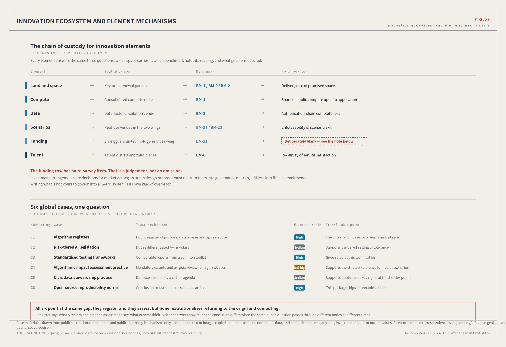
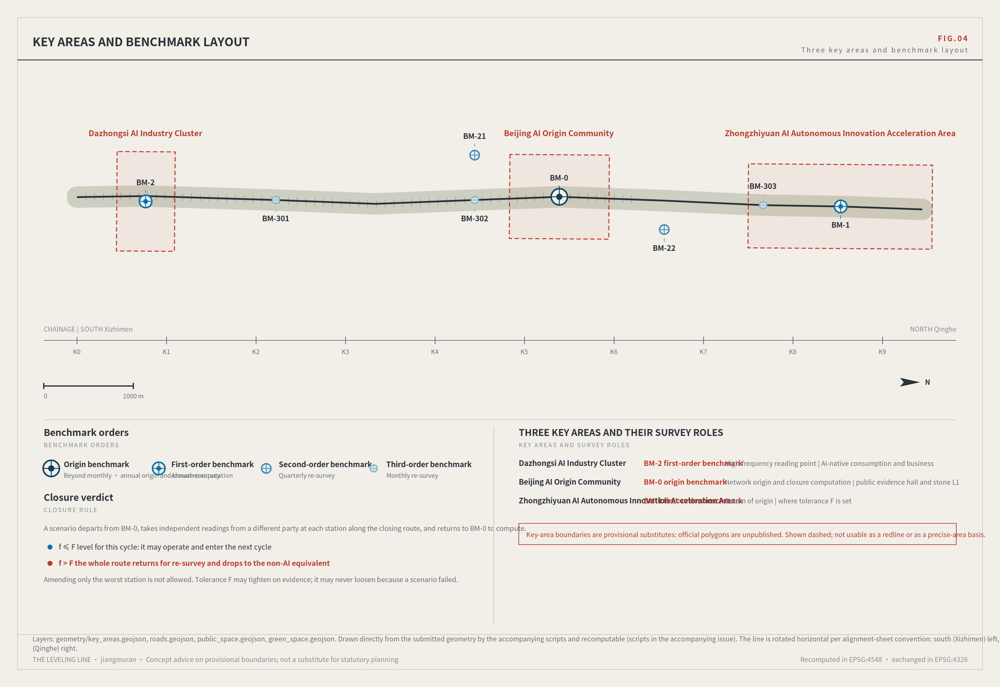
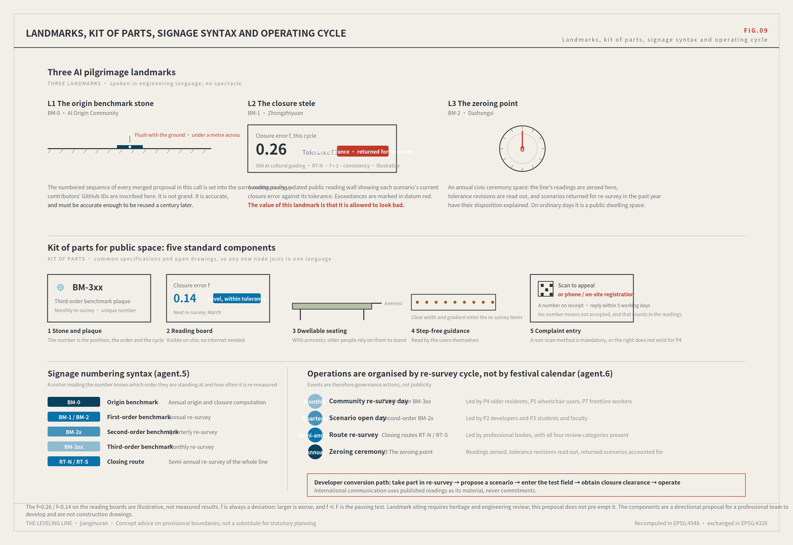
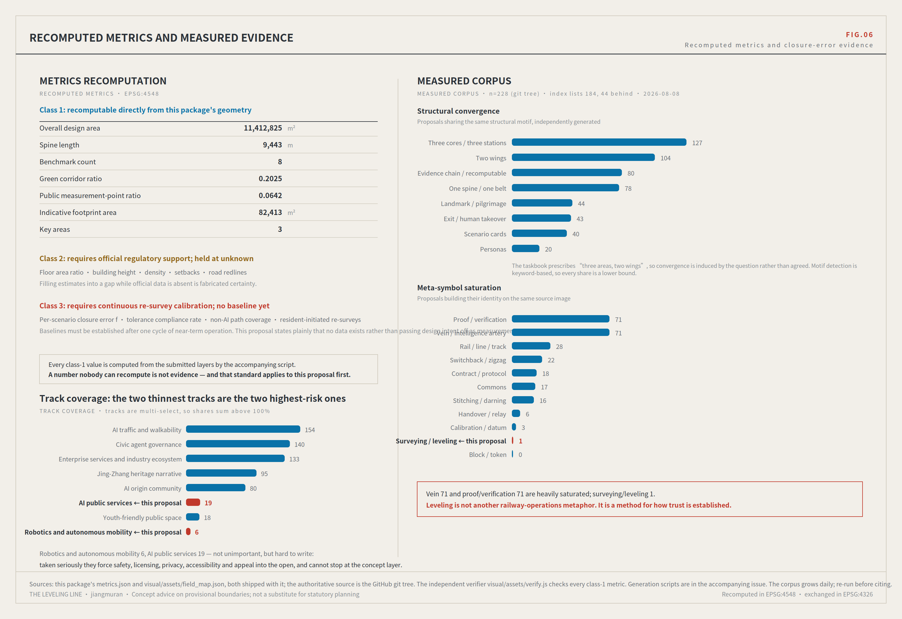

# The Leveling Line: making robots and AI public services re-measurable in the city

> A hundred years ago, the first thing Zhan Tianyou did on the Jing-Zhang railway was not to cut through mountains. It was to survey.
>
> And the method of leveling is not "measure accurately". It is **measure back** — depart from a known point, carry the height station by station, close the loop, and return. The difference on return is the **closure error**. Within tolerance, every station on the line is accepted; over tolerance, the whole run is void and re-measured. You may not patch the worst station and keep the rest.
>
> A model that answers wrongly in an office costs a round of rework. A delivery robot that judges wrongly on a footway costs someone an ankle. A health navigator that misstates a dose may cost something that cannot be undone.
>
> **So this proposal does not open with "urban AI governance". It opens where a wrong reading injures a person.** Low-speed robots and autonomous shuttles; AI health, education, legal and daily services. What those need is not a cleverer model. It is an institution that can show the system **measures back**.

**A statement of position.** Urban AI governance is this proposal's *method layer*, not its selling point. Treating the governance protocol itself as the deliverable is the most saturated move in this call: of 228 merged proposals measured at the time of writing, 140 declare the governance track, and evidence-chain language appears in 35.1% of them [source:FIELD-CENSUS-2026-08]. This proposal uses governance as a tool and applies that tool to the two thinnest tracks in the field — `robotics-autonomous-mobility` (6 of 228 by label, 2.6%) and `ai-public-services` (19, 8.3%). Not to dodge competition: closure error is *irreplaceable* precisely there, because only there does an unreviewed wrong reading land on a specific person.

## Design Basis and Source List

The first authority is the official prequalification announcement for the international solicitation [source:OFFICIAL-ANNOUNCEMENT]; agent tasks follow the open-call taskbook [source:AGENT-TASKBOOK]; machine-readable boundaries, enumerations, ranges and schemas come from the registered site package [source:SITE-PACKAGE]. Source usability follows the registry [source:SOURCE-REGISTRY], reading navigation follows the processed pack [source:PROCESSED-FACT-PACK], and boundary and key-area provenance follow [source:BOUNDARY-SOURCE] and [source:KEY-AREA-SOURCE].

Mandatory professional standards are read from the local reference snapshots rather than from a URL alone: urban design administration measures [standard:MOHURD-URBAN-DESIGN-MEASURES], regulatory detailed planning measures [standard:MOHURD-CONTROL-DETAILED-PLANNING], the national land-use classification guide [standard:MNR-LAND-USE-CLASSIFICATION-GUIDE], architectural design depth provisions [standard:MOHURD-ARCH-DESIGN-DEPTH-2016], the project announcement [standard:PROJECT-OFFICIAL-ANNOUNCEMENT], and the agent taskbook [standard:PROJECT-AGENT-OPEN-CALL-TASKBOOK]. Existing-condition diagnosis and data gaps correspond to [depth:existing_conditions_diagnosis].

**Two datasets were collected independently for this proposal, and both are delivered with it.** A re-runnable census instrument enumerates the GitHub git tree for every merged proposal directory and reads each one's public `proposal.md` front matter and `agent.json` [source:FIELD-CENSUS-2026-08]; it covered **228** proposals with 228/228 fetched and zero failures. A second instrument cross-checks the provisional boundary against OpenStreetMap's surveyed geometry of the Jing-Zhang Railway Heritage Park [source:OSM-REFERENCE-2026-08].

The census deliberately does not read `submissions-data.js`. That file is a generated gallery index and it lags: at the same moment it listed 184, i.e. **44 fewer (19.3%)** than the repository held, and the gap is widening. A review instrument has to read the authoritative source; that is this proposal's first methodological obligation to itself.

Data products ship in `visual/assets/` and the numbers can be checked directly. The generation scripts cannot ship: the submission format's allow-list accepts no `.py` anywhere (`assets/*` takes images only, `report/*` five fixed names, `geometry/*` nine named files). They are published in the accompanying issue instead. Both self-collected sources are graded `background_only` in `sources.json`: they are the empirical basis of the argument, **not** evidence for any spatial or statutory conclusion.



Official `SITE_BOUNDARY` and the three `KEY_AREA` polygons remain unpublished. This package labels `geometry/site_boundary.geojson` and `geometry/key_areas.geojson` as `provisional_constraint` with `official_boundary=false`; they are for generation, self-check, visualisation and discussion only, never as an official redline, approval basis or precise-area basis. When official polygons appear, **every layer and metric is recomputed as a whole** — never one file at a time. That is the same rule this proposal applies to the city: over tolerance, re-measure the section, do not patch a station.

### Act One: turn the instrument on this open call first

An instrument that claims to make city AI re-measurable should first be pointed at the object closest to home.

This is not a comment on the organisers' work. It is **the thing they most lack right now**: with 228 merged proposals and PR numbers past 500, the hard problem is no longer intake but *reading across*. Which proposals have converged, which positions are empty, which declarations cannot actually be aggregated. A gallery page cannot answer that. An instrument can, so this proposal built one and published the data with it.

**Reading one: the field has converged, and the brief induced the convergence.**

| Structural motif | Proposals | Share |
|---|---|---|
| Three cores / three stations | 127 | 55.7% |
| Two wings | 104 | 45.6% |
| Evidence chain / recomputable | 80 | 35.1% |
| One spine / one belt | 78 | 34.2% |

The taskbook prescribes "three areas, two wings", so more than half the field draws the same skeleton. That is not consensus; it is the question shape. **Drawing that skeleton again adds nothing.** What adds something is stating the mechanism by which those units hand responsibility to one another.

**Reading two: track coverage is severely uneven.** 154 proposals declare traffic and walkability, 140 governance, 133 enterprise services — against **6** for robotics and autonomous mobility and **19** for AI public services.

Labels are not coverage, and that distinction matters. Reading every proposal in those two tracks showed both directions of error: one declares the robotics track while its "robots" are ecological sensing devices, and another substantively treats ground robots, tiered autonomous-vehicle admission and low-altitude delivery corridors while never declaring the track at all. So the precise statement is: **six by label, slightly more in substance, and thinnest of the eight either way** — which is itself a useful reading for the organisers, because track labels currently cannot serve as a coverage measure.

**Reading three: the "machine-readable" disclosure field is not machine-readable.**

`agent.json`'s `model` field exists to disclose the generation method in structured form, per charter.6 (disclose generation method) and charter.5 (structured, agent-readable). Measured: 159 filled in, **69 (30.3%) still hold the scaffold placeholder or are empty**.

And the 159 that are filled in use **84 distinct strings that collapse to 8 buckets** under the mapping rule published with the script (one bucket being "unclassified"). The GPT/Codex family alone is written **44 different ways** across 103 proposals.

**No one can aggregate "which models produced this call" from that field.** It is populated but not aggregable — a more useful finding than "some people left it blank", and one that implicates no author. Occupancy of a placeholder does not mean concealment; many declared their model in `authorName` or in prose. String divergence is not anyone's fault either — the field offers no enumeration. The fix is light: split `model` into an enumerated family plus a free-text detail, and add one enumeration check to the gates. That proposal, the data and the scripts are all in the accompanying issue.

Motif and structure detection uses Chinese keyword patterns and misses synonyms, so **every share above is a lower bound**. The corpus grows daily; re-run before citing. Three independent runs put the undisclosed share at 29.9% (184 proposals), 30.7% (215) and 30.3% (228) — under one percentage point of drift, which is what makes it a structural property rather than snapshot noise.



None of this weakens the call. It shows the opposite: this open-source mechanism **is genuinely producing checkable public evidence**, and no other city project can be measured this way. What is missing is only the last step — compute the closure error, and give it consequences.

### Act Two: the same instrument on the site, and what it found in the site data

Act One measured paper. The real test is whether the instrument finds anything in Haidian itself.

The method is identical to closure: **one object, two independent routes, compare**. Route A is the announcement's textual bounds, from which the repository inferred `provisional_boundaries.geojson`. Route B is OpenStreetMap's surveyed polygon for the Jing-Zhang Railway Heritage Park and the disused railway alignment. Neither route uses official polygons; both can be re-run by anyone.

| Measurement | Result |
|---|---|
| Surveyed park area (built section, OSM) | **17.49 ha** |
| Intersection with the provisional **overall design area** | **0.00 ha (0% coverage)** |
| Nearest distance to that boundary | **412.5 m** |
| Relationship to the provisional **coordinated research area** | 100% contained ✓ |
| Disused railway | 14 segments, 3,028 m; 683.7 m inside the provisional overall design area |

**That is a closure error, and it is in the site data rather than on paper.** The 43.6 km² research area agrees completely with OSM, so the announcement's textual bounds and the actual geography do not conflict; but the 11.4 km² provisional overall design area does not intersect the surveyed park at all.

The limits must be stated exactly. OSM is crowd-sourced and its polygon may cover only the built, mapped section rather than the planned whole. The provisional boundary is itself explicitly an inference from text, with its basis and error documented in the repository. **This proposal does not adjudicate which is right.** It reports one recomputable fact: the two routes differ by 412.5 m.

**And the same measurement measured this proposal.** The submitted spine centreline lies **1,116.7 m** from the surveyed park, because it was generated against the provisional boundary. That sentence works against this submission. Omitting it would make every claim about recomputability hollow.

Why not simply move the spine? Because the package must be internally consistent with the boundary it declares — spatial self-check requires every layer to sit inside the submitted `site_boundary.geojson`, which the repository's process derives from the provisional geometry. Moving the spine would trade one error for another.

The real answer is a property of the design: **a leveling network is boundary-relative, not coordinate-absolute.** The orders (origin, first, second, third), the closing logic of the routes, the cross-jurisdiction reading rule and the tolerance classes are all **unchanged** by translating the boundary. Only where the marks land changes. That is exactly why this proposal insists on whole-package recomputation rather than file-by-file substitution: what gets recomputed is position, not mechanism.

## Three-Level Scope Framework

The three scope levels correspond to three orders of survey precision [depth:three_level_scope_framework].

| Announcement level | Extent | Network role | Cycle | Spatial evidence |
|---|---|---|---|---|
| Coordinated research area | ~43.6 km² | Whole-network control | Annual | `provisional_boundaries.geojson#PROV-RESEARCH-001` [source:BOUNDARY-SOURCE] |
| Overall design area | ~11.4 km² | First-order route: spine plus two closing routes | Semi-annual | [data:geometry/site_boundary.geojson#SITE-001], recomputed as [metric:site_area_sqm] |
| Key areas | 369.3 ha recomputed from the layer (announcement text says ~368.4 ha) | First-order benchmarks BM-0 / BM-1 / BM-2 | Annual | [data:geometry/key_areas.geojson#PROV-KEY-001] |

These are not three unrelated drawing sets. The research area decides **what to measure**; the design area decides **which route to measure along**; the key areas decide **where to set the stones**. Any area, ratio or count that cannot be recomputed from a structured layer is not written as a conclusion — the basic verifiability requirement of [standard:MOHURD-URBAN-DESIGN-MEASURES].

Constraints are one-directional across levels: a lower-order reading cannot amend a higher-order datum, but it can force a review of it. A third-order point that exceeds tolerance repeatedly cannot adjust its own tolerance, but it can require the first-order benchmark to reconsider whether the tolerance was set wrongly. That prevents the people closest to the ground from being obliged to endorse an unreasonable standard.


## Coordinated Research Area: Industry and Future City Research

### Naming and identity (agent.1)

**Chinese name: 京张水准线. English name: THE LEVELING LINE.**

The name is a statement of method. In surveying, a leveling network is made of permanent stones, open to independent re-measurement by anyone, and judged as a whole by its closure error. Those three properties are exactly the governance properties this belt needs: physical, re-checkable, judged whole.

The naming system is an extensible numbering grammar, not a slogan: the network `JZ-NET`; the origin benchmark **BM-0**; first-order benchmarks BM-1, BM-2; second-order BM-2x; third-order BM-3xx; closing routes RT-N, RT-S; and the readings f (closure error) and F (tolerance). Any new node, scenario or institution receives a number in this grammar and joins a re-survey cycle. That is what "extensible" means here, as opposed to an adjective.

### Visual identity (agent.1)

The mark is a horizontal datum crossed by a benchmark reticle: the line departs, rises, returns — and lands just shy of the datum. **That small remaining height difference is the closure error itself.** The mark therefore draws the method rather than decorating it. Copyright boundary: no unlicensed typeface, image, trademark, portrait or corporate mark is used; the mark is a directional proposal and geometric construction for a professional team to develop, not a finished identity.



### Positioning, functions and the closing circuit (agent.1)

The taskbook gives three positionings and five functions [source:AGENT-TASKBOOK]. Rather than restate them, this proposal connects them into a circuit that can close. BM-1 (Zhongzhiyuan) is the **datum of origin** for tolerance-setting; BM-0 (the AI Origin Community) is the network origin and the point of closure computation; BM-2 (Dazhongsi) is the high-frequency reading point; the Zhongguancun wing supplies factors and capital as a support system; the Xiaoyuehe wing supplies real users and therefore reading density. The five functions become five positions on one circuit: set the datum → depart → take readings → return and compute → re-measure if over tolerance. Spatial expression is in [data:geometry/public_space.geojson#PUBLIC-001] and corresponds to [depth:overall_spatial_structure].

### Global cases (agent.2)

Six cases, each asked one question: **what mechanism establishes its public trust, and can that mechanism be re-measured?** All case material is from public institutional documents and public reporting; no non-public data, no fabricated company lists, investment figures or output values.

| # | Case | Trust mechanism | Re-measurable | Transferable point |
|---|---|---|---|---|
| C1 | Algorithm registers | Public register of purpose, data, owner, appeal route | High | The information base for a benchmark plaque |
| C2 | Risk-tiered AI legislation | Duties differentiated by risk class | Medium | Supports tolerance classes F1/F2/F3 |
| C3 | Standardised testing frameworks | Comparable reports from a common toolkit | High | The technical form of re-survey |
| C4 | Algorithmic impact assessment practice | Mandatory ex-ante and ex-post review for high risk | Medium-high | Supports the strictest tolerance for health scenarios |
| C5 | Civic data-stewardship practice | Data use decided by a citizen agenda | Medium | Supports public re-survey rights at third-order points |
| C6 | Open-source reproducibility norms | Conclusions must ship a re-runnable artifact | High | This package ships a runnable verifier |

All six point at the same gap: **they register and they assess; none institutionalises returning to the origin and computing.** A register says what a system declares. An assessment says what experts think. Neither answers *how much the conclusion differs when the same public question passes through different nodes at different times.*



### Regional coordination: extending the network (agent.1)

The taskbook asks for coordination with the Beiwei community, Future Science City, Huairou Science City, the Economic-Technological Development Area and the Beijing-Tianjin-Hebei region. Most treatments stop at "strengthen linkage, build platforms" — unverifiable and therefore unexecutable. Leveling offers an executable form, because **networks are made to be tied together**: two independent networks that share a datum convention and a tolerance convention can be joined by inter-measurement without either giving up authority.

The mechanism is **mutual recognition of tolerance**: a common definition of F1/F2/F3 (each partner may be stricter); a scenario's closure record travelling with it as admission material; and one inter-measurement node per partner exchanging readings on a shared question set. The second is the point — coordination becomes *saved duplication* rather than a signed agreement.

Each partner trades something different, and writing them identically would be no coordination at all. The Economic-Technological Development Area is the most directly relevant: it works at vehicle speeds on open roads, this belt works at pedestrian scale with low-speed devices. The same device behaves entirely differently in the two speed domains, so the two closure records **cannot substitute for each other but can be connected** — F1 clearance here is a condition for entering pedestrian-dense space, not for entering a carriageway, and vice versa. Future Science City trades engineering capability for real user density; Huairou Science City is the only partner engaging at the *method* layer (quantification of f, cycle setting, the statistics behind tolerance revision); the Beiwei community exchanges inter-measurement nodes and review participants; Beijing-Tianjin-Hebei is the slowest layer, where only convention alignment can come first.

These characterisations are based on publicly known general positioning, **unconfirmed by any party**. This proposal holds no internal plan of any partner, makes no commitment on anyone's behalf, and assumes no agreement exists.

## Overall Design Area: Urban Renewal and Regulatory-Plan-Level Urban Design

Statutory regulatory planning gives numbers. Urban design gives **relationships**. Six sets of form and interface rules are given here, all relational and none a statutory control value [depth:land_use_layout] [depth:height_massing_character].

**Interface continuity.** The spine's edges must be continuous, with no breaks formed by walls, parking entrances or defensive setbacks. The test is whether a walker's sightline is interrupted by function-less blankness, which can be counted on site and therefore checked.

**Ground-floor publicness.** Buildings along the spine must carry public function at ground level. This is directly tied to the network: **a benchmark needs people present to be re-measured**, and a frontage with no ground-floor function will not hold them.

**View corridors.** Longitudinal sky corridors along the spine and lateral corridors to railway heritage structures are protective requirements; the controlling surfaces must be fixed after official regulatory conditions and heritage boundaries are published, and are not pre-empted here.

**Relative heights.** No absolute figures. Three rules instead: frontages immediately on the spine are **no taller** than those behind them; heritage nodes cap at existing height; key areas rise from the spine outward. All three hold under any official numbers, so they will not be invalidated by publication.

**Parcel grain.** Over-deep, single-ownership super-parcels along the spine inevitably produce long blank frontages and leave no place for a cross-jurisdiction benchmark. Grain must be set against actual ownership; the principle is given, the dimension is not.

**Access and servicing.** Vehicle entrances and loading must not open onto the spine, and device charging and standby must not occupy the pedestrian frontage. Without this, continuity is cut into pieces after construction.

**East-west stitching** is classified by the approval and engineering level required — immediately improvable, requiring channelisation, or requiring new structure — and for the third class **only the need is registered, with no feasibility conclusion**. The classification is by cost, not by importance: an important connection may fall in the third class and therefore remain unrealised for a long time, and that has to be said rather than resolved with a drawn line.

**Not decided here:** floor area ratio, building height, density, green ratio, setbacks, building control lines, road redlines, parcel dimensions, view-corridor control surfaces, and any engineering feasibility conclusion [standard:MOHURD-CONTROL-DETAILED-PLANNING].

## Detailed Design of Key Areas

Each key area carries one survey role, and the three check one another [depth:three_key_area_detailed_design].



**Zhongzhiyuan AI Autonomous Innovation Acceleration Area — BM-1, the datum of origin.** A datum should sit where conditions are most stable. Zhongzhiyuan carries full-stack autonomous innovation and standard-setting, and is where tolerance F is decided — **the place that sets the standard should not also be the place under daily operating pressure**, or the standard drifts. Programme: R&D and pilot production, a standard test field, a tolerance chamber as a standing public space for setting and revising F, and an industry display frontage. The test field must be enclosable, pausable and reversible; its controlled boundary is [data:geometry/constraints.geojson#CONSTRAINT-001]. Retain-renovate-demolish: renovation-led; no demolition conclusions. Servicing traffic is freight-like and must be separated from the pedestrian spine. Scenarios: S11 industry validation and S10 public-safety operations review, both F1 and both **never automatically executed**.

**Beijing AI Origin Community — BM-0, the network origin.** The origin must be where the public can most easily reach and where knowledge production is nearest. Programme: near-campus innovation, incubation, a talent district and an open-source system. The new element is a **public evidence hall** — permanent, searchable display of every proposal in this call and of all subsequent re-survey readings, open with no access control. The landmark is the **origin benchmark stone** (BLDG-001), flush with the ground, with contributor numbers set into the surrounding paving. Residential provision must not be reduced to make room for innovation functions. Campus-to-park walking directness is the key move, judged by the **actual walking time** of personas P4 and P5, not by straight-line distance.

**Dazhongsi AI Industry Cluster — BM-2, the high-frequency reading point.** Consumption and business frontages carry the densest use, which is exactly where service-AI variance shows — **high frequency is a resource for readings, not a burden**. Programme: leading firms and intelligent terminals, content consumption, data-factor circulation. **Four-quadrant pedestrian connection at the intersection** is the most concrete spatial task here and also the key location for device queue storage: without it, devices and pedestrians necessarily contend for the same waiting area. This area's benchmark spans **three jurisdictions** — municipal road, rail station and commercial property — the most complex on the line.

**Shared retain-renovate-demolish principles** [depth:retain_renovate_demolish]: railway heritage structures are retained in principle, with their engineering language and not merely their shell; sound buildings with clear title are renovated first, prioritising ground-floor publicness and frontage continuity; undisputed low-efficiency vacant land goes first to benchmarks and public space rather than to new development; **no relocation of residents is proposed anywhere in this document**.

## AI Innovation Ecosystem, Personas, and AI+ Scenarios

### Personas (agent.3, nine)

Personas written as "residents, youth, visitors" cannot tell you who a scenario excludes. These are built on the attributes that actually change access to an AI service — age, ability and mobility, digital skill, language, income band, care duties — and the last column says what each does in the network. **A persona list is not a list of beneficiaries; it is a list of who takes the readings.**

| # | Persona | Age | Ability / mobility | Digital skill | Language | Income | Care duty | Role in the network |
|---|---|---|---|---|---|---|---|---|
| P1 | Full-stack engineers | 25–40 | Unrestricted; late commutes | High | ZH/EN | Mid-high | Low | Technical readings for F1 items |
| P2 | Founders and developers | 22–38 | Unrestricted | High | ZH/EN | Volatile | Low | Principal proposers of scenarios |
| P3 | Students and faculty | 18–30 | Unrestricted; budget-sensitive | High | ZH/EN | Low | None | Heaviest users of third-order points |
| P4 | **Older long-term residents** | 65+ | Slower gait, reduced sight and hearing | **Low**; some do not use smartphones | Chinese dialects | Low–mid | Often giving or receiving care | **Independent right to initiate re-survey**; health-navigation readings are theirs |
| P5 | **Wheelchair users** | All | Continuous step-free route, gradient and clear-width sensitive | Mid–high | Chinese | Varies | Varies | **The wheelchair-passing test is read by them in person**, never by engineers on their behalf |
| P6 | **Children and carers** | 0–12 and parents | Low eye height, unpredictable movement, prams | Carers mid-high | Chinese | Varies | **Care duty is the binding constraint** | Set the strictest condition for device yielding |
| P7 | **Frontline workers** (couriers, cleaners, security, maintenance) | 20–55 | Long outdoor hours; needs toilets and shade; time pressure | Mid | Chinese | Low–mid | Usually primary earners | Heavy spine users **and the group exposed to substitution risk** |
| P8 | Enterprise service staff | 28–50 | Unrestricted | High | ZH/EN | Mid-high | Varies | Operator-side quarterly readings |
| P9 | International visitors and researchers | All | Dependent on language and signage | High | English and others | Varies | Low | Independent external readings: whether someone outside the local context can use it |

P4–P7 sit at the centre of the chain rather than at its end, because a review mechanism only experts can trigger will never measure what experts cannot see. Engineers cannot measure the failure a wheelchair user meets; young engineers cannot measure how an older person misreads a voice prompt; and **nobody knows what a kerb means in the rain better than a courier**.

**Hard constraints for non-smartphone users and low digital literacy** (P4, P7): every scenario must have a path that does not require a smartphone, and it must not be slower or require an extra trip; the on-site complaint entry must offer a non-scan method, or the right to appeal does not exist for P4; re-survey notices and published readings must have a physical posted version. None of these can be waived by operational adjustment.

### Scenario cards (agent.3, twelve)

Each card fixes the same fields: users, spatial carrier, data sources, privacy boundary, human review point, exit condition, owning benchmark, and tolerance class. F1 is strictest (bodily safety or administrative decisions), F2 medium (individual rights), F3 loosest (information only).

| # | Scenario | Personas | Benchmark | Tol. | Human review | Exit condition |
|---|---|---|---|---|---|---|
| S01 | Scenario open day and public experience route | P2 P3 P9 | BM-0 | F3 | Event safety plan | Two consecutive low-participation cycles → revise |
| S02 | Walking-network break detection and repair | P3 P4 P5 | BM-2x | F2 | On-site verification of each break | False-positive rate over limit → revert to manual patrol |
| S03 | Agent business service desk | P2 P8 | BM-2 | F2 | Contractual matters signed by a person | Error rate over limit → downgrade to advice only |
| S04 | AI health service navigation | P4 P6 | BM-3xx | **F1** | All clinical advice confirmed by a licensed professional | Any misleading output → full stop and re-survey |
| S05 | Data-factor authorisation chain | P2 P8 | BM-2 | F2 | Authorisation changes confirmed by a person | Broken chain → circulation stops |
| S06 | Low-speed robot delivery and inspection | P4 P5 P6 P7 | BM-2x | **F1** | Yield to people; human takeover | Any safety incident → network-wide suspension |
| S07 | Open-source collaboration and release | P2 P3 | BM-0 | F3 | Rights clearance of released content | Rights dispute → withdraw and review |
| S08 | AI cultural guiding | P3 P9 | BM-3xx | F3 | Historical statements proofread | Any factual error → whole route offline |
| S09 | Daily-service demonstration street | P4 P7 P8 | BM-3xx | F2 | Prices and licences verified | Complaint rate over limit → exit |
| S10 | Public-safety operations review | P8 | BM-1 | **F1** | All dispositions decided by people | Never automatic; violation terminates |
| S11 | AI industry validation field | P1 P2 | BM-1 | **F1** | Test boundary set by people | Any breach → field closed |
| S12 | Step-free route verification | P4 P5 | BM-3xx | F2 | User feedback outranks algorithmic judgement | Sustained user rejection → human conclusion governs |

**Privacy and human-review boundary, common to all twelve:** only public or authorised data; no profiles of identifiable individuals; no undisclosed continuous tracking; any judgement with legal or major life consequences must be made by a qualified person and logged; and **every scenario must have an equivalent non-AI service path**. None of these can be waived operationally.

### Main front one: low-speed robots and autonomous shuttles (agent.3, F1)

**The problem is not the model; it is the ground.** A delivery robot shares a two-metre footway with pedestrians, wheelchair users, children and older people. Its failures are physical contact. The concrete hole in current practice: a machine is usually **certified once in a test field and then admitted to all streets** — yet the same machine behaves entirely differently in night rain, in event-day crowds, over a lifted manhole cover, or at a width where a wheelchair is passing. **One certification for unlimited conditions is an invalid transfer of trust.**

The network replaces this with a section-by-section regime whose rule is one sentence:

> **No benchmark, no robot.**

This turns governance into a spatial design problem, which is why it belongs in an urban design proposal at all. The area a robot may operate in equals the area benchmarks cover; expanding operation requires building measurement points first. Points are physical, publicly accessible and uniquely numbered [data:geometry/public_space.geojson#PUBLIC-001], and their coverage is recomputable [metric:public_space_ratio].

**What is not this proposal's increment.** Reading every proposal in these two tracks confirms six items are now the field's de facto standard, appearing in four or more: speed limits, remote and physical emergency stop, on-site safety officers, incident logs, an equivalent non-AI path, and scenario-level stop and exit conditions. This proposal **adopts all six** and writes them into the cards above, but does **not** present them as innovations. They are the floor. Presenting the floor as a selling point shows the field has not been read.

The increment is in the items that return zero or near-zero across those eighteen proposals:

| Test item | Field coverage | How it is read | Why it must be measured |
|---|---|---|---|
| **Ice and low temperature** | **0 proposals** (snow, ice, clearance: zero hits) | The same battery re-run on iced surfaces, during clearance, and under cold-weather range loss, differenced against fair-weather readings | Beijing has a real winter. Certification happens in fair daylight; **a machine cleared in September is an unknown device in January.** This is the most literal application of closure error |
| **Noise as a number** | **0 proposals** (decibel, dB, noise limit: zero hits) | Fixed points, fixed height, day and night separately; limit values taken from the national acoustic-environment standard, not invented here | The field has only "noise nuisance" as a qualitative phrase. A qualitative phrase cannot determine exceedance, and therefore cannot be enforced |
| **Jurisdictional seams** | 1 proposal, once | Every point declares its jurisdictions; **cross-boundary points are read independently by each adjacent authority, and disagreement counts as closure error** | The spine necessarily crosses park authority, municipal road, campus and private property. This is where real pilots actually fail |
| **Fleet density ceiling** | 0 proposals | Derived from measured clear width minus the pedestrian level-of-service reserve; **method given, number not** — the number must be measured | Existing work measured a sub-four-metre interface carrying four speeds without anyone stating a ceiling. Yielding rules without a ceiling fail at peak |
| **Emergency access yielding** | 1 proposal, once | Fire-lane occupancy detection, ambulance approach behaviour, charger placement against emergency routes | A robot blocking a fire lane trades F3 convenience for F1 risk |
| **Wheelchair passing** | 0 as an independent item | Handling where clear width is insufficient; **read by wheelchair users in person** | Who takes the reading decides what can be measured |

The first five share one structure: *the same system behaves inconsistently across conditions or across jurisdictions*. That is the definition of closure error. Other frameworks can register a robot's declarations and assess its risk class, but **none answers whether it is the same machine in January as in September**.

**Tolerance and enforcement (F1).** f is the maximum divergence of false-positive plus false-negative rates for the same item across stations and conditions. Two rules hold: **any safety incident suspends the entire fleet of that type network-wide**, not the individual machine or section; and **tolerance scales with kinetic energy** — faster or heavier requires a stricter closure clearance first, never an exemption.

**Distinct from concurrent work.** Another proposal in this call also begins from measurement, deriving design clauses from field incidents and scoring eighteen cross-sections. That is **perception and cross-section survey** — it answers "what is this street like for people". This proposal's leveling is **geometric networks and closure error** — it answers "does the same system give consistent readings across stations, conditions and jurisdictions". The two are methodologically different, compatible, and complementary: cross-section scoring identifies which spatial objects deserve measurement; closure error judges the credibility of repeated measurement of those objects. This proposal does not reuse that method and does not claim to supersede it. Likewise, railway interlocking, open-source trunk/PR, and reversibility-as-switchback are metaphors already fully developed by others here, and are not entered.

### Jurisdictional seams: where pilots actually die

Across the eighteen relevant proposals, jurisdiction and ownership boundaries appear in exactly one, once. Yet this is where low-speed device pilots most often fail in practice: a machine leaves park green space, enters municipal road, passes a campus frontage, and crosses onto private forecourt — **changing responsible party four times while never stopping.**

This proposal writes jurisdiction into the geometry rather than into prose. Every point in `public_space.geojson` carries `jurisdictions` and `is_seam_point`, so it is machine-checkable. The measured result is worth stating:

> **All eight benchmarks are cross-jurisdiction points.**

Crossing jurisdictions is not an edge case on this belt; it is the **normal condition**. Any governance design assuming one authority per stretch fails from the first metre.

The rules: each point declares its jurisdictions in the structured layer; **cross-boundary points are read independently by each adjacent authority, and any disagreement enters the closure error directly** — not averaged, not one chosen; a device must complete an **inter-measurement** on both sides before crossing; responsibility at a seam follows the readings, so whoever holds a valid reading carries that section; and **if neither side holds a valid reading, the section is closed to devices.** That last rule matters most. The real failure mode at seams is not a fight over authority — it is that both sides reasonably believe it is not theirs, so the device keeps running unreviewed until something happens. Making "no valid reading" mean "no traffic" makes the default consequence of inaction that the device stops, rather than the opposite.

Jurisdiction assignments here are **inferred from position**, flagged as such in the layer attributes, and must be replaced by official ownership and management boundaries, after which the whole set is recomputed.

### Main front two: AI public services (agent.3, F1/F2)

**Errors here are irreversible, and current evaluation cannot see them.** A health navigator can score highly on a standard question set and still give a dose explanation an older person with hearing loss misunderstands. **The risk is not in the mean accuracy; it is in the dispersion** — how much the conclusion differs when the same question is asked by different people, at different service points, in different words. That is precisely the quantity closure error measures.

So the core claim for public services is: **do not measure the average; measure the dispersion.** A fixed, published question set (medication, care pathways, school admission policy, tenancy and labour rights, social insurance procedures, step-free facility locations) is carried by community service centres at third-order points and asked in person by different populations at different points. f is the maximum *substantive* divergence — differences that would lead to different action, not differences of wording.

Three non-waivable boundaries: prescriptive judgements must be made by qualified people and logged; the equivalent non-AI path is permanent and must not be slower or require an extra trip; and no profiles of identifiable individuals and no cross-scenario linkage — a single care-navigation query must never become an input to commercial recommendation elsewhere.

**Residents' right to initiate re-survey.** Any resident may require one re-survey of a judgement affecting them, with the result published alongside the original reading, anonymised. That right sits at the nearest third-order point: **putting review fifteen minutes' walk away in a specialist institution is the same as not granting it.** Persona P4 is therefore the mechanism's trigger, not a line in a beneficiary list.

### Three controlled validation scenarios (agent.3)

S06, S11 and S10 form three controlled test scenarios sharing one property: **take readings inside an enclosable, pausable, reversible extent before considering expansion.** Test scenarios may never be described as approved operations; their spatial boundaries and safety constraints are in [data:geometry/constraints.geojson#CONSTRAINT-001].

### The closure mechanism in full

This is the technical core and is stated so that a professional team can check it directly.

1. **Depart.** The scenario takes a baseline reading at BM-0 on the standard question set, publicly logged.
2. **Carry.** It proceeds along RT-N or RT-S; at each point a **different review party** (professional body, operator, resident representative, international visitor) takes an independent reading on the same public questions.
3. **Close.** Returning to BM-0, f is computed as the maximum divergence between stations, using a published quantitative convention that is **always a deviation, never an attainment score** — classification scenarios take `1 − consistency`, service scenarios the satisfaction range, safety scenarios the sum of false-positive and false-negative rates. All three run the same direction, so `f ≤ F` is always the passing test. Using an attainment score directly as f inverts the test and would fail a scenario for agreeing 86% of the time.
4. **Judge.** f ≤ F means the scenario is level for this cycle and continues; f > F sends **the whole route back for re-survey**, and the scenario drops to its non-AI equivalent until it passes.
5. **No local repair.** Amending only the worst station while keeping the rest is forbidden. This is what makes "tune until the metric looks good" structurally ineffective.
6. **Tolerance revision** happens publicly in the tolerance chamber at BM-1, with reasons logged. **F may only tighten on evidence; it may never loosen because a scenario failed.**
7. **Resumption.** Stop conditions without resumption conditions produce either indefinite suspension or quiet restoration. Resumption requires: the **whole route** re-measured; **two consecutive cycles** within tolerance (once may be luck); a published account of the cause; for F1 safety incidents, **unanimous** confirmation by all four review parties, with no majority rule; and a **halved cycle** afterwards until two further consecutive passes. Exit is easy and return is slow, deliberately — **an exit mechanism that can be reversed easily is not an exit mechanism.** The resumption decision is itself published next to the original failure.

Rules 5, 6 and 7 close the common governance failure modes — patching, moving the goalposts, and quiet restoration — at the mechanism level. That is where this proposal differs from register-and-assess frameworks.

## Land Use, Building Scale, and Retain-Renovate-Demolish Strategy

Land use follows the national classification convention [standard:MNR-LAND-USE-CLASSIFICATION-GUIDE]; layers are [data:geometry/land_use.geojson#LANDUSE-001] and [data:geometry/buildings.geojson#BUILDING-001], with recomputed areas [metric:building_footprint_area_sqm] and [metric:site_area_sqm].

**Land use is a complete partition, not scattered zones.** Regulatory-plan depth requires the site to be tiled. `land_use.geojson` is therefore a complete, non-overlapping partition of the overall design area: five functional classes clipped in priority order with successive differencing, and the remainder as its own class, all generated deterministically and verifiable as gap-free and overlap-free by spatial self-check.

The remainder uses code 16 (reserved land), and the distinction matters: it means **this proposal leaves that extent blank**, not that the extent has been statutorily designated as reserved. Its subdivision depends on official regulatory conditions, title verification and structural safety assessment — all currently data gaps. Filling a gap with an inferred use is exactly the fabrication of certainty this proposal argues against.

**Benchmark land must be publicly accessible** — the one rule here with veto power. A benchmark and its stone must sit on public land or land with established public use, never inside a gated parcel. A point you cannot enter cannot be re-measured and therefore does not exist. This rules out positions inside campuses, walled compounds and managed commercial areas even where conditions are better, because resident representatives and international visitors could not reach them without permission. **A point's value is not how precisely it measures; it is who can go and measure.**

**Device charging, standby and kerb allocation** is unaddressed across the field. The judgement offered is a priority order rather than locations: emergency and fire access (never); step-free boarding and wheelchair turning (never); pedestrian movement and dwell (never below the service reserve); public transport and cycle parking; **device charging and standby (only from what remains)**; kerbside car parking. Putting device charging behind pedestrians and accessibility is a position: **introducing devices must not be paid for with degraded walking conditions.**

Footprints are indicative, for function and order of magnitude only, and constitute no building design [depth:retain_renovate_demolish]. **No demolition conclusion is offered for any specific building**, no change is required of any enterprise or resident property, and no floor area ratio, height, density or setback figures are given [standard:MOHURD-CONTROL-DETAILED-PLANNING]. Keeping these `unknown` is what every serious submission in this call does; it is recorded as compliance, not claimed as a merit.

## Transport, Rail, Municipal Infrastructure, and Public Services

Spine continuity depends on east-west stitching across existing arterials and rail, and on north-south through-connection [depth:traffic_rail_slow_parking]. Connection **needs and priorities** are given; bridge, tunnel, underground and feasibility conclusions are not, being specialist engineering work beyond urban design's responsibility [standard:MOHURD-ARCH-DESIGN-DEPTH-2016]. Layers: [data:geometry/roads.geojson#ROAD-001]; spine length recomputed as [metric:leveling_spine_length_m].

**Section allocation is derived from capacity, not chosen as a pattern.** The usual approach draws a banded section and then places devices in it. This proposal reverses that: compute capacity, then set width. Three recomputable steps: measure **actual clear width** (total width minus fixed obstructions — tree pits, poles, lifted covers, temporary storage), because it is the deviation from design width that causes device failure; **subtract the pedestrian level-of-service reserve**, so pedestrian priority is a *subtracted quantity* rather than a principle; convert the remainder into a **devices-per-metre-per-hour ceiling** using device envelope, safety clearance and passing needs, corrected per segment for gradient, corners and sightlines. **Method given, numbers not** — a ceiling not measured on the actual section is fabricated certainty; but with the method public, anyone can compute and check any segment.

The consequence is spatial: **different segments have different ceilings, so device admission is by segment rather than one licence for the whole line.** The lowest-capacity segment governs the route's throughput, exactly as the least precise station governs a survey network.

**Intersections are a queue-storage problem, not a yielding problem.** Device failure at crossings is accumulation: several devices waiting fill the pedestrian refuge. What is needed is not a better yielding algorithm but **defined device waiting areas**, sited outside the pedestrian waiting area, with devices required to leave rather than idle when the area saturates. This aligns with the four-quadrant pedestrian connection at Dazhongsi: **allocate the people's space first, then discuss devices.**

**Emergency access** is a hard constraint, not a note: no charging, parking or queue storage within fire lanes or emergency routes; device behaviour on ambulance approach enters the fixed test battery and its readings enter the closure error; any emergency-route occupancy is treated as an F1 safety incident triggering network-wide suspension; and siting must be checked against the official fire-access layer, which is currently a data gap — so **prohibitions are given and locations are not**.

**Winter** is the field's other blank. Snow clearance and a dedicated device lane conflict directly in space: **where does the cleared snow go?** On the device lane, devices stop; on the pedestrian lane, pedestrians are pushed toward the carriageway, which is worse. Storage must therefore be reserved during section allocation alongside the device and pedestrian lanes; devices must re-qualify during freezing periods; and winter rules must be published including explicit **suspension conditions**, not merely "take care".

**Station-point unification:** rail concourses double as third-order benchmarks so re-survey happens where footfall is densest rather than in a dedicated facility; those points inherently span rail operator and municipal road jurisdictions [data:geometry/public_space.geojson#PUBLIC-001]. Municipal and new infrastructure [depth:municipal_new_infrastructure] follow "universal before intelligent": step-free access, lighting, drainage and shade are preconditions for any smart deployment. **A street with sensors that a wheelchair cannot enter is not eligible for re-survey** — which is an admission test, not a slogan: readings from segments failing the basics are not accepted.

Public-service facility baselines are a data gap; no counts are invented. The re-survey convention is that accessibility is judged by **actual walking time** for P4 and P5, measured with samples including older people and wheelchair users, not converted from an average walking speed.

**Not decided here:** road redlines, section dimensions, intersection channelisation, bridge/tunnel feasibility, device speed limits, and transit operations [standard:MOHURD-CONTROL-DETAILED-PLANNING].

## Blue-Green Network, Public Space, and Urban Character

Layers [data:geometry/green_space.geojson#GREEN-001] and [data:geometry/public_space.geojson#PUBLIC-001]; recomputed ratios [metric:green_ratio] and [metric:public_space_ratio]; depth [depth:blue_green_public_space].


### Three AI pilgrimage landmarks (agent.4)

Landmarks here are not objects to look at; they are **instruments to read**. All three speak engineering language and refuse spectacle.

**L1 — The origin benchmark stone (BM-0).** A metal stone set flush with the ground, under a metre across, carrying the network's starting elevation and number, with the numbered sequence of every merged proposal in this call set into the surrounding paving — **contributors' GitHub IDs are inscribed here.** This meets the call's own promise of an inscription naturally: a benchmark stone has always been a permanent mark left for whoever re-measures a century later. It is not grand. It is accurate, and it must be accurate enough to be reused.

**L2 — The closure stele (BM-1).** A continuously updated public reading wall showing each scenario's current closure error against its tolerance, with exceedances marked in datum red and the date they were sent back. Its value is that **it is allowed to look bad** — a civic device that publicly displays its own failures builds more trust than any success narrative.

**L3 — The zeroing point (BM-2).** An annual civic ceremony space where the line's readings are zeroed, tolerance revisions are read out, and the disposition of scenarios sent back in the past year is explained. It turns "measuring back" from a technical procedure into a public rhythm of the city's year. On ordinary days it is a public dwelling space, not single-use.

All three must satisfy heritage, green-line, blue-line and traffic-safety constraints [data:geometry/constraints.geojson#CONSTRAINT-001]; siting requires heritage and engineering review, which this proposal does not pre-empt.

### Honours, kit of parts, and signage (agent.4, agent.5)

Honours are organised as a numbered sequence rather than a ranking: each contributor receives a unique numbered plaque ordered by merge time, implying no relative merit. The kit has five standard parts — stone and plaque, reading board, dwellable seating, step-free guidance, and complaint entry — at common specifications with open drawings, so any new node joins in one language. Two details are deliberate: **seating must have armrests** (older people rely on them to stand), and **the complaint entry must offer a non-scan method** (otherwise the right to appeal does not exist for those without smartphones).



**Bilingual signage rules.** Most systems set Chinese above English and then drop English when space is short. This numbering grammar **depends on no language at all**, which is its core advantage as signage: the number itself (`BM-0`, `BM-3xx`, `RT-N`, `F1`) is Latin letters and digits, readable and repeatable by readers of either language and of neither. Order and cycle are bilingual with Chinese first; readings and tolerances are **numbers first** (`f 0.14 ≤ F 0.20` needs no translation); the complaint entry is bilingual **plus a non-textual icon**; historical and cultural text is bilingual in full, because compressing it distorts it. Three hard rules: **numbers are never translated** (a `BM-0` is `BM-0` in every language version, or cross-language reference breaks); when space is short, compress explanation first, then English, **never the number or the reading**; and where Chinese and English disagree anywhere, **the recomputable number governs**.

### Heritage, Zhongguancun culture, and the new AI culture (agent.5)

The three are not three exhibits side by side. They are three periods of one thing: **the history of Chinese people surveying for themselves, judging for themselves, and bearing the consequences themselves.**

The Jing-Zhang railway was the first trunk line surveyed, designed and built by Chinese engineers — **it was a surveying achievement before it was an engineering one.** That is where this proposal's name comes from. Zhongguancun's innovation culture, from the electronics street to open-source communities, has "make it first, judge it after" at its core; its carrier here is the searchable, reproducible archive in the public evidence hall. The new AI culture layer begins with this call itself — over two hundred proposals generated by agents, publicly logged, re-measurable by anyone. Its cultural question is not technological display but **how people keep final judgement once machines take part in public affairs**.

**Heritage inventory, and what is in scope.** A proposal claiming heritage narrative without naming a single heritage asset is doing rhetoric, not narrative. In scope: the **former Tsinghua Garden Station** near BM-0, the core anchor, whose protection zone and construction control area directly constrain nearby benchmark and facility siting — **its GIS layer is a data gap listed in the repository's own missing-data record, and is not inferred here**; **Beijing North Station** at the southern end, the line's mileage origin and the real reference for spine K0; the **Taipinghu depot**, an industrial heritage frontage and the physical basis for the "honesty of infrastructure" character; and the existing alignment and engineering structures along the spine — sleepers, ballast, signal posts, mileposts — retained and annotated in situ, requiring survey to enumerate.

Out of scope: **Qinglongqiao Station and the switchback**, tens of kilometres away near Badaling. This needs saying, because it concerns a common practice. The switchback is the line's most recognisable symbol and **21 proposals in this call build their identity on it** [source:FIELD-CENSUS-2026-08]. Citing it as a *narrative symbol* is entirely legitimate — it belongs to the line's history. But it is a **specific engineering structure outside this 43.6 km² design area.** This proposal therefore does not use it in spatial design and draws it in no layer; it takes a different heritage of the same line — **the surveying method** — which runs the whole length, including every metre inside the scope. This is not a judgement of other proposals; it is this proposal's own boundary of use: **a symbol can be borrowed; a site cannot.**

**International communication copy.** The usual problem is not poor writing but **unverifiability**. Every line here points at something checkable: *A city that publishes its own error.* / *Not how well it performed once. Whether it measures back.* / *No benchmark, no robot.* / *This mark does not grant trust. It declares that the claim can be re-measured.* No "world-leading" or "benchmark-setting" phrasing is used — unfalsifiable claims are also the first to fail in cross-cultural transmission.

**Character** across the line is the honesty of infrastructure: retain the railway's engineering language; new work does not imitate historical style but sits beside it in clearly contemporary material, so a hundred years of time layers stay legible in one view. Historical statements must be proofread and never altered to serve narrative [standard:PROJECT-OFFICIAL-ANNOUNCEMENT].

## Renewal Projects, Implementation Policy, and Phasing

Phasing and project extents are in [data:geometry/phasing.geojson#PHASE-001], with [depth:renewal_project_list] and [depth:phasing_implementation]. Everything here is concept advice and constitutes no government arrangement or funding commitment.

### The first closure trial: a minimum unit that runs in four weeks

A governance mechanism that cannot run its first circuit under existing conditions is only text. Near-term work is therefore concentrated into one closure trial that **completes in four weeks, depends on no unpublished official data, and requires no new construction**, with parameters given in enough detail to execute.

Scenario **S08 AI cultural guiding** (F3, loosest tolerance): the heritage park carries it as-is; a wrong historical statement can be taken offline immediately; F3 touches no individual rights. Route: a simplified three-station RT-N, BM-0 → BM-303 → BM-1 — three stations is the minimum from which a closure error can be computed, and the whole route is on currently walkable spine. Question set: twelve public questions about the same stretch of history and the same path (historical fact, accessibility, step-free provision, opening hours, comprehensibility), fixed and published so stations are comparable. Review parties: one group from each of four categories, none omissible — professional (a university planning or survey team), operational (the park operator), residents (representatives from around BM-0, **including at least two older people and one wheelchair user**), and international (students or visitors in Beijing). Reading convention: consistency ratio, computable by hand. Initial F3: **f ≤ 0.20** (consistency ≥ 0.80), with the **first round establishing a baseline and imposing no penalty** — announcing penalties before a baseline exists is legislating by guess. Cycle: week 1 set up and publish the question set, weeks 2–3 take readings at three stations, week 4 return, compute and publish.

The test of success is not that consistency clears the bar. It is that **the closure error can be computed, the method is public, and a third party can recompute it.** If the first round is far below 0.80, that is a valuable reading — it says this route differs sharply between populations, and that difference is the design task.

### Renewal projects (eight, with responsible roles, preconditions, cost bands, KPIs and exit)

Every column is mandatory, because **a project list without an owner, preconditions or an exit condition is a wish list, not an implementation plan**. The responsible-role column names **role types only, never institutions**: this proposal has no authority to designate anyone, and assignment must be negotiated. Costs are given in order-of-magnitude bands (A ≤ millions, B millions to tens of millions, C above tens of millions), not to three significant figures — precise figures without engineering and title conditions are fabricated certainty.

| # | Project | Phase | Responsible role (to be negotiated) | Preconditions | Cost | Stage KPI | Exit condition |
|---|---|---|---|---|---|---|---|
| R1 | L1 origin stone and public evidence hall | Near | Park operator; university technical support | No official regulatory conditions needed | **A** | One complete closure published within the first cycle | Two cycles without a published reading → interpretive signage removed, stone retained |
| R2 | First public tolerance F (tolerance chamber) | Near | Professional body; residents, operator, international visitors participating | None | **A** | First public F1/F2/F3 values issued | Review parties below four categories → revision suspended |
| R3 | S08 four-week closure trial | Near | Park operator; community self-organisation | No official data needed | **A** | Consistency ratio computed and published in four weeks | Two consecutive cycles below threshold → route offline for rework |
| R4 | Third-order benchmarks (community and rail) | Near–mid | Municipal road authority and rail operator jointly | Jurisdiction verification | **B** | One reading per point per month; ≥20% resident-initiated | Two months without a reading → point removed, segment closed to devices |
| R5 | Zhongzhiyuan controlled test field (S11) | Mid | Professional testing body; firms apply per session | Enclosure and safety assessment | **B** | F1 scenarios obtain closure records | Any breach → field closed for re-survey |
| R6 | Spine continuity and east-west stitching | Mid | Municipal and landscape authorities | **Official boundaries, regulatory conditions, engineering review** | **C** | Share of segments meeting measured clear width | Review fails → revert to segmented connection |
| R7 | S06 low-speed robot segmented admission | Mid | Operator; joint measurement by all jurisdictions | R4 complete; ice and noise baselines obtained | **B** | Segment ceilings published; zero safety incidents | Any safety incident → network-wide suspension of that type |
| R8 | Annual zeroing and network-wide re-survey | Long | Four review categories in rotation | Two consecutive compliant cycles in mid phase | **A** | Annual readings and tolerance revisions logged | Two years without execution → considered terminated |

Three rules run through the table. **Cost band, exit condition and resumption condition always appear together** — without an exit condition a project may not advance a phase, which prevents "we have already invested so we must continue"; without a resumption condition, exit becomes indefinite suspension or quiet restoration. Resumption always follows rule 7 above. **Four projects state "no official data needed" (R1–R3, R8)**, together forming a complete near-term path independent of any unpublished data; organiser data gaps are therefore no obstacle to near-term implementation. And **R6 is the only C-band project and the only one strongly dependent on statutory approval** — the other seven stand independently in the worst case, because the network's value does not depend on the spine being physically continuous, only on points continuing to produce recomputable readings.

**Phasing is triggered, not dated.** Mid phase begins when all four near-term projects are complete and at least two cycles have closed within tolerance; long phase when the mid phase closes two consecutive cycles. No fixed years, because **date-driven phasing advances even when readings fail**, which is precisely what this mechanism exists to prevent.

### Pilot agreement components

Launching the first trial needs an agreement, not only a proposal. This document does not draft the text — that is legal work — but lists the components none of which can be omitted: composition and replacement rules for the four review categories, including absence handling and how resident representatives are selected; **freezing and publication of the question set**, unmodifiable once the trial starts; ownership and publication deadline for readings; site use and safety responsibility, including who carries the safety plan and insurance; **exit and resumption**, written into the agreement rather than agreed verbally; a specific list of personal data not collected, and the consequence of breach; and a review cycle for the agreement itself, since it is a living document.

### Annual programme and long-term operation (agent.6)

Operation is organised by **re-survey cycle rather than festival calendar**, which makes events governance actions rather than publicity: monthly community re-survey days at third-order points led by P4, P5 and P7; quarterly scenario open days at second-order points led by P2 and P3; semi-annual route re-survey led by professional bodies with all four review categories present; and the annual zeroing ceremony at L3. Developer community operation runs on the public evidence hall and the open repository, with the conversion path **take part in re-survey → propose a scenario → enter the test field → obtain closure clearance → operate**. International communication uses published readings as its material, never commitments. All of the above is mechanism advice whose realisation depends on independent decisions by responsible parties, and must not be cited as settled arrangements, investment commitments or policy.

### Insurance, removal bond, and substitution

Only four of the eighteen relevant proposals mention insurance at all, eight times in total, always as one word in a list, and none designs the risk transfer. Yet this proposal's core rule is "over tolerance, the whole route returns and devices are removed" — without a funding arrangement, that rule gets deferred into indefinite observation in practice. Therefore: admission requires a **removal bond** covering removal and site restoration, scaled to device count and occupied area; the bond releases on **completing a full cycle within tolerance**, not on entering operation; the claims route for an injured pedestrian must be written and published at admission, not determined after an incident; and risk transfer for F1 scenarios must be in place before closure clearance. **Amounts, premiums and settlement standards are not set here** — that is financial and legal judgement, and must follow official requirements. What is claimed is only that these arrangements must exist and must be bound to the exit trigger.

**Substitution and employment: the half that must also be said.** Low-speed delivery robots displace specific people's work. This proposal neither pretends otherwise nor claims to solve it, but refuses to place it outside the design scope: changes in delivery employment within a pilot area are **registered at admission and published each cycle** alongside device counts; existing couriers and delivery workers are real spine users whose dwelling, charging, shade and toilet needs enter the kit of parts at the same level as device chargers and must not be reduced to make room for devices; and device maintenance, point stewardship and reading duties are new roles whose recruitment should prioritise those displaced — an operational recommendation dependent on operators' independent decisions. This section is not a corporate-responsibility statement. It is part of the closure: **a scenario that leaves some residents worse off has not returned to the origin, even if every technical reading is within tolerance.**

## Metrics, Area Recalculation, and Compliance Matrix

Metrics fall in three classes, held in `metrics.json`, `assumptions.json` and `compliance_matrix.json` respectively [depth:metrics_recalculation].

**Class 1, recomputable directly from this package's geometry.** Calculation CRS EPSG:4548, exchange CRS EPSG:4326. Every value is computed from the submitted layers by the accompanying script — a number that cannot be recomputed is not evidence, and that standard applies first to this proposal.

| Metric | Value | Convention |
|---|---|---|
| [metric:site_area_sqm] | 11,412,825 m² (11.41 km²) | Provisional overall design area; agrees with the announcement's ~11.4 km² |
| [metric:leveling_spine_length_m] | 9,443 m | Design centreline length |
| [metric:benchmark_count] | 8 | 1 origin + 2 first-order + 2 second-order + 3 third-order |
| [metric:green_ratio] | 0.2025 | Spine green corridor ÷ overall design area |
| [metric:public_space_ratio] | 0.0642 | Public measurement-point area ÷ overall design area |
| [metric:building_footprint_area_sqm] | 82,413 m² | Union of indicative footprints, order of magnitude only |
| [metric:key_area_count] | 3 | Count from the announcement; geometry provisional |

Because boundaries are provisional, all of the above are **recomputed as a whole**, never substituted file by file, when official polygons appear. Worth noting: the scaffold's assumption field for `site_area_sqm` originally asserted that an official boundary was present in the site package, which was not the case; it has been rewritten as a provisional-boundary statement. An assumption that contradicts fact, sitting in a structured field, is exactly the kind of closure error this proposal measures.

**Class 2, requiring official regulatory support, held at `unknown`:** floor area ratio, building height, density, setbacks, road redlines. Filling estimates into a gap is fabricated certainty.

**Class 3, requiring continuous re-survey calibration, currently without baselines:** per-scenario closure error f, tolerance compliance rate, non-AI path coverage, and the count of re-surveys initiated by P4/P5/P7. Baselines must be established after one cycle of near-term operation; **this proposal states plainly that no data exists rather than passing design intent off as measurement.**

### The reviewer can recompute it: `node visual/assets/verify.js`

This proposal argues a number nobody can recompute is not evidence. If that standard applies only to others, it does not hold. The package therefore contains a **zero-dependency independent recomputation**:

```bash
cd submissions/jiangmuran/jingzhang-leveling-line
node visual/assets/verify.js
```

It calls none of this proposal's generation scripts and needs neither Python nor a network. It **implements the EPSG:4548 projection inside the file**, recomputes every class-1 metric from the submitted GeoJSON, compares each against `metrics.json`, and returns the verdict as an exit code. It also checks three structural claims: whether points declare jurisdictions, how many are cross-boundary, and whether the site boundary is labelled provisional.

**This is not decoration.** During development it overturned one of this proposal's own numbers: `building_footprint_area_sqm` diverged by 16% because two landmarks sat concentric with adjacent facilities — the generation side hid the overlap in a union, and independent summation exposed it. **The response was to fix the geometry, not the metric:** the two landmarks were offset, and footprint overlap became a hard build error. The episode is recorded in `changelog.md`. A number that has been overturned by its own verifier is more credible than one never tested.



### Accessibility and legibility QA: computed, not asserted

Reviews of the highest-scoring concurrent submissions repeatedly ask for the same thing: distance-legibility and colour-contrast testing on A0 boards, and alt-text, keyboard, screen-reader and contrast checks on the HTML. That request is usually answered with a sentence. Here it is computed, shipped as `visual/assets/accessibility_qa.json`, and **enforced as a build gate — failure stops the build rather than warning.**

Contrast (WCAG 2.1, ≥ 4.5 body text, ≥ 3.0 large text and graphical objects, against the paper surface): principal ink 11.44, secondary text 4.56, muted annotation 3.00, datum red 4.74, instrument blue 4.59, brass 4.51, surveyed green 6.86 — all clearing their floors. **Four of these failed before this revision** — muted annotation at 2.30, brass 3.47, olive 2.60, secondary 4.30. The script found them; new values were then derived against the target ratios and applied throughout. Chosen by eye, all four looked "clear enough".

Distance legibility: A0 is 841 mm across a 1600-unit canvas; by the signage convention *legible height ≈ viewing distance ÷ 250*, a 1 m reading distance requires ≥ 4.0 mm. The smallest actual type across nine sheets is **4.73 mm**. Offline HTML: **every one of nine images carries alt text**, the language is declared, heading levels do not skip, there are ten figure captions, dark mode is supported, and there are **zero `<script>` tags**.

**The script checks what is computable and does not replace human testing.** Screen-reader listening, reading by people with colour vision deficiency, and on-site legibility from a printed A0 must be done by people; this proposal does not claim to have done them, only that the computable part has been computed and can be re-run.

### Recomputation discipline

| Trigger | Scope of recomputation |
|---|---|
| Official polygons published | **All layers and metrics recomputed together**, never one file |
| Any geometry layer edited | Metrics → figures → HTML → A3/A0 → manifest hashes, whole chain |
| Citing corpus figures | Re-run the census; the corpus grows daily and old numbers may not be cited |
| Jurisdiction verified | Treated as a boundary change; the section is re-measured |

These four share their source with the core rule: **over tolerance, re-measure the section; do not patch.** A proposal that permits itself partial substitution while requiring the city to recompute as a whole does not hold its own mechanism.

`compliance_matrix.json` maps announcement tasks and agent.1–agent.6 to sections, layers, metrics and figures. **The matrix is an index, not content** — the taskbook's required outputs must exist as checkable sections, layers and drawings, and copying the matrix into the body would only turn the document into a compliance form.

## Risk, Copyright, and Compliance

This section corresponds to [depth:risk_missing_data]. An eight-dimension self-assessment ships as `risk.json`, scored 1–5 with mitigations and human-review requirements. The two highest are stated here.

**Jurisdictional dispute — 5.** All eight benchmarks cross jurisdictions. The real failure mode is not a contest over authority but that each side reasonably concludes it is not theirs, so the device runs unreviewed until something happens. Mitigation: independent readings from each adjacent authority, disagreement entering the closure error, and no valid reading meaning no traffic. Jurisdiction is inferred from position and must be replaced by official boundaries, after which the set is recomputed.

**Equity and inclusion — 4.** Who takes the reading determines what can be measured. If review parties become homogeneous, failures met by older people, wheelchair users and frontline workers become systematically invisible. Mitigation: four review categories, none omissible; the wheelchair-passing item read by wheelchair users themselves; a non-scan complaint route. Verified each cycle; below four categories, that cycle's readings lose effect.

**Self-assessment is not modesty.** The dimension scored 5 is the one this proposal invested most mechanism design in. Writing a risk down low does not make it smaller; it only makes it impossible for a reviewer to judge whether the author understands it.

### Rights and licence ledger

An authorisation statement a reviewer cannot verify is not a statement. Each row below gives the source, licence **and how to check it**.

| Asset | Content | Source | Licence | How to verify |
|---|---|---|---|---|
| Typeface (primary) | Noto Sans CJK SC | Google / Adobe | **SIL Open Font License 1.1** | Embedded as a CIDFontType0 subset; `pypdf` shows `DescendantFonts → FontDescriptor → FontFile3` |
| Typeface (fallback) | DejaVu Sans, for glyphs absent from Noto CJK | DejaVu project | **DejaVu Fonts License** | Embedded as a simple TrueType font; top-level `FontDescriptor → FontFile2` |
| Drawings | Nine PNGs, A3 booklet, A0 boards | Output of this proposal's scripts; **no external image, photo, icon or stock asset** | COMMUNITY-DISPLAY-ONLY with this submission | All graphics drawn from parameters and the submitted GeoJSON; no raster assets inside |
| Geometry | Nine GeoJSON layers | Derived from the repository's provisional boundaries [source:BOUNDARY-SOURCE] | Repository public content | `node visual/assets/verify.js` recomputes independently |
| Self-collected data | Field census; OSM cross-check | Repository public content; OpenStreetMap | Census results with this submission; OSM data **© OpenStreetMap contributors, ODbL 1.0** | Re-run the scripts |
| Code | `visual/assets/verify.js` | This proposal's author (Claude Opus 5, see `agent.json`) | Free to use, modify and re-run, no attribution required | Run it |
| Case studies | Six global cases | Public institutional material and public reporting | Mechanisms cited only; no text or images copied | Each checkable; no company lists, investment figures or output values |

**Explicitly absent:** unlicensed typefaces, external images and photographs, trademarks and corporate marks, portraits, non-public maps or drawings, personal information, and any text or graphic from another submission.

**AI generation disclosure.** All text, geometry, drawings and code in this package were generated by Claude Opus 5; the model identifier and method are written into `agent.json`'s `model` and disclosure fields. This proposal identifies an empty machine-readable disclosure field as a closure error in the field at large, and therefore does not leave its own empty.

### Boundary statement

Everything here is **open collaborative concept advice** for professional teams to develop. It does not replace statutory planning and constitutes no government determination, approval basis or implementation commitment [standard:PROJECT-AGENT-OPEN-CALL-TASKBOOK]. Final judgement rests with people and professional teams.

## References

- Prequalification announcement, Centennial Jing-Zhang AI Innovation Belt international solicitation [source:OFFICIAL-ANNOUNCEMENT] [standard:PROJECT-OFFICIAL-ANNOUNCEMENT]
- Open-call taskbook for global agents [source:AGENT-TASKBOOK] [standard:PROJECT-AGENT-OPEN-CALL-TASKBOOK]
- Site package: enumerations, ranges, schemas [source:SITE-PACKAGE]; public source registry [source:SOURCE-REGISTRY]; processed navigation pack [source:PROCESSED-FACT-PACK]
- Provisional boundary and key-area provenance [source:BOUNDARY-SOURCE] [source:KEY-AREA-SOURCE]
- Field census collected for this proposal [source:FIELD-CENSUS-2026-08]; OSM site cross-check [source:OSM-REFERENCE-2026-08] — data products in `visual/assets/`, scripts in the accompanying issue, both re-runnable
- Urban Design Administration Measures [standard:MOHURD-URBAN-DESIGN-MEASURES]
- Measures for Formulation and Approval of Regulatory Detailed Planning [standard:MOHURD-CONTROL-DETAILED-PLANNING]
- Guide to Land and Sea Use Classification for Territorial Space [standard:MNR-LAND-USE-CLASSIFICATION-GUIDE]
- Provisions on the Depth of Architectural Design Documents (2016) [standard:MOHURD-ARCH-DESIGN-DEPTH-2016]

### What a reviewer can check without contacting the author

1. `node visual/assets/verify.js` — independent recomputation of every class-1 metric; the exit code is the verdict
2. `visual/assets/census.json` and `field_map.json` — the field census, raw and summarised
3. `visual/assets/osm_reference.json` — the site cross-check and its stated limits
4. `visual/assets/accessibility_qa.json` — computed contrast, A0 type height and HTML checks
5. `risk.json` — eight-dimension self-assessment, jurisdictional dispute self-scored highest
6. `changelog.md` — **including six errors this proposal found in itself and corrected**
7. `agent.json` — full generation disclosure; the `model` field is not a placeholder
8. A3 and A0 — 420×297 mm and 841×1189 mm, both typefaces subset-embedded
