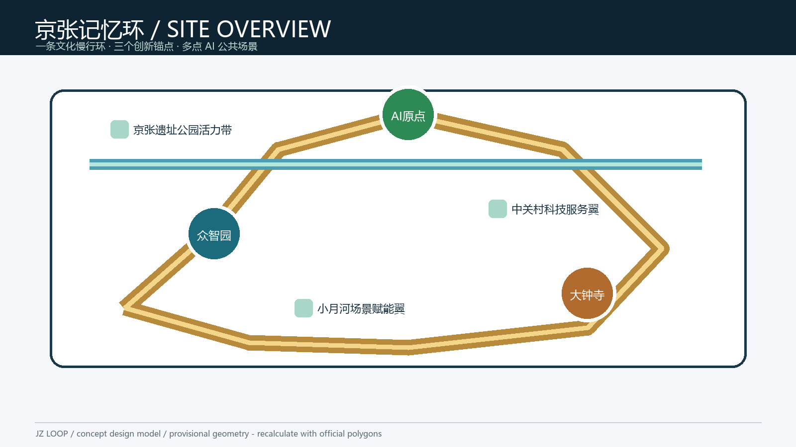
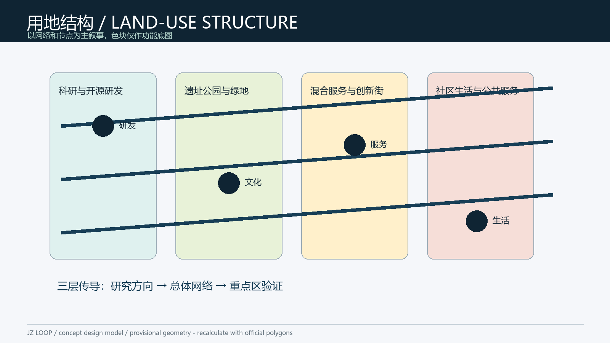
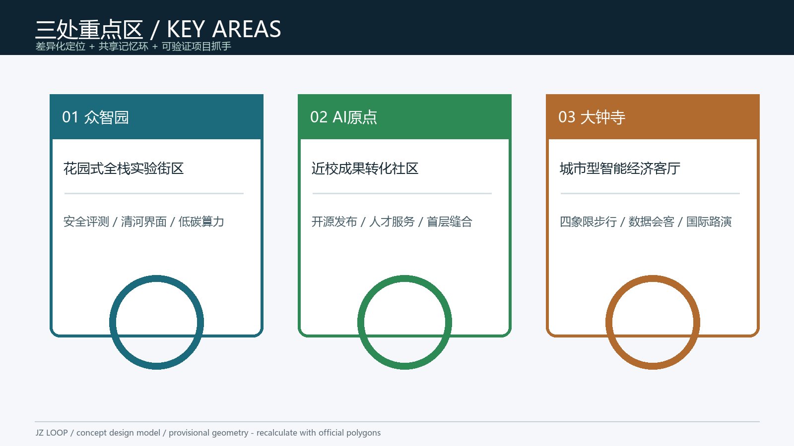
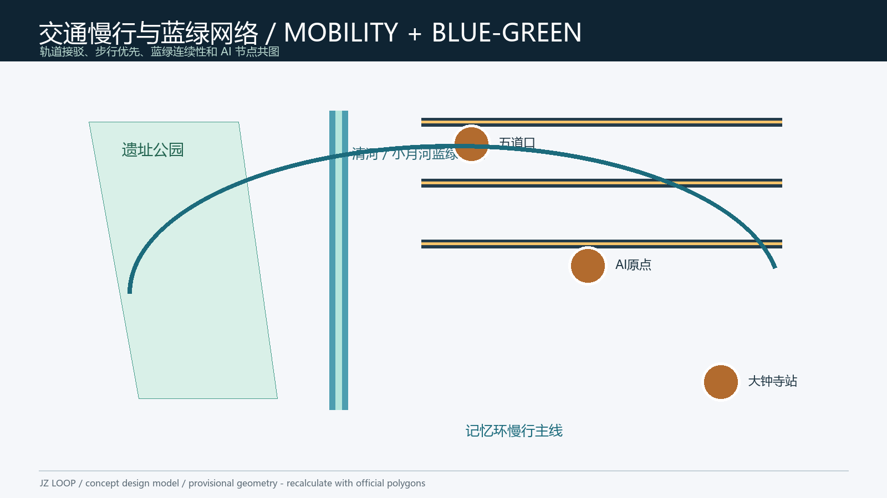
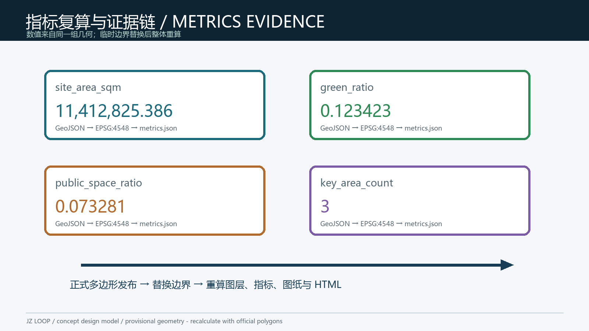

# Jing-Zhang Memory Loop: AI Public Life and Innovation Corridor

## Design Basis and Source List

This proposal is based on the public call, the site package, the source registry, and the agent taskbook. Every spatial move is a concept suggestion for professional teams to deepen; it is not a statutory plan or approval [source:OFFICIAL-ANNOUNCEMENT] [source:AGENT-TASKBOOK]. The exact official boundary and regulatory attachments are not yet in the package, so the submitted geometry is a provisional constraint for design discussion and intake checks only [source:BOUNDARY-SOURCE].

The evidence chain separates the announced scope, cleared public materials, and derived GeoJSON/metrics. Background material is never upgraded to statutory evidence [source:SOURCE-REGISTRY]. Missing items include official boundaries, key-area polygons, road redlines, controls, building survey, ownership, municipal, heritage, and fire-safety data [data:geometry/constraints.geojson#CONSTRAINTS].

## Three-Level Scope Framework

The coordinated research area is about 43.6 km2, the overall design area about 11.4 km2 around the Jing-Zhang Heritage Park, and the three key areas together about 368.4 ha. The submitted design model calculates 11,412,825.386 sqm from its provisional boundary and must be recalculated when official polygons arrive [data:geometry/site_boundary.geojson#SITE-001] [metric:site_area_sqm]. The working sequence is research direction, network structure, then key-area verification [depth:three_level_scope_framework].

## Coordinated Research Area: Industry and Future City Research

The concept is one belt, three innovation anchors, multiple scenarios, and a blue-green slow-mobility loop. It translates the three call positions into AI full-stack innovation, world-class ecosystem, AI+ scenarios, intelligent public life, and AI governance [standard:PROJECT-AGENT-OPEN-CALL-TASKBOOK]. Seven benchmark cases are used only as methods: MaRS Toronto, Station F, the Alan Turing Institute, Pittsburgh Robotics Network, Punggol Digital District, Shibuya QWS, and Brainport Eindhoven. Their lessons become a checklist for space, compute, data, scenarios, capital, talent, and governance; no local company, investment, or policy promise is invented.

The identity “JZ LOOP / Jing-Zhang Memory Loop” uses sleeper rhythm and an open ring. Deep teal, copper, and signal green form a proposed palette; the mark is a continuous line and ring, to be redrawn with cleared fonts and assets [depth:overall_spatial_structure].

## Overall Design Area: Urban Renewal and Regulatory-Plan-Level Urban Design

The spatial structure is a north-south memory loop, two east-west stitching corridors, and three innovation anchors. Land use is partitioned with shared edges into research, green, mixed service, community, and mobility functions [data:geometry/land_use.geojson#LU-001] [depth:land_use_layout]. Buildings are design footprints and renewal types, not ownership or demolition conclusions [data:geometry/buildings.geojson#BLDG-001].

The renewal logic is retain memory, repair interfaces, add cautiously, and operate before building. FAR, height, density, setbacks, and road redlines remain pending official data [metric:floor_area_ratio] [depth:development_intensity_controls].

## Detailed Design of Key Areas

Zhongzhiyuan AI Acceleration Area is a garden-like full-stack test district with low-carbon compute exhibits, standards workshops, and an open test garden [data:geometry/key_areas.geojson#PROV-KEY-001]. Beijing AI Origin Community is a near-campus conversion community linking campus, parks, and living services through an open-source hall and talent desk [data:geometry/key_areas.geojson#PROV-KEY-002]. Dazhongsi AI Industry Cluster is an urban intelligent-economy living room around the station's four walking quadrants, with a smart-device gallery, data commons salon, and international pitch room [data:geometry/key_areas.geojson#PROV-KEY-003] [depth:three_key_area_detailed_design].

## AI Innovation Ecosystem, Personas, and AI+ Scenarios

Five personas are a near-campus researcher, open-source developer, industry service worker, community family, and international visitor. Ten scenario cards are: open-source launch hall, civic-agent sandbox, walkability diagnosis, talent life concierge, AI safety corridor, university-enterprise salon, data commons theatre, low-carbon compute stop, Jing-Zhang memory route, and global AI week route. Each card requires a service owner, location, data minimization, human review, and public explanation [standard:PROJECT-AGENT-OPEN-CALL-TASKBOOK].

Three reference validation scenes are model red-team testing at Zhongzhiyuan, accessible walk navigation at the heritage park, and smart-device/content integration at Dazhongsi. They improve services but do not replace regulation or engineering acceptance.

## Land Use, Building Scale, and Retain-Renovate-Demolish Strategy

Land-use and footprint areas are reproducible design-model outputs. Total floor area, FAR, and height stay unknown until official controls arrive. Retain, renovate, or new-build decisions require public-value, heritage, structural, and ownership checks by professionals [metric:building_footprint_area_sqm] [depth:retain_renovate_demolish].

## Transport, Rail, Municipal Infrastructure, and Public Services

The reference mobility strategy is rail interchange, walking priority, and local micro-circulation, connecting Wudaokou, Qinghua East Road, Dazhongsi Station, and the heritage park. The road layer is conceptual and is not a redline [data:geometry/roads.geojson#ROAD-001] [depth:traffic_rail_slow_parking]. Public nodes include accessible navigation, bicycle management, edge compute stops, and enterprise desks; utilities, fire safety, drainage, and parking capacity require official engineering data [depth:municipal_new_infrastructure].

## Blue-Green Network, Public Space, and Urban Character

The heritage park, Qinghe, and Xiaoyuehe form a continuous blue-green frame. The model green ratio is 0.123423 and public-space ratio is 0.073281, both directly recomputed from provisional geometry and not statutory indicators [data:geometry/green_space.geojson#GREEN-001] [metric:green_ratio]. Railway structures, masonry bases, light metal, and legible wayfinding are proposed character cues; heritage, river, green-line, and night controls remain pending [data:geometry/public_space.geojson#PUBLIC-001].

## Renewal Projects, Implementation Policy, and Phasing

Six reference projects are JZ-01 heritage-park walkability repair, JZ-02 Qinghe innovation edge, JZ-03 Origin Community conversion street, JZ-04 Dazhongsi four-quadrant walking link, JZ-05 public AI service and edge-compute nodes, and JZ-06 global AI week route [data:geometry/phasing.geojson#PHASE-001] [depth:renewal_project_list]. The sequence is operate first, renew second, coordinate later: pilot wayfinding and open days, then retrofit interfaces and service nodes, then deepen construction after controls, ownership, utilities, and finance are confirmed [depth:phasing_implementation].

## Metrics, Area Recalculation, and Compliance Matrix

Core metrics are site_area_sqm=11,412,825.386, green_ratio=0.123423, public_space_ratio=0.073281, key_area_count=3, and building footprint 310,807.184 sqm. The first three are finite values recomputed from the submitted geometry in EPSG:4548 and must be recalculated after official polygons replace the provisional ones [metric:site_area_sqm] [metric:public_space_ratio] [metric:key_area_count]. Compliance, standards, and design-depth matrices retain the complete evidence chain [depth:metrics_recalculation].

## Risk, Copyright, and Compliance

Main risks are misreading provisional boundaries, missing controls and ownership, unknown heritage/green/municipal conditions, privacy, and unclear operating responsibility. All figures are data-driven concept diagrams; icons, fonts, and images are locally drawn or cleared repository assets. No remote tiles, scripts, or unlicensed portraits are used [depth:risk_missing_data]. AI services follow data minimization, explainability, and human review; final judgment remains with people and professional teams.

## References

Full provenance and rights are recorded in `sources.json`, `report/copyright_statement.md`, and `data/source_registry.json`. Key entries are [source:SITE-PACKAGE], [source:OFFICIAL-ANNOUNCEMENT], [source:AGENT-TASKBOOK], and [source:BOUNDARY-SOURCE].
