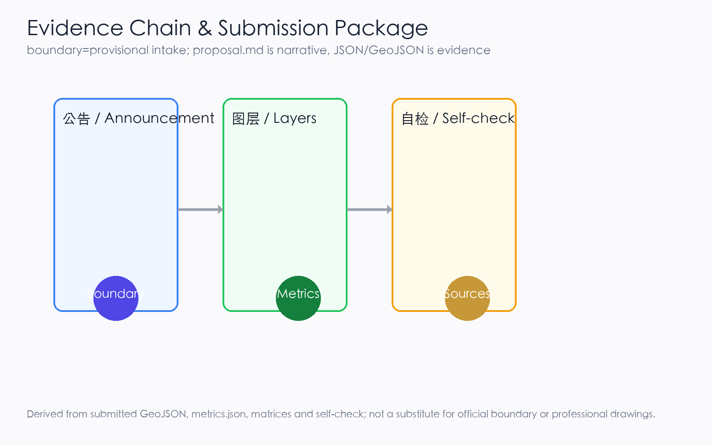
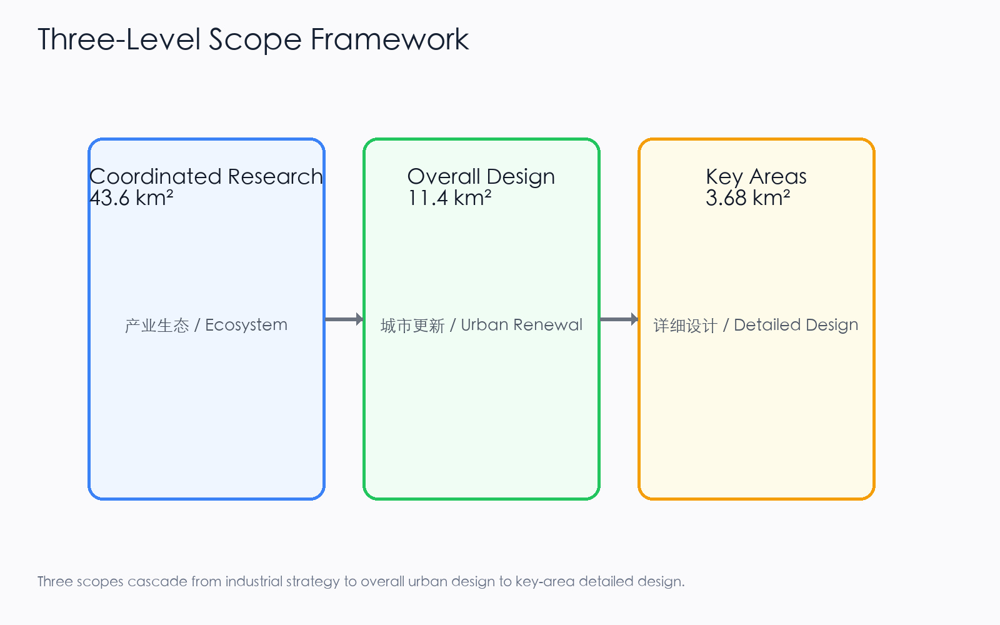
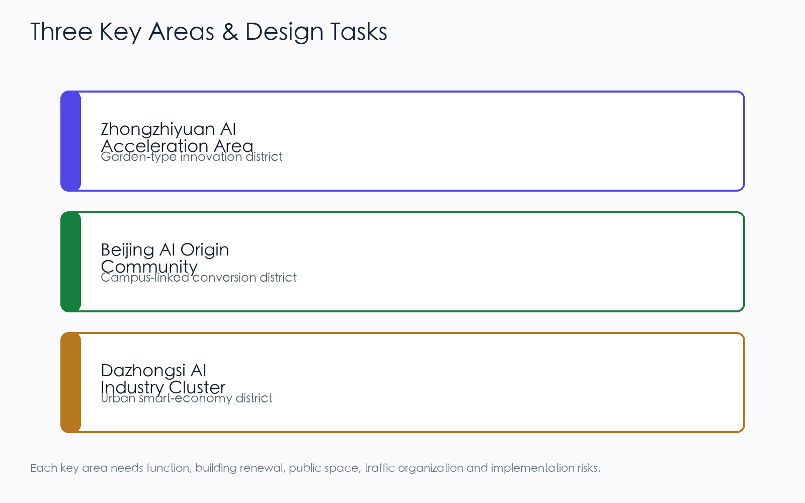
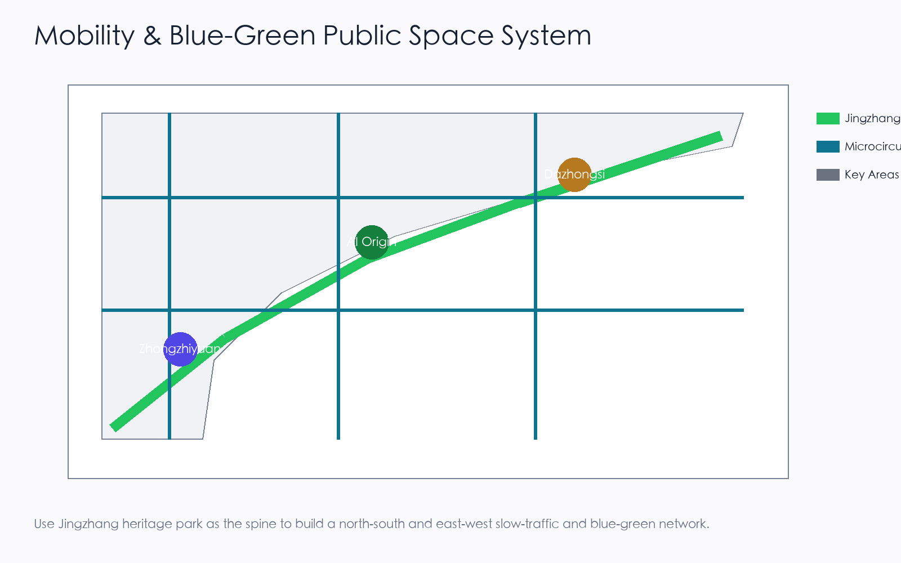
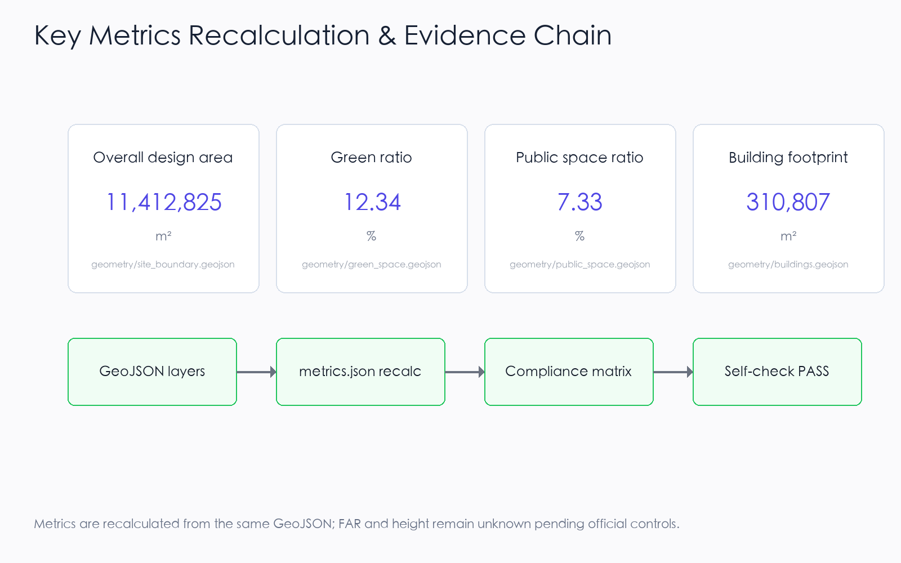

# Jing-Zhang Intelligence Loop: An AI Innovation Belt on the Centennial Railway

## Design Basis and Source List

This formal proposal takes the "Pre-qualification Announcement for the International Open Call for Urban Design of the Centennial Jing-Zhang AI Innovation Belt" issued by the Haidian Branch of the Beijing Municipal Commission of Planning and Natural Resources as its primary basis, and uses the temporary coarse boundary, key areas, enumerations, indicators, and source inventory registered by the maintainer in `brief/site-package/` as machine-readable inputs. Before generating the proposal, the AI agent must read `design_brief.json`, `allowed_design_space.json`, `sources.json`, `enums/`, `ranges/`, `schemas/`, `data/source_registry.json`, and `data/processed/agent_fact_pack.md`, and must use `project_scope_summary.csv`, `agent_task_requirements.csv`, `source_use_matrix.csv`, and `missing_data_checklist.csv` to establish the task list, scope, source use, and gap list. Every design judgment must be decomposed into traceable sources, recalculable indicators, verifiable layers, and manually reviewable assumptions. The announcement requires the proposal to reach the urban design depth of a regulatory detailed plan and the urban design depth of a comprehensive implementation plan; therefore, textual narrative cannot replace GeoJSON, indicator tables, the A3 booklet, the A0 boards, or the HTML electronic presentation.

The proposal is not an independent vision text; it organizes deliverables starting from the announcement, the agent-facing task book, and the site package. This section places only the most critical sources next to each judgment [source:OFFICIAL-ANNOUNCEMENT] [source:AGENT-TASKBOOK] [depth:existing_conditions_diagnosis]. The complete source and standard coverage is kept in `sources.json`, `standard_matrix.json`, and `design_depth_matrix.json`, and is not repeated as a machine index in the body text.

The use boundary of the source registry is as follows [source:SOURCE-REGISTRY]:

- `data/source_registry.json` registers the use boundary of public, clearance, and provisional sources.
- Current registration summary: 7 formal-usable sources, 1 background source, 1 provisional-only source.
- The agent must not upgrade background_only or provisional_only sources into an official boundary, statutory regulatory plan, formal scoring basis, or government implementation commitment.

`data/processed/agent_fact_pack.md` is a reading navigation layer for this proposal, not a new authoritative source [source:PROCESSED-FACT-PACK]. It helps the agent organize the three-level scope, three key areas, announcement tasks, agent.1-agent.6, source availability, and missing-data items into a readable proposal; factual judgments still need to return to the registered original materials [source:OFFICIAL-ANNOUNCEMENT] [source:AGENT-TASKBOOK], and the complete source relationships are preserved in `sources.json`.

When the official `SITE_BOUNDARY` or the three `KEY_AREA` polygons have not yet been obtained, this scaffold uses `brief/site-package/geometry/provisional_boundaries.geojson` to generate a temporary formal package. `geometry/site_boundary.geojson` and `geometry/key_areas.geojson` in the submission package must both be labeled as `provisional_constraint` and `official_boundary=false`, and may only be used for proposal generation, self-check, visualization, and design discussion; they cannot serve as an official redline, approval basis, precise area basis, or statutory control conclusion. This organizer data gap itself does not block content scoring; after replacing with official polygons, the site boundary, key areas, land use, roads, green space, public space, buildings, phasing, and metrics must all be recalculated.

The scoreable status generated by this scaffold is: **provisional boundary, retaining precision warnings and awaiting recalculation after official data release; does not block content scoring**. Therefore, the spatial structure, scenarios, projects, and indicators in the body are written according to the principle of "discussable, reviewable, and recalculable after replacing the official boundary"; when the official boundary and key-area polygons are updated, the agent must rerun the scaffold, self-check, and drawing/HTML generation, not merely replace a single file.

Boundary interpretation can return to the overall scope layer and area recalculation [data:geometry/site_boundary.geojson#SITE-001] [metric:site_area_sqm]. The three key areas are checked by an independent layer and count indicator [data:geometry/key_areas.geojson#PROV-KEY-001] [metric:key_area_count]. This means readers can enter the evidence from the body text without first reading a string of machine identifiers.

## Three-Level Scope Framework

The proposal organizes work according to the three levels determined by the announcement: the coordinated research scope focuses on the AI industrial ecosystem, strategic positioning, innovation chain, and future urban form across 43.6 square kilometers; the overall design scope focuses on the 11.4 square kilometer urban area and industrial zones within 1-2 kilometers around the Jing-Zhang Heritage Park, requiring an overall urban renewal framework, industrial spatial layout, transport and municipal support, and urban character control; the key area scope focuses on the three detailed design districts of 368.4 hectares, requiring clear functional uses, building scale, retain-renovate-demolish classification, public space connectivity, and transport organization. The three levels are mapped item by item in `compliance_matrix.json`, ensuring that announcement items 1.3, 1.4, 1.5 and the mandatory tasks agent.1-agent.6 each have a chapter, layer, indicator, drawing, and HTML evidence.

The depth items of the three-level framework are constrained by [depth:three_level_scope_framework] and [depth:overall_spatial_structure], spatial evidence is based on [data:geometry/site_boundary.geojson#SITE-001] and [data:geometry/key_areas.geojson#PROV-KEY-001], task basis is based on [standard:PROJECT-OFFICIAL-ANNOUNCEMENT], and scope indexing is based on the three-level scope table in `project_scope_summary.csv` within [source:PROCESSED-FACT-PACK].

The three-level tasks are not a collection of disconnected drawings. The coordinated research determines industrial chain and urban form judgments; the overall design translates these judgments into renewal projects, spatial structure, and facility capacity; the key-area detailed design verifies the implementability of specific plots, buildings, transport, public space, and AI application scenarios. When generating the proposal, the agent must first lock the official or provisional boundary and constraints currently adopted by the submission, then generate land use, buildings, roads, green space, public space, phasing, and AI service nodes, and finally recalculate indicators from these layers and explain in the body which conclusions remain constrained by the provisional boundary. Any area, ratio, scale, or project count that cannot be recalculated from structured data must not be written as a formal conclusion.

The overall concept proposed by this proposal is the "Jing-Zhang Intelligence Pulse Symbiosis Belt": taking the Jing-Zhang Heritage Park as the historical and public-space spine, using the three key districts of Zhongzhi Garden, Beijing AI Origin Community, and Dazhongsi as innovation anchors, and taking universities, enterprises, communities, and rail stations as the everyday network, forming a spatial organization of "one belt, three cores, multi-node scenarios, and a blue-green slow-traffic composite loop". Here, "one belt" is not a newly drawn redline, but a translation of the three-level scope in the announcement into a working method; "three cores" correspond to the three key areas; "multi-node scenarios" correspond to operable nodes for AI+ public services, industrial services, and urban life; "composite loop" corresponds to the linkage of slow traffic, green space, public space, and activity routes.

| Level | Design Question | Proposal Response | Data Anchor |
| --- | --- | --- | --- |
| Coordinated research scope | How to organize the AI industrial ecosystem and future urban form | Build an innovation chain of "university sourcing - open-source collaboration - enterprise translation - public experience - international dissemination" | compliance_matrix.json, standard_matrix.json |
| Overall design scope | How to map industrial space, urban renewal, transport/municipal systems, and character | Land use, buildings, roads, green space, public space, and phasing layers jointly express the design | [data:geometry/land_use.geojson#LU-001], [data:geometry/roads.geojson#ROAD-001] |
| Key area scope | How to bring the three districts to detailed design depth | Respectively propose positioning, spatial moves, AI scenarios, and implementation dependencies | [data:geometry/key_areas.geojson#PROV-KEY-001], [data:geometry/key_areas.geojson#PROV-KEY-002], [data:geometry/key_areas.geojson#PROV-KEY-003] |

## Coordinated Research Area: Industry and Future City Research

The core task of the coordinated research scope is to build a world-class AI innovation ecosystem. The proposal should inventory Haidian's universities and research institutes, leading enterprises, computing-algorithm-data elements, incubation platforms, listed companies, unicorns, and sci-tech service resources, and propose a spatial synergy framework for the AI innovation chain, industrial chain, talent chain, and urban service chain. The naming scheme and logo design should serve the overall recognizability of the "Centennial Jing-Zhang Cultural Belt, Urban AI Life Experience Belt, AI Fusion Innovation Belt", not stop at slogans; they should explain the relationship to the industrial ecosystem, public space, and cultural resources. The agent-facing task book also requires responding to the "five major functions" and "three zones, two wings" coordination, forming a naming system, visual identity, overall spatial structure diagram, scenario opening, and operation mechanism that can be further deepened; this section must label these requirements as coming from the agent open-call task with [source:AGENT-TASKBOOK] and [standard:PROJECT-AGENT-OPEN-CALL-TASKBOOK], not from statutory planning control.

Coordinated research does not add pseudo-precise redlines; it connects back to [data:geometry/land_use.geojson#LU-001], [data:geometry/public_space.geojson#PUBLIC-001], and [depth:overall_spatial_structure] through the urban character, public space, and building layout coordination required by [standard:MOHURD-URBAN-DESIGN-MEASURES], explaining that industrial strategy ultimately lands in a visible, reviewable spatial structure.

Future urban form research should answer how artificial intelligence changes work, life, social interaction, learning, transport, and public services. The proposal should translate AI transport systems, continuous green space, innovation service facilities, and an international living-working atmosphere into locatable functional zones, nodes, corridors, and scenarios, rather than vaguely describing a technology vision. The agent should write industrial strategy indicators, AI innovation index, talent density, spatial supply types, and AI+ vertical application key areas into the indicator system, and label which are official, which are design proposals, and which still await calibration against official data. If global AI activities, developer communities, open scenes, or pilgrimage routes are proposed, they should be written as "conceptual proposals / reference schemes / for professional teams to deepen", not as already-determined government activities or implementation arrangements.

## Overall Design Area: Urban Renewal and Regulatory-Plan-Level Urban Design

The overall design scope is required to reach the urban design depth of a regulatory detailed plan. The proposal must put forward an overall urban renewal spatial structure, inefficient-space identification, renewal project list, implementation policy recommendations, industrial function ratios, spatial organization models, total building scale, and comprehensive carrying-capacity assessment. `geometry/land_use.geojson` should fully cover the design boundary without overlap, `geometry/buildings.geojson` should express updated building footprints or retained building footprints, `geometry/roads.geojson` should express microcirculation, slow traffic, and rail connectivity, and `metrics.json` should recalculate core areas, ratios, and layer counts.

This section breaks regulatory-plan-depth content into reviewable objects according to [standard:MOHURD-CONTROL-DETAILED-PLANNING]: [data:geometry/land_use.geojson#LU-001] expresses land-use structure, [data:geometry/buildings.geojson#BLDG-001] expresses building footprints, [data:geometry/roads.geojson#ROAD-001] expresses transport organization, [metric:building_footprint_area_sqm] is used to recheck building footprint area, and [depth:land_use_layout] and [depth:development_intensity_controls] constrain deliverable depth.

The overall design must also support transport, rail, municipal, and supporting facilities. The proposal should propose spatial layout and implementation paths around rail-station integration, road microcirculation, non-motorized vehicle parking, parking supply, innovation service platforms, talent life services, new infrastructure, distributed energy, and edge computing. Content involving building height, development intensity, road redline, setbacks, and facility standards, if official control conditions are not yet available, should be written as "pending confirmation of formal regulatory-plan conditions", and the agent's inferred values must not be passed off as approved indicators.

## Detailed Design of Key Areas

Detailed design of key areas is mandatory. The Zhongzhi Garden AI Independent Innovation Acceleration Zone should propose a detailed plan around the national artificial intelligence platform, full-stack independent innovation, standard setting, safety governance, industrial display, external transport, Qinghe culture, low-carbon green innovation communication environment, and green-space AI scenarios. The Beijing AI Origin Community should propose a detailed plan around campus-adjacent innovation, achievement incubation and translation, talent special zones, open-source systems, brand activities, building retain-renovate-demolish, achievement display and release, residential life support, campus-park slow-traffic connection, and rail-station integration. The Dazhongsi AI Industry Cluster should propose a detailed plan around leading enterprises, intelligent agents, smart terminals, content consumption, data elements, digital assets, commercial services, planned green-space composite use, Dazhongsi Station integration, and four-quadrant pedestrian connectivity at intersections.

Detailed design of the three key areas must reference [data:geometry/key_areas.geojson#PROV-KEY-001], [data:geometry/key_areas.geojson#PROV-KEY-002], and [data:geometry/key_areas.geojson#PROV-KEY-003], and be checked by [depth:three_key_area_detailed_design] for whether it reaches the depth of a comprehensive implementation plan. If it only describes "building a demonstration zone" without evidence of function, buildings, transport, public space, and implementation projects, it should be considered incomplete.

The three key areas must appear in `geometry/key_areas.geojson`. If the repository provides official polygons, they should be used as `official_constraint`; if official polygons are missing, `provisional_constraint` may be used temporarily, but the body text, HTML, sources, assumptions, and self-check must explain that it cannot serve as a formal scoring or approval basis. `compliance_matrix.json` should respectively cover announcement items 1.5.3.1, 1.5.3.2, and 1.5.3.3. Design expression should include functional uses, building scale, building form, retain-renovate-demolish classification, public space system, transport organization, slow-traffic connectivity, and implementation projects. The HTML page should be able to switch views of the three key areas, and the A3 booklet and A0 boards should at least include key-area master plans, local detail drawings, and indicator explanations.

| Key District | Design Positioning | Spatial Move | AI Industry and Operation Scenario | Evidence Reference |
| --- | --- | --- | --- | --- |
| Zhongzhi Garden AI Independent Innovation Acceleration Zone | Garden-style full-stack independent innovation block | Strengthen the Qinghe interface, industrial display, low-carbon innovation communication, and external transport organization; use green space to carry open testing and standard-governance display | Independent model testing, standard-setting workshops, safety-governance display, low-carbon computing experience | [data:geometry/key_areas.geojson#PROV-KEY-001], [depth:three_key_area_detailed_design] |
| Beijing AI Origin Community | Campus-adjacent achievement translation and talent community | Organize campus-park-block slow-traffic stitching; supplement achievement release, talent services, residential life, and open-source collaboration space | Open-source community, achievement release, talent special-zone services, campus-adjacent incubation | [data:geometry/key_areas.geojson#PROV-KEY-002], [source:AGENT-TASKBOOK] |
| Dazhongsi AI Industry Cluster | Urban intelligent economy and international exchange block | Focus on Dazhongsi Station integration, four-quadrant pedestrian connectivity, commercial services, and public environment renewal around key enterprises | Intelligent agent and smart terminal display, content consumption, data elements, and international roadshows | [data:geometry/key_areas.geojson#PROV-KEY-003], [metric:key_area_count] |

## AI Innovation Ecosystem, Personas, and AI+ Scenarios

The proposal should establish spatial demand personas for AI talent and enterprises, covering R&D offices, open-source collaboration, achievement release, enterprise services, talent housing, social learning, consumer life, sports and leisure, and international exchange. AI+ scenarios should form industrial development scenarios and AI-empowered urban function scenarios around the directions of transport, services, consumption, medical care, education, law, and life services proposed in the announcement. Each scenario should explain the service target, spatial location, data source, privacy boundary, manual review mechanism, and operating entity.

AI scenarios must land in spatial and governance boundaries: public-space scenarios reference [data:geometry/public_space.geojson#PUBLIC-001], slow-traffic and transport scenarios reference [data:geometry/roads.geojson#ROAD-001], and open-space scenarios reference [data:geometry/green_space.geojson#GREEN-001] and [metric:public_space_ratio], [metric:green_ratio]. These references let reviewers know that scenarios are not slogans but design objects located in specific layers and indicators. The agent-facing task book requires no fewer than 10 AI scenario cards, no fewer than 3 industrial test-verification scenarios, and no fewer than 5 user personas; the scaffold only provides the structure, and formal participants must write the scenario cards, persona tables, privacy boundaries, manual review, and operating entities into the body text, HTML, A3/A0, and compliance matrix.

| Persona | Typical Need | Spatial Response | Self-Check Boundary |
| --- | --- | --- | --- |
| Open-source developer | Release, collaborate, test, community reputation | Origin Community open-source release hall, public code wall, nighttime collaboration space | Do not collect individual behavioral trajectories; activity data is only aggregated statistics |
| Startup team | Low-cost office, computing access, product test field | Zhongzhi Garden shared test field, edge-computing service point, standard-governance consultation | Computing and data services require separate authorization |
| Leading-enterprise visitor | Display, business, international reception, recruitment | Dazhongsi international roadshow living room, rail-station connection, public space around key enterprises | Enterprise logos and cases must be clearance-sourced |
| Nearby resident | Commuting, leisure, community services, low-disturbance renewal | Jing-Zhang Heritage Park slow-traffic loop, embedded community services, nighttime lighting and activity grading | Do not use resident personas for commercial recommendations |
| University faculty and student | Achievement translation, cross-campus collaboration, daily slow traffic | Campus-park slow-traffic stitching, achievement translation station, AI education experience point | Campus data and research achievements require authorization |

| Scenario Card | Spatial Carrier | Design Description |
| --- | --- | --- |
| 01 Open-Source Release Hall | Beijing AI Origin Community | For universities, open-source communities, and startup teams, providing achievement release, code contribution display, and small roadshow space |
| 02 Safety Governance Sandbox | Zhongzhi Garden | Translate standard setting, safety evaluation, and model red-teaming into visitable, bookable, and supervisable display and collaboration nodes |
| 03 Edge-Computing Station | Overall design scope nodes | Combine with public services, enterprise services, and low-carbon energy strategies as a prototype of new infrastructure to be deepened |
| 04 AI Slow-Traffic Navigation | Jing-Zhang Heritage Park vitality belt | Use explainable wayfinding and low-intrusion sensing to help identify slow-traffic breakpoints, congestion nodes, and accessibility needs |
| 05 Dazhongsi International Roadshow Living Room | Dazhongsi AI Industry Cluster | Serve display, negotiation, media release, and international exchange for intelligent agents, smart terminals, and content-consumption enterprises |
| 06 Qinghe Low-Carbon Innovation Corridor | Zhongzhi Garden Qinghe interface | Combine green space, stormwater, walking and cycling, and AI display as a public living room for the park |
| 07 Campus-Adjacent Achievement Translation Street | Beijing AI Origin Community | For university achievement translation, organize incubation, display, legal, intellectual property, and investment and financing services |
| 08 Data Elements Living Room | Dazhongsi district | On the premise of compliance, authorization, and auditability, display the urban service interface for data-element and digital-asset circulation |
| 09 AI Life Services Model Street | Community and commercial intersection | Land AI+ scenarios such as medical care, education, law, and life services in operable small-scale block spaces |
| 10 Global AI Activity Week Route | One-belt public-space system | Form a walkable, disseminable experience route from heritage culture, open-source community, industrial display to international roadshow |

AI governance recommendations generated by the agent must comply with data minimization, public sources, explainability, and manual review principles. Urban intelligent agents can assist in identifying slow-traffic breakpoints, public-space heatmaps, facility maintenance, enterprise service needs, and activity safety risks, but cannot replace planning approval, output unauthorized individual personas, or claim official implementation commitments. All AI scenario nodes should enter structured layers or the compliance matrix so reviewers can see their relationship to industry, space, and public interest.

## Land Use, Building Scale, and Retain-Renovate-Demolish Strategy

The land-use plan should be expressed according to public standards such as territorial-space survey, planning, and use-regulation classification, forming complete, closed, and seamless land-use zones. The building plan should distinguish retained, renovated, updated, newly built, or to-be-confirmed objects, and clarify the suggested level of building footprint, function, scale, character, roof, massing, and height control. If current buildings, property rights, regulatory plans, and engineering conditions are missing, the proposal can only propose methods and a to-be-calibrated list, and cannot fabricate retain-renovate-demolish conclusions.

Land-use classification is based on [standard:MNR-LAND-USE-CLASSIFICATION-GUIDE], building height, massing, interface, and character control are managed by [depth:height_massing_character], and the retain-renovate-demolish method is managed by [depth:retain_renovate_demolish]. The main evidence for land use and buildings is [data:geometry/land_use.geojson#LU-001], [data:geometry/buildings.geojson#BLDG-001], and [metric:building_footprint_area_sqm].

Building scale and intensity indicators must be consistent with `metrics.json` and the layers. If total building scale, floor-area ratio, building height, building density, green-space ratio, setbacks, and building control lines lack official conditions, they should be listed as unknown or pending_control in the indicator system, and fixed values must not be used to create a false sense of precision. The A3 booklet should provide a renewal project list and indicator recalculation table, the A0 boards should clearly express the key spatial structure and key districts, and the HTML page should provide linked viewing of indicators and layers.

## Transport, Rail, Municipal Infrastructure, and Public Services

The transport plan should respond to the announcement's requirements for rail-station integration, road microcirculation, slow-traffic breakpoints, external transport, parking, non-motorized vehicle parking, and green transport systems. The focus should cover the North Fifth Ring Road, Jing-Zhang Heritage Park cross-ring nodes, Wudaokou, Tsinghua East Road West Exit, Dazhongsi Station, and transport links around key enterprises. Road and slow-traffic layers should remain within the submission boundary and be cross-checked with public space, green space, industrial nodes, and key districts; if the submission boundary is provisional, transport conclusions can only serve as temporary design discussion.

Transport and municipal professional depth are respectively constrained by [depth:traffic_rail_slow_parking] and [depth:municipal_new_infrastructure]; layer evidence references [data:geometry/roads.geojson#ROAD-001], [data:geometry/public_space.geojson#PUBLIC-001], and [data:geometry/constraints.geojson#CONSTRAINTS]. When road redlines, pipelines, fire protection, and municipal conditions are missing, they should be explained as pending in assumptions, rather than writing strategies as approved conditions.

Municipal and public service facilities should cover AI industrial service facilities, innovation service platforms, talent life service facilities, new infrastructure, distributed energy, edge computing, and integration with traditional municipal facilities. The proposal should explain facility standards, spatial layout, service radius, operation model, and phased implementation logic. When engineering data such as pipelines, energy, drainage, flood control, and fire protection are missing, they should be listed as preconditions for formal deepening.

## Blue-Green Network, Public Space, and Urban Character

The blue-green network plan should take the Jing-Zhang Heritage Park vitality belt as the spine, coordinate the Qinghe River, Xiaoyue River, and travel needs of surrounding universities, enterprises, and communities, and propose a north-south and east-west connected pedestrian, cycling, and green-space system. The proposal should identify slow-traffic breakpoints, overpass nodes, southern and northern landscape nodes of the park, and propose parking, sports, innovation communication, technology testing, application display, and public service composite-use strategies.

Blue-green public space is cross-checked by design depth items and green-space and public-space layers [depth:blue_green_public_space] [data:geometry/green_space.geojson#GREEN-001] [data:geometry/public_space.geojson#PUBLIC-001]. The design significance of green-space and public-space ratios is explained in the body, and complete recalculation is saved in `metrics.json`; the coordination of urban character, public space, and building control returns to the professional standards matrix [standard:MOHURD-URBAN-DESIGN-MEASURES].

The urban character plan should integrate the historical culture of the Jing-Zhang Railway, the innovation culture of Zhongguancun, and the AI innovation culture, utilize cultural resources such as Tsinghua Garden Railway Station and Beijing Film Academy, and propose urban keynote, building character, roof form, massing, interface, and public art guidance. The agent should also propose signage, cultural symbols, international dissemination narratives, AI pilgrimage landmarks, contribution walls, or honor display systems, but all brands, fonts, images, portraits, and enterprise logos must have clearance-sourced origins. Character control should distinguish official control, design proposals, and pending conditions, and pseudo-precise control lines must not be given without cultural-heritage or regulatory-plan basis.

## Renewal Projects, Implementation Policy, and Phasing

The implementation plan should form a reviewable renewal project list, explaining project location, type, function, responsible entity, dependencies, implementation stage, risks, and evaluation indicators. Policy recommendations should cover urban renewal coordinated implementation, spatial supply, operation mechanism, industrial services, public participation, data governance, and property-rights coordination. `geometry/phasing.geojson` should express phasing scope, and `compliance_matrix.json` should link each task to phasing and drawings.

The project list and phasing depth are managed by [depth:renewal_project_list] and [depth:phasing_implementation], and phasing spatial evidence is [data:geometry/phasing.geojson#PHASE-001]. If property rights, funding, implementation entities, and approval paths are absent, the proposal must write them as implementation risks rather than commitments to deliver.

| Project ID | Project Name | Type | Main Dependencies | Evidence Reference |
| --- | --- | --- | --- | --- |
| JZ-01 | Jing-Zhang Heritage Park slow-traffic breakpoint stitching | Public space / transport | Road redline, under-bridge space, transport organization recheck | [data:geometry/roads.geojson#ROAD-001] |
| JZ-02 | Zhongzhi Garden Qinghe innovation interface | Blue-green space / industrial display | River blue line, ecology and flood-control conditions | [data:geometry/green_space.geojson#GREEN-001] |
| JZ-03 | Origin Community campus-adjacent achievement translation street | Urban renewal / industrial services | Campus boundary, property rights, ground-floor uses | [data:geometry/buildings.geojson#BLDG-001] |
| JZ-04 | Dazhongsi Station four-quadrant pedestrian connectivity | Rail integration / slow traffic | Rail station, road intersection, municipal pipelines | [data:geometry/public_space.geojson#PUBLIC-001] |
| JZ-05 | AI public services and edge-computing nodes | New infrastructure / public services | Energy, computing, safety, and operating entity | [data:geometry/constraints.geojson#CONSTRAINTS] |
| JZ-06 | Global AI Activity Week public route | Operation / branding | Public space permits, activity safety, copyright clearance | [data:geometry/phasing.geojson#PHASE-001] |

Phasing should be distinguished from the 100-day open-call design cycle: the open-call cycle is the time requirement for submitting deliverables, while implementation phasing is the advancement path for urban renewal and project construction. The proposal should propose near-term pilots, medium-term renewal, and a long-term governance framework, and label which contents can be initiated first with lightweight facilities, operational activities, and service platforms, and which must await confirmation of formal regulatory plans, municipal systems, transport conditions, and property rights. For annual activity systems, developer community operations, scenario open days, public experience routes, and international dissemination mechanisms, the body should explain the operation target, frequency, responsibility boundary, conversion path, and risks, not just write promotional slogans.

## Metrics, Area Recalculation, and Compliance Matrix

The indicator system should at least include overall design scope area, key area area, green-space and public-space ratios, building footprint, renewal project count, AI scenario nodes, slow-traffic connectivity indicators, industrial-space indicators, talent-service indicators, and self-check status. All known indicators must be recalculable from GeoJSON or credible sources; unknown indicators must give reasons and preconditions for formal submission. The results of `scripts/spatial_review.py` and `scripts/visual_review.py` are important evidence for formal self-check.

Indicator recalculation follows unified design-depth requirements [depth:metrics_recalculation]. The body focuses on explaining the design meaning of indicators, such as how the overall scope constrains spatial allocation and how blue-green and public-space ratios support daily communication; complete values, formulas, source files, and confidence levels are saved in `metrics.json`. Example key indicators can be rechecked from overall scope and green-space data [metric:site_area_sqm] [data:geometry/green_space.geojson#GREEN-001].

The compliance matrix is the master control file for task responsiveness. Every announcement task and agent_taskbook task must correspond to a report chapter, layer, indicator, drawing, HTML page, source, assumption, and self-check item. Failure to cover any mandatory task under announcement 1.3, 1.4, 1.5 or agent.1-agent.6 means the proposal may not enter formal professional scoring.

For formal deepening, the agent should also classify each indicator into three categories: the first category is spatial indicators directly recalculable from submitted geometry, such as boundary area, green-space ratio, public-space ratio, building footprint area, and phasing area; the second category is control indicators requiring support from official regulatory plans or task-book attachments, such as floor-area ratio, building height, building density, setbacks, road redlines, and facility standards; the third category is performance indicators requiring continuous calibration with operation or industry data, such as AI innovation index, talent density, industrial service satisfaction, slow-traffic accessibility, activity participation, and scenario usage frequency. The three categories should respectively enter `metrics.json`, `assumptions.json`, and `compliance_matrix.json`, avoiding the mistake of writing operational visions as approved planning conditions.

## Risk, Copyright, and Compliance

**Bilingual content is required.** The primary proposal file may use Chinese or English, but a complete对照译文 must be provided through `proposal.en.md` or `proposal.zh.md`; A3/A0, HTML, and text-bearing drawings must also provide corresponding language copies, and the event's recommended translations in `docs/terminology-glossary.md` should be preferred. A v2 package missing any required translation, language mapping, or valid file will be blocked by finalize and CI. All images, drawings, icons, data, and code assets must explain source, license, and authorization status in `sources.json` or `report/copyright_statement.md`. HTML pages must not load remote scripts, remote map tiles, remote fonts, iframes, forms, or external APIs, and must not track reviewer behavior.

Risk and missing-data lists are cross-checked by risk depth items, constraint layers, and the site package [depth:risk_missing_data] [data:geometry/constraints.geojson#CONSTRAINTS] [source:SITE-PACKAGE]. Gaps in official boundary, key area, regulatory plan, roads, plots, buildings, municipal systems, cultural heritage, and public services listed in `missing_data_checklist.csv` must enter `assumptions.json`, self-check, and the body risk chapter. Any conclusion lacking official regulatory plan, road redline, property rights, municipal, fire protection, or cultural-heritage conditions must be downgraded to a pending item; complete professional checking is saved in the standards matrix.

This proposal does not claim official approval, approved regulatory plan, final land property rights, final construction scale, or guaranteed implementation. The AI agent is responsible for facts, sources, copyright, spatial data, indicators, and expression; maintainers and professional reviewers may require rework or rejection based on self-check results, spatial review, and compliance-matrix requirements.

## References

- brief/public-brief.md
- brief/site-package/design_brief.json
- brief/site-package/allowed_design_space.json
- brief/site-package/enums/
- brief/site-package/ranges/planning_limits.json
- data/processed/agent_fact_pack.md
- data/processed/project_scope_summary.csv
- data/processed/agent_task_requirements.csv
- data/processed/source_use_matrix.csv
- data/processed/missing_data_checklist.csv
- Complete machine index: see `sources.json`, `metrics.json`, `compliance_matrix.json`, `standard_matrix.json`, and `design_depth_matrix.json`
- This section's bibliography entry is based on site-package registration; complete sources and licenses are in the structured source list [source:SITE-PACKAGE]
