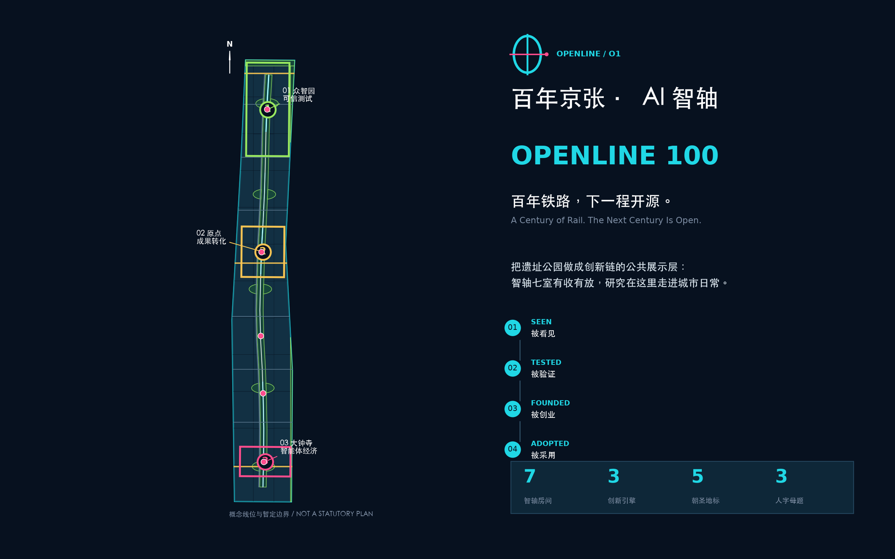
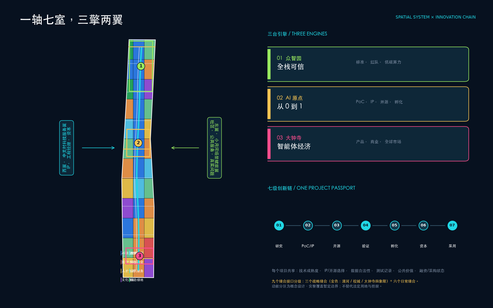
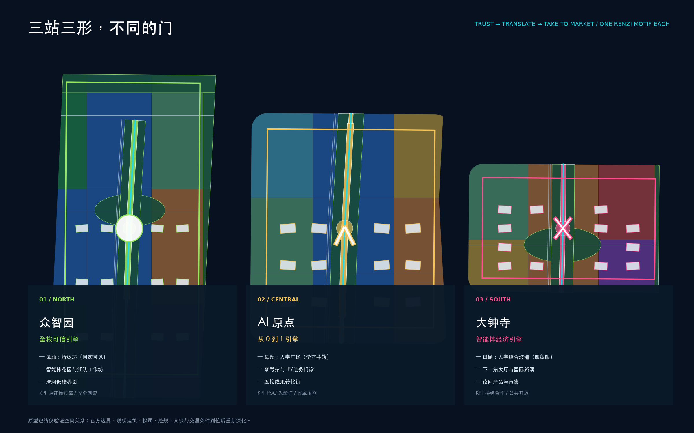
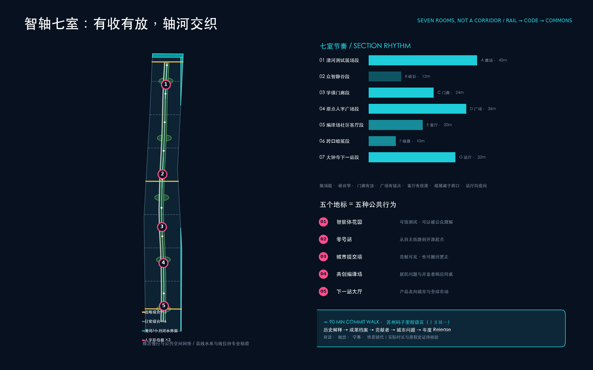
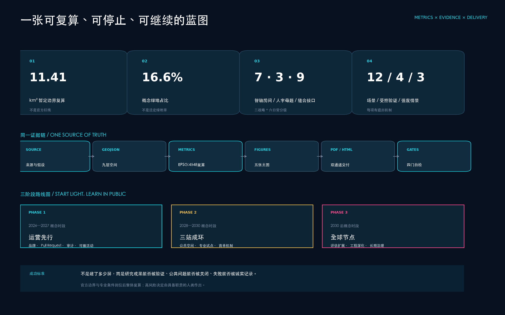

# Jing-Zhang Centennial · AI Wisdom Axis OPENLINE 100: Turn the Innovation Chain into a Public Display Layer

> **Jing-Zhang Centennial · AI Smart Axis——Here, research findings are seen, verified, entrepreneurialized, and adopted.**
> **A Century of Rail. The Next Century Is Open.**

In 1909, the Jing-Zhang Railway demonstrated that Chinese people could independently survey, design, construct, and manage a mainline railway; today, Haidian needs to prove not just "the ability to train models," but also the ability to connect research, code, capital, institutions, and the daily lives of ordinary people. [source:JZ-HISTORY] The railway once connected places, while open-source is connecting minds. The core concept of this proposal is a single sentence: **transform the Jing-Zhang Railway Heritage Park into a public layer of the innovation chain** — where research results are **seen** (through a three-level display interface along the axis), **verified** (at the North Station's Zhongzhiyuan for trusted testing), **started** (at the Central Station's original point from 0 to 1), and **adopted** (at the South Station's Dazhongsi for market and urban life entry). The display layer is not a showcase but a public "city compiler": research results move from closed campuses into public validation, urban issues are transformed into projects in an auditable manner, contributors are seen, and they retain the right to withdraw and correct their contributions.

The proposal adopts a **double-layer naming method**: the Chinese spatial structure term is **Jing-Zhang Zhi Axis** — axis implies sequence, anchor, and ritual, serving as the spatial framework for seven rooms, three engines, five landmarks, and three person-shaped motifs; the international mechanism brand term is **OPENLINE 100 / Jing-Zhang Open Intelligence Line** — OPEN signifies open source, open scenarios, and open cities, LINE represents the railway heritage line, innovation chain, and public life line, 100 both pays homage to the century-old Jing-Zhang and views each proposal as a version that can be iterated. Spatially, it emphasizes memorability and sequence, while the mechanism emphasizes openness and flow, each serving its purpose. The core spatial structure is **one axis, seven rooms, three engines, two wings, five stations, and three person-shaped motifs**; the core institutional structure is **research — confirmation/validation — open source — testing/validation — incubation — capital — urban adoption** seven-level chain. [metric:axis_segment_count] [metric:renzi_motif_count]

## Design Basis and Source List

This package is controlled by the Open Call announcement and the Task Book for Agents, with machine-readable foundations drawn from the site package, source registry, and facts package in the repository. The corresponding standard is [standard:PROJECT-OFFICIAL-ANNOUNCEMENT] [source:OFFICIAL-ANNOUNCEMENT] [source:AGENT-TASKBOOK] [source:SITE-PACKAGE] [source:SOURCE-REGISTRY] [source:PROCESSED-FACT-PACK] , [standard:PROJECT-AGENT-OPEN-CALL-TASKBOOK], [standard:MOHURD-URBAN-DESIGN-MEASURES], [standard:MOHURD-CONTROL-DETAILED-PLANNING], [standard:MNR-LAND-USE-CLASSIFICATION-GUIDE], [standard:MOHURD-ARCH-DESIGN-DEPTH-2016]; The existing conditions diagnosis is managed [depth:existing_conditions_diagnosis].

The most critical data discipline is "do not depict gaps as facts." The warehouse currently lacks official overall boundaries, three key area mapping polygons, regulatory control intensities, current buildings, land ownership, road right-of-way, utility lines, subway entrance locations, and complete cultural heritage control lines for precise design. Therefore, [data:geometry/site_boundary.geojson#SITE-001] and [data:geometry/key_areas.geojson#PROV-KEY-001] are merely the warehouse's provisional constraints, based on [source:BOUNDARY-SOURCE] and [source:KEY-AREA-SOURCE]; this package aims to complete topological validation and conceptual expression, with all derived quantities noted as provisional. The approximately 43.6 square kilometers of the Coordinated Research Area, approximately 11.4 square kilometers of the Overall Design Area, and approximately 368.4 hectares of the key areas are the task's scope, not to be replaced by the warehouse's provisional polygons.

The public background materials only provide "directional calibration," not proof of the site's current status. Haidian's 2025 district statistics show a permanent resident population of 311.1 million, a regional gross product of 13,691.4 billion yuan, with the tertiary industry accounting for 92.56%. There are 92 national key laboratories, 123 registered and launched large models, and 1,568 financial institutions (2025 data are preliminary figures); these only indicate that Haidian has district-level conditions for coupling research and development—industry—finance, but cannot be applied to this specific scope by area. [source:HAIDIAN-STATS-2025] Information on software enterprises and employment in the economic census cannot be equated with AI enterprises and AI employment. [source:HAIDIAN-ECON-CENSUS-2023] R&D funding in Beijing is only used for city-level reference. [source:BEIJING-RD-2024]

Jing-Zhang Park Phase 1 opened approximately 2.5 kilometers and 16.8 hectares in 2023, supporting the background judgment of "heritage conservation and Public Space in parallel," but without providing the full engineering boundary. [source:JZ-PARK-OFFICIAL] The old Tsinghua University Railway Station site has a legally announced protected area and a construction control zone; as this package has not obtained the Qinghuayuan heritage polygon measurement, "pseudo-purple line" is not self-digitized, and any adjacent nodes must be positioned after the cultural heritage review. [source:QINGHUAYUAN-HERITAGE] These boundaries are written simultaneously with data deficiency governance in [assumption:A-BOUNDARY-001], [assumption:A-CONTROLS-001], and [assumption:A-HERITAGE-001].

## Three-Level Scope Framework

Three levels are not three unrelated maps, but an Evidence Chain from strategy to street corner. [depth:three_level_scope_framework]

**Approximately 43.6 Square Kilometers of Integrated Research Layer** addresses the questions of "Why Haidian? Why Here?" by organizing universities, research institutions, enterprises, capital, hospitals, schools, communities, and international network organizations into an open innovation community. It outputs a seven-level ecological chain, global case translations, activity networks, and the "Three Zones and Two Wings" synergistic logic, without generating pseudo-precise plot conclusions.

**Approximately 11.4 Square Kilometers Overall Design Layer** addresses the question of "how the city bears": with OPENLINE as the public main axis, it connects the northern Zhongzhiyuan Full-stack Autonomous Innovation Engine, the central Original Point Technology Transfer Engine, and the southern Dazhongsi Intelligent Body Economy Engine; the west side connects to Zhongguancun's technological services, intellectual property, and capital, while the east side connects to the Xiao Yuehe living scenarios, communities, and cultural facilities. The temporary polygon recalculated area is 11.41 square kilometers, used solely for consistency checks in this layer and indicators. [metric:site_area_sqm]

**Three Key Areas Layer** answers "Where does the first step occur?" Zhongzhiyuan conducts trusted testing and standard governance, the Original Point Community facilitates the first kilometer from university achievements to enterprises, and Dazhongsi supports intelligent body products, commercial consumption, and international roadshows. The three areas are temporarily constrained by [data:geometry/key_areas.geojson#PROV-KEY-001], [data:geometry/key_areas.geojson#PROV-KEY-002], and [data:geometry/key_areas.geojson#PROV-KEY-003], with a count of [metric:key_area_count]; geometry does not replace announced area and legal boundaries.

Three levels share a "Project Passport": each research or urban issue has a unified number, technical maturity, IP/open-source options, data legitimacy, test records, carbon and public value, funding status, and urban procurement status. At the strategic level, the focus is on the combination; at the overall level, the focus is on spatial supply; at the key area level, the focus is on the next threshold. When the official boundaries are in place, replace the constraints and recalculate the entire system; only after the control plan, municipal involvement, and ownership are in place can the professional solutions and approvals be entered. [data:geometry/constraints.geojson#official-controls-not-available] (Official Boundary)

## Coordinated Research Area: Industry and Future City Research

### From Lab to City Order: Seven-Level Open Innovation Chain

1. **Research｜Basic Research**: Universities and national laboratories propose breakthrough principles; OPENLINE Fellows reduce disciplinary barriers through public forums and cross-institutional pairing. Outputs include papers, benchmarks, and risk statements, with publication count not serving as the sole KPI.
2. **PoC & IP｜Concept Validation and Intellectual Property Protection**: The "Zero Station" in the middle section provides engineering management, intellectual property rights, ethics, and advisory services for clinical/educational/public service purposes. It offers reversible choices between open source, patents, and trade secrets. The threshold is a signed requirement from the demand side and the minimum viable validation plan.
3. **Open Source｜Open Collaboration**: Establish city-level repositories, maintainers' micro-funding, model cards/data cards, and contributor agreements. Open source is not about unconditional open data, but about making code, documentation, interfaces, and governance auditable.
4. **Validation｜Trustworthy Testing**: The Northern Smart Agent Garden provides red team, energy consumption, accessibility, deviation, and real-task testing; high-risk areas remain human-responsible. If thresholds are not met, roll back; do not substitute "displayed" for "verified."
5. **Incubation｜Industrial Incubation**: The original point community supports teams through modular units that can be separated, shared equipment, and a 12-week product sprint. The exit criteria are the formation of a clear customer base, compliance pathways, and unit economics, or timely termination.
6. **Capital｜Patent Capital**: West Wing "Capital Platform" combination concept validation note, scenario pilot, intellectual property pledge consulting, industrial capital, and long-term fund; each funding package is tied to the next milestone, with no competition for park rental subsidies.
7. **City Adoption｜City Adoption**: Hospitals, schools, commercial entities, and urban operational institutions become the initial problem owners. Prior to adoption, public impact assessments, pilot scopes, appeal, and exit mechanisms will be made transparent. Replicate successful interfaces and procurement terms rather than duplicating personal data.

A seven-level chain forms a closed loop: urban issues enter the City Pull Request, research teams respond, test results enter the public "commit log," initial orders and investments help expand the project, and real-world use cases form the next round of issues. The project passport runs through the entire chain to avoid teams having to repeatedly fill out forms between incubators, hospitals, funds, and governments. [metric:scenario_count] [metric:test_validation_scenario_count]

### Seven global case studies, not replicating buildings but translating mechanisms

- **Boston / Kendall—The Engine**: Organize technology, IP, market, and financing into a "blueprint"; translate Haidian as an on-site engineering manager and phase gate, rather than just providing desks. [source:CASE-KENDALL]
- **Toronto / MaRS**: Adjacent to universities and hospitals, the center aggregates laboratories, startup companies, and capital services. Haidian is translated as a medical first user, public courtyard, and unified project passport, without replicating institutional governance. [source:CASE-TORONTO]
- **Paris-Saclay**: PoC, technology maturation, prototypes, and connections with seed capital; Haidian adds an OPENLINE facing public and urban orders. [source:CASE-PARIS]
- **Singapore / AI Singapore 100 Experiments**: real problem owners, engineering teams, and project managers deliver together; Haidian forms "100 City Pull Requests," all data and procurement conducted through separate due process. [source:CASE-SINGAPORE]
- **Helsinki / Maria 01**: The old hospital is renovated into a startup community, preserving most of the old buildings and expanding them in phases; Haidian adopts a "operate first, then lightly renovate, and finally build" approach to heritage-friendly updates. [source:CASE-HELSINKI]
- **Seoul AI Hub**: The municipal government establishes and operates a multi-node R&D infrastructure in collaboration with universities and national research institutions, fostering incubation and international collaboration. Haidian increases open micro-grants and public value thresholds to avoid resources flowing only to top-tier companies. [source:CASE-SEOUL]
- **Tsukuba**: Industry-academia-government-financial alliance, urban pilot field, and social implementation collaboration; Haidian complements the Science City's common "institutions strong, streets weak" with along-line Public Spaces. [source:CASE-TSUKUBA]

The common inspiration is: a world-class innovation ecosystem is not a landmark, but rather **strong research sources + neutral translation layer + true first users + layered capital + trusted rules**. Haidian's unique addition is combining the technological density of Zhongguancun with the public narrative of a century-old railway into a walkable, experiential, and contributive line. [metric:global_case_count]

### Three Key Orientations, Five Major Functions, and the Synergistic Loop of the Three Zones and Two Wings

OPENLINE 100 responds to the task book's original names item by item. **Three major positioning** are: the **century-long Jing-Zhang cultural belt** that preserves and reinterprets the engineering spirit through Rail→Code→Commons; the **urban AI life experience belt** where healthcare, education, commerce, transportation, culture, and governance scenarios are integrated into an ordinary day; and the **AI fusion innovation belt** that connects research, open-source, testing, incubation, capital, and adoption. **Five major functions** are: Zhongzhiyuan as the **Full-Stack Independent AI Innovation System**, the original community organizing the **world-class AI Innovation Ecosystem**, twelve scenarios along the line forming the **AI-Enabled Scenario empowerment new paradigm**, the Xiao Yuehe and street interface bearing the **intelligent AI vibrant city**, and public testing, model cards, appeals, and exit mechanisms collectively striving for **AI governance global discourse power**. [source:AGENT-TASKBOOK]

The **Three Zones and Two Wings** are not five isolated islands: the **Zhongzhiyuan AI Independent Innovation Acceleration Area** pushes projects through the trusted testing gate; the **AI Origin** community completes PoC, rights confirmation, open sourcing, and incubation; the **Dazhongsi AI Industry Agglomeration Zone** connects intelligent native business, products, and markets. The **Zhongguancun Technology Services Wing** provides intellectual property, engineering management, capital, and global element services, while the **Xiaoyue River Scenario Enablement Wing** sends communities, public services, and real urban issues into the City Pull Request. The collaborative loop is "Xiaoyue River raises the issue → Origin teams up to translate → Zhongguancun Wing fills in services and capital → Zhongzhiyuan tests governance → Dazhongsi enters the market → the results feed back to Xiaoyue River," with each step written back into the same project passport.

Regional collaboration will adopt the proposed "Five Places and One Agreement," without fabricating existing cooperation: exchange community issues, maintainers, and lightweight prototypes with the **Beixinwei Community**; establish a joint PoC interface for cutting-edge achievements with the **Future Science City**; establish public translation of scientific achievements and interdisciplinary residencies with the **Huairou Science City**; align with the **Beijing Economic-Technological Development Area** for engineering and manufacturing validation of robotics and smart terminals; and establish a portable urban problem, evaluation, and procurement clause library for the **Jing-Jin-Ji** region. The annual Lab-to-City Forum will only release a shared problem list, mutual recognition test templates, and next year's responsible parties; any collaboration must be confirmed by the respective institutions, and cannot be inferred from the proposal text.

### Name and Visual Identity: Let the Brand Become a Navigation Protocol

Mark the logo with two parallel tracks forming a letter **O**, with a cyan "submission line" passing through the midpoint to form a **1**; in smaller sizes, only retain the O/1 structure, prohibiting complex gradients and materialized robots. The main color **Rail Navy #07111F** represents industrial memory, **Open Cyan #20D7E5** represents code and public interfaces, **Signal Magenta #FF4D8D** only marks events and interactive nodes, and **Ballast Paper #F4F6F8** maintains an international editing feel. Naming follows a dual-layer rule: drawings and spatial structures are unified under the Chinese name **"Jing-Zhang Zhi Zhu"** (paragraphs referred to as "Room / Room," sequences as "Zhi Zhu Seven Rooms"), while platforms, passports, and activities are unified under **"OPENLINE 100"**. Nodes shall be referred to as "Station," projects as "Commit," annual achievements as "Release," and milestone language as Suzhou numerals with Arabic numerals in comparison [metric:milestone_count] [assumption:A-MOTIF-001]. Signage must be bilingual (Chinese and English), have high contrast, tactile, and non-numeric alternatives; trademark, domain name, font, and Suzhou numeral documentation clearance must be completed before formal use. [assumption:A-BRAND-001] [assumption:A-ACCESS-001]

## Overall Design Area: Urban Renewal and Regulatory-Plan-Level Urban Design

The overall structure is **one axis and seven rooms, three engines and two wings, five stations and three forms, and nine stitching interfaces**. [depth:overall_spatial_structure] The Jing-Zhang Smart Axis is not a line declared as a heritage route, but a concept public main axis generated within the provisional boundary [data:geometry/roads.geojson#ROAD-OPENLINE]. It connects research, living, commerce, parks, and culture into a daily fabric at the speeds of developer walking, commuter cycling, and barrier-free strolling, serving beyond just festivals.

### The wisdom axis is not a corridor but a sequence of seven rooms.

A roughly nine-kilometer axis, if uniformly wide throughout, would merely be a passageway; the Smart Axis is designed as a sequence of **seven named segments (rooms)**, each with varying widths, cross-sections, and dominant public activities, where the rhythm of expansion and contraction itself is a design element [metric:axis_segment_count] [data:geometry/public_space.geojson#PUBLIC-AXIS-SEG-01]. From north to south:

| Room | Segment Name | Section Family | Conceptual Width | Dominant Public Behavior | Display Intensity |
| --- | --- | --- | --- | --- | --- |
| 01 | Qinghe Test Exhibition Segment | A Exhibition | Approximately 40 meters | Public Viewing and Low-Carbon Computing Education for Trustworthy Testing | High |
| 02 | Collective Wisdom Quiet Valley Segment | B Valley | Approximately 12 meters | Quiet R&D, Habitat Conservation, and Noise Protection | Low |
| 03 | Academic Town Arcade Segment | C Arcade | Approximately 24 meters | Campus Gate Zone Interface and Exhibition Sign Arcade | Height |
| 04 | Origin Human Square Segment | D Square | Approximately 36 meters | Zero Station Announcement, Human Square with Failed Display Case | High |
| 05 | Translated Workshop Community Living Room Segment | E Living Room | Approximately 20 meters | Community Co-Creation, Garden Room, and Intergenerational Activities | Medium |
| 06 | Underpass Dark Expansion Segment | F Dark Expansion | Approximately 10 meters | Dark expansion and sound installation spanning the node below | Medium |
| 07 | Dazhongsi Next Station Segment | G Station Hall | Approximately 32 meters | International Showcase, Market, and Nighttime Life | High |

Seven section families form adrawable section family: gallery open, canyon narrow, porch with a roof, square with a landmark, living room with seating, dark exhibition utilizing the space beneath the node, and station hall facing the night. The boundaries and mouth configurations spanning the existing road (at-grade, underpass, or bridge) are all dependent on official road rights-of-way, tracks, and cultural heritage records. This plan only locks in the rhythm of "which section should be what room." [assumption:A-AXIS-001] The high and quiet segments alternate to allow the axis to accommodate the massive flow of people during the annual OPENLINE Week while also preserving a quiet walk for a researcher during the early morning workday.

### Tiered grammar for public display layers

"The Display Layer" is the core concept of this scheme, therefore the display must be a **verifiable spatial syntax** rather than a random aggregation of five point landmarks. The syntax is divided into three levels: **line** — a continuous display interface along the smart axis with high display intensity segments (signs, Commit interfaces, and accessible ground-level areas), with the conceptual length on both sides recalculated by [metric:display_frontage_length_m]; **surface** — three indoor and outdoor exhibition venues (Smart Body Garden, Station Zero, and the Next Station Hall); **point** — the OPENKIT K04 Commit Plinth and the Suzhou Milestone [metric:milestone_count]. The design guidelines suggest that the "display interface ratio" for high display segments (the proportion of the first-floor displayable interface length to the total first-floor interface length along the line) should target a range of 40% to 60% — this value is a guideline, to be refined with the site, and is not a statutory indicator. The carrier of the display should prioritize the use of heritage elements themselves: the platform as a display stage, the turnout as an interactive node, and the edge of the roadbed as a seating tier; contributors retain the right to withdraw or correct any display content.

### Wing Diagrams: The Value of the Axis Lies in Horizontal Integration

**Zhongguancun Technology Services Wing (West)** and **Xiaoyue River Scenario Enablement Wing (East)** no longer exist only in words: nine stitching interfaces are organized according to a "three strategic stitching + six daily stitching" classification [metric:strategic_interface_count] [data:geometry/roads.geojson#ROAD-X-01], with each interface labeled to indicate what it stitches. Three strategic stitching interfaces are — **Qinghe Blue-Green Stitching** (North, the starting point of axis river weaving), **Origin School City Stitching** (Central, the connection between the academic gate area and the knowledge capillaries), **Dazhongsi Quadrant Stitching** (South, a pedestrian surgery interface between rail candidates and overpass realities); six daily stitching interfaces are respectively connected to Jimumen Community, Xiaoyue River Scenario Enablement Wing (East), the Compilation Field Living Room, Zhongguancun Technology Services Wing, Academic Town Gateways, and Zhongzhiyuan. During the deepening phase, strategic stitching interfaces should be designed with concept plans and barrier-free flow lines, while daily stitching interfaces should first undergo pedestrian audits. When there is no Official Planning Boundary and station entrance data, all interfaces should only express connection priorities. [assumption:A-TRANSIT-001]

Conceptual land use adopts topologically complete zones [data:geometry/land_use.geojson#LU-001]: AI research and development and transformation (0802) are located near the three engines, education and research (0804) form a near-school interface, medical innovation (0806) handles low-risk validation, technology services and urban commerce (05) are situated at the stitching nodes, cultural display (0803) follows the heritage narrative, talent living (0701) and public services (0702) maintain a mixed day-night pattern, and parks and green spaces (1401) form a continuous public base. This serves to compare functional proportions and adjacent relationships, not to alter the statutory land use categories. [depth:land_use_layout]

The update method follows the principle of "understand first, then decide": the first round completes surveys on ownership, age, structural safety, carbon emissions, business types, lease agreements, historical value, and street facades; the second round uses a scoring system for **retaining, minor renovation, renovation, demolition candidates, and new construction candidates**; the third round confirms the decisions with the involvement of property owners, residents, cultural heritage experts, planners, fire safety officials, and operational teams. When there is a lack of data, the prototype envelope is not treated as the current building, and no assumptions are made about the Floor Area Ratio, height, density, or demolition volumes. [metric:building_footprint_area_sqm] [depth:development_intensity_controls]

The urban interface adopts "three checkable rules": along the first floor of OPENLINE, an accessible interface is set every 60–90 meters (the numerical values are suggested by the design guidelines and will be refined with the site development); amenities such as toilets, drinking fountains, seating, and passage are retained during non-activity periods; the perimeter walls of the garden prioritize the use of porticoes, shared front courtyards, and reservation pathways over the complete removal of walls. Roofs are prioritized for biodiversity, rainwater management, and reversible activities, and not for the installation of giant screens to create a "tech-savvy" appearance. Building control is defined after obtaining the necessary legal conditions. [depth:height_massing_character]

## Detailed Design of Key Areas

Three key areas are not three homogeneous parks, but rather three different gates of a seven-level innovation chain. [depth:three_key_area_detailed_design] The total number of conceptual building prototypes is 36 [metric:building_prototype_count], intended solely for testing small-scale clusters, open ground floors, and the relationship with Public Spaces.

### 01 North Station | Zhongzhiyuan "Full Stack Trust Engine"

Located as **From Autonomous Technology to Trusted Verification**. Use the "Agent Garden" as a visible but data-protected testing ground, organizing quiet research courtyards, red team laboratories, standard workshops, low-carbon computing power experiences, and visitor centers around the Qinghe interface. The spatial actions are "one Qinghe slow pedestrian interface, two park open gates, and three types of test courtyards": models and robots are validated in controlled environments, accessibility and energy consumption tests are understandable to the public, and sensitive tests are kept indoors. The spatial theme of this station is the **Switchback Loop** [data:geometry/public_space.geojson#PUBLIC-RENZI-01] —— translating the engineering wisdom of the person-shaped track at Qinglong Bridge "using a switchback to overcome elevation differences" into a visible verification loop: the project enters, undergoes public testing, and if it fails, it is rolled back, making the rollback a visible public event rather than a hidden failure. Any river-related, flood prevention, computing power, power, and transportation measures are subject to official conditions and are not committed to facility capacity. [data:geometry/buildings.geojson#BLDG-001] [assumption:A-MUNICIPAL-001] [assumption:A-MOTIF-001]

### 02 Mid-Station | AI Origin "From 0 to 1 Engine"

Positioned as **from academic achievements to the first urban order**. With "Zero Station" as the public archive and achievement release entry point, it connects the 24-hour collaboration lounge, IP/Legal Affairs Clinic, shared prototype workshop, youth talent short-term residence consultation, and ground-level small shops. Between the campus and the park, it is not defined by a symbolic gate, but by multiple appointment gates, continuous walking paths, and shared activities forming the "knowledge capillaries." The spatial theme of this station is **Renzi Plaza** [data:geometry/public_space.geojson#PUBLIC-RENZI-02] — academic and industrial tracks extend from both sides of the school and city, converge at Zero Station into a Renzi Plaza: the convergence point is also the achievement release point and the location of the failure showcase, symbolizing that both tracks must be followed from 0 to 1. Valuable buildings are preserved and prioritized for light renovations to accommodate studios; any demolish–renovate–retain conclusions require a current condition survey and ownership negotiations. (Demolish–Renovate–Retain Strategy) [data:geometry/public_space.geojson#PUBLIC-LM-02] [depth:retain_renovate_demolish] [assumption:A-MOTIF-001]

### 03 South Station | Dazhongsi "Intelligent Economy Engine"

Located to **transform products into global markets and urban life**. Around the candidate rail station interfaces, form a "Next Station Hall," prioritizing a quadrants-walking-seam sequence, international roadshows, smart terminal trials, content consumption, and nighttime activities; green spaces will host temporary pavilions, ensuring no permanent commercial buildings encroach on public space. The spatial theme of this station is the **Renzi Link Z-shaped ramp** [data:geometry/public_space.geojson#PUBLIC-RENZI-03] — organizing the walking seam concept between the four quadrants cut by overpasses and rail lines with a Z-shaped ramp language, applying the "wisdom of climbing" to urban topography and infrastructure cuts; specific ramp forms, clearances, and accessible slopes must be refined based on the Official Planning Boundary, rail, and fire safety conditions. AI commerce allows users to make active choices without facial recognition, sensitive profiling, or mandatory recommendations; digital asset displays only explain the rules without constituting a transaction commitment. Rail station entrances and exits, road red lines, and traffic data are missing; all lines are prioritized for connection. [data:geometry/public_space.geojson#PUBLIC-LM-05] [assumption:A-TRANSIT-001] [assumption:A-MOTIF-001]

Three key areas share a project passport, open scene agreement, test report format, and visual system, forming a "one registration, three stations" system; simultaneously, they focus on trustworthiness, transformation, and market as main themes.KPI Avoid functional redundancy. **One Form per Station** [metric:renzi_motif_count]: The turnaround loop, the person-shaped plaza, and the person-shaped ramp all originate from the same Jing-Zhang motif, yet each station's function results in a different form—this not only resolves the issue of three stations having the same form, but also makes the "person-shaped" form a unique spatial language recognizable throughout the line. At the ground level of each station, a "failure showcase" is set up to display projects that were terminated and the reasons for their termination, ensuring that innovative culture includes honest acknowledgment of failure, not just success myths.

## AI Innovation Ecosystem, Personas, and AI+ Scenarios

### Seven Types of People, Seven Days on a Single Line

1. **Basic Researchers** require quiet spaces for contemplation, interdisciplinary colleagues, and the option not to be forced into entrepreneurship; in response, the North Station Fellow Room and along the corridor forum are provided.
2. **Open-source Maintainers** require sustainable funding, reputation, documentation, and conflict mediation; supported by Commit Wall, Microsponsorship, and Maintainer Residence Response.
3. **Startup Team** requires small units, test users, legal/IP, and the first order; a 12-week sprint response from the Origin Community.
4. **Clinical/Teacher Professionals** require tools for assistance rather than responsibility transfer; this involves controlled scenarios, Human Review, and responses to exit buttons.
5. **Investors and Enterprise Innovation Leaders** need comparable evidence, compliance status, and authentic customer testimonials; provided by the project passport and the Next Station Hall response.
6. **Community Co-Creation and Public Service Talent** (community workers, accessibility consultants, youth organizers) need to incorporate the genuine needs of residents, children, and seniors into the design, while preserving human-scale elements; this can be achieved through community-curated spaces, quiet periods, and paper-guided tours.
7. **Global Visitors and Digital Nomads** require bilingual entrances, short-term work opportunities, urban culture, and reliable partners; facilitated by OPENLINE Passport and an annual week response. [metric:persona_count]

### Twelve Neighborhood Scene Cards

Each card must answer "who is responsible, where, what data, who reviews, how to stop." Public Space carrier see [data:geometry/public_space.geojson#PUBLIC-DEVELOPER-WALK], blue-green carrier see [data:geometry/green_space.geojson#GREEN-OPENLINE].

**SC-01 Open Source Results Showcase Corridor | Culture + Research.** Origin Community and Developer Walkway; the operator will collaborate with academic maintainers to convert papers, model cards, code, and failure records into bilingual exhibit tags. Only authorized publicly shared materials will be displayed; contributors can retract or correct them. KPI is the rate of reproducibility and public understanding; if unattended for two consecutive seasons, the exhibit will be removed.

**SC-02 Grassroots Eye Health Collaboration Station | AI + Healthcare, Validating Scenario A.** North Station indoor controlled space and community service point; community health institutions are responsible, with AI only assisting in screening, doctors reviewing and deciding on referrals, with no automatic diagnosis. Minimal health data is used, with decentralized access and scheduled deletion. Haidian already has public case studies of grassroots screening with expert review that can serve as a mechanism reference, but the project's efficacy cannot be claimed. [source:HAIDIAN-HEALTH-AI-2026] KPI для проверки выполнения, ставки по направлениям и стадии ошибок; при несоответствии клиническим безопасностям или недостаточном ответе на жалобы немедленно прекращается работа.

**SC-03 Teacher Preparation Co-creation Room | AI + Education, Scenario B.** Near-school interface for the original community; the proposed subject is a school/research and education institution. Teachers select tools and review outputs, with student works not entering training by default, prohibiting automatic scoring or implicit emotion recognition. Haidian's "AI + Education" policy is used to calibrate pilots, standardize, ensure safety, and address ethical considerations, without certifying the approval of the scheme. [source:HAIDIAN-EDU-AI-POLICY] KPI для учителей сбережения времени, ошибочности материалов и осведомленности учащихся/родителей; ошибка или опт-аут жалоб превысила порог будут вызывать откат.

**SC-04 Unobtrusive but Non-Surveillance Active Travel Assistant | AI+Transport, Validating Scenario C.** Nine sensory interfaces; the proposed stakeholders are transportation/park management authorities and accessibility organizations. The system relies solely on on-site manual observation, anonymous counting, or approved aggregated sensor data to identify breakpoints, without accessing individual trajectories or restricted data from delivery, ride-hailing, or logistics platforms. The output is an explainable congestion index and accessibility work orders, with no enforcement. The Haidian District-level active travel infrastructure is only provided as a network direction background. [source:HAIDIAN-MOBILITY-2023] KPI include the duration of breakpoint repairs and the wheelchair/stroller accessibility rate; collection will cease if the re-identification risk or false positive rate is too high.

**SC-05 Small store operations co-pilot | AI + Business, validating scenario D. **Dazhongsi Life Street; the proposed subject is the commercial operator and merchant representatives. Merchants voluntarily upload de-identified order summaries, with the system assisting in scheduling, inventory management, and bilingual services. No single store's commercial secrets are shared, and no consumer-sensitive profiles are created.**KPI To address food waste, merchant retention, and staff error rates; exit if there are unexplained differential pricing or a decline in merchant net revenue.

**SC-06 City Maintenance Pull Request | AI + Governance. ** Along-the-line seating, lighting, ramps, and green spaces; residents submit issues via text/photos, operational personnel merge duplicates, and publicly share processing status. Images are default locally blurred for faces and license plates, with AI only for categorization, not decision-making. **KPI To address closure duration, repeated repair decreases, and complaint satisfaction; revert to manual classification if the work order deviation remains unimproved long-term.

**SC-07 Low-Carbon Computing Heat Recovery Showcase Window | AI + Energy. ** Zhongzhiyuan Indoor Display and Qinghe Interface; the Proposed Subject is the Facility Operations Party and an Independent Carbon and Energy Verification Institution, with Real-Time Display of Verified Facility-Level Energy Consumption and Heat Recovery Destinations, Without Revealing Corporate Sensitive Loads.KPI Measure the completeness rate and unit task energy consumption reduction; conduct only educational activities when energy, municipal, and fire conditions are not obtained, and do not construct the engineering systems.

**SC-08 Legal and Intellectual Property Clinic | AI + Professional Services. **Zero Station; AI organizes public regulations and material lists, with opinions issued by practicing lawyers/patent agents, confidential materials not entering the general model.KPI To address conversion periods, human error rates, and the affordability for small teams; if users mistakenly assume that machine-generated opinions are formal legal opinions, the interface should be paused.

**SC-09 City Memory Decoder | AI + Culture. ** Perimeter of the former Tsinghua Garden site within the legally usable space and cultural route; generate multilingual, children's, and accessibility versions of the explanation using authorized archives, with historical facts reviewed by curators. No fixed facilities to be placed before the protection line polygon.[assumption:A-HERITAGE-001] KPI To correct for response and multiple version usage, individual tracking is not based on dwell time.

**SC-10 Quiet Periods in Parks and Activity Scheduling | AI + Public Space. **Five Garden Rooms; using reservations, manual observation, and anonymized sound level data to coordinate running, children's activities, performances, and quiet needs. The system provides recommendations, but staff make the final decision.**KPI For accessibility during conflicts and complaints and free availability when there is no activity; Public Space is reduced when it is occupied by activities for an extended period.

**SC-11 International Visitor Collaborative Passport | AI+ Talent Services. **Three-stop Service Kiosks; the proposed subject is the International Services Office in collaboration with the community operator. Visitors autonomously select language, skills, and public interests to match activities; no tracking of movements or identity scoring is recorded.**KPI For effective collaboration with local stakeholders; match deviations or harassment complaints exceeding the threshold to freeze the account and handle manually.

**SC-12 Smart Body Garden Red Team Competition | Common Safety Testing Infrastructure. **North Station Controlled Test Field; the proposed subject is an independent evaluation agency and Zhongzhiyuan operators. Enterprises submit agents to test safety, accessibility, energy consumption, and refusal in fictional/synthetic tasks. Results are graded and publicly disclosed according to prior agreements. It does not count towards the four application validation scenarios. Real sensitive business data must not be used for public demonstrations.KPI These are the issue resolution rate and the re-inspection pass rate. Major issues must not be entered into the urban pilot. [assumption:A-AI-SAFETY-001]

**Scenes—Spaces—Operations Overview.** This matrix is used for a quick check of whether "technology has reached the streets and responsibilities have been assigned to organizations," with detailed governance still guided by the aforementioned scene cards.

| Scenario | Primary Space | Proposed Operating Entity | Primary Stopping Condition |
| --- | --- | --- | --- |
| SC-01 Exhibition Gallery | Origin—Developer Stroll Path | Higher Education Maintainer + Alongline Operator | No Maintenance or Authorization Withdrawal |
| SC-02 Eye Health | North Station Indoor + Community Service Point | Community Health Facility | Clinical Safety/Complaints Beyond Line |
| SC-03 Teacher Co-Creation | Near-School Interface at Origin | School/Research and Educational Institution | Errors or Exit Complaints Beyond Scope |
| SC-04 Pedestrian Assistant | Nine Sewing Interfaces | Transportation/Park + Accessibility Organization | Re-identification Risk or High False Positive |
| SC-05 Small Stores Co-driver | Dazhongsi Life Street | Business Operations + Merchant Representative | Differential Pricing or Net Revenue Decline |
| SC-06 Repairs | Alongline Public Facilities | Urban/Park Operator | Classification Deviation Long-term Non-Improvement |
| SC-07 Computing Showcase | Zhongzhiyuan Indoor Space | Operations and Maintenance + Independent Verification | Unmet Energy/Fire Safety Conditions |
| SC-08 IP Outpatient | Zero Station | Lawyer/Patent Firm | Machine Opinion Misidentified as Formal Opinion |
| SC-09 Memory Decoding | Historical Interpretation Point | Curator/Cultural Operator | Preservation Pre-requisites Not Met |
| SC-10 Quiet Period | Five Garden Rooms | Park Operations + Community | Activities Long-Term Crowding Out Public Space |
| SC-11 Collaboration Passport | Three Stations Service Desk | International Services Office | Bias/Harassment Appeal Overstep |
| SC-12 Red Team Competition | Intelligent Body Garden | Independent Evaluation + Zhongzhiyuan | Major Issues Unresolved |

The twelve scenarios shall adhere to data minimization, purpose limitation, aggregation prioritization, human responsibility, explainability, appealability, and exitability; formal pilots must complete ethics/safety, procurement, data, and professional reviews. [assumption:A-PRIVACY-001]

## Land Use, Building Scale, and Retain-Renovate-Demolish Strategy

The concept land use fully covers the provisional boundaries, with a coverage ratio calculated by [metric:land_use_coverage_ratio], and a total area of [metric:land_use_area_sqm]. The classified areas are as follows: research and development transformation [metric:land_use_0802_area_sqm], education and research [metric:land_use_0804_area_sqm], medical collaboration [metric:land_use_0806_area_sqm], technology service business [metric:land_use_05_area_sqm], talent living [metric:land_use_0701_area_sqm], public services [metric:land_use_0702_area_sqm], cultural display [metric:land_use_0803_area_sqm], and concept park green spaces [metric:land_use_1401_area_sqm]. These values only describe the functional proportions of the scheme and do not represent the current or statutory land use nature. [standard:MNR-LAND-USE-CLASSIFICATION-GUIDE]

Building layer [data:geometry/buildings.geojson#BLDG-001] only includes prototype envelopes for three key areas, to validate spatial relationships with small-scale buildings, ground-level accessibility, shared courtyards, and reversible transformations; the concept area of the Building Footprint is seen in [metric:building_footprint_area_sqm]. It is not used to derive the overall Building Coverage Ratio, Floor Area Ratio, or building scale; [metric:floor_area_ratio], [metric:total_floor_area_sqm], [metric:building_density], and [metric:building_height_m] are explicitly marked as unknown.

The preservation assessment uses eight criteria: historical and cultural value, structural and fire safety, lifecycle carbon, current tenant affordability, ground-level public interface, functional appropriateness, ownership feasibility, and implementation disruption. Those with high historical/community value and safety that can be restored are prioritized for retention; those with usable structures but closed interfaces undergo minor renovations; those with inefficient equipment and spaces are subject to systematic updates; demolition is only considered after professional evaluation, alternative relocation, carbon comparison, and approval are completed. The renewal action for prototype buildings is merely a next step in research, not a judgment on any existing building. [depth:retain_renovate_demolish] (Demolish–Renovate–Retain Strategy)

### Development Intensity Envelope: Not providing numerical values, but offering a testable method framework

Intensity metrics are all data-driven, but "unknown" does not equate to "unthought." This scheme provides three **intensity scenario envelopes** [metric:intensity_scenario_count], serving as a framework for the first round of sensitivity testing after the official control plan and current data are in place. Each envelope defines only the assumptions, necessary data, and test questions, without any Floor Area Ratio, height, or density values [assumption:A-INTENSITY-001]: **S1 Low Disturbance Scenario** assumes light renovations and operations of existing buildings, with new construction limited to small-scale public facilities. The test question is "Can the existing development volume support the financial and spatial needs of three stations?" **S2 Weave Scenario** assumes moderate-intensity weaving in underutilized plots with clear ownership and no cultural heritage conflicts. The necessary data include the control plan, ownership, and list of underutilized land. The test question is "Can the weaving volume simultaneously meet the needs for talent housing, incubation spaces, and public interfaces?" **S3 Xiongqing Scenario** Assuming high-intensity development around the proposed rail transit interface to accommodate global functions, the conditions required include rail station access, aviation height restrictions, solar access, and view corridors. The key question to be addressed is whether such high intensity comes at the expense of the public realm and heritage scale of the ground plane. The three scenarios share a common recalibration pipeline: any one of the scenarios should be recalibrated and generate nine layers and all metrics once official data is available, and the results of the three scenarios should be submitted side-by-side for professional review, rather than being pre-locked.

## Transport, Rail, Municipal Infrastructure, and Public Services

The pedestrian network consists of one OPENLINE, two parallel leisure lines, and nine east-west stitching interfaces, totaling [metric:mobility_link_count] conceptual connections, with a total indicative central line length of [metric:road_centerline_length_m]; the buffer estimated area and ratio are [metric:road_area_sqm] and [metric:road_ratio], respectively. Among them, the indicative length of the OPENLINE, [metric:openline_length_m], cannot be interpreted as the official length of the heritage park. [depth:traffic_rail_slow_parking]

The traffic priority order is **pedestrian and barrier-free access—bicycles—public transportation transfer—shared mobility pick-up and drop-off—necessary motor vehicles**. The nine interfaces are managed according to a tiered classification of "three strategic seams + six daily seams" [metric:strategic_interface_count]: strategic seams (Qinghe Blue Green, Origin Point School City, Dazhongsi Quadrants) will undergo conceptual master planning and barrier-free circulation design during the deepening phase, while daily seams will first undergo pedestrian audits to determine light modifications or engineering interventions; when there are no official road right-of-way or station entrance data, no overpasses will be drawn, no signal decisions made, and no 800-meter station coverage calculated, keeping the [metric:transit_station_coverage_ratio] unknown. Formal deepening will focus on reviewing the door-to-door pedestrian network, slopes, crosswalk wait times, nighttime lighting, non-motorized vehicle parking, and emergency access, rather than simply using circular buffer zones.

Public services will adopt a "along-line small stations + professional institution backend" approach: restrooms, drinking water, baby-changing facilities, quiet rooms, emergency services, and artificial consultation will be maintained as non-digital services; intellectual property/law, talent, computing power, clinical, and educational services will be provided by institutions with the corresponding responsibilities. Edge computing power will prioritize the reuse of buildings and verified electrical infrastructure, with initial assessments of energy consumption, residual heat, noise, fire safety, and cybersecurity to determine the scale. [depth:municipal_new_infrastructure] Municipal and energy data are missing, so all pipe diameters, capacities, distributed energy, and underground spaces are recommended to be left for specialized handling; this plan does not replace public services with "intelligent poles."

## Blue-Green Network, Public Space, and Urban Character

The blue-green system is not an AI device showcase belt, but a stable public infrastructure for the innovation belt. [depth:blue_green_public_space] This plan generates a continuous conceptual green thread, five functionalized "garden rooms," and two water interface green belts within the provisional boundaries [data:geometry/green_space.geojson#GREEN-OPENLINE], recalculating the conceptual green space area and ratio as [metric:green_space_area_sqm] and [metric:green_ratio]; Public Space is composed of the Intelligent Axis Seven Rooms, developer promenade, five landmarks, three trapezoidal motifs, and Suzhou code milestone markers [data:geometry/public_space.geojson#PUBLIC-DEVELOPER-WALK], with an area and ratio of [metric:public_space_area_sqm] and [metric:public_space_ratio]. 16.6% and 2.4% are only the proportions of the design layers relative to the provisional boundaries, and are not statutory green space ratios or public service indicators. Haidian District park green spaces and 500-meter coverage data are not pushed down to the site level. [source:HAIDIAN-GREEN-2024]

**The garden rooms have evolved from decorative elements to functional units.** The five rooms each have a clear ecological or social function: the rainwater retention garden captures runoff from adjacent hard surfaces (with capacity and overflow paths to be determined by hydrology studies), the habitat and pollinator garden conserves native plants and prohibits nighttime lighting, the quiet reading lawn prioritizes acoustic environments, the children and intergenerational play garden is shared on a staggered schedule, and the performance and testing lawn accommodates temporary pavilions and outdoor credible testing. The rooms are not evenly distributed decorative ellipses but are a reason for "slowing down" within the smart axis rhythm.

**Axis and River Interweave: Qinghe and Xiaoyuehe are the Second System.** The Zhongzhi Axis is a north-south oriented human activity sequence, while Qinghe (north) and Xiaoyuehe (east) are the actual natural framework of this site. The proposal expresses the "axis and river" interweave intention through two conceptual water interface green belts [metric:water_interface_count]: the northern Qinghe interface belt is the strategic seam interface, also serving as the waterfront viewing platform for Zhongzhiyuan's pedestrian interface and low-carbon computing exhibition; the eastern Xiaoyuehe interface belt is the green channel for scenario empowerment to penetrate the community. Both water systems' official blue lines, flood protection, and ecological conditions have not been digitized. This proposal does not digitize the pseudo-blue lines, and any revetments, cross-sections, and ecological measures await official data and the water management specialty. [assumption:A-WATER-001]

### Five AI Pilgrimages Sites: Not Monuments, but Five Types of Public Behaviors

1. **Agent Garden**: Transform trusted testing at North Station into a comprehensible public viewing; indoor sensitive, outdoor explainable.
2. **Station Zero**: Connects the autonomous projects of 1909 with the open-source starting point of today; records papers, PoCs, failures, and restarts.
3. **City Commit Wall**: Honors are not ranked by funding amount but by replicable contribution, public value, and maintenance years; submission to the wall is voluntary, and can be withdrawn or corrected.
4. **Commons Compiler**: Residents' issues, developer responses, and operational work orders are openly "compiled" on the same table, ensuring that participation is not reduced to mere opinion collection.
5. **Next Station Hall**: Dazhongsi's international roadshow and nighttime lifestyle living room, where annual releases are announced and the rationale for discontinued projects is displayed. [metric:landmark_count]

Five landmarks are conceptual, reversible public facilities that must be designated with operational, maintenance, safety, and accessibility responsibilities after professional approval; if the approval is not granted or if there is no maintenance for two consecutive operational cycles, they will be removed and restored to generic Public Space.

**OPENKIT Public Space Component Library** allows landmarks to be maintained rather than one-off sets: K01 **Rail Bench** organizes replaceable seating and wheelchair companion seats at the scale of sleepers; K02 **Shade Loop** provides seasonal shading and rain shelter interfaces; K03 **Power Dock** offers only professionally verified low-voltage power supply/charging, without open uncontrolled network access; K04 **Commit Plinth** accommodates physical placards, low-data QR codes, and Braille at the same time; K05 **Accessible Dock** provides continuous ramps, tactile positioning, and adjustable interaction heights; K06 **Quiet Edge** uses planting and acoustic interfaces to protect quiet activities; K07 **Sensor Sleeve** reserves only detachable mounts for approved anonymous environmental sensing; K08 **Pop-up Frame** supports pop-up exhibitions, roadshows, and markets. All components use a unified module, replaceable parts, material passports, and offline alternatives; each is marked with the owner, inspection cycle, open hours, and removal triggers, and must not be fixed installed without cultural heritage, fire safety, or accessibility confirmation.

### Rail → Code → Commons: Approximately 90 Minutes Concept Tour

The route starts from the historically explained point of the Tsinghua Garden under legal open conditions, reading "Autonomous Surveying and Engineering for the Country"; to Station Zero to observe the "Methodological Changes" from research and development conversion to open-source collaboration in Zhongguancun; along the Developer's Walkway, scan low-data QR codes or read physical exhibition labels; at the Commit Wall, recognize the contributions of maintainers, teachers, doctors, and residents; at Commons Compiler, participate in a City Pull Request; and finally arrive at Next Station Hall, where a project's journey into urban daily life is showcased. The entire journey is marked with **Suzhou Code Milestones** [metric:milestone_count]—Chinese digital characters (｜, stroke, dot……) from the traditional Jing-Zhang Railway historical markers, placed every kilometer, with Arabic numerals, Braille, and voice alternatives; this is a unique navigation system that no other linear park can replicate, and its adoption must be preceded by historical documentation verification. [assumption:A-MOTIF-001] Approximately 90 minutes is a conceptual curatorial rhythm, and the actual duration must be determined after verification of the official line, entry points, and pedestrian network. Children's line narrates the story through a "Find the Switch" game, while the accessibility line offers tactile maps, subtitles, sign language appointments, and printed guides. The nighttime line illuminates only necessary nodes to protect residents and ecology. Any fixed facilities must obtain survey and professional approval before being placed near cultural heritage objects. [source:QINGHUAYUAN-HERITAGE]

Urban Character adopts the approach of "industrial skeleton, garden base, digital ignition": preserve abstract proportions such as sleeper scale, rivets, platform edges, without resorting to historical facsimiles; plants and permeable surfaces form the daily backdrop; blue lighting is limited to entrances, submissions, and state changes. Prohibit full-street screens, robotic sculptures, and continuous sound-light interactions. Accessibility, low disturbance, and genuine contributions are themselves a sense of the future.

## Renewal Projects, Implementation Policy, and Phasing

Twelve project packages form two lists: "operations that can be done first" and "works that must wait," totaling [metric:renewal_project_count]. [depth:renewal_project_list]

1. **P01 OPENLINE Brand Commons** (led by: Proposed Brand and Community Operations Group): name, open-source visual assets, bilingual signage; precede with trademark/font clearance;KPI For node identification and barrier-free passage; replace upon infringement or misrepresentation.
2. **P02 City Pull Request Platform** (Proposed Operating Entity + Public Stakeholder): publicly raise issues, match teams, and record status; prioritize data governance and procurement; KPI is effective closure rate; major privacy incidents will result in an immediate shutdown.
3. **P03 Zero Station Light Intervention Pilot** (Original Point District Ownership and Operation Parties): Results Release, IP Consultation, Maintainer Space; Preceding Steps Include Title Ownership, Structural and Fire Safety Checks, and Cultural Heritage Verification; KPI is the Proportion of PoC Validation; Long-Term Low Usage Will Revert to General Public Space.
4. **P04 Intelligent Body Garden Beta** (Zhongzhiyuan Consortium): Synthesize mission red team with public education and exhibition; precede with safety protocols; KPI is the retest pass rate for repairs; no access for major safety issues.
5. **P05 Nine Sewer Interface Audits** (planning/transport team): Conduct a pedestrian and accessibility audit first, then decide on light modifications or engineering; prioritize the Official Planning Boundary, station entrances, and traffic flow; KPI is the closure rate of gaps; auditing stops if the official planning boundary or safety conditions are not verified.
6. **P06 Five Garden Rooms** (Landscape Operations + Community): Quiet, Exercise, Children, Testing, and Demonstration Spaces Shared in Time-Specific Segments; Prioritize Ecological and Park Management Conditions;KPI For free open duration; commercial activities crowd out and reduce.
7. **P07 Commit Wall** (Contribution Agreement) (Open Source Foundation Type Entity):  voluntary, revocable, and correctable honor system; KPI for maintaining sustainability and image diversity; if disputes cannot be mediated, the contribution will be temporarily removed.
8. **P08 AI+ Healthcare/Education Controlled Pilot**(Professional Institution): Implement SC-02/03; precede with professional ethics, data, procurement, and informed consent procedures; KPI prioritize safety and human quality, stopping at the first sign of risk.
9. **P09 Dazhongsi Next Station Hall (Commercial/Industrial Operator): International roadshows, terminal trials, and nighttime services; preceding are track, fire safety, noise, and ownership issues.KPI For continued cooperation after the transaction, not solely evaluated based on foot traffic.
10. **P10 Low-Carbon Computing Capacity Feasibility Specialization** (Energy/Computing/Fire Safety Team): Assess loads, residual heat, carbon emissions, and noise; conduct only the specialized assessment if data is insufficient; do not proceed with construction of the data center if there is no net environmental benefit or if it touches fire safety or energy boundaries.
11. **P11 OPENLINE Passport accessible navigation**( Culture + Accessibility Organization): digital and paper parallel; KPI for task completion rate and error correction duration; any mandatory registration is immediately canceled.
12. **P12 Public Value Dashboard (**Independent Assessment Group): Issue project passports, failures, and corrective actions quarterly; front-load with indicator agreements;KPI To ensure data integrity and external verification, do not use a single ranking to incentivize data submission; if the data cannot be independently verified, stop the ranking and mark it as unavailable.

Phase 3 scope fully covers the tentative boundary [data:geometry/phasing.geojson#PHASE-001], with recalculated metrics at [metric:phasing_area_sqm], [metric:phase_1_area_sqm], [metric:phase_2_area_sqm], and [metric:phase_3_area_sqm]. [depth:phasing_implementation] **Phase 1 / 2026—2027 Conceptual Phase** will focus on branding, public governance, issue platforms, pedestrian audits, and temporary activities; **Phase 2 / 2028—2030 Conceptual Phase** will construct three Public Spaces and controlled pilots after the program is complete; **Phase 3 / Post-2030 Conceptual Phase** will expand international nodes and specialized engineering based on evaluation. Phases are a design roadmap, not a government investment, approval, or construction commitment. [assumption:A-OPS-001]

### Eight annual operational products: from festive foot traffic to continuous contribution

The annual calendar includes [metric:annual_program_count] product families: **A01 January Openline Call** (outputting problem pools); **A02 March Maintainers-in-Residence** (outputting resident teams); **A03 April Rail→Code Spring Commit Walk** (outputting cultural tours); **A04 June Trust Test Trustworthy Agents Competition** (outputting test reports); **A05 September OPENLINE Week** (outputting annual releases); **A06 October Global Lab-to-City Forum** (outputting international collaboration lists); **A07 Monthly Station Night / Failure Review Night** (outputting failure archives); **A08 Year-round City Pull Request + Microgrants** (outputting problem closure records and microgrant ledgers). The annual week only accounts for one week of the year's operations, while the remaining 51 weeks rely on problems, residencies, microgrants, testing, and first orders to form a closed loop.

Proposed governance adopts a "four-seat roundtable": public sector/property rights and professional institutions, research and industry, community and public interest organizations, and independent safety and audit, each with a veto boundary; operational income may come from compliant site rentals, membership services, corporate challenges, funds, and public service procurement, but park access, basic exhibitions, and issue submissions remain free. Quarterly releases will announce inputs, project phases, failures, corrections, and public value; projects without maintainers, no genuine stakeholders, or failing to meet safety standards will be removed from the resource pool after two consecutive periods. This "pilgrimage site" relies not on a single spectacle, but on annual recurring rituals and credible records. [assumption:A-INDUSTRY-001]

## Metrics, Area Recalculation, and Compliance Matrix

All spatial quantities in this package are recalculated from EPSG:4326 exchanged geometry to EPSG:4548 to avoid discrepancies between the text, maps, and HTML. [depth:metrics_recalculation] The tentative total area is [metric:site_area_sqm]; land use coverage [metric:land_use_coverage_ratio]; concept green space [metric:green_space_area_sqm] / [metric:green_ratio]; concept Public Space [metric:public_space_area_sqm] / [metric:public_space_ratio]; prototype Building Footprint [metric:building_footprint_area_sqm]; concept road centerline length [metric:road_centerline_length_m] / [metric:road_area_sqm] / [metric:road_ratio]. Calculate the total area for three key zones [metric:key_detailed_design_area_sqm], which are divided into [metric:key_area_1_calculated_sqm], [metric:key_area_2_calculated_sqm], and [metric:key_area_3_calculated_sqm]. These are "calculated from the submitted geometry," not "known for the actual site."

The content metrics are also verifiable: zoning units [metric:land_use_parcel_count], building prototypes [metric:building_prototype_count], pedestrian connections [metric:mobility_link_count], landmarks [metric:landmark_count], scenarios [metric:scenario_count], test validations [metric:test_validation_scenario_count], personas [metric:persona_count], global case studies [metric:global_case_count], projects [metric:renewal_project_count], and annual programs [metric:annual_program_count]. All known metrics are listed in `metrics.json` with their formulas, sources, confidence levels, and assumptions. The intensity, height, site coverage, and passenger flow retention, where official conditions are lacking, are unknown, among [metric:existing_daily_footfall] Do not use commercial heat maps or individual trajectories that have not been cleared of rights.

Nine data files can be independently checked: boundary [data:geometry/site_boundary.geojson#SITE-001], key areas [data:geometry/key_areas.geojson#PROV-KEY-001], land use [data:geometry/land_use.geojson#LU-001], buildings [data:geometry/buildings.geojson#BLDG-001], traffic [data:geometry/roads.geojson#ROAD-OPENLINE], green spaces [data:geometry/green_space.geojson#GREEN-OPENLINE], and Public Space [data:geometry/public_space.geojson#PUBLIC-DEVELOPER-WALK]. Constraints [data:geometry/constraints.geojson#official-controls-not-available], phased [data:geometry/phasing.geojson#PHASE-001]. Among these, the empty constraint layer is a genuine "not obtained," not a omission.

Cover the regulatory grid for all mandatory responses in announcements 1.3, 1.4, and 1.5, as well as agents.1 through agent.6; the standard matrix corresponds to six criteria, while the deep matrix checks each item for current diagnosis, three-tier scope, overall spatial structure, land use layout, development intensity controls, height massing character, traffic rail slow parking, municipal new infrastructure, blue-green public space, renewal project list, risk of missing data, and project phases. [depth:overall_spatial_structure] [depth:land_use_layout] [depth:development_intensity_controls] [depth:height_massing_character] [depth:traffic_rail_slow_parking] [depth:municipal_new_infrastructure] [depth:blue_green_public_space] [depth:renewal_project_list] [depth:risk_missing_data] (Demolish–Renovate–Retain Strategy)

## Risk, Copyright, and Compliance

The primary risk of this proposal is not "lack of bold imagination," but rather the mistaken assumption that imagination is equivalent to fact. [depth:risk_missing_data] Boundaries, zoning, existing buildings, ownership, traffic, cultural heritage, utilities, specialized facilities, industry, operations, and brand risks are documented in assumptions. Once official data is available, the response is not a local re-drawing of the map, but rather the regeneration of nine layers, indicators, the five diagrams, and HTML and PDF files. `floor_area_ratio` and other unknown items do not participate in the determination of the review conclusion. Any subsequent professional deepening must be completed by the planning, architecture, landscape, transportation, municipal, cultural heritage, fire safety, energy, legal, clinical/educational ethics, and accessibility teams together.

Privacy and security bottom lines are: do not collect unnecessary data, do not trade individual trajectories for pretty heat maps, and do not let models take the responsibility of doctors, teachers, law enforcement officers, or planning approvers; all high-risk scenarios must have Human Review, appeals, audits, and technical or operational exit strategies. [assumption:A-PRIVACY-001] [assumption:A-AI-SAFETY-001] Without obtaining district-level population, business, foot traffic, and OD data, we do not calculate district-level data based on area, nor do we fabricate "talent density" or economic benefit promises.

Body, drawings, symbols, diagrams,HTML With PDF This scheme is original and generated for this occasion; the map only uses the provisional geometry from the repository and does not embed remote map tiles, library images, company logos, or personal data.PDF Searchable Chinese text only embedded as adopted SIL OFL 1.1 The Noto Sans SC font subset; five sheets PNG The system font has been rasterized and font files are not distributed. Global examples are translated only through text translation mechanisms and linked to the original pages, without copying their images or layout. External publicly available materials' copyrights belong to the respective rights holders; this package provides links and limited factual summaries for referencing and commenting needs. License, font, and trademark status can be found in `report/copyright_statement.md`. This package uses `COMMUNITY-DISPLAY-ONLY`, and does not claim official approval, statutory planning authority, funding commitment, or implementation authorization. [assumption:A-EXTERNAL-CASES-001]

## References

The materials are divided into five groups and are strictly classified by their intended use. The first group consists of the main submission documents: the official announcement, the agent task book, and the site package, which are used to determine the three-story scope, six tasks, depth of deliverables, and machine validation rules. [source:OFFICIAL-ANNOUNCEMENT] [source:AGENT-TASKBOOK] [source:SITE-PACKAGE] The second group pertains to boundaries and data governance: the source registry, the processed fact package, the provisional overall boundary, and three key areas, which only support the concept generation, topological self-check, and subsequent replacement process, and cannot be upgraded to legal redlines. [source:SOURCE-REGISTRY] [source:PROCESSED-FACT-PACK] [source:BOUNDARY-SOURCE] [source:KEY-AREA-SOURCE]

The third group is the Jing-Zhang Railway, parks, and cultural heritage documents from the first-hand public background, used to establish the Rail→Code→Commons narrative and conservative cultural heritage preconditions, not to derive the engineering alignment. [source:JZ-HISTORY] [source:JZ-PARK-OFFICIAL] [source:QINGHUAYUAN-HERITAGE] The fourth group is data from Haidian District and Beijing's statistics, policies, and public cases, used to assess regional innovation, education, healthcare, green spaces, active transportation, and research and development environments; all data are retained at the administrative scale and year, not converted by area. [source:HAIDIAN-STATS-2025] [source:HAIDIAN-ECON-CENSUS-2023] [source:HAIDIAN-EDU-AI-POLICY] [source:HAIDIAN-HEALTH-AI-2026] [source:HAIDIAN-GREEN-2024] [source:HAIDIAN-MOBILITY-2023] [source:BEIJING-RD-2024]

The fifth group consists of the institutional homepages of seven international cases for comparative analysis of outcome transformation, validation of real-world issues, heritage renewal, multi-node governance, and international mechanisms; the schemes only translate the systems, not the images, scale, investment, or policy commitments. [source:CASE-KENDALL] [source:CASE-TORONTO] [source:CASE-PARIS] [source:CASE-SINGAPORE] [source:CASE-HELSINKI] [source:CASE-SEOUL] [source:CASE-TSUKUBA] The URL, publisher, access date, specific purpose, and limitations of each external reference are recorded in sources.json; the copyright and licensing boundaries are detailed in report/copyright_statement.md.

### Machine-readable evidence index

The following index ensures that reviewers can trace back from the narrative to the sources, standards, depth, layers, and metrics; it does not replace professional judgment with citation counts.

- Source: [source:OFFICIAL-ANNOUNCEMENT], [source:AGENT-TASKBOOK], [source:SITE-PACKAGE], [source:SOURCE-REGISTRY], [source:PROCESSED-FACT-PACK], [source:BOUNDARY-SOURCE], [source:KEY-AREA-SOURCE], [source:JZ-PARK-OFFICIAL], [source:QINGHUAYUAN-HERITAGE], [source:JZ-HISTORY], [source:CASE-KENDALL], [source:CASE-TORONTO], [source:CASE-PARIS], [source:CASE-SINGAPORE], [source:CASE-HELSINKI], [source:CASE-SEOUL], [source:CASE-TSUKUBA] [source:HAIDIAN-STATS-2025], [source:HAIDIAN-ECON-CENSUS-2023], [source:HAIDIAN-EDU-AI-POLICY], [source:HAIDIAN-HEALTH-AI-2026], [source:HAIDIAN-GREEN-2024], [source:HAIDIAN-MOBILITY-2023], [source:BEIJING-RD-2024]
- Standards: [standard:PROJECT-OFFICIAL-ANNOUNCEMENT], [standard:PROJECT-AGENT-OPEN-CALL-TASKBOOK], [standard:MOHURD-URBAN-DESIGN-MEASURES], [standard:MOHURD-CONTROL-DETAILED-PLANNING], [standard:MNR-LAND-USE-CLASSIFICATION-GUIDE], [standard:MOHURD-ARCH-DESIGN-DEPTH-2016]
- Depth: [depth:existing_conditions_diagnosis], [depth:three_level_scope_framework], [depth:overall_spatial_structure], [depth:land_use_layout], [depth:development_intensity_controls], [depth:height_massing_character], [depth:retain_renovate_demolish], [depth:traffic_rail_slow_parking], [depth:municipal_new_infrastructure], [depth:blue_green_public_space], [depth:three_key_area_detailed_design], [depth:renewal_project_list] [depth:phasing_implementation], [depth:metrics_recalculation], [depth:risk_missing_data]
- Metrics: [metric:site_area_sqm], [metric:land_use_area_sqm], [metric:land_use_coverage_ratio], [metric:green_space_area_sqm], [metric:green_ratio], [metric:public_space_area_sqm], [metric:public_space_ratio], [metric:building_footprint_area_sqm], [metric:road_centerline_length_m], [metric:road_area_sqm], [metric:road_ratio], [metric:openline_length_m], [metric:phasing_area_sqm], [metric:key_detailed_design_area_sqm] [metric:key_area_count], [metric:land_use_parcel_count], [metric:building_prototype_count], [metric:mobility_link_count], [metric:landmark_count], [metric:scenario_count], [metric:test_validation_scenario_count], [metric:persona_count], [metric:global_case_count], [metric:renewal_project_count], [metric:annual_program_count], [metric:axis_segment_count], [metric:display_frontage_length_m], [metric:renzi_motif_count],  [metric:milestone_count], [metric:strategic_interface_count], [metric:water_interface_count], [metric:intensity_scenario_count], [metric:land_use_05_area_sqm], [metric:land_use_0701_area_sqm], [metric:land_use_0702_area_sqm], [metric:land_use_0802_area_sqm], [metric:land_use_0803_area_sqm], [metric:land_use_0804_area_sqm], [metric:land_use_0806_area_sqm], [metric:land_use_1401_area_sqm], [metric:phase_1_area_sqm],  [metric:phase_2_area_sqm], [metric:phase_3_area_sqm], [metric:key_area_1_calculated_sqm], [metric:key_area_2_calculated_sqm], [metric:key_area_3_calculated_sqm]
- Assumptions: [assumption:A-BOUNDARY-001], [assumption:A-CONTROLS-001], [assumption:A-LANDUSE-001], [assumption:A-EXISTING-001], [assumption:A-TRANSIT-001], [assumption:A-HERITAGE-001], [assumption:A-MUNICIPAL-001], [assumption:A-PARK-001], [assumption:A-AXIS-001], [assumption:A-MOTIF-001], [assumption:A-WATER-001], [assumption:A-INTENSITY-001], [assumption:A-PRIVACY-001], [assumption:A-AI-SAFETY-001], [assumption:A-INDUSTRY-001] [assumption:A-BRAND-001], [assumption:A-OPS-001], [assumption:A-ACCESS-001], [assumption:A-EXTERNAL-CASES-001]

**One Sentence Delivery: Let the century-old railway be more than just commemorated, and let public intelligence of the next century be collectively submitted here.**
