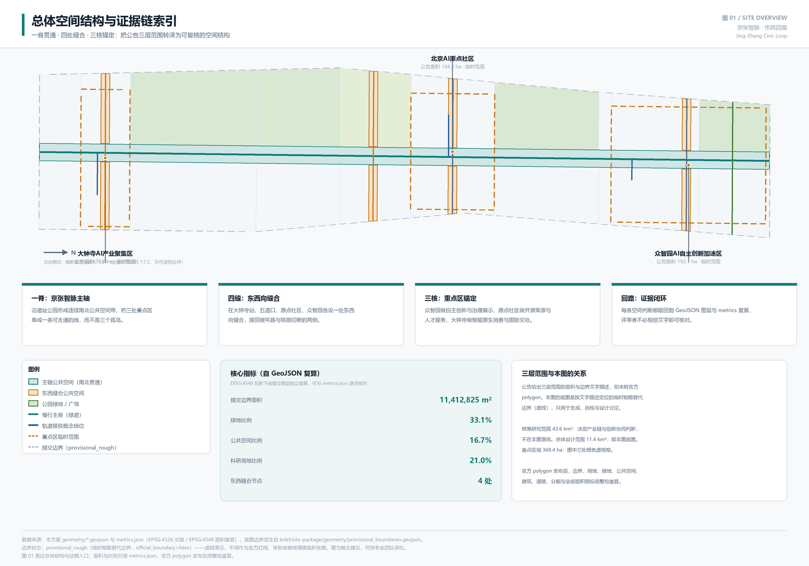
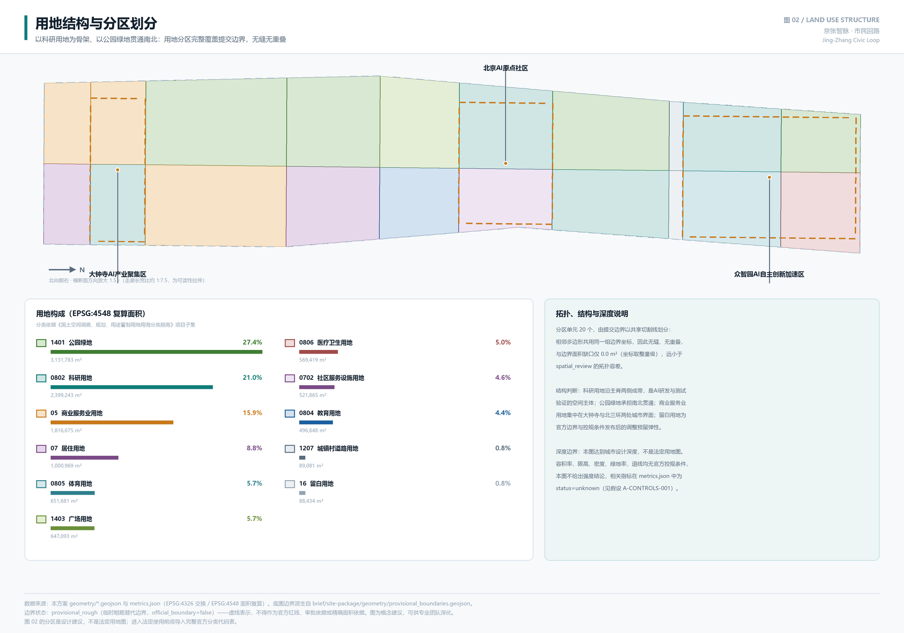

# 京张智脉 · 市民回路：以缝合与证据闭环重塑百年京张AI创新带

> 本方案是面向智能体开源征集的**共创建议**，属概念性、前瞻性、研究性与运营性成果。不替代正式规划，不构成政府审定结论。所有空间落地建议均为**概念建议、参考方案，可供专业团队深化研究**。

## 设计依据与资料清单

本方案的第一依据是北京市规划和自然资源委员会海淀分局发布的《百年京张AI创新带城市设计国际方案征集资格预审公告》[source:OFFICIAL-ANNOUNCEMENT]，以及维护者登记为清权摘录的《面向全球智能体开展百年京张AI创新带城市设计开源征集任务书摘录》[source:AGENT-TASKBOOK]。前者确定三层范围、三处重点区域与成果深度要求 [standard:PROJECT-OFFICIAL-ANNOUNCEMENT]，后者确定三大定位、五大功能、三区两翼与 agent.1 至 agent.6 六项必选任务 [standard:PROJECT-AGENT-OPEN-CALL-TASKBOOK]。专业口径依据《城市设计管理办法》[standard:MOHURD-URBAN-DESIGN-MEASURES]、《城市、镇控制性详细规划编制审批办法》[standard:MOHURD-CONTROL-DETAILED-PLANNING]、《国土空间调查、规划、用途管制用地用海分类指南》[standard:MNR-LAND-USE-CLASSIFICATION-GUIDE] 与《建筑工程设计文件编制深度规定》[standard:MOHURD-ARCH-DESIGN-DEPTH-2016]，后者用于说明本方案属城市设计深度而非建筑工程设计深度。

**资料可用性边界是本方案最重要的前置判断。** 依据公开来源登记表 [source:SOURCE-REGISTRY]，可用于正式成果的资料 5 条、provisional-only 资料 1 条、背景资料 0 条。关键事实是：**官方 `SITE_BOUNDARY` 与三处 `KEY_AREA` 的精确 polygon 尚未发布**。公告只给出面积数值与边界文字描述，仓库据此派生了临时粗略替代几何 [source:BOUNDARY-SOURCE][source:KEY-AREA-SOURCE]，标记为 `boundary_precision=provisional_rough`、`official_boundary=false`、`geometry_role=provisional_constraint`。本方案据此确立三条自我约束：

1. **临时边界只用于生成、自检、可视化与设计讨论**，不作为官方红线、审批依据、精确面积依据或法定控制结论。见 [data:geometry/site_boundary.geojson#SITE-001] 的 `usage_note` 与假设 `A-BOUNDARY-PROVISIONAL`。
2. **缺失的法定控规条件不以推测值填补。** 容积率、建筑高度、建筑密度、绿地率、退线、建筑总规模在 `metrics.json` 中一律为 `status=unknown` 并写明原因，对应假设 `A-CONTROLS-001`。以估算值冒充审定指标是被明确禁止的。
3. **所有 `known` 指标必须能从提交几何独立复算。** 复算采用 EPSG:4326 交换、EPSG:4548 计算面积的坐标政策 [source:SITE-PACKAGE]，与 `scripts/spatial_review.py` 使用同一投影与 union 逻辑，因此申报值与评审复算天然一致，而非事后凑数。

这三条约束决定了本方案的写法：正文解释设计判断与理由，`geometry/*.geojson` 承担空间证据，`metrics.json` 承担可复算证据，三张矩阵承担任务与深度覆盖证据。读者不必相信任何一段文字——每条结论都能回到对应文件核对。资料导航层为 [source:PROCESSED-FACT-PACK]，它帮助组织三层范围、公告任务与缺资料清单，但不是新的权威来源，一切事实判断仍回到公告与任务书。现状诊断与资料缺口的对应关系见 [depth:existing_conditions_diagnosis]，缺口位置已落到 [data:geometry/constraints.geojson#CON-PROV-BOUNDARY] 与三处重点区的待补条件要素中。

复算后的提交边界面积为 [metric:site_area_sqm] 11,412,825 m²，与公告 11.4 平方公里的文字口径相差 +12,825 m²（约 0.11%）。这个偏差不是精度声明，而是**临时边界的误差量级披露**：它说明按文字描述定位的边界与真实红线可能存在的量级差，也说明为什么面积敏感的结论必须等官方 polygon 发布后重算。

## 三层范围工作框架

公告确定的三层范围不是三套并列图纸，而是同一条判断链的三个尺度 [depth:three_level_scope_framework]。本方案对三层的分工作如下界定：

| 层级 | 公告面积 | 本方案的工作目标 | 落到哪里 | 边界状态 |
| --- | --- | --- | --- | --- |
| 统筹研究范围 | 43.6 km² | AI 产业链与创新协同判断、未来城市形态研究；**不在本包落线** | `compliance_matrix.json`、`standard_matrix.json` | 仅文字口径，无 polygon |
| 总体设计范围 | 11.4 km² | 城市更新总体框架、用地与建筑规模、交通市政支撑、风貌控制，达控规深度城市设计 | [data:geometry/site_boundary.geojson#SITE-001]、[data:geometry/land_use.geojson#LU-001]、[data:geometry/roads.geojson#ROAD-001]、[data:geometry/phasing.geojson#PHASE-001] | `provisional_rough` |
| 重点区域范围 | 368.4 ha | 三处片区详细设计：功能、建筑、交通、公共空间、AI 场景、实施依赖 | [data:geometry/key_areas.geojson#PROV-KEY-001]、[data:geometry/buildings.geojson#BLDG-001]、[data:geometry/constraints.geojson#CON-ZHONGZ] | `provisional_rough` |

**为什么统筹研究范围不落线。** 43.6 平方公里的范围其决定性内容是产业链协同与要素配置机制，而非空间控制线。在没有官方边界的条件下强行画一圈 43.6 平方公里的红线，只会制造一条无法核对的伪精确线。因此本方案在这一层只输出机制判断（见"统筹研究范围产业与未来城市研究"一节），并把可空间化的部分下沉到总体设计范围表达。这是有意的取舍，而非遗漏。

**三层如何逐级落实。** 统筹层判断"这条带子在全球 AI 竞争中靠什么立住"——答案是自主创新体系、开源生态与可开放的真实场景；总体层把这个判断翻译成空间：科研用地成带、公共空间贯通、轨道接驳成网，用地分区完整覆盖边界 [metric:land_use_total_area_sqm]；重点层验证这套结构在具体片区能否成立，三处重点区合计复算面积 [metric:key_area_total_area_sqm] 3,692,893 m²，与公告 368.4 公顷相差 +8,893 m²。若某个判断在重点层无法落到具体的建筑、交通与公共空间动作上，就说明它在总体层也只是口号，应当回退重写。

**provisional boundary 的具体限制与重算清单。** 临时边界为按边界文字描述（北至北五环路，东至学院路/西土城路，南至西直门外大街，西至大钟寺东路/荷清路）粗略定位的多边形，在 EPSG:4548 下校核到约 11.4 平方公里。它的粗略之处在于：拐点位置是按主要道路走向推断而非实测，边界线不等同于道路中线、红线或法定范围线。因此官方 polygon 发布后，下列内容必须**整包重算而非单文件替换**：`site_boundary` → `land_use` 分区（因为分区是对边界的划分）→ `green_space`、`public_space`（因为绿地由用地派生、公共空间被边界裁剪）→ `buildings`、`roads`、`phasing`（因为均受边界裁剪）→ `metrics.json` 全部面积与比例指标 → 五张图件与 `visual/index.html`。重算责任与路径已写入假设 `A-BOUNDARY-PROVISIONAL` 与 `A-KEY-AREA-PROVISIONAL`。

## 统筹研究范围产业与未来城市研究

### 总体概念与命名体系

本方案提出的总体概念是 **「京张智脉 · 市民回路」**（英文 *Jing-Zhang Civic Loop*），回应 agent.1 的命名体系与视觉识别要求 [source:AGENT-TASKBOOK]。

命名的三层含义对应公告的三大定位：**「京张」**接百年京张文化带，指向铁路遗产这条真实的历史线索；**「智脉」**接 AI 融合创新带，"脉"既是京张遗址公园这条南北向的空间主脉，也是算力、数据、开源协作构成的技术脉络；**「市民回路」**接都市 AI 生活体验带，"回路"一词同时承载两重意思——空间上是一条可以走通、走回来的连续公共空间环，技术上是"感知—判断—人工复核—改进"的闭环，强调 AI 在这里服务的是市民日常，且始终保留人的最终判断。

**这个命名拒绝了什么。** 它不照搬城市、园区或企业名称，不使用"硅谷""大脑""之都"这类外部借喻，也不停留在口号层面——"回路"直接对应本方案的核心空间动作（四处缝合形成连续回路），命名与设计互为验证。若把四处缝合去掉，这个名字就不成立，这是命名与方案绑定的检验标准。

**视觉识别方向（概念建议）。** 标识以"一竖四横"的极简线性结构为母题：一条纵向主脊代表京张智脉，四条横向短线代表四处东西缝合，整体读作一个可延展的路径符号，也可抽象为轨道与钟表指针的双重联想（呼应大钟寺）。色彩建议以京张铁路铁灰、遗址公园草绿、算力冷青三色为基调。延展性方面，"一竖四横"可退化为单色线稿用于导视，可加载为动态生长动画用于传播，可按重点区替换横线数量形成子标识。**边界说明**：本方向为原创概念建议，尚未做商标近似检索与字体授权确认，见假设 `A-IP-CLEARANCE`；正式采用前须由专业团队完成权利检索。本方案不使用任何未经授权的字体嵌入、企业标识、人物肖像或论文图像。

### 三大定位、五大功能与三区两翼协同回路

任务书的三大定位、五大功能与三区两翼若各自罗列，容易变成互不相干的三张清单 [source:AGENT-TASKBOOK]。本方案用一条协同回路把它们串起来：

**协同回路的六个环节**：高校院所策源（AI原点社区近校区位）→ 开源协作与成果发布（原点社区开源发布厅）→ 自主体系攻坚与标准治理（众智园全栈自主创新）→ 真实场景开放测试（主轴沿线与三处重点区）→ 企业转化与智能原生业态（大钟寺产业聚集）→ 公共体验与国际传播（全域公共空间与活动路线）→ 反馈回策源环节。

这条回路在空间上的落点是明确的：三区承担回路的三个重环节——**AI原点社区**对应"世界级AI创新生态"，靠的是近校策源与开源协作；**众智园AI自主创新加速区**对应"AI全栈自主创新体系"与"AI治理全球话语权"，靠的是攻坚空间与可参观的标准治理界面；**大钟寺AI产业聚集区**对应"智能原生新业态"，靠的是站城一体的消费与国际交往界面。两翼承担横向连接——**中关村科技服务翼**提供要素全球化配置、IP 与资本赋能，**小月河场景赋能翼**提供场景落地与生活体验，对应"AI+场景赋能新范式"与"智能化AI活力城市"。五大功能因此不是五个标签，而是回路上五种不可替代的能力。

**回路能否闭合，取决于物理可达性。** 这是本方案最核心的判断：如果三个重点区之间走不通，上述回路只存在于 PPT 上。而这条带子的真实状况正是被切断的——所以缝合是产业协同的前提，而不是产业之后的环境美化。这一判断直接决定了下一节的空间策略与近期分期安排。

### 全球AI创新生态案例：六类机制而非六个名字

回应 agent.2 的 5-8 个全球案例要求 [source:AGENT-TASKBOOK]。本方案刻意归纳为**六类机制**而非罗列六个机构名称，理由有两点：一是可用资料只包含公开的公共信息，编造企业名单、投资额或产值是被明确禁止的 [standard:PROJECT-AGENT-OPEN-CALL-TASKBOOK]；二是机制才可转译为空间，名字不能。对应假设 `A-ECOSYSTEM-CASES-PUBLIC`。

| 生态类型 | 可借鉴机制 | 空间需求特征 | 本方案的空间转译 |
| --- | --- | --- | --- |
| 开源社区驱动型 | 以开放协作与贡献者声誉聚集人才，贡献记录本身成为资产 | 发布场所、协作空间、夜间可用 | 原点社区开源发布厅 + 贡献者荣誉墙 |
| 大学衍生转化型 | 紧邻高校形成成果转化链，缩短从论文到产品的距离 | 孵化、法务、知识产权、投融资的近距离组合 | 近校成果转化街 |
| 测试验证驱动型 | 以真实场景开放测试换取技术迭代速度 | 可监管、可参观、可预约的验证段 | 安全治理沙盒 + 低速配送验证段 |
| 站城一体消费型 | 以轨道枢纽承载智能原生消费与国际交往 | 高质量步行连通，四角均可到达 | 大钟寺站四象限缝合 |
| 要素流通服务型 | 以数据、算力、资金要素的合规流通为核心竞争力 | 服务型会客厅，强调可审计 | 数据要素会客厅 + 端侧算力驿站 |
| 公共体验传播型 | 以可步行的公共体验路线形成城市辨识度 | 连续公共空间，路线可讲述 | 全球AI活动周路线 |

**转译时的取舍。** 六类机制中，前三类是本方案判断这条带子最有条件建立的——因为海淀的高校密度与科研用地基础是既有优势，科研用地占比 [metric:land_use_r_and_d_ratio] 达 21.02%，是用地结构中的第二大类。后三类需要更多外部条件（轨道站点资料、数据交易制度、活动运营主体），因此在分期上置于中长期。这个排序不是价值判断，而是**依赖条件多少**的排序：依赖越少的先做，这是本方案分期逻辑的统一原则。

### 未来城市形态：AI 改变的是什么

未来城市形态研究若泛泛描述技术愿景，无法落到用地与指标上。本方案把问题收窄为一个可回答的问题：**AI 在这条带子上改变的，首先是"公共空间需要承载什么"。**

三个具体判断：其一，**研发工作的场所在外移**。模型训练在远端机房，但调试、评测、演示、争论需要面对面，因此公共空间要能承载非正式的技术交流，而不只是休憩——这支撑了创新交往广场与开源发布广场的设置。其二，**测试需要真实环境**。自动驾驶、低速配送、具身智能无法只在实验室验证，城市街道本身成为生产要素，因此公共空间要能被"借用"为可监管的验证段——这支撑了低速配送验证段与安全治理沙盒。其三，**治理需要可见**。AI 治理话语权不来自文件数量，而来自能否让评测、标准、红队测试这类看不见的工作变成可参观、可质询的城市界面——这支撑了众智园治理展示广场。

这三条判断共同解释了为什么本方案把公共空间比例做到 [metric:public_space_ratio] 16.72%、绿地比例 [metric:green_ratio] 33.11%：不是为了指标好看，而是因为上述三类活动都需要公共空间承载，且都需要连续而非碎片的公共空间 [depth:overall_spatial_structure][standard:MOHURD-URBAN-DESIGN-MEASURES]。同时，AI+交通、连续绿色空间体系与国际化生活工作氛围的具体落点，分别见"交通、轨道、市政与公共服务设施""蓝绿空间、公共空间与城市风貌"两节。所有涉及活动、招商、资金与政策的内容，均为概念建议或深化方向，不构成已确定的政府安排。
