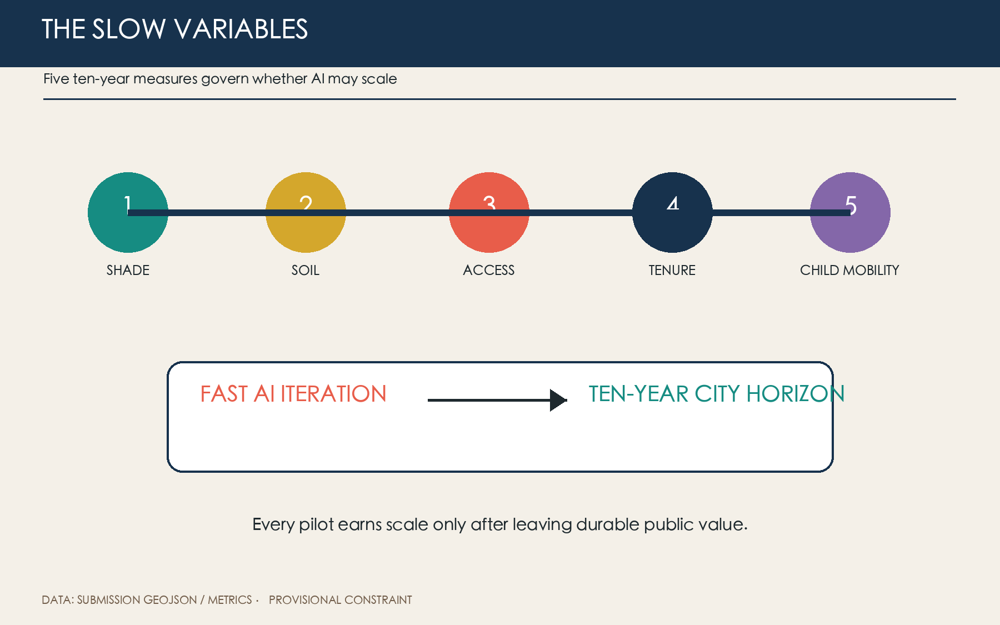
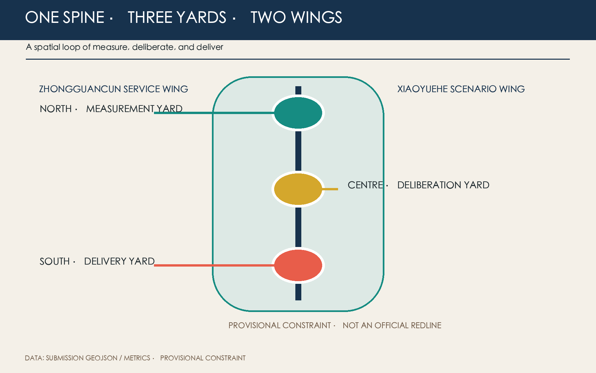
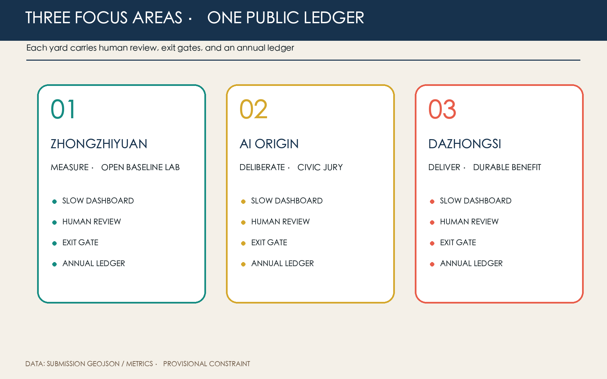
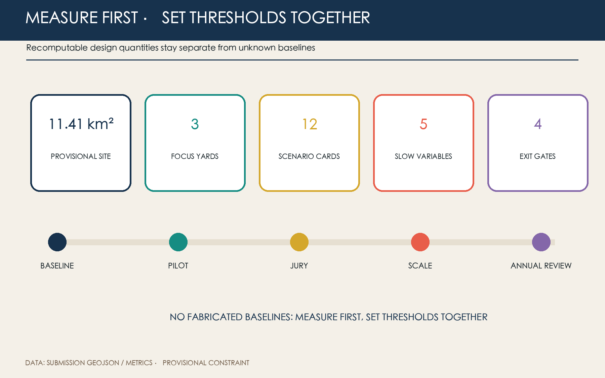

# THE SLOW VARIABLES

> Making fast AI answer to the city's ten-year horizon.

## Design Basis and Source Inventory

The official announcement, cleared Agent taskbook, site package, and public source registry define the factual boundary. The 11.41 km² overall area and three focus areas are rough provisional geometries derived from textual limits and area calibration—not official redlines and not evidence for ownership, road lines, precise areas, or engineering conclusions. All derived layers and metrics must be recomputed when official polygons arrive [source:OFFICIAL-ANNOUNCEMENT] [data:geometry/site_boundary.geojson#SITE-001] [metric:site_area_sqm].

No baseline is claimed for shade, permeability, accessibility, business continuity, or children's mobility. These are measurement frames: sample openly for one year, jointly set thresholds, then decide whether an AI service may scale. Planning controls, existing buildings, ownership, utilities, and heritage limits remain pending official data [standard:MOHURD-CONTROL-DETAILED-PLANNING] [depth:existing_conditions_diagnosis].

## Three-Level Scope Framework

The 43.6 km² research scope establishes a shared slow-variable ledger; the 11.4 km² design scope organizes a north–south measurement spine and three candidate east–west interfaces; the 368.4 ha focus scope tests the system in three yards. The sequence is shared protocol, continuous network, and field pilot [standard:PROJECT-OFFICIAL-ANNOUNCEMENT] [depth:three_level_scope_framework] [data:geometry/key_areas.geojson#PROV-KEY-001].

Provisional limits stay visually recessive. The design foregrounds the heritage-park direction, three yards, and two feedback wings. Professional teams must relocate these moves after official geometry replaces the current coordinates.

## Industry and Future-City Strategy

The name is THE SLOW VARIABLES. Five calibrated lines cross an open ring: the ring means continuous review; the lines represent shade, soil, access, continuity, and childhood. The identity uses original geometry and system fonts only.

The heritage belt holds long memory, the urban AI experience belt faces everyday use, and the innovation belt runs fast experiments. The five functions enter measurement, review, scenarios, public service, and global rule-sharing. The three areas measure, deliberate, and deliver; the Zhongguancun wing supplies academic, legal, capital, and standards capacity, while the Xiaoyuehe wing supplies authorised real-world questions [source:AGENT-TASKBOOK] [standard:PROJECT-AGENT-OPEN-CALL-TASKBOOK].

Seven cases contribute methods rather than copied forms: Barcelona Superblocks, Paris 15-minute city, Helsinki Kalasatama, Amsterdam AMS Institute, Toronto Quayside, Singapore Punggol Digital District, and Seoul Digital Mayor's Office. Their lesson is to spatialise who benefits, when value appears, and who can stop a pilot [source:SOURCE-REGISTRY] [depth:industry_future_city_strategy].

## Overall Urban Renewal and Regulatory-Plan Urban Design

The structure is one slow-variable spine, three yards, five observation surfaces, and twelve scenario nodes. The spine combines walking, cycling, shade, and rain interfaces; three east–west links reconnect rail, park, campus, and neighbourhood. Land-use polygons follow national classification logic and fully partition the provisional site; slow-variable facilities favour reversible components and shared existing space [standard:MNR-LAND-USE-CLASSIFICATION-GUIDE] [data:geometry/land_use.geojson#LU-001] [depth:land_use_layout].

Building footprints, floors, ownership, and structural safety are missing. The proposal therefore makes no parcel demolition decision, statutory FAR, or height claim. It uses four survey actions only: retain, lightly repair, reversibly insert, and professionally investigate [standard:MOHURD-URBAN-DESIGN-MEASURES] [data:geometry/buildings.geojson#BLDG-001] [depth:retain_renovate_demolish].

## Detailed Design for Three Focus Areas

### Zhongzhiyuan: Measurement Yard

An open baseline laboratory exposes sensor calibration, model red-teaming, soil and canopy observation, and accessibility audits. An ecological observation walk, human-review room, and failure garden make uncertainty visible. Face and identifiable trajectory collection are excluded by default [data:geometry/key_areas.geojson#PROV-KEY-001] [depth:three_key_area_detailed_design].

### Beijing AI Origin Community: Deliberation Yard

Universities, developers, residents, and service workers meet through civic jury, technical hearing, and revision. A slow-variable reading room, child-route table, and accessibility desk occupy shared ground floors. Non-digital alternatives and continuous accessibility are baseline requirements [data:geometry/key_areas.geojson#PROV-KEY-002] [standard:BARRIER-FREE-ENVIRONMENT-LAW].

### Dazhongsi: Delivery Yard

AI must improve ordinary services: queueing, summer dwell, merchant choice, or human service. Otherwise usage alone cannot justify scale. A public ledger wall, grievance desk, and annual delivery market make benefits visible. Four-quadrant station links remain conceptual pending transport and ownership review [data:geometry/key_areas.geojson#PROV-KEY-003] [depth:implementation_projects].

## AI Ecosystem, Personas, and AI+ Scenarios

Five primary personas are residents seeking calm access; children and carers seeking independent mobility; older and low-digital-literacy users needing human service; developers and start-ups needing compliant testing; and reviewers and operators needing comparable evidence. Merchants, cleaners, guards, and couriers are included so the city is not designed only for technology talent [standard:ELDERLY-SMART-TECH-PLAN-2020-45] [depth:public_service_facilities].

| # | Scenario card | Place and users | Data, human review, and exit |
|---|---|---|---|
| 01* | Shade digital-twin pilot | Spine; walkers | Canopy and thermal data only; arborist review; stop expansion if no benefit |
| 02* | Post-rain permeability diagnosis | Measurement Yard; operators | Soil and ponding only; municipal verification; no engineering verdict |
| 03* | Co-tested accessible routing | Deliberation Yard; wheelchair and pram users | Voluntary de-identified routes; accessibility expert; paper feedback remains |
| 04 | Child independent-mobility pilot | Neighbourhood links | No face recognition; guardian consent; on-site human response |
| 05 | Small-business continuity assistant | Delivery Yard | Voluntary revenue bands; human advice; never used for rent pricing |
| 06 | Human-counter queue assistant | Public services | Anonymous queues; staff takeover; offline service always available |
| 07 | Open model red-team garden | Measurement Yard | Synthetic or cleared data; expert review; tiered disclosure |
| 08 | Walking and cycling gap audit | Three interfaces | Edge aggregation; traffic review; no individual-track enforcement |
| 09 | Low-disturbance night lighting | Spine | Ambient light only; field inspection; complaints trigger downgrade |
| 10 | Jing-Zhang heritage audio guide | Park direction | Local content; historian review; works without location |
| 11 | Public-contract explainer | Three yards | Public text only; legal sampling; no case-specific legal advice |
| 12 | Annual slow-variable jury | Delivery Yard | Aggregated evidence; protected dissent; jury may reject scaling |

Asterisks identify three industry validation pilots. Every scenario passes four gates: data and safety, on-site human review, public objection response, and no deterioration of slow variables. Failure means reduction, pause, or exit [source:AGENT-TASKBOOK] [data:geometry/public_space.geojson#PUBLIC-001] [depth:ai_scenario_system].

## Land Use, Building Scale, and Retain/Renovate Logic

Four topologically continuous conceptual zones cover the submitted boundary: R&D, park/open space, industry/commerce, and community service. They do not replace statutory approval. Submitted geometry recomputes about 310,800 m² of conceptual footprint; total floor area, FAR, statutory density, and height remain pending official data [metric:building_footprint_area_sqm] [standard:MNR-LAND-USE-CLASSIFICATION-GUIDE] [depth:development_intensity_controls].

Survey precedes classification. Heritage and mature fabric favour retention, vacant ground floors may receive light repair, and slow-variable facilities remain removable. Demolition or new build requires ownership, structure, heritage, and public-process confirmation.

## Transport, Rail, Utilities, and Public Services

No unverified road line is introduced. Continuity audits address a north–south walking/cycling spine, three east–west interfaces, and the last 500 metres from rail to service. Every AI route retains static signs, a powerless alternative, and staffed assistance [data:geometry/roads.geojson#ROAD-001] [depth:transport_rail_integration].

Utilities start with reversible observation: soil moisture, ponding, distributed environment sensing, edge aggregation, and offline degradation. Sensors are not utility-capacity evidence. Human counters, shaded seating, drinking water, toilets, cycle parking, and accessible continuity take priority over new screens.

## Blue-Green Space, Public Realm, and Character

Conceptual green space is 12.34% and public space 7.33% of the provisional site; neither is an existing or statutory ratio. Canopy continuity, permeable soil, rain recovery, and summer dwell are the core blue-green slow variables [metric:green_ratio] [metric:public_space_ratio] [depth:blue_green_public_space].

Three pilgrimage nodes avoid spectacle: the Baseline Marker publishes methods and failures; the Dissent Platform preserves minority views and revisions; the Ten-Year Ledger Wall shows durable benefits and exited pilots. Honours reward reproducible methods, public contribution, and timely withdrawal—not investment or traffic. A five-colour marker, offline plaque, movable shade table, soil window, and human-help light form the component kit [source:AGENT-TASKBOOK] [standard:MOHURD-URBAN-DESIGN-MEASURES].

## Projects, Policy, and Phasing

Near term (0–1 years) establishes baselines, audits, three reversible pilots, and a civic jury. Medium term (2–3 years) scales only pilots passing four gates and repairs three interfaces. Long term (4–10 years) fixes, relocates, or removes elements through annual ledgers. Phase geometry is a discussion area, not an investment or construction commitment [data:geometry/phasing.geojson#PHASE-001] [depth:phasing_policy].

The annual cycle asks one question each season: spring soil/canopy, summer thermal comfort/access, autumn merchants/children, winter public ledger. A Slow Variables Assembly, developer repair camp, and citizen jury are concepts requiring future authorisation; every event publishes methods, limits, and exit decisions.

## Metrics, Recalculation, and Compliance

Recomputable metrics include provisional area, conceptual footprint, green and public-space design ratios, and three focus areas. FAR and height remain unknown. The five slow variables carry no promised percentage before a one-year baseline exists [metric:site_area_sqm] [metric:key_area_count] [depth:indicator_system].

Process metrics are twelve scenario cards, three industry tests, five personas, three pilgrimage nodes, and four exit gates. Compliance, standards, and design depth are recorded in their dedicated matrices; figures, HTML, and PDFs are readable views of the same machine evidence.

## Risk, Copyright, and Compliance

The largest risks are mistaking provisional geometry for a redline, goals for measured facts, and operating concepts for government commitments. External communication must retain “provisional constraint,” “concept proposal,” and “pending professional confirmation.” Data involving children, accessibility, merchants, or services remains voluntary, minimal, de-identified, human-reviewed, and withdrawable. AI does not replace planning approval, legal advice, engineering judgement, or public decision [standard:GENERATIVE-AI-INTERIM-MEASURES] [source:BOUNDARY-SOURCE].

Codex GPT-5.1 generated the text, figures, HTML, and layout from listed public or cleared sources. No secret map, commercial map screenshot, company trademark, or third-party image is used. See `report/copyright_statement.md`.

## References

These references separately govern project scope, urban-design depth, land-use expression, and inclusion boundaries. The announcement and taskbook define the three levels, three areas and two wings, and six Agent tasks; national planning sources keep conceptual design distinct from statutory control; accessibility sources constrain specific public-service scenarios rather than proving an unverified site-wide duty [source:OFFICIAL-ANNOUNCEMENT] [standard:MOHURD-URBAN-DESIGN-MEASURES]. None supplies official polygons, surveyed buildings, ownership, or slow-variable baselines. Structured geometry and metrics remain the recalculation entry point. If official attachments alter geometry or controls, sources, assumptions, layers, metrics, figures, bilingual reports, and self-check must all be updated together.

1. Beijing Haidian Branch of the Municipal Commission of Planning and Natural Resources, official open-call announcement, 2026.
2. Agent Open Call Taskbook excerpt, cleared summary, 2026.
3. MOHURD, Measures for Urban Design Management.
4. MOHURD, Measures for Regulatory Detailed Planning.
5. MNR, Land and Sea Use Classification Guide.
6. Standing Committee of the NPC, Barrier-Free Environment Construction Law.
