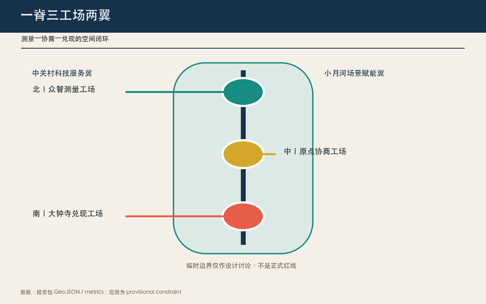
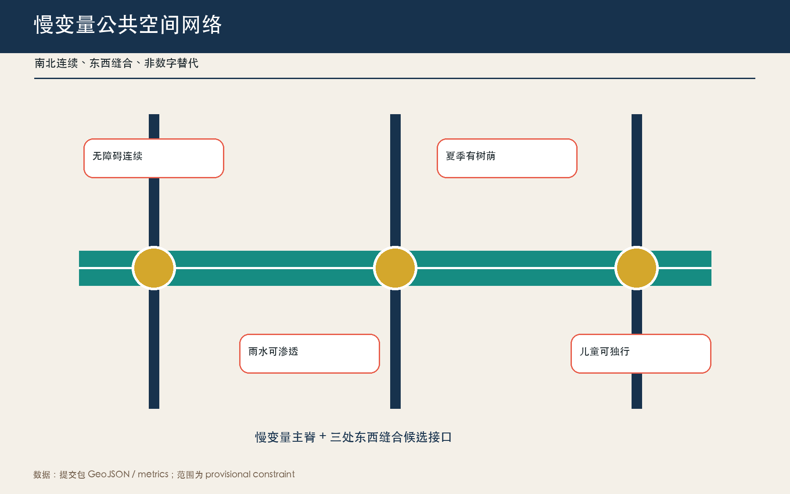
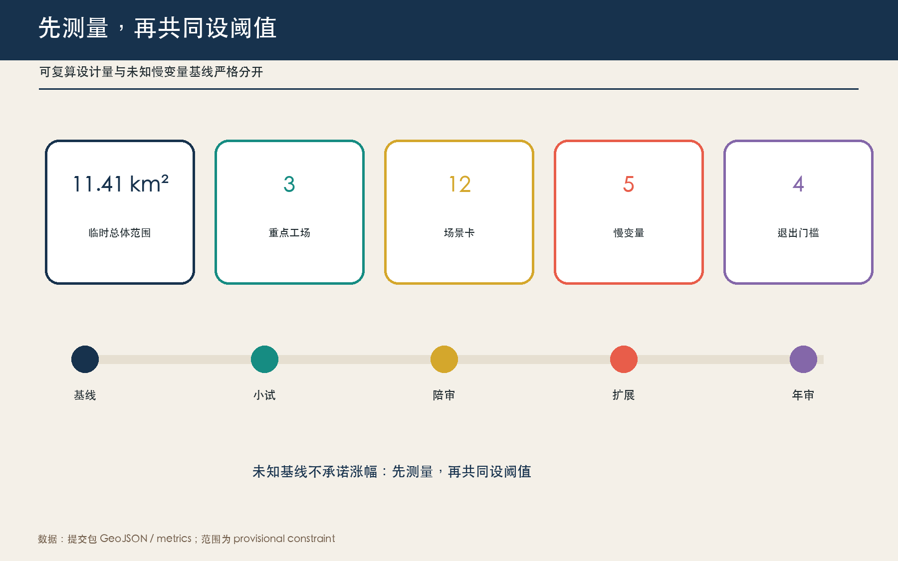

# 京张慢变量 THE SLOW VARIABLES

> 让 AI 的快迭代服从城市的十年尺度。

## 设计依据与资料清单

本方案把官方公告、清权的智能体任务书、场地包和公开来源登记表作为事实边界；只把登记为 formal-ready 的材料用于正式判断。当前 11.41 平方公里总体范围和三处重点区均为根据公告文字四至和面积校核形成的临时粗略几何，不是正式红线，也不能支撑权属、道路红线、精确面积或工程结论；官方多边形到位后，所有派生图层、图件和指标应整包重算 [source:OFFICIAL-ANNOUNCEMENT] [data:geometry/site_boundary.geojson#SITE-001] [metric:site_area_sqm]。

方案不声称已经测得沿线树荫、渗透、可达、业态存续或儿童独行基线。这五类“慢变量”是设计的测量框架：第一年公开采样并由专业团队与公众共同确定阈值，之后才决定 AI 场景是否扩展。规划控制、现状建筑、权属、市政容量和文保边界仍待正式资料补齐 [standard:MOHURD-CONTROL-DETAILED-PLANNING] [depth:existing_conditions_diagnosis]。

## 三层范围工作框架

43.6 平方公里统筹研究范围建立“慢变量公共账本”的跨区口径；11.4 平方公里总体设计范围组织一条南北测量主脊和三处东西缝合候选接口；368.4 公顷重点范围以三个工场验证制度和空间。三层不是三个孤立尺度，而是“共同口径—连续网络—现场试点”的递进关系 [standard:PROJECT-OFFICIAL-ANNOUNCEMENT] [depth:three_level_scope_framework] [data:geometry/key_areas.geojson#PROV-KEY-001]。

临时边界在图面上始终退居为低对比虚线；设计重点是遗址公园方向的公共主脊、三工场和两翼反馈回路。官方边界替换后，主脊和工场应由专业团队重新定位，不能把当前坐标直接用于建设。

## 统筹研究范围产业与未来城市研究

总体名称为“京张慢变量 / THE SLOW VARIABLES”。标识以五条不同周期的刻度线穿过一枚开放圆环：圆环代表持续审查而非技术封闭，五条线分别代表树荫、土壤、可达、存续和儿童。视觉系统只使用本包原创几何与系统字体，不借用企业商标。

三大定位被翻译为可运行的回路：百年京张文化带保存长期记忆，都市 AI 生活体验带接受日常使用检验，AI 融合创新带负责快速试验；五大功能分别进入测量、审查、场景、城市服务和国际规则共享。三区依次承担“测量—协商—兑现”，中关村科技服务翼提供高校、法务、资本与标准能力，小月河场景赋能翼提供真实但经授权的测试问题 [source:AGENT-TASKBOOK] [standard:PROJECT-AGENT-OPEN-CALL-TASKBOOK]。

七个案例只提取可核验的方法，不复制空间形态：Barcelona Superblocks 的街道再分配、Paris 15-minute city 的近邻服务、Helsinki Kalasatama 的居民时间预算、Amsterdam AMS Institute 的 living lab、Toronto Quayside 的数据治理争议、Singapore Punggol Digital District 的园区协同、Seoul Digital Mayor's Office 的公开指标。它们提示本方案把“谁受益、多久见效、谁可叫停”写进空间试点，而不是以技术新颖度代替公共价值 [source:SOURCE-REGISTRY] [depth:industry_future_city_strategy]。

## 总体设计范围城市更新与控规深度城市设计

总体结构为“一条慢变量主脊、三座工场、五类观测面、十二个场景节点”。主脊沿京张遗址公园方向组织连续步行骑行、遮荫与雨水界面；三道东西接口优先补齐轨道、公园、校园和社区之间的日常连接。用地分区沿用国家分类逻辑并完整覆盖临时范围，新增的慢变量设施优先采用可逆构件、既有空间共享和小尺度界面更新 [standard:MNR-LAND-USE-CLASSIFICATION-GUIDE] [data:geometry/land_use.geojson#LU-001] [depth:land_use_layout]。

现有建筑基底、层数、权属和结构安全资料缺失，因此不作具体拆除判断，不提出法定容积率和高度。建筑策略只给出四级调查动作：原状保留、低扰动修缮、可逆嵌入、待专业论证；任何新建体量须在正式控规、文保、消防、市政与产权核查后另行深化 [standard:MOHURD-URBAN-DESIGN-MEASURES] [data:geometry/buildings.geojson#BLDG-001] [depth:retain_renovate_demolish]。

## 重点区域详细设计

### 众智园：测量工场

北区作为“开放基线实验室”：把传感器校准、模型红队、土壤与树冠观察、无障碍巡检放在可参观但分权管理的公共界面。空间上形成一条清河方向生态观察廊、一个人工复核厅和一个失败样本花园；设备默认不采集人脸与可识别轨迹，原始数据保留期限和访问权须在试点前确定 [data:geometry/key_areas.geojson#PROV-KEY-001] [depth:three_key_area_detailed_design]。

### 北京 AI 原点社区：协商工场

中区将高校、开发者、居民和服务人员放进同一套“公众陪审—技术答辩—方案修订”空间。首层共享界面布置慢变量阅览室、儿童路线共绘桌和可访问性审计台；街巷以连续无障碍和非数字替代路径为底线。建设规模和校地接口均待权属及正式控制条件核实 [data:geometry/key_areas.geojson#PROV-KEY-002] [standard:BARRIER-FREE-ENVIRONMENT-LAW]。

### 大钟寺：兑现工场

南区把 AI 的公共回报落实到日常商业和公共服务：试点若不能减少排队、改善夏季停留、维持小商户选择或保留人工窗口，就不得仅凭访问量扩展。站点周边设置慢变量总账墙、服务申诉台和年度兑现市集；四象限连通仅为概念方向，工程可行性待交通与产权专业核查 [data:geometry/key_areas.geojson#PROV-KEY-003] [depth:implementation_projects]。

## AI 创新生态、人才画像与 AI+ 场景

五类核心画像是：需要安静与低门槛通行的周边居民、需要独立出行和安全停留的儿童及照护者、需要人工窗口的老年人与低数字素养者、需要合规测试和低成本协作的开发者与初创团队、需要可比较证据的专业审查与运营人员。另纳入沿街商户、清洁安保与快递骑手，避免只为“科技人才”设计城市 [standard:ELDERLY-SMART-TECH-PLAN-2020-45] [depth:public_service_facilities]。

| # | 场景卡 | 空间与对象 | 数据边界、人工复核与退出 |
|---|---|---|---|
| 01* | 树荫数字孪生小试 | 主脊；步行者 | 只记录树冠与热环境；园林人员复核；不改善则停止扩点 |
| 02* | 雨后渗透诊断 | 众智园；运维者 | 只测土壤与积水；市政人工核查；不得替代工程鉴定 |
| 03* | 无障碍路线共测 | 原点社区；轮椅与推车用户 | 自愿路线记录并去标识；无障碍顾问复核；保留纸质反馈 |
| 04 | 儿童独行陪测 | 社区接口；儿童照护者 | 不做人脸识别；监护同意；异常由现场人员处理 |
| 05 | 小商户存续助手 | 大钟寺；商户 | 商户自愿提供经营区间；人工咨询；不得用于租金定价 |
| 06 | 人工窗口排队助手 | 公共服务点；老年人 | 只用匿名队列；工作人员接管；始终可线下办理 |
| 07 | 开源模型红队花园 | 众智园；开发者 | 合成或清权数据；专家复核；漏洞披露分级 |
| 08 | 慢行断点巡检 | 三处横向接口；骑行者 | 设备侧聚合；交通人员确认；不用个体轨迹执法 |
| 09 | 夜间低扰动照明 | 主脊；居民与夜行者 | 环境照度而非身份；人工巡检；投诉触发降级 |
| 10 | 京张遗产语音导览 | 遗址公园方向；访客 | 本地内容包；史料专家审校；无定位也可使用 |
| 11 | 公共合同解释器 | 三工场；公众 | 仅解释公开文本；法律人员抽查；不提供个案法律结论 |
| 12 | 年度慢变量陪审 | 兑现工场；多方代表 | 发布聚合证据；主持人保障异议；陪审可否决扩展 |

星号为三项产业测试验证场景。每项场景通过四道门：数据和安全合格、现场人工复核、公众异议回应、慢变量不恶化；任一失败即缩小、暂停或退出 [source:AGENT-TASKBOOK] [data:geometry/public_space.geojson#PUBLIC-001] [depth:ai_scenario_system]。

## 用地、建筑规模与拆改留方案

四块拓扑连续的概念用地分区完整覆盖提交边界：研发创新、公园绿地与开敞空间、产业商业服务、社区服务配套。它们是对空间角色的概念表达，不替代正式用地分类审批。提交图层复算的建筑基底约 31.08 万平方米；因缺少楼层和正式边界，总建筑面积、容积率、建筑密度法定值和高度均记为待正式数据补齐 [metric:building_footprint_area_sqm] [standard:MNR-LAND-USE-CLASSIFICATION-GUIDE] [depth:development_intensity_controls]。

拆改留执行“先调查、后分类”：遗产与成熟街区优先保留，首层闲置界面可低扰动修缮，慢变量设施采用可拆卸构件；只有经产权、结构、文保和公众程序确认后才讨论拆除或新建。当前建筑多边形只是概念基底，不能据此判断任何真实建筑命运。

## 交通、轨道、市政与公共服务设施

交通策略不新增未经证实的道路红线，而以连续性审计推动三类连接：南北主脊步行骑行连续、三处东西接口跨越障碍、轨道站点到公共服务的最后五百米可达。每个 AI 导航场景必须保留静态标识、无电替代路线和人工求助点 [data:geometry/roads.geojson#ROAD-001] [depth:transport_rail_integration]。

市政策略以低风险可逆试点开始：土壤含水与积水观察、分布式环境传感、端侧聚合、设备断网降级。传感器不等于市政容量证据，所有排水、电力、通信、消防与算力设施均需专业部门核定。公共服务优先改善人工窗口、遮荫座椅、饮水、厕所、非机动车停放与无障碍连续性，而非增设屏幕。

## 蓝绿空间、公共空间与城市风貌

提交几何中的概念绿地约占临时范围 12.34%，概念公共空间约占 7.33%；这两个比例只描述本包设计图层，不是现状或法定绿地率。蓝绿设计以树冠连续、土壤可渗、雨后可恢复和夏季可停留为慢变量，不追求装饰性“科技景观” [metric:green_ratio] [metric:public_space_ratio] [depth:blue_green_public_space]。

三处 AI 朝圣节点不是巨型雕塑：北端“零号基线碑”公开测量方法与失败记录；中段“异议站台”永久展示少数意见和修改前后版本；南端“十年总账墙”展示长期公共收益与退出项目。荣誉系统只表彰可复现方法、公共贡献和及时退出，不以融资额或流量排名。构件库包括五色刻度柱、离线说明牌、可移动树荫台、渗透观察窗和人工求助灯，均为待专业深化的概念原型 [source:AGENT-TASKBOOK] [standard:MOHURD-URBAN-DESIGN-MEASURES]。

## 更新项目清单、实施政策与分期计划

近期（0—1 年）只做基线：公开方法、现场审计、三处可逆小试和公众陪审；中期（2—3 年）只扩展通过四道门的场景，并补齐三处横向接口；长期（4—10 年）依据年度总账决定固化、迁移或撤除。分期几何表达一期讨论范围，不是投资或开工承诺 [data:geometry/phasing.geojson#PHASE-001] [depth:phasing_policy]。

年度运营采用“一季一问、一年一审”：春季土壤与树冠基线、夏季热舒适与可达审计、秋季商户与儿童路线陪审、冬季公开总账。建议形成 Slow Variables Assembly 国际开放周、开发者修复营和市民陪审团，但主办、预算、招商和政策均需后续授权。每次活动产出可下载方法、局限与退出决定，而非只留下传播素材。

## 指标体系、面积复算与合规矩阵

本包可复算指标包括临时范围面积、建筑概念基底、绿地和公共空间设计比例、三处重点区数量；正式容积率与高度因官方条件缺失保持未知。方案另设五类慢变量，但在完成一年基线前不承诺具体提升百分比，避免用虚假精度换取“可量化”外观 [metric:site_area_sqm] [metric:key_area_count] [depth:indicator_system]。

运行指标采用过程门槛：12 张场景卡全有人工接管，至少 3 项产业测试，5 类核心画像，3 个朝圣节点，4 道退出门。任务覆盖、专业标准和设计深度分别由三份矩阵完整记录；图件、HTML 与 PDF 只是同一机器证据层的可读表达。

## 风险、版权与合规说明

最大风险是把临时几何误读为真实红线、把设计目标误读为现状数据、把概念运营误读为政府承诺。所有对外表达必须保留“临时约束、概念建议、待专业确认”；涉及儿童、无障碍、商户和公共服务的数据坚持自愿、最小化、去标识、人工复核和退出。AI 不替代规划审批、法律意见、工程鉴定或公共决策 [standard:GENERATIVE-AI-INTERIM-MEASURES] [source:BOUNDARY-SOURCE]。

正文、图件、HTML 与版式由 Codex GPT-5.1 生成，基础事实来自列明的公开或清权材料；未使用秘密地图、商业地图截图、企业商标或第三方图片。版权与展示范围见 `report/copyright_statement.md`。

## 参考资料

以下资料分别控制项目范围、空间设计深度、用地表达与包容性边界。公告与任务书决定“三层范围、三区两翼和六项智能体任务”；住建部与自然资源部文件提醒本方案把城市设计建议、用地分类和待补控规严格分开；无障碍法规与政策资料用于限定具体公共服务场景，而不是推导未经证实的全场义务 [source:OFFICIAL-ANNOUNCEMENT] [standard:MOHURD-URBAN-DESIGN-MEASURES]。这些来源没有提供正式多边形、现状建筑、权属和慢变量基线，因此引用它们不能消除数据缺口。几何与指标仍以本包结构化文件为复算入口，临时范围只服务于概念讨论；后续若官方附件改变边界或控制条件，来源记录、假设、图层、指标、图件、双语报告和自检必须同步更新，而不能仅修改文字说明。

1. 北京市规划和自然资源委员会海淀分局，《百年京张AI创新带城市设计国际方案征集资格预审公告》，2026。
2. 《面向全球智能体开展百年京张AI创新带城市设计开源征集任务书摘录》，清权摘要，2026。
3. 住房和城乡建设部，《城市设计管理办法》。
4. 住房和城乡建设部，《城市、镇控制性详细规划编制审批办法》。
5. 自然资源部，《国土空间调查、规划、用途管制用地用海分类指南》。
6. 全国人大常委会，《中华人民共和国无障碍环境建设法》。
