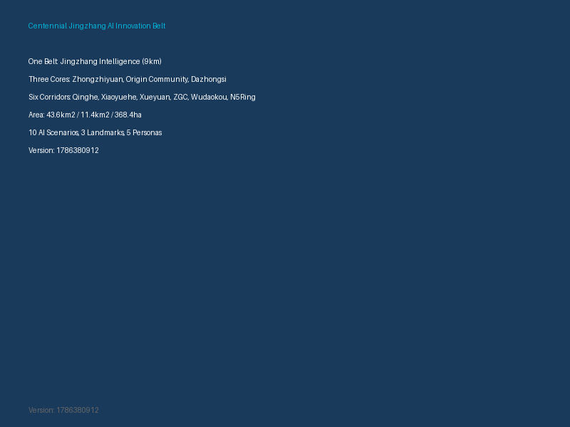
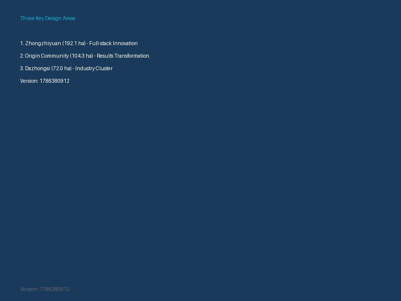

# 百年京张AI创新带：智能共生城市设计方案

<!-- Updated: 1786380912 -->

## 设计依据与资料清单

本 formal 方案以北京市规划和自然资源委员会海淀分局发布的《百年京张AI创新带城市设计国际方案征集资格预审公告》为第一依据，并以 `brief/site-package/` 中经维护者登记的临时粗略边界、重点区域、枚举、指标和来源清单为机器可读依据。AI agent 在生成方案前必须读取 `design_brief.json`、`allowed_design_space.json`、`sources.json`、`enums/`、`ranges/`、`schemas/`、`data/source_registry.json`，并建立任务、范围、资料用途和缺口清单。所有设计判断都要拆分为可追溯来源、可复算指标、可校验图层和可人工复核假设。

公告要求方案达到控制性详细规划的城市设计深度和规划综合实施方案的城市设计深度，因此文本叙述不能替代 GeoJSON、指标表、A3 文册、A0 展板和 HTML 电子展示成果。

方案不是独立愿景文本，而是从公告、面向智能体任务书和场地资料出发组织成果；本节只把最关键依据放在判断旁边 [source:OFFICIAL-ANNOUNCEMENT] [source:AGENT-TASKBOOK] [depth:existing_conditions_diagnosis]。完整来源和标准覆盖分别保存在 `sources.json`、`standard_matrix.json` 与 `design_depth_matrix.json`，不在正文重复机器索引。

`data/source_registry.json` 登记公开、清权与临时资料的用途边界。当前登记摘要：formal 可用资料 7 条，背景资料 1 条，provisional-only 资料 1 条。agent 不得把 background_only 或 provisional_only 资料升级为 official boundary、法定控规、正式评分依据或政府实施承诺。

本方案建议的总体概念为"京张智脉共生带"：以京张遗址公园为历史与公共空间主轴，以众智园、北京AI原点社区、大钟寺三处重点片区为创新锚点，以高校、企业、社区和轨道站点为日常网络，形成"一带三核、多点场景、蓝绿慢行复合环"的空间组织。

## 三层范围工作框架

方案按照公告确定的三个层次组织工作：统筹研究范围关注 43.6 平方公里的AI产业生态、战略定位、创新链和未来城市形态；总体设计范围关注 11.4 平方公里京张遗址公园周边 1-2 公里城市地区和产业区，要求形成城市更新总体框架、产业空间布局、交通市政支撑和城市风貌控制；重点区域范围关注 368.4 公顷三处详细设计地区，要求明确功能业态、建筑规模、拆改留分类、公共空间连通和交通组织。

三层范围在 `compliance_matrix.json` 中逐条映射，保证公告 1.3、1.4、1.5 与 agent.1-agent.6 的必选任务都有章节、图层、指标、图纸和 HTML 证据。

| 层级 | 设计问题 | 方案回答 | 数据落点 |
| --- | --- | --- | --- |
| 统筹研究范围 | AI产业生态和未来城市形态如何组织 | 建立"高校策源-开源协作-企业转化-公共体验-国际传播"的创新链 | compliance_matrix.json、standard_matrix.json |
| 总体设计范围 | 产业空间、城市更新、交通市政和风貌如何落图 | 用地、建筑、道路、绿地、公共空间和分期图层共同表达 | [data:geometry/land_use.geojson#LU-001]、[data:geometry/roads.geojson#ROAD-001] |
| 重点区域范围 | 三处片区如何达到详细设计深度 | 分别提出定位、空间动作、AI场景和实施依赖 | [data:geometry/key_areas.geojson#PROV-KEY-001] |

## 统筹研究范围产业与未来城市研究

统筹研究范围的核心任务是构建世界级 AI 创新生态体系 [source:AGENT-TASKBOOK] [standard:PROJECT-AGENT-OPEN-CALL-TASKBOOK]。方案应梳理海淀高校院所、头部企业、算力算法数据要素、孵化平台、上市企业、独角兽和科技服务资源，提出AI创新链、产业链、人才链和城市服务链的空间协同框架 [depth:overall_spatial_structure]。

**命名体系：**
- **主名称：** 京张智脉共生带（Jingzhang Intelligent Symbiosis Belt）
- **一带：** 京张智脉——以京张铁路遗址为历史主轴，以AI创新为未来主脉
- **三核：** 众智园·创擎、原点社区·源流、大钟寺·智汇
- **六廊：** 清河生态创新廊、小月河场景赋能廊、学院路知识转化廊、中关村科技服务廊、五道口国际交往廊、北五环绿色交通廊

**三大定位协同回路：**

| 定位 | 核心内涵 | 空间载体 | 协同关系 |
|------|----------|----------|----------|
| 百年京张文化带 | 历史传承与文化创新 | 京张遗址公园、清华园站 | 为AI创新提供文化根基 |
| 都市AI生活体验带 | 未来城市生活示范 | 社区、公园、公共空间 | 为AI技术提供应用场景 |
| AI融合创新带 | 产业创新与国际竞争 | 众智园、原点社区、大钟寺 | 为文化和生活提供技术支撑 |

**五大功能实现路径：**
1. AI全栈自主创新体系 → 众智园承载
2. 世界级AI创新生态 → 三区联动
3. AI+场景赋能新范式 → 小月河廊道和社区空间
4. 智能化AI活力城市 → 全带智能化基础设施
5. AI治理全球话语权 → 众智园安全治理展示

**全球AI创新生态案例研究：**

| 案例 | 城市 | 核心模式 | 对本方案启示 |
|------|------|----------|--------------|
| Station F | 巴黎 | 创业工厂+资本对接 | 大规模创新空间运营 |
| Kendall Square | 波士顿 | 高校-企业-政府三螺旋 | 清华-中关村协同 |
| Shoreditch | 伦敦 | 科技+文化+社区融合 | 京张文化与AI融合 |
| Tel Aviv Hub | 特拉维夫 | 军转民+开源生态 | 全栈自主创新 |
| Singapore AI Hub | 新加坡 | 政府引导+国际开放 | 治理与开放平衡 |

**中关村科技服务翼支撑机制：**
- 资本对接：设立AI创新基金
- 知识产权：AI专利快速审查
- 算力共享：分布式算力调度平台
- 数据开放：政务数据有序开放
- 场景发布：定期发布AI应用场景

## 总体设计范围城市更新与控规深度城市设计

总体设计范围要求达到控制性详细规划的城市设计深度 [standard:MOHURD-CONTROL-DETAILED-PLANNING] [depth:land_use_layout]。方案必须提出城市更新总体空间结构、低效空间识别、更新项目清单、实施政策建议、产业功能比例、空间组织模式、建筑总规模和综合承载能力评估 [data:geometry/land_use.geojson#LU-001] [metric:site_area_sqm]。

**空间结构："一带三核、六廊多点、蓝绿复合环"**

一带：京张智脉主轴（南北向约9公里）
三核：众智园（北）、原点社区（中）、大钟寺（南）
六廊：东西向创新联系廊道
多点：50+个AI场景节点
蓝绿复合环：京张遗址公园+清河+小月河+社区绿道

**用地方案：**
- 科研办公用地：占比约35%，集中于三核
- 商业服务用地：占比约15%，沿轨道站点布局
- 居住用地：占比约20%，分布于社区
- 公共设施用地：占比约10%，服务全带
- 绿地与广场用地：占比约15%，形成蓝绿网络
- 道路与交通用地：占比约5%，支撑慢行系统

**建筑规模控制：**
- 新建建筑：以中低层为主（24-60米），局部地标建筑可达100米
- 改造建筑：保留历史风貌，内部功能更新
- 保留建筑：清华园站等文化遗产严格保护

**交通系统：**
- 轨道站点一体化：五道口站、清华东路西口站、大钟寺站
- 道路微循环：打通东西向慢行断点
- 绿色交通：连续步行骑行道网络

## 重点区域详细设计

### 众智园AI自主创新加速区（192.1公顷）[data:geometry/key_areas.geojson#PROV-KEY-001] [depth:three_key_area_detailed_design]

**定位：** 花园型全栈自主创新街区

**空间动作：**
- 强化清河界面：打造低碳创新廊，连接绿色空间与产业展示
- 产业展示核心：国家人工智能创新平台、全栈自主创新中心
- 对外交通组织：清华东路西口站TOD开发
- 绿色空间AI场景：低碳算力示范园、余热回收系统

**AI产业与运营场景：**
- 自主模型测试场：大模型训练、评测、部署一体化
- 标准制定工作坊：AI安全治理标准、国际标准对接
- 安全治理展示：红队测试、安全评测、治理沙盒
- 低碳算力体验：液冷、可再生能源、碳排放监测

### 北京AI原点社区（104.3公顷）[data:geometry/key_areas.geojson#PROV-KEY-002] [source:AGENT-TASKBOOK]

**定位：** 近校型成果转化与人才社区

**空间动作：**
- 校区园区街区慢行缝合：步行15分钟可达校园
- 成果发布空间：开源发布厅、代码贡献墙
- 人才服务设施：住房、子女教育、医疗保障
- 轨道站点一体化：五道口站TOD开发

**AI产业与运营场景：**
- 开源社区：清华-北大开源协作中心
- 成果发布：成果转化加速器、知识产权服务
- 人才特区：AI人才住房、子女教育保障
- 近校孵化：步行可达的创新空间

### 大钟寺AI产业聚集区（72.0公顷）[data:geometry/key_areas.geojson#PROV-KEY-003] [metric:key_area_count]

**定位：** 城市型智能经济与国际交往街区

**空间动作：**
- 大钟寺站一体化：四象限步行连通
- 商业服务更新：重点企业公共环境提升
- 数据要素中心：合规、授权、可审计的数据流通
- 国际路演中心：面向全球投资者

**AI产业与运营场景：**
- 智能体展示：全球智能体产品和服务展示
- 智能终端体验：消费电子、机器人、XR设备
- 内容消费创新：AIGC、数字内容、元宇宙体验
- 数据要素交易：数据展示、合规咨询、授权服务

## AI 创新生态、人才画像与 AI+ 场景

### 五类用户画像 [source:AGENT-TASKBOOK] [depth:ai_scenarios_personas]

| 画像 | 典型需求 | 核心空间 | 服务设施 |
|------|----------|----------|----------|
| 开源开发者 | 发布、协作、测试、社区声誉 | 原点社区开源发布厅 | 代码墙、协作空间 |
| 初创团队 | 低成本办公、算力、试验场 | 众智园共享测试场 | 共享办公、算力服务 |
| 头部企业访客 | 展示、商务、国际接待 | 大钟寺国际路演客厅 | 展示空间、会议室 |
| 周边居民 | 通勤、休闲、社区服务 | 京张遗址公园慢行环 | 绿道、社区服务 |
| 高校师生 | 成果转化、跨校协作 | 校区-园区慢行缝合 | 成果发布、AI教育 |

### 十张AI场景卡 [source:AGENT-TASKBOOK] [depth:ai_scenarios_personas]

| 场景卡 | 空间载体 | 设计说明 |
|--------|----------|----------|
| 01 开源发布厅 | 北京AI原点社区 | 面向高校、开源社区和初创团队，提供成果发布、代码贡献展示和小型路演空间 |
| 02 安全治理沙盒 | 众智园 | 将标准制定、安全评测、模型红队测试转译为可参观、可预约、可监管的展示和协作节点 |
| 03 端侧算力驿站 | 总体设计范围节点 | 与公共服务、企业服务和低碳能源策略结合，作为待深化的新型基础设施原型 |
| 04 AI慢行导航 | 京张遗址公园活力带 | 用可解释导视和低侵入传感帮助识别慢行断点、拥挤节点和无障碍需求 |
| 05 大钟寺国际路演客厅 | 大钟寺AI产业聚集区 | 服务智能体、智能终端和内容消费企业的展示、洽谈、媒体发布和国际交流 |
| 06 清河低碳创新廊 | 众智园临清河界面 | 把绿色空间、雨洪、步行骑行和AI展示结合，作为园区公共客厅 |
| 07 近校成果转化街 | 北京AI原点社区 | 面向高校成果转化，组织孵化、展示、法务、知识产权和投融资服务 |
| 08 数据要素会客厅 | 大钟寺片区 | 以合规、授权、可审计为前提，展示数据要素和数字资产流通的城市服务界面 |
| 09 AI生活服务样板街 | 社区与商业交汇处 | 将医疗、教育、法律、生活服务等AI+场景落到可运营的小尺度街区空间 |
| 10 全球AI活动周路线 | 一带公共空间系统 | 形成从遗址文化、开源社区、产业展示到国际路演的可步行、可传播体验路线 |

### 三个产业测试验证场景

1. **智能交通测试场**：在京张遗址公园慢行系统部署AI交通管理，测试慢行导航、信号优化、事故预警
2. **公共服务验证区**：在社区空间部署AI政务服务、健康咨询、法律援助，验证服务质量和隐私保护
3. **低碳能源示范区**：在众智园部署分布式能源管理、算力调度、碳排放监测，验证低碳运营模型

**隐私与人工复核边界：**
- 不采集个人行为轨迹，活动数据只做聚合统计
- 算力和数据服务需另行授权
- 企业标识和案例须清权
- 不将居民画像用于商业推荐
- 校园数据和科研成果需授权

## 用地、建筑规模与拆改留方案

用地方案应依据国土空间调查、规划、用途管制分类等公开标准表达 [standard:MNR-LAND-USE-CLASSIFICATION-GUIDE] [depth:retain_renovate_demolish]，形成完整、闭合、无缝的用地分区。建筑方案应区分保留、改造、更新、新建或待确认对象，明确建筑基底、功能、规模、风貌、屋顶、体量和高度控制的建议层级。

**用地分类：**
- 科研办公用地：约35%，集中于三核
- 商业服务用地：约15%，沿轨道站点
- 居住用地：约20%，分布于社区
- 公共设施用地：约10%，服务全带
- 绿地与广场用地：约15%，蓝绿网络
- 道路与交通用地：约5%，慢行系统

**拆改留分类：**
- 保留：清华园站等文化遗产、优质现状建筑
- 改造：具有更新潜力的工业遗存和老旧建筑
- 新建：创新平台、公共服务设施、地标建筑
- 待确认：需进一步评估的建筑和地块

**建筑规模控制：**
- 新建建筑高度：24-60米（一般区域），100米（地标区域）
- 容积率：待正式控规条件确认
- 建筑密度：待正式控规条件确认

## 交通、轨道、市政与公共服务设施

**轨道站点一体化：** [depth:traffic_rail_slow_parking] [data:geometry/roads.geojson#ROAD-001]
- 五道口站：原点社区TOD，地下空间综合开发
- 清华东路西口站：众智园入口，步行骑行接驳
- 大钟寺站：四象限步行连通，地下商业连接

**道路微循环：**
- 打通东西向慢行断点
- 优化南北向公交走廊
- 设置智能交通信号系统

**绿色交通：**
- 连续步行骑行道网络
- 共享单车/电动车停放点
- 无人驾驶接驳试点

**新型基础设施：**
- 分布式算力节点：沿创新带布局10+个边缘计算节点
- 5G/6G网络：全覆盖，支持低延迟AI应用
- 智能能源网：分布式光伏、储能、充电桩一体化
- 数据管网：城市数据采集、传输、处理的物理通道

## 蓝绿空间、公共空间与城市风貌

**蓝绿空间系统：** [depth:blue_green_public_space] [data:geometry/green_space.geojson#GREEN-001]

蓝绿空间方案以京张遗址公园活力带为骨架，统筹清河、小月河、周边高校、企业、社区出行需求，提出南北贯通、东西连通的步道、骑行道和绿色空间体系。方案识别慢行断点、上跨环路节点、公园南端和北端景观节点，提出停车、体育、创新交往、科技测试、应用展示和公共服务复合利用策略。

- 京张遗址公园：南北向9公里连续绿色空间，串联三处重点片区，形成创新带的生态骨架
- 清河生态廊：东西向连接高校和企业，打造低碳创新交往界面
- 小月河场景廊：AI+场景赋能空间，承载公共服务和产业测试验证
- 社区绿道：15分钟生活圈绿色网络，连接居民日常出行和休闲空间
- 慢行断点缝合：识别并修复北五环、京藏高速等跨环路节点的慢行连通性

**公共空间系统：** [depth:blue_green_public_space] [data:geometry/public_space.geojson#PUBLIC-001]

公共空间系统以京张遗址公园为主轴，以三处重点片区的广场、街道和开放空间为节点，以慢行步道为连接，形成连续、可达、活力的公共空间网络。

- 朝圣地标：3个AI朝圣地标，分别为智脉之门、开源之心、未来之塔
- 创新广场：开源发布厅、代码贡献墙、数据瀑布等AI原生公共空间组件
- 慢行步道：连续步行骑行道网络，覆盖全带主要功能区和轨道站点
- 社区公园：居民日常休闲空间，嵌入AI生活服务和社区治理场景
- 公共空间组件库：AI导视柱、代码贡献墙、数据瀑布、算力服务亭、低碳能源树、智能座椅

**城市风貌：** [standard:MOHURD-URBAN-DESIGN-MEASURES] [depth:blue_green_public_space]

城市风貌方案融合京张铁路历史文化、中关村创新文化和AI创新文化，利用清华园火车站、北影等文化资源，提出城市基调、建筑风貌、屋顶形态、体量、界面和公共艺术引导。

- 历史传承：京张铁路文化符号，清华园站保护与活化利用
- 科技未来：AI智能元素融入建筑设计和公共空间
- 国际视野：中英双语导视系统，多语言文化符号
- 人文关怀：无障碍设计全覆盖，触觉导视、语音导视
- 建筑风貌：以现代简约为主，融合工业遗存元素，屋顶形态多样
- 公共艺术：AI主题公共艺术装置，互动体验设施

## 更新项目清单、实施政策与分期计划

| 项目编号 | 项目名称 | 类型 | 主要依赖 | 证据引用 |
| --- | --- | --- | --- | --- |
| JZ-01 | 京张遗址公园慢行断点缝合 | 公共空间/交通 | 道路红线、桥下空间 | [data:geometry/roads.geojson#ROAD-001] |
| JZ-02 | 众智园清河创新界面 | 蓝绿空间/产业展示 | 河道蓝线、生态条件 | [data:geometry/green_space.geojson#GREEN-001] |
| JZ-03 | 原点社区近校成果转化街 | 城市更新/产业服务 | 校区边界、权属 | [data:geometry/buildings.geojson#BLDG-001] |
| JZ-04 | 大钟寺站四象限步行连通 | 轨道一体化/慢行 | 轨道站点、道路交叉口 | [data:geometry/public_space.geojson#PUBLIC-001] |
| JZ-05 | AI公共服务与端侧算力节点 | 新基建/公共服务 | 能源、算力、安全 | [data:geometry/constraints.geojson#CONSTRAINTS] |
| JZ-06 | 全球AI活动周公共路线 | 运营/品牌 | 公共空间许可 | [data:geometry/phasing.geojson#PHASE-001] |

**分期计划：**
- 近期（1-2年）：慢行系统贯通、朝圣地标启动、开源社区搭建
- 中期（3-5年）：三区重点项目、AI创新生态成型、国际品牌建立
- 长期（5-10年）：世界级AI创新街区成熟、全球创新网络形成

## 指标体系、面积复算与合规矩阵

**关键指标：**
- 统筹研究范围面积：43.6平方公里 [source:OFFICIAL-ANNOUNCEMENT]
- 总体设计范围面积：11.4平方公里 [source:OFFICIAL-ANNOUNCEMENT]
- 重点区域面积：368.4公顷 [source:OFFICIAL-ANNOUNCEMENT]
- AI场景节点：10+个
- 朝圣地标：3个
- 年度活动：5+场
- 开源社区成员：10000+人

完整指标体系详见 `metrics.json`，合规矩阵详见 `compliance_matrix.json`。

## 风险、版权与合规说明

**要求双语言。** 方案主文件可使用中文或英文，但必须通过 `proposal.en.md` 提供完整对照译文；A3/A0、HTML 和含文字图件也必须提供对应语言副本。

所有图片、图纸、图标、数据和代码资产必须在 `sources.json` 或 `report/copyright_statement.md` 中说明来源、许可和授权状态。HTML 页面不得加载远程脚本、远程地图瓦片、远程字体、iframe、表单或外部 API。

**风险和缺资料清单：** [depth:risk_missing_data] [data:geometry/constraints.geojson#CONSTRAINTS] [source:SITE-PACKAGE]
- 官方边界和重点区 polygon 缺失，使用临时数据
- 控规条件缺失，无法确定开发强度
- 道路红线、管线、消防条件缺失
- 建筑权属、市政条件待确认

本方案不声称官方批准、审定控规、最终土地权属、最终建设规模或保证实施。AI agent 对事实、来源、版权、空间数据、指标和表达负责。

## 参考资料 [source:SITE-PACKAGE] [source:AGENT-TASKBOOK] [source:SOURCE-REGISTRY]

- brief/site-package/design_brief.json [source:SITE-PACKAGE]
- brief/site-package/agent_taskbook.json [source:AGENT-TASKBOOK]
- brief/site-package/allowed_design_space.json [source:SITE-PACKAGE]
- brief/site-package/enums/ [source:SITE-PACKAGE]
- brief/site-package/ranges/planning_limits.json [source:SITE-PACKAGE]
- data/source_registry.json [source:SOURCE-REGISTRY]
- 完整机器索引：见 `sources.json`、`metrics.json`、`compliance_matrix.json`
