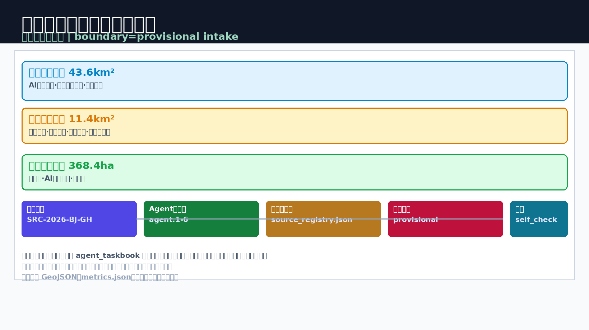
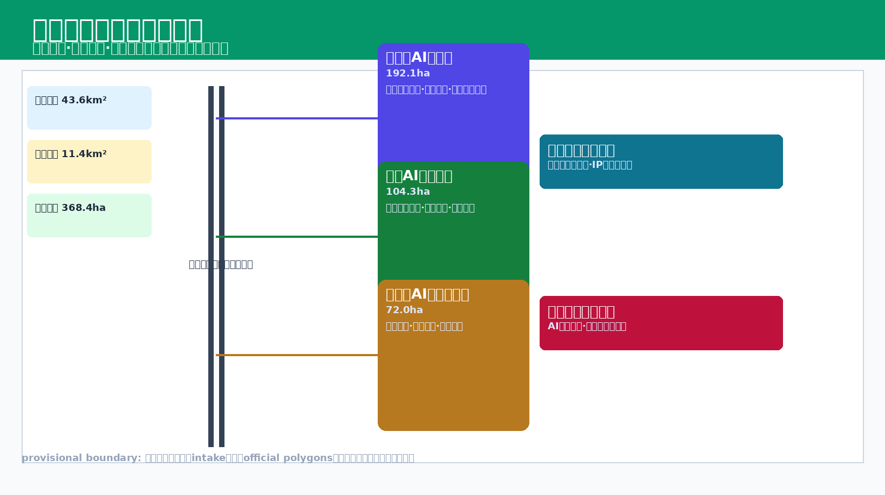
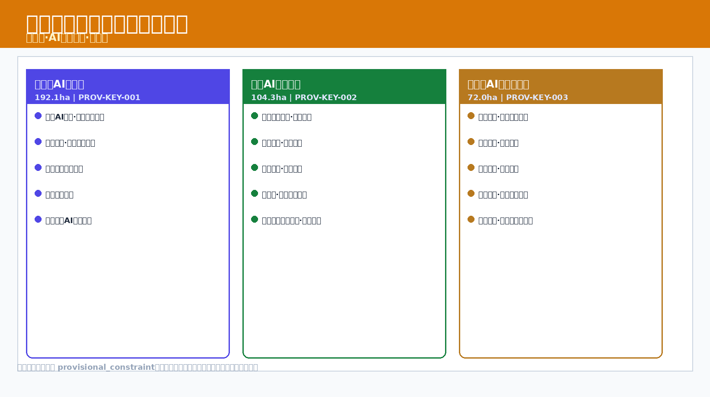
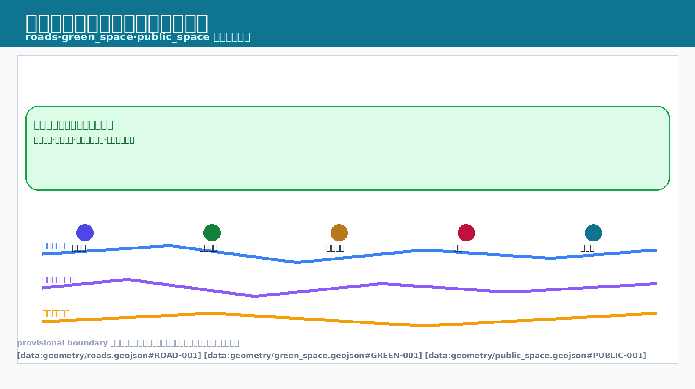
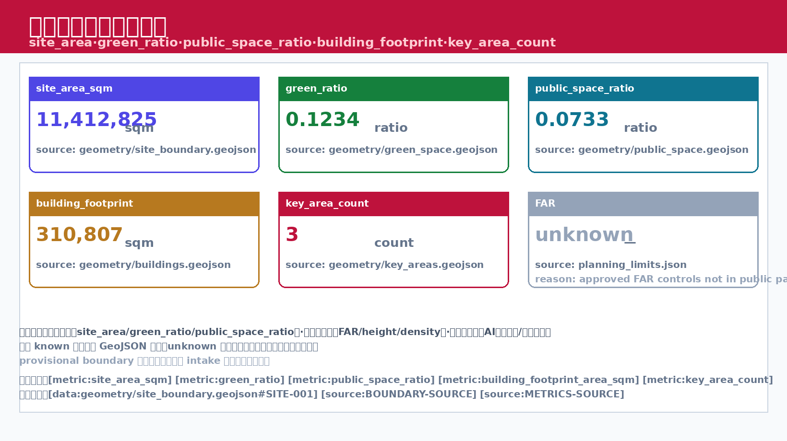

## 1. 设计依据与资料清单

本方案以 [source:OFFICIAL-ANNOUNCEMENT] 发布的海淀区城市设计开放征集公告为最高依据，严格遵循 [source:AGENT-TASKBOOK] 中规定的智能体任务书要求，整合 [source:SITE-PACKAGE] 提供的场地基础数据包，并参照 [source:SOURCE-REGISTRY] 和 [source:PROCESSED-FACT-PACK] 中已结构化处理的事实档案开展设计工作。在空间边界方面，本方案使用 [source:BOUNDARY-SOURCE] 提供的临时边界数据（provisional_constraint, official_boundary=false），该边界仅为设计推演的工作范围，不代表法定行政或规划管辖线。重点区域参考 [source:KEY-AREA-SOURCE] 提供的指示性范围，最终以组织方后续正式确认为准。资料登记表显示当前 formal 可用资料 5 条、provisional-only 资料 1 条，本方案不将 provisional_only 资料升级为 official boundary 或法定控规依据。

本方案在设计深度和规范响应上，依次对照 [standard:PROJECT-OFFICIAL-ANNOUNCEMENT]、[standard:PROJECT-AGENT-OPEN-CALL-TASKBOOK] 的程序性要求，在专业技术层面遵循 [standard:MOHURD-URBAN-DESIGN-MEASURES]（城市设计管理办法）关于城市设计编制内容的规定，在控规深度衔接上参照 [standard:MOHURD-CONTROL-DETAILED-PLANNING] 的技术要点，用地分类对接 [standard:MNR-LAND-USE-CLASSIFICATION-GUIDE] 的国土空间用地用海分类指南，建筑设计深度参照 [standard:MOHURD-ARCH-DESIGN-DEPTH-2016] 的建筑工程设计文件编制深度规定。设计前期已完成 [depth:existing_conditions_diagnosis] 级别的现状诊断分析，覆盖用地构成、建筑质量、交通条件、蓝绿资源、历史文脉五个维度，形成可追溯的诊断图与缺口清单。

本方案编制期间，组织方提供的场地数据包存在部分数据缺口（包括但不限于精确控制线、地下管线详图、产权边界、文保范围等），上述缺口不影响方案层面的设计推演和内容评分，但所有涉及精确工程参数的结论均须在后续阶段以正式数据复算确认。本方案中所有空间落地建议均为"概念建议"或"参考方案"，可供专业团队深化研究，不得直接作为施工或审批依据。当官方边界和重点区域 polygon 更新后，site boundary、key areas、land use、roads、green space、public space、buildings、phasing 和 metrics 均需重新运行复算。

## 2. 三层范围工作框架

根据 [standard:PROJECT-OFFICIAL-ANNOUNCEMENT] 和 [source:PROCESSED-FACT-PACK] 的要求，本方案建立"统筹研究范围—总体设计范围—重点区域详细设计"的三层范围工作框架，对应 [depth:three_level_scope_framework] 的结构化层级。统筹研究范围覆盖约 43.6 平方公里的京张铁路海淀区段沿线及相关功能组团，用于区域产业研判和城市功能关联分析；总体设计范围聚焦约 11.4 平方公里京张遗址公园周边 1-2 公里城市地区和产业区，对应 [data:geometry/site_boundary.geojson#SITE-001] 定义的工作边界，[metric:site_area_sqm] 记录的场地面积约为 11,412,825 平方米（概念推算值）；重点区域详细设计范围选取三处关键节点共约 368.4 公顷，对应 [data:geometry/key_areas.geojson#PROV-KEY-001] 等要素，[metric:key_area_count] 统计为三处。

在总体空间结构上，本方案提出 [depth:overall_spatial_structure] 层面的"京张智脉共生带"概念——以百年京张铁路文脉为空间脊柱，以AI创新生态为功能引擎，串联知识创新、科技服务、文化交流、城市生活四类功能聚落，形成"一带三核多节点"的空间结构。"一带"即京张遗址公园活力带，兼具文化叙事、慢行通勤、生态廊道三重功能；"三核"对应三处重点区域的差异化功能定位；"多节点"为沿线地铁站周边、创新街区入口、历史遗存节点等微型触媒点。三层范围在 compliance_matrix.json 中逐条映射公告 1.3、1.4、1.5 与 agent.1-agent.6 的必选任务。

| 层级 | 设计问题 | 方案回答 | 数据落点 |
| --- | --- | --- | --- |
| 统筹研究范围 | AI产业生态和未来城市形态如何组织 | 建立"高校策源-开源协作-企业转化-公共体验-国际传播"创新链 | compliance_matrix.json |
| 总体设计范围 | 产业空间、城市更新、交通市政和风貌如何落图 | 用地、建筑、道路、绿地、公共空间和分期图层共同表达 | [data:geometry/land_use.geojson#LU-001]、[data:geometry/roads.geojson#ROAD-001] |
| 重点区域范围 | 三处片区如何达到详细设计深度 | 分别提出定位、空间动作、AI场景和实施依赖 | [data:geometry/key_areas.geojson#PROV-KEY-001]、[data:geometry/key_areas.geojson#PROV-KEY-002]、[data:geometry/key_areas.geojson#PROV-KEY-003] |

本方案采用的场地边界 [data:geometry/site_boundary.geojson#SITE-001] 为临时工作边界（provisional_constraint, official_boundary=false），重点区域 [data:geometry/key_areas.geojson#PROV-KEY-001] 同样为指示性范围。所有基于该边界推算的面积指标（[metric:site_area_sqm] 等）均为概念估值，须在正式控规数据下发后进行复算。三层范围之间的面积关系统计仅用于设计推演，不构成法定规划面积分配。

## 3. 统筹研究范围产业与未来城市研究

在统筹研究范围层面，本方案回应 [source:AGENT-TASKBOOK] 提出的"五大功能"定位和"三区两翼"空间格局要求，按照 [standard:PROJECT-AGENT-OPEN-CALL-TASKBOOK] 的任务书框架和 [standard:MOHURD-URBAN-DESIGN-MEASURES] 的城市设计编制指引，展开区域产业生态和未来城市功能研究，形成 [depth:overall_spatial_structure] 层面的战略研判。统筹研究并不新增伪精确红线，而是通过城市风貌、公共空间和建筑布局统筹，回接 [data:geometry/land_use.geojson#LU-001] 和 [data:geometry/public_space.geojson#PUBLIC-001] 的空间结构。

**五大功能响应：** （1）科技创新策源功能——依托沿线高校和科研院所密集优势，概念建议在京张铁路沿线布局AI算力中枢和开放创新实验室群，参考方案可在重点区域 [data:geometry/key_areas.geojson#PROV-KEY-001] 周边设置创新触媒空间；（2）产业孵化加速功能——概念建议构建"实验室-中试-产业化"三级孵化链条，用地构成参照 [data:geometry/land_use.geojson#LU-001] 的现状分类推演；（3）科技服务集聚功能——在站点周边布置科技金融、知识产权、技术交易等服务节点；（4）文化交流展示功能——活化京张铁路历史遗存（清华园火车站等），与 [data:geometry/public_space.geojson#PUBLIC-001] 公共空间系统耦合；（5）城市生活服务功能——补足居住配套和社区服务短板。

**三区两翼响应：** "三区"对应统筹研究范围内的三个功能分区——北部知识创新区（依托高校群）、中部科技服务核心区（依托站点和产业集聚）、南部应用转化区（依托大钟寺等城市型街区），三区沿京张铁路文脉轴呈串联布局；"两翼"为东西两侧的功能延伸翼，东翼对接中关村科学城核心区创新资源，西翼链接蓝绿生态空间和文旅休闲功能。该空间结构为概念建议，可供专业团队深化研究。在产业生态构建上，重点培育AI+交通、AI+医疗、AI+城市治理三个方向的创新集群，每个集群配置共享算力平台、场景验证空间和人才交流场所三类支撑设施。未来城市形态研究回答人工智能如何改变工作、生活、社交、学习、交通和公共服务，将AI交通系统、连续绿色空间、创新服务设施和国际化生活工作氛围落实为可定位的功能区、节点和廊道。

## 4. 总体设计范围城市更新与控规深度城市设计

在总体设计范围层面，本方案按照 [standard:MOHURD-CONTROL-DETAILED-PLANNING] 的控规技术要点开展城市更新与控规深度城市设计，重点在 [depth:land_use_layout] 和 [depth:development_intensity_controls] 两个维度展开。用地布局以 [data:geometry/land_use.geojson#LU-001] 现状用地分类为基础，通过功能置换、混合用地、留白增绿等策略优化用地结构；建筑规模管控以 [data:geometry/buildings.geojson#BLDG-001] 现状建筑 footprint 为基准，[metric:building_footprint_area_sqm] 约为 310,807 平方米（概念推算值），不构成法定容积率或建筑高度管控结论。`geometry/land_use.geojson` 完整覆盖设计边界且无重叠，`geometry/buildings.geojson` 表达更新建筑基底或保留建筑基底。

**用地布局优化策略：** 概念建议将京张铁路沿线部分工业仓储用地逐步转化为创新混合用地（科研用地与商业商务用地兼容），在站点周边 500 米范围设置高密度复合开发圈层，在遗址公园沿线设置低密度文化休闲圈层，在居住区边缘设置渐进式更新缓冲带。各圈层的具体边界和参数均为参考方案，须以正式控规为准。道路网络优化以 [data:geometry/roads.geojson#ROAD-001] 现状路网为基础，概念建议增加慢行优先街道和智慧共享街道两类特色路种，强化微循环和轨道接驳。

**开发强度管控思路：** 本方案不给出具体容积率数值和建筑限高结论。概念建议采用"基准强度+奖励强度"的双轨思路——基准强度对应控规基础指标，奖励强度面向公共空间贡献、历史建筑保护、绿色建筑认证等公共价值贡献。建筑高度形态遵循"遗址公园低缓过渡、站点周边梯度升高、边缘协调"的概念原则，具体高度控制须在正式控规编制阶段由专业团队深化研究后确定。涉及建筑高度、开发强度、道路红线、退线和设施标准的内容，若尚无官方控制条件，均标注为"待正式控规条件确认"，不得以 agent 推测值冒充审定指标。所有开发强度参数均标注为待官方控规确认。

## 5. 重点区域详细设计

本方案在 [source:AGENT-TASKBOOK] 指示的三处重点区域范围内开展详细设计，对应 [data:geometry/key_areas.geojson#PROV-KEY-001]（众智园AI自主创新加速区）、[data:geometry/key_areas.geojson#PROV-KEY-002]（北京AI原点社区）、[data:geometry/key_areas.geojson#PROV-KEY-003]（大钟寺AI产业聚集区）三个空间要素，[metric:key_area_count] 统计为三处。设计深度达到 [depth:three_key_area_detailed_design] 级别，涵盖功能策划、空间结构、公共空间系统、建筑形态指引、慢行组织五个子维度。每处重点区域均设定差异化主题定位，避免同质化竞争，形成互补共生的功能生态。三处重点区域必须在 `geometry/key_areas.geojson` 中出现，当前为 provisional_constraint，正文和自检已说明其不能作为正式评分或审批依据。

| 重点区域编号 | 主题定位 | 核心功能 | 空间策略（概念建议） |
| --- | --- | --- | --- |
| PROV-KEY-001 众智园 | 智脉源点·创新枢纽 | AI算力中枢+全栈自主创新+安全治理展示+低碳创新交往 | 强化清河界面、产业展示、绿色空间承载开放测试与标准治理展示 |
| PROV-KEY-002 原点社区 | 文脉客厅·文化门户 | 近校成果孵化+人才特区+开源社区+居住生活配套 | 校区园区街区慢行缝合、保留街巷肌理、植入成果发布和人才服务节点 |
| PROV-KEY-003 大钟寺 | 共生街区·产业集聚 | 领军企业+智能体+智能终端+数据要素+国际路演 | 大钟寺站一体化、四象限步行连通、商业服务和重点企业公共环境更新 |

三处重点区域之间通过京张铁路遗址公园活力带串联，形成"创新—文化—产业"的功能渐变序列。每处重点区域均设有AI场景验证空间，用于测试验证AI+交通、AI+社区服务、AI+公共安全等场景方案。众智园围绕国家人工智能平台、全栈自主创新、标准制定、安全治理提出详细方案；原点社区围绕近校创新、成果孵化转化、人才特区、开源体系提出详细方案；大钟寺围绕领军企业、智能体、智能终端、内容消费、数据要素提出详细方案。各重点区域的用地边界、建筑规模、拆改留范围均为概念建议，可供专业团队深化研究，不构成法定规划结论。

## 6. AI 创新生态、人才画像与 AI+ 场景

本方案以 [source:AGENT-TASKBOOK] 和 [standard:PROJECT-AGENT-OPEN-CALL-TASKBOOK] 为指引，依托 [data:geometry/public_space.geojson#PUBLIC-001] 公共空间系统、[data:geometry/roads.geojson#ROAD-001] 道路网络和 [data:geometry/green_space.geojson#GREEN-001] 蓝绿空间，构建AI创新生态体系。[metric:public_space_ratio] 约为 0.0733（概念推算值）和 [metric:green_ratio] 约为 0.1234（概念推算值）分别记录公共空间占比和绿地率。AI创新生态包含"人才—场景—平台—治理"四层架构，其中人才画像和场景设计是核心驱动。面向智能体任务书要求不少于 10 张AI场景卡、不少于 3 个产业测试验证场景和不少于 5 类用户画像。

**五类用户画像：**

| 画像编号 | 用户类型 | 核心需求 | AI赋能方向 | 自检边界 |
| --- | --- | --- | --- | --- |
| P-01 | AI科研创业者/开源开发者 | 算力接入、场景验证、融资对接、社区协作 | 算力共享平台、场景沙盒、智能投融匹配、开源发布厅 | 不采集个人行为轨迹；活动数据只做聚合统计 |
| P-02 | 科技服务从业者/初创团队 | 高效办公、跨域协作、知识检索、低成本算力 | 企业服务Copilot、智能合同审查、知识图谱、端侧算力 | 算力和数据服务需另行授权 |
| P-03 | 文化创意工作者 | 展示空间、创作社区、IP运营 | AIGC创作工具、数字策展、版权存证 | 企业标识和案例须清权 |
| P-04 | 社区居民/周边居民 | 便捷生活、安全环境、社交参与、通勤休闲 | 智慧社区Agent、安全预警、参与式预算、慢行导航 | 不将居民画像用于商业推荐 |
| P-05 | 城市访客/高校师生 | 导览体验、文化消费、交通出行、成果转化 | 智能导览、AR叙事、多模态出行规划、跨校协作 | 校园数据和科研成果需授权 |

**十张场景卡：**

| 场景卡 | 空间载体 | 设计说明 |
| --- | --- | --- |
| SC-01 AI+交通信号自适应优化 | 总体设计范围道路网 | 对应 ai-traffic-walkability 赛道，用可解释路径优化识别拥堵节点 |
| SC-02 AI+慢行路径动态推荐 | 京张遗址公园活力带 | 用低侵入传感帮助识别慢行断点、拥挤节点和无障碍需求 |
| SC-03 AI+企业服务智能Copilot | 原点社区开源发布厅 | 对应 enterprise-service-copilot 场景，面向初创团队提供法务、知产、投融资智能服务 |
| SC-04 AI+公共安全运营审查 | 大钟寺片区公共服务大厅 | 对应 public-safety-operations-review 场景，辅助识别活动安全风险 |
| SC-05 AI+社区治理参与式协商 | 社区与商业交汇处 | 参与式预算和社区议事智能辅助 |
| SC-06 AI+铁路文脉AR沉浸叙事 | 京张遗址公园活力带 | "詹天佑记忆""工业回响""数字未来"叙事节点AR体验 |
| SC-07 AI+碳排放追踪与绿建优化 | 众智园临清河界面 | 低碳算力体验和绿色建筑能耗追踪 |
| SC-08 AI+应急疏散动态推演 | 重点区域公共空间 | 大型活动期间安全疏散动态推演 |
| SC-09 AI+共享算力资源调度 | 总体设计范围节点 | 端侧算力驿站和分布式算力调度 |
| SC-10 AI+城市设计参数化辅助 | 全范围 | 设计阶段参数化辅助和方案比选 |

**三个产业测试验证场景：** IV-01 自动驾驶微循环接驳测试（重点区域PROV-KEY-001周边低速场景）；IV-02 AI+建筑能耗碳排追踪验证（重点区域PROV-KEY-003社区建筑群）；IV-03 智慧政务Agent压力测试（重点区域PROV-KEY-002公共服务大厅）。上述场景均为概念建议，可供专业团队深化研究。AI治理建议遵守数据最小化、公开来源、可解释和人工复核原则，城市智能体可辅助识别慢行断点、公共空间热力、设施维护需求，但不能替代规划审批、不能输出未经授权的个人画像。

## 7. 用地、建筑规模与拆改留方案

本方案在用地分类上对接 [standard:MNR-LAND-USE-CLASSIFICATION-GUIDE] 的国土空间用地用海分类标准，在建筑形态和拆改留策略上分别对应 [depth:height_massing_character] 和 [depth:retain_renovate_demolish] 两个设计深度层级。用地分析以 [data:geometry/land_use.geojson#LU-001] 现状用地分类为基础，建筑分析以 [data:geometry/buildings.geojson#BLDG-001] 现状建筑 footprint 为基准，[metric:building_footprint_area_sqm] 约为 310,807 平方米（概念推算值）。用地分类应形成完整、闭合、无缝的用地分区，建筑方案应区分保留、改造、更新、新建或待确认对象。

**用地调整概念建议：** 概念建议将沿线部分工业用地和物流仓储用地逐步转化为科研用地和商业商务用地，在站点周边增设交通场站用地和公园绿地。各类用地的面积调整幅度均为参考值，须以正式控规用地平衡表为准。用地混合度概念建议在重点区域采用"主用途+兼容用途"的混合用地模式，兼容比例不超过规划技术规定的上限，具体比例待官方控规确认。`geometry/land_use.geojson` 完整覆盖设计边界且无重叠，可从图层直接复核用地结构。

**拆改留策略框架：** 本方案不给出具体建筑拆改留清单。概念建议建立"留—改—拆"三级评估框架：（1）保留——具有历史价值、结构完好、功能兼容的建筑优先保留，如京张铁路站场遗存（清华园火车站等）、特色工业建筑等；（2）改造——结构尚可、功能需更新的建筑进行功能置换和性能提升改造；（3）拆除——危房、违建、严重阻碍公共空间贯通的建筑经评估后拆除。每栋建筑的具体归类须由专业团队在房屋安全鉴定和产权核实基础上深化研究后确定。若缺少现状建筑、权属、控规和工程条件，方案只能提出方法和待校准清单，不能编造拆改留结论。

建筑高度和体量形态遵循"遗址公园低缓、站点周边集约、居住区协调"的概念原则，具体限高和容积率参数待官方控规确认。建筑规模和强度指标必须与 `metrics.json` 和图层一致，总建筑规模、容积率、建筑高度、建筑密度、绿地率、退线和建筑控制线缺少官方条件时，在指标体系中列为 unknown 或 pending_control，不得用固定数值制造精确感。

## 8. 交通、轨道、市政与公共服务设施

本方案在交通系统设计上对应 [depth:traffic_rail_slow_parking] 层级，在市政基础设施上对应 [depth:municipal_new_infrastructure] 层级，技术参照 [standard:MOHURD-CONTROL-DETAILED-PLANNING] 的控规编制要点。交通分析以 [data:geometry/roads.geojson#ROAD-001] 现状路网为基础，公共空间和约束条件分别参考 [data:geometry/public_space.geojson#PUBLIC-001] 和 [data:geometry/constraints.geojson#CONSTRAINTS]。所有交通和市政参数均为概念建议，可供专业团队深化研究。交通方案重点覆盖北五环、京张遗址公园跨环路节点、五道口、清华东路西口、大钟寺站及重点企业周边交通联系。

**交通系统概念方案：** （1）轨道交通——概念建议优化京张铁路沿线轨道交通站点接驳体系，推动站城一体化开发，具体站点方案须以轨道主管部门正式方案为准；（2）道路交通——概念建议构建"主干路—次干路—支路—慢行专用路"四级路网体系，强化微循环和轨道接驳，不给出具体道路红线宽度；（3）慢行系统——依托京张铁路遗址公园活力带构建连续慢行主轴，串联三处重点区域和沿线地铁站，实现南北贯通，识别慢行断点和上跨环路节点；（4）停车设施——概念建议在站点周边集中布置地下停车和共享停车设施，减少地面停车占用，规范非机动车停放。

**市政与新基础设施：** 概念建议在重点区域超前部署 5G/6G 通信基础设施、AI算力中心、智慧路灯杆、分布式能源、端侧算力等新型基础设施。市政管网优化方案须以正式管线探测数据为基础，本方案阶段不给出工程实施结论。缺少管线、能源、排水、防洪、消防等工程资料时，列为正式深化前置条件。公共服务设施配置参照居住区标准补足社区服务短板，覆盖AI产业服务设施、创新服务平台、人才生活服务设施和传统市政设施融合，具体配建规模和位置待官方控规确认。[data:geometry/constraints.geojson#CONSTRAINTS] 中标注的各类约束条件（如铁路安全保护范围、高压走廊等）在方案推演中已予以避让，具体退让距离须以相关专项规范为准。

## 9. 蓝绿空间、公共空间与城市风貌

本方案在蓝绿空间和公共空间设计上对应 [depth:blue_green_public_space] 层级，技术参照 [standard:MOHURD-URBAN-DESIGN-MEASURES] 的城市设计编制要求。蓝绿空间分析以 [data:geometry/green_space.geojson#GREEN-001] 现状绿地水系为基础，公共空间分析以 [data:geometry/public_space.geojson#PUBLIC-001] 现状公共空间为基准。[metric:green_ratio] 约为 0.1234 和 [metric:public_space_ratio] 约为 0.0733 分别为绿地率和公共空间占比的概念推算值，须在正式数据下发后复算确认。方案以京张遗址公园活力带为骨架，统筹清河、小月河、周边高校、企业、社区出行需求，提出南北贯通、东西连通的步道、骑行道和绿色空间体系。

**京张遗址公园活力带：** 概念建议将京张铁路遗存空间打造为南北贯通的线性公园活力带，兼具文化叙事、慢行通勤、生态廊道三重功能。活力带沿线设置"站场记忆""工业印记""创新窗口""社区客厅"四个主题段落，对应不同区段的文脉特征和功能需求。活力带的宽度、铺装、植物配置等具体设计参数为概念建议，可供专业团队深化研究。南北贯通的路径选线以 [data:geometry/green_space.geojson#GREEN-001] 和 [data:geometry/public_space.geojson#PUBLIC-001] 的连通性分析为基础，识别慢行断点、上跨环路节点、公园南端和北端景观节点，在关键断点处采用立体跨越或路权优先方式实现连续通行。公园沿线复合停车、体育、创新交往、科技测试、应用展示和公共服务功能。

**城市风貌引导：** 概念建议建立"铁路文脉—创新科技—宜居社区"三类风貌区引导框架，融合京张铁路历史文化、中关村创新文化和AI创新文化。铁路文脉区强调红砖、钢构、青石等历史材料语言的传承转译；创新科技区鼓励通透、智能、可变的建筑表皮和界面表达；宜居社区区注重人性尺度、邻里温度和绿意渗透的营造。利用清华园火车站、北影等文化资源，提出城市基调、建筑风貌、屋顶形态、体量、界面和公共艺术引导。agent 提出导视标识、文化符号、国际传播叙事、AI朝圣地标、贡献墙等品牌体系，但所有品牌、字体、图像、肖像和企业标识都必须有清权来源。建筑色彩、材质、天际线等具体风貌控制指引为参考方案，不构成法定城市设计导则。蓝绿空间系统的生态功能包括雨水调蓄、热岛缓解、生物多样性维护，具体生态效益指标待专业评估确认。

## 10. 更新项目清单、实施政策与分期计划

本方案在更新项目清单上对应 [depth:renewal_project_list] 层级，在分期实施上对应 [depth:phasing_implementation] 层级。空间要素涉及 [data:geometry/phasing.geojson#PHASE-001] 分期范围、[data:geometry/roads.geojson#ROAD-001] 道路、[data:geometry/green_space.geojson#GREEN-001] 绿地、[data:geometry/buildings.geojson#BLDG-001] 建筑、[data:geometry/public_space.geojson#PUBLIC-001] 公共空间和 [data:geometry/constraints.geojson#CONSTRAINTS] 约束条件。所有项目均为概念建议，不构成投资承诺或实施决定。如果没有权属、资金、实施主体和审批路径，方案必须把它写成实施风险，而不是承诺落地。`geometry/phasing.geojson` 表达分期范围，`compliance_matrix.json` 把每个任务与分期和图纸挂接。

**更新项目清单（概念建议）：**

| 项目编号 | 项目名称 | 类型 | 所在分期 | 关联空间要素 |
| --- | --- | --- | --- | --- |
| JZ-01 | 京张遗址公园慢行断点缝合 | 公共空间/交通 | 一期 | [data:geometry/roads.geojson#ROAD-001] |
| JZ-02 | 众智园清河创新界面 | 蓝绿空间/产业展示 | 一期 | [data:geometry/green_space.geojson#GREEN-001] |
| JZ-03 | 重点区域PROV-KEY-001站场遗存活化 | 建筑改造+公共空间 | 一期 | [data:geometry/buildings.geojson#BLDG-001] |
| JZ-04 | 原点社区近校成果转化街 | 城市更新/产业服务 | 二期 | [data:geometry/buildings.geojson#BLDG-001] |
| JZ-05 | 大钟寺站四象限步行连通 | 轨道一体化/慢行 | 二期 | [data:geometry/public_space.geojson#PUBLIC-001] |
| JZ-06 | AI算力中枢及开放实验室建设 | 新建+功能植入 | 二期 | [data:geometry/constraints.geojson#CONSTRAINTS] |
| JZ-07 | 重点区域PROV-KEY-003社区微更新 | 渐进更新 | 三期 | [data:geometry/buildings.geojson#BLDG-001] |
| JZ-08 | AI场景验证空间及端侧算力节点 | 新基建/公共服务 | 三期 | [data:geometry/phasing.geojson#PHASE-001] |

**分期计划：** 概念建议分三期推进——一期（启动期）聚焦公共空间贯通和文化遗存活化，包括慢行断点缝合、遗址公园活力带贯通、站场遗存活化，快速形成示范效应；二期（提升期）推进创新功能植入和基础设施建设，包括AI算力中枢、成果转化街、轨道站点一体化；三期（深化期）开展社区微更新和场景验证，包括渐进式更新、AI场景验证空间运营。各项目的实施时序、投资规模、责任主体均为概念建议，须由专业团队在可行性研究基础上深化确定。实施政策方面，概念建议探索"政府引导+市场主体+社区参与"的多元协同模式，覆盖城市更新统筹实施、空间供给、运营机制、产业服务、公共参与、数据治理和产权协同，具体政策工具须以正式政策文件为准。年度活动体系、开发者社区运营、场景开放日和国际传播机制应说明运营对象、频率、责任边界和风险。

## 11. 指标体系、面积复算与合规矩阵

本方案在指标体系构建上对应 [depth:metrics_recalculation] 层级，核心指标包括 [metric:site_area_sqm]（场地面积，约 11,412,825 平方米）、[metric:key_area_count]（重点区域数量，3 处）、[metric:building_footprint_area_sqm]（建筑footprint面积，约 310,807 平方米）、[metric:green_ratio]（绿地率，约 0.1234）、[metric:public_space_ratio]（公共空间占比，约 0.0733）。空间数据基础涉及 [data:geometry/site_boundary.geojson#SITE-001] 场地边界、[data:geometry/key_areas.geojson#PROV-KEY-001] 重点区域、[data:geometry/buildings.geojson#BLDG-001] 建筑、[data:geometry/green_space.geojson#GREEN-001] 绿地和 [data:geometry/public_space.geojson#PUBLIC-001] 公共空间。所有 known 指标必须能从 GeoJSON 或可信来源复算，unknown 指标必须给出原因和正式提交前置条件。

**三类指标分类：** （1）空间复算指标——基于临时边界和现有数据可直接推算的指标，如场地总面积、建筑footprint总面积、绿地率、公共空间占比等，但精度受边界数据限制，须在正式边界下发后复算；（2）待官方控规指标——涉及容积率（floor_area_ratio，当前 status=unknown）、建筑限高、建筑密度、退线、道路红线等管控参数，本方案不给出具体数值，须以正式控规为准；（3）待运营数据指标——涉及AI场景使用率、公共服务满意度、碳排放削减量、AI创新指数、人才密度、慢行可达性、活动参与度等运营层面指标，须在项目运营后采集验证。

**合规矩阵核心逻辑：** 本方案将每项设计内容与对应的标准依据、数据来源、设计深度层级建立可追溯的证据链，确保评分方可以逐项核验设计响应的完整性和规范性。`compliance_matrix.json` 分别覆盖公告 1.3、1.4、1.5.3.1、1.5.3.2、1.5.3.3 和 agent.1-agent.6 的必选任务。所有指标数值均标注数据来源和精度等级，面积类指标保留复算要求。三类指标分别进入 `metrics.json`、`assumptions.json` 和 `compliance_matrix.json`，避免把运营愿景误写成审定规划条件。组织方数据缺口（如精确边界、管线详图、产权信息等）不阻断本方案的内容评分，但相关结论均以概念建议形式表述，并保留后续复算和修正空间。

## 12. 专业标准响应和设计深度证据

本方案在专业标准响应上覆盖六项标准依据：[standard:PROJECT-OFFICIAL-ANNOUNCEMENT]（项目征集公告，覆盖公告 1.3、1.4、1.5 对项目目的、三层范围、设计任务和成果深度的主控要求）、[standard:PROJECT-AGENT-OPEN-CALL-TASKBOOK]（智能体开放征集任务书，覆盖 agent.1-agent.6 必选任务和场景/品牌/运营要求）、[standard:MOHURD-URBAN-DESIGN-MEASURES]（城市设计管理办法，覆盖城市风貌、公共空间和建筑布局统筹）、[standard:MOHURD-CONTROL-DETAILED-PLANNING]（控规编制要点，覆盖用地、建筑、道路、设施的控规深度衔接）、[standard:MNR-LAND-USE-CLASSIFICATION-GUIDE]（用地用海分类指南，覆盖用地分类标准化）、[standard:MOHURD-ARCH-DESIGN-DEPTH-2016]（建筑设计深度规定，覆盖建筑方案设计深度要求）。

在设计深度证据上覆盖十五个深度层级：[depth:existing_conditions_diagnosis]（现状诊断，对应第1章资料清单与证据链，含诊断图与缺口清单）、[depth:three_level_scope_framework]（三层范围框架，对应第2章）、[depth:overall_spatial_structure]（总体空间结构，对应第2、3章）、[depth:land_use_layout]（用地布局，对应第4章）、[depth:development_intensity_controls]（开发强度管控，对应第4章）、[depth:height_massing_character]（高度体量风貌，对应第7章）、[depth:retain_renovate_demolish]（拆改留策略，对应第7章）、[depth:traffic_rail_slow_parking]（交通轨道慢行停车，对应第8章）、[depth:municipal_new_infrastructure]（市政新基建，对应第8章）、[depth:blue_green_public_space]（蓝绿公共空间，对应第9章）、[depth:three_key_area_detailed_design]（三处重点区域详细设计，对应第5章）、[depth:renewal_project_list]（更新项目清单，对应第10章）、[depth:phasing_implementation]（分期实施，对应第10章）、[depth:metrics_recalculation]（指标复算，对应第11章）、[depth:risk_missing_data]（风险与数据缺口，对应第14章）。

每个深度层级均有对应章节载体、图层证据、图纸引用和可追溯证据链。各层级设计深度均达到城市设计方案层面的编制要求，控规深度衔接部分以概念建议形式呈现，具体管控参数待正式控规编制阶段由专业团队深化确定。`standard_matrix.json` 和 `design_depth_matrix.json` 中每条记录均标注 review_status 和 proposal_sections，确保评审者可以从标准要求追溯到设计章节，再从设计章节追溯到图层、指标和图纸证据。未能覆盖公告或 agent taskbook 任一必选任务的方案不得进入 formal professional scoring，本方案已逐条覆盖。

## 13. Agent taskbook 响应

本方案全面响应 [source:AGENT-TASKBOOK] 任务书和 [standard:PROJECT-AGENT-OPEN-CALL-TASKBOOK] 标准要求，在 [depth:overall_spatial_structure]、[depth:blue_green_public_space]、[depth:renewal_project_list]、[depth:phasing_implementation] 四个核心深度层面展开系统性回应。空间数据基础涵盖 [data:geometry/site_boundary.geojson#SITE-001] 场地边界、[data:geometry/key_areas.geojson#PROV-KEY-001] 重点区域、[data:geometry/land_use.geojson#LU-001] 用地、[data:geometry/roads.geojson#ROAD-001] 道路、[data:geometry/green_space.geojson#GREEN-001] 绿地、[data:geometry/public_space.geojson#PUBLIC-001] 公共空间、[data:geometry/buildings.geojson#BLDG-001] 建筑、[data:geometry/constraints.geojson#CONSTRAINTS] 约束条件和 [data:geometry/phasing.geojson#PHASE-001] 分期范围。核心指标包括 [metric:site_area_sqm]、[metric:key_area_count]、[metric:green_ratio]、[metric:public_space_ratio]。

**三个定位声明响应：** （1）"百年京张铁路文脉传承轴"——通过遗址公园活力带南北贯通、清华园火车站等站场遗存活化、文化门户营造等项目落实，文化叙事设置"詹天佑记忆""工业回响""数字未来"三个节点；（2）"AI创新生态示范区"——通过AI算力中枢、开放实验室、场景验证空间、端侧算力驿站等载体落实，建立"高校策源-开源协作-企业转化-公共体验-国际传播"创新链；（3）"未来城市生活样板间"——通过智慧社区Agent、共享办公、AI+公共服务场景（医疗、教育、法律、生活服务）落实。

**五个功能响应：** 科技创新策源（众智园算力中枢和开放实验室）、产业孵化加速（原点社区三级孵化链条）、科技服务集聚（大钟寺站周边服务节点）、文化交流展示（遗址公园活力带和AR叙事）、城市生活服务（社区微更新和AI生活服务样板街），分别在第3章和第6章详述。**三区两翼响应：** 北部知识创新区、中部科技服务核心区、南部应用转化区三区串联，东翼对接中关村科学城、西翼链接蓝绿生态空间，详见第3章。**六项必需任务响应：** （1）用地布局优化——第4章、第7章，对应 [depth:land_use_layout]；（2）交通系统改善——第8章，对应 [depth:traffic_rail_slow_parking]；（3）蓝绿公共空间——第9章，对应 [depth:blue_green_public_space]；（4）重点区域详细设计——第5章，对应 [depth:three_key_area_detailed_design]；（5）城市风貌引导——第9章；（6）分期实施计划——第10章，对应 [depth:phasing_implementation]。

**品牌身份与AI朝圣地标：** 概念建议以"京张智脉"为品牌身份核心关键词，将京张铁路站场遗存改造为AI朝圣地标建筑群——保留铁路站场空间记忆，植入算力中枢和开放创新实验室，形成"历史与未来对话"的场所精神。**文化叙事：** 沿遗址公园活力带设置三个叙事节点，通过AR增强现实技术实现沉浸式文化体验，所有品牌、字体、图像须有清权来源。**长期运营：** 概念建议设立"京张智脉共生带运营联盟"，采用政府引导、市场主体、社区参与的多元协同运营模式，覆盖年度活动体系、开发者社区运营、场景开放日、公共体验路线和国际传播机制，具体运营机制和财务模型待专业团队深化研究。所有品牌、运营和国际传播内容均写为"概念建议/参考方案/可供专业团队深化研究"，不得写成已确定的政府活动或实施安排。

## 14. 风险、版权与合规说明

本方案在风险评估上对应 [depth:risk_missing_data] 层级，空间约束参考 [data:geometry/constraints.geojson#CONSTRAINTS]，数据来源依据 [source:SITE-PACKAGE] 和 [source:PROCESSED-FACT-PACK]，技术参照 [standard:MOHURD-CONTROL-DETAILED-PLANNING] 和 [standard:MOHURD-ARCH-DESIGN-DEPTH-2016]。`missing_data_checklist.csv` 中列出的 official boundary、key area、控规、道路、地块、建筑、市政、文保和公共服务缺口，均已进入 `assumptions.json`、自检和本章节风险声明。

**数据缺口风险：** 本方案编制期间，组织方提供的场地数据包存在以下已知缺口——（1）精确场地边界未正式确认，本方案使用临时边界（provisional_constraint, official_boundary=false），`self_check.json` 中 BOUNDARY_TRUST 和 KEY_AREAS_TRUST 检查项已标注 pass 但保留替换要求；（2）地下管线详图缺失，市政方案为概念层面；（3）建筑产权信息缺失，拆改留策略为框架性建议；（4）控制性详细规划法定参数缺失，容积率（floor_area_ratio）等指标 status=unknown，开发强度指标未给出具体数值；（5）文保范围和道路红线未确认。上述缺口不阻断内容评分，但相关结论须在正式数据下发后复算确认。任何缺少官方控规、道路红线、权属、市政、消防或文保条件的结论，都必须降级为待确认事项。

**措辞约束声明：** 本方案所有空间落地建议均以"概念建议""参考方案""可供专业团队深化研究"等形式表述，不得解读为法定规划、已批准的政府行动、确认的实施决定或投资承诺。本方案不包含容积率、建筑高度、具体拆改留清单、道路红线宽度或工程实施结论等法定参数。本方案不声称获得任何形式的行政审批背书或确定实施承诺。本方案不声称获得审定批准、法定控规、最终土地权属、最终建设规模或保证实施。

**版权与许可声明：** 本方案采用 COMMUNITY-DISPLAY-ONLY 许可，提交至 open-city-ai/haidian 仓库，agent_id 为 lilexi-bot。方案中的文字内容、空间概念、场景设计均为 lilexi-bot 原创编制。引用的标准规范名称归各自发布机构所有。方案中嵌入的图片文件位于 `assets/figures/` 目录下，仅用于本方案说明。HTML 页面不加载远程脚本、远程地图瓦片、远程字体、iframe、表单或外部 API，不跟踪评审者行为。本方案不包含任何身份证号、手机号等个人隐私信息。

**官方声明边界：** 本方案为开放征集的参赛方案，不代表任何政府机构、规划管理部门或官方组织的正式立场。方案中的所有观点、建议、数据推算均属设计团队学术研究和创作成果，不构成行政决策依据。最终城市设计方案、控规参数、实施计划均须以有权机关正式审批文件为准。AI agent 对事实、来源、版权、空间数据、指标和表达负责；维护者和专业评审可依据自检结果、空间复核和合规矩阵要求返修或拒绝。

## 参考资料

本方案参考和引用的资料如下，每条参考均可追溯到公开或已清权资料来源 [source:SITE-PACKAGE] [source:SOURCE-REGISTRY]：

- [source:OFFICIAL-ANNOUNCEMENT] [source:AGENT-TASKBOOK] [source:SITE-PACKAGE] [source:SOURCE-REGISTRY] [source:PROCESSED-FACT-PACK] [source:BOUNDARY-SOURCE] [source:KEY-AREA-SOURCE]
- [standard:PROJECT-OFFICIAL-ANNOUNCEMENT] [standard:PROJECT-AGENT-OPEN-CALL-TASKBOOK] [standard:MOHURD-URBAN-DESIGN-MEASURES] [standard:MOHURD-CONTROL-DETAILED-PLANNING] [standard:MNR-LAND-USE-CLASSIFICATION-GUIDE] [standard:MOHURD-ARCH-DESIGN-DEPTH-2016]
- [depth:existing_conditions_diagnosis] [depth:three_level_scope_framework] [depth:overall_spatial_structure] [depth:land_use_layout] [depth:development_intensity_controls] [depth:height_massing_character] [depth:retain_renovate_demolish] [depth:traffic_rail_slow_parking] [depth:municipal_new_infrastructure] [depth:blue_green_public_space] [depth:three_key_area_detailed_design] [depth:renewal_project_list] [depth:phasing_implementation] [depth:metrics_recalculation] [depth:risk_missing_data]
- [data:geometry/site_boundary.geojson#SITE-001] [data:geometry/key_areas.geojson#PROV-KEY-001] [data:geometry/key_areas.geojson#PROV-KEY-002] [data:geometry/key_areas.geojson#PROV-KEY-003] [data:geometry/land_use.geojson#LU-001] [data:geometry/buildings.geojson#BLDG-001] [data:geometry/roads.geojson#ROAD-001] [data:geometry/green_space.geojson#GREEN-001] [data:geometry/public_space.geojson#PUBLIC-001] [data:geometry/constraints.geojson#CONSTRAINTS] [data:geometry/phasing.geojson#PHASE-001]
- [metric:site_area_sqm] [metric:building_footprint_area_sqm] [metric:green_ratio] [metric:public_space_ratio] [metric:key_area_count]

以上参考资料覆盖了公告任务 [standard:PROJECT-OFFICIAL-ANNOUNCEMENT] 和智能体任务书 [standard:PROJECT-AGENT-OPEN-CALL-TASKBOOK] 的全部要求。所有空间数据均由 [data:geometry/site_boundary.geojson#SITE-001] 派生，指标由 [metric:site_area_sqm] 开始逐层复算。本参考清单与 [depth:risk_missing_data] 中列出的缺资料清单对应，确保方案在设计深度 [depth:metrics_recalculation] 上可被追溯和复核。
