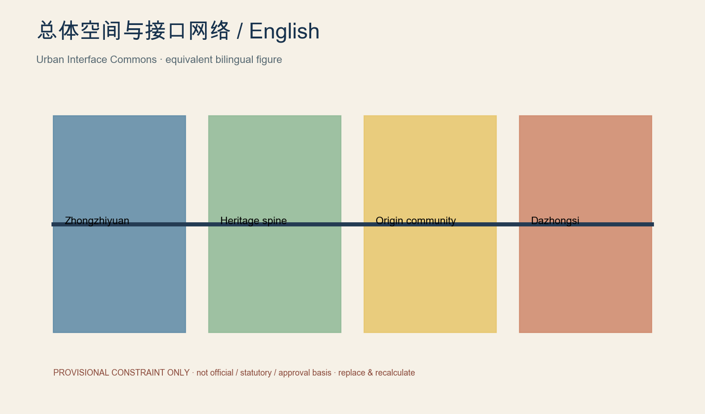
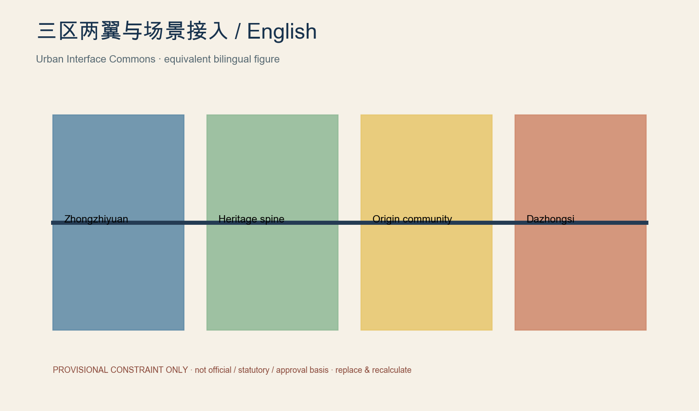
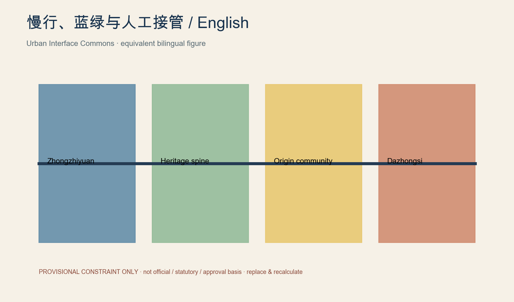
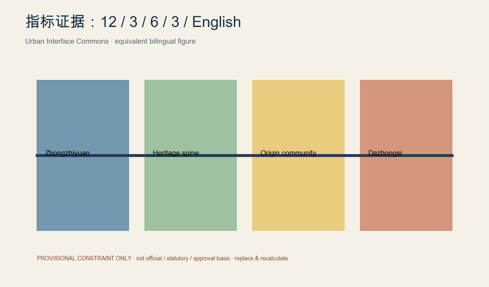

# JZ Open Urban Lab

## Design Basis and Source List

Urban Interface Commons does not add an AI veneer to railway heritage. It pre-builds five public interfaces—talent, compute and tools, data, space, and real-world scenarios—so models, robots, and digital services can connect under common public rules. Each interface identifies users, providers, admission conditions, spatial host, data minimisation, duration, named human owner, pause trigger, exit path, acceptance KPI, and recovery action. Zhongzhiyuan is a pre-deployment proving ground for reliability, weak-network operation, edge AI, interoperability, and human takeover. Beijing AI Origin Community uses resident need definition, co-creation, limited trial, feedback, continue/revise/withdraw choices, and non-AI public-service continuity. Dazhongsi supports AI-native services, professional exchange, capital and scenario publication without claiming a confirmed station-city interface. The Zhongguancun service wing supplies legal, IP, standards, talent, international cooperation, compliance, and safety support; the Xiaoyuehe wing hosts low-speed, low-risk, public-facing and rapidly reversible trials. Replaceable modules—power, network, mounts, docks, accessible counters, e-ink signs, temporary enclosure, safety cut-off, manual takeover, and feedback terminals—sit as a reversible second layer over heritage and public space. Every boundary is provisional, not official, statutory, or an approval basis; official SITE_BOUNDARY and KEY_AREA polygons must replace it and trigger EPSG:4548 recalculation. [source:SRC-2026-0518-AGENT-OPEN-CALL-TASKBOOK] [data:geometry/site_boundary.geojson#PROV-SITE-001] [metric:site_area_sqm]

## Three-Level Scope Framework

Urban Interface Commons does not add an AI veneer to railway heritage. It pre-builds five public interfaces—talent, compute and tools, data, space, and real-world scenarios—so models, robots, and digital services can connect under common public rules. Each interface identifies users, providers, admission conditions, spatial host, data minimisation, duration, named human owner, pause trigger, exit path, acceptance KPI, and recovery action. Zhongzhiyuan is a pre-deployment proving ground for reliability, weak-network operation, edge AI, interoperability, and human takeover. Beijing AI Origin Community uses resident need definition, co-creation, limited trial, feedback, continue/revise/withdraw choices, and non-AI public-service continuity. Dazhongsi supports AI-native services, professional exchange, capital and scenario publication without claiming a confirmed station-city interface. The Zhongguancun service wing supplies legal, IP, standards, talent, international cooperation, compliance, and safety support; the Xiaoyuehe wing hosts low-speed, low-risk, public-facing and rapidly reversible trials. Replaceable modules—power, network, mounts, docks, accessible counters, e-ink signs, temporary enclosure, safety cut-off, manual takeover, and feedback terminals—sit as a reversible second layer over heritage and public space. Every boundary is provisional, not official, statutory, or an approval basis; official SITE_BOUNDARY and KEY_AREA polygons must replace it and trigger EPSG:4548 recalculation. [source:SRC-2026-0518-AGENT-OPEN-CALL-TASKBOOK] [data:geometry/site_boundary.geojson#PROV-SITE-001] [metric:site_area_sqm]

## Coordinated Research Area: Industry and Future City Research

Urban Interface Commons does not add an AI veneer to railway heritage. It pre-builds five public interfaces—talent, compute and tools, data, space, and real-world scenarios—so models, robots, and digital services can connect under common public rules. Each interface identifies users, providers, admission conditions, spatial host, data minimisation, duration, named human owner, pause trigger, exit path, acceptance KPI, and recovery action. Zhongzhiyuan is a pre-deployment proving ground for reliability, weak-network operation, edge AI, interoperability, and human takeover. Beijing AI Origin Community uses resident need definition, co-creation, limited trial, feedback, continue/revise/withdraw choices, and non-AI public-service continuity. Dazhongsi supports AI-native services, professional exchange, capital and scenario publication without claiming a confirmed station-city interface. The Zhongguancun service wing supplies legal, IP, standards, talent, international cooperation, compliance, and safety support; the Xiaoyuehe wing hosts low-speed, low-risk, public-facing and rapidly reversible trials. Replaceable modules—power, network, mounts, docks, accessible counters, e-ink signs, temporary enclosure, safety cut-off, manual takeover, and feedback terminals—sit as a reversible second layer over heritage and public space. Every boundary is provisional, not official, statutory, or an approval basis; official SITE_BOUNDARY and KEY_AREA polygons must replace it and trigger EPSG:4548 recalculation. [source:SRC-2026-0518-AGENT-OPEN-CALL-TASKBOOK] [data:geometry/site_boundary.geojson#PROV-SITE-001] [metric:site_area_sqm]

## Overall Design Area: Urban Renewal and Regulatory-Plan-Level Urban Design

Urban Interface Commons does not add an AI veneer to railway heritage. It pre-builds five public interfaces—talent, compute and tools, data, space, and real-world scenarios—so models, robots, and digital services can connect under common public rules. Each interface identifies users, providers, admission conditions, spatial host, data minimisation, duration, named human owner, pause trigger, exit path, acceptance KPI, and recovery action. Zhongzhiyuan is a pre-deployment proving ground for reliability, weak-network operation, edge AI, interoperability, and human takeover. Beijing AI Origin Community uses resident need definition, co-creation, limited trial, feedback, continue/revise/withdraw choices, and non-AI public-service continuity. Dazhongsi supports AI-native services, professional exchange, capital and scenario publication without claiming a confirmed station-city interface. The Zhongguancun service wing supplies legal, IP, standards, talent, international cooperation, compliance, and safety support; the Xiaoyuehe wing hosts low-speed, low-risk, public-facing and rapidly reversible trials. Replaceable modules—power, network, mounts, docks, accessible counters, e-ink signs, temporary enclosure, safety cut-off, manual takeover, and feedback terminals—sit as a reversible second layer over heritage and public space. Every boundary is provisional, not official, statutory, or an approval basis; official SITE_BOUNDARY and KEY_AREA polygons must replace it and trigger EPSG:4548 recalculation. [source:SRC-2026-0518-AGENT-OPEN-CALL-TASKBOOK] [data:geometry/site_boundary.geojson#PROV-SITE-001] [metric:site_area_sqm]

## Detailed Design of Key Areas

Urban Interface Commons does not add an AI veneer to railway heritage. It pre-builds five public interfaces—talent, compute and tools, data, space, and real-world scenarios—so models, robots, and digital services can connect under common public rules. Each interface identifies users, providers, admission conditions, spatial host, data minimisation, duration, named human owner, pause trigger, exit path, acceptance KPI, and recovery action. Zhongzhiyuan is a pre-deployment proving ground for reliability, weak-network operation, edge AI, interoperability, and human takeover. Beijing AI Origin Community uses resident need definition, co-creation, limited trial, feedback, continue/revise/withdraw choices, and non-AI public-service continuity. Dazhongsi supports AI-native services, professional exchange, capital and scenario publication without claiming a confirmed station-city interface. The Zhongguancun service wing supplies legal, IP, standards, talent, international cooperation, compliance, and safety support; the Xiaoyuehe wing hosts low-speed, low-risk, public-facing and rapidly reversible trials. Replaceable modules—power, network, mounts, docks, accessible counters, e-ink signs, temporary enclosure, safety cut-off, manual takeover, and feedback terminals—sit as a reversible second layer over heritage and public space. Every boundary is provisional, not official, statutory, or an approval basis; official SITE_BOUNDARY and KEY_AREA polygons must replace it and trigger EPSG:4548 recalculation. [source:SRC-2026-0518-AGENT-OPEN-CALL-TASKBOOK] [data:geometry/site_boundary.geojson#PROV-SITE-001] [metric:site_area_sqm]

## AI Innovation Ecosystem, Personas, and AI+ Scenarios

Urban Interface Commons does not add an AI veneer to railway heritage. It pre-builds five public interfaces—talent, compute and tools, data, space, and real-world scenarios—so models, robots, and digital services can connect under common public rules. Each interface identifies users, providers, admission conditions, spatial host, data minimisation, duration, named human owner, pause trigger, exit path, acceptance KPI, and recovery action. Zhongzhiyuan is a pre-deployment proving ground for reliability, weak-network operation, edge AI, interoperability, and human takeover. Beijing AI Origin Community uses resident need definition, co-creation, limited trial, feedback, continue/revise/withdraw choices, and non-AI public-service continuity. Dazhongsi supports AI-native services, professional exchange, capital and scenario publication without claiming a confirmed station-city interface. The Zhongguancun service wing supplies legal, IP, standards, talent, international cooperation, compliance, and safety support; the Xiaoyuehe wing hosts low-speed, low-risk, public-facing and rapidly reversible trials. Replaceable modules—power, network, mounts, docks, accessible counters, e-ink signs, temporary enclosure, safety cut-off, manual takeover, and feedback terminals—sit as a reversible second layer over heritage and public space. Every boundary is provisional, not official, statutory, or an approval basis; official SITE_BOUNDARY and KEY_AREA polygons must replace it and trigger EPSG:4548 recalculation. [source:SRC-2026-0518-AGENT-OPEN-CALL-TASKBOOK] [data:geometry/site_boundary.geojson#PROV-SITE-001] [metric:site_area_sqm]

## Land Use, Building Scale, and Retain-Renovate-Demolish Strategy

Urban Interface Commons does not add an AI veneer to railway heritage. It pre-builds five public interfaces—talent, compute and tools, data, space, and real-world scenarios—so models, robots, and digital services can connect under common public rules. Each interface identifies users, providers, admission conditions, spatial host, data minimisation, duration, named human owner, pause trigger, exit path, acceptance KPI, and recovery action. Zhongzhiyuan is a pre-deployment proving ground for reliability, weak-network operation, edge AI, interoperability, and human takeover. Beijing AI Origin Community uses resident need definition, co-creation, limited trial, feedback, continue/revise/withdraw choices, and non-AI public-service continuity. Dazhongsi supports AI-native services, professional exchange, capital and scenario publication without claiming a confirmed station-city interface. The Zhongguancun service wing supplies legal, IP, standards, talent, international cooperation, compliance, and safety support; the Xiaoyuehe wing hosts low-speed, low-risk, public-facing and rapidly reversible trials. Replaceable modules—power, network, mounts, docks, accessible counters, e-ink signs, temporary enclosure, safety cut-off, manual takeover, and feedback terminals—sit as a reversible second layer over heritage and public space. Every boundary is provisional, not official, statutory, or an approval basis; official SITE_BOUNDARY and KEY_AREA polygons must replace it and trigger EPSG:4548 recalculation. [source:SRC-2026-0518-AGENT-OPEN-CALL-TASKBOOK] [data:geometry/site_boundary.geojson#PROV-SITE-001] [metric:site_area_sqm]

## Transport, Rail, Municipal Infrastructure, and Public Services

Urban Interface Commons does not add an AI veneer to railway heritage. It pre-builds five public interfaces—talent, compute and tools, data, space, and real-world scenarios—so models, robots, and digital services can connect under common public rules. Each interface identifies users, providers, admission conditions, spatial host, data minimisation, duration, named human owner, pause trigger, exit path, acceptance KPI, and recovery action. Zhongzhiyuan is a pre-deployment proving ground for reliability, weak-network operation, edge AI, interoperability, and human takeover. Beijing AI Origin Community uses resident need definition, co-creation, limited trial, feedback, continue/revise/withdraw choices, and non-AI public-service continuity. Dazhongsi supports AI-native services, professional exchange, capital and scenario publication without claiming a confirmed station-city interface. The Zhongguancun service wing supplies legal, IP, standards, talent, international cooperation, compliance, and safety support; the Xiaoyuehe wing hosts low-speed, low-risk, public-facing and rapidly reversible trials. Replaceable modules—power, network, mounts, docks, accessible counters, e-ink signs, temporary enclosure, safety cut-off, manual takeover, and feedback terminals—sit as a reversible second layer over heritage and public space. Every boundary is provisional, not official, statutory, or an approval basis; official SITE_BOUNDARY and KEY_AREA polygons must replace it and trigger EPSG:4548 recalculation. [source:SRC-2026-0518-AGENT-OPEN-CALL-TASKBOOK] [data:geometry/site_boundary.geojson#PROV-SITE-001] [metric:site_area_sqm]

## Blue-Green Network, Public Space, and Urban Character

Urban Interface Commons does not add an AI veneer to railway heritage. It pre-builds five public interfaces—talent, compute and tools, data, space, and real-world scenarios—so models, robots, and digital services can connect under common public rules. Each interface identifies users, providers, admission conditions, spatial host, data minimisation, duration, named human owner, pause trigger, exit path, acceptance KPI, and recovery action. Zhongzhiyuan is a pre-deployment proving ground for reliability, weak-network operation, edge AI, interoperability, and human takeover. Beijing AI Origin Community uses resident need definition, co-creation, limited trial, feedback, continue/revise/withdraw choices, and non-AI public-service continuity. Dazhongsi supports AI-native services, professional exchange, capital and scenario publication without claiming a confirmed station-city interface. The Zhongguancun service wing supplies legal, IP, standards, talent, international cooperation, compliance, and safety support; the Xiaoyuehe wing hosts low-speed, low-risk, public-facing and rapidly reversible trials. Replaceable modules—power, network, mounts, docks, accessible counters, e-ink signs, temporary enclosure, safety cut-off, manual takeover, and feedback terminals—sit as a reversible second layer over heritage and public space. Every boundary is provisional, not official, statutory, or an approval basis; official SITE_BOUNDARY and KEY_AREA polygons must replace it and trigger EPSG:4548 recalculation. [source:SRC-2026-0518-AGENT-OPEN-CALL-TASKBOOK] [data:geometry/site_boundary.geojson#PROV-SITE-001] [metric:site_area_sqm]

## Renewal Projects, Implementation Policy, and Phasing

Urban Interface Commons does not add an AI veneer to railway heritage. It pre-builds five public interfaces—talent, compute and tools, data, space, and real-world scenarios—so models, robots, and digital services can connect under common public rules. Each interface identifies users, providers, admission conditions, spatial host, data minimisation, duration, named human owner, pause trigger, exit path, acceptance KPI, and recovery action. Zhongzhiyuan is a pre-deployment proving ground for reliability, weak-network operation, edge AI, interoperability, and human takeover. Beijing AI Origin Community uses resident need definition, co-creation, limited trial, feedback, continue/revise/withdraw choices, and non-AI public-service continuity. Dazhongsi supports AI-native services, professional exchange, capital and scenario publication without claiming a confirmed station-city interface. The Zhongguancun service wing supplies legal, IP, standards, talent, international cooperation, compliance, and safety support; the Xiaoyuehe wing hosts low-speed, low-risk, public-facing and rapidly reversible trials. Replaceable modules—power, network, mounts, docks, accessible counters, e-ink signs, temporary enclosure, safety cut-off, manual takeover, and feedback terminals—sit as a reversible second layer over heritage and public space. Every boundary is provisional, not official, statutory, or an approval basis; official SITE_BOUNDARY and KEY_AREA polygons must replace it and trigger EPSG:4548 recalculation. [source:SRC-2026-0518-AGENT-OPEN-CALL-TASKBOOK] [data:geometry/site_boundary.geojson#PROV-SITE-001] [metric:site_area_sqm]

## Metrics, Area Recalculation, and Compliance Matrix

Urban Interface Commons does not add an AI veneer to railway heritage. It pre-builds five public interfaces—talent, compute and tools, data, space, and real-world scenarios—so models, robots, and digital services can connect under common public rules. Each interface identifies users, providers, admission conditions, spatial host, data minimisation, duration, named human owner, pause trigger, exit path, acceptance KPI, and recovery action. Zhongzhiyuan is a pre-deployment proving ground for reliability, weak-network operation, edge AI, interoperability, and human takeover. Beijing AI Origin Community uses resident need definition, co-creation, limited trial, feedback, continue/revise/withdraw choices, and non-AI public-service continuity. Dazhongsi supports AI-native services, professional exchange, capital and scenario publication without claiming a confirmed station-city interface. The Zhongguancun service wing supplies legal, IP, standards, talent, international cooperation, compliance, and safety support; the Xiaoyuehe wing hosts low-speed, low-risk, public-facing and rapidly reversible trials. Replaceable modules—power, network, mounts, docks, accessible counters, e-ink signs, temporary enclosure, safety cut-off, manual takeover, and feedback terminals—sit as a reversible second layer over heritage and public space. Every boundary is provisional, not official, statutory, or an approval basis; official SITE_BOUNDARY and KEY_AREA polygons must replace it and trigger EPSG:4548 recalculation. [source:SRC-2026-0518-AGENT-OPEN-CALL-TASKBOOK] [data:geometry/site_boundary.geojson#PROV-SITE-001] [metric:site_area_sqm]

## Risk, Copyright, and Compliance

Urban Interface Commons does not add an AI veneer to railway heritage. It pre-builds five public interfaces—talent, compute and tools, data, space, and real-world scenarios—so models, robots, and digital services can connect under common public rules. Each interface identifies users, providers, admission conditions, spatial host, data minimisation, duration, named human owner, pause trigger, exit path, acceptance KPI, and recovery action. Zhongzhiyuan is a pre-deployment proving ground for reliability, weak-network operation, edge AI, interoperability, and human takeover. Beijing AI Origin Community uses resident need definition, co-creation, limited trial, feedback, continue/revise/withdraw choices, and non-AI public-service continuity. Dazhongsi supports AI-native services, professional exchange, capital and scenario publication without claiming a confirmed station-city interface. The Zhongguancun service wing supplies legal, IP, standards, talent, international cooperation, compliance, and safety support; the Xiaoyuehe wing hosts low-speed, low-risk, public-facing and rapidly reversible trials. Replaceable modules—power, network, mounts, docks, accessible counters, e-ink signs, temporary enclosure, safety cut-off, manual takeover, and feedback terminals—sit as a reversible second layer over heritage and public space. Every boundary is provisional, not official, statutory, or an approval basis; official SITE_BOUNDARY and KEY_AREA polygons must replace it and trigger EPSG:4548 recalculation. [source:SRC-2026-0518-AGENT-OPEN-CALL-TASKBOOK] [data:geometry/site_boundary.geojson#PROV-SITE-001] [metric:site_area_sqm]

## References

Urban Interface Commons does not add an AI veneer to railway heritage. It pre-builds five public interfaces—talent, compute and tools, data, space, and real-world scenarios—so models, robots, and digital services can connect under common public rules. Each interface identifies users, providers, admission conditions, spatial host, data minimisation, duration, named human owner, pause trigger, exit path, acceptance KPI, and recovery action. Zhongzhiyuan is a pre-deployment proving ground for reliability, weak-network operation, edge AI, interoperability, and human takeover. Beijing AI Origin Community uses resident need definition, co-creation, limited trial, feedback, continue/revise/withdraw choices, and non-AI public-service continuity. Dazhongsi supports AI-native services, professional exchange, capital and scenario publication without claiming a confirmed station-city interface. The Zhongguancun service wing supplies legal, IP, standards, talent, international cooperation, compliance, and safety support; the Xiaoyuehe wing hosts low-speed, low-risk, public-facing and rapidly reversible trials. Replaceable modules—power, network, mounts, docks, accessible counters, e-ink signs, temporary enclosure, safety cut-off, manual takeover, and feedback terminals—sit as a reversible second layer over heritage and public space. Every boundary is provisional, not official, statutory, or an approval basis; official SITE_BOUNDARY and KEY_AREA polygons must replace it and trigger EPSG:4548 recalculation. [source:SRC-2026-0518-AGENT-OPEN-CALL-TASKBOOK] [data:geometry/site_boundary.geojson#PROV-SITE-001] [metric:site_area_sqm]

## Interface operating matrix

The five interfaces align people, tools, data, spatial modules, and scenario contracts. The package includes twelve scenario cards, three validation grounds, six personas, and three non-commercial public landmarks: the 0-kilometre railway–intelligence gate, the Open Model Yard with public selection and version records, and the City Agent Commons for public discussion, developer activity, failure review, and resident feedback.

