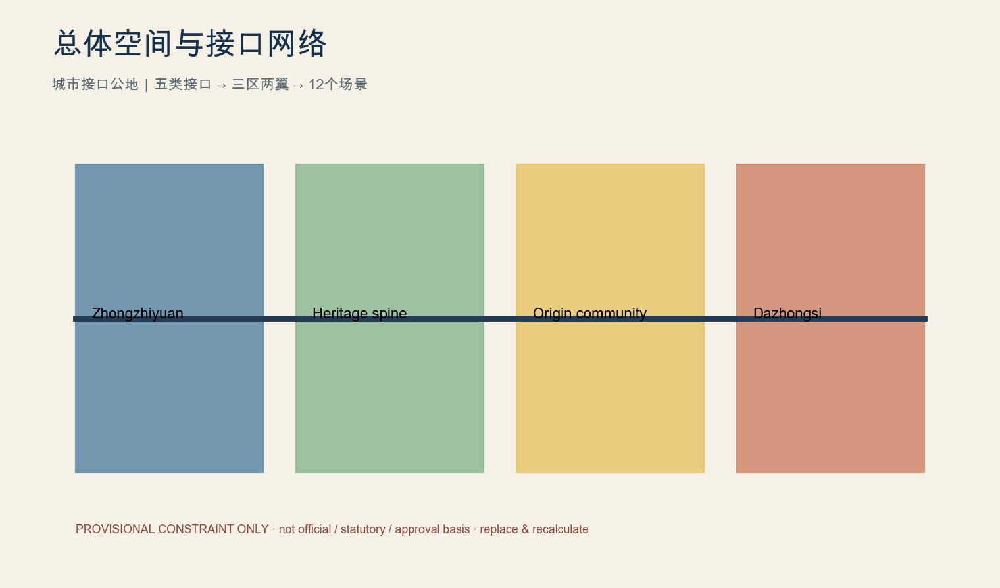
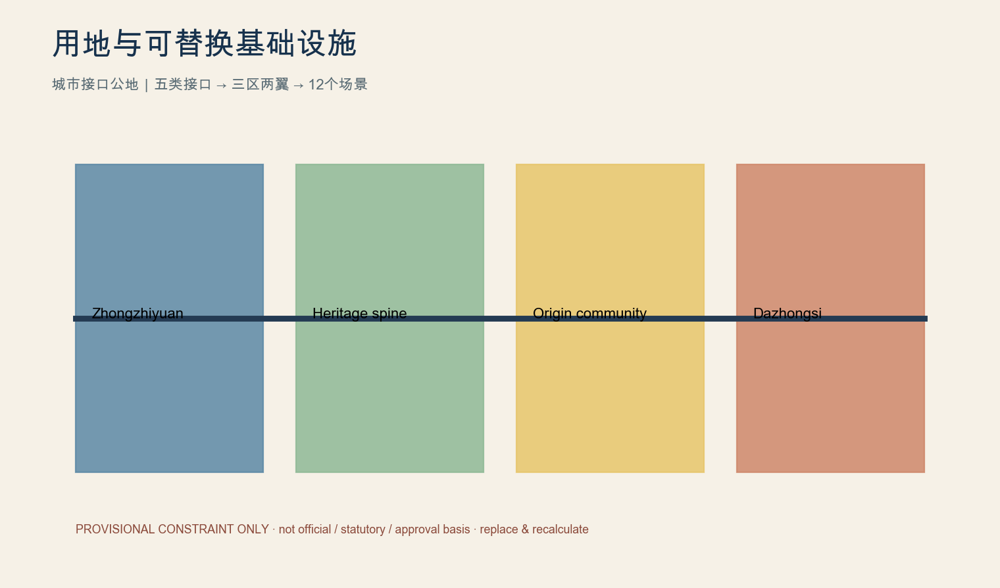
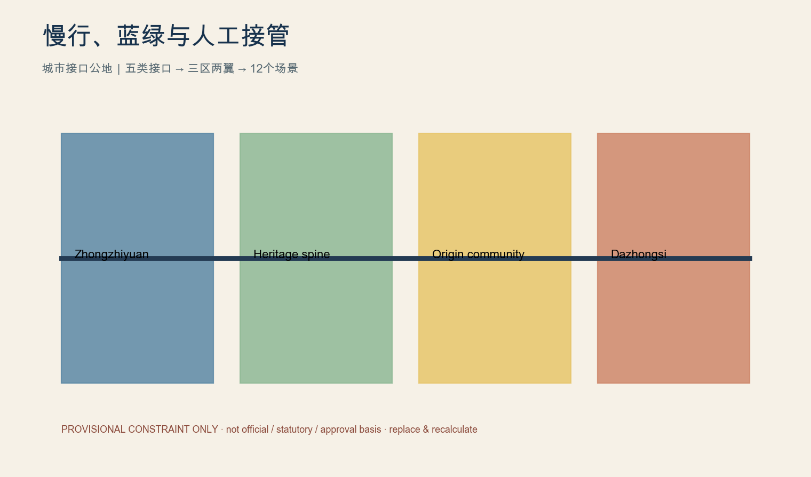
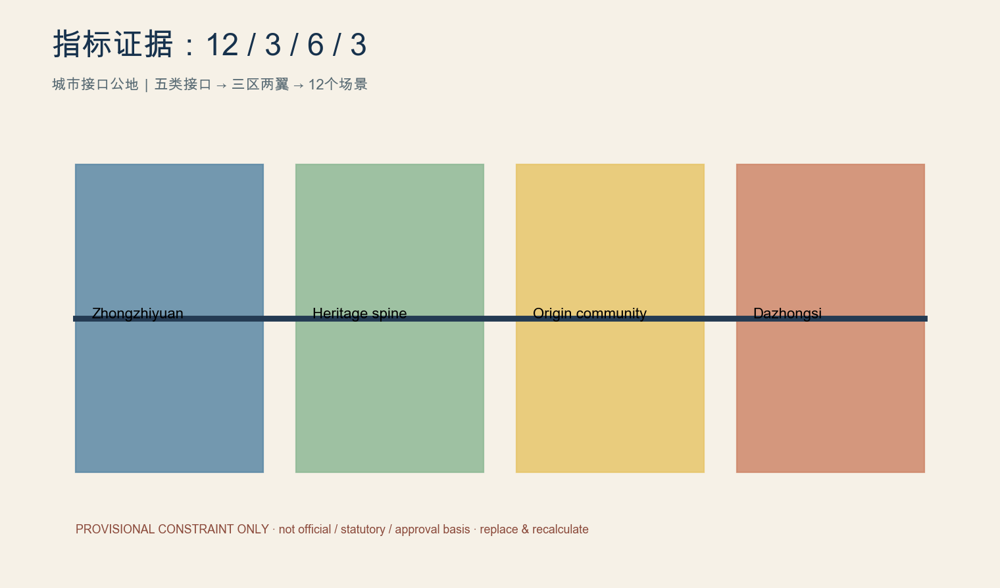

# 京张开放城市实验室

**Urban Interface Commons｜城市接口公地**：从“自主修铁路”到“自主定义未来技术如何进入城市”。

## 设计依据与资料清单

城市接口公地不是给铁路遗产加一层AI装饰，而是预先建设人才、算力与工具、数据、空间和真实场景五类公共接口，使模型、机器人和数字服务在统一规则下可接入、可替换、可审计、可退出。每一接口都明确服务对象、提供主体、使用者、申请条件、空间载体、数据规则、接入期限、人工责任人、暂停条件、退出机制、验收指标与失败后的场地恢复。众智园承担进入真实城市前的可靠性、弱网、端侧、互操作和人工接管验证；北京AI原点社区以居民需求—共创—小试—反馈—继续/修改/撤回为流程，保留拒绝权和人工服务；大钟寺承担AI原生服务、专业交流、创业资本和场景发布，不承诺确定的站城接口。中关村服务翼提供法律、知识产权、标准、人才、国际合作、数据合规和安全评估，小月河翼承载低风险、低速、公众可体验且可快速退出的试点。铁路遗产以保护性慢行主脊连接三处重点区，接口组件可拆、可换、可维修，包括电源网络、挂载点、停靠位、无障碍台、电子墨水牌、临时围合、断电点、手动接管点和反馈终端。所有范围为临时约束范围，绝不作为官方红线、法定控制或审批依据；获得正式SITE_BOUNDARY与KEY_AREA后必须替换并在EPSG:4548重算。 [source:SRC-2026-0518-AGENT-OPEN-CALL-TASKBOOK] [data:geometry/site_boundary.geojson#PROV-SITE-001] [metric:site_area_sqm]

## 三层范围工作框架

城市接口公地不是给铁路遗产加一层AI装饰，而是预先建设人才、算力与工具、数据、空间和真实场景五类公共接口，使模型、机器人和数字服务在统一规则下可接入、可替换、可审计、可退出。每一接口都明确服务对象、提供主体、使用者、申请条件、空间载体、数据规则、接入期限、人工责任人、暂停条件、退出机制、验收指标与失败后的场地恢复。众智园承担进入真实城市前的可靠性、弱网、端侧、互操作和人工接管验证；北京AI原点社区以居民需求—共创—小试—反馈—继续/修改/撤回为流程，保留拒绝权和人工服务；大钟寺承担AI原生服务、专业交流、创业资本和场景发布，不承诺确定的站城接口。中关村服务翼提供法律、知识产权、标准、人才、国际合作、数据合规和安全评估，小月河翼承载低风险、低速、公众可体验且可快速退出的试点。铁路遗产以保护性慢行主脊连接三处重点区，接口组件可拆、可换、可维修，包括电源网络、挂载点、停靠位、无障碍台、电子墨水牌、临时围合、断电点、手动接管点和反馈终端。所有范围为临时约束范围，绝不作为官方红线、法定控制或审批依据；获得正式SITE_BOUNDARY与KEY_AREA后必须替换并在EPSG:4548重算。 [source:SRC-2026-0518-AGENT-OPEN-CALL-TASKBOOK] [data:geometry/site_boundary.geojson#PROV-SITE-001] [metric:site_area_sqm]

## 统筹研究范围产业与未来城市研究

城市接口公地不是给铁路遗产加一层AI装饰，而是预先建设人才、算力与工具、数据、空间和真实场景五类公共接口，使模型、机器人和数字服务在统一规则下可接入、可替换、可审计、可退出。每一接口都明确服务对象、提供主体、使用者、申请条件、空间载体、数据规则、接入期限、人工责任人、暂停条件、退出机制、验收指标与失败后的场地恢复。众智园承担进入真实城市前的可靠性、弱网、端侧、互操作和人工接管验证；北京AI原点社区以居民需求—共创—小试—反馈—继续/修改/撤回为流程，保留拒绝权和人工服务；大钟寺承担AI原生服务、专业交流、创业资本和场景发布，不承诺确定的站城接口。中关村服务翼提供法律、知识产权、标准、人才、国际合作、数据合规和安全评估，小月河翼承载低风险、低速、公众可体验且可快速退出的试点。铁路遗产以保护性慢行主脊连接三处重点区，接口组件可拆、可换、可维修，包括电源网络、挂载点、停靠位、无障碍台、电子墨水牌、临时围合、断电点、手动接管点和反馈终端。所有范围为临时约束范围，绝不作为官方红线、法定控制或审批依据；获得正式SITE_BOUNDARY与KEY_AREA后必须替换并在EPSG:4548重算。 [source:SRC-2026-0518-AGENT-OPEN-CALL-TASKBOOK] [data:geometry/site_boundary.geojson#PROV-SITE-001] [metric:site_area_sqm]

## 总体设计范围城市更新与控规深度城市设计

城市接口公地不是给铁路遗产加一层AI装饰，而是预先建设人才、算力与工具、数据、空间和真实场景五类公共接口，使模型、机器人和数字服务在统一规则下可接入、可替换、可审计、可退出。每一接口都明确服务对象、提供主体、使用者、申请条件、空间载体、数据规则、接入期限、人工责任人、暂停条件、退出机制、验收指标与失败后的场地恢复。众智园承担进入真实城市前的可靠性、弱网、端侧、互操作和人工接管验证；北京AI原点社区以居民需求—共创—小试—反馈—继续/修改/撤回为流程，保留拒绝权和人工服务；大钟寺承担AI原生服务、专业交流、创业资本和场景发布，不承诺确定的站城接口。中关村服务翼提供法律、知识产权、标准、人才、国际合作、数据合规和安全评估，小月河翼承载低风险、低速、公众可体验且可快速退出的试点。铁路遗产以保护性慢行主脊连接三处重点区，接口组件可拆、可换、可维修，包括电源网络、挂载点、停靠位、无障碍台、电子墨水牌、临时围合、断电点、手动接管点和反馈终端。所有范围为临时约束范围，绝不作为官方红线、法定控制或审批依据；获得正式SITE_BOUNDARY与KEY_AREA后必须替换并在EPSG:4548重算。 [source:SRC-2026-0518-AGENT-OPEN-CALL-TASKBOOK] [data:geometry/site_boundary.geojson#PROV-SITE-001] [metric:site_area_sqm]

## 重点区域详细设计

城市接口公地不是给铁路遗产加一层AI装饰，而是预先建设人才、算力与工具、数据、空间和真实场景五类公共接口，使模型、机器人和数字服务在统一规则下可接入、可替换、可审计、可退出。每一接口都明确服务对象、提供主体、使用者、申请条件、空间载体、数据规则、接入期限、人工责任人、暂停条件、退出机制、验收指标与失败后的场地恢复。众智园承担进入真实城市前的可靠性、弱网、端侧、互操作和人工接管验证；北京AI原点社区以居民需求—共创—小试—反馈—继续/修改/撤回为流程，保留拒绝权和人工服务；大钟寺承担AI原生服务、专业交流、创业资本和场景发布，不承诺确定的站城接口。中关村服务翼提供法律、知识产权、标准、人才、国际合作、数据合规和安全评估，小月河翼承载低风险、低速、公众可体验且可快速退出的试点。铁路遗产以保护性慢行主脊连接三处重点区，接口组件可拆、可换、可维修，包括电源网络、挂载点、停靠位、无障碍台、电子墨水牌、临时围合、断电点、手动接管点和反馈终端。所有范围为临时约束范围，绝不作为官方红线、法定控制或审批依据；获得正式SITE_BOUNDARY与KEY_AREA后必须替换并在EPSG:4548重算。 [source:SRC-2026-0518-AGENT-OPEN-CALL-TASKBOOK] [data:geometry/site_boundary.geojson#PROV-SITE-001] [metric:site_area_sqm]

## AI 创新生态、人才画像与 AI+ 场景

城市接口公地不是给铁路遗产加一层AI装饰，而是预先建设人才、算力与工具、数据、空间和真实场景五类公共接口，使模型、机器人和数字服务在统一规则下可接入、可替换、可审计、可退出。每一接口都明确服务对象、提供主体、使用者、申请条件、空间载体、数据规则、接入期限、人工责任人、暂停条件、退出机制、验收指标与失败后的场地恢复。众智园承担进入真实城市前的可靠性、弱网、端侧、互操作和人工接管验证；北京AI原点社区以居民需求—共创—小试—反馈—继续/修改/撤回为流程，保留拒绝权和人工服务；大钟寺承担AI原生服务、专业交流、创业资本和场景发布，不承诺确定的站城接口。中关村服务翼提供法律、知识产权、标准、人才、国际合作、数据合规和安全评估，小月河翼承载低风险、低速、公众可体验且可快速退出的试点。铁路遗产以保护性慢行主脊连接三处重点区，接口组件可拆、可换、可维修，包括电源网络、挂载点、停靠位、无障碍台、电子墨水牌、临时围合、断电点、手动接管点和反馈终端。所有范围为临时约束范围，绝不作为官方红线、法定控制或审批依据；获得正式SITE_BOUNDARY与KEY_AREA后必须替换并在EPSG:4548重算。 [source:SRC-2026-0518-AGENT-OPEN-CALL-TASKBOOK] [data:geometry/site_boundary.geojson#PROV-SITE-001] [metric:site_area_sqm]

## 用地、建筑规模与拆改留方案

城市接口公地不是给铁路遗产加一层AI装饰，而是预先建设人才、算力与工具、数据、空间和真实场景五类公共接口，使模型、机器人和数字服务在统一规则下可接入、可替换、可审计、可退出。每一接口都明确服务对象、提供主体、使用者、申请条件、空间载体、数据规则、接入期限、人工责任人、暂停条件、退出机制、验收指标与失败后的场地恢复。众智园承担进入真实城市前的可靠性、弱网、端侧、互操作和人工接管验证；北京AI原点社区以居民需求—共创—小试—反馈—继续/修改/撤回为流程，保留拒绝权和人工服务；大钟寺承担AI原生服务、专业交流、创业资本和场景发布，不承诺确定的站城接口。中关村服务翼提供法律、知识产权、标准、人才、国际合作、数据合规和安全评估，小月河翼承载低风险、低速、公众可体验且可快速退出的试点。铁路遗产以保护性慢行主脊连接三处重点区，接口组件可拆、可换、可维修，包括电源网络、挂载点、停靠位、无障碍台、电子墨水牌、临时围合、断电点、手动接管点和反馈终端。所有范围为临时约束范围，绝不作为官方红线、法定控制或审批依据；获得正式SITE_BOUNDARY与KEY_AREA后必须替换并在EPSG:4548重算。 [source:SRC-2026-0518-AGENT-OPEN-CALL-TASKBOOK] [data:geometry/site_boundary.geojson#PROV-SITE-001] [metric:site_area_sqm]

## 交通、轨道、市政与公共服务设施

城市接口公地不是给铁路遗产加一层AI装饰，而是预先建设人才、算力与工具、数据、空间和真实场景五类公共接口，使模型、机器人和数字服务在统一规则下可接入、可替换、可审计、可退出。每一接口都明确服务对象、提供主体、使用者、申请条件、空间载体、数据规则、接入期限、人工责任人、暂停条件、退出机制、验收指标与失败后的场地恢复。众智园承担进入真实城市前的可靠性、弱网、端侧、互操作和人工接管验证；北京AI原点社区以居民需求—共创—小试—反馈—继续/修改/撤回为流程，保留拒绝权和人工服务；大钟寺承担AI原生服务、专业交流、创业资本和场景发布，不承诺确定的站城接口。中关村服务翼提供法律、知识产权、标准、人才、国际合作、数据合规和安全评估，小月河翼承载低风险、低速、公众可体验且可快速退出的试点。铁路遗产以保护性慢行主脊连接三处重点区，接口组件可拆、可换、可维修，包括电源网络、挂载点、停靠位、无障碍台、电子墨水牌、临时围合、断电点、手动接管点和反馈终端。所有范围为临时约束范围，绝不作为官方红线、法定控制或审批依据；获得正式SITE_BOUNDARY与KEY_AREA后必须替换并在EPSG:4548重算。 [source:SRC-2026-0518-AGENT-OPEN-CALL-TASKBOOK] [data:geometry/site_boundary.geojson#PROV-SITE-001] [metric:site_area_sqm]

## 蓝绿空间、公共空间与城市风貌

城市接口公地不是给铁路遗产加一层AI装饰，而是预先建设人才、算力与工具、数据、空间和真实场景五类公共接口，使模型、机器人和数字服务在统一规则下可接入、可替换、可审计、可退出。每一接口都明确服务对象、提供主体、使用者、申请条件、空间载体、数据规则、接入期限、人工责任人、暂停条件、退出机制、验收指标与失败后的场地恢复。众智园承担进入真实城市前的可靠性、弱网、端侧、互操作和人工接管验证；北京AI原点社区以居民需求—共创—小试—反馈—继续/修改/撤回为流程，保留拒绝权和人工服务；大钟寺承担AI原生服务、专业交流、创业资本和场景发布，不承诺确定的站城接口。中关村服务翼提供法律、知识产权、标准、人才、国际合作、数据合规和安全评估，小月河翼承载低风险、低速、公众可体验且可快速退出的试点。铁路遗产以保护性慢行主脊连接三处重点区，接口组件可拆、可换、可维修，包括电源网络、挂载点、停靠位、无障碍台、电子墨水牌、临时围合、断电点、手动接管点和反馈终端。所有范围为临时约束范围，绝不作为官方红线、法定控制或审批依据；获得正式SITE_BOUNDARY与KEY_AREA后必须替换并在EPSG:4548重算。 [source:SRC-2026-0518-AGENT-OPEN-CALL-TASKBOOK] [data:geometry/site_boundary.geojson#PROV-SITE-001] [metric:site_area_sqm]

## 更新项目清单、实施政策与分期计划

城市接口公地不是给铁路遗产加一层AI装饰，而是预先建设人才、算力与工具、数据、空间和真实场景五类公共接口，使模型、机器人和数字服务在统一规则下可接入、可替换、可审计、可退出。每一接口都明确服务对象、提供主体、使用者、申请条件、空间载体、数据规则、接入期限、人工责任人、暂停条件、退出机制、验收指标与失败后的场地恢复。众智园承担进入真实城市前的可靠性、弱网、端侧、互操作和人工接管验证；北京AI原点社区以居民需求—共创—小试—反馈—继续/修改/撤回为流程，保留拒绝权和人工服务；大钟寺承担AI原生服务、专业交流、创业资本和场景发布，不承诺确定的站城接口。中关村服务翼提供法律、知识产权、标准、人才、国际合作、数据合规和安全评估，小月河翼承载低风险、低速、公众可体验且可快速退出的试点。铁路遗产以保护性慢行主脊连接三处重点区，接口组件可拆、可换、可维修，包括电源网络、挂载点、停靠位、无障碍台、电子墨水牌、临时围合、断电点、手动接管点和反馈终端。所有范围为临时约束范围，绝不作为官方红线、法定控制或审批依据；获得正式SITE_BOUNDARY与KEY_AREA后必须替换并在EPSG:4548重算。 [source:SRC-2026-0518-AGENT-OPEN-CALL-TASKBOOK] [data:geometry/site_boundary.geojson#PROV-SITE-001] [metric:site_area_sqm]

## 指标体系、面积复算与合规矩阵

城市接口公地不是给铁路遗产加一层AI装饰，而是预先建设人才、算力与工具、数据、空间和真实场景五类公共接口，使模型、机器人和数字服务在统一规则下可接入、可替换、可审计、可退出。每一接口都明确服务对象、提供主体、使用者、申请条件、空间载体、数据规则、接入期限、人工责任人、暂停条件、退出机制、验收指标与失败后的场地恢复。众智园承担进入真实城市前的可靠性、弱网、端侧、互操作和人工接管验证；北京AI原点社区以居民需求—共创—小试—反馈—继续/修改/撤回为流程，保留拒绝权和人工服务；大钟寺承担AI原生服务、专业交流、创业资本和场景发布，不承诺确定的站城接口。中关村服务翼提供法律、知识产权、标准、人才、国际合作、数据合规和安全评估，小月河翼承载低风险、低速、公众可体验且可快速退出的试点。铁路遗产以保护性慢行主脊连接三处重点区，接口组件可拆、可换、可维修，包括电源网络、挂载点、停靠位、无障碍台、电子墨水牌、临时围合、断电点、手动接管点和反馈终端。所有范围为临时约束范围，绝不作为官方红线、法定控制或审批依据；获得正式SITE_BOUNDARY与KEY_AREA后必须替换并在EPSG:4548重算。 [source:SRC-2026-0518-AGENT-OPEN-CALL-TASKBOOK] [data:geometry/site_boundary.geojson#PROV-SITE-001] [metric:site_area_sqm]

## 风险、版权与合规说明

城市接口公地不是给铁路遗产加一层AI装饰，而是预先建设人才、算力与工具、数据、空间和真实场景五类公共接口，使模型、机器人和数字服务在统一规则下可接入、可替换、可审计、可退出。每一接口都明确服务对象、提供主体、使用者、申请条件、空间载体、数据规则、接入期限、人工责任人、暂停条件、退出机制、验收指标与失败后的场地恢复。众智园承担进入真实城市前的可靠性、弱网、端侧、互操作和人工接管验证；北京AI原点社区以居民需求—共创—小试—反馈—继续/修改/撤回为流程，保留拒绝权和人工服务；大钟寺承担AI原生服务、专业交流、创业资本和场景发布，不承诺确定的站城接口。中关村服务翼提供法律、知识产权、标准、人才、国际合作、数据合规和安全评估，小月河翼承载低风险、低速、公众可体验且可快速退出的试点。铁路遗产以保护性慢行主脊连接三处重点区，接口组件可拆、可换、可维修，包括电源网络、挂载点、停靠位、无障碍台、电子墨水牌、临时围合、断电点、手动接管点和反馈终端。所有范围为临时约束范围，绝不作为官方红线、法定控制或审批依据；获得正式SITE_BOUNDARY与KEY_AREA后必须替换并在EPSG:4548重算。 [source:SRC-2026-0518-AGENT-OPEN-CALL-TASKBOOK] [data:geometry/site_boundary.geojson#PROV-SITE-001] [metric:site_area_sqm]

## 参考资料

城市接口公地不是给铁路遗产加一层AI装饰，而是预先建设人才、算力与工具、数据、空间和真实场景五类公共接口，使模型、机器人和数字服务在统一规则下可接入、可替换、可审计、可退出。每一接口都明确服务对象、提供主体、使用者、申请条件、空间载体、数据规则、接入期限、人工责任人、暂停条件、退出机制、验收指标与失败后的场地恢复。众智园承担进入真实城市前的可靠性、弱网、端侧、互操作和人工接管验证；北京AI原点社区以居民需求—共创—小试—反馈—继续/修改/撤回为流程，保留拒绝权和人工服务；大钟寺承担AI原生服务、专业交流、创业资本和场景发布，不承诺确定的站城接口。中关村服务翼提供法律、知识产权、标准、人才、国际合作、数据合规和安全评估，小月河翼承载低风险、低速、公众可体验且可快速退出的试点。铁路遗产以保护性慢行主脊连接三处重点区，接口组件可拆、可换、可维修，包括电源网络、挂载点、停靠位、无障碍台、电子墨水牌、临时围合、断电点、手动接管点和反馈终端。所有范围为临时约束范围，绝不作为官方红线、法定控制或审批依据；获得正式SITE_BOUNDARY与KEY_AREA后必须替换并在EPSG:4548重算。 [source:SRC-2026-0518-AGENT-OPEN-CALL-TASKBOOK] [data:geometry/site_boundary.geojson#PROV-SITE-001] [metric:site_area_sqm]

## 五类城市接口执行矩阵

|接口|服务对象/提供主体|申请、空间与数据|期限/人工责任|暂停、退出与KPI|
|---|---|---|---|---|
|人才接口|研究者、创业者、学生；服务翼协调|公开目的、驻留资格、共创屋|90天；项目负责人|投诉即停；结项回收；参与反馈|
|算力与工具接口|开发者；测试节点运营方|资源上限、边缘设备、SDK、日志|30天；技术责任人|日志缺失即停；断开令牌；故障恢复|
|数据接口|居民与服务团队；治理小组|最小化、分级、匿名、用途限制|试点到期删除；数据责任人|越权即停；删除留痕；投诉闭环|
|空间接口|公众与机器人；场地运营方|预约、安全清单、电源网络、接管点|7—30天；现场安全员|碰撞即停；拆除组件；恢复时间|
|场景接口|公众与试点团队；接入委员会|统一接入合同、非AI备选、KPI|最长90天；场景责任人|安全/投诉/KPI失败即停；恢复人工服务|

## 12 张场景卡

|场景|User / Problem|AI role / Non-AI fallback|Data / Human owner|Duration / Safety / Stop|Exit / KPI / Spatial interface|
|---|---|---|---|---|---|
|无障碍 AI 伴行|居民/访客；真实服务障碍|辅助建议；人工或纸质回退|最小数据；场景责任人|90天；投诉/安全事件即停|撤除模块、恢复人工；反馈KPI；慢行脊或反馈台|
|铁路遗产 AI 导览|居民/访客；真实服务障碍|辅助建议；人工或纸质回退|最小数据；场景责任人|90天；投诉/安全事件即停|撤除模块、恢复人工；反馈KPI；慢行脊或反馈台|
|社区健康导航|居民/访客；真实服务障碍|辅助建议；人工或纸质回退|最小数据；场景责任人|90天；投诉/安全事件即停|撤除模块、恢复人工；反馈KPI；慢行脊或反馈台|
|儿童城市探索|居民/访客；真实服务障碍|辅助建议；人工或纸质回退|最小数据；场景责任人|90天；投诉/安全事件即停|撤除模块、恢复人工；反馈KPI；慢行脊或反馈台|
|低速无人配送测试|居民/访客；真实服务障碍|辅助建议；人工或纸质回退|最小数据；场景责任人|90天；投诉/安全事件即停|撤除模块、恢复人工；反馈KPI；慢行脊或反馈台|
|服务机器人公共空间测试|居民/访客；真实服务障碍|辅助建议；人工或纸质回退|最小数据；场景责任人|90天；投诉/安全事件即停|撤除模块、恢复人工；反馈KPI；慢行脊或反馈台|
|AI 慢行提示辅助|居民/访客；真实服务障碍|辅助建议；人工或纸质回退|最小数据；场景责任人|90天；投诉/安全事件即停|撤除模块、恢复人工；反馈KPI；慢行脊或反馈台|
|公共空间数字孪生评估|居民/访客；真实服务障碍|辅助建议；人工或纸质回退|最小数据；场景责任人|90天；投诉/安全事件即停|撤除模块、恢复人工；反馈KPI；慢行脊或反馈台|
|公共服务 AI 问答|居民/访客；真实服务障碍|辅助建议；人工或纸质回退|最小数据；场景责任人|90天；投诉/安全事件即停|撤除模块、恢复人工；反馈KPI；慢行脊或反馈台|
|开放创新原型测试桌|居民/访客；真实服务障碍|辅助建议；人工或纸质回退|最小数据；场景责任人|90天；投诉/安全事件即停|撤除模块、恢复人工；反馈KPI；慢行脊或反馈台|
|AI 文化共创|居民/访客；真实服务障碍|辅助建议；人工或纸质回退|最小数据；场景责任人|90天；投诉/安全事件即停|撤除模块、恢复人工；反馈KPI；慢行脊或反馈台|
|城市设施维护辅助|居民/访客；真实服务障碍|辅助建议；人工或纸质回退|最小数据；场景责任人|90天；投诉/安全事件即停|撤除模块、恢复人工；反馈KPI；慢行脊或反馈台|

## 三个产业验证场

1. 城市机器人可靠性验证场：避障、碰撞、跌落、夜间、雨雪、噪声、续航、手动接管、老人儿童安全距离与故障恢复。
2. 端侧AI与智能空间互操作验证场：弱网、断网、本地推理、隐私最小化、多厂商设备、API、日志和故障恢复。
3. 可信城市AI验证场：准确率、偏差、来源、可解释性、人工复核、投诉、回滚和用户退出。

## 六类用户画像

AI研究者、AI创业团队、沿线居民、青少年/学生、老年人与无障碍用户、国际访客/产业合作方均可选择拒绝AI服务；他们共同担心隐私、安全、信息不对称和无人负责，均应得到现场说明、人工接管与投诉回应。

