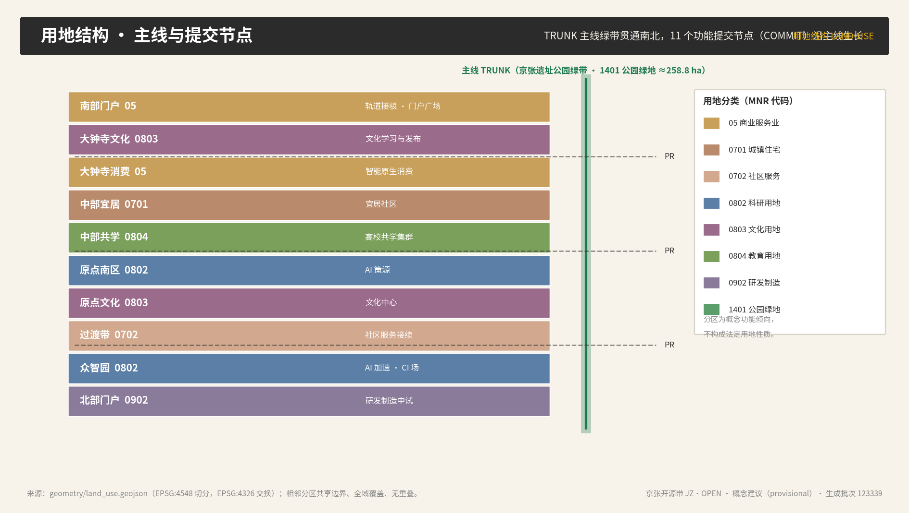
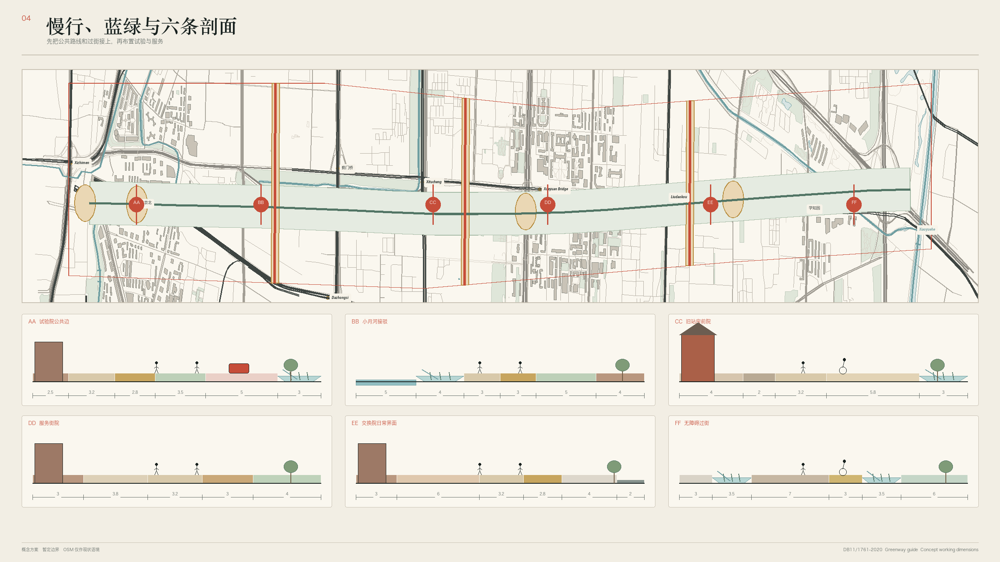
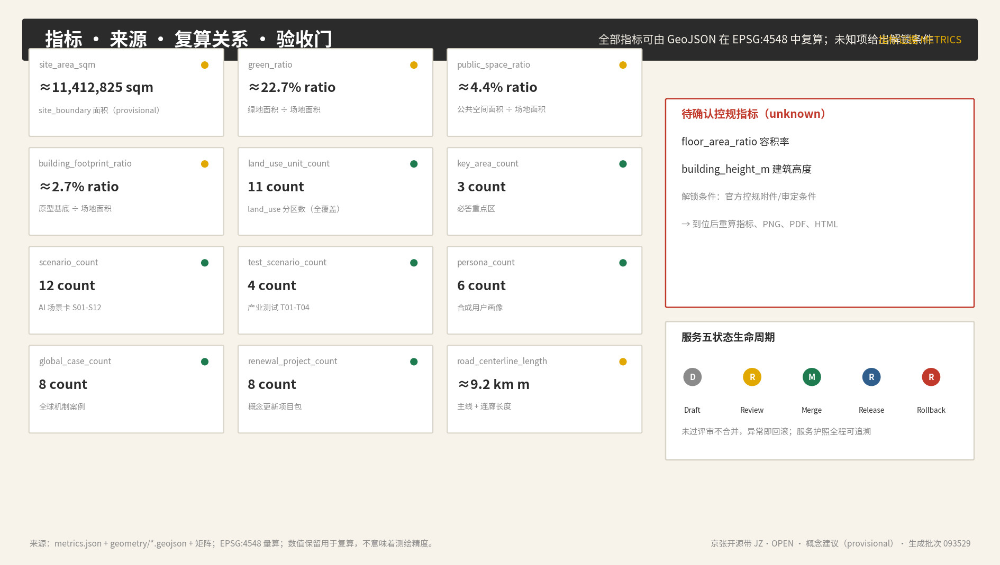

# JINGZHANG OPEN BELT（JZ·OPEN）

English Name: JINGZHANG OPEN BELT (JZ·OPEN)

Subtitle: From the Self-Reliant Railway to the Open-Source City

Core Declaration: **Cities, like open-source code, are open—every spatial decision can be submitted, reviewed, merged, and rolled back.**

This outcome is a Conceptual Recommendation, reference proposal, and material for professional teams to deepen their research; it does not replace formal planning and does not constitute a government approval conclusion. All areas and ratios based on provisional boundaries are merely recalculable working values; they must be recalculated in their entirety once the official polygons are in place. (Provisional Boundary)

## Design Basis and Source List

"The Jing-Zhang Open Source Belt" categorizes the evidence into four levels: official announcements and statutory standards answer "what are the tasks and responsibilities"; official historical, heritage, and construction public information answer "why is this railway worth continuing"; global case studies answer "what mechanisms are worth comparing"; and the provisional geometry answers "how to first run through the topology, graphics, and self-inspection." The four levels must not be mixed. The project name, 43.6 square kilometers of Coordinated Research Area, 11.4 square kilometers of Overall Design Area, 368.4 hectares of key areas, and the three district values come from the announcement [source:DATA-SRC-OFFICIAL-ANNOUNCEMENT-20260509]. Actual submitted polygons come from [source:DATA-SRC-PROVISIONAL-BOUNDARIES-20260605], both marked as `official_boundary=false`, `geometry_role=provisional_constraint`, and `boundary_precision=provisional_rough` in [data:geometry/site_boundary.geojson#SITE-001] and [data:geometry/key_areas.geojson#KEY-001].

Data governance follows the ten co-creation principles outlined in [source:DATA-SRC-AGENT-TASKBOOK-20260518], purpose classification follows the public Source Registry [source:SOURCE-REGISTRY], task scope lists and gap verification use the processed fact package [source:PROCESSED-FACT-PACK], EPSG:4326 exchange and EPSG:4548 measurement rules follow the site package [source:SITE-PACKAGE]. Land use, Public Space, and Urban Character respond to [standard:MOHURD-URBAN-DESIGN-MEASURES] and its sources [source:DATA-SRC-MOHURD-URBAN-DESIGN-MEASURES]; control detailed planning boundaries respond to [standard:MOHURD-CONTROL-DETAILED-PLANNING] and its sources [source:DATA-SRC-MOHURD-CONTROL-DETAILED-PLANNING]. Classify and respond to the terminological terms [standard:MNR-LAND-USE-CLASSIFICATION-GUIDE] and their sources [source:DATA-SRC-MNR-LAND-USE-CLASSIFICATION-202311]. Announcements and agent tasks are led by [standard:PROJECT-OFFICIAL-ANNOUNCEMENT] and [standard:PROJECT-AGENT-OPEN-CALL-TASKBOOK], respectively; [standard:MOHURD-ARCH-DESIGN-DEPTH-2016] remains due to data gaps in official documents, not claiming to meet the requirements. [depth:existing_conditions_diagnosis]

This package does not use commercial map screenshots, remote tiles, character portraits, or brand graphics. Geometry, metrics, matrices, and drawings are generated by local deterministic scripts; text and design candidates are assisted by AI, but the source selection, licensing, conceptual direction, and remote publication are decided by human users. Original text, illustrations, design layers,HTML With PDF Adopt CC-BY-4.0 Third-party materials retain their original rights and usage boundaries. [source:SITE-PACKAGE]

## Three-Level Scope Framework

Three levels of work are conveyed through a single "open protocol chain." The Coordinated Research Area (approximately 43.6 square kilometers) discusses innovative ecosystems, regional collaboration, and public value, without drawing new precise red lines; the Overall Design Area (approximately 11.4 square kilometers) forms a spatial syntax with "mainline TRUNK—commit node COMMIT—proposal corridor PR—test environment FORK—issue grid ISSUE." Three key areas validate different types of open and innovative mechanisms. The area levels are seen in [data:geometry/site_boundary.geojson#SITE-001], and the key area indexes are in [data:geometry/key_areas.geojson#KEY-001], [data:geometry/key_areas.geojson#KEY-002], and [data:geometry/key_areas.geojson#KEY-003]. [depth:three_level_scope_framework]

Main Line TRUNK Drawing on the concept of the main branch in open-source software: The Jing-Zhang Railway Heritage Park is the city's main branch, where all public innovation grows along the main line; "Submit node COMMIT Bind a city function to a district, a set of spatial interfaces, and an Evidence Chain; the Proposal Linkway (PR) is a corridor oriented east-west that facilitates walking, cycling, accessibility, and service continuity, allowing the adjacent communities, universities, and parks to 'submit proposals' to the main axis. "Test Environment FORK" allows robots, agents, or new forms of activity to sandbox test in a limited time, limited population, and limited space, and only merge after review; "Issue Grid ISSUE" treats resident feedback as a city problem tracker, making it public, trackable, closable, and reversible. The overall structure is not a technical coverage network but a set of urban rules prioritizing the rights of seniors, children, caregivers, disabled individuals, night workers, and ordinary residents. [depth:overall_spatial_structure]

Three key areas play different roles: the Zhongzhiyuan AI Independent Innovation Acceleration Area is the "Continuous Integration Field (CI)" and the open-source acceptance field; the Beijing AI Origin Community is the "core repository" and the open-source license zero point; the Dazhongsi AI Industry Agglomeration Area is the "release center" and the community participation hall. The wings provide elements and scenarios: the Zhongguancun Technology Services Wing is the "package management repository (Registry)", providing capital, IP, and global configuration; the Xiaoyue River Scenario Enablement Wing is the "staging environment (Staging)", providing real-world scenario testing. All locations are merely conceptual mappings of the Provisional Boundary, and cannot be used to infer ownership, demolition and construction, road red lines, or engineering feasibility. [source:DATA-SRC-AGENT-TASKBOOK-20260518]

## Coordinated Research Area: Industry and Future City Research

International comparisons only extract mechanisms, not forms. Helsinki 3D city model illustrates open data formats, versions, and public reuse as the foundation for urban intelligence [source:CASE-HELSINKI-3D]; Singapore Punggol Digital District (PDD) illustrates a tiered arrangement for research, testing, deployment, and operational feedback for physical AI [source:CASE-PUNGGOL-PDD]; London King's Cross demonstrates the need for long-term Public Space and mixed-use organization for the renewal of railway industrial heritage [source:CASE-KINGS-CROSS]; Barcelona Decidim illustrates the need for traceable records for proposals, discussions, decision-making, and feedback [source:CASE-BARCELONA-DECIDIM]; Amsterdam Algorithm Registry incorporates monitoring and decommissioning post-launch into responsibility [source:CASE-AMSTERDAM-ALGORITHM]; Paris 15-Minute City emphasizes accessibility of daily services and care performance [source:CASE-PARIS-15M]. Milton Keynes MK:Smart integrates technology experiments into the city's industrial and service strategic plans rather than as isolated showcases [source:CASE-MILTON-KEYNES]; Toronto Quayside serves as a negative governance lesson: data governance, public trust, and exit rights should precede technology scaling [source:CASE-TORONTO-QUAYSIDE].

According to this, a four-layer innovation ecosystem is formed: the first layer is the knowledge spout of universities, research institutions, and open-source communities (corresponding to the AI Origin community and the central education cluster [data:geometry/land_use.geojson#LU-005]); the second layer is shared infrastructure for computing power, data, evaluation, security, and standards (corresponding to Zhongzhiyuan [data:geometry/land_use.geojson#LU-009]); the third layer is scenarios proposed by enterprises, public sectors, and communities (corresponding to Dazhongsi [data:geometry/land_use.geojson#LU-003]); the fourth layer is mechanisms for appeals, audits, fault records, and decommissioning. The industrial value is not just counted in the number of enterprises or activities, but also observed in the reuse agreements, cross-operator interoperability, time to close issues, lack of AI alternative pathways, and handling of public objections. [depth:overall_spatial_structure]

The historical significance of the Jing-Zhang Railway, designed and constructed by Chinese engineers (commenced in 1905, operational in 1909, with Zhan Tianyou as chief engineer, featuring the "person" character zigzag alignment), supports a narrative of "verifiable, accountable, and open sharing," but cannot be reduced to a form of technological decoration [source:JINGZHANG-HISTORY-NRA]. The public planning and phased construction of the site park demonstrate that this line has already taken on roles in urban stitching and Public Space [source:JINGZHANG-PARK-BJGH]. The journey of Zhongguancun, from the 1988 "Electronic Street" to the National Independent Innovation Demonstration Zone, illustrates that "openness—experimentation—iteration—diffusion" is the original rhythm of innovation in Haidian [source:ZHONGGUANCUN-ZGC]. Future urban research views AI as a reversible public service capability rather than ubiquitous sensing infrastructure; the context of the Zhongguancun and AI Origin community is only used to identify the source and transformation relationship, without fabricating company lists, output values, or recruitment promises [source:DATA-SRC-OFFICIAL-ANNOUNCEMENT-20260509].

## Overall Design Area: Urban Renewal and Regulatory-Plan-Level Urban Design

The overall design divides the approximately 11.413 square kilometers of temporary polygon into 11 consecutive responsive units (10 functional belts + 1 main green belt), fully covering and not overlapping; this is merely a conceptual functional tendency derived from a deterministic cut from the same boundary and cannot replace the control detailed planning [standard:MOHURD-CONTROL-DETAILED-PLANNING]. The land use evidence is located at [data:geometry/land_use.geojson#LU-001] to [data:geometry/land_use.geojson#LU-010] and [data:geometry/land_use.geojson#LU-TRUNK], the building prototype is located at [data:geometry/buildings.geojson#BLDG-RD-1], the conceptual slow zone is located at [data:geometry/roads.geojson#ROAD-TRUNK], and pending constraints to fill data gaps are marked at [data:geometry/constraints.geojson#GAP-BOUNDARY]. [depth:land_use_layout]

Urban Renewal does not start with the conclusions of "teardown, modify, and preserve," but rather sets up three gates corresponding to the "review—merger" process. The first gate is the Evidence Gate: verifying ownership, age, structure, use, fire safety, cultural heritage protection, and control plan; the second gate is the Public Value Gate: comparing the carbon, accessibility, and service impacts of retaining and repairing, adaptive reuse, and new construction; the third gate is the Authorization Gate: decided by the responsible department, rights holder, professional team, and public process. The current buildings.geojson is merely a "prototype of a spatial interface for future professional deepening that can be replaced," and its total base work value cannot identify any existing buildings, let alone support demolition. [depth:retain_renovate_demolish] [depth:height_massing_character]

Each AI service uses a "Draft—Review—Merge—Release—Rollback" five-state lifecycle, congruent with the release process for open-source software. The service passport must specify the owner, purpose, data, retention, model/version, evaluation, human review, non-AI channel, appeal, release trigger, rollback trigger, incident, audit, and retirement. Services that do not pass the review do not enter the Public Space; when security, fairness, accessibility, or privacy anomalies are observed, they are either escalated to manual review or rolled back. This mechanism references [source:NIST-AI-RMF] and [source:UNESCO-AI-ETHICS], and is subject to [source:PIPL]. It is a governance recommendation, not an existing administrative process. [depth:development_intensity_controls]

## Detailed Design of Key Areas

**Zhongzhiyuan AI Independent Innovation Acceleration Area —— "Continuous Integration Field (CI)"**. Conceptual actions include: the Open Testbed (Open Testbed) for multi-operator robot meetups, standard and safety workshops, low-carbon computational power explanation nodes, and Qinghe cultural learning interfaces; the test side lines operate with time-slot closures, speed limits, manned supervision, and event recording; any equipment still requires traffic, safety, and operational permits before entering public roads. The detailed design of the area references [data:geometry/key_areas.geojson#KEY-001], and rough polygons should not be taken as the boundaries of the park or plots.

**Beijing AI Origin Community —— "Core Repository"**. Concept actions include: Protocol Zero as the release site for the city's open-source protocol v0.1.0, accessible service kiosks, an open-source achievements hall, a convertible space shared by caregivers and children, safe routes for nighttime travel, and non-digital service windows. Here, the priority is to test whether public AI truly reduces bureaucratic burdens rather than increasing login, authorization, and device barriers. Detailed design for the area references [data:geometry/key_areas.geojson#KEY-002], and site integration with building updates must wait for traffic, ownership, and current condition surveys.

**Dazhongsi AI Industry Cluster —— "Release Hub"**. Conceptual actions include: Release Plaza, Changelog Gallery, Youth Open Source Night School, Verifiable Heritage Learning, Fair Booking of Public Facilities, Festival Crowd Response, and Long-term Fault Archive Exhibition. Commercial, content, and smart terminal experiences are retained as general choices without tracking or personalization. The detailed design of the area references [data:geometry/key_areas.geojson#KEY-003]. [depth:three_key_area_detailed_design]

Three zones collectively set four types of sacred landmarks (see "Blue-Green Space, Public Space, and Urban Character"): 0.1.0 Milestone Square, Merge Bridge, Open Source Acceptance Field, and Changelog Corridor. Landmarks should gently touch the ground, be reversible, and not be attached to the original cultural relics. Prior to placement, professional opinions on cultural heritage and site conditions must be obtained [source:TSINGHUAYUAN-HERITAGE]. This "visible open process" is more effective in forming lasting recognizability than large screens or anthropomorphized robots.

## AI Innovation Ecosystem, Personas, and AI+ Scenarios

Six composite personas are used to challenge the design, not corresponding to real individuals: young developers and entrepreneurs focus on open-source collaboration, computational power, and data access; academic staff and researchers focus on co-learning spaces, real data, and evaluation benchmarks; elderly residents focus on shade, resting areas, artificial services, and emergency assistance; families with children and caregivers focus on visible boundaries, low-stimulation environments, and non-continuous tracking; people with disabilities focus on continuous accessibility and fallbacks in case of device failure; night-time maintenance and delivery workers focus on lighting, supplies, speed limits, and human-machine collaboration. The personas define needs but do not collect personal trajectories or infer identities [source:WCAG22].

Twelve scenario cards each include user, space, data, AI role, human fallback, and stopping conditions:

- S01 Mainline Tour: Provide accessible walking, cycling, and resting route indications along the Jing-Zhang mainline greenway, with fixed signage as a backup in case of equipment failure.
- S02 PR Proposal Booth: Residents submit improvement proposals to the city at public nodes. Proposals are public, trackable, and can be merged or closed.
- S03 ISSUE Maintenance: Public facility malfunctions are reported through the issue grid, with repair status made public and automatically escalated to manual intervention if overdue.
- S04 Sandbox Experience: Low-speed robots and autonomous deliveries operate on designated lanes, featuring manual remote parking, yielding, and accident recording.
- S05 Open Source Night School: An AI Co-Learning Space for Developers and Citizens, Combining Online and Offline Engagement and Maintaining a Device-Free Entry.
- S06 Smart Transfer: Services that connect public transit, active transportation, and shared mobility, prioritizing accessibility and lighting upon disembarking.
- S07 Urban Dashboard: Public data presented in a readable format, not tracking individuals, with aggregating metrics that are recalculable.
- S08 Privacy Sentinel: Set alerts at the boundary of facial recognition or sensing devices to inform about the purpose, retention, and exit options.
- S09 Heritage Explanation: Each historical explanation refers back to authoritative sources, and controversial content provides channels for manual corrections.
- S10 Green Operations: Publicly monitor data from the blue-green system, supporting public adoption and observation.
- S11 Emergency Rollback: Trigger a safe degradation to manual safety commands when severe rain, network disruption, or sensor failure occurs.
- S12 Honor Wall: Contributors and Open Outputs Displayed, Transparently Recording Who Did What and How It Was Verified.

Four industrial tests form an audit-ready module: T01 Multi-stakeholder Robot Interlock, validating yield, remote stop, and log mutual recognition (Zhongzhiyuan CI site); T02 Public AI Service Interoperability, validating service passports, minimal identity, and human fallback; T03 Extreme Weather Degradation, validating safe exit in case of network disruption, sensor failure, and conflicting authoritative warnings; T04 Accessibility and Fairness Challenges, inviting users with different abilities and languages to discover failures. Any test that fails to meet the preset threshold remains in the sandbox, not merged or released for demonstration purposes ahead of time. [depth:municipal_new_infrastructure]

## Land Use, Building Scale, and Retain-Renovate-Demolish Strategy

land_use.geojson was split using the same provisional SITE_BOUNDARY in EPSG:4548 and then exchanged to EPSG:4326, thus adjacent units share boundaries, fully covering the area, and with no overlaps. Classification uses the codes registered by the Ministry of Natural Resources, but only expresses conceptual functional tendencies [standard:MNR-LAND-USE-CLASSIFICATION-GUIDE] [source:DATA-SRC-MNR-LAND-USE-CLASSIFICATION-202311] [data:geometry/land_use.geojson#LU-001]. The current zoning work values are as follows (all are design zones within the Provisional Boundary, not constituting statutory land use types):

- 05 Commercial and Service Industry Land Use: Two zones, the Southern Portal (approximately 53.5 hectares) and Dazhongsi Intelligent Origin Consumption (approximately 33.7 hectares), totaling approximately 87.2 hectares; expressing a tendency towards track transfer, release, and consumption functions.
- 0701 Urban Residential Land: Approximately 176.9 hectares for a livable community in the middle; expressing a high-density livable living belt along both sides of the main axis.
- 0702 Urban Community Service Facilities Land Use: The transition area of Zhongzhiyuan South is approximately 77.7 hectares, expressing a functional tendency towards the continuity of community service and innovative complementation.
- 0802 Research and Development Land: Approximately 72.5 hectares of the original point community South Area and about 168.7 hectares of Zhongzhiyuan; expressing a functional tendency towards the source and acceleration of AI.
- 0803 Cultural Land Use: The cultural learning area at Dazhongsi is approximately 33.4 hectares, in addition to the original point community cultural center covering about 49.9 hectares; this area expresses a functional tendency towards narrating and disseminating cultural stories.
- 0804 Educational Land Use: Approximately 117.1 hectares for a shared learning cluster, expressing a functional inclination towards collegiate collaboration.
- 0902 Secondary Industrial Land Use: Approximately 98.9 hectares for the northern portal; expressing a functional inclination towards AI R&D manufacturing pilot testing.
- 1401 Public Space: The Jing-Zhang mainline green belt covers approximately 258.8 hectares [metric:green_space_area_sqm]; expressing the urban mainline's and public space's functional inclinations.

The building layers do not use fictional current conditions. The 9 prototypes in  express "what types of spatial interfaces may be needed": AI research and development, laboratories, incubators, cultural centers, education, community services, mixed-use, talent apartments with transit integration; total gross floor area [metric:building_footprint_area_sqm] [metric:building_footprint_ratio]. Each prototype is marked with `conceptual_only=true` and `geometry_role=design_proposal`, and does not correspond to specific buildings, ownership, or number of floors. [data:geometry/buildings.geojson#BLDG-RD-1]

The Demolish–Renovate–Retain Strategy uses the "evidence—public value—authorization" framework, not a single color-coded map to pre-determine fate. Preservation is prioritized by first verifying historical, community, and carbon values; renovation is prioritized by assessing structural safety, fire safety, accessibility, and adaptive reuse; and new construction is only discussed when there is a functional gap, and both professional conditions and statutory procedures are met. The Floor Area Ratio, total gross floor area, Building Height, and Building Coverage Ratio are all kept at unknown levels, with the reasons and unlocking conditions documented in the metrics and assumptions. [depth:development_intensity_controls] [depth:retain_renovate_demolish]

## Transport, Rail, Municipal Infrastructure, and Public Services

Traffic strategy is not about drawing new roads but prioritizing "continuity reliability" as the first criterion.  includes a conceptual main greenway (TRUNK) and three proposed corridors (PR-C1/PR-C2/PR-C3): the main line serves walking, cycling, heritage learning, and low-speed experimentation; the corridors connect the sites, communities, universities, and public services on both sides. All lines are clipped by the Provisional Boundary, with the line work value seen at [metric:road_centerline_length_m] [data:geometry/roads.geojson#ROAD-TRUNK], which does not represent the road right-of-way, bridge and tunnel schemes, or construction feasibility. [depth:traffic_rail_slow_parking]

For transit connections, the proposal first outlines the user journey: whether there are accessible paths, shaded resting points, manned services, and adequate nighttime lighting after disembarking; for robots, the proposal first determines yielding, speed limits, remote parking, and accident handling; for bicycles, the proposal first addresses gaps and safe parking solutions; for automobiles, the proposal only proposes a parking demand survey and shared evaluation, without specifying supply quantities. Key interfaces are marked as [data:geometry/constraints.geojson#GAP-ROAD] pending data, to be finalized before entering professional refinement, requiring road, station, and traffic specialty approvals.

Municipal and public services should adopt an "interface list" rather than capacity commitments: edge-side computational power requires energy, cooling, network, and maintenance responsibilities; shade, drinking water, toilets, and rest areas require facility baselines and operations and maintenance; flood diversion requires authoritative warnings, drainage, and containment; emergency services require clear human command. Without pipeline, fire protection, flood control, energy, or facility capacity, do not perform equipment quantity or load calculations. [data:geometry/constraints.geojson#GAP-MUNICIPAL] [depth:municipal_new_infrastructure]

## Blue-Green Network, Public Space, and Urban Character

The blue-green system prioritizes continuity, shade, rest, flood safety, and habitats over technical demonstrations.  consists of main green corridors, with a working area of approximately 258.8 hectares within the Provisional Boundary, representing about 22.7% of the area;  comprises three PR corridors and four square nodes, with a working area of approximately 50.2 hectares, representing about 4.4% of the area. [data:geometry/green_space.geojson#GREEN-TRUNK] [data:geometry/public_space.geojson#PUBLIC-PLAZA-ORIGIN] [metric:green_ratio] [metric:public_space_ratio]

These ratios are not official green space ratios or Public Space standards, but rather recalculated results of the current design geometry. The drawing depicts the provisional boundary with low-contrast dashed lines, places the main green corridor, corridor nodes, key areas, and safe connections in the foreground. The spatial components include movable shading, seating at various heights, accessible supply stations, human service windows, low-stimulation cues, offline wayfinding, robot remote stop points, and event notice boards; each component can continue to be used as ordinary urban furniture after the technical withdrawal. [depth:blue_green_public_space]

**Naming System and Visual Identity (agent.1)**. Main name "Jing-Zhang Open Belt," in English JINGZHANG OPEN BELT (JZ·OPEN); the naming system uses the verbs "submit—review—merge—publish—revert" to form a spatial naming family of "mainline TRUNK / submission node COMMIT / proposal corridor PR / test environment FORK / issue grid ISSUE / change log CHANGELOG," where any new node can be named according to this syntax. Logo direction: a "person" shape formed by the fork of tracks and code branches—honoring the "person" shape of the railway designed by Zhan Tianyou, while also expressing open-source merging; a tri-color signal light (red=revert/stop, yellow=review/pending merge, green=merge/allow) constitutes the status language. Color scheme: charcoal (tracks and responsibility), brick red (history and public action), signal green/yellow/red (open status), and off-white (reading background). Status is expressed simultaneously through shape, text, and line type, without relying on color. This naming and logo are conceptual directions and do not apply for trademarks, do not use unauthorized fonts, images, or personal likenesses. [standard:MOHURD-URBAN-DESIGN-MEASURES] [depth:height_massing_character]

**Four AI Holy Sites (agent.4)**. L01 0.1.0 Milestone Plaza (AI Origin Community): Commemorates the release of the city's open-source protocol v0.1.0, touchable and reversible ground; L02 Merge Bridge (at the intersection of the main line and PR corridor): ceremonial space for the "proposal—review—merge" process; L03 Open Testbed (Zhongzhiyuan): public experimental field for repeatable testing and evidence archiving; L04 Changelog Corridor (Dazhongsi): wall of milestone events such as the 1909 Jing-Zhang railway opening, the 1988 Zhongguancun Electronic Street, and the 2026 open-source belt release. The landmarks must undergo professional review of cultural heritage and site expertise, must not be attached to the original cultural heritage object, and must not publish unauthorized images or trademarks. [source:TSINGHUAYUAN-HERITAGE]

Urban Character is defined by "railway order + Beijing brick color + Zhongguancun open-source culture," integrating the century-old Jing-Zhang culture, Zhongguancun innovation culture, and AI new culture: charcoal black expresses tracks and responsibility, brick red expresses history and public action, and signal colors express an open state. The old Qing Yuan railway station site and related nodes must gently touch, be reversible, and undergo professional review by cultural heritage experts; historical narratives should reference the National Railway Administration's historical records [source:JINGZHANG-HISTORY-NRA], without reproducing unauthorized images. [standard:MOHURD-URBAN-DESIGN-MEASURES] [depth:height_massing_character]

## Renewal Projects, Implementation Policy, and Phasing

phasing.geojson Divide the temporary area into four recalculable phases, but the phases are not definitive for development timing [data:geometry/phasing.geojson#PHASE-01]. Phase one, "Agreement and Consensus" (v0.x, 2026-2027), establishes boundary replacements, facility surveys, service passports, and a public issue database; phase two, "Sandbox Testing" (v1.0, 2027-2028), conducts interoperability, accessibility, and extreme weather testing in controlled spaces; phase three, "Conditional Release" (v2.0, 2028-2030), requires the presence of responsible parties, data legitimacy, evaluations, human takeovers, and insurance; phase four, "Observation and Evolution" (v3.0+, long-term), publishes event records, appeals, repairs, and exit records. [depth:phasing_implementation]

Eight update project packages are Conceptual Recommendations: P01 Urban Open Source Protocol v0.1.0 (institutional infrastructure); P02 Jing-Zhang Mainline Greenway Corridor (TRUNK); P03 PR Corridor System (east-west stitching); P04 Open Source Acceptance Field (Zhongzhiyuan CI); P05 Origin Community Core Repository (AI Origin Community); P06 Release Plaza and Changelog Gallery (Dazhongsi); P07 Service Passport and Rollback Mechanism (governance); P08 Jing-Zhang OPEN Seasonal Operations (activity system). Projects will first meet the requirements for documentation, ownership, expertise, and public process, before discussing investment or construction. [metric:renewal_project_count] [depth:renewal_project_list]

Long-term operation is referred to as "Jing-Zhang OPEN Seasons" (agent.6): Spring Open Call releases annual testable issues and data gaps; Summer Bug Bash and accessibility challenges; Autumn Release Day for the annual version release and review; Winter Retrospective for public failure archives, repair results, and the next year's roadmap. The operational organization is composed of public sector, community, professional institutions, higher education institutions, enterprises, and independent evaluators. No single platform shall hold the final authority over rules, data, evaluation, and appeals. Activities, branding, funding, and venues require subsequent confirmation by the responsible party, and are not currently considered as fixed arrangements. [source:CASE-BARCELONA-DECIDIM] [source:CASE-AMSTERDAM-ALGORITHM]

## Metrics, Area Recalculation, and Compliance Matrix

All geometries are exchanged in GeoJSON in EPSG:4326, and measured in EPSG:4548. The current site_area_sqm working value [metric:site_area_sqm] is approximately 11,412,603 square meters, sourced from a temporary boundary; land_use partition area recalculated [metric:land_use_partition_area_sqm] and phasing area [metric:phasing_area_sqm] are consistent with the site; the green_ratio [metric:green_ratio] is approximately 0.2267, and the public_space_ratio [metric:public_space_ratio] is approximately 0.0440, both calculated by dividing the union area by the site area. These numbers are retained for recalculation and error detection, and do not imply that the boundary has reached surveying accuracy. [metric:green_space_area_sqm] [metric:public_space_area_sqm] [depth:metrics_recalculation]

The machine metrics index is as follows; each known value provides the unit, formula, source file, confidence level, and assumptions, while unknown values provide the reason and the formal data trigger conditions:

- [metric:site_area_sqm]: approximately 11,412,603 sqm; area(submitted_site_boundary) in EPSG:4548; confidence medium.
- [metric:land_use_partition_area_sqm]: consistent with site_area; sum(area(land_use_features)); confidence medium.
- [metric:building_footprint_area_sqm]: approximately 121,000 sqm; sum(area(concept_building_footprints)); confidence medium.
- [metric:building_footprint_ratio]: approximately 0.0106; building_footprint_area_sqm / site_area_sqm; confidence medium.
- [metric:green_space_area_sqm]: approximately 2,588,000 sqm; area(union(green_space)); confidence medium.
- [metric:green_ratio]: approximately 0.2267; green_space_area_sqm / site_area_sqm; confidence medium.
- [metric:public_space_area_sqm]: approximately 502,000 sqm; area(union(public_space)); confidence medium.
- [metric:public_space_ratio]: approximately 0.0440; public_space_area_sqm / site_area_sqm; confidence medium.
- [metric:road_centerline_length_m]: approximately 12,820 m; sum(length(concept_road_centerlines)); confidence medium.
- [metric:phasing_area_sqm]: consistent with site_area; area(union(phasing)); confidence medium.
- [metric:key_area_count]: 3 count; count(required_key_areas); confidence high.
- [metric:land_use_unit_count]: 11 units; count(land_use_features); confidence high.
- [metric:renewal_project_count]: 8 counts; count(unique conceptual project_ids); confidence high.
- [metric:scenario_count]: 12 count; count(S01..S12 scenario cards); confidence high.
- [metric:test_scenario_count]: 4 count; count(T01..T04 test scenarios); confidence high.
- [metric:persona_count]: 6 counts; count(synthetic personas); confidence high.
- [metric:global_case_count]: 8 counts; count (formal positive international cases); confidence high.

compliance_matrix.json covers announcement 1.3/1.4/1.5, all items, and six tasks (agent.1–agent.6); standard_matrix.json covers five mandatory standards and retains one non-mandatory data gap; design_depth_matrix.json covers fifteen formal depths. Each row of the matrix returns to the main text, GeoJSON, indicators, drawings, sources, assumptions, and self-check, rather than using "complete" as self-verification. The A3 document and A0 poster are layers of explanation, with structured data remaining the authoritative recalculation. [standard:PROJECT-OFFICIAL-ANNOUNCEMENT] [depth:risk_missing_data]

Machine-readable layer total index: [data:geometry/site_boundary.geojson#SITE-001], [data:geometry/key_areas.geojson#KEY-001], [data:geometry/land_use.geojson#LU-001], [data:geometry/buildings.geojson#BLDG-RD-1], [data:geometry/roads.geojson#ROAD-TRUNK], [data:geometry/green_space.geojson#GREEN-TRUNK], [data:geometry/public_space.geojson#PUBLIC-PLAZA-ORIGIN], [data:geometry/constraints.geojson#GAP-BOUNDARY], [data:geometry/phasing.geojson#PHASE-01]. This index ensures that all nine files are accessible from the main text.

## Risk, Copyright, and Compliance

The highest risk is not that the model is "not smart enough," but that responsibility, boundaries, and exit strategies are invisible. Spatial risks include the absence of official polygons, roads, parcels, existing buildings, cultural heritage sites, and the baseline of municipal and facility data; AI risks include goal drift, over-collection, differential errors, vendor lock-in, inability to appeal, and the retention of data even after exit. Corresponding controls are to fail closed: mark unknown or provisional when data is insufficient, halt testing in the sandbox if it does not meet the threshold, and revert to manual intervention or rollback if there are operational anomalies. [data:geometry/constraints.geojson#GAP-BOUNDARY] [depth:risk_missing_data]

Privacy controls follow the principles of minimum necessity, specific purpose, shortest retention, tiered access, and revocability [source:PIPL]. Explicitly prohibit facial recognition for full-domain identification, social scoring, continuous tracking of children, commercial guidance based on vulnerable characteristics, and models making high-impact public decisions alone. Public metrics use only aggregated or deterministic geometry; individual information must be obtained by a future responsible party for legality, sensitivity, automated decision-making, and security assessments. This plan is not legal advice and does not declare any specific system to be compliant.

AI output boundaries referenced [source:NIST-AI-RMF] and [source:UNESCO-AI-ETHICS]: models can propose candidates, explain, and check leads; schemas, geometry, metrics, hashes, and rejection conditions are executed by deterministic code; professionals confirm planning, engineering, conservation, and safety; the public retains non-AI channels, appeals, and corrections; and maintainers retain the judgment for release and real-world adoption. The Toronto experience reminds us to prioritize trust and exit strategies over expansion [source:CASE-TORONTO-QUAYSIDE]. [depth:development_intensity_controls]

Original text, visual graphics, agent design layers, HTML, and PDF are licensed under CC-BY-4.0. The provisional geometry repository is not re-licensed under this submission; external webpages, laws, standards, and case studies retain their respective rights; this package does not embed their photos, map screenshots, trademarks, or remote assets. Copyright details are found in report/copyright_statement.md. All spatial actions are presented as "Conceptual Recommendation," "Reference Scheme," or "for further study by professional teams," and do not constitute legal planning, approval, engineering, ownership, investment, or government commitment. [source:SITE-PACKAGE] [source:WCAG22]

## References

The following list describes how to use the items by their source role, not by the number of links as a measure of research quality. Official tasks and laws carry authoritative facts, international cases carry mechanisms for comparison, and warehouse data carry the generation and self-inspection; no source can exceed the limitations recorded by it. Complete.URL Access dates, permit summaries, and prohibited uses are listed in sources.json.

- [source:DATA-SRC-OFFICIAL-ANNOUNCEMENT-20260509] Qualification Pre-Review Announcement for International Urban Design Proposals for the Centennial Jing-Zhang AI Innovation Belt, Issuer: Haidian Branch of Beijing Municipal Commission of Planning and Natural Resources. Purpose: To confirm the project name, approximate value of the three-level scope, approximate value of the three key areas, and design tasks. Limitations: No official polygon, control plan indicators, engineering line positions, or government implementation commitments will be provided.
- [source:DATA-SRC-AGENT-TASKBOOK-20260518] Extract from the Open Call for Urban Design of the Centennial Jing-Zhang AI Innovation Belt, issued by the User-Provided Clear Rights Task Book/Repository Maintainer. Purpose: To confirm ten co-creation principles, three positioning statements, five functional areas, and six tasks and boundary conditions for smart agents. Limitations: This is not an Official Planning Boundary, legal plan, engineering feasibility, or government decision-making basis. (Centennial Jing-Zhang AI Innovation Belt Open Call for Urban Design)
- [source:SITE-PACKAGE] Centennial Jing-Zhang AI Innovation Belt machine-readable site package, published by the open-city-ai/haidian repository maintainer. Purpose: to read provisional boundaries, enumerations, indicators, schema, planning restrictions, and standard lists. Limitations: provisional data do not constitute official authority. (Provisional Boundary)
- [source:SOURCE-REGISTRY] Public Source Registry, publisher: Repository Maintainer. Purpose: To distinguish between formal-ready, background, and provisional-only sources. Limitations: The registry itself does not add new facts.
- [source:PROCESSED-FACT-PACK] Process the fact pack (task list, scope, source purpose matrix, gap list), posted by: Repository Maintainer. Purpose: Navigation and task verification. Limitations: Original sources remain authoritative.
- [source:DATA-SRC-PROVISIONAL-BOUNDARIES-20260605] provisional boundaries GeoJSON, publisher: repository maintainer. Purpose: for temporary generation, visualization, and self-inspection. Limitations: provisional_rough, not to be used as official redline or for accurate area calculations.
- [source:DATA-SRC-MOHURD-URBAN-DESIGN-MEASURES] Urban Design Management Measures, Publisher: Ministry of Housing and Urban-Rural Development. Purpose: Urban Design Principles.
- [source:DATA-SRC-MOHURD-CONTROL-DETAILED-PLANNING] Guidelines for the Preparation and Approval of Control Detailed Planning, Issued by the Ministry of Housing and Urban-Rural Development. Purpose: To serve as the framework reference for control detailed planning.
- [source:DATA-SRC-MNR-LAND-USE-CLASSIFICATION-202311] Land and Sea Use Classification Guide, Publisher: Ministry of Natural Resources. Purpose: Terminology for land use classification.
- [source:JINGZHANG-HISTORY-NRA] _df Jing-Zhang Railway Historical Public Resources, published by: National Railway Administration/China Railway Public Historical Records. Purpose: To confirm the historical facts of autonomous design and construction from 1905-1909, including Zhan Tianyou and the "person" shaped alignment. Limitations: For historical narrative use only, no images shall be reproduced.
- [source:JINGZHANG-PARK-BJGH] Jing-Zhang Railway Heritage Park public planning information, published by the Beijing Municipal Commission of Planning and Natural Resources and other public channels. Purpose: To confirm that the heritage park assumes the role of urban stitching and Public Space. Limitations: This information is public and does not substitute for formal design documents.
- [source:ZHONGGUANCUN-ZGC] The Zhongguancun Science Park has publicly shared its development history documents, posted by the Zhongguancun Science Park Management Committee/Bureau of Beijing Municipal Government through their official channels. Purpose: To confirm the journey from the 1988 Electronic Street to the National Independent Innovation Demonstration Zone. Limitation: Only for background narrative. (Background Only)
- [source:CASE-HELSINKI-3D] Helsinki 3D city model. Public data. Purpose: Comparative analysis of open city data mechanisms.
- [source:CASE-PUNGGOL-PDD] The Singapore Punggol Digital District (Public Resources)JTC). Purpose: Comparative analysis of physical AI grading mechanisms.
- [source:CASE-KINGS-CROSS] London King's Cross Update Public Documentation. Purpose: Comparative Analysis of Long-term Update Mechanisms for Railway and Industrial Heritage.
- [source:CASE-BARCELONA-DECIDIM] Barcelona Decidim participatory platform. Purpose: Comparison of participatory governance and traceability record mechanisms.
- [source:CASE-AMSTERDAM-ALGORITHM] Amsterdam Algorithm Register. Purpose: To compare transparency and retirement mechanisms.
- [source:CASE-PARIS-15M] Paris 15-minute city [public resources]. Purpose: comparison with daily reach and care performance metrics.
- [source:CASE-MILTON-KEYNES] Milton Keynes MK:Smart. Purpose: Comparison of Data Infrastructure and Industrial Strategy Integration Mechanisms.
- [source:CASE-TORONTO-QUAYSIDE] Toronto Quayside Open Governance Research Material. Purpose: Negative Case—Data Governance, Trust, and Right to Exit Prior to Expansion.
- [source:NIST-AI-RMF] NIST AI Risk Management Framework (AI RMF 1.0). Purpose: Refer to the AI Risk Management Framework for guidance.
- [source:UNESCO-AI-ETHICS] UNESCO Recommendation on the Ethics of AI. Purpose: AI Ethics Guidelines.
- [source:PIPL] The Personal Information Protection Law of the People's Republic of China. Purpose: Privacy and boundaries for the processing of personal information.
- [source:WCAG22] WCAG 2.2 Accessibility Guidelines. Purpose: Accessible requirements for public interfaces.
- [source:TSINGHUAYUAN-HERITAGE] Historical Information on the Tsinghua Yuan Railway Station and Other Cultural Heritage Sites. Purpose: Light Touch Design Constraints for Cultural Heritage Nodes.
