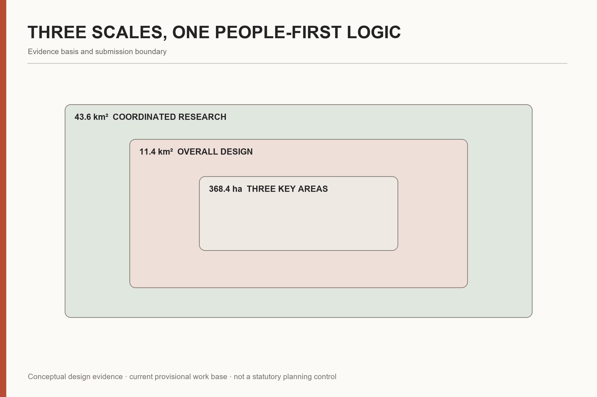
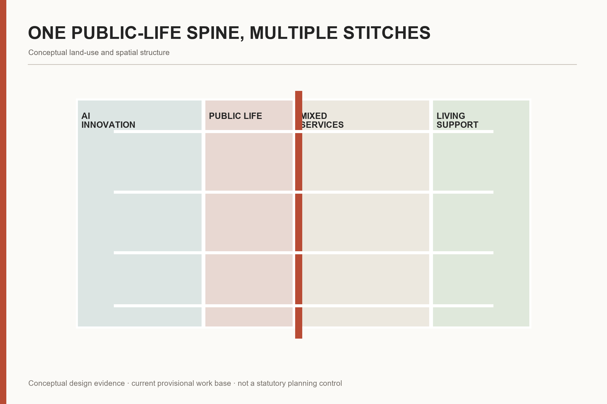
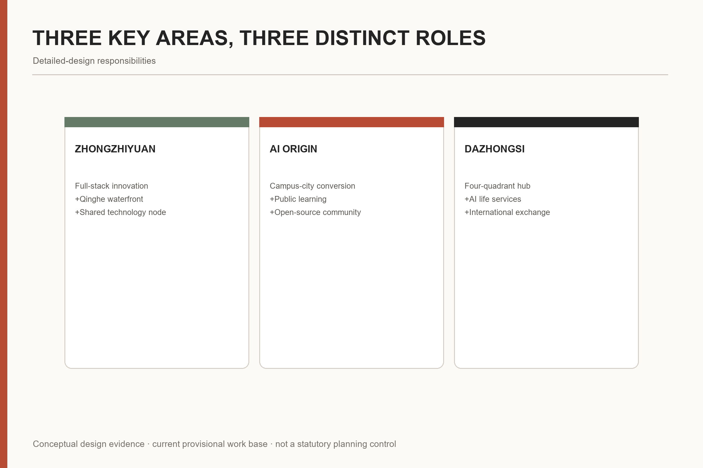
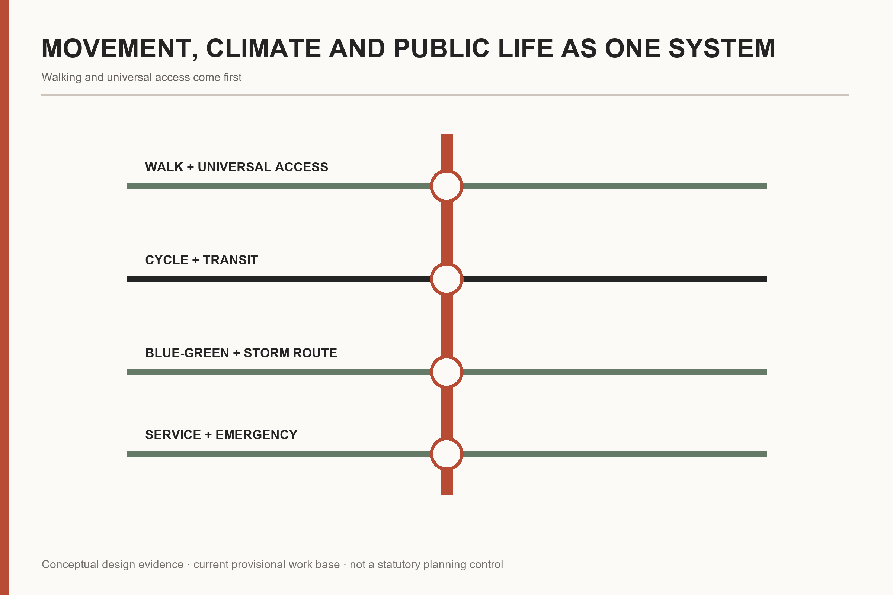
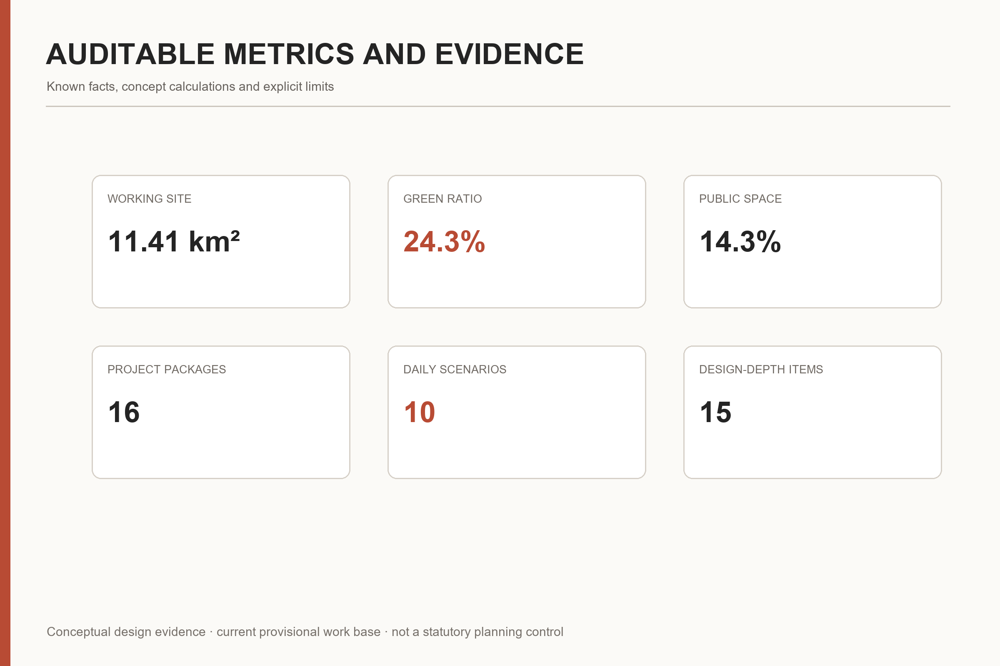

# JING-ZHANG FOR PEOPLE

City for people. AI for use.

The proposal starts from a simple judgement: innovation resources are highly concentrated, yet everyday life deserves more attention. “People” means everyone—residents, researchers, entrepreneurs, students, workers, children, older people, disabled people and visitors. The historic railway becomes a shared public-life spine, while AI remains an assistive layer with human review and non-digital alternatives.

## Design Basis and Source List

The proposal follows the official announcement, the AI-agent taskbook, the registered source inventory and the professional standards stored in the site package. The current site and key-area polygons are explicitly provisional constraints. They are used as the frozen working base for this submission, but never presented as statutory boundaries, approval evidence or exact official controls. [source:OFFICIAL-ANNOUNCEMENT] [source:AGENT-TASKBOOK] [depth:existing_conditions_diagnosis]

Every planning claim is connected to a source, a geometry layer, a metric or a review matrix. The human-readable report explains the design; GeoJSON, metrics and matrices retain the auditable evidence chain. [source:SOURCE-REGISTRY] [standard:PROJECT-OFFICIAL-ANNOUNCEMENT]

## Three-Level Scope Framework

The 43.6 km² coordinated research area addresses the regional AI ecosystem and future-city strategy; the 11.4 km² overall design area organises urban renewal, land use, transport, infrastructure and character; the three key areas, approximately 368.4 ha in total, test detailed spatial and implementation responses. [data:geometry/site_boundary.geojson#SITE-001] [data:geometry/key_areas.geojson#PROV-KEY-001] [metric:key_area_count]

These three scales are one reasoning chain: regional capability informs the corridor strategy; the corridor strategy structures renewal projects; the three key areas test whether the strategy can support real people, real journeys and accountable operations. [depth:three_level_scope_framework] [depth:overall_spatial_structure]

## Coordinated Research Area: Industry and Future City Research

The AI ecosystem is organised as a reversible sequence: public question, original research, open-source collaboration, controlled testing, engineering transfer and public feedback. Universities, research institutes, enterprises, computing, data, finance, talent and urban scenarios are supporting conditions rather than isolated招商 lists. [source:AGENT-TASKBOOK] [standard:PROJECT-AGENT-OPEN-CALL-TASKBOOK]

Six international cases are used as mechanisms, not images to copy: Mila/Mile-Ex, Paris-Saclay DataIA, Punggol Digital District, Seoul Yangjae AI Hub and Helsinki’s AI Register provide positive lessons; Toronto Quayside is retained as a governance warning. Transfer rules emphasise open contribution, licensing, accountable testing, public value and exit mechanisms. [metric:international_case_count]

Regional coordination is described through two-way flows of people, knowledge and scenarios. AI Origin supports learning and early conversion; Zhongzhiyuan supports open contribution, standards and controlled validation; Dazhongsi supports public service, urban experience and international exchange. These are conceptual interfaces, not confirmed intergovernmental agreements.

## Overall Design Area: Urban Renewal and Regulatory-Plan-Level Urban Design

“One public-life spine, multiple east-west stitches and three key-area interfaces” is the core structure. The former dividing railway becomes a continuous everyday corridor. Cross-links reconnect communities, campuses, parks, stations and workplaces, with walking, cycling and universal access taking priority. [data:geometry/roads.geojson#ROAD-001] [data:geometry/public_space.geojson#PUBLIC-001] [depth:overall_spatial_structure]

The concept-design land-use layer covers the full provisional submission boundary and coordinates AI innovation, public service, living support and blue-green systems. Its classifications and calculated values are design evidence, not statutory zoning. [data:geometry/land_use.geojson#LU-001] [metric:site_area_sqm] [standard:MNR-LAND-USE-CLASSIFICATION-GUIDE]

Urban renewal follows three rules: retain what carries memory and daily value; adapt structures that can support new shared uses; test infill only where public access, climate performance and service capacity improve. Final parcel-level decisions remain subject to professional survey and approval.

## Detailed Design of Key Areas

Zhongzhiyuan AI Autonomous Innovation Acceleration Area is proposed as a garden-based full-stack innovation district. The Qinghe waterfront, shared technical courtyards, open testing, standards governance and low-carbon exchange spaces form its public structure.

Beijing AI Origin Community is proposed as a campus-adjacent conversion and talent community. Shared ground floors, public learning, open-source collaboration, heritage reuse, daily services and station connections make innovation visible and usable beyond institutional boundaries.

Dazhongsi AI Industry Cluster is proposed as an urban intelligent-economy and international-exchange district. A four-quadrant station interface, mixed public services, green-space reuse and street-level commercial activity support both workers and surrounding communities. [data:geometry/key_areas.geojson#PROV-KEY-001] [data:geometry/key_areas.geojson#PROV-KEY-002] [data:geometry/key_areas.geojson#PROV-KEY-003]

## AI Innovation Ecosystem, Personas, and AI+ Scenarios

Eight stress-test user groups are used: residents, researchers, entrepreneurs, students, service workers, children and carers, older people, and disabled people or visitors. Their continuous day—from arrival and work to care, rest and return home—tests whether innovation actually improves life. [metric:persona_count]

Ten everyday scenario cards cover safe school travel, accessible healthcare, late-night return, cool walking, bookable shared ground floors, heritage community rooms, resident-defined urban questions, auditable testing, legible cultural interpretation and storm-resilient routes. Three additional industry tests address model and computing safety, open-agent collaboration, and accessible public-service terminals. [metric:daily_ai_scenario_card_count] [metric:industry_test_scenario_count]

Every AI scenario declares purpose, operator, data minimum, human reviewer, refusal option, stopping condition and non-digital alternative. AI may assist; it may not replace planning approval, human accountability or equal access.

## Land Use, Building Scale, and Retain-Renovate-Demolish Strategy

The submission provides a complete conceptual land-use geometry for machine review and a building-node layer for three public-contribution locations. Existing buildings are not assigned final retain/renovate/demolish outcomes without survey, ownership, heritage, structure and fire-safety evidence. [data:geometry/land_use.geojson#LU-001] [data:geometry/buildings.geojson#BLDG-001] [depth:retain_renovate_demolish]

Capacity, height and mixed-use ratios are scenario tests. They guide comparison of public benefit, housing and service capacity, but are not stated as approved FAR, statutory height or investment commitment. [metric:building_footprint_area_sqm] [depth:height_massing_character]

## Transport, Rail, Municipal Infrastructure, and Public Services

The mobility framework prioritises walking and universal access, cycling, public transport and then private vehicles. It targets station integration, cross-rail connections, North Fifth Ring crossings, school and workplace journeys, bicycle parking, emergency access and late-night safety. [data:geometry/roads.geojson#ROAD-001] [depth:traffic_rail_slow_parking]

Municipal and AI infrastructure are treated together: drainage, energy, communications, edge computing, maintenance and emergency operation must retain manual fallback and safe offline performance. Detailed pipelines and engineering alignments are outside this conceptual submission. [depth:municipal_new_infrastructure]

## Blue-Green Network, Public Space, and Urban Character

The blue-green strategy is evaluated through bodily experience: continuous shade, rest and drinking water; safe routes during heat and storms; accessible river and park interfaces; and reduced disturbance near homes. The green corridor and public-life spine are spatially auditable design layers. [data:geometry/green_space.geojson#GREEN-001] [data:geometry/public_space.geojson#PUBLIC-001] [metric:green_ratio]

Urban character combines Jing-Zhang railway heritage, Zhongguancun innovation culture and everyday community life. Heritage is sustained through use—learning, childcare, small shops, workshops and public discussion—rather than isolated as a technological spectacle. [standard:MOHURD-URBAN-DESIGN-MEASURES] [depth:blue_green_public_space]

## Renewal Projects, Implementation Policy, and Phasing

Sixteen concept project packages organise delivery: the railway heritage park, cross-corridor stitches, shared technical and learning nodes, station interfaces, public-service components, climate-resilient routes, cultural interpretation and long-term operations. They are mapped to near-, medium- and long-term conceptual phases. [data:geometry/phasing.geojson#PHASE-001] [metric:concept_project_package_count]

Implementation uses reversible pilots, public-benefit agreements, transparent operating responsibilities and stage gates. A project advances only when access, safety, data governance, maintenance and community feedback are demonstrably ready. [depth:renewal_project_list] [depth:phasing_implementation]

## Metrics, Area Recalculation, and Compliance Matrix

The metric system separates official approximate task areas, geometry-derived concept values and values that remain outside the available evidence. The current provisional geometry is frozen as the working submission base, so its calculated site, green, public-space and building values are reproducible but not statutory. [metric:site_area_sqm] [metric:green_ratio] [metric:public_space_ratio]

The compliance matrix covers 17 announcement requirements plus agent.1–agent.6. The standards matrix covers mandatory planning references; the depth matrix records 15 completed formal design-depth items with explicit limitations. [metric:compliance_requirement_count] [metric:design_depth_item_count]

## Risk, Copyright, and Compliance

Primary risks are boundary precision, unavailable statutory controls, data and model misuse, accessibility failure, heritage misinterpretation, operational discontinuity and unclear media rights. Each risk has a disclosure, reviewer and fallback. [source:SOURCE-REGISTRY] [depth:risk_missing_data_inventory]

All spatial moves are conceptual suggestions for professional teams to deepen. No statement in this package is an approved plan, government commitment, parcel-level demolition decision, engineering alignment or procurement promise. Generated renderings communicate intent; GeoJSON, metrics and matrices remain the audit layer.

## References

Key references include the official announcement, the AI-agent open-call taskbook, the site package, registered public sources, the Urban Design Management Measures, land-use classification guidance and planning documentation standards. Complete records, retrieval dates, use limitations and licenses are stored in `sources.json`, `standard_matrix.json` and `report/copyright_statement.md`. [source:OFFICIAL-ANNOUNCEMENT] [source:AGENT-TASKBOOK] [standard:PROJECT-OFFICIAL-ANNOUNCEMENT]
