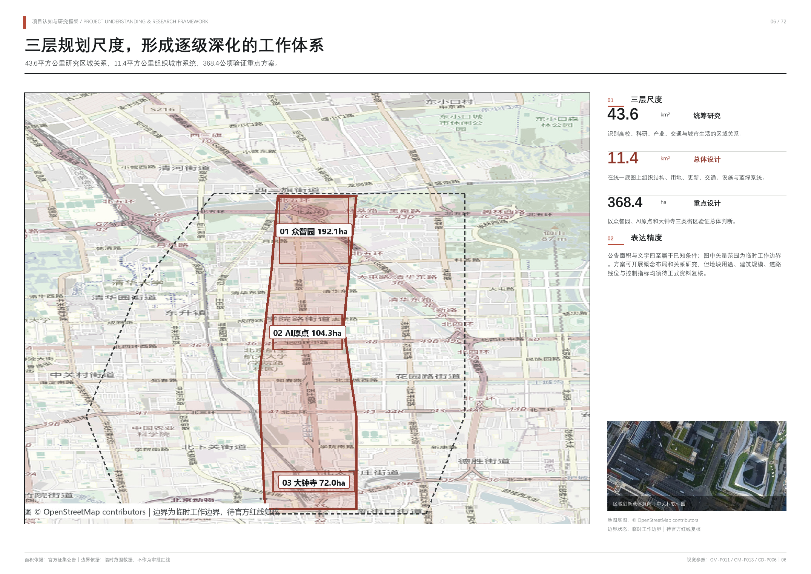
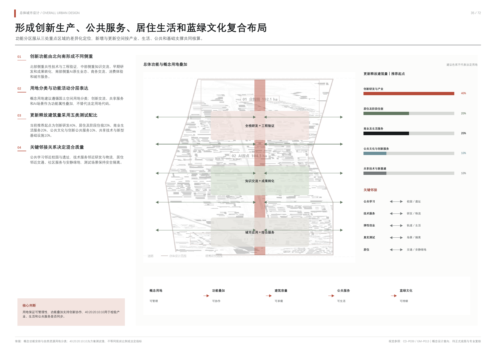
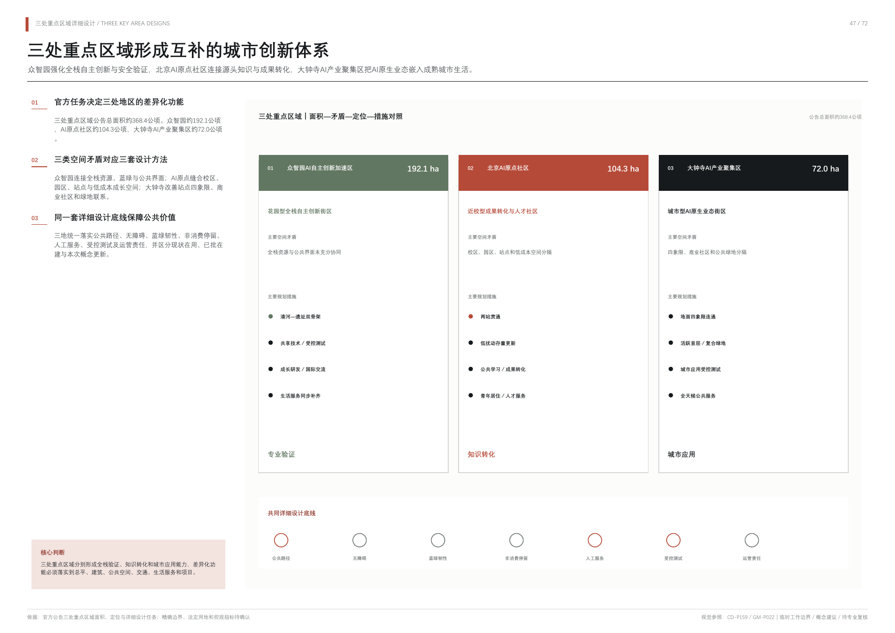
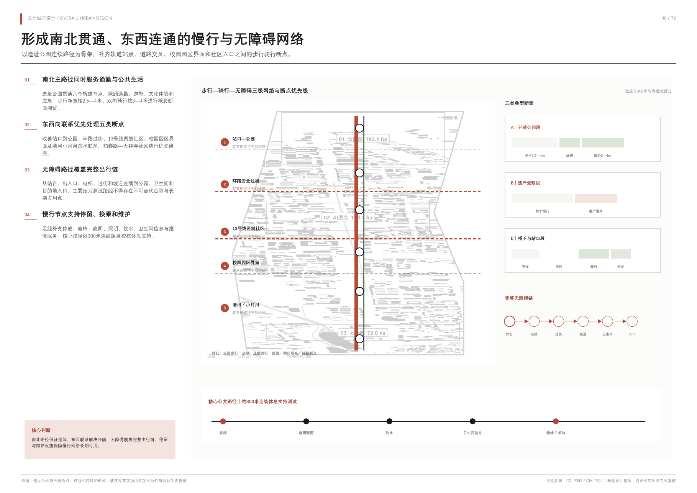
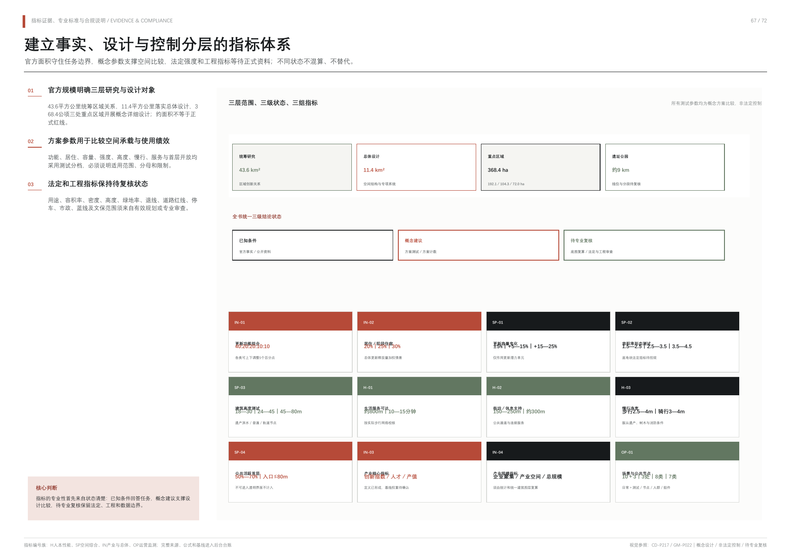

# 人间京张 / JING-ZHANG FOR PEOPLE

城市为人，AI为用。

“人间京张”首先回答的不是城市怎样显得更智能，而是所有人怎样生活得更好。这里的“人”包括原有居民、科研人员、创业者、学生、劳动者、儿童、老人、残障人士和来访者。方案以他们从到达、工作、学习、照护、交往、休息到回家的连续一天组织空间，使科学世界进入生活世界，也让京张百年的精神世界继续生长。

方案只保留一个品牌和一句价值宣言，不再叠加传播口号。年度活动、开发者社区、场景开放和国际传播均统一归入“人间京张”，不设置第二主品牌；具体活动只使用描述性的年度项目名和统一传播模板。Logo 只采用“轨道与人的路径交汇”这一母题：纵向京张轨道与横向日常路径连续相交，在负形或转折中隐约形成“人”，不叠加大脑、芯片、机器人等科技图标。标识首先表达人与人的连接、铁路遗产和日常通达，AI 只通过系统能力和使用场景被感知。三个内部工作原则不作为新命题对外竞争：以“使用即保护”处理遗产，以“先使用、再定型”推进更新，以人的生活感受检验AI、生态和空间绩效。

## 设计依据与资料清单

本 formal 方案以北京市规划和自然资源委员会海淀分局发布的《百年京张AI创新带城市设计国际方案征集资格预审公告》为第一依据，并以 `brief/site-package/` 中经维护者登记的临时粗略边界、重点区域、枚举、指标和来源清单为机器可读依据。AI agent 在生成方案前必须读取 `design_brief.json`、`allowed_design_space.json`、`sources.json`、`enums/`、`ranges/`、`schemas/`、`data/source_registry.json` 和 `data/processed/agent_fact_pack.md`，并用 `project_scope_summary.csv`、`agent_task_requirements.csv`、`source_use_matrix.csv`、`missing_data_checklist.csv` 建立任务、范围、资料用途和缺口清单。所有设计判断都要拆分为可追溯来源、可复算指标、可校验图层和可人工复核假设。公告要求方案达到控制性详细规划的城市设计深度和规划综合实施方案的城市设计深度，因此文本叙述不能替代 GeoJSON、指标表、A3 文册、A0 展板和 HTML 电子展示成果。

方案不是独立愿景文本，而是从公告、面向智能体任务书和场地资料出发组织成果；本节只把最关键依据放在判断旁边 [source:OFFICIAL-ANNOUNCEMENT] [source:AGENT-TASKBOOK] [depth:existing_conditions_diagnosis]。完整来源和标准覆盖分别保存在 `sources.json`、`standard_matrix.json` 与 `design_depth_matrix.json`，不在正文重复机器索引。

资料登记表的使用边界如下 [source:SOURCE-REGISTRY]：

- data/source_registry.json 登记公开、清权与临时资料的用途边界。
- 当前登记摘要：formal 可用资料 5 条，背景资料 0 条，provisional-only 资料 1 条。
- agent 不得把 background_only 或 provisional_only 资料升级为 official boundary、法定控规、正式评分依据或政府实施承诺。

`data/processed/agent_fact_pack.md` 是本方案的阅读导航层，不是新的权威来源 [source:PROCESSED-FACT-PACK]。它帮助 agent 把三层范围、三处重点区、公告任务、agent.1-agent.6、资料可用性和缺资料事项组织成可读方案；事实判断仍需回到已登记的原始材料 [source:OFFICIAL-ANNOUNCEMENT] [source:AGENT-TASKBOOK]，完整来源关系由 `sources.json` 保存。

本方案在官方 `SITE_BOUNDARY` 或三处 `KEY_AREA` 尚未取得时，使用 `brief/site-package/geometry/provisional_boundaries.geojson` 生成临时 formal 包。提交包中的 `geometry/site_boundary.geojson` 与 `geometry/key_areas.geojson` 均必须标注为 `provisional_constraint`、`official_boundary=false`，只能用于方案生成、自检、可视化和设计讨论，不能作为 official redline、审批依据、精确面积依据或法定控制结论。该组织方数据缺口本身不阻断内容评分；替换 official polygons 后，site boundary、key areas、land use、roads、green space、public space、buildings、phasing 和 metrics 均需重算。

本方案当前的数据状态为：**临时边界，保留精度警示并待正式数据发布后复算；不阻断内容评分**。因此，正文中的空间结构、场景、项目和指标均按“可讨论、可复核、可替换官方边界后重算”的原则写入；当官方边界和重点区 polygon 更新后，agent 必须重新运行结构化校验、自检和图纸/HTML生成，不能只替换单个文件。

边界解释可回到总体范围图层和面积复算 [data:geometry/site_boundary.geojson#SITE-001] [metric:site_area_sqm]。三处重点区则由独立图层和数量指标核对 [data:geometry/key_areas.geojson#PROV-KEY-001] [metric:key_area_count]。这意味着读者可以从正文进入证据，但不必先读一串机器编号。

### 现状诊断：先锁定需要验证的矛盾

阶段一把依据分成三层：A层为官方公告、清权任务书与国家专业标准，可用于定义工作范围、任务和成果深度；B层为公开背景资料，可用于识别铁路、主要道路、轨道站、蓝绿和公共设施的关系；C层为设计假设，只能提出现场和专业核验问题。OpenStreetMap 数据快照仅作为B层启动底图使用，遵守 ODbL 署名，不作为官方红线、设施底数、道路断面、工程条件或最终现状结论 [source:OSM-CONTEXT-20260809]。

三层范围的文字四至与约面积来自官方公告；当前 polygon 仍为可替换的 provisional geometry。正式边界取得后，不得局部挪线修图，而应同时替换总体边界、三处重点区、用地、道路、绿地、公共空间、建筑、分期和指标复算链。这个机制比画出一条“像真的”红线更重要，因为它防止临时数据被误读为政府结论 [depth:existing_conditions_diagnosis] [data:geometry/site_boundary.geojson#SITE-001]。

公开底图能够支持一个结构性观察：京张铁路和轨道站承担区域连接，同时本地跨线步行、骑行与无障碍连续性尚无权威底数；高校、科研和产业资源密集，也不能自动证明照护、休憩、可负担生活和夜间回家同样完整；铁路遗产具有叙事价值，但保护范围、建筑状态、开放条件和维护主体仍待核准；AI可以改善信息与运营，但数据最少化、人工复核、申诉和非数字替代必须在场景设计之前进入诊断。这些均作为待验证判断，不被写成已经测定的事实。

按照“问题不是孤立现象，而是过程、空间和治理关系”的判断，阶段一将现状归纳为六组相互牵连的矛盾：区域通达与本地跨越、科学高地与日常生活、历史记忆与持续使用、更新增值与原有生活、智能效率与公共权利、宏大愿景与证据缺口。核心诊断不是“这里缺少更多智能设施”，而是“创新资源高度集聚，但所有人的日常连续性尚未被证明”。

人的连续一天在本阶段只作为调查框架，不提前生成最终画像和场景。八类使用者分别从到达、工作或学习、吃饭、照护、跨线、停留和回家七段旅程接受核验；其中跨线、照护、夜间回家以及儿童、老人、残障人士和劳动者的实际使用被列为优先调查项。表中的“优先、重点、常规”表示调查优先级，不代表未经核验的现状评价。

阶段一确认九项会直接限制后续结论的资料缺口：三层官方边界、三个重点区官方边界、控规条件、道路红线和断面、宗地权属、现状建筑底数、文保控制、市政安全条件和公共服务设施底数。前两项列为P0精度限制，但组织方数据缺口本身不阻断内容评分；全部相关几何保持临时约束标识，其余缺失条件只能形成原则、类型和待确认事项，不能给出法定强度、最终拆改留、工程线位、管线迁改或设施容量结论。

因此，阶段一可以锁定“需要被验证的矛盾”和后续调查顺序，但不能提前锁定总体空间形态、开发强度、拆改留分类或工程线位。现状诊断的价值是约束设计冲动，使下一阶段的战略和空间选择建立在可追溯证据、可退出假设和人的实际使用之上。

## 三层范围工作框架

方案按照公告确定的三个层次组织工作：统筹研究范围关注 43.6 平方公里的AI产业生态、战略定位、创新链和未来城市形态；总体设计范围关注 11.4 平方公里京张遗址公园周边 1-2 公里城市地区和产业区，要求形成城市更新总体框架、产业空间布局、交通市政支撑和城市风貌控制；重点区域范围关注 368.4 公顷三处详细设计地区，要求明确功能业态、建筑规模、拆改留分类、公共空间连通和交通组织。三层范围在 `compliance_matrix.json` 中逐条映射，保证公告 1.3、1.4、1.5 与 agent.1-agent.6 的必选任务都有章节、图层、指标、图纸和 HTML 证据。

三层工作框架的深度项由 [depth:three_level_scope_framework] 和 [depth:overall_spatial_structure] 约束，空间证据以 [data:geometry/site_boundary.geojson#SITE-001] 与 [data:geometry/key_areas.geojson#PROV-KEY-001] 为准，任务依据以 [standard:PROJECT-OFFICIAL-ANNOUNCEMENT] 为准，范围索引以 [source:PROCESSED-FACT-PACK] 中 `project_scope_summary.csv` 的三层范围表为导航。

三层工作不是互相割裂的图纸集合。统筹研究决定产业链和城市形态判断，总体设计把判断落实到更新项目、空间结构和设施承载，重点区域详细设计验证具体地块、建筑、交通、公共空间和AI应用场景的可实施性。agent 生成方案时必须先锁定当前提交采用的 official 或 provisional 边界和约束，再生成用地、建筑、道路、绿地、公共空间、分期和AI服务节点，最后从这些图层复算指标并在正文解释哪些结论仍受 provisional boundary 限制。任何无法从结构化数据复算的面积、比例、规模或项目数量，不得写入正式结论。

总体空间只表达一个清晰记忆：京张铁路由分隔线转化为所有人共享的纵向生活主轴，连续的横向步行、骑行与无障碍路径像针脚一样缝合两侧社区、校园、园区、轨道站点、遗产和自然。众智园、北京AI原点社区和大钟寺不是三个孤立的“核”，而是同一条日常生活序列中承担不同任务的重点片区。总图不再叠加“一带三核”等额外口号，所有功能、节点和场景都必须回到这套“一纵多横”的空间关系中接受检验。

| 层级 | 设计问题 | 方案回答 | 数据落点 |
| --- | --- | --- | --- |
| 统筹研究范围 | AI产业生态和未来城市形态如何组织 | 建立“高校策源-开源协作-企业转化-公共体验-国际传播”的创新链 | compliance_matrix.json、standard_matrix.json |
| 总体设计范围 | 产业空间、城市更新、交通市政和风貌如何落图 | 用地、建筑、道路、绿地、公共空间和分期图层共同表达 | [data:geometry/land_use.geojson#LU-001]、[data:geometry/roads.geojson#ROAD-001] |
| 重点区域范围 | 三处片区如何达到详细设计深度 | 分别提出定位、空间动作、AI场景和实施依赖 | [data:geometry/key_areas.geojson#PROV-KEY-001]、[data:geometry/key_areas.geojson#PROV-KEY-002]、[data:geometry/key_areas.geojson#PROV-KEY-003] |

## 统筹研究范围产业与未来城市研究

统筹研究范围的核心任务是构建世界级 AI 创新生态体系。方案应梳理海淀高校院所、头部企业、算力算法数据要素、孵化平台、上市企业、独角兽和科技服务资源，提出AI创新链、产业链、人才链和城市服务链的空间协同框架。主名称、英文名称、Logo方向和活动传播模板统一服务于“人间京张”，三大定位作为官方任务结构而不再生成新的传播口号；视觉识别必须说明它与产业生态、公共空间和文化资源的关联。面向智能体任务书还要求回应“五大功能”和“三区两翼”协同，形成可继续深化的视觉识别、总体空间结构图、场景开放和运营机制；本节必须用 [source:AGENT-TASKBOOK] 与 [standard:PROJECT-AGENT-OPEN-CALL-TASKBOOK] 标注这些要求来自 agent 开源征集任务，而不是法定规划控制。

AI创新生态不以企业名单、投资额或园区面积定义，而组织为“公共问题—原始研究—开源协作—受控测试—工程转化—公共反馈”的可往返价值链；土地、空间、产业、资金、人才、算力、数据和场景是支撑条件，不是彼此割裂的招商栏目。三个开放节点分别承接知识治理、公共学习和场景反馈，使成果必须回到提出问题的人，而不是停在发布会或技术展示。

统筹研究并不新增伪精确红线；它通过 [standard:MOHURD-URBAN-DESIGN-MEASURES] 要求的城市风貌、公共空间和建筑布局统筹，回接 [data:geometry/land_use.geojson#LU-001]、[data:geometry/public_space.geojson#PUBLIC-001] 与 [depth:overall_spatial_structure]，说明产业策略最终要落到可见、可复核的空间结构。

区域协同不画成从京张单向辐射的行政箭头，而组织为人才流、知识流和场景流三种可往返、可记录、可纠错的联系。人才流连接学习、创业、工作、居住和公共交往；知识流连接原始研究、开源协作、安全治理、工程验证和成果转化；场景流把真实问题送入测试，把测试结果送回社区和产业现场。三种流最终落在三个可使用的朝圣节点：AI原点社区承接人才与公共学习，众智园承接知识贡献与治理，大钟寺承接城市服务、公众体验与场景反馈；它们是开放接口，不是新的行政机构或既定合作平台。

| 协同对象 | 经公开资料核准的能力基础 | 建议进入京张的流 | 京张空间接口 | 必须保留的边界 |
| --- | --- | --- | --- | --- |
| 中关村AI北纬社区 | 面向AI原生轻量团队和高校成果转化的早期孵化与服务 | 人才流、早期项目知识流 | AI原点社区公共学习节点与共享首层，支持开发者、学生和创业者短期交流 | 不把交流写成已经签约，不复制未经授权的项目和个人数据 [source:REGIONAL-AI-BEIWEI] |
| 未来科学城 | 央企人工智能应用场景供需对接、具身智能等产业协作 | 场景流、工程知识流 | 众智园开放测试与治理节点，形成“需求说明—测试—人工复核—反馈”接口 | 不预设企业名单、采购和数据共享，不把场景意向写成落地项目 [source:REGIONAL-FUTURE-SCIENCE-CITY] |
| 怀柔科学城 | 世界级原始创新承载、大科学装置与AI for Science探索 | 知识流、科研人才流 | 众智园开源贡献与治理节点，讨论可开放的方法、标准和可复现工具 | 科研数据、装置数据和成果须按授权使用，不把基础研究简化为招商资源 [source:REGIONAL-HUAIROU-SCIENCE-CITY] |
| 北京经开区 | AI工程化、智能制造、机器人和城市级场景开放 | 场景流、工程人才流 | 大钟寺公共服务节点与三类产业测试场景，连接原型体验、可靠性反馈和工程转化 | 不声称建立产业转移通道，不引用未经核验的投资、产值或政策承诺 [source:REGIONAL-BDA-AI-CITY] |
| 京津冀 | 研发、转化、产业化、算力和应用场景的跨区域协同 | 三类流的规模化往返 | 三节点共同形成可复用的场景说明、测试记录、治理规则和公共反馈模板 | 不以概念图代替跨区域协议、数据合规、交通评估或产业决策 [source:REGIONAL-JJJ-AI-SYNERGY] |

协同绩效不以签约数量或箭头数量评价，而看五类证据：跨区域参与者是否真实使用京张公共空间，问题与测试是否有公开编号，研究方法和工具是否在许可范围内复用，场景反馈是否回到提出问题的人，试验失败是否留下可学习、可退出的记录。该机制体现“区域分工不是静态名单，而是持续发生的流”；所有协同关系均为概念建议，可供相关专业与运营团队共同确认。

全球案例采用五个正向样本和一个未落地警示样本 [metric:international_case_count]。选取标准不是“看起来像未来城市”，而是能否分别回答人才怎样汇聚、科研怎样转化、校园与产业怎样共享空间、测试怎样进入真实城市、公众怎样监督AI，以及治理滞后会付出什么代价。

| 类型与案例 | 可验证机制 | 对人间京张的转化 | 明确不照搬的部分 |
| --- | --- | --- | --- |
| 正向：加拿大蒙特利尔 Mila / Mile-Ex | 非营利AI研究机构连接多所大学、研究者、产业伙伴和初创企业，以开放科学、伦理、社会责任和面向所有人的AI为共同规则 [source:CASE-MONTREAL-MILA] | 众智园节点建立开放贡献、许可、伦理复核和社会问题协作机制；公共Agora与社区接口比封闭办公园区更重要 | 不把研究者数量、企业伙伴或国际声誉直接复制成京张指标；不因“开放”忽略数据、模型和社区知识的授权 |
| 正向：法国巴黎萨克雷 DataIA-Cluster | 以跨学科研究、AI教育、产业合作和继续教育形成“研究—创新—教育”连续体，同时把伦理、生态和主权列为社会挑战 [source:CASE-PARIS-SACLAY-DATAIA] | 把高校、科研、企业、终身学习和公共议题串成全年运行体系；人才支持从学生延伸至劳动者、居民和转型从业者 | 不用国家级集群标签代替本地运营，不虚构机构联盟或资金规模 |
| 正向：新加坡榜鹅数字园区 | 在同一地区整合产业、大学和社区，以开放数字平台、数字孪生和真实运营数据支持先仿真后测试 [source:CASE-SINGAPORE-PUNGGOL] | 三个产业测试场先在数字/受控环境验证，再进入限定场地；公开数据目录、责任人和反馈结果 | 不照搬集中采集、无缝生物识别或单一平台控制；京张坚持最少采集、选择退出和非数字入口 |
| 正向：韩国首尔杨才AI Hub | 城市支持的分布式AI创新设施，按教育、创业、研发基础设施、算力、开放创新和成长阶段提供服务，并由大学与研究机构参与运营 [source:CASE-SEOUL-AI-HUB] | 利用既有建筑和共享首层形成分布式服务网络，让小团队从学习、原型、测试到转化逐步获得空间，而非一次性建设巨型总部 | 不把补贴、企业数和面积当作成功本身，不以新地标替代可持续的阶段服务 |
| 正向：芬兰赫尔辛基AI登记册 | 城市公开AI系统的用途、数据、逻辑、人工监督和风险信息，公众可以查看并反馈；城市明确人始终承担责任 [source:CASE-HELSINKI-AI-REGISTER] | 建立“人间京张AI公共登记”：每个公共AI服务都有用途、责任人、数据、复核、退出、人工替代和停止状态 | 不把登记册做成只供专家阅读的技术台账；未登记、无人负责或无法解释的系统不得进入公共空间 |
| 警示：加拿大多伦多 Sidewalk Toronto / Quayside | 规划曾覆盖住房、公共空间、交通和数字基础设施，但城市审查集中追问数据权属、托管、知识产权、商业化、审批和公众咨询；安大略审计也指出采购、政府协同与数字治理风险。Sidewalk Labs于2020年在全球经济不确定性下退出，不能把未落地简单归因于单一隐私争议 [source:CASE-TORONTO-QUAYSIDE-AUDIT] [source:CASE-TORONTO-QUAYSIDE-WITHDRAWAL] | 在安装传感器或确定平台前先确定公共目标、权利边界、审批责任、退出机制和居民监督；把“谁决定、谁受益、谁能拒绝”放在技术方案之前 | 不让单一技术伙伴同时定义问题、控制数据、设计规则和扩张范围；不以宏大效果图掩盖社会许可不足 |

六案共同给出的不是另一套空间口号，而是六条实施纪律：开放贡献要有许可，研究转化要有连续教育，真实测试要先仿真和限界，产业服务要按成长阶段提供，公共AI要登记并由人负责，数字基础设施必须晚于公共目标与权利规则。案例证据仅支持机制比较，不证明这些做法可未经本地论证直接移植。

未来城市形态研究应回答人工智能如何改变工作、生活、社交、学习、交通和公共服务。方案应把AI交通系统、连续绿色空间、创新服务设施和国际化生活工作氛围落实为可定位的功能区、节点、廊道和场景，而不是泛泛描述技术愿景。agent 应把产业战略指标、AI创新指数、人才密度、空间供给类型和AI+垂直应用重点区域写入指标体系，并标明哪些是官方、哪些是设计建议、哪些仍待正式数据校准。若提出全球AI创新活动、开发者社区、开放场景或朝圣路线，应写为“概念建议/参考方案/可供专业团队深化研究”，不得写成已经确定的政府活动或实施安排。

未来城市形态归纳为六种关系转变：封闭园区转向可穿行街区、单一功能转向全天混合、技术地标转向可使用节点、集中平台转向公共登记、一次拆建转向渐进更新、设备绩效转向人的真实感受。六种转变只锁定设计方向，不提前确定开发强度、拆改留或工程线位。

概念空间只保留一个清晰结构：京张铁路转化为纵向生活主轴，多条横向人的路径缝合社区、校园、园区、站点、遗产和蓝绿空间；众智园、AI原点社区和大钟寺承担知识治理、公共学习和城市服务三类公共任务。该图表达关系而非精确线位，桥隧、断面和工程可行性留待总体设计及正式资料核验。

## 总体设计范围城市更新与控规深度城市设计

总体设计范围要求达到控制性详细规划的城市设计深度。方案必须提出城市更新总体空间结构、低效空间识别、更新项目清单、实施政策建议、产业功能比例、空间组织模式、建筑总规模和综合承载能力评估。`geometry/land_use.geojson` 应完整覆盖设计边界且无重叠，`geometry/buildings.geojson` 应表达更新建筑基底或保留建筑基底，`geometry/roads.geojson` 应表达微循环、慢行和轨道接驳关系，`metrics.json` 应复算核心面积、比例和图层数量。

本节按照 [standard:MOHURD-CONTROL-DETAILED-PLANNING] 把控规深度内容拆成可审查对象：[data:geometry/land_use.geojson#LU-001] 表达用地结构，[data:geometry/buildings.geojson#BLDG-001] 表达建筑基底，[data:geometry/roads.geojson#ROAD-001] 表达交通组织，[metric:building_footprint_area_sqm] 用于复核建筑基底面积，[depth:land_use_layout] 与 [depth:development_intensity_controls] 约束成果深度。

总体设计还必须支撑交通、轨道、市政和配套设施。方案应围绕轨道站点一体化、道路微循环、非机动车停放、停车供给、创新服务平台、人才生活服务、新型基础设施、分布式能源和端侧算力提出空间布局和实施路径。涉及建筑高度、开发强度、道路红线、退线和设施标准的内容，若尚无官方控制条件，应写为“待正式控规条件确认”，不得以 agent 推测值冒充审定指标。

## 重点区域详细设计

重点区域详细设计是必选项。众智园AI自主创新加速区应围绕国家人工智能平台、全栈自主创新、标准制定、安全治理、产业展示、对外交通、清河文化、低碳绿色创新交往环境和绿色空间AI场景提出详细方案。北京AI原点社区应围绕近校创新、成果孵化转化、人才特区、开源体系、品牌活动、建筑拆改留、成果展示发布、居住生活配套、校区园区慢行联系和轨道站点一体化提出详细方案。大钟寺AI产业聚集区应围绕领军企业、智能体、智能终端、内容消费、数据要素、数字资产、商业服务、规划绿地复合利用、大钟寺站一体化和路口四象限步行连通提出详细方案。

三处重点区域详细设计必须引用 [data:geometry/key_areas.geojson#PROV-KEY-001]、[data:geometry/key_areas.geojson#PROV-KEY-002]、[data:geometry/key_areas.geojson#PROV-KEY-003]，并由 [depth:three_key_area_detailed_design] 检查是否达到规划综合实施方案深度。若只描述“打造示范区”而没有功能、建筑、交通、公共空间和实施项目证据，应被视为未完成。

三处重点区域必须在 `geometry/key_areas.geojson` 中出现。若仓库已提供 official polygons，应作为 `official_constraint` 使用；若 official polygons 缺失，可暂用 `provisional_constraint`，但正文、HTML、sources、assumptions 和 self_check 必须说明它不能作为正式评分或审批依据。`compliance_matrix.json` 应分别覆盖公告 1.5.3.1、1.5.3.2、1.5.3.3。设计表达应包含功能业态、建筑规模、建筑形态、拆改留分类、公共空间系统、交通组织、慢行连通和实施项目。HTML 页面应能切换查看三处重点区域，A3 文册和 A0 展板应至少包含重点片区总图、局部详图和指标说明。

| 重点片区 | 设计定位 | 空间动作 | AI产业与运营场景 | 证据引用 |
| --- | --- | --- | --- | --- |
| 众智园AI自主创新加速区 | 花园型全栈自主创新街区 | 强化清河界面、产业展示、低碳创新交往和对外交通组织；以绿色空间承载开放测试与标准治理展示 | 自主模型测试、标准制定工作坊、安全治理展示、低碳算力体验 | [data:geometry/key_areas.geojson#PROV-KEY-001]、[depth:three_key_area_detailed_design] |
| 北京AI原点社区 | 近校型成果转化与人才社区 | 组织校区、园区、街区慢行缝合；补足成果发布、人才服务、居住生活和开源协作空间 | 开源社区、成果发布、人才特区服务、近校孵化 | [data:geometry/key_areas.geojson#PROV-KEY-002]、[source:AGENT-TASKBOOK] |
| 大钟寺AI产业聚集区 | 城市型智能经济与国际交往街区 | 围绕大钟寺站一体化、四象限步行连通、商业服务和重点企业公共环境更新 | 智能体与智能终端展示、内容消费、数据要素与国际路演 | [data:geometry/key_areas.geojson#PROV-KEY-003]、[metric:key_area_count] |

官方要求的三个AI朝圣地标采用“三片区、三节点”的概念建议，不另设品牌名称，而用功能描述说明人为什么愿意反复到来 [source:AGENT-TASKBOOK]：

| 片区 | 可使用的朝圣节点 | 日常公共功能 | AI与治理内容 | 形成记忆的对象 |
| --- | --- | --- | --- | --- |
| 众智园 | 开源贡献与AI治理节点 | 开放工作坊、标准讨论、测试观察、公共休息 | 展示可复核的模型测试、安全治理和开源贡献；居民可旁听、质询和退出体验 | 对公共知识和共同规则的贡献，而不是企业设备 |
| 北京AI原点社区 | 铁路遗产与公共学习节点 | 遗产活用、社区课堂、青年共创、儿童与老人共享学习 | 多语种和无障碍解释可选择使用；实体档案、人工讲解和社区记忆始终可用 | 京张百年普通人的生活与中关村持续创新 |
| 大钟寺 | AI生活与公共服务节点 | 轨道换乘服务、便民咨询、社区客厅、日常消费与国际来访服务 | 以可解释、可退出的AI辅助导览、服务匹配和无障碍支持改善真实生活 | 所有人都能平等使用未来城市服务 |

三个节点共用一套荣誉展示与公共空间组件库：荣誉展示记录经过核验的开源贡献、社区问题解决、公共服务改进和维护责任，明确贡献者、来源、许可、日期与实施状态，不做名人墙或企业广告；组件库包括实体导视、无障碍服务台、可移动遮荫座椅、公共讨论台、人工求助点、可断网运行的信息板和可选择使用的数字界面。节点须可进入、可停留、可维护、可监督，并通过所有人的连续一天检验，不以巨型屏幕、机器人雕塑或新建高楼制造“朝圣感” [data:geometry/public_space.geojson#PUBLIC-001] [depth:blue_green_public_space]。

## AI 创新生态、人才画像与 AI+ 场景

### 所有人的连续一天

方案不以抽象“人才”代替真实的人，而以不同人群的一天检验研发办公、开源协作、成果发布、居住、照护、社交学习、消费、运动和通勤能否连续发生。AI在日常空间中退居后台，重点解决通行、无障碍、照护、安全、环境和公共资源使用；每个场景都须说明服务对象、空间位置、数据来源、隐私边界、人工复核、非数字替代方式和运营主体。

AI 场景必须落到空间和治理边界：公共空间场景引用 [data:geometry/public_space.geojson#PUBLIC-001]，慢行与交通场景引用 [data:geometry/roads.geojson#ROAD-001]，开放空间场景引用 [data:geometry/green_space.geojson#GREEN-001] 和 [metric:public_space_ratio]、[metric:green_ratio]。这些引用让评审者知道场景不是口号，而是位于具体图层和指标中的设计对象。面向智能体任务书要求不少于10张AI场景卡、不少于3个产业测试验证场景和不少于5类用户画像；本方案已将场景卡、画像表、隐私边界、人工复核和运营主体写入正文、HTML、A3/A0 与合规矩阵。

| 压力测试人群 | 连续一天中的关键需求 | 空间响应 | 权利与包容边界 |
| --- | --- | --- | --- |
| 儿童与照护者 | 安全上学、停留游戏、就近照护 | 与学校、社区和公园连续相接的低速横向路径、可视化路口和共享照护点 | 不使用人脸识别追踪儿童；服务可由人工获得 |
| 老人 | 平缓通行、频繁休息、熟悉的日常服务 | 无台阶连续路径、遮荫座椅、便民小店和社区服务嵌入 | 导视不用手机也能读懂；不因数字能力设置门槛 |
| 残障人士 | 完整无障碍链、可靠换乘和独立使用 | 从家门到站点、工作地、公园和卫生间的连续无障碍网络 | 由真实使用者参与审查，不以最低合规代替可用性 |
| 夜班与服务劳动者 | 深夜安全到达、用餐、休息和换乘 | 分级夜间照明、安静安全路线、错时服务点和公交接驳 | 安全不等于持续身份监控；保留人工求助方式 |
| 原有居民与小商户 | 不被更新挤出、维持邻里关系和生计 | 可负担居住、低租金小店、社区服务与渐进更新 | 更新增值回馈社区；原居民留存纳入绩效评估 |
| 高校师生与科研人员 | 学习、研究、转化、交流与日常生活相接 | 校园—园区—社区横向缝合、共享首层和成果转化驿站 | 校园数据和科研成果须授权，不默认开放个人数据 |
| 创业团队与企业员工 | 低成本试验、协作、展示、通勤和生活服务 | 可变共享空间、公共测试场、轨道接驳和混合配套 | 测试不得侵占公共权利，失败场景能够安全退出 |
| 初次来访者 | 无需学习系统即可识路、理解历史并获得服务 | 连续实体导视、可进入遗产空间和有人值守的服务节点 | 不强制下载应用，不因语言或设备形成排斥 |

| 场景卡 | 空间载体 | 设计说明 |
| --- | --- | --- |
| 01 清晨安心上学 | 社区—学校横向路径 | 聚合路口风险和天气信息辅助值守与信号优化；儿童无需被识别，线下标志始终有效 |
| 02 老人无障碍就医 | 家门—站点—社区卫生服务 | 提示电梯故障、坡道绕行和休息点；提供纸质导视、电话与人工协助 |
| 03 劳动者深夜回家 | 轨道站—居住区安全路线 | 用匿名环境感知调节照明并提示故障，不做人脸轨迹追踪，保留人工求助点 |
| 04 午间清凉步行 | 京张生活主轴 | 根据热环境辅助维护遮荫、饮水和休息设施，以体感改善而非设备数量评价 |
| 05 可预约的共享首层 | 园区、校园和社区交界 | 透明分配会议、托育、运动和展览时段，现场窗口保留同等预约权利 |
| 06 老建筑里的社区客厅 | 旧站房、仓库和铁路设施 | 以托育、学习、小店、展览和公共讨论激活遗产，AI仅辅助运维与内容无障碍转换 |
| 07 居民提出的城市问题 | 北京AI原点社区 | 居民、高校和企业共同定义问题、测试原型并公开评价，社区不是被动试验场 |
| 08 可审计的产业测试 | 众智园 | 进行模型安全、无障碍和低碳测试，明确数据授权、人工复核和停止条件 |
| 09 到站即懂的京张故事 | 大钟寺及沿线门户 | 工程史与普通人生活史并置，实体导视为主，多语种AI讲解可选择使用 |
| 10 暴雨中的连续回家路 | 蓝绿空间与横向联系 | 用雨情预测辅助开放安全路径和应急值守，关键设施可在网络中断时继续运行 |

十张日常场景卡之外，设置三张独立的产业测试卡 [metric:industry_test_scenario_count]。测试只在边界明确的场地和时段内进行；参与者知情、自愿且可撤回，非参与公众不被纳入数据采集。每项测试都要预先登记负责人、数据清单、基线、人工复核人、失败阈值、停止条件、删除/归档规则和申诉入口，未达到安全、隐私、无障碍或公共利益要求时不得转入更大范围。

| 产业测试卡 | 限定场地与参与者 | 测试内容与可验证输出 | 数据与人工复核 | 停止条件和公共替代 |
| --- | --- | --- | --- | --- |
| T01 众智园模型、算力与AI安全治理测试 | 众智园受控测试空间；授权研发、安全、运维人员和观察公众 | 模型可靠性、端侧/算力调度、能耗、安全红队和治理记录；输出可复核测试报告与问题清单 | 优先使用公开、合成和获授权数据；安全负责人复核，重大问题提交独立审查 | 出现越权访问、敏感数据泄露、不可解释高风险判断或能耗超限即停止；公共展示改为离线样本和人工讲解 |
| T02 AI原点社区开源智能体协作与成果转化测试 | 共享首层、开放工作坊和线上沙盒；开发者、高校团队、社区问题提出者 | 多智能体协作、开源依赖、许可证、可复现性和从公共问题到原型的转化链；输出版本记录、贡献说明和复现包 | 代码、模型、数据逐项核对许可；最终采用与资源分配由人类评审，居民对问题定义保有否决权 | 许可证冲突、无法复现、偏离原问题、把居民当被动样本或缺少维护主体即停止；保留人工工作坊和普通表单 |
| T03 大钟寺智能终端与无障碍公共服务测试 | 站点周边室内/半室内试验点；主动报名者和真实无障碍使用者 | 导览、换乘、便民咨询、多语种与无障碍交互；输出任务完成率、人工求助率、误导率和使用者评价 | 不采集人脸和连续身份轨迹；无障碍使用者参与验收，现场服务人员可以覆盖系统判断 | 错误导向安全风险、无障碍链中断、诱导消费、强制下载或人工入口不可用即停止；实体导视、服务台和电话始终并行 |

本方案计数为八类压力测试人群 [metric:persona_count]、十张日常AI场景卡 [metric:daily_ai_scenario_card_count]、三张产业测试卡 [metric:industry_test_scenario_count] 和三个可使用的AI朝圣节点 [metric:pilgrimage_node_count]。这些数字是方案结构计数，不是已实施绩效；落图和英文镜像完成后须再次由正文、HTML、A3/A0 与矩阵交叉核对。

AI治理遵守五条红线：最少采集个人数据；说明系统如何作出公共决策；允许市民拒绝使用；保留人工或非数字入口；涉及公共空间的算法接受居民监督。城市智能体可以辅助识别慢行断点、设施维护和活动安全风险，但不能替代规划审批，不能输出未经授权的个人画像，不能声称获得官方实施承诺。所有AI场景节点都应进入结构化图层或合规矩阵，使技术与公共利益之间的关系可见、可复核、可退出。

阶段二至此只锁定价值、机制和概念关系：一个人本价值、一个创新闭环、六条案例纪律、三类区域流、八类压力测试人群、十张日常场景、三张产业测试、六种形态转变和“一纵多横、三节点”概念结构。阶段三必须用用地、交通、蓝绿、建筑、公共服务和分期证据检验这些判断，不能把本阶段的概念图直接当作总体城市设计结论。

## 用地、建筑规模与拆改留方案

用地方案应依据国土空间调查、规划、用途管制分类等公开标准表达，形成完整、闭合、无缝的用地分区。建筑方案应区分保留、改造、更新、新建或待确认对象，明确建筑基底、功能、规模、风貌、屋顶、体量和高度控制的建议层级。若缺少现状建筑、权属、控规和工程条件，方案只能提出方法和待校准清单，不能编造拆改留结论。

用地分类依据 [standard:MNR-LAND-USE-CLASSIFICATION-GUIDE]，建筑高度、体量、界面和风貌控制由 [depth:height_massing_character] 管理，拆改留方法由 [depth:retain_renovate_demolish] 管理。用地和建筑的主要证据是 [data:geometry/land_use.geojson#LU-001]、[data:geometry/buildings.geojson#BLDG-001] 和 [metric:building_footprint_area_sqm]。

建筑规模和强度指标必须与 `metrics.json` 和图层一致。若总建筑规模、容积率、建筑高度、建筑密度、绿地率、退线和建筑控制线缺少官方条件，应在指标体系中列为 unknown 或 pending_control，不得用固定数值制造精确感。A3 文册应给出更新项目清单和指标复核表，A0 展板应把关键空间结构和重点片区表达清楚，HTML 页面应提供指标和图层联动查看。

## 交通、轨道、市政与公共服务设施

交通方案应回应公告对轨道站点一体化、道路微循环、慢行断点、对外交通、停车、非机动车停放和绿色交通系统的要求。重点应覆盖北五环、京张遗址公园跨环路节点、五道口、清华东路西口、大钟寺站及重点企业周边交通联系。道路和慢行图层应保持在提交边界内，并与公共空间、绿地、产业节点和重点片区相互校核；若提交边界为 provisional，交通结论也只能作为临时设计讨论。

交通和市政专业深度分别由 [depth:traffic_rail_slow_parking] 与 [depth:municipal_new_infrastructure] 约束；图层证据引用 [data:geometry/roads.geojson#ROAD-001]、[data:geometry/public_space.geojson#PUBLIC-001] 和 [data:geometry/constraints.geojson#CONSTRAINTS]。当道路红线、管线、消防和市政条件缺失时，应通过 assumptions 说明待补，而不是把策略写成审定条件。

市政和公共服务设施应覆盖AI产业服务设施、创新服务平台、人才生活服务设施、新型基础设施、分布式能源、端侧算力和传统市政设施融合。方案应说明设施标准、空间布局、服务半径、运营模式和分期实施逻辑。缺少管线、能源、排水、防洪、消防等工程资料时，应列为正式深化前置条件。

## 蓝绿空间、公共空间与城市风貌

蓝绿空间以人的身体感受而不是抽象绿化率为首要检验：南北生活主轴连续有荫，东西联系在炎热天气可休息降温，暴雨时仍有安全回家路径，临近居住空间的噪声和空气得到改善。方案统筹清河、小月河、周边高校、企业和社区的出行需求，识别慢行断点、环路跨越、公园南北门户及雨洪薄弱环节。交通空间按步行与无障碍、自行车、公共交通、小汽车的顺序配置，同时保留消防、急救和生活配送通道。

蓝绿公共空间由设计深度项和绿地、公共空间图层共同校核 [depth:blue_green_public_space] [data:geometry/green_space.geojson#GREEN-001] [data:geometry/public_space.geojson#PUBLIC-001]。绿地与公共空间比例在正文解释设计意义，完整复算保存在 `metrics.json`；城市风貌、公共空间和建筑控制的统筹则回到专业标准矩阵 [standard:MOHURD-URBAN-DESIGN-MEASURES]。

城市风貌融合京张铁路历史、中关村创新文化和当代日常生活，利用清华园火车站、北影等文化资源提出建筑修缮、首层界面、屋顶、体量、导视和公共艺术引导。历史叙事既记录工程成就和杰出人物，也记录铁路工人、沿线居民、通勤者、学生和小商户。遗产不做隔离展示，而通过托育、社区客厅、学习、创作和便民服务继续被使用。所有品牌、字体、图像、肖像和企业标识必须有清权来源；风貌控制须分清官方管控、设计建议和待确认条件，严禁用推测制造伪精确控制线。

## 更新项目清单、实施政策与分期计划

实施方案应形成可审查的更新项目清单，说明项目位置、类型、功能、责任主体、依赖条件、实施阶段、风险和评估指标。政策建议应覆盖城市更新统筹实施、空间供给、运营机制、产业服务、公共参与、数据治理和产权协同。`geometry/phasing.geojson` 应表达分期范围，`compliance_matrix.json` 应把每个任务与分期和图纸挂接。

长期运营统一使用“人间京张”主品牌与既定价值宣言。年度活动、开发者协作、居民议题共创、场景测试开放、遗产活用和国际交流可设置描述性项目名，但不得形成第二套主品牌或独立口号；所有项目共用同一标识、字体、色彩、版式、署名和事实状态模板，并清楚区分“概念建议、测试、投稿、评审、入选和实施”。活动成效通过持续参与、问题解决、开放贡献、公共使用和后续转化评价，而不以传播声量替代运营证据。

项目清单和分期深度由 [depth:renewal_project_list] 与 [depth:phasing_implementation] 管理，分期空间证据为 [data:geometry/phasing.geojson#PHASE-001]。如果没有权属、资金、实施主体和审批路径，方案必须把它写成实施风险，而不是承诺落地。

| 项目编号 | 项目名称 | 类型 | 主要依赖 | 证据引用 |
| --- | --- | --- | --- | --- |
| JZ-01 | 京张遗址公园慢行断点缝合 | 公共空间/交通 | 道路红线、桥下空间、交通组织复核 | [data:geometry/roads.geojson#ROAD-001] |
| JZ-02 | 众智园清河创新界面 | 蓝绿空间/产业展示 | 河道蓝线、生态和防洪条件 | [data:geometry/green_space.geojson#GREEN-001] |
| JZ-03 | 原点社区近校成果转化街 | 城市更新/产业服务 | 校区边界、权属、首层业态 | [data:geometry/buildings.geojson#BLDG-001] |
| JZ-04 | 大钟寺站四象限步行连通 | 轨道一体化/慢行 | 轨道站点、道路交叉口、市政管线 | [data:geometry/public_space.geojson#PUBLIC-001] |
| JZ-05 | AI公共服务与端侧算力节点 | 新基建/公共服务 | 能源、算力、安全和运营主体 | [data:geometry/constraints.geojson#CONSTRAINTS] |
| JZ-06 | 铁路遗产活用示范点 | 遗产/社区服务 | 文保要求、建筑安全、运营与权属 | [data:geometry/phasing.geojson#PHASE-001] |
| JZ-07 | 可负担生活与小店保全计划 | 社区更新/民生 | 住房与商铺基线、产权、实施主体和资金机制 | [data:geometry/buildings.geojson#BLDG-001] |
| JZ-08 | 全民使用评价与算法监督机制 | 治理/运营 | 居民参与、独立审查、数据最小化与申诉渠道 | [data:geometry/public_space.geojson#PUBLIC-001] |
| JZ-09 | 众智园开源贡献与AI治理节点 | 公共空间/创新治理 | 精确选址、开放管理、安全测试规则和运营主体 | [data:geometry/key_areas.geojson#PROV-KEY-001] |
| JZ-10 | AI原点社区铁路遗产与公共学习节点 | 遗产活用/公共学习 | 文保、建筑安全、社区共管、无障碍和权属 | [data:geometry/key_areas.geojson#PROV-KEY-002] |
| JZ-11 | 大钟寺AI生活与公共服务节点 | 轨道门户/公共服务 | 站城条件、四象限慢行、服务主体和数据治理 | [data:geometry/key_areas.geojson#PROV-KEY-003] |
| JZ-12 | 众智园模型、算力与AI安全治理测试场 | 产业测试/安全治理 | 受控场地、授权数据、能耗基线、安全责任和停止机制 | [data:geometry/key_areas.geojson#PROV-KEY-001] |
| JZ-13 | AI原点社区开源智能体协作与转化沙盒 | 产业测试/开源转化 | 开源许可、可复现工具链、社区问题授权和维护主体 | [data:geometry/key_areas.geojson#PROV-KEY-002] |
| JZ-14 | 大钟寺智能终端与无障碍服务试验点 | 产业测试/公共服务 | 知情参与、无障碍共评、站城安全、人工入口和数据最小化 | [data:geometry/key_areas.geojson#PROV-KEY-003] |

实施遵循“先使用、再定型”。近期以低成本、可逆行动测试横向通行、遗产活用、遮荫休息和共享服务；中期依据真实使用评价修正并固化有效设施，推进重点片区更新；长期通过社区参与、公共预算和算法监督持续治理。每一步都优先保留可用建筑和既有肌理，必须等待控规、市政、交通、文保和权属确认的内容不得提前承诺。征集周期只决定成果提交时间，不等同于城市建设分期。

## 指标体系、面积复算与合规矩阵

指标体系采用两层排序。第一层评价所有人的生活：跨铁路所需时间、无障碍连续率、夏季有效遮荫、暴雨安全通行、公共服务可达性、可负担居住与小店保全、原居民留存和非数字服务覆盖；第二层评价产业：企业、投资、创新服务、开放测试和人才支持。总体范围面积、重点区域面积、绿地与公共空间比例、建筑基底和更新项目数量继续作为空间校核指标。所有 known 指标必须能从 GeoJSON、实测或可信来源复算；unknown 指标须写明原因和正式提交前置条件。

指标复算遵循统一的设计深度要求 [depth:metrics_recalculation]。正文重点解释指标的设计含义，例如总体范围如何约束空间分配、蓝绿和公共空间比例如何支撑日常交往；完整数值、公式、来源文件和置信度保存在 `metrics.json`。示例关键指标可由总体范围和绿地数据复核 [metric:site_area_sqm] [data:geometry/green_space.geojson#GREEN-001]。

合规矩阵是任务响应性的主控文件。每条公告任务和 agent_taskbook 任务必须对应到报告章节、图层、指标、图纸、HTML 页面、来源、假设和自检项。未能覆盖公告 1.3、1.4、1.5 或 agent.1-agent.6 的任一必选任务，方案不得进入 formal professional scoring。

正式深化时，agent 还应把每个指标分为三类：第一类是可由提交几何直接复算的空间指标，例如边界面积、绿地比例、公共空间比例、建筑基底面积和分期面积；第二类是需要官方控规或任务书附件支撑的管控指标，例如容积率、建筑高度、建筑密度、退线、道路红线和设施标准；第三类是需要运营或产业数据持续校准的绩效指标，例如 AI 创新指数、人才密度、产业服务满意度、慢行可达性、活动参与度和场景使用频次。三类指标应分别进入 `metrics.json`、`assumptions.json` 和 `compliance_matrix.json`，避免把运营愿景误写成审定规划条件。

## 风险、版权与合规说明

**要求双语言。** 方案主文件可使用中文或英文，但必须通过 `proposal.en.md` 或 `proposal.zh.md` 提供完整对照译文；A3/A0、HTML 和含文字图件也必须提供对应语言副本，并优先使用 `docs/terminology-glossary.md` 的赛事推荐译法。v2 包缺少任一必需译稿、语言映射或有效文件时，finalize 与 CI 会阻断提交。所有图片、图纸、图标、数据和代码资产必须在 `sources.json` 或 `report/copyright_statement.md` 中说明来源、许可和授权状态。HTML 页面不得加载远程脚本、远程地图瓦片、远程字体、iframe、表单或外部 API，不得跟踪评审者行为。

风险和缺资料清单由风险深度项、约束图层和场地包共同校核 [depth:risk_missing_data] [data:geometry/constraints.geojson#CONSTRAINTS] [source:SITE-PACKAGE]。`missing_data_checklist.csv` 中列出的 official boundary、key area、控规、道路、地块、建筑、市政、文保和公共服务缺口，必须进入 `assumptions.json`、自检和正文风险章节。任何缺少官方控规、道路红线、权属、市政、消防或文保条件的结论，都必须降级为待确认事项；完整专业核对保存在标准矩阵中。

本方案不声称官方批准、审定控规、最终土地权属、最终建设规模或保证实施。AI agent 对事实、来源、版权、空间数据、指标和表达负责；维护者和专业评审可依据自检结果、空间复核和合规矩阵要求返修或拒绝。

## 参考资料

- brief/public-brief.md
- brief/site-package/design_brief.json
- brief/site-package/allowed_design_space.json
- brief/site-package/enums/
- brief/site-package/ranges/planning_limits.json
- data/processed/agent_fact_pack.md
- data/processed/project_scope_summary.csv
- data/processed/agent_task_requirements.csv
- data/processed/source_use_matrix.csv
- data/processed/missing_data_checklist.csv
- 完整机器索引：见 `sources.json`、`metrics.json`、`compliance_matrix.json`、`standard_matrix.json` 与 `design_depth_matrix.json`
- 本节书目入口依据场地包登记，完整出处和许可见结构化来源清单 [source:SITE-PACKAGE]
