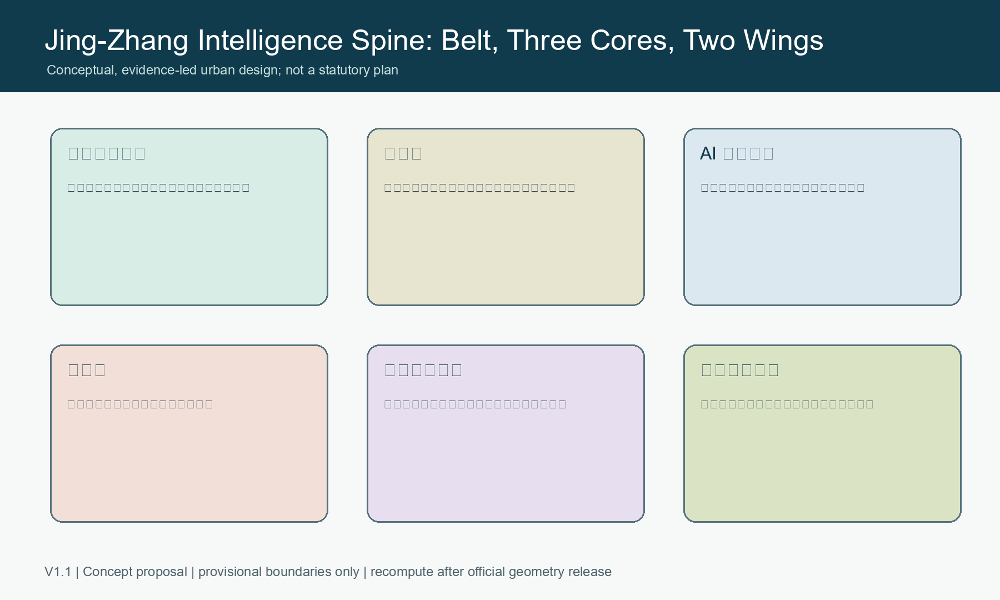
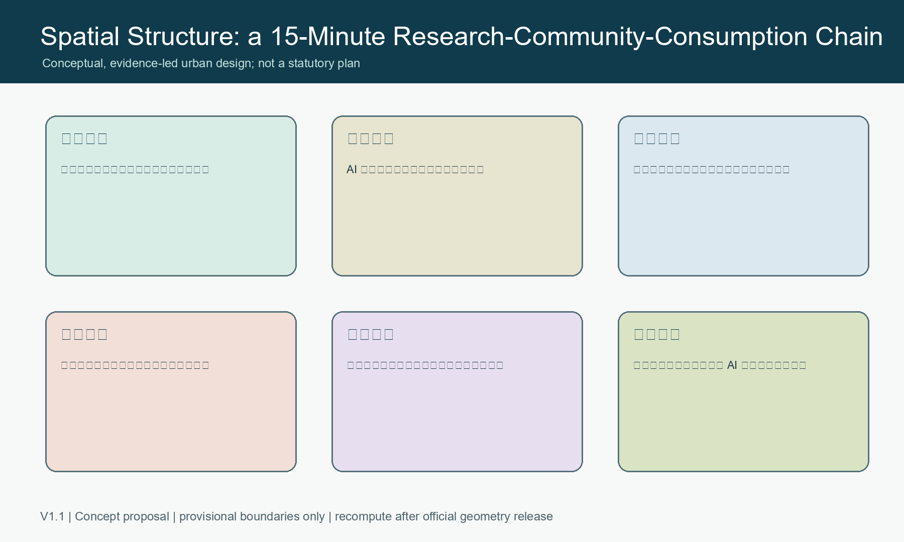
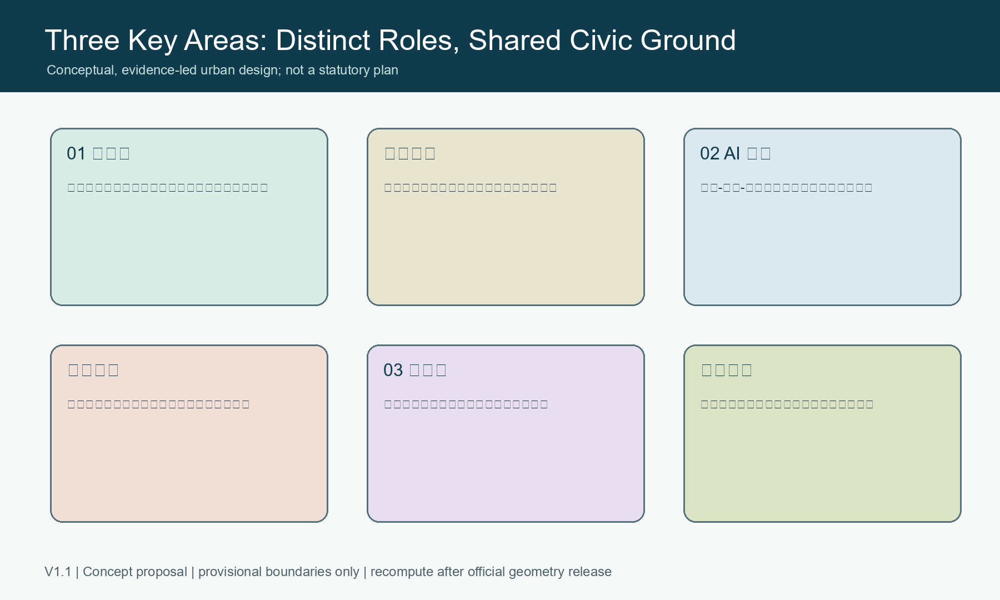
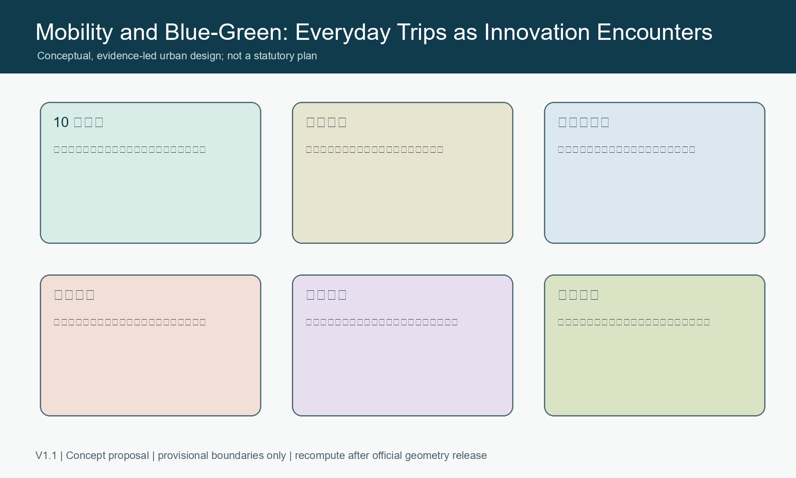
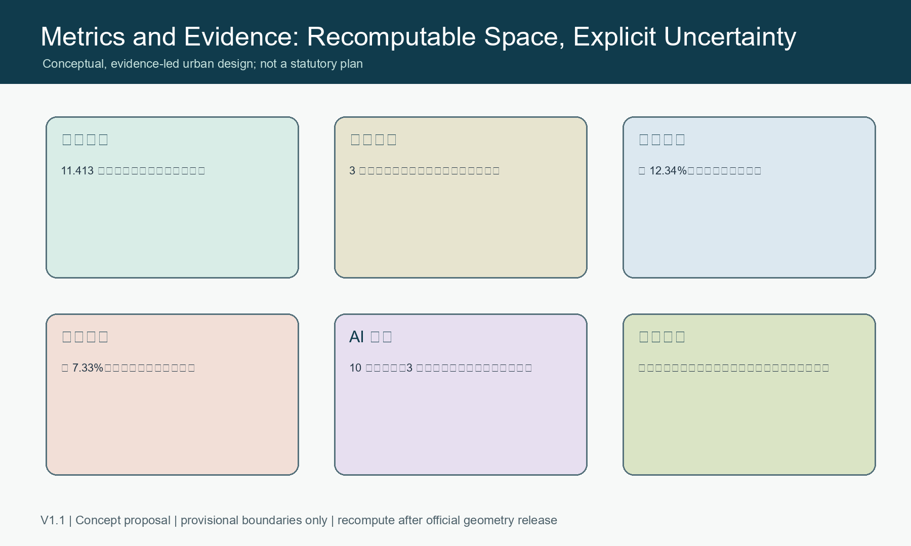

# Jing-Zhang Intelligence Spine: An AI Innovation Commons for Everyday Life

## Design Basis and Public-data Boundary

This is a conceptual, open co-creation proposal for the Centennial Jing-Zhang AI Innovation Belt. It uses only the organizer-provided public brief and provisional geometry. Exact official polygons, regulatory controls, ownership, heritage, municipal and engineering records are not available in the package. All spatial suggestions must therefore be recalculated and professionally reviewed when those records are released. Nothing here is an approved plan, construction commitment, or statutory control.

## A Belt, Three Cores, Two Wings

The proposal names the belt **Jing-Zhang Intelligence Spine**. The former rail corridor becomes a civic learning and walking spine; Zhongzhiyuan, the Beijing AI Origin Community and Dazhongsi become three complementary innovation cores. The Zhongguancun service wing provides capital, legal, IP and international services, while the Xiaoyuehe wing hosts carefully governed public-service scenarios. The identity direction is two parallel lines and open nodes: rail memory and knowledge flow meet in visible public contributions.

## Three Detailed Areas

Zhongzhiyuan is a garden accelerator for full-stack research, evaluation and AI safety dialogue. The AI Origin Community is a near-campus conversion and open-source neighbourhood. Dazhongsi is a station-city gateway for intelligent products, public demonstration and international exchange. These are concepts for professional deepening, not parcel decisions or technical designs.

## AI Ecosystem, People and Scenarios

The ecosystem links universities, open-source communities, start-ups, established firms, service providers, residents and visitors. Ten scenario cards cover accessible wayfinding, open-source release, safety sandboxing, low-carbon edge computing, cultural interpretation, public learning, community services, healthy mobility, fair consumer assistance and event safety. Three proposed validation settings are an AI safety sandbox, edge-computing/low-carbon coordination and station-city agent services. Each requires minimal data, clear notice, an accountable operator, human review and an opt-out path.

Five priority personas are open-source developers, early-stage teams, university students and researchers, nearby residents, and international visitors. They receive shared work and publication spaces, affordable services, slow-mobility continuity, cultural interpretation and safe public amenities without behavioural surveillance.

## Civic Space, Culture and Mobility

The blue-green network is a daily public ground rather than a decorative buffer: shaded walking and cycling, accessible crossings, rain gardens, small performance spaces and quiet rest all reinforce the rail heritage narrative. Three pilgrimage landmarks are the Jing-Zhang Timeline, the Open-source Constellation contribution wall and the Dazhongsi Future Salon. All are modular public-display concepts with rights-cleared content and no compulsory biometric collection.

## Operations, Metrics and Safeguards

An annual sequence - Open Source Spring, Scenario Lab Summer, Jing-Zhang Forum Autumn and Public Technology Winter - creates a route from contribution to testing, professional review and public learning. It does not imply government sponsorship or confirmed events. The submitted geometry recomputes an approximately 11.413 km2 provisional overall area, three key areas, 12.34% green space and 7.33% public space. These values are design-audit inputs only and must be recalculated using official geometry.

## Risk, Copyright and Next Review

All graphics are original data-driven diagrams created for this submission. The report uses no remote maps, external scripts, private data or third-party logos. Before any implementation discussion, professional teams must verify official boundaries, statutory planning conditions, heritage requirements, land rights, road/rail and municipal capacity, safety, accessibility, privacy, energy and operating responsibility.
