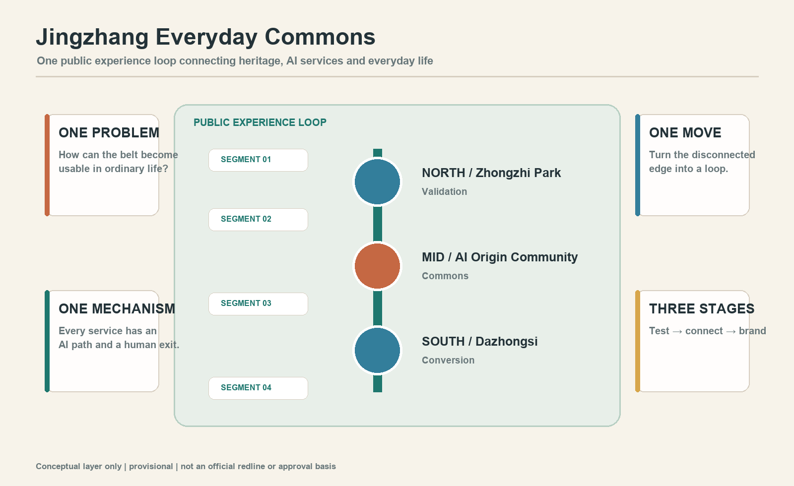
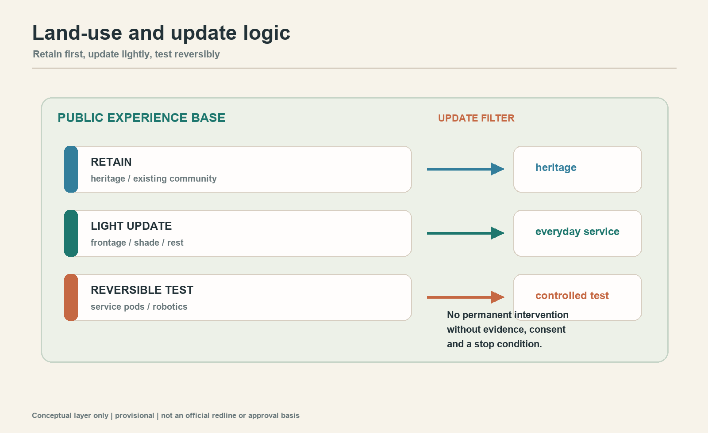
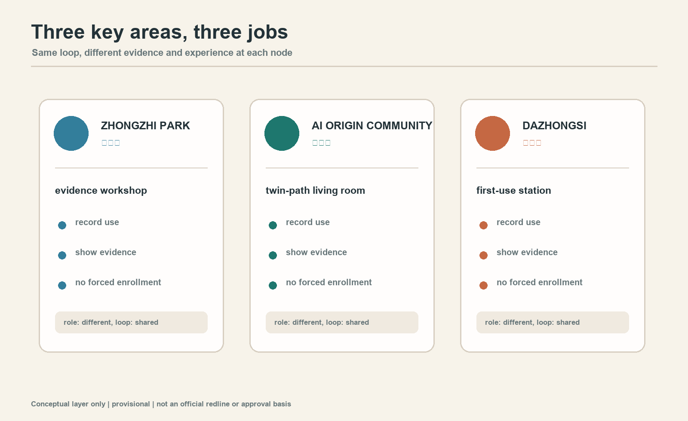
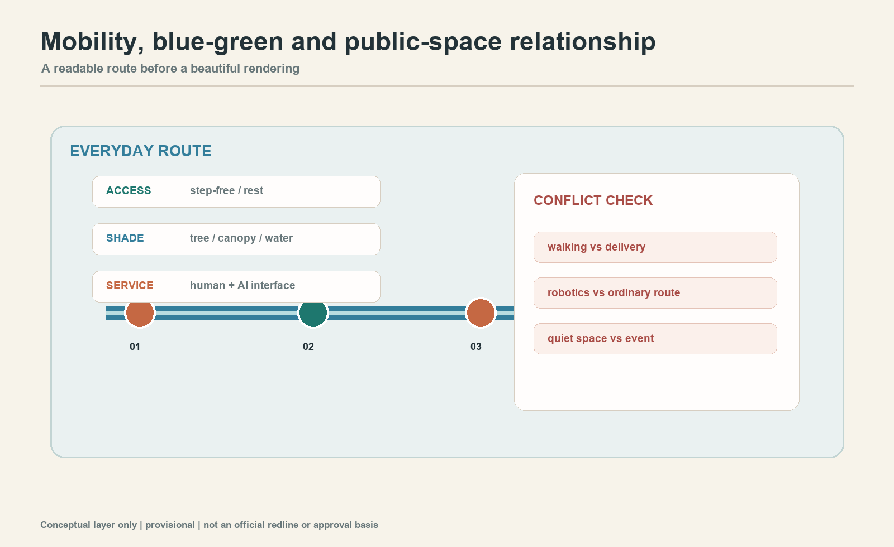
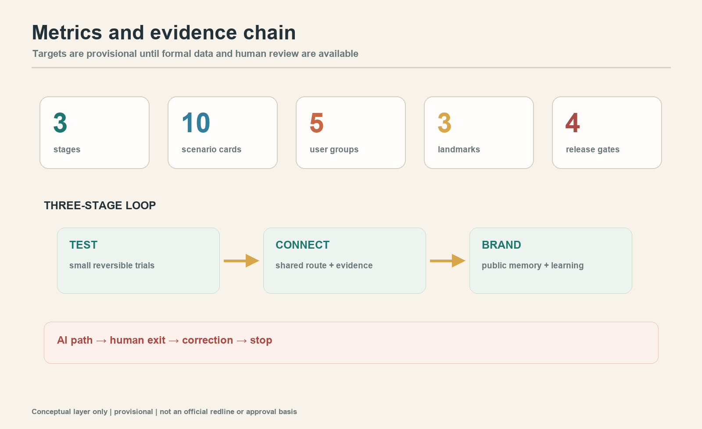

# Jingzhang Everyday Commons: A Public Path from Seeing AI to Sharing AI

> **JINGZHANG EVERYDAY AI COMMONS** is not another AI showroom. It is an everyday urban path where people can understand, choose, use, refuse and collectively review AI. This is an open co-creation proposal, not a statutory plan; all spatial moves are conceptual suggestions for professional teams to deepen.

## Design Basis and Source List

The proposal uses the qualification announcement and site package as its scope basis [source:DATA-SRC-OFFICIAL-ANNOUNCEMENT-20260509] [source:SITE-PACKAGE], and the agent open-call taskbook as its co-creation and six-task basis [source:SRC-2026-0518-AGENT-OPEN-CALL-TASKBOOK] [standard:PROJECT-AGENT-OPEN-CALL-TASKBOOK]. Urban-design, regulatory-plan-depth and land-use references come from the local standards snapshot [standard:MOHURD-URBAN-DESIGN-MEASURES] [standard:MOHURD-CONTROL-DETAILED-PLANNING] [standard:MNR-LAND-USE-CLASSIFICATION-GUIDE].

No precise official boundary is publicly available. This package therefore uses the repository’s provisional boundary, marked `provisional_constraint`; it is not a redline, approval basis or precise-area basis [source:DATA-SRC-PROVISIONAL-BOUNDARIES-20260605] [data:geometry/site_boundary.geojson#SITE-001]. All layers, metrics, drawings and HTML must be recalculated when official polygons are supplied [depth:existing_conditions_diagnosis].

## Three-Level Scope Framework

The coordinated research area is approximately 43.6 km²; the overall design area is approximately 11.4 km²; and the three key areas total approximately 368.4 ha [source:DATA-SRC-OFFICIAL-ANNOUNCEMENT-20260509] [metric:site_area_research_sqm] [metric:key_area_total_sqm].

The three levels carry different design depths: regional research defines the ecosystem and collaboration logic; overall design translates that logic into structure, renewal, mobility and blue-green space; key-area design tests nodes, scenarios and phasing. All spatial conclusions retain a recalculation path because the boundary remains provisional [data:geometry/key_areas.geojson#KEY-001] [depth:three_level_scope_framework].

## Coordinated Research Area: Industry and Future City Research

The single problem is: **the AI innovation belt has technology, industry and scenario supply, but ordinary people face a break between seeing AI and first using, refusing, correcting and jointly verifying it.** The single spatial move is three stations and five segments; the single public mechanism is the Twin-Path Scenario Card.

The three positions are the Centennial Jingzhang Cultural Belt, the Urban AI Everyday-Life Experience Belt and the AI Integration Innovation Belt. The five functions are full-stack AI autonomy, a world-class AI ecosystem, AI+ scenario enablement, an intelligent active city and an open platform for AI governance and public value [standard:PROJECT-AGENT-OPEN-CALL-TASKBOOK] [depth:overall_spatial_structure].

The name is Jingzhang Everyday Commons. Its logo direction uses two parallel, switchable paths: one AI path and one human/offline path, with a visible gap representing refusal, pause and renewed choice. This is a conceptual identity direction, not an authorized final brand asset [source:SRC-2026-0518-AGENT-OPEN-CALL-TASKBOOK].

The second evidence audit retains eight main cases with evidence grades A or A-. In this package they remain a background reference layer, not evidence for Jingzhang boundaries, regulatory controls, investment, operators or implementation commitments [source:GLOBAL-CASE-DEEP-RESEARCH-20260811] [metric:ecosystem_case_count]. The main cases are Kendall Square, Cortex Innovation District, 22@Barcelona, King's Cross Knowledge Quarter, Paris-Saclay, Tonsley Innovation District, Toronto Waterfront–Quayside and the City of Helsinki AI Register. STATION F is now a mechanism supplement for an AI resource desk; Boston Seaport is excluded because its mechanism is too close to Kendall/Cortex despite stronger evidence. Paris-Saclay adds an important negative finding: housing delivery remains far below target and weekend/holiday vitality is weak, so life completeness, night/weekend use and unfinished research-urbanisation goals become explicit checks. We extract mechanisms only, not names, buildings, visual identity, company lists or operating models.

## Overall Design Area: Urban Renewal and Regulatory-Plan-Level Urban Design

The overall structure is **three stations and five segments**: Zhongzhiyuan is the Verification Station, AI Origin Community is the Commons Station, and Dazhongsi is the Conversion Station. The five segments are rail arrival, heritage park, community daily life, campus/work and public experience [data:geometry/roads.geojson#JZ-ROUTE-001] [depth:overall_spatial_structure].

Renewal follows the sequence understand, test at low risk, review in public, and then decide whether to deepen. Retain, renovate, reversible addition and demolition are options to be evaluated after building, ownership, structural and public-interest studies [depth:retain_renovate_demolish].

FAR, height, density, setbacks, road redlines and municipal capacity remain unknown because formal controls and existing-condition data are missing [metric:far_average] [standard:MOHURD-CONTROL-DETAILED-PLANNING]. The package proposes public-path relationships and phasing conditions only.

## Detailed Design of Key Areas

### Zhongzhiyuan | Verification Station

The spatial chain is evidence yard, enterprise-service interface and controlled testing. It hosts S05 enterprise-service coordination, S06 first use of an AI product and S07 low-speed robot observation. It exposes capability, limits, data needs, human review and stop conditions without assuming a vendor or operator [data:geometry/key_areas.geojson#KEY-001] [depth:three_key_area_detailed_design].

### AI Origin Community | Commons Station

The spatial chain is twin-path living room, community learning and care access. S03, S04, S08 and S10 retain paper, phone, human and account-free access. AI may explain, navigate and triage; it does not replace medical diagnosis, public-service judgment or resident choice [data:geometry/key_areas.geojson#KEY-002] [depth:three_key_area_detailed_design].

### Dazhongsi | Conversion Station

The spatial chain is first-use concourse, ordinary/AI-enabled consumption and review. S01, S02, S09 and S10 ensure that the first step after rail arrival has both AI and ordinary paths; smart consumption cannot require registration or personal tracking [data:geometry/key_areas.geojson#KEY-003] [depth:three_key_area_detailed_design].

## AI Innovation Ecosystem, Personas, and AI+ Scenarios

Five personas are local residents and carers; young students and early-career workers; AI start-ups and developers; enterprise visitors and campus workers; and older, mobility-limited or low-digital-literacy users. Every persona retains a non-AI or human-equivalent path [metric:persona_count].

Ten Twin-Path Scenario Cards cover accessible rail-to-park arrival, cultural guidance, community services, youth learning, enterprise services, first use of an AI product, low-speed robots, health-service navigation, smart consumption and public feedback [metric:scenario_card_count]. Version 5 adds night/weekend life completeness, public ride/observation, chaperone or remote supervision, logs/data-retention fields, video-sensing rights and range-shrink/reprocurement gates on top of version 4. These additions translate strengthened evidence from global cases into reviewable design conditions without naming operators.

Each card also carries four minimum safeguards: entry conditions, ordinary-service equivalence, human review and stop rules, and exit restoration. These are conceptual safety and professional-deepening interfaces: an AI path enters only when sources, spatial interface, data boundary and human entry are clear; without AI, people must still complete the basic task through human, phone, paper, fixed-wayfinding or another ordinary route; errors, unexplained risk, missing human access or unclear privacy boundaries trigger an immediate stop; exit removes wrong information, withdraws necessary data, restores ordinary service and preserves an auditable record. The accountable entity remains to be legally determined [source:SCENARIO-GUARDRAILS-20260812].

The three industry validation scenarios are S05, S06 and S07, testing service translation, first adoption and controlled automation [metric:industry_validation_scenario_count]. Each card includes an AI path, human/offline path, spatial anchor, data minimization, human review, success signal and stop condition; these are not deployed services.

## Land Use, Building Scale, and Retain-Renovate-Demolish Strategy

Land-use and building layers express conceptual roles, not existing conditions. `land_use.geojson` provides a coverage concept for the public path; `buildings.geojson` provides three node prototypes for retain-first, low-impact renovation and reversible testing [data:geometry/land_use.geojson#LU-001] [data:geometry/buildings.geojson#BLDG-001].

Building scale, FAR, height, density and retain/renovate/demolish decisions require official controls, existing-building surveys, ownership, structural and municipal data [metric:far_average] [depth:development_intensity_controls].

## Transport, Rail, Municipal Infrastructure, and Public Services

The mobility strategy does not draw new engineering alignments. It connects rail arrival, the heritage park, community and campus interfaces into a continuous public path, prioritizing accessible links, human wayfinding, ordinary transport and non-digital entry [data:geometry/roads.geojson#JZ-ROUTE-001] [depth:traffic_rail_slow_parking].

Public-service priorities are enterprise windows, community desks, human health referral, review and controlled low-speed testing. New infrastructure and municipal capacity require professional surveys [depth:municipal_new_infrastructure].

## Blue-Green Network, Public Space, and Urban Character

The heritage park, Xiaoyue River and community spaces form the experience base. The first component library contains twin-path markers, human-route desks, evidence benches, accessible wayfinding spines, low-speed observation lines, review posts, reversible trial tables and version-status boards [data:geometry/public_space.geojson#PS-001] [depth:blue_green_public_space].

The three AI pilgrimage landmarks are Evidence Yard, Twin-Path Living Room and First-Use Concourse. They are reachable, understandable and reviewable public nodes, not assumed large buildings or approved permanent installations [metric:ai_landmarks].

The cultural narrative translates self-built railway engineering into autonomous innovation, connection into understandable interfaces, and the switchback into test-feedback-rechoice. Wayfinding is layered as entry, station, segment, twin-path, status and review signs; historical facts, site names, fonts and images still require source and rights review [source:SRC-2026-0518-AGENT-OPEN-CALL-TASKBOOK].

## Renewal Projects, Implementation Policy, and Phasing

The project list is consolidated into three conceptual stages: Stage 1 “source clearing and baseline”, Stage 2 “low-risk commons use”, and Stage 3 “controlled validation and reuse”. Stage 1 establishes network evidence, provisional boundaries, ordinary-service, accessibility and night/weekend baselines; Stage 2 prioritizes cultural guidance, accessible wayfinding, community-service navigation, paired AI/human routes and public feedback; Stage 3 selects industry, community and public-experience scenes for controlled validation and only reuses outputs with sources, feedback and exit records. P0/P1/P2/P3 remain internal gates for source clearing, public-AI registration, human fallback, cross-station review and brand publication, not four parallel implementation stages. Each stage includes human review, pause, rollback, range shrink, re-evaluation, scale-up and public feedback [depth:renewal_project_list] [depth:phasing_implementation] [source:GLOBAL-CASE-DEEP-RESEARCH-20260811].

The three-stage activity concept includes a first-use open day, a public-AI register template, human-fallback rehearsal, public ride/observation guidance and evidence-reading sessions in the near term; a cross-station scenario exchange week, developer–community reading sessions, an AI resource desk, city-interface audits and a life-completeness review in the mid term; and an Everyday Commons week, bilingual case library, global public-AI-space dialogue, pause/failure case library, research-urbanisation reflection and open method kits in the long term. Activities, investment, funding, operators and maintenance contracts remain to be confirmed [standard:PROJECT-AGENT-OPEN-CALL-TASKBOOK].

Each project record carries a spatial anchor, scenario-card link, prerequisite evidence, participation method and reversible exit condition. The three stages move from baseline building to low-risk shared use and then controlled validation and reuse; the four P0–P3 items are internal release gates. Feasibility is therefore expressed as clear data, low-risk scenario, human takeover and reviewable result—not as a premature operator or procurement commitment. When official boundaries, ownership, budgets and authority comments arrive, the project list, metrics and figures must be recalculated and the package assumptions and manifest version updated [metric:implementation_phases] [metric:implementation_stage_count] [source:DATA-SRC-PROVISIONAL-BOUNDARIES-20260605].

## Metrics, Area Recalculation, and Compliance Matrix

The package records 43.6 km² research area, 11.4 km² overall design area, 368.4 ha key areas, three key areas, eight global cases, ten scenario cards, three industry validation scenarios, five personas and three AI landmarks [metric:site_area_research_sqm] [metric:ecosystem_case_count] [metric:scenario_card_count]. It also records three conceptual stages, four internal release gates and a human/offline path for every scenario [metric:implementation_stage_count] [metric:internal_release_gate_count] [metric:non_ai_path_coverage].

Concept green and public-space ratios are not statutory controls; FAR and related controls remain unknown. Full coverage is recorded in the compliance, standards, design-depth, source, assumption and self-check files [depth:metrics_recalculation].

## Risk, Copyright, and Compliance

Key risks are provisional-boundary misreading, missing ownership and controls, privacy and surveillance, accessibility gaps, traffic conflict, heritage misreading, AI-generated-content rights and conceptual suggestions being mistaken for commitments. High-risk scenarios include human review, stop and rollback [depth:risk_missing_data].

This package uses public repository materials, the local provisional boundary and original concept diagrams. PNG figures are explanatory layers, not site photos or official drawings. Final brands, fonts, site photos and CAD/GIS require source, rights and version records. See `report/copyright_statement.md`.

Risk handling follows the sequence label, limit, provide rollback and keep a trace. Boundary risk is controlled by `provisional_constraint`, unknown metrics and a replacement rule; privacy risk by data minimization, account-free access and no face or individual-tracking collection; equity risk by human-equivalent paths, accessible wayfinding, paper/phone entry and appeal; technology risk by low speed, observability, human emergency stop and stop conditions; rights risk by original diagrams, source registration and no unlicensed assets. `sources.json` records use and limitations, `assumptions.json` records impacts, and the three matrices map each task to text, geometry, metrics and drawings [source:SOURCE-REGISTRY] [standard:GENERATIVE-AI-INTERIM-MEASURES] [standard:BARRIER-FREE-ENVIRONMENT-LAW]. None of this replaces field surveys, ownership negotiation, professional review or authority approval.

## References

1. Beijing Municipal Commission of Planning and Natural Resources, Haidian Branch: qualification announcement [source:DATA-SRC-OFFICIAL-ANNOUNCEMENT-20260509].
2. Open-call taskbook for global agents [source:SRC-2026-0518-AGENT-OPEN-CALL-TASKBOOK].
3. Repository `brief/site-package` [source:SITE-PACKAGE].
4. Repository public source registry [source:SOURCE-REGISTRY].
5. Local snapshots of urban-design, regulatory-plan and land-use standards [standard:MOHURD-URBAN-DESIGN-MEASURES] [standard:MOHURD-CONTROL-DETAILED-PLANNING].
