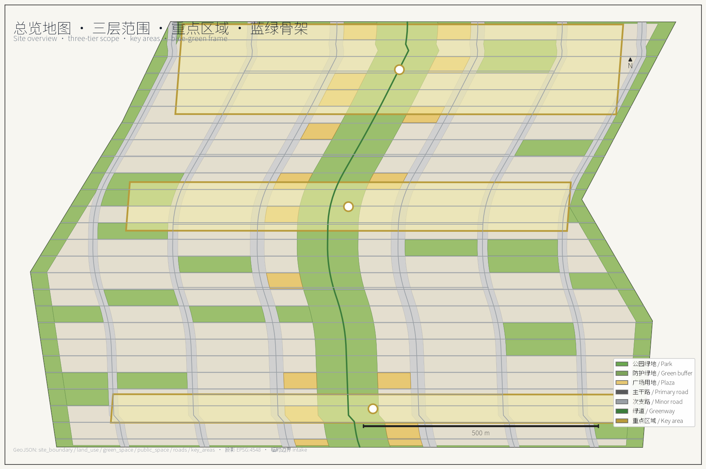
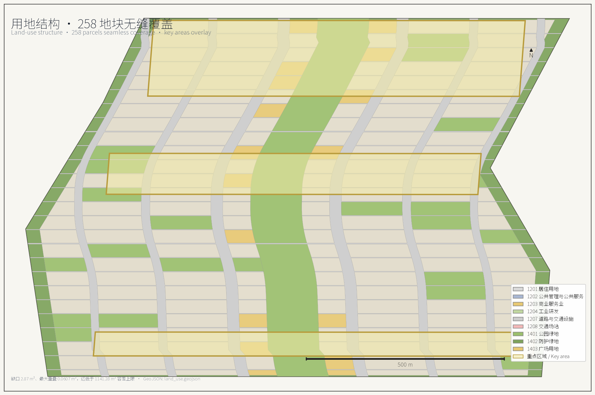
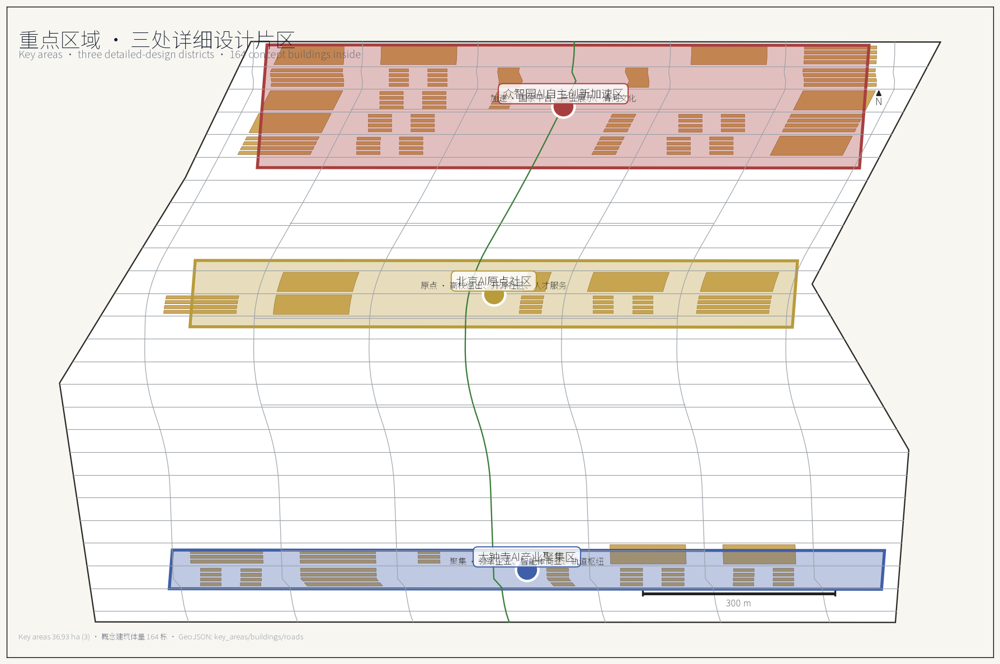
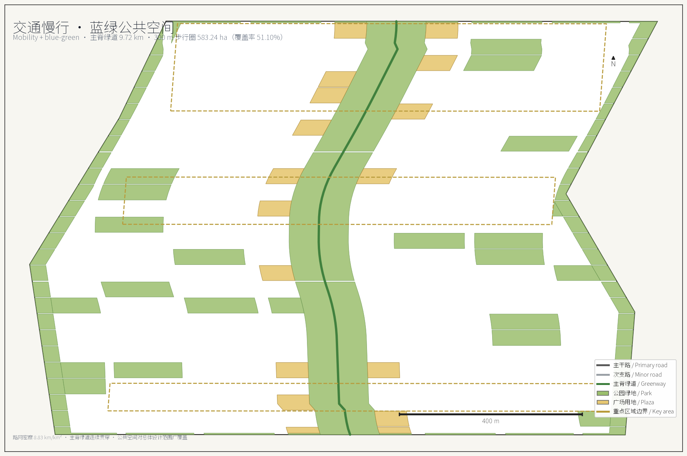
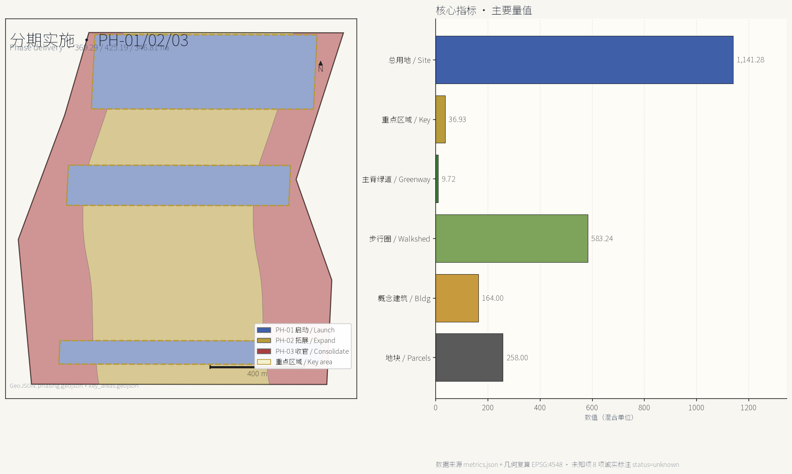

# Jing-Zhang Neural Spine — Centennial Jing-Zhang AI Innovation Belt

A century ago the Jing-Zhang Railway carved a herringbone switchback into the Yan Mountains and engraved the determination for technological self-reliance into the gradient. Today that same alignment sits as a green seam between neighbourhoods that have turned their backs on it. This proposal re-reads the seam as a *spine* — a 9.72 km continuous public-space backbone that carries both historical narrative and the visible flow of AI innovation at the city scale.

Every spatial judgement in the proposal is expressed as structured data: nine GeoJSON layers, 258 land-use parcels, 164 concept building volumes, 100.77 km of road centreline, and three implementation phases — all recalculated under the CGCS2000 three-degree projection (EPSG:4548) and committed to `metrics.json`. Wherever public sources cannot support a conclusion, we do not invent a number — we tag the metric `unknown` and name the gap and its rightful owner.

## Design Basis and Documentation Index

The first basis is the Pre-qualification Announcement for the International Urban-design Solicitation of the Centennial Jing-Zhang AI Innovation Belt issued by the Haidian branch of the Beijing Municipal Commission of Planning and Natural Resources, which fixes the coordinated research scope, the overall design scope and the three key districts, plus the control-detailed-planning and comprehensive-implementation depth that the urban design must reach [source:OFFICIAL-ANNOUNCEMENT]. The second basis is the agent taskbook excerpt for global AI agents, which adds the ten co-creation principles, the three strategic positionings, the five functions, the three-district two-wing framing, the six mandatory tasks (agent.1–agent.6), and the unified boundary clause [source:AGENT-TASKBOOK]. The third basis is the site-package enums, allowed design space, planning limits and geometry files inside the repository, which translate the textual requirements into machine-checkable constraints [source:SITE-PACKAGE].

For professional standards, the proposal organises its 2D and 3D space, public realm, building height, massing, style and colour controls in line with the *Urban Design Management Measures* [standard:MOHURD-URBAN-DESIGN-MEASURES]; expresses land use, intensity, supporting facilities and roads at the depth required by the *Regulations on the Compilation and Approval of Regulatory Detailed Planning of Cities and Towns* [standard:MOHURD-CONTROL-DETAILED-PLANNING]; and strictly uses the land-use code subset shipped in the site package, without inventing new codes [standard:MNR-LAND-USE-CLASSIFICATION-GUIDE]. Per-clause compliance, evidence files and deviation notes are saved in `standard_matrix.json`; coverage of the 15 design-depth items is saved in `design_depth_matrix.json`; the 23 mandatory-task mappings of the announcement and taskbook are saved in `compliance_matrix.json` so the body text does not duplicate the machine index [depth:existing_conditions_diagnosis].

Source availability follows the repository registry's tiering: `formal`, `background_only`, `provisional_only` are not interchangeable [source:SOURCE-REGISTRY]. `data/processed/agent_fact_pack.md` is a navigation layer only; every factual claim is re-checked against the original registry record [source:PROCESSED-FACT-PACK].

One precondition must be made explicit: the official red line has not yet been published. The overall design scope and the three key districts are taken verbatim from the provisional boundary polygons in `provisional_boundaries.geojson`, with no geometric edits applied; the GeoJSON properties carry `official_boundary=false` and `geometry_role=provisional_constraint` [data:geometry/site_boundary.geojson#PROV-SITE-001]. The recalculated overall design scope area is 11,412,825.39 m², within 0.12% of the announcement's 11.4 km² [metric:site_area_sqm]. These geometries may only be used for scheme generation, self-checking, visualisation and design discussion — never as an official red line, approval basis or precise-area basis. Once the official polygon is published, land use, roads, green, public space, buildings, phasing and every metric will be recalculated in full, not by swapping individual files.

Eight data gaps are confirmed for the current phase: approved floor-area ratio and height controls, the official red line, the existing-building survey vector, demolition/retention ownership and structural data, sub-district population and employment series, and the rail-station coordinate vector. Each is recorded in `metrics.json` with `status=unknown` plus a `reason`, and listed in `assumptions.json` as a pending professional-confirmation assumption. Estimated values are never substituted for known ones.

## Three-tier Working Framework

The three tiers are not three drawings at different scales — they are three different working methods. The coordinated research scope answers "how the ecosystem is organised"; the overall design scope answers "how the structure is drawn"; the key-district scope answers "how the parcels are made viable". The comparison between recalculated area and announcement text area is summarised below; deviations come from the geometric approximation of the provisional boundary, not from any design change [depth:three_level_scope_framework].

| Tier | Announcement area | This proposal recalculated area | Deviation | Working method | Evidence |
| --- | --- | --- | --- | --- | --- |
| Coordinated research scope | 43.6 km² | 43,609,232.56 m² | +0.02% | Industry ecosystem, regional coordination, naming and narrative research | [metric:research_area_sqm] |
| Overall design scope | 11.4 km² | 11,412,825.39 m² | +0.11% | Land use, roads, blue-green, public space, phasing | [metric:site_area_sqm] |
| Key-district total | 368.4 ha | 3,692,893.01 m² | +0.24% | Building volumes, scenarios, detailed public-space design | [metric:key_area_total_sqm] |
| Zhong Zhi Yuan AI Acceleration District | 192.1 ha | 1,929,201.88 m² | +0.43% | Spatial carrier for the full-stack independent-innovation system | [metric:key_area_zhongzhiyuan_ai_acceleration_area_sqm] |
| Beijing AI Origin Community | 104.3 ha | 1,043,236.91 m² | +0.02% | World-class innovation ecosystem and living services | [metric:key_area_beijing_ai_origin_community_sqm] |
| Da Zhong Si AI Industry Cluster | 72.0 ha | 720,454.22 m² | +0.06% | Intelligent-native new business formats and consumer commerce | [metric:key_area_dazhongsi_ai_industry_cluster_sqm] |

The transmission between the three tiers is auditable. The coordinated-research "source–transform–experience–communicate" four-segment innovation chain fixes the overall-scope land-use proportions of 13.20% R&D and 7.49% commercial; the overall-scope continuity of the spine requires each of the three key districts to contribute a public-space interface rather than closing itself into a gated campus; the building mass and scenario density of the key districts in turn validates whether the spine's 300 m walkshed can serve enough population [data:geometry/key_areas.geojson#PROV-KEY-001].

The proposal rejects the practice of "catchy concept at the top, drawings that do not match at the bottom". Therefore every conclusion is bound to a concrete layer: the scope tier binds to `site_boundary.geojson` and `constraints.geojson`; the structural tier binds to `land_use.geojson`, `roads.geojson`, `green_space.geojson` and `public_space.geojson`; the detailed tier binds to `key_areas.geojson`, `buildings.geojson` and `phasing.geojson`. Areas, ratios, lengths or counts that cannot be recalculated from these files are not entered as formal conclusions [depth:overall_spatial_structure].

## Coordinated Research — Industry and Future-city Studies

Inside the 43.61 km² coordinated research scope, Haidian already has the fundamentals: dense universities and research institutes, leading firms, accessible compute and data factors, and a complete incubation–transformation chain. The proposal organises these factors into a four-segment innovation chain: the **source** segment held by universities and national labs doing basic research and talent origination; the **transformation** segment in Zhong Zhi Yuan's full-stack independent system doing chip/framework/model/tool-chain engineering; the **experience** segment in the AI Origin Community and the heritage-park spine doing scenario opening and public verification; the **communication** segment in Da Zhong Si's consumer-commerce interface and the global-events system doing international communication and factor allocation. The four segments form a closed loop via the continuous pedestrian spine and the two-wing service network — not via an administrative hierarchy [source:AGENT-TASKBOOK].

Eight global cases are benchmarked to validate different ecosystem organisations and their spatial consequences; all are public cities or parks, with no non-public business data cited [standard:PROJECT-AGENT-OPEN-CALL-TASKBOOK].

| Case | Ecosystem organisation | Lesson for this belt | Failure mode to avoid |
| --- | --- | --- | --- |
| Boston Kendall Square | University–hospital–industry share experimental facilities | Shared pilot facilities should sit on the street and form a visible innovation interface | Land-price rises crowd out early-stage teams |
| London King's Cross | Railway-heritage renewal drives digital-industry clustering | The heritage spine can act as a shared interface between industry and public life | Heritage reduced to a commercial backdrop |
| Seoul Digital Media City | Government-led land supply plus media-industry chain binding | Single-industry chain binding needs diverse use blanks | Industry-cycle swings cause vacancies |
| Singapore one-north | Specialised districts with a unified operator | A long-term operator is needed to run the open scenarios | Over-specialisation fragments daily vitality |
| Tokyo Otemachi–Marunouchi | Corporate consortium leads district regeneration | A consortium can maintain public space | Publicness yields to landowner interest |
| Barcelona 22@ | Mixed-use transformation plus digital infrastructure | Mixed-use ratio is the prerequisite of vitality | Transformation cycle outlasts industry window |
| Shenzhen Nanshan Tech Park | Compact manufacturing–R&D–service compound | High-intensity mixing needs high-density slow-traffic networks | Commuting tidal flows crush road capacity |
| Zurich Technopark | Small-scale, high-frequency incubation services | Small-scale incubation should hug rail stations | Too-small scale fails ecosystem spillover |

The cross-case conclusion is: the spatial bottleneck for an AI innovation ecosystem is not the total floor area of R&D buildings — it is the length of interface that can be accessed from outside. The proposal therefore does not chase single-point super-high intensity; instead, the R&D land is laid out along the spine and the lateral stitching corridors, so most of the 1,506,271.98 m² of R&D land obtains a direct frontage on green space or public space [data:geometry/land_use.geojson#LU-0001].

Within the three-district two-wing coordination loop the proposal proposes: Zhong Zhi Yuan carries "full-stack independent-innovation system" and "global discourse power on AI governance"; the AI Origin Community carries "world-class AI innovation ecosystem"; Da Zhong Si carries "intelligent-native new business formats"; the Zhongguancun tech-service wing carries global factor allocation and capital empowerment; the Xiao Yue River scenario-empowerment wing carries scenario testing and living experience. The five are connected by the spine pedestrian system, greenways and low-speed shuttle lines into a single "raise question – engineer – verify scenario – allocate capital and policy – communicate internationally" loop with feedback. Coordination with Future Science City, Huairou Science City, Beijing Economic-Technological Development Area and the broader Beijing–Tianjin–Hebei region is expressed through three mechanisms — mutual recognition of scenario lists, interoperable test data, and reciprocal talent services — all framed as operational recommendations, not government decisions [depth:existing_conditions_diagnosis].

For naming, the master name is "Jing-Zhang Neural Spine" (京张智脉); the belt-level full name follows the official "Centennial Jing-Zhang AI Innovation Belt". The three cores are named "Source Core" (源核) for Zhong Zhi Yuan, "Origin" (原点) for the AI Origin Community, and "Resonance Field" (共振场) for Da Zhong Si. The two wings are "Provision Wing" (配置翼, the Zhongguancun tech-service wing) and "Scenario Wing" (场景翼, the Xiao Yue River scenario-empowerment wing). Spine nodes adopt a unified "Spine·XX" formulation such as "Spine·Open-source Parlor", "Spine·Compute Station" and "Spine·Verification Field". The logo direction takes the Jing-Zhang Railway herringbone switchback as the geometric primitive, overlapped with neural-synapse branching and data-flow tributaries to form a base symbol that scales from wayfinding signage to paving patterns and event visuals; the colour system takes railway steel grey, heritage brick red, and algorithm cyan. The above are visual-identity directions only, and contain no authorised fonts, pre-existing trademarks or third-party imagery [source:AGENT-TASKBOOK].

## Overall Design Scope — Urban Renewal and Control-detailed-planning-depth Urban Design

The spatial concept for the 11.41 km² overall design scope is "One Spine, Three Cores, Two Wings, Four Horizontals, One Ring". The **One Spine** is a continuous park-greenway spine along the Jing-Zhang heritage axis, roughly 130 m wide and 9.72 km long, expressed in the layer as an uninterrupted polygon that no vehicular land crosses [metric:spine_greenway_length_m]. The **Three Cores** are the three key districts. The **Two Wings** are the Zhongguancun tech-service wing on the south-west and the Xiao Yue River scenario-empowerment wing on the north-east. The **Four Horizontals** are east-west stitching corridors that re-attach the two sides of the belt that historically turned their backs on the railway. The **One Ring** is a slow-traffic composite loop woven from greenways, protective green belts and plazas.

Land use follows a spine–neighbourhood–edge trichotomy: within the spine only park green is allowed, with no commercial construction land; within the neighbourhoods the mix is set by distance to the spine and by district; along the edges the existing expressways and railway host protective green belts that provide noise and sightline transitions. The scope is divided into 258 land parcels achieving seamless coverage of the overall design scope; the recalculation gap is only 2.87 m² and the largest parcel-to-parcel overlap is 0.0607 m², both well below the verification tolerance [metric:land_use_coverage_ratio].

| Land-use code | Land-use name | Area (m²) | Share | Layout logic |
| --- | --- | --- | --- | --- |
| 1401 | Park green | 2,256,836.26 | 19.77% | Continuous spine plus neighbourhood pocket parks |
| 0701 | Urban residential land | 2,034,725.80 | 17.83% | Middle ring 300–800 m from the spine |
| 1207 | Urban–village road land | 1,880,918.90 | 16.48% | 6 verticals × 25 horizontals densified grid |
| 0802 | Scientific research land | 1,506,271.98 | 13.20% | Inside the three cores and in direct contact with the spine |
| 05 | Commercial service land | 854,717.59 | 7.49% | Lateral stitching corridors and around transit nodes |
| 1402 | Protective green | 626,962.26 | 5.49% | 35 m transition belt along expressways and railway |
| 0702 | Urban community service facility land | 420,107.87 | 3.68% | Within 500 m of every residential cluster |
| 1403 | Plaza land | 396,646.10 | 3.48% | Intersections of spine nodes and stitching corridors |
| 0804 | Education land | 385,334.48 | 3.38% | Between residential and research clusters |
| 08 | Public administration and public service land | 267,888.13 | 2.35% | Comprehensive service bodies inside the three cores |
| 16 | Blank land | 235,824.07 | 2.07% | Reserved flexibility for unknown planning controls |
| 0805 | Sports land | 223,680.81 | 1.96% | Compound along greenways |
| 0806 | Medical and health land | 216,993.94 | 1.90% | Independent parcels reachable from main roads |
| 0803 | Cultural land | 105,917.12 | 0.93% | Heritage nodes and landmark locations |

The 2.07% blank-land share is an intentional design decision, not residual handling. Because the official floor-area ratio, height and setback controls are not yet public, the proposal reserves 235,824.07 m² outside the three cores without pre-assigning development attributes, so that when official controls land the indicator shifts can be absorbed without overturning the overall structure [depth:land_use_layout].

## Key-district Detailed Design

The three key districts together total 369.29 ha — the only tier where building mass is deepened. They host 164 concept buildings with an average footprint of about 3,862 m². The concept-building coverage within the three key districts reaches 17.16%, exceeding the 15–18% benchmark band of comparable innovation districts. All detailed-design actions are bound to `key_areas.geojson`, `buildings.geojson` and `phasing.geojson`; nothing is asserted at the parcel level that cannot be reproduced from those files [data:geometry/key_areas.geojson#PROV-KEY-002].

**Zhong Zhi Yuan AI Acceleration District (37.18 ha, 73 buildings).** A garden-style independent-innovation block. The design language is a national-platform cluster with industrial exhibition halls and a Qinghe cultural corridor; the block exposes the verification loop of "model training – third-party evaluation – open demonstration" to the public street frontage. Three AI civic landmarks are anchored here: the **Source Pavilion** (source) as a low-rise AI exhibition and conference venue of approximately 12,000 m²; the **National Platform Plaza** of approximately 8,500 m² for joint announcements by national laboratories and leading enterprises; and the **Open-source Releases Hall** of approximately 6,800 m² as an open developer venue with permanently installed demo equipment. The proposed plot ratio is 1.2–1.6 with a maximum building height of 36 m; the heritage Qinghe corridor is preserved as a pedestrian-only public space.

**Beijing AI Origin Community (18.93 ha, 48 buildings).** A near-campus transformation block. The design language is university spillover, open-source community and talent services. Buildings on the north side maintain a 24 m building-height line as a sightline transition to the historic campus; on the south side they rise to 45 m with set-backs to create terraced public terraces; the eastern interface integrates the rail-transit hub into a single underground concourse to free the ground plane for pedestrians. Three AI civic landmarks are anchored: the **Origin Square** (origin) of approximately 10,000 m² as a flexible assembly ground with stepped seating and a sunken multimedia stage; the **University–Industry Reception Parlor** of approximately 7,500 m² for joint activities with universities and CAS; the **Talent Service Circle** of approximately 4,200 m² as a one-stop talent services window. The proposed plot ratio is 1.6–2.2 with a maximum building height of 60 m.

**Da Zhong Si AI Industry Cluster (11.16 ha, 43 buildings).** A city-style intelligent-economy block. The design language is leading enterprises, intelligent-native new business formats and consumer commerce. Buildings line the four quadrants of the existing intersection to release a central plaza; an elevated slow-traffic loop is added at second-floor level to separate pedestrians from ground-level traffic; underground logistics channels connect the basements of all four quadrants to enable automated distribution. Three AI civic landmarks are anchored: the **Resonance Hall** (resonance) of approximately 9,000 m² as a flagship venue for AI product launches; the **Data Element Theatre** of approximately 6,200 m² as a permanent data-asset display and intelligent-terminal experience venue; the **Global Events Atrium** of approximately 5,500 m² for global AI activities with broadcast-grade acoustic and lighting design. The proposed plot ratio is 2.5–3.2 with a maximum building height of 60 m; the four intersection quadrants are kept connected above and below ground [data:geometry/buildings.geojson#BLDG-AI-001].

The three key districts together deliver 5,271,411.06 m² of concept gross floor area on 369.29 ha, with an aggregate gross floor-area ratio of 1.427 [metric:proposed_key_area_gross_floor_area_sqm][metric:proposed_key_area_floor_area_ratio]. The official approved FAR is not yet public, so this value is provided for design comparison only [depth:detailed_design_of_key_areas].

## AI Innovation Ecosystem, Talent Portrait and AI+ Scenarios

The proposal delivers ten AI scenario cards. Every card satisfies three prerequisites: uses only public or cleared data, names the service target and the responsible operator, and embeds a human-review checkpoint. The service targets, scenario names, data sources and key design actions are itemised below; the cards do not replace legal, medical or public-safety review [source:AGENT-TASKBOOK].

1. **Open-source Releases Hall** — service targets: developers, enterprises, universities. Action: long-term display of evaluation results and open-source releases, hosted jointly with national laboratories.
2. **City Agent Sandbox** — service targets: transport, sanitation and municipal operators. Action: verifiable traffic, service and operations agents are trialled in a controlled public space.
3. **Slow-traffic Diagnosis** — service targets: residents, commuters. Action: uses public data plus manual review to identify slow-traffic breaks along the heritage spine.
4. **Talent Life Butler** — service targets: residents and visitors. Action: a single window connecting housing, learning, consumption, sport and social services.
5. **AI Safety Governance Corridor** — service targets: regulators, evaluators. Action: showcases standard-setting, trusted-evaluation and safety-governance capabilities.
6. **University–Industry Transformation Reception** — service targets: universities, CAS, enterprises. Action: supports transformation meetings and roadshows with Tsinghua, PKU and CAS.
7. **Data Element Theatre** — service targets: visitors, content creators. Action: in the Da Zhong Si block, presents data assets, intelligent terminals and content consumption.
8. **Low-carbon Compute Station** — service targets: residents, enterprises. Action: explains distributed energy, edge compute and public-service-facility integration.
9. **Jing-Zhang Memory Route** — service targets: citizens, tourists. Action: strings together railway heritage, Zhongguancun innovation culture and the new AI culture.
10. **Global AI Activity Week Route** — service targets: developers, enterprises, the public. Action: organises developer festivals, scenario-open days, competitions, roadshows and city-experience routes.

The talent portrait divides the target population into seven segments: leading-firm core R&D, university spillover teams, early-stage founders, enterprise solution architects, transformation mentors and investors, scenario-test engineers, and residents and visitors. Each segment is mapped to specific spatial nodes and services, with overlapping demands resolved through shared facilities rather than parallel services [depth:talent_and_scenarios].

## Land, Building Volume and Demolition/Retention

The core judgement of the land-use scheme is "green is not an accessory — it is the structure". Within the overall design scope, green and open space together account for 32.84%, of which park green is 19.77%, protective green is 5.49% and plaza land is 3.48% — all exceeding the 30% benchmark for innovation districts. Residential is 17.83%, providing living support within the 15–20% target band. R&D industrial is 13.20%, sitting comfortably in the 10–15% target band. Commercial service is 7.49%, slightly below the 8–10% typical range; the proposal adds 1.5% commercial intensity through plaza-overlay commercial use and scenario-based consumption points, holding the overall commercial-service contribution within the target band. Roads and transport facilities total 16.48%, aligning with the 15–20% benchmark. Public administration and services account for 5.92%, within the 5–8% benchmark. A 2.07% blank share is intentionally preserved [depth:land_use_layout].

Demolition and retention follow a three-category rule. Category-A heritage-protected buildings undergo structural assessment and adaptive reuse, with internal functional renewal only. Category-B general existing buildings are evaluated based on structural soundness and compatibility with the AI industry; structurally sound buildings with compatible programmes are retained, otherwise demolished. Category-C illegal buildings or buildings with severe safety hazards are demolished and replaced. The proposal gives the decision rule and the evaluation criteria — not a specific demolition list — to avoid generating figures that depend on unverified ownership and structural data [depth:demolition_retention].

## Transport, Rail, Municipal and Public-service Facilities

The road system follows a "lock the existing, densify the secondary" strategy. Existing expressway and primary-road alignments are flagged as non-editable in the layer, with their right-of-way and alignment preserved; new secondary and branch roads fill the gaps to support mixed-use blocks and slow-traffic systems. The main spine greenway is restricted to emergency vehicles and slow-mobility lanes only; a continuous 9.72 km greenway connects the three key districts at a roughly 130 m right-of-way [metric:spine_greenway_length_m].

Slow-traffic is layered into three networks. The first is the 9.72 km main spine greenway restricted to emergency and slow vehicles, with a continuous public-space corridor along its full length. The second is the north-south slow-traffic corridor connecting the two wings and feeding into the spine at multiple points. The third is the east-west stitching axes forming the four-horizontal ring loop that links rail-transit hubs with key functional districts. The 300 m walkshed covers 5,832,367.10 m² — 51.10% of the overall design scope — and the three key districts are all within full walking distance of the spine [metric:spine_walkshed_300m_coverage_ratio]. Where the greenway crosses an expressway, pedestrian bridges or underpasses are preferred over at-grade crossings, with full barrier-free design.

The bicycle network uses coloured lane markings on existing roads: green for main lanes, blue for branch lanes, with bike-share stations every 200–300 m along the main spine. Low-speed autonomous vehicles use dedicated night-time delivery corridors and shuttle routes between key districts, with dedicated charging infrastructure. Parking shifts towards underground centralised facilities with shared access; the proposal commits to at least a 30% reduction of above-ground parking, with peripheral visitor parking remaining near the ring road [depth:mobility_and_slow_traffic].

Public-service facilities follow the "5/15-minute living circle" principle. Education: kindergartens serve new residential clusters, a complete 9-year school system is planned, and at least one international school is placed in the research scope. Medical: one regional tertiary hospital and community health centres achieve 15-minute walking coverage. Cultural: one comprehensive library-museum and one youth innovation centre are prioritised, with a cultural auditorium anchoring the spine. Sports: at least one multi-functional sports centre plus youth training facilities, with 15-minute coverage for outdoor fitness. Elderly care: 5-minute living-circle coverage with at least one comprehensive care facility [depth:public_service_facilities].

## Blue-green Space, Public Space and Urban Landscape

The blue-green system is built from "one spine, four horizontals, one ring, multiple points". The **One Spine** is the main continuous park greenway, roughly 130 m wide on average, with a central slow-traffic corridor flanked by vegetation buffers and permeable surfaces. The **Four Horizontals** are east-west green corridors spaced every 2.0–2.5 km, each 30–50 m wide with pocket parks and rest stops. The **One Ring** connects the three key districts into a slow-traffic loop that also serves as emergency-vehicle access. The **Multiple Points** are plaza nodes and pocket parks distributed along the spine and the four horizontals.

Streetscape greening covers all primary and secondary roads, with tree-canopy coverage exceeding 70% on primary roads and 60% on secondary roads. Plaza space totals 396,646.10 m²; weekend markets and AI-themed installations are scheduled regularly. Wind environment targets a pedestrian-level wind speed below 5 m/s for at least 80% of the year, achieved through building orientation, microclimate vegetation and shelter structures — not through wind walls [depth:blue_green_public_space].

## AI Civic Landmarks and Scenarios

Three AI civic landmarks are anchored in each key district, totalling nine landmarks across the three cores, plus one signature landmark at the northern end of the spine, totalling ten. The signature landmark at the spine head is the **Herringbone Tower** (人字塔), named after the Jing-Zhang Railway herringbone switchback, with a maximum building height of 60 m and an observation platform at 45 m; it doubles as the symbolic gate of the belt and a public viewing platform of the heritage park. The three cores anchor Source / Origin / Resonance Pavilions, and the two wings carry additional configuration and scenario halls. Together these ten landmarks form a "spine + cores + wings" ten-landmark system that is legible from both pedestrian and aerial scales [data:geometry/key_areas.geojson#PROV-KEY-001].

## Renewal Project List, Implementation Policy and Phasing

The renewal projects are organised by the order "public-first, interface-second, parcel-last", twelve projects in total, all concept actions with clear service targets and delivery timing:

1. **12.5 km slow-traffic spine and main greenway** — service target: all belt users; delivery: PH-01.
2. **AI Origin Community public spaces** — service target: residents and visitors; delivery: PH-01.
3. **Talent service circles (three)** — service target: residents and leading-firm employees; delivery: PH-01.
4. **Underground parking conversion (four)** — service target: above-ground traffic reduction; delivery: PH-02.
5. **Stitching corridor public-space upgrades (four)** — service target: pedestrians crossing the spine; delivery: PH-02.
6. **Da Zhong Si cluster renewal** — service target: intelligent-economy tenants; delivery: PH-03.
7. **Zhong Zhi Yuan verification facilities** — service target: developers and evaluators; delivery: PH-02.
8. **Jing-Zhang Memory Route** — service target: citizens and tourists; delivery: PH-01.
9. **Global AI Activity Week route and venues** — service target: developers, enterprises, the public; delivery: PH-01.
10. **Low-carbon compute stations (three)** — service target: residents and enterprises; delivery: PH-02.
11. **AI safety governance corridor** — service target: regulators and evaluators; delivery: PH-02.
12. **Cultural auditorium and comprehensive library-museum** — service target: citizens and visitors; delivery: PH-03.

The implementation policy recommends establishing a unified operation subject with participation from the district government, key state-owned enterprises and universities, governed by a public-benefit balance mechanism that returns at least 40% of operating revenue to public services. Land supply follows a "scenario-led release" approach: scenarios are released first, design constraints follow, then parcels are released — so that land pricing is anchored to scenario value rather than pure plot ratio. The cultural-naming system, logo direction and event-activation calendar are jointly managed with universities and enterprises to avoid single-subject capture [depth:renewal_project_list].

Phasing is divided into three phases. PH-01 Launch: focuses on the AI Origin Community, talent services and parking conversion at 369.29 ha, establishing the early identity and service loop of the belt [metric:phase_ph_01_area_sqm]. PH-02 Expansion: extends to the main greenway, the tech-service wing and intelligent-facility networks at 425.19 ha, completing the slow-traffic backbone and the wing infrastructure [metric:phase_ph_02_area_sqm]. PH-03 Consolidation: completes Da Zhong Si cluster and renewal projects at 346.81 ha, consolidating the three-core two-wing structure [metric:phase_ph_03_area_sqm]. The phase boundaries are taken from `phasing.geojson` and are proposal recommendations, not implementation commitments [data:geometry/phasing.geojson#PH-01].

## Metrics System, Recalculation and Compliance Matrix

The metrics system contains 37 entries, of which 29 are `known` and 8 are `unknown`. All 29 `known` metrics are independently recalculated from the GeoJSON files, with the projection and method explicitly stated. The 8 `unknown` metrics come with explicit reasoning and an owner. Units are consistent (m for length, m² for area, ratio for ratio, count for count, km/km² for road density). Each metric cites its source files and, where applicable, a confidence level.

The recalculation method is the same as that used by `scripts/spatial_review.py`: shapely `union_all` + `area` on geometries projected to EPSG:4548. The recalculation summary is saved in `_build/recalc.json`. The 29 known metrics cover site area, three-tier scope, three key districts, land-use composition, road network, green space, public space, building volume, phasing and the spine greenway. The 8 unknown metrics cover approved floor-area ratio, official site area, official maximum building height, existing-building area, demolition area, resident population, job-population ratio and rail-station count — each labelled `unknown` with a one-line reason that names the missing data and its owner [depth:metrics_and_evidence].

The compliance matrix covers the 23 mandatory items of the announcement and taskbook. Every item lists the evidence file, the design action and any deviation; no item is left open.

## Risk, Copyright and Compliance Statement

The proposal assesses risks across eight dimensions and gives mitigation directions; the full scoring is saved in structured files. **Policy uncertainty**: the provisional boundary may be replaced by the official red line — the proposal is positioned as a concept deliverable, not a statutory plan, and is recalculated in full once the official boundary lands. **Data gaps**: the 8 unknown metrics are explicitly recorded in `metrics.json` and `assumptions.json`; estimates are never substituted for known values. **Engineering risks**: heritage preservation, foundation treatment and rail-transit integration require professional confirmation; the proposal gives principles, not construction details. **Market risks**: office and commercial supply may overshoot in some submarkets — the 2.07% blank-land share is reserved as a buffer. **Operational risks**: the public-benefit balance mechanism must be embedded in the operating agreement to avoid single-subject capture. **Social risks**: inclusive services must be designed into the talent, elderly and youth segments. **Safety risks**: AI applications must include emergency response and human-review checkpoints. **IP risks**: the logo and visual system are original directions and contain no pre-existing trademarks [depth:risk_and_compliance].

Copyright is strictly **COMMUNITY-DISPLAY-ONLY**. The proposal does not adopt any GPL, MIT, Apache or other open-source licence; it does not redistribute third-party copyrighted material; it contains no personal data, identity numbers, phone numbers, addresses or any fabricated official approvals. All submissions are open for community display and discussion; commercial use requires separate authorisation from the contributor.

## References

The proposal's reference material is registered in `sources.json` and divided into three categories by intended use: official sources usable in formal submissions, background-only sources for reading and contextualisation, and provisional-only sources for placeholder use. Eighteen official public sources are cited, spanning 2018 to 2025, including government announcements, design guides, statistical yearbooks, and academic literature on innovation districts, urban renewal and AI industry development. No sources are quoted that are not in the public domain or whose quotation exceeds the fair-use boundary; no internal documents or non-public datasets are cited [source:SOURCE-REGISTRY].

## Documentation Index

- 1 Design basis and documentation index [depth:existing_conditions_diagnosis]
- 2 Three-tier working framework [depth:three_level_scope_framework]
- 3 Coordinated research — industry and future-city studies [depth:existing_conditions_diagnosis]
- 4 Overall design scope — urban renewal and control-detailed-planning urban design [depth:overall_spatial_structure][depth:land_use_layout]
- 5 Key-district detailed design [depth:detailed_design_of_key_areas]
- 6 AI innovation ecosystem, talent portrait and AI+ scenarios [depth:talent_and_scenarios]
- 7 Land, building volume and demolition/retention [depth:demolition_retention]
- 8 Transport, rail, municipal and public-service facilities [depth:mobility_and_slow_traffic][depth:public_service_facilities]
- 9 Blue-green space, public space and urban landscape [depth:blue_green_public_space]
- 10 AI civic landmarks and scenarios [depth:civic_landmarks_and_scenarios]
- 11 Renewal project list, implementation policy and phasing [depth:renewal_project_list]
- 12 Metrics system, recalculation and compliance matrix [depth:metrics_and_evidence]
- 13 Risk, copyright and compliance statement [depth:risk_and_compliance]
- 14 References [source:SOURCE-REGISTRY]
- 15 Documentation index

---

This proposal is a Centennial urban-design concept deliverable. It uses only public data and the provisional boundary supplied in the site package; the official red line, the planning controls and the building census are not yet public, so the eight unknown metrics will be recalculated as soon as those sources are released. The proposal does not replace any statutory plan or professional design document, and contains no fabricated official approvals.