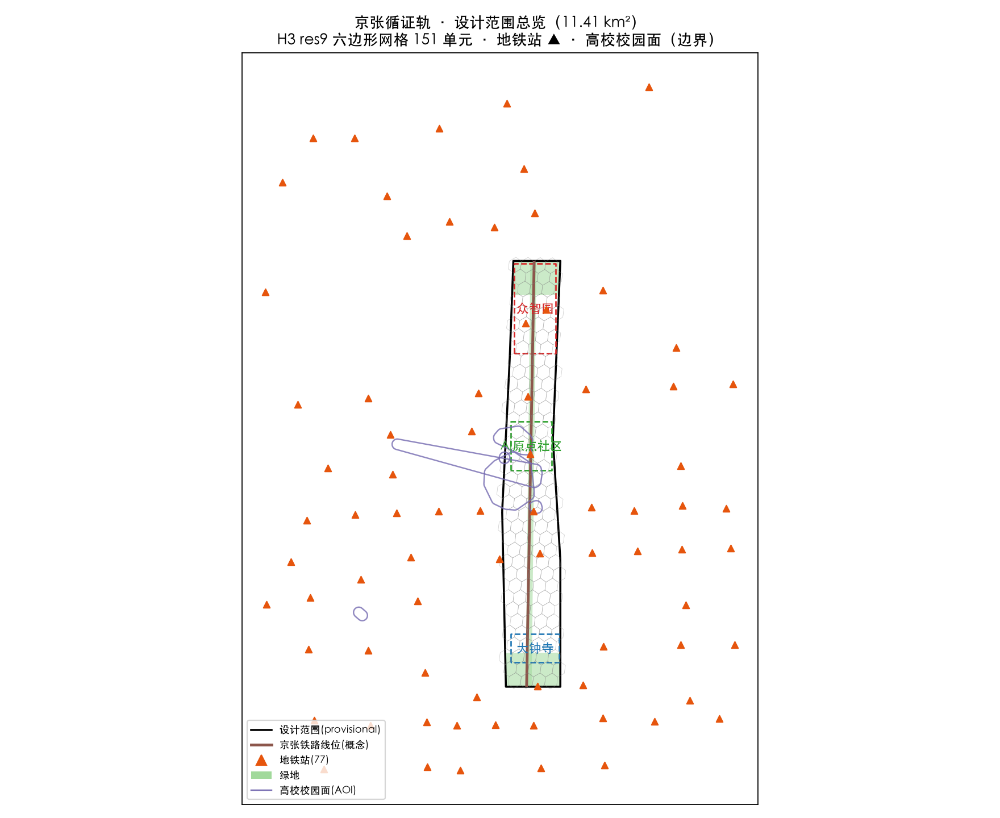
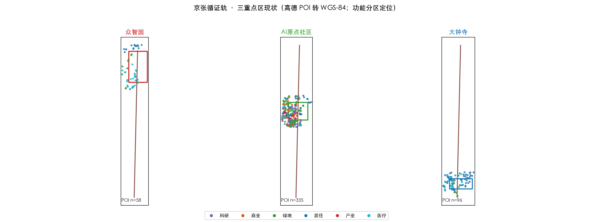
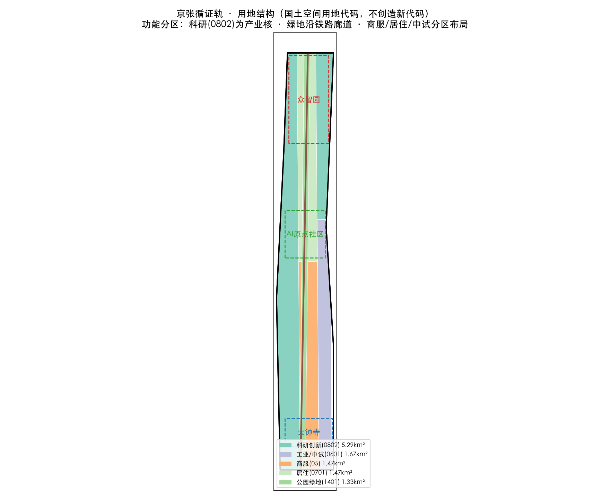
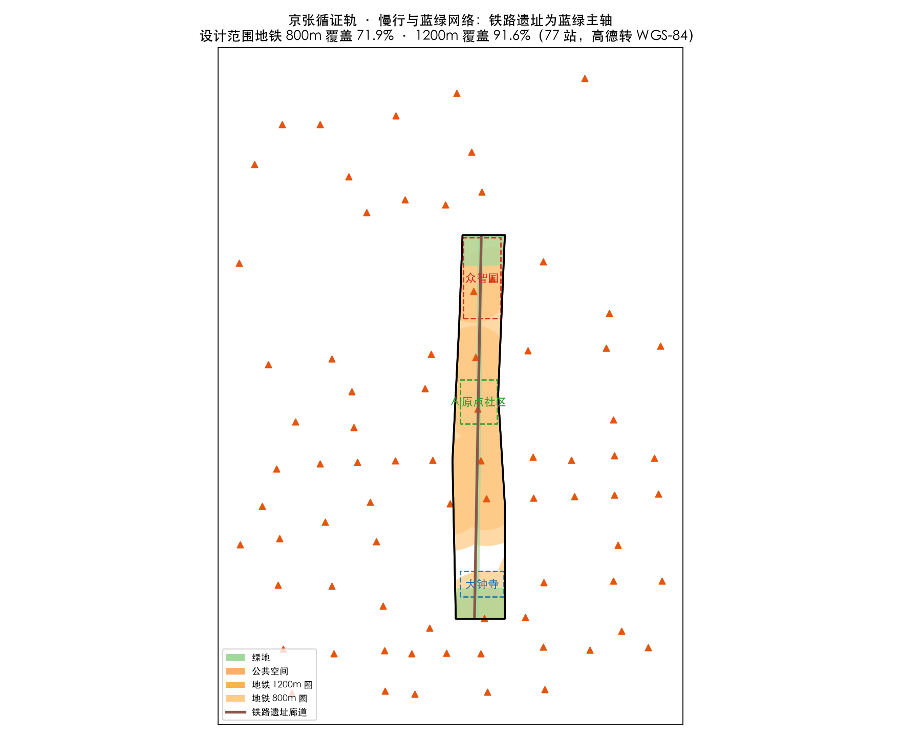
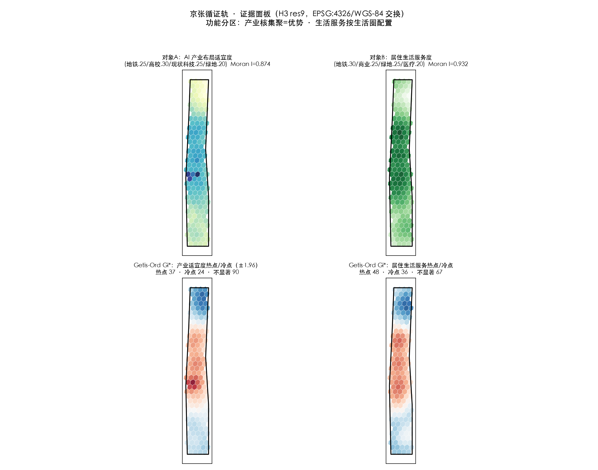

# Jing-Zhang Evidence Rail: A Verifiable, Incremental AI Public Innovation Belt

## Why "Evidence Rail": One Track, Two Meanings

More than a century ago, the Beijing–Zhangjiakou Railway was the first mainline railway independently surveyed, designed and built by Chinese engineers. In an era when foreign powers claimed that "China cannot build its own railway," Zhan Tianyou and the builders used indigenous techniques — switchback lines, vertical-shaft construction — to lay the line through difficult terrain. The real output of that railway was not the track itself; many sections no longer carry trains and have become the park beneath our feet. What endured was the fact that **"we Chinese can build it ourselves" was proven once** — changing everyone's judgment of what was possible. Independent innovation, empirical pursuit, and getting things done under constraints: this is the deepest gene the Beijing–Zhangjiakou legacy bequeaths to this innovation belt [source:OFFICIAL-ANNOUNCEMENT] [source:AGENT-TASKBOOK].

This proposal is named "Evidence Rail" as a contemporary translation of that history:

- **The first meaning of "rail" is the Beijing–Zhangjiakou railway heritage** — a roughly 9-km linear public-space spine that is the material carrier of history and publicness. All spatial strategies revolve around this track under the principle of "do not destroy, renovate with care, renew incrementally" [source:AGENT-TASKBOOK].
- **The second meaning of "rail" is the "track" of AI participation in planning** — a reusable, testable, accountable working method for intelligent agents. This proposal is generated by an AI agent that does not pretend to possess a human planner's on-site judgment. Instead, it runs on a track where "evidence is traceable, metrics are recomputable, assumptions are reviewable, and conclusions are reversible." Evidence-based means every section of this track is inspected [depth:existing_conditions_diagnosis].

The two meanings converge here: **just as the Beijing–Zhangjiakou Railway proved with indigenous technology that "Chinese people can build it themselves," this proposal hopes to demonstrate through a transparent evidence chain that "an AI agent can serve as a rationalizing tool in urban design decision-making — without overstepping and with accountability."** This is not about AI replacing planners. It is about AI serving as a rationalizing instrument within a (post-)positivist epistemology, achieving reflexivity through evidence grading, boundary statements, counterfactual checks and self-check loops — resolving technical reliability first (reproducible data, recomputable models, error-free workflows) before addressing other values.

---

## Design Basis and Source Register

This formal proposal takes the Pre-qualification Announcement for the Centennial Jing-Zhang AI Innovation Belt International Urban Design Solicitation (published by the Haidian Branch of the Beijing Municipal Commission of Planning and Natural Resources) as its primary basis, and uses the provisional rough boundaries, key areas, enums, indicators and source lists registered by the maintainers in `brief/site-package/` as machine-readable bases. The AI agent must read `design_brief.json`, `allowed_design_space.json`, `sources.json`, `enums/`, `ranges/`, `schemas/`, `data/source_registry.json` and `data/processed/agent_fact_pack.md` before generating the proposal, and use `project_scope_summary.csv`, `agent_task_requirements.csv`, `source_use_matrix.csv`, `missing_data_checklist.csv` to establish task, scope, source-usage and gap inventories. Every design judgment must decompose into traceable sources, recomputable metrics, checkable layers and human-reviewable assumptions. The announcement requires the proposal to reach the urban design depth of regulatory detailed planning and of comprehensive implementation planning; narrative text therefore cannot substitute for GeoJSON, metric tables, A3 booklets, A0 boards and HTML exhibits [source:OFFICIAL-ANNOUNCEMENT] [source:AGENT-TASKBOOK] [depth:existing_conditions_diagnosis].

The proposal is not a standalone vision text but an outcome organized from the announcement, the agent open-call taskbook and site materials; this section places only the most critical bases next to judgments. Complete source and standard coverage is stored in `sources.json`, `standard_matrix.json` and `design_depth_matrix.json`, not repeated in the narrative.

Source-register usage boundaries [source:SOURCE-REGISTRY]:

- `data/source_registry.json` records usage boundaries of public, cleared and provisional materials.
- Current summary: 7 formal-usable sources, 1 background source, 1 provisional-only source.
- The agent must not upgrade background_only or provisional_only materials into official boundaries, statutory regulatory plans, formal scoring bases, or government implementation commitments.

Where official `SITE_BOUNDARY` or `KEY_AREA` polygons are not yet available, this scaffold uses `brief/site-package/geometry/provisional_boundaries.geojson` to generate the temporary formal package. `geometry/site_boundary.geojson` and `geometry/key_areas.geojson` in the submission must be marked `provisional_constraint`, `official_boundary=false`, usable only for proposal generation, self-check, visualization and design discussion — not as official redlines, approval bases, precise area bases or statutory control conclusions. This organizer-side data gap does not block content scoring; after official polygons replace them, site boundary, key areas, land use, roads, green space, public space, buildings, phasing and metrics must all be recomputed [data:geometry/site_boundary.geojson#SITE-001] [metric:site_area_sqm] [data:geometry/key_areas.geojson#PROV-KEY-001] [metric:key_area_count].

---

## Methodology: Evidence-based Incremental Participatory Planning (EBIP)

The methodological framework of this proposal is **Evidence-based Incremental Participatory Planning (EBIP)**, built on four pillars. It is not imported wholesale from any single external theory; it synthesizes this agent's capability boundaries, the Chinese planning context, and the competition's machine-auditability requirements.

1. **Empirical basis (post-positivism × pragmatic rationality)**: Knowledge is provisional and context-bound, yet insists on empirical evidence, verifiability and reproducibility. Every claim in this proposal corresponds to a GeoJSON feature, a metric ID or a source record that can be mechanically recomputed [source:OFFICIAL-ANNOUNCEMENT]. Decisions follow the six steps of pragmatic rationality — goals, alternatives, consequences, choice, implementation, evaluation — without pursuing the impossible "pure rational" optimum.
2. **Incremental decision-making (successive limited comparisons)**: The proposal does not promise a final blueprint; it offers a "minimum implementation contract + versioned iteration." This shares a mechanistic affinity with China's long-standing reform practice of "pilots first, crossing the river by feeling the stones, testing in practice" — starting with small-scale pilots (e.g., an OPC one-person-company industrial park and other lightweight vehicles), then expanding step by step on evidence, without setting grandiose and unrealistic goals [depth:phasing_implementation].
3. **Plural calibration (participation, inclusion, and the necessity of human participation)**: Design "checkable alternative schemes" and "ordinary paths" (account-free, technology-free services) for different user groups (researchers, entrepreneurs, enterprises, residents, the elderly and people with disabilities); distinguish "soliciting input" from "cultivating long-term community capacity." **This agent cannot conduct field surveys, door-to-door interviews, or sense place atmospheres, nor does it possess empathy** — therefore "human-centered" judgments must be completed by human planners and professional teams. The agent's role is to provide a verifiable evidence base and a recomputable design skeleton. **Acknowledging AI's limits is precisely the precondition for ensuring human values are not usurped by technical tools.**
4. **AI reflexivity (rationalized self-audit)**: Evidence-grading audit (strictly distinguishing formal / provisional / background_only / unknown / design_target, forbidding upgrades), boundary statements ("what can be proven / what cannot be proven" for each key claim), counterfactual checks ("if the premise fails, how does the conclusion change"), and a self-check loop (self_check / preflight mechanical validation — **PASS only proves the package's internal structure is recomputable, not on-site performance**).

**Principle for distilling domestic and international cases**: This proposal takes a critical, selective attitude toward domestic and international innovation districts, urban renewal, transit-oriented development and AI-city practices — cases offer only mechanistic inspiration (scenario openness, testbeds, developer communities, data governance, operating systems), not value premises or directly transplantable templates. All formal claims are ultimately grounded in Chinese official sources; local Haidian realities and upper-level plans are calibrated first, then the applicability of any external method is assessed. On renewal-interest issues, the proposal uses concrete operational phrasing such as "whether vulnerable groups, small vendors and small business owners are displaced, and how renewal benefits are distributed," rather than abstract theoretical labels; the proposal fully reflects the institutional particularity of China's socialist market economy — planning is a means of national plans and goals, involving consultation and cooperation among the state, city government, public-sector entities, private enterprises and citizens, rather than a zero-sum game. The distillation analysis of domestic and international cases will be supplemented in later versions (see the reserved "Case Distillation" section).

---

## Three-Level Scope Framework

The proposal organizes work by the three levels defined in the announcement: the research scope (43.6 km²) addresses the AI industry ecosystem, strategic positioning, innovation chain and future urban form; the design scope (11.4 km²) covers the urban area and industrial zones within 1–2 km around the Beijing–Zhangjiakou heritage park, requiring an overall renewal framework, industrial spatial layout, transport/municipal support and urban-form control; the key-area scope (368.4 ha) covers three detailed design areas requiring functional programs, building scale, retain/renovate/demolish classification, public-space connectivity and transport organization. The three levels are mapped item by item in `compliance_matrix.json`, ensuring that each mandatory task in announcements 1.3, 1.4, 1.5 and agent.1–agent.6 has chapter, layer, metric, drawing and HTML evidence [depth:three_level_scope_framework] [depth:overall_spatial_structure] [data:geometry/site_boundary.geojson#SITE-001] [data:geometry/key_areas.geojson#PROV-KEY-001] [standard:PROJECT-OFFICIAL-ANNOUNCEMENT].

The three levels are not disconnected drawing sets. Research defines the industry chain and urban-form judgment; design lands the judgment in renewal projects, spatial structure and facility capacity; key-area detailed design verifies the implementability of specific plots, buildings, transport, public space and AI application scenarios. When generating the proposal, the agent must first lock the currently adopted provisional boundary and constraints, then generate land use, buildings, roads, green space, public space, phasing and AI service nodes, and finally recompute metrics from these layers and explain in the narrative which conclusions remain limited by the provisional boundary. Any area, ratio, scale or project count that cannot be recomputed from structured data must not be written as a formal conclusion.

The proposed overall concept is the **"Evidence Rail: one belt, three cores, multi-node scenarios, blue-green slow-traffic compound loop"**:

- **One belt**: the Beijing–Zhangjiakou heritage park vitality belt — the historical and public-space spine, the material carrier of the "rail," and the public base into which all AI scenarios are embedded;
- **Three cores**: Zhongzhiyuan AI Autonomous Innovation Acceleration Area (trusted test garden), Beijing AI Origin Community (open transformation street), Dazhongsi AI Industry Cluster (urban experience living room) — corresponding to the three key areas [data:geometry/key_areas.geojson#PROV-KEY-001] [data:geometry/key_areas.geojson#PROV-KEY-002] [data:geometry/key_areas.geojson#PROV-KEY-003];
- **Multi-node scenarios**: 10+ AI scenario cards, 5+ user profiles, 3+ industrial test-verification scenarios, located in concrete layers and metrics;
- **Compound loop**: the linkage of slow traffic, green space, public space and activity routes.

| Level | Design question | Proposed answer | Data anchor |
| --- | --- | --- | --- |
| Research scope | How to organize the AI industry ecosystem and future urban form | Build an innovation chain of "university genesis–open-source collaboration–enterprise transformation–public experience–international dissemination" | compliance_matrix.json, standard_matrix.json |
| Design scope | How to map industry space, urban renewal, transport/municipal and urban form | Land use, buildings, roads, green space, public space and phasing layers jointly express | [data:geometry/land_use.geojson#LU-001], [data:geometry/roads.geojson#ROAD-001] |
| Key-area scope | How the three areas reach detailed-design depth | Propose positioning, spatial actions, AI scenarios and implementation dependencies for each | [data:geometry/key_areas.geojson#PROV-KEY-001], [data:geometry/key_areas.geojson#PROV-KEY-002], [data:geometry/key_areas.geojson#PROV-KEY-003] |

---

## Research Scope: Industry and Future Urban Form

The core task of the research scope is to build a world-class AI innovation ecosystem. The proposal reviews Haidian's universities and institutes, leading enterprises, computing/algorithms/data factors, incubators, listed companies, unicorns and technology-service resources, and proposes a spatial coordination framework for the AI innovation chain, industry chain, talent chain and urban service chain [source:AGENT-TASKBOOK] [standard:PROJECT-AGENT-OPEN-CALL-TASKBOOK].

**Naming and identity system**: The Evidence Rail naming and logo direction is "parallel double lines and open nodes" — two unequal-width lines correspond to the century-old railway and the continuously iterating digital collaboration, and three nodes correspond to Zhongzhiyuan, AI Origin and Dazhongsi. The naming system serves the recognizability of the three positionings — "Centennial Jing-Zhang Cultural Belt, Urban AI Living Experience Belt, AI Integration Innovation Belt" — and links to the industry ecosystem, public space and cultural resources; it is only a conceptual visual system, with trademark, typography and accessibility review left to professional teams [standard:PROJECT-AGENT-OPEN-CALL-TASKBOOK].

**Innovation ecosystem organization**: The space is organized around the five-stage innovation chain of "university genesis–open-source collaboration–enterprise transformation–public experience–international dissemination." Haidian hosts over 2,000 AI enterprises and is the core engine of China's AI industry [source:OFFICIAL-ANNOUNCEMENT]; on this basis the proposal sets out the three positionings, five functions and the "three areas, two wings" spatial coordination framework. Future urban form research answers how AI changes work, living, socializing, learning, transport and public services, and lands AI transport systems, continuous green space, innovation service facilities and an international living-working atmosphere into locatable functional zones, nodes, corridors and scenarios [depth:overall_spatial_structure].

**Industrial verification and operation mechanisms**: Global AI innovation activities, developer communities, open scenarios and pilgrimage routes are all expressed as "conceptual suggestions / reference proposals / materials for professional teams to deepen," not as confirmed government events or implementation arrangements. Industrial strategy metrics, AI innovation indices, talent density and spatial supply types are written into the indicator system, with explicit labeling of which are official, which are design suggestions, and which await formal data calibration [standard:MOHURD-URBAN-DESIGN-MEASURES].

---

## Design Scope: Urban Renewal at Regulatory-Detailed-Planning Depth

The design scope requires urban design depth equivalent to regulatory detailed planning. The proposal sets out the overall renewal spatial structure, inefficient-space identification, renewal project list, implementation policy suggestions, industrial function ratios, spatial organization model, total building scale and comprehensive capacity assessment [standard:MOHURD-CONTROL-DETAILED-PLANNING].

**Overall renewal framework (retain/renovate/demolish)**: "Retain" is the primary principle; large-scale demolition is avoided. Spatial strategy is based on precise spatial classification — what to retain, what to renovate, what genuinely requires change — rather than one-size-fits-all demolition and rebuilding. As a linear heritage, the Beijing–Zhangjiakou railway site is **preserved within a buffer zone, renovated without destroying the original landscape, and especially protected from over-commercialization as a tourist attraction**; protection scope and construction-control belts require checking relevant regulations, and where no ready-made values exist, a model is designed and computed on the basis of visual corridors, landscape sensitivity and heritage-value gradient, marked as provisional conceptual suggestions and strictly distinguished from official determinations [data:geometry/constraints.geojson#CON-007] [depth:retain_renovate_demolish] [depth:development_intensity_controls].

**Land-use structure**: `geometry/land_use.geojson` fully covers the design boundary without overlaps. Land-use codes **follow the territorial spatial planning system entirely** (the "Guide to Land Use Classification for Territorial Spatial Survey, Planning, Use Control") and no new codes are created [standard:MNR-LAND-USE-CLASSIFICATION-GUIDE]:

- AI R&D, open-source collaboration, software and algorithms → **0802 Scientific Research Land**
- AI computing, hardware pilot manufacturing → **Industrial land (M class)** codes
- Exhibition experience, commercial consumption, international exchange → **05 Commercial Service Land**
- Residential support → **07 Residential Land**; public administration and services → other corresponding 08 codes
- Green and open space → **14 Green Space and Open Space Land** (1401 park green space / 1402 protective green space)

For new functional types such as "new-industry land": express with existing codes first, then annotate with additional fields such as `planning_status=conceptual_partition_pending_official_controls` (following reviewed peer practice), without inventing new land-use codes [data:geometry/land_use.geojson#LU-001].

**Buildings and development intensity**: `geometry/buildings.geojson` expresses renewal building footprints or retained building footprints, with `metric:building_footprint_area_sqm` recomputing the footprint area. Content involving building height, development intensity, road redlines, setbacks and facility standards is written as "pending confirmation of official regulatory conditions" where no official control conditions exist — agent-inferred values must not masquerade as approved indicators [depth:land_use_layout].

---

## Key-Area Detailed Design

Key-area detailed design is mandatory, checked by [depth:three_key_area_detailed_design] for comprehensive-implementation-planning depth. Merely describing "build a demonstration zone" without functional, building, transport, public-space and implementation-project evidence is treated as incomplete.

### Zhongzhiyuan AI Autonomous Innovation Acceleration Area (Trusted Test Garden)

Detailed scheme around national AI platforms, full-stack independent innovation, standard-setting, safety governance, industrial exhibition, external transport, Qinghe culture, low-carbon green innovation interaction environment and green-space AI scenarios [data:geometry/key_areas.geojson#PROV-KEY-001]. Spatial actions: the signature scenario is the "Safety Governance Sandbox," translating standard-setting, safety evaluation and model red-team testing into visitable, bookable and supervisory demonstration and collaboration nodes; along the Qinghe frontage, shape the "Qinghe Low-Carbon Innovation Corridor," combining green space, stormwater, walking/cycling and AI display. Functions are mainly 0802 scientific research land, supplemented by M-class industrial land for computing and pilot manufacturing, with green space anchored on the Qinghe blue-green corridor.

### Beijing AI Origin Community (Open Transformation Street)

Detailed scheme around near-campus innovation, incubation and transformation, talent zone, open-source system, brand activities, building retain/renovate/demolish, results publication, residential support, campus-park slow-traffic connections and transit-station integration [data:geometry/key_areas.geojson#PROV-KEY-002]. Spatial actions: the signature scenario is the "Near-Campus Transformation Street," organizing incubation, exhibition, legal, IP and investment services; the "Open-Source Publishing Hall" serves universities, open-source communities and startup teams with result publishing, code-contribution display and small roadshows. Functions mix 0802 scientific research land with 07 residential support, stitching slow-traffic connections between Tsinghua/Peking University campuses and the park.

### Dazhongsi AI Industry Cluster (Urban Experience Living Room)

Detailed scheme around leading enterprises, agents, intelligent terminals, content consumption, data factors, digital assets, commercial services, composite use of planned green space, Dazhongsi station integration and four-quadrant pedestrian connectivity at intersections [data:geometry/key_areas.geojson#PROV-KEY-003]. Spatial actions: the "Dazhongsi International Roadshow Living Room" serves display, negotiation, media publication and international exchange for agent, intelligent-terminal and content-consumption enterprises; the "Data-Factor Meeting Room" presents the urban service interface of data-factor and digital-asset circulation under the premise of compliance, authorization and auditability; four-quadrant pedestrian connectivity at Dazhongsi station is the key spatial action for transit integration [data:geometry/public_space.geojson#PUBLIC-001]. Functions are mainly 05 commercial service land, with composite use of planned green space.

---

## AI Innovation Ecosystem, User Profiles and AI+ Scenarios

The proposal builds spatial-demand profiles for AI talent and enterprises, covering R&D offices, open-source collaboration, result publishing, enterprise services, talent housing, social learning, consumption, sports and leisure, and international exchange [source:AGENT-TASKBOOK]. AI+ scenarios cover the directions proposed in the announcement — transport, services, consumption, healthcare, education, legal, life services — forming both industrial-development scenarios and AI-empowered urban-function scenarios. Each scenario states its service objects, spatial location, data sources, privacy boundaries, human-review mechanism and operating entity [depth:scenario_and_user_profile].

| User profile | Typical needs | Spatial response | Self-check boundary |
| --- | --- | --- | --- |
| Open-source developers | Publishing, collaboration, testing, community reputation | Origin community open-source hall, public code wall, night collaboration space | No personal behavior tracking; activity data aggregated only |
| Startup teams | Low-cost offices, computing entry, product testbed | Zhongzhiyuan shared test ground, edge-computing service points, standards-governance consulting | Computing and data services require separate authorization |
| Leading-enterprise visitors | Exhibition, business, international reception, recruitment | Dazhongsi international roadshow living room, station connection, public space around key enterprises | Enterprise marks and cases require clearance |
| Surrounding residents | Commuting, leisure, community services, low-disruption renewal | Heritage park slow-traffic loop, embedded community services, staged night lighting and activities | No resident profiles for commercial recommendation |
| University faculty and students | Transformation, cross-campus collaboration, daily walking | Campus-park slow-traffic stitching, transformation stations, AI education experience points | Campus data and research outputs require authorization |
| Elderly and people with disabilities | Accessibility, legibility, technology-free services | Ordinary-path design: paper services, human windows, account-free entrances | Existing services must not be weakened by AI-ization |

| Scenario card | Spatial carrier | Design description |
| --- | --- | --- |
| 01 Open-Source Publishing Hall | Beijing AI Origin Community | For universities, open-source communities and startups: result publishing, code-contribution display and small roadshows |
| 02 Safety Governance Sandbox | Zhongzhiyuan | Translate standard-setting, safety evaluation and model red-team testing into visitable, bookable, supervisory demonstration nodes |
| 03 Edge-Computing Station | Design-scope nodes | Combined with public services, enterprise services and low-carbon energy strategy as a new-infrastructure prototype to deepen |
| 04 AI Slow-Traffic Navigation | Heritage park vitality belt | Interpretable wayfinding and low-intrusion sensing to identify slow-traffic gaps, congestion nodes and accessibility needs |
| 05 Dazhongsi International Roadshow Living Room | Dazhongsi AI Industry Cluster | Display, negotiation, media publication and international exchange for agent, terminal and content enterprises |
| 06 Qinghe Low-Carbon Innovation Corridor | Zhongzhiyuan Qinghe frontage | Combine green space, stormwater, walking/cycling and AI display as the park's public living room |
| 07 Near-Campus Transformation Street | Beijing AI Origin Community | For university transformation: incubation, display, legal, IP and investment services |
| 08 Data-Factor Meeting Room | Dazhongsi | Present the urban service interface of data-factor and digital-asset circulation under compliance, authorization and auditability |
| 09 AI Life-Service Model Street | Community-commerce junction | Land healthcare, education, legal and life-service AI+ scenarios in operable small-block space |
| 10 Global AI Week Route | Belt public-space system | A walkable, shareable experience route from heritage culture, open-source community, industrial display to international roadshow |
| 11 AI Slow-Traffic Gap Identification | Heritage park slow-traffic loop | Interpretable wayfinding and low-intrusion sensing to identify gaps, congestion and accessibility needs (operational form of 04) |
| 12 Event Safety and Crowd Heat | Public-space system | Support event safety-risk identification; aggregated data only, no personal profiles |

**AI governance boundary (this agent's position)**: Urban agents may assist in identifying slow-traffic gaps, public-space heat, facility maintenance, enterprise-service needs and event safety risks, but **cannot replace planning approval, output unauthorized personal profiles, or claim official implementation commitments**. All AI scenario nodes enter structured layers or the compliance matrix so reviewers can see their relation to industry, space and public interest [depth:scenario_and_user_profile] [data:geometry/public_space.geojson#PUBLIC-001] [data:geometry/roads.geojson#ROAD-001] [data:geometry/green_space.geojson#GREEN-001] [metric:public_space_ratio] [metric:green_ratio].

---

## Land Use, Building Scale and Retain/Renovate/Demolish

Land-use codes follow the territorial spatial planning system (see "Design Scope"), without creating new codes [standard:MNR-LAND-USE-CLASSIFICATION-GUIDE]. Building scale and retain/renovate/demolish classification follow the principle of "retain first, precise classification, incremental renewal":

- **Retain**: the Beijing–Zhangjiakou railway alignment, historic buildings, well-preserved communities, and underutilized existing stock that can be activated;
- **Renovate**: interface buildings along the heritage park, functional repositioning of industrial buildings (R&D-ization, service-ization), and embedded community stock;
- **Change (where genuinely required)**: only a small number of plots confirmed by precise spatial classification as having structural-safety or severe functional-conflict issues, and only with evidence of ownership, funding and approval pathway; otherwise listed as implementation risk rather than commitment [depth:retain_renovate_demolish] [data:geometry/buildings.geojson#BLDG-001] [data:geometry/land_use.geojson#LU-001].

Industrial function ratios and total building scale await recomputation once regulatory conditions are confirmed; the current version expresses conceptual partitions with `planning_status` fields marked as pending official confirmation.

---

## Transport, Rail, Municipal Works and Public Services

The proposal sets out spatial layout and implementation pathways for transit-station integration, road micro-circulation, non-motorized parking, parking supply, innovation service platforms, talent life services, new infrastructure, distributed energy and edge computing [depth:traffic_rail_slow_parking] [depth:municipal_new_infrastructure] [data:geometry/roads.geojson#ROAD-001].

- **Slow traffic and rail connection**: With Dazhongsi station and other rail stops as nodes, build a "rail + slow traffic" last-kilometer network; the heritage-park slow-traffic loop stitches gaps along the route [data:geometry/public_space.geojson#PUBLIC-001].
- **Micro-circulation**: short blocks and a dense street network, avoiding super-blocks that impede walking (echoing the diversity conditions of urban vitality).
- **Municipal works and new infrastructure**: distributed energy, edge computing, smart lamp posts expressed as "prototypes to deepen"; where road redlines, utilities and fire-protection conditions are missing, state them as pending via assumptions rather than as approved conditions [data:geometry/constraints.geojson#CONSTRAINTS].

---

## Blue-Green Space, Public Space and Urban Form

Green-space and public-space ratios are explained in the narrative; full recomputation is stored in `metrics.json` [depth:blue_green_public_space] [data:geometry/green_space.geojson#GREEN-001] [data:geometry/public_space.geojson#PUBLIC-001] [standard:MOHURD-URBAN-DESIGN-MEASURES].

- **Blue-green intelligence loop**: Based on the heritage park, Qinghe and Xiaoyuehe, form a blue-green public-space system of park green space + waterfront corridors + cycling routes; park design avoids over-"parkification," preserving real street life and diverse functions (street eyes, small commerce, public characters), embedding AI scenarios into daily life rather than isolated tech showpieces.
- **Three AI pilgrimage landmarks and honor system**: Along the heritage park, set up a contribution honor wall, milestones and open-source result display nodes; selected schemes and contributors are recorded in stone — **carved with the contributor's account name, not the model's name** — motivating the humans behind the screens. As conceptual suggestions, subject to deepening by professional teams [source:AGENT-TASKBOOK].
- **Urban form**: Blend Jing-Zhang railway heritage culture, Zhongguancun innovation culture and AI innovation culture, using cultural resources such as Qinghuayuan Railway Station, and propose urban tone, architectural form, roof morphology, massing, interfaces and public-art guidance. All brands, fonts, images, portraits and enterprise marks must have cleared sources; urban-form control distinguishes official control, design suggestions and pending conditions, strictly forbidding pseudo-precise control lines without heritage-protection or regulatory-planning basis [data:geometry/green_space.geojson#GREEN-001].

---

## Renewal Project List, Implementation Policy and Phasing

The implementation plan forms a reviewable renewal project list, stating location, type, function, responsible entity, dependencies, implementation stage, risks and evaluation metrics [depth:renewal_project_list] [depth:phasing_implementation] [data:geometry/phasing.geojson#PHASE-001].

| Project ID | Project name | Type | Key dependencies | Evidence anchor |
| --- | --- | --- | --- | --- |
| JZ-01 | Heritage park slow-traffic gap stitching | Public space/transport | Road redlines, under-bridge space, traffic organization review | [data:geometry/roads.geojson#ROAD-001] |
| JZ-02 | Zhongzhiyuan Qinghe innovation interface | Blue-green space/industry display | River blue lines, ecology and flood conditions | [data:geometry/green_space.geojson#GREEN-001] |
| JZ-03 | Origin community near-campus transformation street | Urban renewal/industry services | Campus boundary, ownership, ground-floor uses | [data:geometry/buildings.geojson#BLDG-001] |
| JZ-04 | Dazhongsi station four-quadrant pedestrian connectivity | Transit integration/slow traffic | Rail station, intersection, municipal utilities | [data:geometry/public_space.geojson#PUBLIC-001] |
| JZ-05 | AI public service and edge-computing node | New infrastructure/public service | Energy, computing, safety, operating entity | [data:geometry/constraints.geojson#CONSTRAINTS] |
| JZ-06 | Global AI Week public route | Operation/brand | Public-space permits, event safety, copyright clearance | [data:geometry/phasing.geojson#PHASE-001] |
| JZ-07 | OPC one-person-company industrial park pilot | Industry/pilot | Investment-attraction mechanism, SME services, computing entry | [data:geometry/land_use.geojson#LU-001] |

**Phasing** (aligned with five-year-plan rhythm, without grandiose goals):

| Stage | Period | Focus |
| --- | --- | --- |
| Near term | ~5 years (aligned with the five-year plan) | Pilots first: heritage-park slow-traffic stitching, OPC one-person-company park and other small-scale pilots, lightweight AI scenario facilities and operation activities |
| Mid term | 5–10 years | Gradual realization of the three cores: transformation street, roadshow living room, safety sandbox; transit-station integration |
| Long term | ~20 years (comparable to the Beijing master plan) | Whole-area renewal governance framework, international innovation activity and honor systems, full-lifecycle iteration |

The annual activity system (Q1 open-source contribution season, Q2 scenario open day, Q3 developer conference, Q4 Jing-Zhang AI Week) states operating targets, frequency, responsibility boundaries, conversion paths and risks — no slogan-only content. Content whose formal regulatory planning, municipal, transport and ownership conditions are unconfirmed is explicitly marked as pending, not committed [data:geometry/phasing.geojson#PHASE-001].

---

## Indicator System, Area Recalculation and Compliance Matrix

The indicator system covers design-scope area, key-area area, green/public-space ratios, building footprints, renewal project count, AI scenario nodes, slow-traffic connectivity, industrial-space indicators, talent-service indicators and self-check status [depth:metrics_recalculation] [metric:site_area_sqm] [data:geometry/green_space.geojson#GREEN-001]. All known indicators must be recomputable from GeoJSON or trusted sources; unknown indicators state reasons and preconditions for formal submission.

Indicators are managed in three categories:

1. **Spatial indicators recomputable from submitted geometry** (boundary area, green ratio, public-space ratio, building footprint, phasing area) → `metrics.json`;
2. **Control indicators requiring official regulatory planning or taskbook attachments** (FAR, building height, building density, setbacks, road redlines, facility standards) → `assumptions.json`, marked pending;
3. **Performance indicators requiring sustained operation/industry data calibration** (AI innovation index, talent density, service satisfaction, slow-traffic accessibility, event participation, scenario usage frequency) → `compliance_matrix.json`, marked as design targets rather than approved conditions.

The compliance matrix is the master control for task responsiveness: each announcement task and agent-taskbook task maps to report chapter, layer, metric, drawing, HTML page, source, assumption and self-check item. Failure to cover any mandatory task in announcements 1.3, 1.4, 1.5 or agent.1–agent.6 disqualifies the proposal from formal professional scoring. Results of `scripts/spatial_review.py` and `scripts/visual_review.py` are important evidence for the formal self-check.

---

## Case Distillation

This section critically distills domestic and international innovation-district, urban-renewal, transit-oriented-development and AI-city practice cases. **Principle**: take only mechanistic inspiration (scenario openness, testbeds, developer communities, data governance, operating systems, incremental implementation); do not import value premises; foreign cases are not directly transplantable templates — all formal claims are ultimately grounded in Chinese official sources and calibrated against Haidian realities and upper-level plans. Case sources are public reports or industry research (`usable_for_formal=no` in `sources.json`) and serve only as mechanistic corroboration.

### C-1 New York Hudson Yards and the High Line: heritage activation vs megadevelopment

- **Parallels**: both are "rail/industrial heritage + urban innovation district" cases, structurally analogous to the JZ rail-ruins activation; the High Line's "preserve the alignment + light-touch landscape" approach matches our orientation of "preserve the tracks, do not damage the original landscape, prevent over-commercialisation" for the JZ Ruins Park [source:TOP-HY-ANALYSIS].
- **Mechanistic inspiration**: ① an industrial-heritage public-space spine can anchor surrounding renewal; ② free public space improves affordability and all-age friendliness (consistent with the Dianping feedback that the park is free) [source:DZDP-PARK].
- **Lessons to avoid (key)**: Hudson Yards-style megadevelopment has been widely criticised for displacing original residents and businesses, providing insufficient affordable housing, and weakening accessibility and affordability [source:TOP-HY-ANALYSIS]. Our counter-principles: no "clear-and-rebuild" megadevelopment; "retain" as the first principle; incremental renewal; and continuously answering concrete questions such as "whether vulnerable groups, small vendors and small business owners are displaced, and how renewal benefits are distributed" [standard:progressive_updating].

### C-2 Shenzhen Nanshan and the "DJI alumni": clusters are about talent mobility

- **Mechanistic inspiration**: empirical research (Fallick et al. 2006) measured a monthly job-hopping rate of ~2.41% in the Silicon Valley computer industry — the indicator of a living cluster is **talent mobility between firms**, not firm count or floor area [source:TOP-NANSHAN]. The Nanshan case shows that physical agglomeration mainly lowers the friction of changing jobs (no need to move house, change schools or commute); tacit engineering knowledge "travels with people" and re-grows in new product categories (DJI alumni founded nearly 20 funded companies in energy storage, 3D printing, robotics and more).
- **Implication for Jing-Zhang**: the value of the AI Origin "industry core" lies in **lowering talent-mobility friction** — near-campus commuting, slow-mobility networks, shared facilities, open community networks and integrated talent services. This supports the functional-zoning stance: industry functions are relatively concentrated rather than uniformly scattered.
- **China-context calibration**: foreign accounts attribute mobility to a particular legal environment (unenforceable non-competes); in our context, mobility convenience rests mainly on public institutional supply — talent public services, social-security and career-development continuity, open innovation platforms, and flexible-employment safeguards (China's flexibly employed workers exceed 200 million) [source:TOP-NANSHAN]. The proposal therefore treats "talent services and mobility convenience" as infrastructure of the industry core, not slogans.

### C-3 The 31 "next Silicon Valleys" and the Pittsburgh comparison: fast vs slow variables

- **Mechanistic inspiration**: most of the 31 cities once dubbed "the next Silicon Valley" failed to replicate success; the Pittsburgh–Cleveland comparison shows that summits, funds and star companies ("fast variables") are usually **products, not causes, of innovation prosperity**; the real work is done by "slow variables" — talent, universities and infrastructure with decade-long payback periods ("capital is water; industry is the channel") [source:TOP-NEXTSV].
- **Implication for Jing-Zhang**: the proposal promises no "master blueprint" and does not treat summits, funds or events as outputs per se; instead it incrementally invests in slow variables — university co-built heritage preservation (knowledge production), public technology infrastructure (edge-computing nodes and testbeds), and talent services and community networks. This is the positioning of the Evidence Rail as **a slow-variable track**: growing talent, universities and infrastructure into the ground on a ten-year timescale.
- **Concentration vs equalisation**: the cases also indicate that innovation-cluster cultivation needs relatively concentrated resources rather than even spreading (the US Tech Hubs programme was criticised for diluting funds below critical mass) [source:TOP-NEXTSV] — at the industry side, this supports functional zoning: industry resources concentrate at AI Origin, while daily-life services are configured by life-circle, kept separate.
- **Chain-leader risk**: the Rochester lesson (Kodak/Xerox/Bausch & Lomb decline dragging the region) warns that the industry core should cultivate **diverse innovation actors** — a mixed ecology of large firms, research institutes, SMEs and one-person companies — so regional fortunes are not tied to a single chain leader [source:TOP-NEXTSV].

### C-4 One-person (nano) companies and the future park: from selling floor area to selling capability

- **Mechanistic inspiration**: solo founders now account for ~36.3% of new companies globally (H1 2025), and no-employee firms contribute the vast majority of new registrations; AI tools shrink the "optimal firm size" (one person directing a dynamic collaboration network of AI and global contractors) [source:TOP-ONEPERSON]. Park logic shifts accordingly: sell "capability" not "floor area" — bundled registration, compliance, cross-border payment and legal services; compute/API credits as rent offsets; and metrics moving to "density of high-output individuals".
- **Chinese institutional support**: the 2024 revised Company Law removed the cap on one-person companies; flexibly employed workers exceed 200 million — including both high-output individuals who choose this path and passively registered workers; "helping more workers become high-output individuals skilled in AI and digital tools" is a defining question of our time [source:TOP-ONEPERSON].
- **Implication for Jing-Zhang**: JZ-07 "OPC one-person-company park pilot" is therefore upgraded to a **"nano-company capability platform"** — its core products are compute access, bundled registration/compliance/cross-border services, an AI toolchain and flexible shared workspace, rather than conventional attraction (floor area + subsidy); metrics are density of high-output individuals and scenario usage frequency, not tenant count or leased area [metric:scenario_card_count].

**Distillation summary**: the four case groups converge on three stances of this proposal — ① heritage activation must be "light-touch and anti-displacement" (C-1); ② the essence of an industry core is talent mobility and knowledge spillover, favouring functional zoning over uniform distribution (C-2, C-3); ③ invest incrementally in "slow variables", sell "capability" not "floor area", and cultivate diverse actors (C-3, C-4). All mechanistic inspirations link back to Haidian realities and upper-level plans and serve only as design-orientation corroboration, not as grounds for formal claims.

---

## Risk, Copyright and Compliance

**Bilingual requirement**: This proposal is authored in Chinese as the primary file, with a full counterpart translation in `proposal.en.md`; A3/A0, HTML and text-bearing figures provide counterpart language copies, preferably using the competition's recommended translations in `docs/terminology-glossary.md`. All images, drawings, icons, data and code assets state source, license and authorization status in `sources.json` or `report/copyright_statement.md`. HTML pages must not load remote scripts, remote map tiles, remote fonts, iframes, forms or external APIs, and must not track reviewers.

**Risk and missing-data inventory**: The gaps listed in `missing_data_checklist.csv` — official boundary, key area, regulatory planning, roads, plots, buildings, municipal works, heritage protection and public services — must enter `assumptions.json`, the self-check and this risk section [depth:risk_missing_data] [data:geometry/constraints.geojson#CONSTRAINTS] [source:SITE-PACKAGE]. Any conclusion lacking official regulatory planning, road redlines, ownership, municipal works, fire protection or heritage-protection conditions is downgraded to pending confirmation.

**This agent's responsibility statement**: This proposal does not claim official approval, approved regulatory plans, final land ownership, final construction scale, or guaranteed implementation. The AI agent is responsible for facts, sources, copyright, spatial data, metrics and expression; it also declares its capability boundary — this agent cannot conduct field surveys, door-to-door interviews, or sense place atmospheres, and such on-the-ground judgments are listed as `unknown/pending` for professional teams to complete in the deepening stage. Maintainers and professional reviewers may require revision or rejection based on self-check results, spatial review and the compliance matrix.

---

## References

- brief/public-brief.md
- brief/site-package/design_brief.json
- brief/site-package/allowed_design_space.json
- brief/site-package/enums/
- brief/site-package/ranges/planning_limits.json
- data/processed/agent_fact_pack.md
- data/processed/project_scope_summary.csv
- data/processed/agent_task_requirements.csv
- data/processed/source_use_matrix.csv
- data/processed/missing_data_checklist.csv
- Full machine index: see `sources.json`, `metrics.json`, `compliance_matrix.json`, `standard_matrix.json` and `design_depth_matrix.json`
- This bibliography entry is based on the site-package registration; full sources and licenses are in the structured source list [source:SITE-PACKAGE]
