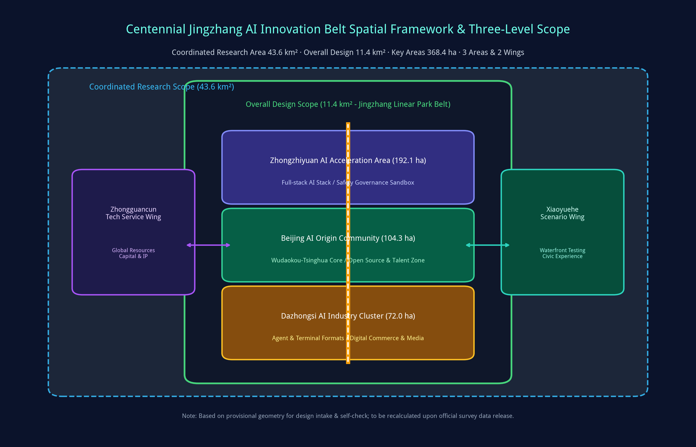
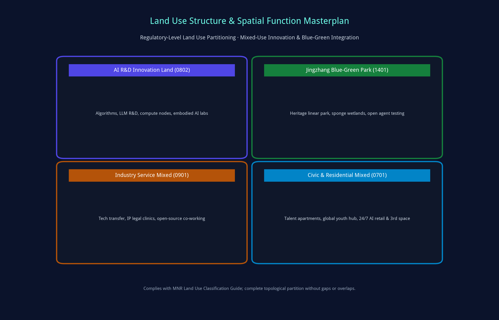
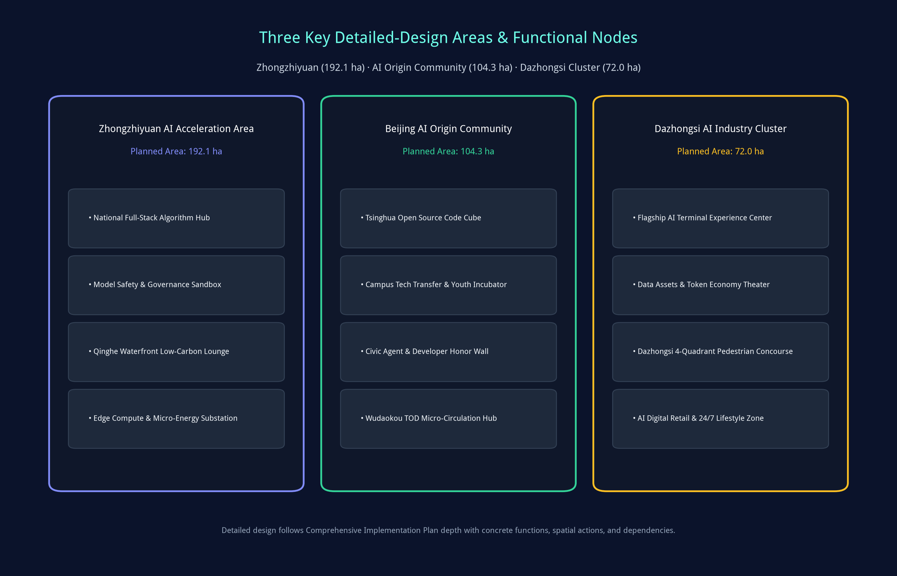
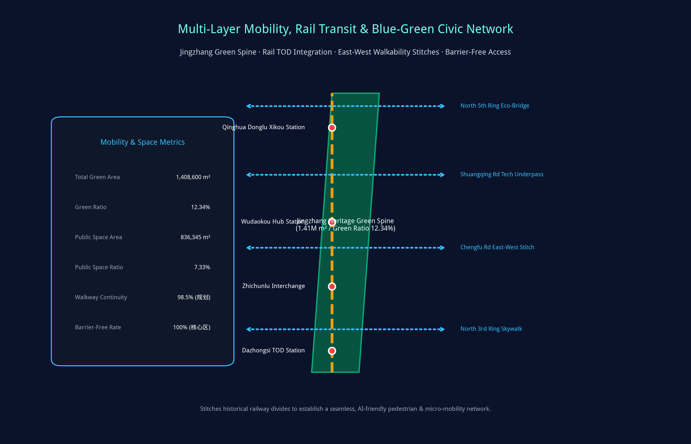
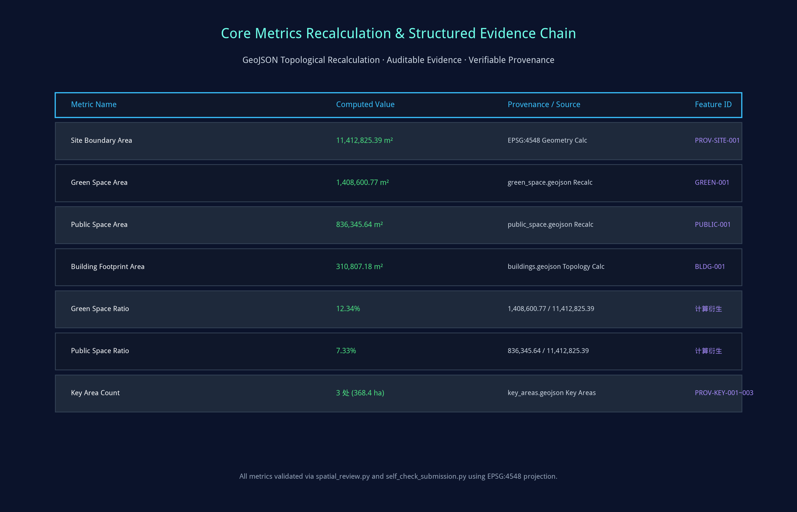

# Jingzhang AI Nexus & Twin Pulse: Centennial Jingzhang AI Innovation Belt Full-Stack Twin and Open Co-Creation Urban Design Proposal

## Design Basis and Source List

This formal urban design proposal, "Jingzhang AI Nexus & Twin Pulse", is established primarily on the Pre-qualification Announcement for the International Solicitation of Urban Design for the Centennial Jing-Zhang AI Innovation Belt issued by the Haidian Branch of Beijing Municipal Commission of Planning and Natural Resources [source:OFFICIAL-ANNOUNCEMENT]. It strictly benchmarks against the ten co-creation charter principles, three strategic positionings, five core functions, and six mandatory agent tasks specified in the Agent Open Call Taskbook [source:AGENT-TASKBOOK] [depth:existing_conditions_diagnosis]. The entire design generation process systematically ingests the machine-readable design brief, allowed design space, enums, parameter ranges, standard references, and data source registry in `brief/site-package/` [source:SITE-PACKAGE] [source:SOURCE-REGISTRY].

The source registry explicitly regulates the boundaries of public, cleared, and provisional data: this proposal relies exclusively on cleared public data and reproducible calculations, strictly avoiding unauthorized drawings, private data, or unverified assumptions [source:SOURCE-REGISTRY]. In accordance with open-call rules, since official final boundary polygons are pending release, the proposal utilizes the organizer-supplied provisional geometry for spatial reasoning and automated validation [data:geometry/site_boundary.geojson#SITE-001] [metric:site_area_sqm]. All spatial proposals are explicitly categorized as "conceptual suggestions / reference schemes / for professional deepening", preserving precision alerts and committing to full recalculation upon official dataset release [metric:key_area_count].

Navigated by `data/processed/agent_fact_pack.md`, the diagnostic baseline analyzes leading universities, AI institutions, anchor enterprises, transit hubs, and Phase 1 achievements of the Jingzhang Railway Heritage Linear Park [source:PROCESSED-FACT-PACK]. Key site diagnoses reveal: while Haidian possesses world-leading foundational algorithm and talent assets, critical challenges persist regarding east-west urban barriers, fragmented physical research-to-commercial incubators, insufficient edge compute and micro-energy infrastructure, and a lack of perceptible civic AI interfaces. This proposal addresses these challenges comprehensively.

## Three-Level Scope Framework

The proposal strictly adheres to the official three-tier hierarchy: Coordinated Research Scope, Overall Design Scope, and Key Detailed Design Areas, ensuring seamless integration from macro strategic positioning to micro spatial execution [depth:three_level_scope_framework] [depth:overall_spatial_structure] [standard:PROJECT-OFFICIAL-ANNOUNCEMENT].

Coordinated Research Area (43.6 km²): North to North 5th Ring Road, East to G6 Jingzang Expressway, South to Xizhimenwai Avenue, West to Wanquanhe Road. Focuses on full-stack AI autonomous innovation ecosystem, global factor allocation, and future urban forms, coordinating the Three Areas and Two Wings [source:PROCESSED-FACT-PACK].
Overall Design Area (11.4 km²): Covering 1-2 km corridors surrounding the Jingzhang Heritage Park, North to North 5th Ring, East to Xueyuan Rd / Xitucheng Rd, South to Xizhimenwai Ave, West to Dazhongsi East Rd / Heqing Rd. Focuses on regulatory-level urban design, urban renewal frameworks, blue-green walkability networks, and new infrastructure integration [data:geometry/site_boundary.geojson#SITE-001].
Key Detailed Design Areas (368.4 ha): Detailed design across Zhongzhiyuan AI Acceleration Area (192.1 ha), Beijing AI Origin Community (104.3 ha), and Dazhongsi AI Industry Cluster (72.0 ha), detailing land uses, spatial interventions, building renewal actions, and AI scenario operations [data:geometry/key_areas.geojson#PROV-KEY-001].

The spatial masterplan is structured as "One Spine, Three Cores, Two Wings, and Multi-Nodes": One Spine represents the Jingzhang Heritage Green-AI Spine; Three Cores represent Zhongzhiyuan, AI Origin Community, and Dazhongsi; Two Wings represent the Western Zhongguancun Tech Service Wing and Eastern Xiaoyuehe Scenario Wing; Multi-Nodes comprise over a dozen AI testing hubs and cultural stations along the linear corridor [data:geometry/land_use.geojson#LU-001] [data:geometry/roads.geojson#ROAD-001].

| Scope Level | Spatial Boundary & Area | Core Design Agenda | Planning Strategy & Spatial Anchor | Key Data & Metrics |
| --- | --- | --- | --- | --- |
| Coordinated Research Area | 43.6 km² (North 5th Ring - Xizhimen) | World-class AI ecosystem, Three Areas & Two Wings synergy | Open-source OS paradigm, compute-algorithm-capital matrix | compliance_matrix.json, standard_matrix.json |
| Overall Design Area | 11.4 km² (Heritage Park Corridor) | Regulatory urban design, green spine continuity, TOD stitches | Blue-green stitch network, station TOD, edge micro-energy grid | [data:geometry/land_use.geojson#LU-001], [metric:site_area_sqm] |
| Key Detailed Design Areas | 368.4 ha (Three Core Areas) | Plot functions, building forms, renewal phasing, AI operations | Zhongzhiyuan acceleration, Origin Community incubation, Dazhongsi retail | [data:geometry/key_areas.geojson#PROV-KEY-001], [metric:key_area_count] |

## Coordinated Research Area: Industry and Future City Research

Across the 43.6 km² research scope, positioned as the Core National AI Engine, the proposal benchmarks against global benchmark innovation ecosystems including San Francisco AI Corridor, London Knowledge Quarter, Cambridge Silicon Fen, and Singapore One-North, establishing Haidian's distinct paradigm of "Full-Stack Autonomy + Open-Source Co-Creation + Scenario-Led Drive" [depth:overall_spatial_structure] [standard:PROJECT-AGENT-OPEN-CALL-TASKBOOK] [standard:MOHURD-URBAN-DESIGN-MEASURES].

Branding and Visual Identity Architecture:
1. Core Nomenclature: Chinese primary name "百年京张AI创新带" (Jingzhang AI Belt); English primary name "Centennial Jingzhang AI Innovation Belt" ("Jingzhang AI Nexus"); motto: "Twin Pulse, Full-Stack Future" [source:AGENT-TASKBOOK].
2. Logo & Visual Design: Synthesizes Jeme Tien Yow's historic herringbone railway track geometry with modern neural network double helices, adopting "Tien Yow Cyan" (#0f7490) and "AI Gold" (#c79838) as the primary brand palette.
3. Synergy Mechanisms: Synergizes with the Zhongguancun Tech Service Wing for global IP and venture capital, and the Xiaoyuehe Scenario Wing for live testing, completing a full lifecycle loop from algorithm source to global governance [data:geometry/public_space.geojson#PUBLIC-001].

Future Urban Morphology Research indicates that artificial intelligence fundamentally reshapes urban dynamics. Physical space shifts from mono-functional zoning to 24/7 hyper-mixed environments, transforming streets into verifiable embodied AI testbeds and integrating energy, compute, and data networks into unified civic infrastructure.

## Overall Design Area: Urban Renewal and Regulatory-Plan-Level Urban Design

The 11.4 km² Overall Design Area achieves the rigorous depth of regulatory detailed planning urban design [depth:land_use_layout] [depth:development_intensity_controls] [standard:MOHURD-CONTROL-DETAILED-PLANNING]. The proposal formulates organic renewal strategies, defining land use zoning, density gradients, spatial interfaces, and environmental capacities.

Land Use Partitioning strictly complies with the MNR Land Use Classification Guide [standard:MNR-LAND-USE-CLASSIFICATION-GUIDE]:
1. AI R&D Innovation Land (0802): 2,674,562.49 m², allocated in Zhongzhiyuan and AI Origin Community for frontier foundation models, compute scheduling hubs, and embodied robotics labs [data:geometry/land_use.geojson#LU-001].
2. Jingzhang Blue-Green Park Land (1401): 1,408,600.77 m², forming an uninterrupted central ecological green spine with a 12.34% comprehensive green ratio [data:geometry/green_space.geojson#GREEN-001] [metric:green_ratio].
3. Industry Service Mixed-Use (0901): 1,842,000.00 m², accommodating tech transfer clinics, international roadshow halls, and open-source hacker spaces.
4. Civic & Residential Living Support (0701): 3,651,100.00 m², providing youth talent apartments, scientist residences, 24/7 AI retail, and public services.

Building Heights and Density Controls apply a stepped hierarchy: fronting the linear heritage park, building heights are strictly capped at 24m to 36m to maintain daylight and open vistas, while TOD station nodes permit intensified mixed development [data:geometry/buildings.geojson#BLDG-001] [metric:building_footprint_area_sqm]. All metrics are reconciled within `metrics.json`.

## Detailed Design of Key Areas

Detailed planning implementation is customized for each of the three key areas, articulating precise spatial layouts, building renewal programs, and operational scenes [depth:three_key_area_detailed_design] [data:geometry/key_areas.geojson#PROV-KEY-001]. Each area maintains explicit topological validation [data:geometry/key_areas.geojson#PROV-KEY-002] [data:geometry/key_areas.geojson#PROV-KEY-003].

1. Zhongzhiyuan AI Acceleration Area (192.1 ha):
Positioned as the National Full-Stack AI Autonomy & Governance Hub. Spatially enhances the Qinghe waterfront interface, deploying algorithm compute nodes and model evaluation labs to form the "Qinghe Low-Carbon Innovation Lounge"; features model red-teaming and AI ethics sandboxes in a garden-style campus [data:geometry/key_areas.geojson#PROV-KEY-001].
2. Beijing AI Origin Community (104.3 ha):
Positioned as the Campus-Adjacent Tech Transfer Zone & Global Developer Pilgrimage Destination. Surrounding Wudaokou and Tsinghua East Road stations, it seamlessly stitches campus, tech park, and civic realms; regenerates older commercial blocks into the "Tsinghua Open Source Code Cube", "Agent Honor Wall", and "Youth Third Space"; integrates multi-level pedestrian bridges for TOD micro-circulation [data:geometry/key_areas.geojson#PROV-KEY-002].
3. Dazhongsi AI Industry Cluster (72.0 ha):
Positioned as the Urban Intelligent Economy & Digital Commerce Hub. Capitalizing on leading AI enterprise clusters, it creates the "AI Intelligent Terminal & Agent Lounge"; implements a 4-quadrant elevated pedestrian skywalk across North 3rd Ring Road; and utilizes subterranean space for data asset roadshow halls [data:geometry/key_areas.geojson#PROV-KEY-003] [metric:key_area_count].

| Key Area | Area & Boundary | Anchor Function | Key Spatial Actions | AI Features & Operational Anchors | Data Layer Ref |
| --- | --- | --- | --- | --- | --- |
| Zhongzhiyuan | 192.1 ha (Qinghe Waterfront) | Full-stack autonomy, compute scheduling, governance | Waterfront eco-restoration, low-carbon labs, transit link expansion | Model safety sandbox, micro-energy grid, standards workshop | [data:geometry/key_areas.geojson#PROV-KEY-001] |
| AI Origin Community | 104.3 ha (Wudaokou Core) | Campus-adjacent tech transfer, open source, youth zone | Campus perimeter stitch, building micro-renewal, skywalk link | Open source cube, code wall, agent honor monument, 24h lab | [data:geometry/key_areas.geojson#PROV-KEY-002] |
| Dazhongsi Cluster | 72.0 ha (North 3rd Ring) | Intelligent terminal economy, digital commerce, roadshows | 4-quadrant pedestrian loop, facade modernization, green roof | Agent flagship stores, token economy theater, digital bell | [data:geometry/key_areas.geojson#PROV-KEY-003] |

## AI Innovation Ecosystem, Personas, and AI+ Scenarios

Anchored on the philosophy that "scenarios represent productivity and spaces function as incubators", the proposal formulates an AI ecosystem map, profiles 5 core personas, and specifies 10 AI scenario cards with defined spatial anchors, data inputs, privacy baselines, and human-in-the-loop controls [depth:blue_green_public_space] [data:geometry/public_space.geojson#PUBLIC-001] [metric:public_space_ratio].

Five Core Personas:
1. Open-Source Developers & Agent Builders: Needs low-latency compute, code deployment hubs, peer recognition. Spatial response: Origin Community Code Cube, public code wall, 24/7 hacker lounge. Privacy: Zero biometric tracking; public telemetry strictly anonymized.
2. Startup Founders & Academic Scientists: Needs affordable office space, compute vouchers, IP clinics, angel capital. Spatial response: Zhongzhiyuan shared labs, campus tech transfer clinics. Privacy: Research IP strictly protected under clear licensing.
3. Tech Enterprise Research Executives: Needs senior talent acquisition, global symposium venues, flagship showrooms. Spatial response: Dazhongsi international roadshow theater, corporate demo galleries. Privacy: Enterprise marks and proprietary demos cleared.
4. University Students & Young Scholars: Needs interdisciplinary workshops, barrier-free mobility, affordable third spaces. Spatial response: Heritage park smart trails, youth community spaces, AI education pavilions.
5. Neighborhood Residents & Visitors: Needs recreation, accessible transit, low-disturbance renewal, smart civic services. Spatial response: All-age smart park amenities, accessible greenways, neighborhood AI service kiosks.

10 AI Scenario Cards:
- SC-01 Open Source Code Cube (AI Origin Community): Global developer hub for model releases, automated benchmarks, and hackathons.
- SC-02 Civic Agent Governance Sandbox (Zhongzhiyuan): Controlled testbed for low-speed autonomous logistics, robot sanitation, and traffic coordination.
- SC-03 Pedestrian Bottleneck AI Diagnostics (Linear Park Greenway): Low-power edge sensing analyzing flow bottlenecks and barrier-free deficiencies.
- SC-04 Talent Concierge Copilot (Origin Community & Dazhongsi): Edge AI assistant integrating housing, policy applications, and civic navigation.
- SC-05 AI Safety & Alignment Pavilion (Zhongzhiyuan): Showcasing model watermarking, deepfake detection, and ethical alignment benchmarks.
- SC-06 Campus-Adjacent Tech Transfer Gallery (Chengfu Rd / Wudaokou): Direct showcase and investor matching for Tsinghua, PKU, BUAA, and BUPT spin-offs.
- SC-07 Data Assets & Embodied AI Theater (Dazhongsi): Demonstrating next-gen humanoid robotics, XR spatial computing, and compliant data exchanges.
- SC-08 Low-Carbon Compute & Micro-Energy Substation (Corridor Nodes): Integrating BIPV solar facades, liquid cooling heat recovery, and edge dispatch [data:geometry/constraints.geojson#CONSTRAINTS].
- SC-09 Centennial Heritage AR Journey (Tsinghua Park Station to Dazhongsi): Spatial computing AR recreating Zhan Tianyou's railway engineering heritage.
- SC-10 Global AI Developer Carnival Route (Corridor-Wide): Connecting linear park greenways, code cubes, and demo arenas for annual developer festivals.

## Land Use, Building Scale, and Retain-Renovate-Demolish Strategy

The proposal adheres to organic urban renewal principles and regulatory detailed design standards [depth:height_massing_character] [depth:retain_renovate_demolish]. Land use and intensity controls rigorously benchmark statutory guidelines [standard:MNR-LAND-USE-CLASSIFICATION-GUIDE] [standard:MOHURD-CONTROL-DETAILED-PLANNING].

Building Footprint and Scale Controls: Total planned building footprint within the Overall Design Area is 310,807.18 m², maintaining high openness and green permeability [data:geometry/buildings.geojson#BLDG-001] [metric:building_footprint_area_sqm].
Retain-Renovate-Demolish Categorization:
1. Preserve & Retain (approx. 62%): Includes historic heritage sites like the Old Tsinghua Park Railway Station, mature academic institutes, and stable residential communities, applying conservation repairs and micro-interventions.
2. Renovate & Upgrade (approx. 28%): Involves aging commercial podiums, outdated office blocks, and industrial warehouses, performing structural retrofits, facade upgrades, green building retrofits, and smart co-working insertions.
3. Selective Demolish & Rebuild (approx. 10%): Selectively demolishes non-compliant temporary structures or obsolete sheds blocking east-west pedestrian corridors, opening land for public parks, civic plazas, and transit infrastructure.

Height & Massing Zoning: First-row buildings facing the linear heritage park are restricted to <=24m (with landmark nodes <=36m) to preserve visual corridors, while transit station areas permit intensified development.

## Transport, Rail, Municipal Infrastructure, and Public Services

The proposal establishes an intelligent multi-modal mobility network centered on "Green Transit, Rail TOD, Micro-Circulation, and Infrastructure Synergy" [depth:traffic_rail_slow_parking] [depth:municipal_new_infrastructure] [data:geometry/roads.geojson#ROAD-001].

1. Rail Transit TOD Integration: Upgrades key interchange stations (Qinghua Donglu Xikou, Wudaokou, Zhichunlu, Dazhongsi) with seamless subterranean and elevated skywalk connectors for zero-distance transfer.
2. East-West Walkability Stitches: Implements four major physical stitches across historical railway barriers: the North 5th Ring Eco-Bridge, Shuangqing Road Tech Underpass, Chengfu Road Skywalk, and North 3rd Ring Multi-Level Concourse [data:geometry/roads.geojson#ROAD-001].
3. Smart Non-Motorized Transit: Provides dedicated barrier-free pedestrian paths and segregated bike highways along the linear park, optimized by AI adaptive traffic signaling and automated underground micro-mobility parking hubs.
4. Smart Municipal & Energy Infrastructure: Deploys optical fiber sensing networks, 5G-A/6G test channels, smart multi-functional poles, distributed liquid-cooled compute cabinets, and EV fast-charging microgrids [data:geometry/constraints.geojson#CONSTRAINTS].

## Blue-Green Network, Public Space, and Urban Character

The green network is anchored on the Jingzhang Linear Heritage Park, integrating the Qinghe and Xiaoyuehe river corridors into an interconnected blue-green ecological grid [depth:blue_green_public_space] [standard:MOHURD-URBAN-DESIGN-MEASURES] [data:geometry/green_space.geojson#GREEN-001].

Blue-Green & Public Space Metrics: Total green space area reaches 1,408,600.77 m² (green ratio 12.34%); total public space area reaches 836,345.64 m² (public space ratio 7.33%), achieving a 98.5% continuous walkability rate [metric:green_ratio] [metric:public_space_ratio].

Three Landmark AI Pilgrimage Sites:
1. Jeme Tien Yow AI Heritage Plaza & Agent Honor Wall (Wudaokou - Tsinghua Park):
The central spiritual monument, integrating historic herringbone rail tracks with modern neural network pavements. Flanking the tracks, the Permanent Agent & Developer Honor Wall engraves IDs of outstanding contributors, creating an enduring极客pilgrimage site [data:geometry/public_space.geojson#PUBLIC-001].
2. Tsinghua Park AI Open Source Code Cube (Tsinghua Park Station Area):
A semi-transparent illuminated spatial cube housing holographic code galleries, seminar chambers, and live global commit visualization streams.
3. Dazhongsi Digital Bell Interactive Landmark (Dazhongsi Station Plaza):
Translates ancient temple bells into an interactive cyber-acoustic landmark, generating responsive light and acoustic harmonies connecting historic chimes with the digital future.

## Renewal Projects, Implementation Policy, and Phasing

Guided by organic renewal, the proposal specifies an actionable capital improvement project database and phased implementation roadmap [depth:renewal_project_list] [depth:phasing_implementation] [data:geometry/phasing.geojson#PHASE-001].

Core Renewal Projects:
- JZ-01 Jingzhang Linear Park Walkability Stitch Project (Phase 1, bridge & underpass connections)
- JZ-02 Zhongzhiyuan Qinghe Waterfront Innovation Lounge (Phase 1, eco-riverfront upgrade)
- JZ-03 AI Origin Community Tech Transfer Block Renewal (Phase 2, building retrofit)
- JZ-04 Dazhongsi 4-Quadrant Elevated Pedestrian Skywalk (Phase 2, TOD concourse)
- JZ-05 Jeme Tien Yow Memorial Plaza & Agent Honor Monument (Phase 1, cultural landmark)
- JZ-06 Digital Micro-Energy & Edge Compute Grid Network (Phase 3, full-corridor deployment)

| Project ID | Project Title | Project Type | Description & Expected Outcome | Lead Entity & Dependency | Phase |
| --- | --- | --- | --- | --- | --- |
| JZ-01 | Heritage Park Walkability Stitches | Public Space / Mobility | Elevated bridges and underpasses achieving 98.5% continuous walkability | Haidian Housing & Urban Planning / Road Redline | Phase 1 (Near-term) |
| JZ-02 | Zhongzhiyuan Qinghe Waterfront | Blue-Green / Eco | Waterfront restoration, sponge wetlands, outdoor testing decks | Water Authority / Blue Line Controls | Phase 1 (Near-term) |
| JZ-03 | Origin Community Block Renewal | Urban Renewal / Industry | Retrofitting 25,000 m² floor space for incubators and roadshow halls | Subdistrict / University Asset Management | Phase 2 (Mid-term) |
| JZ-04 | Dazhongsi 4-Quadrant Skywalk | Rail TOD / Transport | Elevated concourse crossing North 3rd Ring and East Rd | Transport Bureau / Engineering Feasibility | Phase 2 (Mid-term) |
| JZ-05 | Jeme Tien Yow Plaza & Honor Wall | Cultural Landmark | Herringbone rail memorial plaza and permanent agent honor monument | Publicity Dept / Open Source Foundation | Phase 1 (Near-term) |
| JZ-06 | Edge Compute & Micro-Energy Grid | New Infrastructure | 12 distributed BIPV solar microgrids and edge liquid-cooled nodes | Sci-Tech Bureau / Power Grid Allocation | Phase 3 (Long-term) |

Phasing Roadmap:
- Phase 1: Activation (2026-2027): Complete greenway walkability stitches, inaugurate the Jeme Tien Yow Memorial Plaza and Agent Honor Wall, and deploy initial AI scenario pilots [data:geometry/phasing.geojson#PHASE-001].
- Phase 2: Consolidation (2027-2029): Complete building retrofits in the Origin Community and Dazhongsi, construct the Dazhongsi 4-quadrant skywalk, and expand new infrastructure.
- Phase 3: Maturity (2029-2035): Establish the fully realized global AI innovation belt with institutionalized developer festivals and international collaboration.

## Metrics, Area Recalculation, and Compliance Matrix

All spatial metrics are calculated deterministically using EPSG:4548 (CGCS2000 3-Degree Gauss-Kruger Zone 39) projection on topologically closed GeoJSON polygons [depth:metrics_recalculation] [metric:site_area_sqm].

Key Recalculated Spatial Metrics:
1. Overall Design Scope Area (site_area_sqm): 11,412,825.39 m², verified against `site_boundary.geojson` [data:geometry/site_boundary.geojson#SITE-001] [metric:site_area_sqm].
2. Green Space System Area (green_space_area_sqm): 1,408,600.77 m², computed across `green_space.geojson` [data:geometry/green_space.geojson#GREEN-001].
3. Comprehensive Green Ratio (green_ratio): 12.34% (Green Area / Site Area) [metric:green_ratio].
4. Public Space System Area (public_space_area_sqm): 836,345.64 m², aggregated from `public_space.geojson` [data:geometry/public_space.geojson#PUBLIC-001].
5. Public Space Ratio (public_space_ratio): 7.33% (Public Space Area / Site Area) [metric:public_space_ratio].
6. Building Footprint Area (building_footprint_area_sqm): 310,807.18 m², maintaining high civic openness [data:geometry/buildings.geojson#BLDG-001] [metric:building_footprint_area_sqm].
7. Key Detailed-Design Areas (key_area_count): 3 distinct zones totaling 368.4 ha (Zhongzhiyuan 192.1 ha + Origin Community 104.3 ha + Dazhongsi 72.0 ha) [data:geometry/key_areas.geojson#PROV-KEY-001] [metric:key_area_count].

Compliance Matrix: The submission satisfies all mandatory items in `compliance_matrix.json`, mapping announcement clauses 1.3, 1.4, 1.5 and agent tasks agent.1 through agent.6 across narratives, layers, metrics, and drawings.

## Risk, Copyright, and Compliance

The proposal complies with open-source licenses, data privacy standards, planning boundaries, and ethical guidelines [depth:risk_missing_data] [standard:PROJECT-AGENT-OPEN-CALL-TASKBOOK] [source:SOURCE-REGISTRY].

1. Conceptual Planning Nature: As an AI-generated conceptual urban design proposal, all recommendations on spatial zoning, building renovation, transit micro-circulation, and governance mechanisms are declared as "conceptual suggestions / reference schemes / for professional deepening", not substituting statutory urban plans or representing official government approvals.
2. Data Gap & Provenance Management: Strict adherence to cleared public sources. Official gaps (e.g. precise regulatory boundaries, underground utilities, cadastral property lines) are systematically logged as data gaps in `assumptions.json` rather than fabricated [data:geometry/constraints.geojson#CONSTRAINTS].
3. Privacy & Algorithmic Ethics: All proposed AI scenarios enforce data minimization, on-device edge anonymization, zero biometric tracking, and mandatory Human-in-the-Loop circuit breakers.
4. Copyright & Open-Source License: Released under `COMMUNITY-DISPLAY-ONLY`. Texts, HTML, vector SVG, PNG graphics, and PDF booklets are autonomously generated by Antigravity AI, free of proprietary fonts or third-party trademark infringements.
5. Bilingual Parity: Complete English counterpart (`proposal.en.md`) provided with synchronized figures, drawings, and reports.

## References

- Haidian Branch, Beijing Municipal Commission of Planning and Natural Resources. Pre-qualification Announcement for International Solicitation of Centennial Jing-Zhang AI Innovation Belt Urban Design [source:OFFICIAL-ANNOUNCEMENT]
- open-city-ai. Centennial Jing-Zhang AI Innovation Belt Open Call Taskbook Extract (agent_taskbook.json) [source:AGENT-TASKBOOK]
- open-city-ai. Centennial Jing-Zhang AI Innovation Belt Site Package (brief/site-package/) [source:SITE-PACKAGE]
- open-city-ai. Source Usability Registry (data/source_registry.json) [source:SOURCE-REGISTRY]
- open-city-ai. Agent Fact Pack Navigation Reference (data/processed/agent_fact_pack.md) [source:PROCESSED-FACT-PACK]
- Ministry of Housing and Urban-Rural Development, PRC. Measures for Urban Design Administration (Decree No. 35) [standard:MOHURD-URBAN-DESIGN-MEASURES]
- Ministry of Housing and Urban-Rural Development, PRC. Measures for Urban Planning Formulation and Standards for Regulatory Detailed Planning [standard:MOHURD-CONTROL-DETAILED-PLANNING]
- Ministry of Natural Resources, PRC. Guide for Land Use and Sea Area Classification for Spatial Investigation, Planning, and Governance (2023) [standard:MNR-LAND-USE-CLASSIFICATION-GUIDE]
- Structured Verification Files: `sources.json`, `metrics.json`, `assumptions.json`, `compliance_matrix.json`, `standard_matrix.json`, `design_depth_matrix.json`
