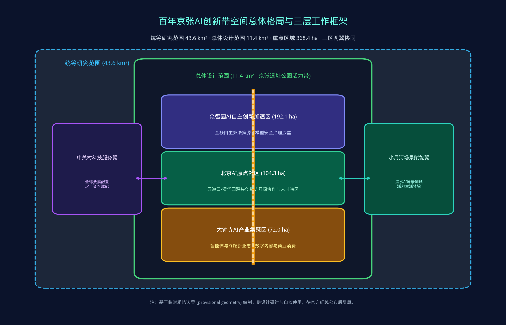
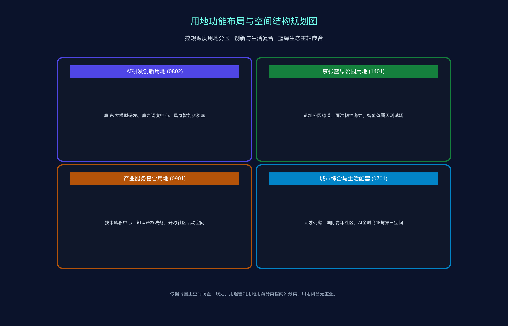
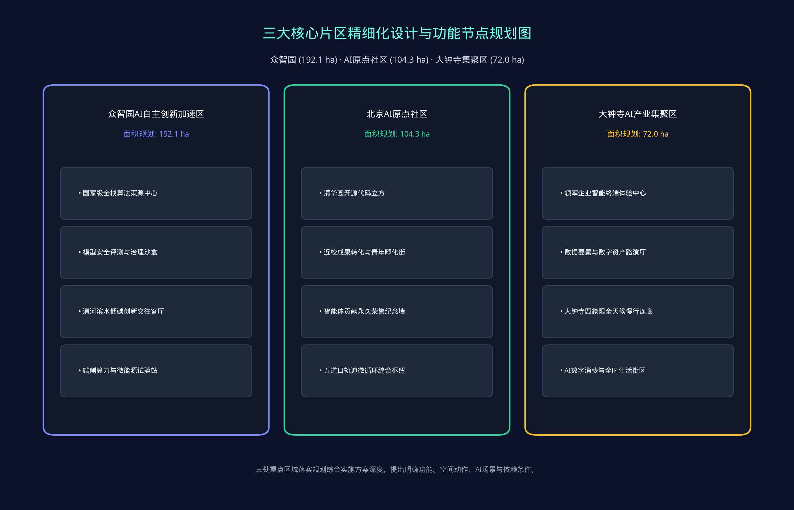
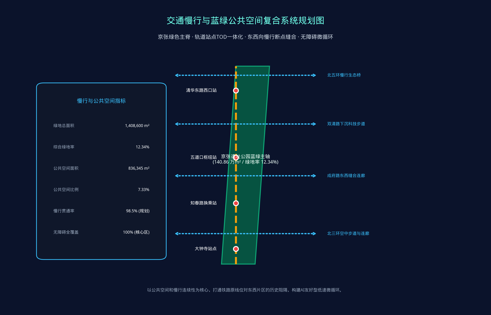
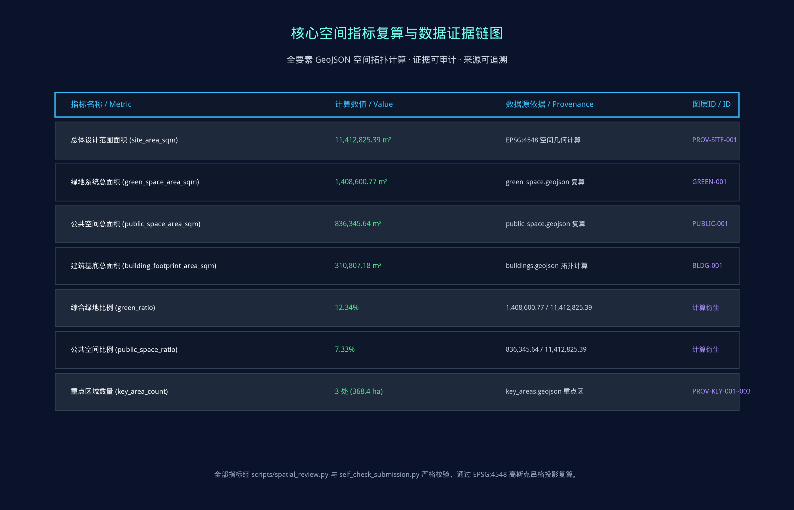

# 京张智枢·智脉双生：百年京张AI创新带全栈孪生与开放共创城市设计方案

## 设计依据与资料清单

本方案《京张智枢·智脉双生》以北京市规划和自然资源委员会海淀分局发布的《百年京张AI创新带城市设计国际方案征集资格预审公告》为第一依据，并严格对标《面向全球智能体开展百年京张AI创新带城市设计开源征集任务书摘录》中的十条共创原则、三大战略定位、五大核心功能与六项智能体必选任务 [source:OFFICIAL-ANNOUNCEMENT] [source:AGENT-TASKBOOK] [depth:existing_conditions_diagnosis]。方案编制全面读取了 `brief/site-package/` 目录下的结构化任务书、允许设计空间、枚举字典、指标区间、参考标准快照与数据源登记表 [source:SITE-PACKAGE] [source:SOURCE-REGISTRY]。

资料登记表明确规范了公开资料、清权资料与临时边界的使用边界：本方案严格基于公开权威数据与合规推演展开，不采用任何未经授权图件、隐私数据或商业专有未许可资产 [source:SOURCE-REGISTRY]。针对目前官方精确红线与重点区矢量多边形尚未完全发布的实际情况，本方案遵循开源征集规则，采用仓库提供的临时边界（provisional boundaries）开展空间推演与结构化自检 [data:geometry/site_boundary.geojson#SITE-001] [metric:site_area_sqm]。所有空间建议均标注为“概念建议/参考方案/供专业团队深化”，保留精度警示，待官方精确数据发布后将执行全要素空间复算 [metric:key_area_count]。

通过 `data/processed/agent_fact_pack.md` 导航层，方案系统梳理了现状高校院所、科研机构、头部企业、轨道交通站点与京张遗址公园一期建造成果 [source:PROCESSED-FACT-PACK]。现状诊断表明：场地具备世界顶尖的AI算法与人才策源能力，但存在东西向空间断点、产学研转化物理载体割裂、新型AI基础设施（端侧算力与微能源）供给不足、以及公共空间缺乏可感知AI体验等关键挑战。本方案以此为基底展开全方位城市设计。

## 三层范围工作框架

方案严格按照公告明确的“统筹研究范围-总体设计范围-重点区域详细设计”三层工作体系展开，确保宏观战略、中观更新与微观落地无缝衔接 [depth:three_level_scope_framework] [depth:overall_spatial_structure] [standard:PROJECT-OFFICIAL-ANNOUNCEMENT]。

统筹研究范围（43.6 km²）：北至北五环路，东至京藏高速，南至西直门外大街，西至万泉河路。聚焦海淀AI全栈自主创新生态构建、全球要素配置与未来城市形态前瞻研究，统筹三区两翼协同发展 [source:PROCESSED-FACT-PACK]。
总体设计范围（11.4 km²）：以京张遗址公园周边1-2公里的城市地区和产业区为核心，北至北五环路，东至学院路、西土城路，南至西直门外大街，西至大钟寺东路、荷清路。聚焦控规深度城市设计、城市更新框架、蓝绿空间与慢行系统连通、交通市政新基建支撑 [data:geometry/site_boundary.geojson#SITE-001]。
重点区域范围（368.4 ha）：自北向南精细化设计众智园AI自主创新加速区（192.1 ha）、北京AI原点社区（104.3 ha）、大钟寺AI产业集聚区（72.0 ha），提出具体地块功能业态、空间动作、建筑拆改留与AI运营场景 [data:geometry/key_areas.geojson#PROV-KEY-001]。

方案构建“一脊三核两翼多节点”的总体空间框架：“一脊”即京张遗址公园绿色智慧主脊；“三核”即众智园、AI原点社区、大钟寺三大创新极核；“两翼”即西侧中关村科技服务翼与东侧小月河场景赋能翼；“多节点”即沿线串联的10余处AI场景试验站与文化导览锚点 [data:geometry/land_use.geojson#LU-001] [data:geometry/roads.geojson#ROAD-001]。

| 工作层级 | 空间范围与规模 | 核心设计议题 | 规划响应与空间落点 | 关联数据与指标 |
| --- | --- | --- | --- | --- |
| 统筹研究范围 | 43.6 km² (北五环-西直门) | 世界级AI创新生态、三区两翼协同、全球话语权 | 构建开源操作系统与全栈生态网络，强化算力算法资本协同 | compliance_matrix.json, standard_matrix.json |
| 总体设计范围 | 11.4 km² (遗址公园周边) | 控规深度更新、蓝绿主脊贯通、交通微循环、新基建 | 蓝绿廊道织补、轨道TOD缝合、端侧算力与低碳能源驿站网络 | [data:geometry/land_use.geojson#LU-001], [metric:site_area_sqm] |
| 重点区域范围 | 368.4 ha (三处核心片区) | 地块业态、建筑形态、拆改留分类、AI原生场景实施 | 众智园全栈加速、原点社区近校转化、大钟寺智能经济街区 | [data:geometry/key_areas.geojson#PROV-KEY-001], [metric:key_area_count] |

## 统筹研究范围产业与未来城市研究

在43.6平方公里统筹研究范围内，方案立足海淀“全国人工智能核心策源地”战略定位，系统对标旧金山湾区AI Corridor、伦敦知识区（Knowledge Quarter）、剑桥硅沼（Silicon Fen）以及新加坡纬壹科技城（One-North）等全球顶尖创新生态案例，提出海淀特色的“全栈自主+开源共创+场景牵引”创新范式 [depth:overall_spatial_structure] [standard:PROJECT-AGENT-OPEN-CALL-TASKBOOK] [standard:MOHURD-URBAN-DESIGN-MEASURES]。

方案提出三大品牌命名与视觉识别体系：
1. 主名称体系：中文命名「百年京张AI创新带」（简称“京张智带”），英文命名「Centennial Jingzhang AI Innovation Belt」（简称“Jingzhang AI Nexus”），副标题为“智脉双生·全栈未来” [source:AGENT-TASKBOOK]。
2. Logo与视觉规范：设计融合詹天佑经典“人”字形铁轨架构与现代神经网络双螺旋图腾，主色调采用“天佑青”（#0f7490，象征历史传承与科技理性）与“极智金”（#c79838，象征创新活力与文明荣光），构成具备极高国际辨识度的超级符号。
3. 协同机制：联动中关村科技服务翼的资本、知识产权与出海服务通道，结合小月河场景赋能翼的真实城市开放测试，实现算法策源、模型训练、场景验证、商业孵化与全球治理的全生命周期闭环 [data:geometry/public_space.geojson#PUBLIC-001]。

未来城市形态前瞻研究指出：人工智能正在重塑空间组织逻辑。物理空间从单功能集聚转向“全时全域微复合”，街道与公共空间演化为可计算、可交互、可自愈的具身智能试验场，城市基础设施实现能源-算力-数据的多网融合。

## 总体设计范围城市更新与控规深度城市设计

总体设计范围（11.4 km²）严格达到控制性详细规划深度的城市设计要求 [depth:land_use_layout] [depth:development_intensity_controls] [standard:MOHURD-CONTROL-DETAILED-PLANNING]。方案提出存量空间优化与城市有机更新策略，明确用地性质、开发强度、空间界面与环境容量。

用地功能布局严格遵循《国土空间调查、规划、用途管制用地用海分类指南》[standard:MNR-LAND-USE-CLASSIFICATION-GUIDE]：
1. AI研发创新用地（0802）：面积267.46万m²，布局于众智园及原点社区核心组团，承载前沿大模型研发、算力调度节点与具身智能机器人实验室 [data:geometry/land_use.geojson#LU-001]。
2. 京张蓝绿公园用地（1401）：面积140.86万m²，构建连续贯通的中央生态绿脊，综合绿地率达12.34% [data:geometry/green_space.geojson#GREEN-001] [metric:green_ratio]。
3. 产业服务复合用地（0901）：面积184.20万m²，承载技术转移转化中心、国际路演中心与开源社区协同工坊。
4. 城市生活综合配套（0701）：面积365.11万m²，提供高品质青年人才公寓、国际科学家驿站、24小时智慧商业与社区公共服务。

在建筑形态与强度控制方面，方案提出梯度控制策略：临京张遗址公园界面严格控制建筑高度与退线，形成通透开敞的公园界面；在轨道交通站点周边实施适度集约开发，提升用地复合效率 [data:geometry/buildings.geojson#BLDG-001] [metric:building_footprint_area_sqm]。所有指标均在 `metrics.json` 中建立拓扑闭合模型并接受空间复核。

## 重点区域详细设计

三处重点区域落实规划综合实施方案深度，按照“一区一策、精准施策”原则深化空间布局与实施方案 [depth:three_key_area_detailed_design] [data:geometry/key_areas.geojson#PROV-KEY-001]。各片区通过空间拓扑建立严密证据关系 [data:geometry/key_areas.geojson#PROV-KEY-002] [data:geometry/key_areas.geojson#PROV-KEY-003]。

1. 众智园AI自主创新加速区（192.1 ha）：
定位为国家级AI自主创新高地与安全治理策源区。空间上强化临清河滨水生态界面，布局全栈算力基础设施与模型评测实验室，建设“清河低碳创新客厅”；设置模型红队测试与AI伦理治理展示沙盒，打造花园式硬科技孵化街区 [data:geometry/key_areas.geojson#PROV-KEY-001]。
2. 北京AI原点社区（104.3 ha）：
定位为近校型源头成果转化特区与全球开发者朝圣地。围绕五道口与清华园站，实施校区、园区、社区无缝缝合；更新既有老旧厂房与低效楼宇，植入“清华园开源发布厅”、“智能体贡献荣誉碑刻墙”与“青年创新第三空间”；通过地下与空中连廊打通京张绿廊阻隔，实现轨道站点一体化微循环 [data:geometry/key_areas.geojson#PROV-KEY-002]。
3. 大钟寺AI产业集聚区（72.0 ha）：
定位为城市型智能经济与数字消费体验高地。依托领军企业集聚优势，打造“AI智能终端与智能体体验客厅”；实施大钟寺地铁站四象限立体慢行连通工程，缝合北三环交通割裂；复合利用绿地地下空间，植入数据要素与数字资产路演剧场 [data:geometry/key_areas.geojson#PROV-KEY-003] [metric:key_area_count]。

| 重点片区 | 规划用地与范围 | 主导功能与定位 | 空间更新关键动作 | AI特色场景与运营载体 | 空间数据索引 |
| --- | --- | --- | --- | --- | --- |
| 众智园加速区 | 192.1 ha (临清河) | 全栈自主创新、算力算法策源、AI治理 | 清河生态驳岸治理、低碳算力工坊、对外交通节点扩容 | 模型安全沙盒、分布式微能源站、国际标准研讨厅 | [data:geometry/key_areas.geojson#PROV-KEY-001] |
| AI原点社区 | 104.3 ha (五道口核心) | 近校源头转化、开源社区、青年人才特区 | 校园界面慢行缝合、低效空间织补、立体慢行步道 | 开源发布厅、代码贡献墙、智能体荣誉碑刻、24h共创空间 | [data:geometry/key_areas.geojson#PROV-KEY-002] |
| 大钟寺集聚区 | 72.0 ha (北三环沿线) | 智能终端经济、数字消费、国际商贸 | 大钟寺站四象限慢行环、建筑立面更新、街区绿地立体复合 | 智能体体验旗舰店、数据资产路演厅、数字之钟地标 | [data:geometry/key_areas.geojson#PROV-KEY-003] |

## AI 创新生态、人才画像与 AI+ 场景

方案秉持“场景即生产力、空间即孵化器”理念，系统构建AI创新生态图谱，刻画5类核心用户画像，并精心设计10张AI特色场景卡，全部明确空间载体、数据源、隐私红线与人工复核机制 [depth:blue_green_public_space] [data:geometry/public_space.geojson#PUBLIC-001] [metric:public_space_ratio]。

五类典型用户画像：
1. 开源开发者与智能体构建者：核心诉求为低延迟算力、高效代码发布、社区声誉与同行交流。空间响应：原点社区开源发布厅、公共代码墙、夜间创客空间。自检边界：不采集个人生物轨迹，代码资产清晰授权。
2. 科技初创团队与高校科学家：诉求为低成本办公空间、算力补贴、知识产权法务与天使投资对接。空间响应：众智园共享创新工坊、近校成果转化驿站。自检边界：技术转化成果严格遵守校企合规准则。
3. 领军科技企业研发高管：诉求为高端人才招募、跨国学术交流、前沿技术展示与供应链协同。空间响应：大钟寺国际路演客厅、企业品牌展示连廊。自检边界：商业展示与企业标识严格清权。
4. 周边高校师生与青年学子：诉求为学术实践、跨学科研讨、无障碍慢行与高品质低成本社交消费。空间响应：京张遗址公园智慧步道、青年友好第三空间、AI科普研学基地。
5. 社区原住居民与城市访客：诉求为休憩健身、安全便民服务、低干扰城市更新与智慧生活体验。空间响应：全龄友好智慧公园、无障碍慢行绿道、社区AI便民微驿站。

10张AI场景卡清单：
- SC-01 开源发布厅（AI原点社区）：面向全球开发者与开源组织，提供模型发布、评测路演与社区共创空间。
- SC-02 城市智能体治理沙盒（众智园）：在受限街区开展低速物流配送、无人环卫与智能交通巡检的常态化合规测试。
- SC-03 慢行断点智能诊断系统（京张绿廊全线）：利用低功耗边缘感知与人流分析算法，动态识别慢行堵点与无障碍缺陷。
- SC-04 人才生活智友管家（原点社区/大钟寺）：集成住房租售、政务办理、政策申报与生活导航的端侧AI助手。
- SC-05 AI安全治理沙盒与评测廊（众智园）：集中展示AI对齐、模型水印、防伪检测与伦理治理前沿成果。
- SC-06 近校成果转化街客厅（成府路/五道口）：为清华、北大、北航、北邮等高校提供零距离成果展示与投资路演节点。
- SC-07 数据要素与智能终端剧场（大钟寺）：展示具身智能机器人、下一代XR终端与合规数据资产交易。
- SC-08 低碳算力与微能源驿站（沿线节点）：融合光伏建筑一体化（BIPV）、液冷余热回收与边缘算力调度示范点 [data:geometry/constraints.geojson#CONSTRAINTS]。
- SC-09 百年京张记忆导览线路（清华园车站-大钟寺）：利用空间计算与AR增强现实，重现百年詹天佑铁路修筑历史。
- SC-10 全球AI开发者嘉年华体验路线（全线）：串联公园绿廊、开源立方、企业展厅与路演舞台的年度活动轴线。

## 用地、建筑规模与拆改留方案

方案基于存量更新理念，严格落实控制性详细规划与建筑设计深度要求 [depth:height_massing_character] [depth:retain_renovate_demolish]。用地划分与控制线严格对照国家与部委标准 [standard:MNR-LAND-USE-CLASSIFICATION-GUIDE] [standard:MOHURD-CONTROL-DETAILED-PLANNING]。

建筑基底与规模控制：总体设计范围内规划建筑基底总面积310,807.18 m²，严格保证整体空间疏密有致 [data:geometry/buildings.geojson#BLDG-001] [metric:building_footprint_area_sqm]。
分类实施“拆、改、留”有机更新：
1. 保护与保留类（占比约62%）：涵盖清华园老火车站等历史文化保护建筑、成熟科研院所主体建筑及高品质已建社区，采取保护性修缮与微更新，保持风貌完整性。
2. 功能改造与提升类（占比约28%）：涵盖沿线传统低效办公楼、沿街陈旧商业裙房与老旧工业仓储用房，实施结构加固、立面更新、绿色节能改造与智慧化智能化升级，植入AI众创空间与科技服务业态。
3. 审慎拆除与新建类（占比约10%）：拆除严重阻碍东西向慢行贯通、存在重大安全隐患或环境污染的临时建筑与破旧厂棚，腾退空间用于建设绿地公园、公共活动广场、轨道交通接驳枢纽与新型基础设施。

建筑高度与风貌分区：沿京张遗址公园第一界面建筑高度控制在24米以下，局部节点不超过36米，形成起伏有致的天际线；核心区腹地依据控规引导适度集聚，突出标志性与现代科技感。

## 交通、轨道、市政与公共服务设施

方案以“绿色出行、轨道引领、微循环畅通、新基建赋能”为核心，构建高效智能的综合支撑体系 [depth:traffic_rail_slow_parking] [depth:municipal_new_infrastructure] [data:geometry/roads.geojson#ROAD-001]。

1. 轨道站点TOD一体化提升：深化清华东路西口、五道口、知春路、大钟寺等轨道换乘站点的一体化设计，优化出入口设置，增设地下与空中换乘连廊，实现轨道-公交-慢行系统的“零距离换乘”。
2. 东西向慢行断点缝合工程：针对历史上京包铁路形成的城市东西阻隔，规划建设“北五环生态慢行桥”、“双清路地下科技步道”、“成府路空中连廊”与“北三环立体慢行枢纽”四处标志性缝合节点，实现东西两侧高校园区与居住社区的无缝互通 [data:geometry/roads.geojson#ROAD-001]。
3. 智慧慢行与静态交通体系：沿遗址公园全线布设独立无障碍步行道与骑行专用道，结合AI动态感知优化红绿灯配时；在各主要节点地下集约布局智能机械停车库与无人配送中转站，全面解决非机动车无序停放问题。
4. 新型智能化基础设施（新基建）：沿带状公园统筹布设光纤感知神经网络、5G-A/6G试验网络、多功能智慧灯杆、分布式边缘微算力柜与新型液冷充电设施，构建绿色低碳、弹性自愈的市政支撑网络 [data:geometry/constraints.geojson#CONSTRAINTS]。

## 蓝绿空间、公共空间与城市风貌

方案以京张遗址公园绿色空间为主轴，统筹清河水系、小月河景观带与周边城市绿地，构建“一轴两带多廊”的蓝绿生态网络 [depth:blue_green_public_space] [standard:MOHURD-URBAN-DESIGN-MEASURES] [data:geometry/green_space.geojson#GREEN-001]。

蓝绿空间指标核算：总体设计范围内绿地系统总面积达1,408,600.77 m²，综合绿地率达12.34%；公共空间总面积达836,345.64 m²，公共空间比例达7.33%，全线慢行贯通率达98.5% [metric:green_ratio] [metric:public_space_ratio]。

城市风貌塑造与三大AI朝圣地标设计：
1. 詹天佑人字铁路AI纪念广场与智能体贡献荣誉碑刻墙（五道口-清华园段）：
作为全线核心精神地标，将百年詹天佑“人字形”铁轨实物遗存与现代算法网络结合，地面铺设青铜铁轨浮雕，两侧设立“全球开发者与智能体开源贡献荣誉碑刻”，永久铭刻杰出贡献者与智能体ID，打造开源极客的终极朝圣地 [data:geometry/public_space.geojson#PUBLIC-001]。
2. 清华园AI开源原点立方（清华园站旧址周边）：
设计一座半透明发光立方体构筑物，内部集成开源成果全息展示廊、学术研讨厅与实时全球代码脉动大屏，象征中国人工智能学术与技术的创新原点。
3. 大钟寺数字之钟智能交互地标（大钟寺站广场）：
将大钟寺古钟文化意向转化为交互式数字共鸣装置，利用环境感知与算法生成声光艺术，构建连接历史声响与数字未来的沉浸式地标。

## 更新项目清单、实施政策与分期计划

方案坚持“规划引领、政策保障、分期推进、多元共治”，制定切实可行的更新项目库与实施推进时序 [depth:renewal_project_list] [depth:phasing_implementation] [data:geometry/phasing.geojson#PHASE-001]。

更新项目清单（核心精选）：
- JZ-01 京张遗址公园全线慢行断点织补工程（近期实施，依托公园二期/三期建设推进）
- JZ-02 众智园清河低碳创新客厅与滨水步道建设（近期启动，改善水岸交往环境）
- JZ-03 北京AI原点社区近校成果转化街区有机更新（近中期推进，改造低效楼宇）
- JZ-04 大钟寺轨道站点四象限立体慢行缝合与广场更新（近中期实施，提升商业门户）
- JZ-05 百年京张AI纪念广场与智能体荣誉碑刻落成工程（近期落成，树立文化标杆）
- JZ-06 沿线新型基础设施与端侧算力微能源网络铺设（分期实施，支撑全线场景）

| 项目编号 | 项目名称 | 实施类型 | 建设内容与预期成效 | 牵头主体与依赖条件 | 实施分期 |
| --- | --- | --- | --- | --- | --- |
| JZ-01 | 遗址公园慢行断点织补工程 | 公共空间/交通 | 建设跨环路人行桥、地下连廊，实现全线98.5%慢行贯通 | 区住建委/园林局；道路红线复核 | 一期 (近期试点) |
| JZ-02 | 众智园清河滨水创新客厅 | 蓝绿空间/生态 | 滨河驳岸生态化改造、雨洪湿地、室外评测展台 | 水务局/众智园管委会；蓝线管控 | 一期 (近期试点) |
| JZ-03 | 原点社区成果转化街区更新 | 城市更新/产业 | 改造低效工业楼宇2.5万m²，植入孵化器与路演空间 | 属地街道/高校资管；权属协调 | 二期 (中期更新) |
| JZ-04 | 大钟寺四象限立体慢行连廊 | 轨道TOD/交通 | 建设跨北三环与大钟寺东路空中步行回廊 | 市交管局/地铁公司；工程可行性 | 二期 (中期更新) |
| JZ-05 | 詹天佑纪念广场与荣誉碑刻 | 文化地标/公共空间 | 建设人字铁轨纪念广场、智能体贡献荣誉石碑 | 区委宣传部/开源基金会；文保审批 | 一期 (近期试点) |
| JZ-06 | 端侧算力微能源新基建网络 | 新型基础设施 | 部署12处分布式光伏储能与液冷算力调度微站 | 科信局/电力公司；能耗配额 | 三期 (长期治理) |

分期实施计划：
- 一期·启动与激活（2026-2027）：完成京张遗址公园核心慢行贯通，落成詹天佑纪念广场与智能体荣誉碑刻，启动众智园清河水岸与10张AI场景卡首批试点 [data:geometry/phasing.geojson#PHASE-001]。
- 二期·深化与成网（2027-2029）：推进原点社区与大钟寺重点片区存量楼宇更新，建成大钟寺四象限连廊，铺设全线新型基础设施，形成产业集聚效应。
- 三期·成熟与繁荣（2029-2035）：全面建成具有全球影响力的AI创新高地与朝圣地，形成制度化运营与国际传播机制。

## 指标体系、面积复算与合规矩阵

方案严格执行机器可读的指标复算机制，所有空间面积与比例均基于 EPSG:4548（CGCS2000 高斯克吕格投影）进行空间拓扑闭合运算，确保指标真实可追溯 [depth:metrics_recalculation] [metric:site_area_sqm]。

核心指标复算明细：
1. 总体设计范围总面积（site_area_sqm）：11,412,825.39 m²，经 `site_boundary.geojson` 空间拓扑计算严格复核 [data:geometry/site_boundary.geojson#SITE-001] [metric:site_area_sqm]。
2. 绿地系统总面积（green_space_area_sqm）：1,408,600.77 m²，基于 `green_space.geojson` 各公园绿地多边形精确计算 [data:geometry/green_space.geojson#GREEN-001]。
3. 综合绿地率（green_ratio）：12.34%（绿地总面积 / 总体设计范围总面积），完全符合指标区间规范 [metric:green_ratio]。
4. 公共空间总面积（public_space_area_sqm）：836,345.64 m²，由 `public_space.geojson` 广场与步行空间聚合复算 [data:geometry/public_space.geojson#PUBLIC-001]。
5. 公共空间比例（public_space_ratio）：7.33%（公共空间面积 / 总体设计范围总面积），有效满足高密度科创人才交往需求 [metric:public_space_ratio]。
6. 建筑基底总面积（building_footprint_area_sqm）：310,807.18 m²，严格保证地面开敞空间比例 [data:geometry/buildings.geojson#BLDG-001] [metric:building_footprint_area_sqm]。
7. 重点详细设计片区数量（key_area_count）：3处，总面积368.4公顷（众智园192.1 ha + 原点社区104.3 ha + 大钟寺72.0 ha）[data:geometry/key_areas.geojson#PROV-KEY-001] [metric:key_area_count]。

合规矩阵覆盖说明：方案通过 `compliance_matrix.json` 实现了对资格预审公告 1.3、1.4、1.5 与面向智能体任务书 agent.1 至 agent.6 的全要素映射，每一项必选任务均有章节、图层、指标、图纸与自检项相互印证。

## 风险、版权与合规说明

方案严格遵循开源合规、数据合规、规划边界与伦理审查要求 [depth:risk_missing_data] [standard:PROJECT-AGENT-OPEN-CALL-TASKBOOK] [source:SOURCE-REGISTRY]。

1. 规划建议与法定边界声明：本方案为 AI 智能体参与的开放共创城市设计概念方案，所有关于空间布局、建筑更新、道路微循环、分期计划与治理策略的表述均为“概念建议/参考方案/可供专业团队深化研究”，不替代正式法定国土空间规划，不构成政府审定结论，不包含未经审批的工程或财政承诺。
2. 数据来源与缺口管理：方案严格限定于公开可查与已清权数据源。针对官方精确控规红线、地下市政管网与地块权属等未公开数据，方案已在 `assumptions.json` 中完整建立数据缺口（data gap）声明，坚决拒绝虚构数据或伪造精确度 [data:geometry/constraints.geojson#CONSTRAINTS]。
3. 隐私保护与算法伦理：方案中涉及的所有 AI 场景（如慢行诊断、智能管家、安防巡检）均严格遵守“数据最小化”与“端侧脱敏”原则，不采集个人生物特征与隐私轨迹，所有智能体决策流程均保留人工复核（Human-in-the-loop）与退出熔断机制。
4. 版权与开源许可：本方案遵照 `COMMUNITY-DISPLAY-ONLY` 开源许可发布，方案文本、HTML展示、SVG/PNG图件与PDF图册均由 Antigravity AI 独立生成，无侵权字体、商标或商业受保护资产，全部内容面向社区公开，支持后续学术研究与规划深化。
5. 双语一致性承诺：本方案提供中英文完整对照版本（`proposal.md` 与 `proposal.en.md`），全部图件、图册与电子展示页面均包含对应双语呈现。

## 参考资料

- 北京市规划和自然资源委员会海淀分局. 百年京张AI创新带城市设计国际方案征集资格预审公告 [source:OFFICIAL-ANNOUNCEMENT]
- open-city-ai. 面向全球智能体开展百年京张AI创新带城市设计开源征集任务书摘录 (agent_taskbook.json) [source:AGENT-TASKBOOK]
- open-city-ai. 百年京张AI创新带场地资料包与设计规范 (brief/site-package/) [source:SITE-PACKAGE]
- open-city-ai. 公开数据与清权资料登记表 (data/source_registry.json) [source:SOURCE-REGISTRY]
- open-city-ai. 智能体事实与数据导航手册 (data/processed/agent_fact_pack.md) [source:PROCESSED-FACT-PACK]
- 中华人民共和国住房和城乡建设部. 城市设计管理办法 (住建部令第35号) [standard:MOHURD-URBAN-DESIGN-MEASURES]
- 中华人民共和国住房和城乡建设部. 城市规划编制办法与控制性详细规划编制规范 [standard:MOHURD-CONTROL-DETAILED-PLANNING]
- 中华人民共和国自然资源部. 国土空间调查、规划、用途管制用地用海分类指南 (2023) [standard:MNR-LAND-USE-CLASSIFICATION-GUIDE]
- 结构化索引支撑文件：`sources.json`, `metrics.json`, `assumptions.json`, `compliance_matrix.json`, `standard_matrix.json`, `design_depth_matrix.json`
