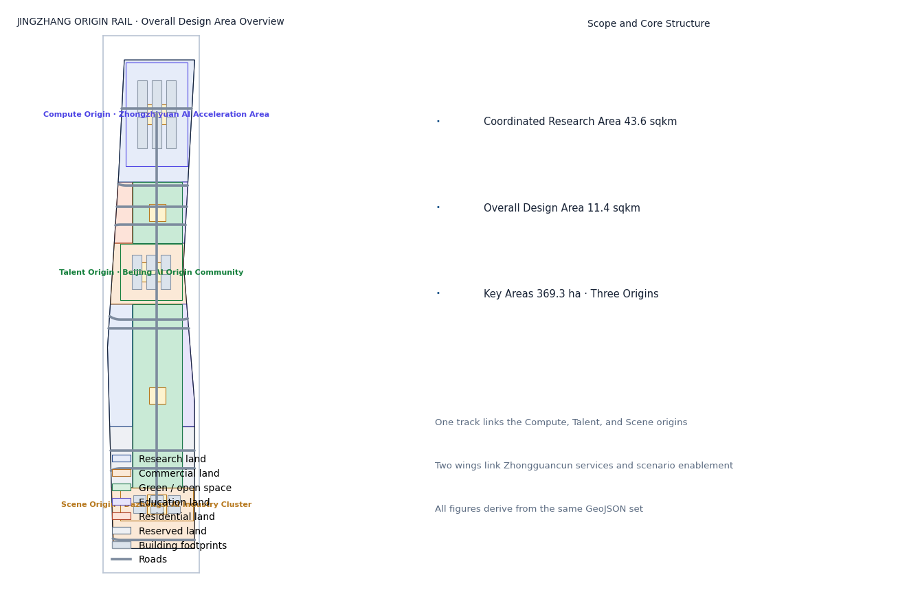
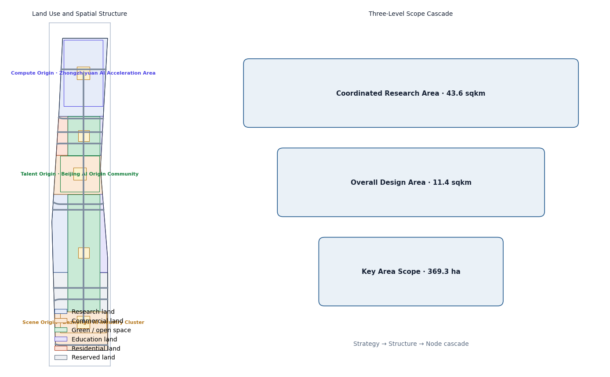
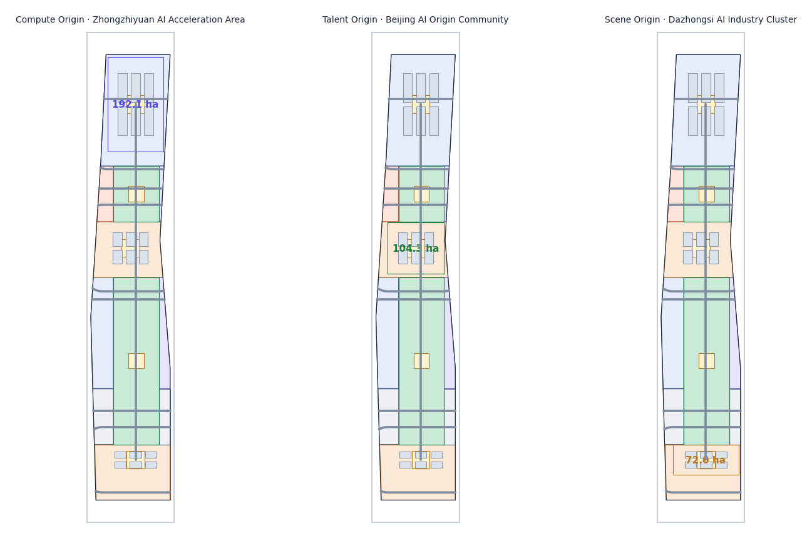
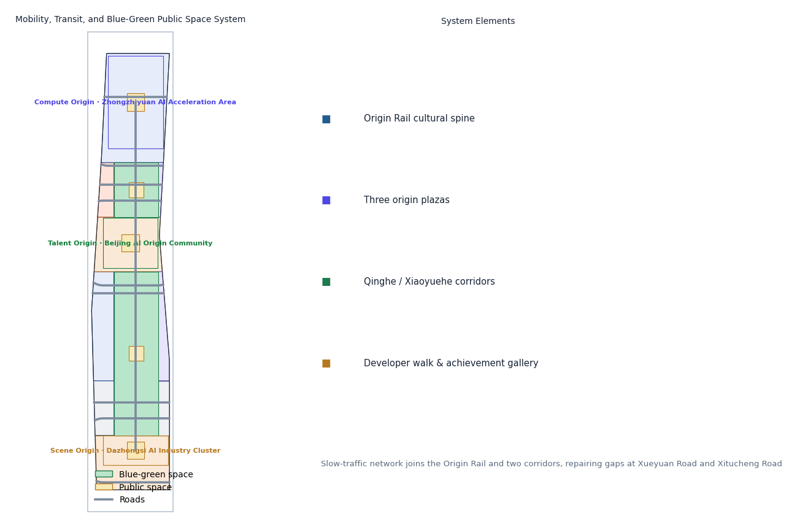
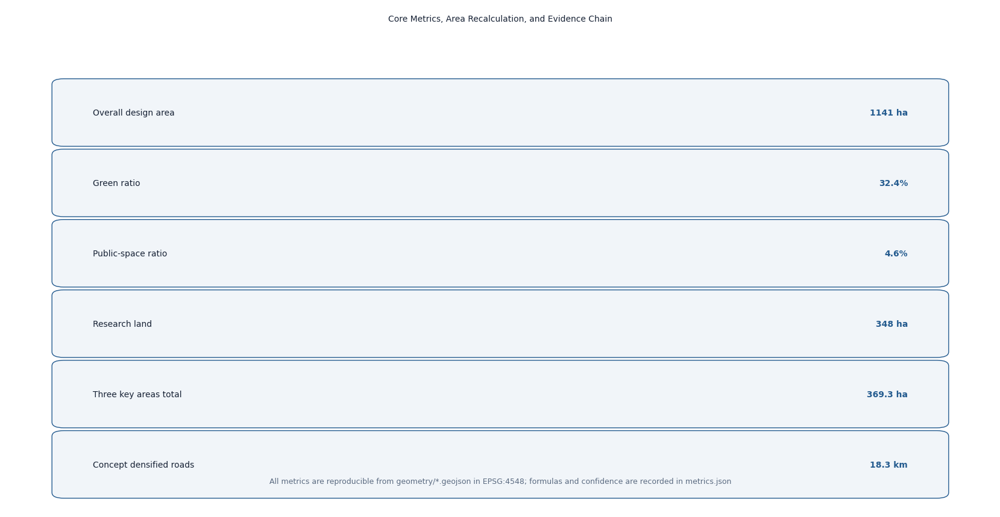

# JINGZHANG ORIGIN RAIL: From China's First Rail to the World's First Intelligent Agent

## Design Basis and Source List

This proposal takes the Haidian Branch of the Beijing Municipal Commission of Planning and Natural Resources' "Open Call for International Urban Design of the Centennial Jing-Zhang AI Innovation Belt—Prequalification Announcement" as its primary authority, defining the three scope levels, three key areas, design tasks, and deliverable context `[standard:PROJECT-OFFICIAL-ANNOUNCEMENT]`. The open-call taskbook for global intelligent agents supplements this with the three positionings, five functions, three areas and two wings, and six required tasks `[standard:PROJECT-AGENT-OPEN-CALL-TASKBOOK]`. Land-use classification, urban design, and regulatory-planning contexts follow the Ministry of Natural Resources' Land Use and Sea Use Classification Guide, MOHURD's Urban Design Measures, and the Measures on the Preparation and Approval of Regulatory Detailed Planning `[standard:MNR-LAND-USE-CLASSIFICATION-GUIDE]` `[standard:MOHURD-URBAN-DESIGN-MEASURES]` `[standard:MOHURD-CONTROL-DETAILED-PLANNING]`.

Because no official precise boundary polygon has been published, this proposal uses the maintainer-provided provisional boundaries in `brief/site-package/geometry/provisional_boundaries.geojson` as the basis for generation, display, and self-check `[source:BOUNDARY-SOURCE]`. Recomputed in EPSG:4548, the provisional areas deviate from the announced values by less than 0.5%, but they serve only as placeholders and must not be treated as an official redline or precise area basis; all layers and metrics must be recomputed when official data is released `[source:KEY-AREA-SOURCE]`. Geometry, metrics, and figures are all derived from the same GeoJSON set, so the evidence chain is reproducible.

Complete sources, metrics, standards, design depth, and task coverage are kept in `sources.json`, `metrics.json`, `compliance_matrix.json`, `standard_matrix.json`, and `design_depth_matrix.json`; prose keeps only claim-adjacent evidence anchors `[source:SITE-PACKAGE]`.

## Three-Level Scope Framework

The proposal follows the announcement's three scope levels: the **coordinated research area** of about 43.6 km² (north to North 5th Ring Road, east to Jingzang Expressway, south to Xizhimen Outer Street, west to Wanquanhe Road) guides industrial strategy, AI ecosystem, and future-city research without setting construction metrics `[source:OFFICIAL-ANNOUNCEMENT]`; the **overall design area** of about 11.4 km² covers the urban and industrial districts within 1–2 km of the Jing-Zhang Heritage Park and reaches urban-design depth at the regulatory-planning level; the **key detailed-design area** totals about 368.4 ha, comprising the Zhongzhiyuan AI Acceleration Area, the Beijing AI Origin Community, and the Dazhongsi AI Industry Cluster, each designed in detail `[metric:site_area_sqm]` `[metric:key_detailed_area_total_sqm]`.

The three levels transfer through a "strategy–structure–node" cascade: the research level sets the overall spatial strategy of "one track, three origins, two wings"; the overall level resolves strategy into land use, public space, slow-traffic, and character structure `[data:geometry/land_use.geojson#LU-jingzhang_corridor]`; and the key-area level focuses on buildings, plazas, and scenarios. All layers derive from provisional boundaries; if official polygons replace them, all metrics and figures including area, green ratio, and public-space ratio must be recomputed and re-self-checked `[depth:three_scope_framework]`.

## Coordinated Research Area: Industry and Future City Research

### Belt Concept: JINGZHANG ORIGIN RAIL

This proposal names the belt **京张初轨 / ORIGIN RAIL**. The concept comes from the coincidence of two origins: a century ago, the Jing-Zhang Railway was the first mainline railway designed and built independently by Chinese engineers—an "origin rail" of national engineering autonomy; today, Haidian is building the AI Origin Community, where intelligent agents participate in real urban planning for the first time. Joining these two origins on one track yields the proposal's core proposition—**from China's first rail to the world's first intelligent agent** `[standard:PROJECT-AGENT-OPEN-CALL-TASKBOOK]` `[depth:naming_identity]`.

**Naming system** uses the "Origin × Element" two-tier structure:
- Belt brand: ORIGIN RAIL (symbol O·R).
- Three origin sub-brands: **ORIGIN COMPUTE** (Zhongzhiyuan), **ORIGIN TALENT** (AI Origin Community), **ORIGIN SCENE** (Dazhongsi), corresponding to AI's compute, talent, and scenario origins.
- The unified logic of "Origin + Element" implies three origins growing on the same Origin Rail, echoing railway mileage while fitting the open-source spirit of starting from zero.

**Logo and visual identity**: the motif is a "zero-kilometer milestone + rail-head section"—a "0" pierced by a rail that extends into the horizon inside the zero, meaning everything starts at the origin. The palette uses "steel-rail grey, signal red, data cyan": steel grey for heritage and rationality, signal red from the railway's "departure" signal, and data cyan for AI and open source. The graphic system extends at 45° bevels and a 1:1.618 ratio, scalable to signage, events, digital interfaces, and public installations `[depth:logo_or_visual_identity]`.

### Five Functions and the Three-Areas-Two-Wings Feedback Loop

Targeting the five functions—full-stack independent AI innovation, a world-class AI ecosystem, a new AI+ scenario-enablement paradigm, an intelligent vibrant AI city, and global voice in AI governance `[standard:PROJECT-AGENT-OPEN-CALL-TASKBOOK]`—the proposal builds a design loop: **Compute Origin supplies compute and foundation models → Talent Origin supplies talent and community → Scene Origin supplies scenarios and conversion → the two wings feed Zhongguancun's capital and IP and Xiaoyuehe's scenario trials back to the three origins**, forming a closed "factor–R&D–incubation–conversion" loop `[depth:ecosystem_cases]`. This matches the announced three-areas-two-wings framework and spatially maps to the "one track, three origins, two wings, two corridors" structure.

### Global AI Ecosystem Cases (6)

| Case | Location | Transferable lesson |
| --- | --- | --- |
| Kendall Square | Boston, USA | A ten-minute "research–conversion" circle of universities, hospitals, incubators, and metro exits, mapping the Talent Origin's academy-industry integration |
| one-north | Singapore | Vertical mixed-use "one park, many functions" and greenway links, mapping mixed functions and boundary-free public space |
| King's Cross | London, UK | Railway-heritage redevelopment into an innovation quarter where a steam-era station and startups coexist, directly mapping Jing-Zhang heritage activation |
| Future Sci-Tech City | Hangzhou, China | Anchor enterprise + policy trial + scenario opening as a triad, mapping the Zhongzhiyuan ecosystem organization |
| Nanshan District | Shenzhen, China | Patient capital linking tech services to hard-tech, mapping the Zhongguancun services wing's capital mechanism |
| Digital Media City | Seoul, Korea | Media/content industry plus large-scale public event operations, mapping the Scene Origin's event system and global communication |

These cases are not copied directly but converted into spatial, operational, and scenario mechanisms: spatially, a continuous mixed belt of "universities–parks–communities" along the track; operationally, ecological-niche complementarity of "anchor enterprise + open-source community + government trial"; scenariowise, experienceable, demonstrable, and scalable AI public services implemented first `[source:AGENT-TASKBOOK]`.

## Overall Design Area: Urban Renewal and Regulatory-Plan-Level Urban Design

### Spatial Structure: One Track, Three Origins, Two Wings, Two Corridors

The overall design structure is **"one track, three origins, two wings, two corridors"**: the **track** is the north–south "Origin Rail" cultural-green corridor along the Jing-Zhang Heritage Park, the public spine linking the three origins `[data:geometry/green_space.geojson#GS-00]`; the **three origins** are the compute, talent, and scene origins; the **two wings** are the western wing taking on Zhongguancun tech services and the eastern wing linking Xiaoyuehe scenario enablement; the **two corridors** are the blue-green slow-traffic corridors along Qinghe in the north and Xiaoyuehe in the south. Land use follows a "track-first, corridor-green, two-wings-mixed" logic `[data:geometry/land_use.geojson#LU-jingzhang_corridor]` `[data:geometry/land_use.geojson#LU-zhongzhiyuan_innovation]`.

### Functional Structure and Renewal Framework

- **Research land** about 348 ha (31%), concentrated in Zhongzhiyuan and the western wing for basic research, foundation models, and independent innovation `[metric:land_use_research_sqm]`.
- **Commercial land** about 288 ha (25%), concentrated in the AI Origin Community and Dazhongsi for mixed formats and scenario commerce `[metric:land_use_commercial_sqm]`.
- **Green and open space** about 370 ha (32%), framed by the Origin Rail and supplemented by reserved-green additions into a continuous green network `[metric:green_space_area_sqm]`.
- **Education land** about 42 ha, **residential land** about 30 ha, and **reserved land** about 64 ha support university synergy, talent housing, and green reservation `[metric:land_use_education_sqm]` `[metric:land_use_residential_sqm]`.

Renewal follows an overall "retain-first, renew-secondary, modest new-build" framework: the corridors mainly target existing institutional compounds and communities through wall-opening, public-space weaving, and functional conversion; core start-up areas at the three origins allow conceptual new-build, but all massing, height, and retain/renovate/demolish judgments are labeled **conceptual suggestions** and are not stated as approved conclusions until regulatory conditions are provided `[standard:MOHURD-CONTROL-DETAILED-PLANNING]` `[depth:building_massing]`. All land-use areas are reproducible in `geometry/land_use.geojson` under EPSG:4548 `[depth:land_use_layout]`.

## Detailed Design of Key Areas

### Origin Compute: Zhongzhiyuan AI Acceleration Area (about 192.1 ha)

**Positioning**: full-stack independent AI innovation and open-compute origin. **Structure**: three groups—"compute heart, open workshop, lake-bay living room"—spread along the track, centered on the **Compute Origin Plaza**, surrounded by compute centers, foundation-model labs, and open-source model workshops `[data:geometry/key_areas.geojson#KEY-ZHONGZHIYUAN]`. **Building renewal**: existing industrial and research compounds mainly convert function and add floors; conceptual new-build at the start-up area favors AI R&D, labs, and incubators, with about 33 ha of building footprint `[metric:land_use_research_sqm]`. **Mobility**: seamless "track–building–plaza" pedestrian links via the Qinghe corridor and transit. **AI scenarios**: compute reservation, open-source model deployment experiments, and agent training sandboxes. **Risk**: compute infrastructure demands high investment and power load requiring professional assessment; this proposal gives only conceptual direction `[standard:MOHURD-URBAN-DESIGN-MEASURES]`.

### Origin Talent: Beijing AI Origin Community (about 104.3 ha)

**Positioning**: the "origin" of AI talent and innovation community. **Structure**: based on the university district around Wudaokou, a compact "block + lane" neighborhood centered on the **Talent Origin Plaza**, mixing residential, commercial, cultural, and shared-office uses `[data:geometry/key_areas.geojson#KEY-ORIGIN]`. **Building renewal**: dominated by micro-renewal of existing communities and street-commerce activation; talent apartments, mixed-use, and cultural display are conceptual new-build directions. **Mobility**: repair slow-traffic gaps between the university district and transit, with a youth-friendly pedestrian street. **AI scenarios**: public AI education, young-developer residency, and community AI convenience stations. **Risk**: complex existing ownership requires extensive public participation; public-space weaving should go first `[standard:BARRIER-FREE-ENVIRONMENT-LAW]`.

### Origin Scene: Dazhongsi AI Industry Cluster (about 72.0 ha)

**Positioning**: intelligent-native new formats and scenario-conversion origin. **Structure**: centered on the **Scene Origin Plaza**, a "consumption × business × trial" mixed area anchored at Dazhongsi station, with underground links connecting the station and core blocks `[data:geometry/key_areas.geojson#KEY-DZS]`. **Building renewal**: dominated by commercial-complex renewal and office upgrading, featuring intelligent-native consumption, robot delivery, and autonomous shuttles `[metric:land_use_commercial_sqm]`. **Mobility**: transit-oriented development where bus and autonomous shuttle complement each other. **AI scenarios**: robot-delivery pilots, unmanned retail, and AI merchandising. **Risk**: station passenger flow and commercial mix must be balanced; unmanned operations require low-speed regulation and human review, all expressed as pilots `[standard:GENERATIVE-AI-INTERIM-MEASURES]`.

The three origins together form a closed "compute–talent–scene" loop; their spatial placement comes from `geometry/key_areas.geojson` and is annotated with provisional precision limits in the figures `[depth:key_areas]`.

## AI Innovation Ecosystem, Personas, and AI+ Scenarios

### Five User Personas

| Persona | Needs | Corresponding scenarios |
| --- | --- | --- |
| AI researcher | compute, data, peer exchange, quiet research | Origin Compute open workshop, open-source model display |
| Startup founder | incubation, capital, scenario validation, customers | Zhongguancun services wing, Scene Origin pilots |
| Student/developer | learning, internships, hackathons, low-barrier tools | Talent Origin youth block, developer walk |
| Commuter/resident | convenience, safety, accessibility, community services | AI traffic, AI health navigation, robot delivery |
| Tourist/senior | guides, age-friendly services, cultural experience | AI cultural guide, AI convenience services |

### AI Scenario Cards (12)

| ID | Scenario | Spatial anchor | Data/privacy boundary | Human review |
| --- | --- | --- | --- | --- |
| SC-01 | AI cultural guide | Origin Rail | public heritage materials | script review |
| SC-02 | AI traffic/walkability assessment | along the track | public road data/authorized feedback | signal joint-test review |
| SC-03 | AI health service navigation | Talent Origin | de-identified data | medical gatekeeping |
| SC-04 | Enterprise service Copilot | western services belt | enterprise-authorized data | compliance review |
| SC-05 | Low-speed robot delivery | Dazhongsi pilot | no facial capture | operation monitoring |
| SC-06 | Public-safety operations review | large events | cameras only in authorized zones | human review loop |
| SC-07 | AI education open class | Talent Origin youth block | public education content | faculty review |
| SC-08 | Open compute reservation | Zhongzhiyuan | account-based billing | platform review |
| SC-09 | Agent training sandbox | Zhongzhiyuan | sandbox isolation | release review |
| SC-10 | Autonomous shuttle demo | three-origin loop | de-identified location data | safety attendant |
| SC-11 | AI merchandising and flow optimization | Dazhongsi commerce | aggregate statistics | merchant confirmation |
| SC-12 | Accessible AI convenience station | public nodes | minimum necessary | age-friendly specialist review |

SC-05, SC-08, and SC-10 are **industry test/validation scenarios**, expressed strictly as pilots, demos, or tests, and are not claimed as approved operations `[source:AGENT-TASKBOOK]` `[depth:test_scenarios]`. Each card's users, operating data, privacy boundaries, operator, and risks are traceable in the standard scenario library and the proposal, following minimum-necessary-data and human-review principles `[standard:GENERATIVE-AI-INTERIM-MEASURES]`.

## Land Use, Building Scale, and Retain-Renovate-Demolish Strategy

- **Land scale**: about 1,141 ha total, with research 348 ha, commercial 288 ha, green 370 ha, education 42 ha, residential 30 ha, and reserved 64 ha, all recomputed from `geometry/land_use.geojson` under EPSG:4548 `[metric:site_area_sqm]` `[depth:land_use_layout]`.
- **Building scale**: the proposal gives a **conceptual footprint** of about 100 ha and 18 conceptual building groups as massing illustrations, explicitly not statutory controls; FAR, height, density, and approved green ratio are marked `status=unknown` pending official regulatory conditions and engineering data `[metric:building_footprint_area_sqm]` `[depth:building_massing]`.
- **Retain/reuse/demolish logic**: retaining existing university compounds and community fabric, four strategies are proposed—"open walls to green, convert function, weave renewal, start-up new-build"—with parcel-level conclusions left to professional teams based on ownership and engineering conditions `[standard:MOHURD-CONTROL-DETAILED-PLANNING]`.

## Transport, Rail, Municipal Infrastructure, and Public Services

- **Road micro-circulation**: while retaining existing arterials and expressways, conceptually densify secondary roads and branches by about 18.3 km, prioritizing east–west links between the three origins `[metric:road_network_length_m]` `[data:geometry/roads.geojson#RD-SPINE-01]`.
- **Transit-station integration**: along the Origin Rail, propose "track–slow-traffic–building" integration at Zhongzhiyuan, Wudaokou/Qinghua East Road, and Dazhongsi transfer nodes as a conceptual suggestion.
- **Slow-traffic system**: build the Origin Rail plus Qinghe/Xiaoyuehe corridors into a continuous slow-traffic network, repairing gaps at Xueyuan Road and Xitucheng Road and completing accessible routes `[standard:BARRIER-FREE-ENVIRONMENT-LAW]` `[data:geometry/green_space.geojson#GS-00]`.
- **Municipal and new infrastructure**: explore heat recovery from compute centers, distributed energy, and edge-compute boxes along the track as conceptual directions; formal capacity needs professional assessment.
- **Public services**: place innovation service desks, talent-housing amenities, community AI convenience stations, and accessible service points into a 15-minute innovation living circle `[depth:mobility_network]`.

## Blue-Green Network, Public Space, and Urban Character

The **Origin Rail** is the blue-green spine: along the heritage park, three public-space components—the **Developer Walk**, the **Open-Source Achievement Gallery**, and the **Agent Contribution Honor Wall**—form a continuous open space that is walkable, displayable, and commemorative `[data:geometry/green_space.geojson#GS-00]` `[depth:landmark_system]`. The three **origin plazas** (Compute, Talent, Scene) act as public living rooms hosting events, exhibitions, and daily exchange `[metric:public_space_area_sqm]`.

**AI pilgrimage landmarks (3)**:
1. **Jing-Zhang Zero-Kilometer Milestone**—at the head of the Origin Rail, a "0"-shaped metal installation commemorating the origin of autonomous innovation and agent contributors, with the stele engraved yearly with outstanding contributions, echoing "making this itself a MileStone."
2. **Open-Source Achievement Gallery**—along the Developer Walk, a permanent public exhibition dynamically showing global open-source projects and agent proposals.
3. **Agent Contribution Honor Wall**—combined with the Talent Origin Plaza, recording via stele and digital screens the first agents and contributors to participate in real urban design.

**City character**: the "steel-rail grey, signal red, data cyan" palette establishes overall coordination; building massing steps down toward the track, roofs encourage photovoltaics and terrace gardens; character control is conceptual guidance, with formal height/massing controls pending regulatory conditions `[standard:MOHURD-URBAN-DESIGN-MEASURES]` `[depth:blue_green_space]`.

## Renewal Projects, Implementation Policy, and Phasing

**Near-term (2026–2028)**: start the three origin plazas and the Zero-Kilometer Milestone, repair Origin Rail slow-traffic gaps, and launch AI guide plus three test-validation pilots `[data:geometry/phasing.geojson#PH-phase1]`. **Mid-term (2028–2031)**: advance the Open-Source Achievement Gallery, Developer Walk completion, Origin Compute open workshop, and robot-delivery pilot expansion `[data:geometry/phasing.geojson#PH-phase2]`. **Long-term (2031+)**: complete reserved-green additions, two-wing linkage, and the full slow-traffic network into a sustainable Origin Rail ecology `[data:geometry/phasing.geojson#PH-phase3]` `[depth:phasing_strategy]`.

**Long-term operations: Origin Rail operation system**—①Annual events: each September the **Origin Rail Festival**, including an open-source competition, agent achievement exhibition, developer hackathon, and public experience day; ②Brand and communication: unify event materials with the ORIGIN RAIL visual system via GitHub, open-source communities, and international developer media; ③Developer community: establish the "Origin Rail Developer Alliance" with contribution-credit points accumulating into a public knowledge base; ④Scenario-open operation: a closed "open application–pilot–evaluation–scale-up" loop inviting enterprises and research institutes; ⑤International outreach: use the world-first event of agents participating in real urban design as the narrative anchor to reach international developers and AI communities. All events, investment, funding, and policy arrangements are **conceptual suggestions and deepening directions**, not confirmed government arrangements `[standard:PROJECT-AGENT-OPEN-CALL-TASKBOOK]` `[depth:operation_system]`.

## Metrics, Area Recalculation, and Compliance Matrix

Core indicators and their meaning: **green ratio 32.4%** supports the public environment quality of "youth-friendly + green reservation" `[metric:green_ratio]`; **public-space ratio 4.6%** secures space for innovation exchange and events `[metric:public_space_ratio]`; **research land 31%** responds to the spatial support for full-stack AI innovation `[metric:land_use_research_sqm]`; **three key areas totaling 369.3 ha** fulfill the announced area constraint `[metric:key_detailed_area_total_sqm]`. All indicators are reproducible in `geometry/*.geojson` under EPSG:4548, with formulas and confidence in `metrics.json` `[depth:metrics_recalc]`. Building-control indicators (FAR, height, density, approved green ratio) are recorded as pending per the announcement and planning limits; see `status=unknown` items in `metrics.json`.

Announcement tasks and agent.1–agent.6 are covered item by item in `compliance_matrix.json`; standard responses in `standard_matrix.json`; design depth in `design_depth_matrix.json`; the evidence chain is fully traceable `[source:SITE-PACKAGE]`.

## Risk, Copyright, and Compliance Statement

This proposal uses only the official announcement, taskbook excerpts, public materials, and maintainer-provided provisional boundaries; no non-public planning drawings, internal indicators, or personal data are used. Citations and generated content register source, use, and restrictions in `sources.json` and `report/copyright_statement.md` `[source:SOURCE-REGISTRY]`. All spatial, operational, branding, and policy mechanisms are expressed as "conceptual suggestions / reference schemes / material for professional teams to deepen," not as statutory planning, approval, or implementation commitments. AI-generated content is the author's responsibility for facts and expression; judgments touching heritage, green space, blue lines, and traffic safety are raised for professional review. Full copyright and compliance statement is in `report/copyright_statement.md` `[depth:metrics_recalc]`.

## References

The following is the list of public and cleared materials cited in this proposal; the full registry and source notes are in `sources.json` `[source:SITE-PACKAGE]`.

1. Haidian Branch, Beijing Municipal Commission of Planning and Natural Resources, "Prequalification Announcement for the International Open Call for Urban Design of the Centennial Jing-Zhang AI Innovation Belt" (published 2026-05-09).
2. "Taskbook Excerpt for the Open Call for Global Agents on the Centennial Jing-Zhang AI Innovation Belt" (user-provided cleared material; repository keeps a structured excerpt).
3. Haidian Branch, Beijing Municipal Commission of Planning and Natural Resources: public materials on the Jing-Zhang Railway Heritage Park and its corridor.
4. Ministry of Natural Resources, "Land Use and Sea Use Classification Guide for Territorial Spatial Survey, Planning, Use Control (Trial)."
5. MOHURD, "Urban Design Measures."
6. MOHURD, "Measures on the Preparation and Approval of Regulatory Detailed Planning for Cities and Towns."
7. "Law of the PRC on Building a Barrier-Free Environment."
8. "Interim Measures for the Administration of Generative AI Services" (Cyberspace Administration of China and six other departments).
9. Publicly released industry and population statistics of the National Bureau of Statistics and Haidian District.
10. Repository `brief/site-package/geometry/provisional_boundaries.geojson` and its `provisional_boundaries_basis.md` derivation notes.
11. open-city-ai/haidian repository `data/source_registry.json` public-source registry.
12. Public case materials on Kendall Square, one-north, King's Cross, Hangzhou Future Sci-Tech City, and other innovation districts.
