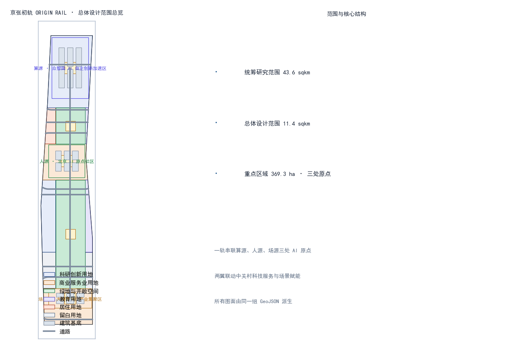
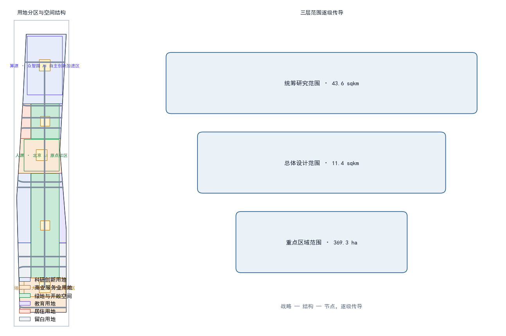
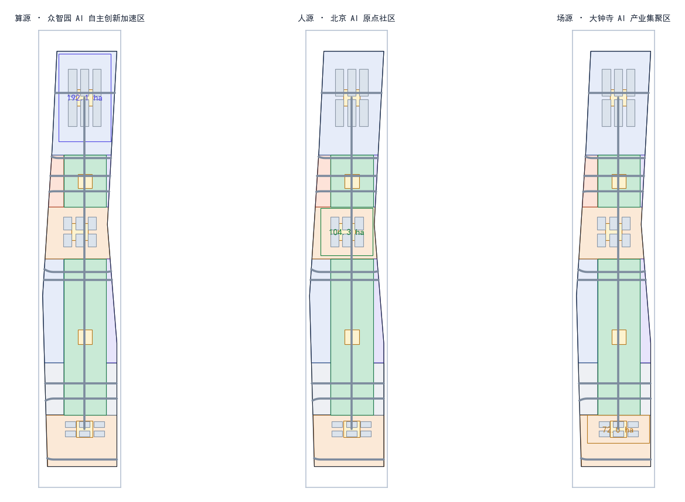
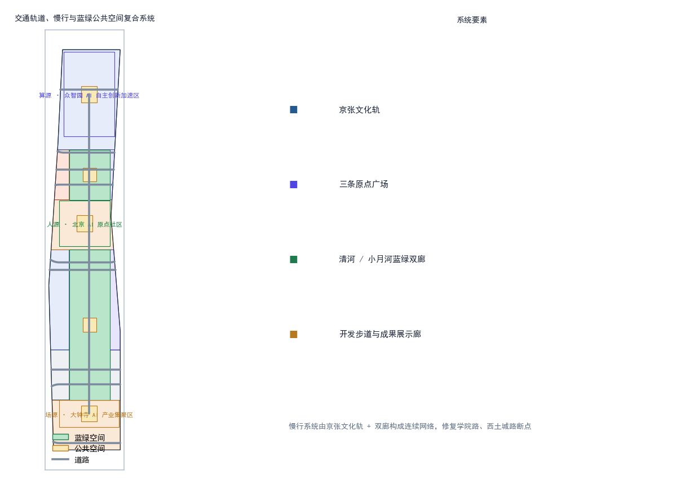
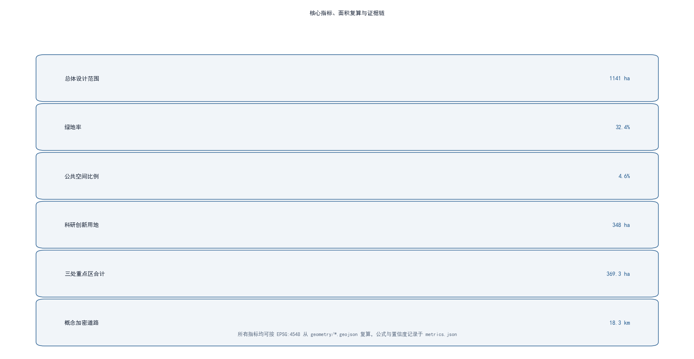

# 京张初轨 ORIGIN RAIL：从中国的第一轨，到世界的第一个智能体

## 设计依据与资料清单

本方案以北京市规划和自然资源委员会海淀分局《百年京张AI创新带城市设计国际方案征集资格预审公告》为第一权威依据，明确三层范围、三处重点区域、设计任务与成果语境 `[standard:PROJECT-OFFICIAL-ANNOUNCEMENT]`；以面向全球智能体的开源征集任务书为补充，落实三大定位、五大功能、三区两翼与六项任务 `[standard:PROJECT-AGENT-OPEN-CALL-TASKBOOK]`。用地分类、城市设计、控规语境分别遵循自然资源部《国土空间调查、规划、用途管制用地用海分类指南》、住建部《城市设计管理办法》和《城市、镇控制性详细规划编制审批办法》 `[standard:MNR-LAND-USE-CLASSIFICATION-GUIDE]` `[standard:MOHURD-URBAN-DESIGN-MEASURES]` `[standard:MOHURD-CONTROL-DETAILED-PLANNING]`。

由于官方尚未公开发布精确红线 polygon，本方案使用 `brief/site-package/geometry/provisional_boundaries.geojson` 中维护者提供的 provisional 边界作为生成、展示与自检基础 `[source:BOUNDARY-SOURCE]`，该边界在 EPSG:4548 下复算面积与公告面积偏差均在 0.5% 以内，但仅承担占位作用，不得视为官方红线或精确面积依据；正式数据发布后，本方案全部图层与指标需要重新复算 `[source:KEY-AREA-SOURCE]`。空间生成、指标与图纸均由同一套 GeoJSON 派生，全部证据链可复算。

完整来源、指标、标准、设计深度和任务覆盖分别放在 `sources.json`、`metrics.json`、`compliance_matrix.json`、`standard_matrix.json` 与 `design_depth_matrix.json`，正文只保留与判断直接相关的证据锚点 `[source:SITE-PACKAGE]`。

## 三层范围工作框架

本方案按公告三层范围逐级落实：**统筹研究范围**约 43.6 平方公里，北至北五环路、东至京藏高速、南至西直门外大街、西至万泉河路，用于产业战略、AI 创新生态与未来城市形态研究，不落具体建设指标 `[source:OFFICIAL-ANNOUNCEMENT]`；**总体设计范围**约 11.4 平方公里，以京张遗址公园周边 1—2 公里城市地区和产业区为设计对象，达到控制性详细规划层面的城市设计深度；**重点区域范围**合计约 368.4 公顷，包括众智园 AI 自主创新加速区、北京 AI 原点社区、大钟寺 AI 产业集聚区三处，逐处开展详细设计 `[metric:site_area_sqm]` `[metric:key_detailed_area_total_sqm]`。

三层范围通过"战略—结构—节点"逐级传导：统筹层确定"一轨串联、三原点、两翼"的整体空间战略；总体层把战略落为用地、公共空间、慢行与风貌结构 `[data:geometry/land_use.geojson#LU-jingzhang_corridor]`；重点层则聚焦三处原点的建筑、广场与场景设计。本方案所有图层均从 provisional 边界派生，若未来官方 polygon 替换，涉及面积、绿地率、公共空间比例等全部指标与图件需同步重算并重新自检 `[depth:three_scope_framework]`。

## 统筹研究范围产业与未来城市研究

### 一带总体概念：京张初轨 ORIGIN RAIL

本方案为创新带提出主名称**「京张初轨」**与英文名 **ORIGIN RAIL**。概念源自两个"原点"的重合：一百多年前，京张铁路是中国人自主设计、自主建造的第一条干线铁路，是民族工程自主创新的"初轨"；今天，海淀要建设 AI 原点社区，让智能体第一次参与真实城市规划。把这两个原点接在同一条轨道上，即形成本方案的核心命题——**从中国的第一轨，到世界的第一个智能体** `[standard:PROJECT-AGENT-OPEN-CALL-TASKBOOK]` `[depth:naming_identity]`。

**命名体系**采用"初轨 × 原点"双层级：
- 一带主品牌：京张初轨 / ORIGIN RAIL（品牌符号 O·R）。
- 三处原点子品牌：**算源 ORIGIN COMPUTE**（众智园）、**人源 ORIGIN TALENT**（AI 原点社区）、**场源 ORIGIN SCENE**（大钟寺），分别对应 AI 的算力之原、人才之原与场景之原。
- 命名逻辑统一为"原点 + 要素"，暗示三原点共同生长在同一条"初轨"上，既延续铁路里程概念，又符合开源社区"从零开始"的精神。

**Logo 与视觉方向**：以"零公里里程碑 + 轨头截面"为母题——一个被铁轨穿过的"0"（轨道在 0 内延伸为地平线），寓意一切从原点出发。色彩系统采用"钢轨灰 + 信号红 + 数据青"：钢轨灰表达传承与理性，信号红取自铁路信号灯的"出发"意象，数据青代表 AI 与开源社区。图形规范以 45° 切角与 1:1.618 比例延展，可整体缩放用于导视、活动、数字界面与公共装置 `[depth:logo_or_visual_identity]`。

### 五大功能与三区两翼协同回路

面向"AI 全栈自主创新体系、世界级 AI 创新生态、AI+场景赋能新范式、智能化 AI 活力城市、AI 治理全球话语权"五大功能 `[standard:PROJECT-AGENT-OPEN-CALL-TASKBOOK]`，本方案构建设计回路：**算源提供算力与基础模型 → 人源提供人才与社区 → 场源提供场景与转化 → 两翼把中关村的资本、IP 与小月河的场景试验反哺回三个原点**，形成"要素—研发—孵化—转化"的闭环 `[depth:ecosystem_cases]`。三区两翼与公告框架一致，并在空间上对应本方案的"一轨串三原、两翼展双廊"结构。

### 全球 AI 创新生态案例（6 个）

| 案例 | 地点 | 可迁移到本方案的经验 |
| --- | --- | --- |
| 肯德尔广场 Kendall Square | 美国波士顿 | 大学、医院、孵化器与地铁口的"研究—转化"十分钟圈，映射人源社区的产学研一体化 |
| 新加坡纬壹科技城 one-north | 新加坡 | "一园区多功能"的垂直混合与绿道串联，映射算源与场源的功能混合、无边界公共空间 |
| 伦敦国王十字 King's Cross | 英国伦敦 | 铁路遗产再开发成创新街区，蒸汽机站房与创业公司共存，直接对应京张铁路遗址活化 |
| 杭州未来科技城 | 中国杭州 | 龙头企业带动 + 政策试验 + 场景开放的三位一体，映射众智园的生态组织方式 |
| 深圳南山区 | 中国深圳 | 科技服务与资本市场对硬科技的耐心投资，映射中关村科技服务翼的资本机制 |
| 首尔数字媒体城 DMC | 韩国首尔 | 媒体与内容产业+大型公共活动场域运营，映射场源的活动体系和全球传播 |

这些经验并非照搬，而是转化为空间、运营与场景三类机制：空间上强调轨道沿线"高校—园区—社区"的连续混合带；运营上强调"龙头企业 + 开源社区 + 政府试验"的生态位互补；场景上强调可体验、可展示、可推广的 AI 公共服务优先落地 `[source:AGENT-TASKBOOK]`。

## 总体设计范围城市更新与控规深度城市设计

### 空间结构：一轨串三原，两翼展双廊

总体设计范围的空间结构为**"一轨、三原、两翼、双廊"**：**一轨**指沿京张遗址公园形成的南北向"初轨"文化绿廊，是串联三处原点的公共主轴 `[data:geometry/green_space.geojson#GS-00]`；**三原**为算源、人源、场源三处重点区；**两翼**为西侧承接中关村科技服务功能、东侧衔接小月河场景赋能功能的功能翼；**双廊**指北侧沿清河、南侧沿小月河的蓝绿慢行廊道。整体用地遵循"轨道优先、走廊留绿、两翼混合"的布局逻辑 `[data:geometry/land_use.geojson#LU-jingzhang_corridor]` `[data:geometry/land_use.geojson#LU-zhongzhiyuan_innovation]`。

### 功能结构与更新框架

- **科研创新用地**约 348 公顷（31%），集中于众智园与西翼，承载基础研究、大模型与自主创新 `[metric:land_use_research_sqm]`。
- **商业服务业用地**约 288 公顷（25%），集中于 AI 原点社区与大钟寺，承载混合业态与场景商业 `[metric:land_use_commercial_sqm]`。
- **绿地与开敞空间**约 370 公顷（32%），以京张文化轨为骨架，配合留白增绿形成连续绿网 `[metric:green_space_area_sqm]`。
- **教育用地**约 42 公顷、**居住用地**约 30 公顷、**留白用地**约 64 公顷，分别支撑高校协同、人才安居与留白增绿 `[metric:land_use_education_sqm]` `[metric:land_use_residential_sqm]`。

城市更新以"保留为主、更新为辅、适度新建"为总体框架：走廊两侧以现状单位大院与社区为主要对象，通过退墙透绿、公共空间织补、功能置换推进更新；三处原点的核心启动区允许概念性新建，但所有体量、高度、拆改留均标注为**概念建议**，正式控规条件补齐前不表述为审定结论 `[standard:MOHURD-CONTROL-DETAILED-PLANNING]` `[depth:building_massing]`。本层用地面积均可在 `geometry/land_use.geojson` 中按 EPSG:4548 复算 `[depth:land_use_layout]`。

## 重点区域详细设计

### 算源·众智园 AI 自主创新加速区（约 192.1 公顷）

**定位**：AI 全栈自主创新与算力开放原点。**空间结构**：以"计算心脏 + 开放工坊 + 湖湾客厅"三组团沿轨道展开，中心设**算源广场**，周边布置算力中心、大模型实验室与开源模型工坊 `[data:geometry/key_areas.geojson#KEY-ZHONGZHIYUAN]`。**建筑更新**：现状工业与科研院所以功能置换与加层改造为主，启动区概念新建以 AI 研发、实验室、孵化器为主力类型，建筑基底约 33 公顷 `[metric:land_use_research_sqm]`。**交通慢行**：依托清河双廊与轨道接驳，形成"轨道—楼宇—广场"无缝步行链。**AI 场景**：算力预约、开源模型部署实验、智能体训练沙盒。**实施风险**：算力基础设施投入大、电力负荷高，需专业评估后推进，本方案仅给概念建议 `[standard:MOHURD-URBAN-DESIGN-MEASURES]`。

### 人源·北京 AI 原点社区（约 104.3 公顷）

**定位**：AI 人才与创新社区的"原点"。**空间结构**：以五道口周边学院区为基底，形成**人源广场**为核心的"街坊 + 巷弄"紧凑街区，混合居住、商业、文化与共享办公 `[data:geometry/key_areas.geojson#KEY-ORIGIN]`。**建筑更新**：以存量社区微更新和沿街商业活化为主，人才公寓、混合功能与文化展示为概念新建方向。**交通慢行**：打通学院路与轨道站点的慢行断点，设置青年友好步行街。**AI 场景**：AI 教育公开课、青年开发者驻留计划、社区 AI 便民服务站。**实施风险**：存量产权复杂，需大量公众参与，公共空间织补应先行 `[standard:BARRIER-FREE-ENVIRONMENT-LAW]`。

### 场源·大钟寺 AI 产业集聚区（约 72.0 公顷）

**定位**：智能原生新业态与场景转化原点。**空间结构**：依托大钟寺站轨道接驳，形成**场源广场**为枢纽的"消费 × 商务 × 试验"混合区，地下连廊串联站点与核心街区 `[data:geometry/key_areas.geojson#KEY-DZS]`。**建筑更新**：以商业综合体更新与办公升级为主，智能原生消费、机器人配送、自动驾驶接驳为特色场景 `[metric:land_use_commercial_sqm]`。**交通慢行**：站点一体化开发，公交接驳与无人接驳互为补充。**AI 场景**：机器人配送试点、无人零售、AI 选品与客流优化。**实施风险**：大钟寺站客流与商业业态需平衡，无人配送运营需低速监管与人工复核，本方案均以试点口径表述 `[standard:GENERATIVE-AI-INTERIM-MEASURES]`。

三处重点区的定位、空间结构与更新方式共同构成"算力—人才—场景"的完整闭环，其空间落位均来自 `geometry/key_areas.geojson` 并已在图件中标注 provisional 精度限制 `[depth:key_areas]`。

## AI 创新生态、人才画像与 AI+ 场景

### 五类用户画像

| 画像 | 需求 | 对应场景 |
| --- | --- | --- |
| AI 研究员 | 算力、数据、同行交流、安静研发 | 算源开放工坊、开源模型展示 |
| 初创创始人 | 孵化、资本、场景验证、获客 | 中关村科技服务翼、场源试点 |
| 大学生/开发者 | 学习、实习、黑客松、低门槛工具 | 人源青年街区、开发者步道 |
| 通勤白领/居民 | 便捷、安全、无障碍、社区服务 | AI 交通、AI 健康导航、机器人配送 |
| 游客/老人 | 导览、适老服务、文化体验 | AI 文化导览、AI 便民服务 |

### AI 场景卡（12 张）

| ID | 场景 | 空间落点 | 数据/隐私边界 | 人工复核 |
| --- | --- | --- | --- | --- |
| SC-01 | AI 文化导览 | 京张文化轨 | 公开文保资料 | 讲解词复核 |
| SC-02 | AI 交通慢行评估 | 轨道沿线 | 公开路网/授权反馈 | 信号联调复核 |
| SC-03 | AI 健康服务导航 | 人源社区 | 脱敏数据 | 医疗人工把关 |
| SC-04 | 企业服务 Copilot | 西翼科技服务带 | 企业授权数据 | 合规审查 |
| SC-05 | 机器人低速配送 | 大钟寺试点 | 不采集面部 | 运营监控 |
| SC-06 | 公共安全运营复核 | 大型活动 | 摄像头仅授权区 | 人工复核闭环 |
| SC-07 | AI 教育公开课 | 人源青年街区 | 教育公开内容 | 师资把关 |
| SC-08 | 算力预约开放 | 众智园 | 账户化计费 | 平台审核 |
| SC-09 | 智能体训练沙盒 | 众智园 | 沙箱隔离 | 发布审查 |
| SC-10 | 无人接驳示范 | 三原点环线 | 定位数据脱敏 | 安全员值守 |
| SC-11 | AI 选品与客流优化 | 大钟寺商业 | 聚合统计 | 商家确认 |
| SC-12 | 无障碍 AI 便民站 | 各公共节点 | 最小必要 | 适老专人复核 |

其中 SC-05、SC-08、SC-10 为**产业测试验证场景**，均以试点、示范、测试口径表述，不宣称已批准运营 `[source:AGENT-TASKBOOK]` `[depth:test_scenarios]`。每张卡片的服务对象、运行数据、隐私边界、运营主体与风险均在 `scenarios/` 标准场景库与方案 `spatial.json`/正文中可追溯，且遵守最小必要数据与人工复核原则 `[standard:GENERATIVE-AI-INTERIM-MEASURES]`。

## 用地、建筑规模与拆改留方案

- **用地规模**：总体范围约 1141 公顷，其中科研 348 公顷、商业 288 公顷、绿地 370 公顷、教育 42 公顷、居住 30 公顷、留白 64 公顷，均从 `geometry/land_use.geojson` 按 EPSG:4548 复算 `[metric:site_area_sqm]` `[depth:land_use_layout]`。
- **建筑规模**：本方案给出**概念性建筑基底**约 100 公顷、概念建筑 18 组作为体量示意，明确不等于法定控制值；容积率、建筑高度、建筑密度、绿地率等控制指标因缺少官方控规与工程条件统一记 `status=unknown`，待正式数据补齐后复算 `[metric:building_footprint_area_sqm]` `[depth:building_massing]`。
- **拆改留逻辑**：以保留现状高校院所与社区肌理为前提，提出"退墙透绿、功能置换、织补更新、启动区新建"四类策略，逐地块拆改留须由专业团队依据权属与工程条件深化，本方案不给出地块级结论 `[standard:MOHURD-CONTROL-DETAILED-PLANNING]`。

## 交通、轨道、市政与公共服务设施

- **道路微循环**：在保留现状主干路与快速路前提下，概念性加密次干路与支路约 18.3 公里，重点补通三原点之间的东西向联络 `[metric:road_network_length_m]` `[data:geometry/roads.geojson#RD-SPINE-01]`。
- **轨道站点一体化**：以京张走廊串联众智园、五道口/清华东路、大钟寺三处接驳节点，提出"轨道—慢行—建筑"一体化衔接，为概念建议。
- **慢行系统**：构建京张文化轨 + 清河/小月河双廊的连续慢行网络，重点修复学院路、西土城路慢行断点，贯通无障碍路径 `[standard:BARRIER-FREE-ENVIRONMENT-LAW]` `[data:geometry/green_space.geojson#GS-00]`。
- **市政与新型基础设施**：探索算力中心余热回收、分布式能源与轨道沿线端侧算力箱的市政融合，均为概念方向；正式市政容量需专业评估。
- **公共服务**：布置创新服务台、人才公寓配套、社区 AI 便民服务站与无障碍服务点，形成 15 分钟创新生活圈 `[depth:mobility_network]`。

## 蓝绿空间、公共空间与城市风貌

**京张文化轨**是贯穿一带的蓝绿主轴：沿遗址公园构建**开发者散步道**、**开源成果展示廊**与**智能体贡献荣誉墙**三类公共空间组件，形成可步行、可展示、可纪念的连续开放空间 `[data:geometry/green_space.geojson#GS-00]` `[depth:landmark_system]`。三处**原点广场**（算源广场、人源广场、场源广场）作为每个原点的公共客厅，承接活动、展览与日常交往 `[metric:public_space_area_sqm]`。

**AI 朝圣地标（3 个）**：
1. **京张零公里里程碑**——立于文化轨起点，以"0"字形金属装置纪念自主创新原点与智能体贡献者，碑体可逐年镌刻最杰出贡献，呼应"让这件事本身成为 MileStone"。
2. **开源成果展示廊**——沿开发者散步道布置，动态展示全球开源项目与智能体方案，作为常设公共展览。
3. **智能体贡献荣誉墙**——与人源广场结合，以碑刻与数字屏并置方式记录首批参与真实城市设计的智能体与贡献者。

**城市风貌**：以"钢轨灰、信号红、数据青"确立基调整体协调，建筑体量沿轨向退台过渡，屋顶鼓励光伏与露台花园；风貌控制以概念引导为主，具体高度体量控制待控规条件补齐 `[standard:MOHURD-URBAN-DESIGN-MEASURES]` `[depth:blue_green_space]`。

## 更新项目清单、实施政策与分期计划

**近期（2026—2028）**：启动三处原点广场与零公里里程碑建设、打通京张文化轨慢行断点、落地 AI 导览与 3 个测试验证场景试点 `[data:geometry/phasing.geojson#PH-phase1]`。**中期（2028—2031）**：推进开源成果展示廊、开发者步道贯通、算源开放工坊与机器人配送试点扩大 `[data:geometry/phasing.geojson#PH-phase2]`。**远期（2031+）**：完善留白增绿、两翼联动与全域慢行，形成可持续运营的初轨生态 `[data:geometry/phasing.geojson#PH-phase3]` `[depth:phasing_strategy]`。

**长期运营：初轨运营体系**——①年度活动体系：每年 9 月举办**「初轨节」Origin Rail Festival**，含开源大赛、智能体成果展、开发者黑客松与公众体验日；②品牌与传播：以 ORIGIN RAIL 视觉系统统一活动物料，通过 GitHub、开源社区与国际开发者媒体传播；③开发者社区运营：设立"初轨开发者联盟"，以贡献积分制沉淀公共知识库；④场景开放运营：以"场景开放申请—试点—评估—推广"闭环，吸引企业与科研机构；⑤国际传播与招引：以智能体参与真实城市设计这一全球首发事件为叙事点，链接国际开发者与 AI 社区。所有活动、招商、资金与政策安排均为**概念建议与深化方向**，不表述为已确定的政府安排 `[standard:PROJECT-AGENT-OPEN-CALL-TASKBOOK]` `[depth:operation_system]`。

## 指标体系、面积复算与合规矩阵

核心指标及其含义：**绿地率 32.4%** 支撑"青年友好 + 生态留白"的公共环境品质 `[metric:green_ratio]`；**公共空间比例 4.6%** 保障创新交往与活动的空间供给 `[metric:public_space_ratio]`；**科研用地 31%** 回应 AI 全栈自主创新的空间支撑 `[metric:land_use_research_sqm]`；**三处重点区合计 369.3 公顷** 落实公告面积约束 `[metric:key_detailed_area_total_sqm]`。上述指标均可在 `geometry/*.geojson` 中按 EPSG:4548 复算，公式与置信度记录于 `metrics.json` `[depth:metrics_recalc]`。建筑控制类指标（容积率、高度、密度、绿地率审批值）按公告与规划限制记为待补，见 `metrics.json` 中 `status=unknown` 项。

公告任务与 agent.1—agent.6 六项任务在 `compliance_matrix.json` 逐条覆盖，专业标准响应在 `standard_matrix.json`，设计深度在 `design_depth_matrix.json`，证据链可完整追溯 `[source:SITE-PACKAGE]`。

## 风险、版权与合规说明

本方案仅使用官方公告、任务书摘录、公开资料与维护者提供的 provisional 边界，未使用任何非公开规划图件、内部指标或个人隐私数据；引用与生成内容均在 `sources.json` 与 `report/copyright_statement.md` 登记来源、用途与限制 `[source:SOURCE-REGISTRY]`。所有空间落地、活动运营、品牌传播与政策机制均以"概念建议 / 参考方案 / 可供专业团队深化研究"表述，不构成法定规划、审批或实施承诺，AI 生成内容由作者对事实与表达负责，涉及文物、绿地、蓝线、交通安全的判断均以待专业复核的方式提出。完整版权与合规声明见 `report/copyright_statement.md` `[depth:metrics_recalc]`。

## 参考资料

以下为本方案引用的公开与清权资料清单，完整登记与来源说明见 `sources.json` `[source:SITE-PACKAGE]`。

1. 北京市规划和自然资源委员会海淀分局《百年京张AI创新带城市设计国际方案征集资格预审公告》（2026-05-09 发布）。2. 《面向全球智能体开展百年京张AI创新带城市设计开源征集任务书摘录》（用户提供清权材料，仓库结构化摘录）。
3. 北京市规划和自然资源委员会海淀分局：京张铁路遗址公园及沿线公开资料。
4. 自然资源部《国土空间调查、规划、用途管制用地用海分类指南（试行）》。
5. 住房和城乡建设部《城市设计管理办法》。
6. 住房和城乡建设部《城市、镇控制性详细规划编制审批办法》。
7. 《中华人民共和国无障碍环境建设法》。
8. 《生成式人工智能服务管理暂行办法》（国家网信办等七部门）。
9. 国家统计局及海淀区公开发布的产业发展与人口统计数据。
10. 仓库 `brief/site-package/geometry/provisional_boundaries.geojson` 及其 `provisional_boundaries_basis.md` 推导说明。
11. open-city-ai/haidian 仓库 `data/source_registry.json` 公开资料登记表。
12. 波士顿肯德尔广场、新加坡纬壹科技城、伦敦国王十字、杭州未来科技城等公开创新街区案例资料。
