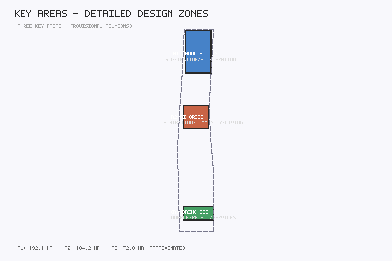
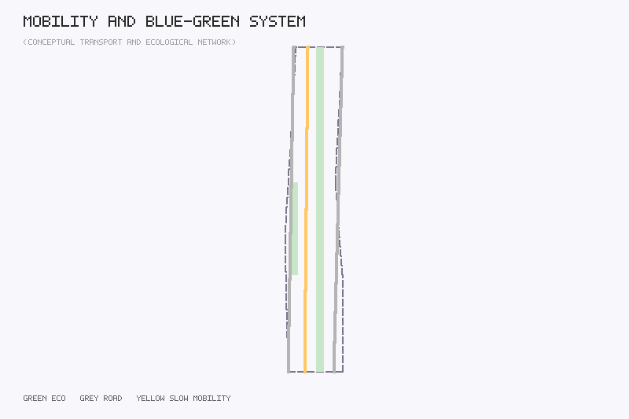
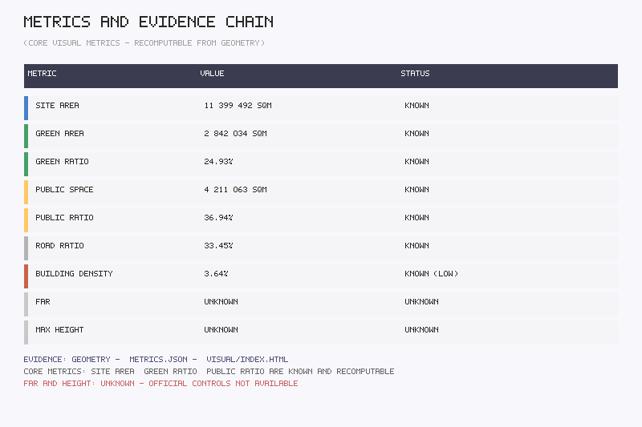

# ZhiPulse — Jingzhang Youth AI Innovation Belt

## Design Basis and Source Inventory

This proposal is based on the Centennial Jingzhang AI Innovation Belt urban design open call taskbook. Sources used: official announcement (May 9, 2026), agent-facing taskbook excerpt (May 18, 2026), provisional boundaries (June 5, 2026), Urban Design Management Measures (MOHURD, 2017), Regulatory Detailed Planning Compilation and Approval Measures, and National Territorial Space Land Use Classification Guide (MNR, 2023).

**Provisional Boundary Statement:** All spatial geometry in this proposal is based on repository provisional boundaries derived from announcement text descriptions and approximate area constraints. All area calculations, land use partitions, and spatial structures are conceptual proposals requiring recalculation when official data becomes available.

## Three-Level Scope Framework

The proposal establishes a "Coordinated Research Area — Overall Design Area — Key Area Detailed Design" three-level progressive framework.

- **Coordinated Research Area** (~43.6 sqkm): Covers the broader corridor from North 5th Ring Road to Beijing North Station, focusing on global AI innovation ecosystem comparison and regional industrial synergy.
- **Overall Design Area** (~11.4 sqkm): Covers the urban area 1-2 km around the Jingzhang railway heritage park, completing conceptual urban design for spatial structure, land use, transportation, and public space systems.
- **Key Area Detailed Design** (~368.4 ha, three key areas combined): Zhongzhiyuan AI Acceleration Area (~192.1 ha), Beijing AI Origin Community (~104.2 ha), and Dazhongsi AI Industry Cluster (~72.0 ha).

## Coordinated Research Area: Industry and Future City Research

### Overall Concept and Naming System

The proposal introduces "ZhiPulse" (智·脉) as the belt's overall concept name. "Zhi" (wisdom) points to the core driving force of AI innovation, while "Mai" (pulse) metaphorically references the Jingzhang railway's historical identity as a urban artery and the pulsing vitality of the AI innovation belt.

The naming system follows a "trunk-node-scenario" three-level structure: trunk naming as "ZhiPulse Innovation Corridor," node naming for three areas and two wings, and scenario naming using "function + space + AI" tripartite format.

### Three Positioning, Five Functions, and Three-Area-Two-Wing Synergy

**Three Positioning:** Centennial Jingzhang Cultural Belt (cultural foundation), Urban AI Life Experience Belt (scenario driver), AI Integration Innovation Belt (innovation engine).

**Five Functions:** AI Full-Stack Innovation System, World-Class AI Innovation Ecosystem, AI+ Scenario Empowerment Paradigm, Intelligent AI Vitality City, AI Governance Global Discourse.

**Three Areas and Two Wings:** Zhongzhiyuan Acceleration Area (R&D—testing—acceleration) → AI Origin Community (exhibition—exchange—living) → Dazhongsi Industry Cluster (commerce—consumption—services), with two wings providing element services and scenario testing.

### Global AI Innovation Ecosystem Cases

Seven cases are studied: Silicon Valley Sand Hill Road, London King's Cross Knowledge Quarter, Tokyo Shibuya Stream, Shenzhen Bay Entrepreneurship Plaza, Boston Kendall Square, Amsterdam Marineterrein, and Seoul DMC.

## Overall Design Area: Urban Renewal and Regulatory-Plan Depth Urban Design

The spatial structure adopts "one pulse, three cores, two wings extending." The "one pulse" is the Jingzhang railway heritage park activity belt; the "three cores" are the three key areas; the "two wings" are the Zhongguancun technology service wing and the Xiaoyue River scenario empowerment wing.

Land use divides the overall design area into six zones: AI R&D land (M1), AI innovation service land (B2), AI industry-commercial land (A2/B2), residential supporting land (R2), green and plaza land (G), and road and transport facility land (S). Green ratio ~24.9%, public space ratio ~36.9%, road ratio ~33.5%.

## Key Area Detailed Design

### Zhongzhiyuan AI Acceleration Area
Positioning: World-class AI full-stack innovation system engine. Spatial structure: "R&D core—testing ring—service outer ring" concentric layout. New construction includes Zhongzhiyuan Innovation Tower (conceptual 12 floors), AI Testing Validation Lab (conceptual 5 floors), and Open Source Achievement Gallery (conceptual 2 floors).

### Beijing AI Origin Community
Positioning: Public experience interface for the world-class AI innovation ecosystem. Spatial structure: "AI Origin Plaza—Exhibition Experience Street—Living Settlement." New construction includes AI Origin Experience Center (conceptual 6 floors) and Developer Apartment Building A (conceptual 15 floors). Retained and renovated: Jingzhang Railway Memorial (3 floors).

### Dazhongsi AI Industry Cluster
Positioning: Intelligent native new business consumption and commercial service cluster. Renovation includes Dazhongsi AI Commercial Complex (conceptual 8 floors) and Smart Retail Center (conceptual 6 floors).

## AI Innovation Ecosystem, Talent Profiles, and AI+ Scenarios

### User Personas (minimum 5 types)
1. AI Researcher (25-40): R&D space + computing service + academic exchange
2. Young Entrepreneur (22-35): Exhibition/pitch space + low-cost office + social third space
3. AI Developer/Open Source Contributor (20-35): Developer's Walk + honor display + community exchange
4. University Student (18-25): Study space + sports facilities + nighttime vitality
5. Community Resident and Visitor (all ages): AI public service navigation + accessible slow mobility + cultural experience

### AI Scenario Cards (minimum 10)

| ID | Scenario | Location | Users | Privacy |
|----|----------|----------|-------|---------|
| SC-01 | AI Origin Experience Plaza | AI Origin Community | All ages | Anonymous flow data |
| SC-02 | Developer's Walk | Jingzhang Greenway | Developers, residents | Optional step sharing |
| SC-03 | Agent Contribution Honor Wall | AI Origin Community entrance | Global AI community | Public display |
| SC-04 ★ | AI Testing Validation Lab | Zhongzhiyuan | Research institutions | Isolated test data |
| SC-05 | Open Source Achievement Gallery | Zhongzhiyuan public space | All ages | No privacy collection |
| SC-06 ★ | Smart Retail Center | Dazhongsi | Consumers | Anonymized consumption data |
| SC-07 | AI Legal Consulting Station | Dazhongsi | Entrepreneurs, residents | Legal consultation confidential |
| SC-08 ★ | Robot Delivery Pilot Corridor | Dazhongsi-AI Origin | Residents, workers | Path not linked to individuals |
| SC-09 | AI+Education Shared Learning Station | AI Origin-University area | Students | Anonymized learning data |
| SC-10 | Nighttime AI Vitality Block | Dazhongsi area | Youth, residents | Environmental data, no facial recognition |

★ = Industry test/validation scenario (minimum 3)

### Privacy and Human Review Boundaries
All AI scenarios follow minimum-necessary data collection principles. Public space sensing collects only anonymous aggregate data. AI service scenarios retain human review channels. Robot delivery and autonomous driving scenarios are limited to low-speed, supervised, auditable pilots.

## Land Use, Building Scale, and Retain/Renovate/Demolish

The proposal includes 10 representative buildings with conceptual floor counts. Total conceptual floor area: ~2,913,425 sqm (design model estimate, not full-scope). Building density: ~3.64%. All values are design model estimates, not statutory control values. FAR and height controls are marked as unknown pending official regulatory conditions.

## Transportation, Rail, Municipal, and Public Services

Road system uses three longitudinal spines: Xueyuan Road (west), Zhongguancun East Road (east), and Jingzhang Slow Mobility Path (center). The slow mobility system uses the Jingzhang heritage park greenway as a central walking path connecting three key area plazas.

## Blue-Green Space, Public Space, and Urban Character

The Jingzhang railway heritage park is the physical carrier of the "one pulse" spatial structure. The blue-green framework consists of "one vertical, two horizontal" corridors: Jingzhang Greenway (north-south), Xiaoyue River Ecological Corridor (east), and Zhongzhiyuan Waterfront Green Belt (north).

### AI Pilgrimage Landmarks (minimum 3)
1. **Agent Contribution Honor Wall** (BLD-008): The AI community's "Walk of Fame"
2. **Open Source Achievement Gallery** (BLD-009): AI open source milestone visualization
3. **Jingzhang Railway Memorial** (BLD-005): Century-old railway culture + AI guided tours

## Renewal Project List, Policies, and Phasing

- **Phase 1 (Near-term):** AI Origin Community and Dazhongsi launch area (~176.2 ha)
- **Phase 2 (Mid-term):** Zhongzhiyuan acceleration area and corridor connection (~33.8 ha)
- **Phase 3 (Long-term):** Quality upgrade and operational maturity (~59.1 ha)

### Global AI Innovation Activity System
Annual activity system includes "Jingzhang AI Innovation Week" (spring pitch + autumn exhibition), brand "ZhiPulse Festival." Developer community operations led by open source community alliance. All activities, investment, funding, and policy arrangements are conceptual proposals.

## Indicators, Area Recalculation, and Compliance Matrix

| Metric | Value | Status |
|--------|-------|--------|
| Site area | 11,399,492 sqm | known |
| Green ratio | 24.93% | known |
| Public space ratio | 36.94% | known |
| Road ratio | 33.45% | known |
| Building density | 3.64% | known (low) |
| FAR | — | unknown |
| Max building height | — | unknown |
| AI scenario nodes | 12 | known |

Three core visual metrics (site_area_sqm, green_ratio, public_space_ratio) are known finite values recomputable from submitted geometry. FAR and height are unknown due to unavailable official regulatory controls.

## Risk, Copyright, and Compliance

All spatial design suggestions are expressed as "conceptual proposals," "reference schemes," or "material for professional teams to deepen." This proposal does not constitute regulatory plan adjustment, FAR determination, height control, specific demolition/renovation conclusions, road alignment, rail line position, bridge/tunnel engineering, municipal pipeline, underground space engineering feasibility, land ownership, investment calculation, or approval decisions.

All results are conceptual proposals. The boundary clause is acknowledged. No forbidden final conclusions are made.

## References

1. Beijing Municipal Planning and Natural Resources Commission Haidian Branch. Centennial Jingzhang AI Innovation Belt Urban Design International Call Prequalification Announcement. May 9, 2026.
2. Agent-facing Taskbook Excerpt for the Centennial Jingzhang AI Innovation Belt Urban Design Open Call. May 18, 2026.
3. MOHURD. Urban Design Management Measures. March 14, 2017.
4. MOHURD. Regulatory Detailed Planning Compilation and Approval Measures.
5. MNR. National Territorial Space Survey, Planning, and Use Control Land Use Classification Guide. November 22, 2023.
6. Repository maintainers. Provisional boundaries for the three-level scope and three key areas. June 5, 2026.
7. Centennial Jingzhang Railway historical and cultural materials (public sources).
8. Global AI innovation ecosystem case studies (public sources).
