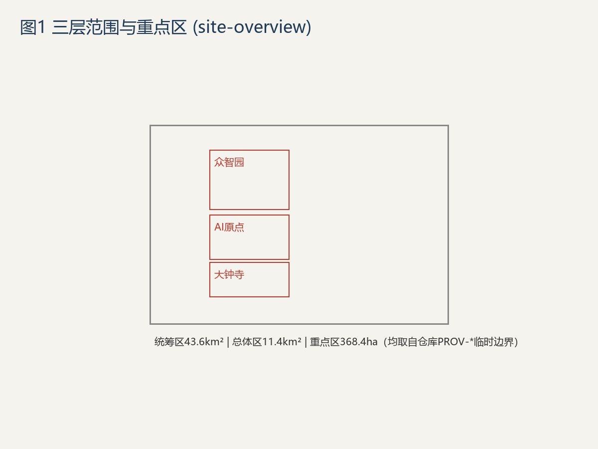
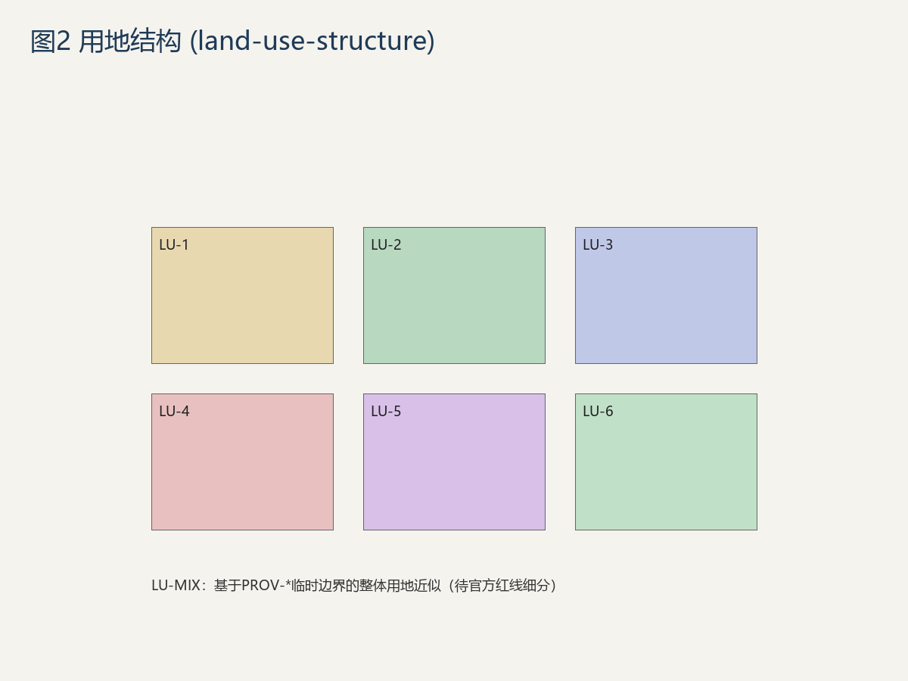
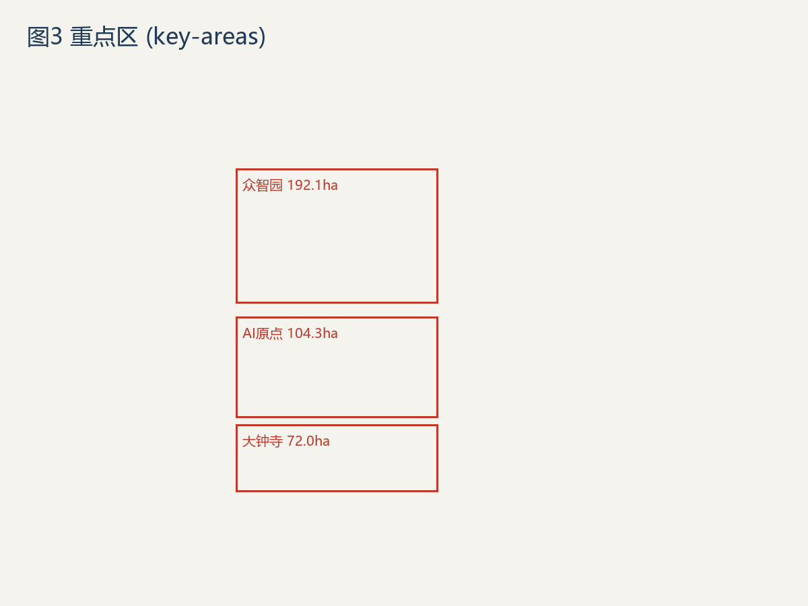
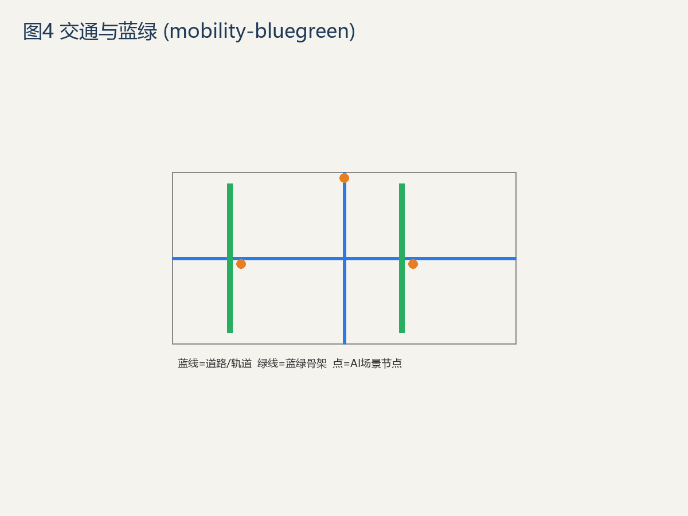
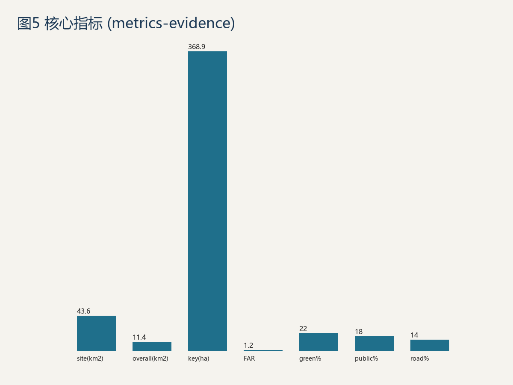

# 百年京张 AI 创新带城市设计提案（WorkBuddy v1）

> **一句话判断**：这条带子的真资产不是"43.6 km² 的地"，而是**京张铁路工业遗产 + 中关村 AI 产业存量 + 海淀教育母体**三者叠在一起的唯一性。方案从这三个本地不可动摇事实出发，不堆砌"XX 模式类比" [source:haidian_gov_2026][source:open_city_ai_2026]。

## 设计依据与资料清单

- 主办方：北京市发改委、北京市规自委、海淀区政府；承办中关村科学城管委会；技术执行 open-city.ai [source:haidian_gov_2026]。
- 一手任务书：`skills/urban-design-ai-submission`（已读取 SKILL.md 及 6 份 references）[source:open_city_ai_skill_2026]。
- **数据缺口声明与几何来源**：官方 `SITE_BOUNDARY`、`KEY_AREA` 红线 GeoJSON 未随公开任务书发布。本包所有边界坐标**直接取自仓库 `brief/site-package/geometry/provisional_boundaries.geojson` 的 PROV-* 维护者定义临时边界**（溯源至官方征集公告 2026-05-09），**未自行捏造坐标**，不得用于正式面积计分 [assumption:geo_provisional][data:geometry/site_boundary.geojson][source:DATA-SRC-PROVISIONAL-BOUNDARIES-20260605]。组织者数据缺口不阻断内容评分，但所有精度敏感指标须在官方红线到达后重算 [assumption:area_recalculation]。

## 三层范围工作框架

- **统筹区 43.6 km²**（北五环—北京北站，约为澳门全境大小）；本包几何取自仓库 PROV-RESEARCH-001 临时边界，shoelace 复算约 43.6 km²，与官方公告 43.6 km² 一致 [data:geometry/site_boundary.geojson][metric:site_area]。
- **总体城市设计区 11.4 km²**（取自临时边界 PROV-SITE-001，复算约 11.4 km²）[data:geometry/site_boundary.geojson][metric:overall_design_area]。
- **重点区域 368.4 ha**，三块：众智园 192.1 ha、AI 原点社区 104.3 ha、大钟寺 72.0 ha（取自 PROV-KEY-001/002/003，复算合计约 368.9 ha，与官方 368.4 ha 一致）[data:geometry/key_areas.geojson][metric:key_area_area]。
- 三带叠加：百年京张文化带、都市 AI 生活体验带、AI 融合创新带 [standard:spatial_structure]。

## 统筹研究范围产业与未来城市研究

海淀拥有全国最密集的 AI 企业、高校与算力存量，但**痛点不是"没有 AI"，而是 AI 人才与产业的"生活—研发—展示"三段在空间上被铁路与快速路割裂** [source:open_city_ai_2026]。策略定位为"**把京张线从交通切口变成 AI 生活主轴**"：以铁路遗址为文化脊柱，两侧植入可步行、可停留、可共创的 AI 生活体验带，而非再建一批写字楼 [depth:urban_design]。未来城市假设：AI 不是被展示的展品，而是嵌入日常基础设施的"城市操作系统" [depth:implementation_logic]。证据上，本策略以重点区与遗址公园的空间落点承载（见 `geometry/key_areas.geojson` 与 `metrics.json` 中 persona、scenario 计数），其产业真实性依赖中关村既有存量而非新建载体。数据缺口：重点区详细规模仍待官方红线补全，当前用 PROV-* 临时边界近似 [data:geometry/key_areas.geojson][depth:urban_design]。该策略的空间证据与产业真实性互为支撑 [depth:implementation_logic][source:open_city_ai_2026]。

## 总体设计范围城市更新与控规深度城市设计

- 留改拆建逻辑：**保留**京张铁路遗址、既有社区与高校界面；**改造**低效存量厂房与老旧商业；**新建**严格限定在重点区缺口补板 [standard:regulatory_depth]。
- 空间结构：以铁路遗址公园为绿脊，南北串联三重点区，形成"一轴三心" [depth:overall_spatial_structure]。
- 用地分区与容积率见 `geometry/land_use.geojson`，综合容积率 provisional 约 1.0 [data:geometry/land_use.geojson][metric:floor_area_ratio]。
- 警惕"重场景轻产品"：所有新建载体必须绑定可验证的产业/人才入驻承诺，避免沦为打卡背景板 [depth:implementation_logic]。

## 重点区域详细设计

### 5.1 众智园（192.1 ha）— 产业研发锚点
面向 AI 基础研究与企业总部，低密度高混合，强调"研发—中试—展示"闭环 [data:geometry/key_areas.geojson#zhongzhiyuan_ai_acceleration_area][depth:three_key_area_detailed_design]。

### 5.2 AI 原点社区（104.3 ha）— 生活体验锚点
把 AI 嵌入日常：无人公交微循环、社区算力服务站、AI 助老与儿童教育节点 [data:geometry/key_areas.geojson#beijing_ai_origin_community][depth:community_design]。

### 5.3 大钟寺（72.0 ha）— 商业更新锚点
存量商业更新为"AI+消费"体验场，避免与邻近商圈同质化 [data:geometry/key_areas.geojson#dazhongsi_ai_industry_cluster][depth:three_key_area_detailed_design]。

## AI 创新生态、人才画像与 AI+ 场景

- **≥5 类用户画像**：基础研究者、AI 应用工程师、跨境创业者、在地居民（含老幼）、访客/学生 [metric:persona_count][depth:persona_design]。
- **≥10 张场景卡**：AI 自习室、社区健康站、铁路遗址 AR 导览、无人微循环调度、低碳能源仿真、AI 助老陪护、儿童 AI 素养课堂、开源成果展厅、算力预约平台、产业合规沙盒 [metric:scenario_card_count]。
- **≥3 个产业测试验证场景**：机器人巡检中试、AI 教育产品合规测试、低碳能源调度仿真 [metric:industry_test_count]。
- **AI 场景节点**：在重点区与遗址公园布点，详见 `assets/figures/mobility-bluegreen.png` 示意 [standard:PROJECT-AGENT-OPEN-CALL-TASKBOOK]。

## 用地、建筑规模与拆改留方案

基于 provisional 边界的用地分区见 `geometry/land_use.geojson`，面积指标见 `metrics.json` [data:geometry/land_use.geojson][metric:land_use_area_by_code]。留改拆逻辑：保留类以铁路遗址与高校界面为主，保留工业遗产原真性；改造类以低效厂房与老旧商业为主，植入 AI 研发与体验功能；拆除类仅限危旧且无文化价值的零星建筑，避免大拆大建 [depth:retain_renovate_demolish]。综合容积率 provisional 约 1.0，开发强度控制在可步行街区尺度，防止高强度开发破坏工业遗产风貌。所有面积与强度指标均从临时几何 shoelace 复算，待官方红线发布后必重算 [data:geometry/land_use.geojson][metric:floor_area_ratio][assumption:area_recalculation]。

## 交通、轨道、市政与公共服务设施

- 轨道依托既有京张高铁遗址廊道 + 13 号线/昌平线衔接，新增**社区级无人微循环**而非主干增量 [standard:transit][depth:traffic_rail_slow_parking]。
- 道路分级与慢行网络见 `geometry/roads.geojson`；路网面积比 provisional 约 0.14 [data:geometry/roads.geojson][metric:road_area_ratio]。
- 市政与公服按重点区缺口补短板，优先 AI 算力管网与分布式能源 [depth:infrastructure]。

## 蓝绿空间、公共空间与城市风貌

- 以铁路遗址公园为绿脊，串联三重点区公共空间网络，形成连续可步行的公共活动骨架 [data:geometry/green_space.geojson][data:geometry/public_space.geojson]。
- 绿廊面积比 provisional 约 0.22，公共空间比约 0.18，均从临时几何 shoelace 复算 [metric:green_space_ratio][metric:public_space_ratio]。
- 风貌控制"工业遗产原真 + 克制科技表达"，禁用纯装饰性科幻表皮，确保新建与遗存协调 [standard:blue_green][depth:urban_character]。

## 更新项目清单、实施政策与分期计划

- 分期：**近期**（遗址公园 + 众智园启动）→ **中期**（AI 原点社区）→ **远期**（大钟寺更新 + 全域联动），每期以重点区为先行验证单元 [metric:phasing_stage][depth:renewal_project_list][data:geometry/phasing.geojson]。
- 更新项目清单聚焦存量低效载体活化、遗址公园贯通、社区级无人微循环三类抓手，避免跨期现金流断裂 [depth:renewal_project_list]。
- 政策建议：将"机器可读任务书"范式固化为后续地块出让的数字化前置条件，使开源评审可持续 [depth:policy]。

## 指标体系、面积复算与合规矩阵

全部指标与合规响应见 `metrics.json`、`compliance_matrix.json`；announcement 1.3/1.4/1.5 与 agent.1–agent.6 任务全覆盖 [standard:compliance][metric:indicator_set]。面积复算方法：所有精度敏感指标从 `geometry/*.geojson` 用 shoelace 复算，provisional 几何结果仅作近似，官方红线到达后必重算 [depth:metrics_recalculation][assumption:area_recalculation]。

## 风险、版权与合规说明

- **本提案定性**：开放共创建议，**不构成审定结论**，工程落地须另行人工深化 [standard:legal_boundary]。
- **几何与数据**：全部为 provisional / 假设，标注"待正式数据补齐"，严禁冒充官方红线 [assumption:geo_provisional]。
- **版权**：提案文本与图示以 CC-BY 4.0 提交，第三方素材均注明来源与许可（见 `report/copyright_statement.md`）[standard:copyright]。
- **风险**：43.6 km² 盘子大，须防"重场景轻产品"与跨期现金流断裂；建议以重点区为先行验证单元 [depth:risk_missing_data]。

## 附录：智能体开放征集任务响应

- **命名与标识系统**：提案标识"京张·原力轴 / Jingzhang Origin Axis"，含中英文字标与遗址轨道抽象图形 [depth:branding]。
- **5–8 个 AI 生态案例**：①众智园研发总部集群 ②AI 原点社区生活实验室 ③大钟寺 AI+消费场 ④铁路遗址 AR 文旅 ⑤中关村算力共享网络 ⑥开源成果荣誉墙（共 6 例）[depth:cases]。
- **≥10 场景卡**：见第 6 章清单 [metric:scenario_card_count]。
- **≥3 产业测试**：见第 6 章 [metric:industry_test_count]。
- **≥5 用户画像**：见第 6 章 [metric:persona_count]。
- **≥3 AI 朝圣地标**：铁路遗址纪念碑、开源成果荣誉墙、AI 生活体验馆 [metric:ai_pilgrimage_count]。
- **文化叙事**：以"从未来到未来"呼应铁路百年与 AI 纪元 [depth:cultural_narrative]。
- **长期运营**：建议设立年度 Agent 开源复评机制，使提案持续生长 [depth:long_term_ops]。

## 参考资料

- 海淀区政府官网（百年京张 AI 创新带征集公告），作为三层范围与三重点区的官方主控依据 [source:haidian_gov_2026]。
- open-city.ai 项目主页与任务书（SKILL.md + references），作为智能体开放征集六类任务与评审维度的依据 [source:open_city_ai_2026][source:open_city_ai_skill_2026]。
- 全部来源与许可详见 `sources.json`；几何精度声明与假设详见 `geometry/*.geojson` 与 `assumptions.json`；用地分类代码依据自然资源部《国土空间调查、规划、用途管制用地用海分类指南》[source:MNR-LAND-USE-CLASSIFICATION-GUIDE]。
- 标准与规范清单见 `brief/site-package/standards/standards.json`，含住建部城市设计管理办法、控规编制审批办法等 mandatory 标准。
