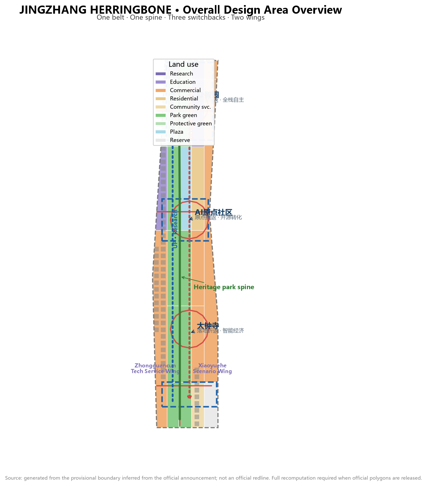
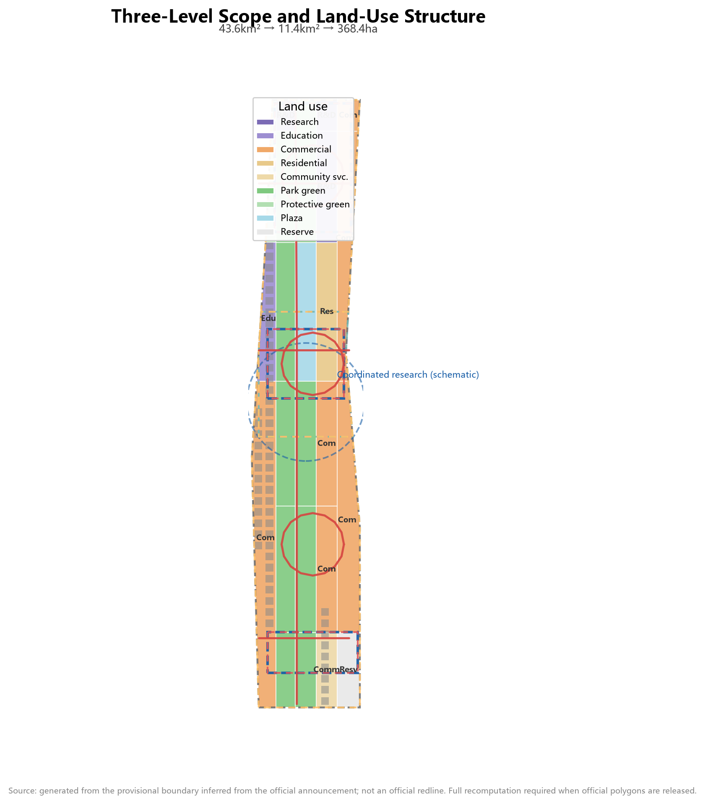
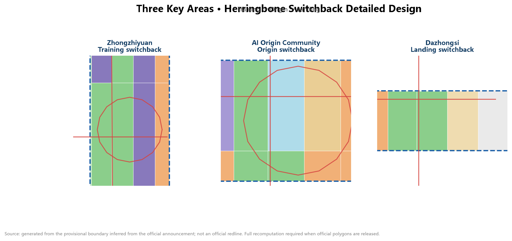
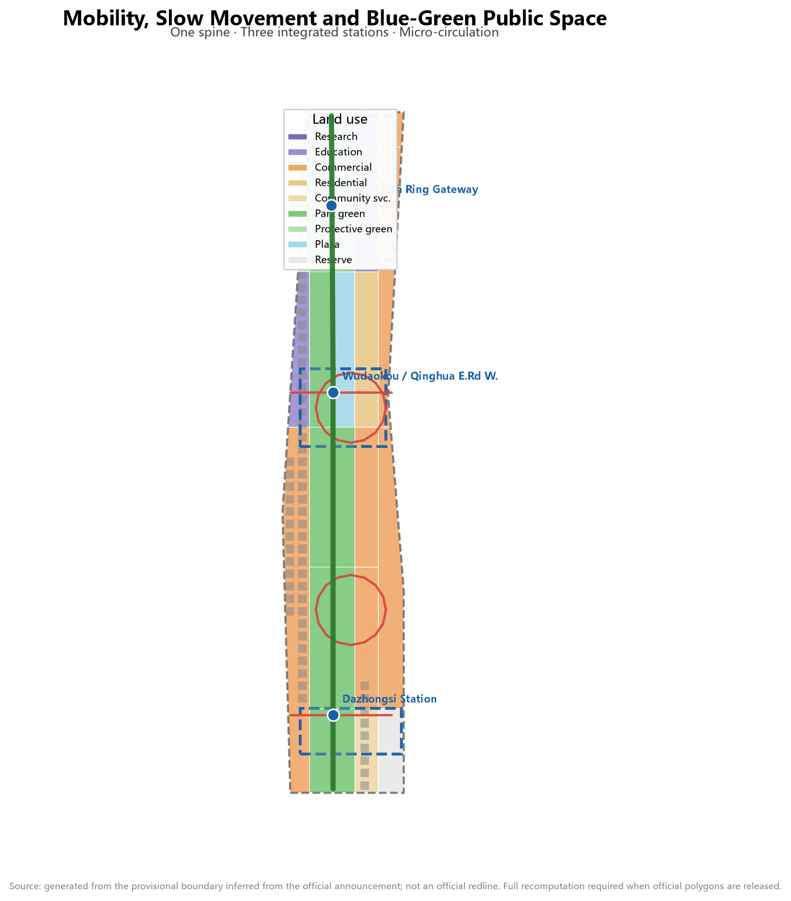
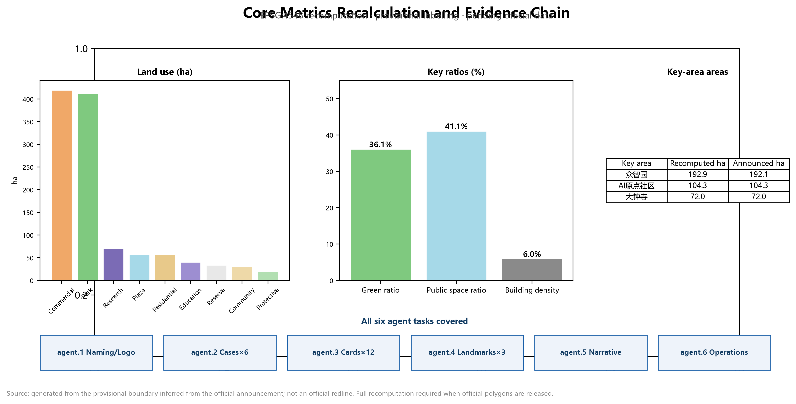

# JINGZHANG HERRINGBONE — A Century of Switchbacks, Innovation Crossing the Mountain: Urban Design Proposal for the AI Innovation Belt

## Design Basis and Source Inventory

This proposal takes as its primary basis the *Prequalification Announcement for the International Urban Design Solicitation of the Centennial Jing-Zhang AI Innovation Belt* published by the Haidian Branch of the Beijing Municipal Commission of Planning and Natural Resources [source:OFFICIAL-ANNOUNCEMENT]. The announcement defines three levels of scope (coordinated research area approx. 43.6 km², overall design area approx. 11.4 km², and key areas totalling approx. 368.4 ha), three positionings (Centennial Jing-Zhang Cultural Belt, Urban AI Life Experience Belt, and AI-Integrated Innovation Belt), and the deliverable depth of "regulatory-detailed-planning urban design depth plus implementation-plan depth" [standard:PROJECT-OFFICIAL-ANNOUNCEMENT].

The second basis is the co-creation taskbook addressed to AI agents [source:AGENT-TASKBOOK]; its ten co-creation principles, five functions, three-areas-two-wings structure, and six agent tasks (agent.1–agent.6) form the task skeleton of this proposal [standard:PROJECT-AGENT-OPEN-CALL-TASKBOOK]. All agent spatial suggestions are conceptual suggestions, reference schemes, or research materials for professional teams to deepen; they do not replace formal planning and do not constitute government-approved conclusions [source:AGENT-TASKBOOK].

The third basis is the machine-readable site package registered by repository maintainers: the design brief, allowed design space, enums, ranges, and schemas under `brief/site-package/`, together with the source usability registry `data/source_registry.json` [source:SITE-PACKAGE] [source:SOURCE-REGISTRY]. `data/processed/agent_fact_pack.md` serves only as a reading navigation layer, not as a new authoritative source [source:PROCESSED-FACT-PACK].

All spatial calculations use the repository's **provisional rough boundary** (`brief/site-package/geometry/provisional_boundaries.geojson`); every layer is labelled `provisional_constraint`, `official_boundary=false` [data:geometry/site_boundary.geojson#SITE-001] [data:geometry/key_areas.geojson#PROV-KEY-001]. The boundary was inferred from the announcement's textual extents and approximate areas; it does not express road redlines, parcel boundaries, or ownership boundaries. When official polygons are released, all layers and metrics in this package must be recomputed as a whole chain. This organizer data gap does not block content scoring [source:BOUNDARY-SOURCE].

## Three-Level Scope Framework

The proposal organizes work in the three levels defined by the announcement, each with a clear design question, deliverable depth, and data anchor [depth:three_level_scope_framework]:

| Level | Design question | Proposal answer | Data anchor |
| --- | --- | --- | --- |
| Coordinated research area (43.6 km²) | AI industry ecology and future city form | "Herringbone switchback" innovation chain: university ideation — open-source collaboration — enterprise conversion — public experience — international dissemination | compliance_matrix, standard_matrix |
| Overall design area (11.4 km²) | Industrial space, urban renewal, mobility, utilities, and character | One belt, one spine, three switchback points, two wings: land-use and public-space structure | [data:geometry/land_use.geojson#LU-001], [data:geometry/roads.geojson#ROAD-001] |
| Key areas (368.4 ha) | Fine-grained design of three districts | Zhongzhiyuan / AI Origin Community / Dazhongsi as training-switchback, origin-switchback, and landing-switchback detailed schemes | [data:geometry/key_areas.geojson#PROV-KEY-001], [data:geometry/key_areas.geojson#PROV-KEY-002], [data:geometry/key_areas.geojson#PROV-KEY-003] |

**Overall spatial structure: "one belt, one spine, three switchback points, two wings, multiple scenario nodes."** The belt is the Jing-Zhang Heritage Park vitality belt (the north-south main axis, i.e., the "track" of the character 人). The spine is the park's slow-mobility main route. The three switchback points are the three key areas. The two wings — the Zhongguancun Technology Service Wing (west) and the Xiaoyuehe Scenario Empowerment Wing (east) — form the two strokes of the character 人. Multiple scenario nodes are AI scenario stations distributed along the belt [depth:overall_spatial_structure].

The core metaphor comes from the **herringbone switchback line** of the Jing-Zhang Railway at Badaling: in 1909, Zhan Tianyou conquered a 33‰ grade by switchback climbing, with two locomotives pushing and pulling to complete the crossing — the landmark engineering feat of China's first self-built railway. A century later, the Haidian AI Innovation Belt uses the same wisdom to organize innovation: **innovation is not a straight line but a switchback**. The "up-line train" (basic research and original innovation) departs from Zhongzhiyuan, completes conversion at the AI Origin Community (the switchback point), and arrives at Dazhongsi as the "down-line train" (scenario deployment and industrial landing). Every switchback is a value leap; the character 人 is simultaneously the "human" of human-centred design [source:AGENT-TASKBOOK] [depth:three_level_scope_framework].

## Coordinated Research Area: Industry and Future City Study

### Three positionings and five functions

The coordinated research area answers the strategic question "where is Haidian's AI industry heading." The proposal translates the three positionings into operable spatial and operational mechanisms [source:AGENT-TASKBOOK]:

- **Centennial Jing-Zhang Cultural Belt**: the heritage park as the historical main axis, converting the engineering wisdom of the herringbone switchback into an urban narrative and public-art system [depth:culture_narrative_spatial_expression].
- **Urban AI Life Experience Belt**: rail nodes such as Wudaokou, Qinghe, and Dazhongsi as the skeleton, organizing AI+ mobility, AI+ public services, and AI+ consumption into a walkable, perceptible daily experience [depth:scenario_space_operation_matrix].
- **AI-Integrated Innovation Belt**: the "up — switchback — down" innovation loop organizing full-stack self-reliant innovation, the open-source ecosystem, and the intelligent economy [source:AGENT-TASKBOOK].

The five functions are anchored in space: the full-stack self-reliant innovation system (Zhongzhiyuan); the world-class AI innovation ecosystem (AI Origin Community); the new paradigm of AI+ scenario empowerment (Xiaoyuehe Scenario Empowerment Wing); the intelligent vibrant AI city (public space and slow-mobility systems); and global discourse power in AI governance (standards and safety governance at Zhongzhiyuan plus data-element circulation at Dazhongsi) [source:AGENT-TASKBOOK].

### Naming system and logo direction (agent.1)

**Primary name: "JINGZHANG HERRINGBONE" (人字京张).** The naming system has three levels:

1. **Belt name**: JINGZHANG HERRINGBONE — the century-old memory of the herringbone switchback line plus the spatial metaphor of the innovation belt, with a pun on human-centred design (人 = human).
2. **Three switchback names**: "Training Switchback · Zhongzhiyuan", "Origin Switchback · AI Origin Community", and "Landing Switchback · Dazhongsi", corresponding one-to-one with the up—switchback—down loop.
3. **Node and event names**: "Switchback Stations" (AI scenario nodes), "Up-line Train / Down-line Train" (two-way talent and industry flow), and "Mountain-Crossing Moment" (the annual innovation festival).

**Logo direction**: the herringbone switchback track as the basic form — two arrows in opposite directions meeting at one switchback point, forming an open 人-shaped loop; one stroke represents research going up, the other scenario coming down, and the meeting point is the conversion node. Suggested palette: railway rust red (Jing-Zhang heritage) + electric blue (AI new culture). The logo is a directional concept only; typefaces, graphics, and standard colours await professional design and rights clearance [depth:brand_identity_logo] [source:AGENT-TASKBOOK].

### Global AI innovation ecosystem cases (agent.2)

Six global cases are benchmarked, from which six transferable lessons are distilled [depth:case_study_table]:

| Case | Core mechanism | Transfer to Jing-Zhang |
| --- | --- | --- |
| Silicon Valley, USA (Stanford–101 corridor) | University ideation + venture capital + corporate clusters along a linear corridor | University ideation arranged along the heritage park main axis; capital services placed in the Zhongguancun Technology Service Wing |
| Kendall Square, Boston, USA | Near-campus innovation community mixing conversion and life | Strengthen the AI Origin Community "near-campus conversion street" |
| Punggol Digital District, Singapore | Garden-type industrial park; green space hosting innovation exchange | Zhongzhiyuan as a "garden-type AI block" with a low-carbon Qinghe riverfront |
| King's Cross, London, UK | Rail-transit-driven large-scale urban renewal + tech clustering | Dazhongsi station four-quadrant integration and the intelligent-economy block |
| Nanshan Science Park, Shenzhen, China | Flagship-enterprise pull + hardware innovation ecosystem | Dazhongsi flagship enterprises pulling agent and terminal industries |
| Munich digital industry cluster, Germany | Standards, testing, and governance combined with industry | Zhongzhiyuan standards-setting and safety-governance display node |

The common lesson: an innovation ecosystem = ideation (research) + conversion (intermediaries) + landing (industry) + atmosphere (urban life), a closed loop of four elements. The Jing-Zhang Innovation Belt organizes these four elements on one urban belt through the "herringbone switchback"; the three switchback points carry the key phases of ideation—conversion—landing, while the two wings provide capital services and scenario empowerment [depth:ecosystem_mechanisms].

### Three-areas-two-wings synergy loop

The "three areas and two wings" form a two-way loop: research goes up (universities — AI Origin — Zhongzhiyuan testing), factors are supplied (the Zhongguancun Technology Service Wing provides capital, IP, and global allocation services), scenarios come down (the Xiaoyuehe Scenario Empowerment Wing brings technology into daily life), and feedback returns (scenario data and needs flow back to the ideation end). The loop is not a one-way pipeline but a reversible, iterative switchback system: at any point where validation fails, projects and scenarios can pause, roll back, or retry [source:AGENT-TASKBOOK] [depth:overall_spatial_structure].

## Overall Design Area: Urban Renewal and Regulatory-Plan-Depth Urban Design

### Land-use structure and industrial space

The overall design area covers 11.4 km². `geometry/land_use.geojson` completely covers the submitted boundary with 25 seamless parcels [data:geometry/land_use.geojson#LU-001] [metric:land_use_parcel_count]. Core land-use judgements:

- **Park green, blue-green corridors and plaza (1401+1402+1403, approx. 488.8 ha, 42.8%)**: the Jing-Zhang Heritage Park vitality belt as the spine (approx. 412.5 ha), linked north to the Qinghe–Zhongzhiyuan blue-green corridor and the Fifth Ring green wedge, and south to the Dazhongsi station composite park; the Wudaokou AI Origin Plaza (approx. 56.9 ha) symbolizes the switchback point [data:geometry/green_space.geojson#GREEN-001] [metric:green_ratio]. The green ratio embodies the "garden-type AI innovation belt" positioning that supports a high-quality urban district attractive to talent.
- **Commercial service land (05, approx. 420.0 ha, 36.8%)**: concentrated in the Dazhongsi intelligent-economy block, the Origin Community consumption scenarios, and the Zhongzhiyuan industrial-service frontage, hosting agents, intelligent terminals, content consumption, and data-element circulation [data:geometry/land_use.geojson#LU-005].
- **Research and education land (0802+0804, approx. 110.9 ha)**: Zhongzhiyuan full-stack R&D and testing (approx. 70.2 ha) and university collaborative-innovation education land (approx. 40.7 ha), forming the up-line of "ideation—conversion" [data:geometry/land_use.geojson#LU-009] [data:geometry/land_use.geojson#LU-013].
- **Residential and community service land (0701+0702, approx. 87.6 ha)**: the AI talent community (approx. 56.9 ha) adjacent to the Origin Community, serving an integrated "work-life-social-learn" environment [data:geometry/land_use.geojson#LU-016].

### Building scale and retain/renovate/demolish logic

`geometry/buildings.geojson` uses 60 illustrative building footprints to express the spatial-supply form of renewed blocks (approx. 68.3 ha, building density approx. 6.0%) [data:geometry/buildings.geojson#BLDG-001] [metric:building_footprint_area_sqm] [metric:building_density]. Retain/renovate/demolish follows three logics [depth:retain_renovate_demolish]:

- **Retain**: heritage assets such as Qinghuayuan Railway Station, the built section of the heritage park, and the main buildings of existing universities and parks;
- **Renovate**: low-efficiency factories, wholesale markets, and ageing commercial frontages along the belt, mainly through "function replacement + form renewal";
- **New-build / reserve**: potential renewal parcels and the southern reserve parcel (approx. 33.8 ha) as elastic innovation reserves [data:geometry/land_use.geojson#LU-001].

Statutory control indicators — FAR, building height, density, green ratio, setbacks, and road redlines — are not available in public materials; `floor_area_ratio` in `metrics.json` is marked unknown and will be recomputed once official regulatory conditions are confirmed [metric:floor_area_ratio] [assumption:A-CONTROLS-001].

### Renewal project list and implementation policies

Six types of renewal projects (JZ-01—JZ-06) are formed at the overall-design level, covering slow-mobility gap stitching, the Qinghe innovation frontage, the near-campus conversion street, Dazhongsi four-quadrant connectivity, AI public-service nodes, and the global AI event route [depth:renewal_project_list]; details are given in the "Renewal Project List, Implementation Policies and Phasing" chapter. Policy suggestions — coordinated renewal entities, elastic FAR bonuses linked to public-interest space, scenario-open licensing, a compliant data-element circulation framework, and public-participation mechanisms — are all proposed as conceptual suggestions [depth:phasing_implementation].

## Key Areas: Detailed Design

The three key areas each reach implementation-plan urban design depth, each forming a complete sub-scheme of "positioning + spatial structure + building renewal + mobility and slow movement + public space + AI scenarios + implementation risks" [depth:three_key_area_detailed_design] [data:geometry/key_areas.geojson#PROV-KEY-001] [data:geometry/key_areas.geojson#PROV-KEY-002] [data:geometry/key_areas.geojson#PROV-KEY-003].

### Zhongzhiyuan AI Self-Reliant Innovation Acceleration Area (Training Switchback, approx. 192.1 ha)

**Positioning**: a garden-type full-stack self-reliant innovation block and the departure station of the AI "up-line train". **Spatial structure**: the Qinghe frontage as the northern ecological and display interface, organizing a triangle of "R&D-testing core + standards-governance terrace + industry-display gallery". **Building renewal**: centred on the national AI platform and surrounding potential parcels, with suggested functions of full-stack R&D, standards workshops, safety-governance display, and low-carbon compute experience; low-rise garden-type blocks as the main form. **Mobility**: outward-traffic optimization direction proposed in coordination with Fifth Ring integrated planning; slow-priority micro-circulation within. **Public space**: the Qinghe–Zhongzhiyuan blue-green corridor hosts open testing and innovation exchange [data:geometry/green_space.geojson#GREEN-001]. **AI scenarios**: model red-team testing, standards workshops, safety-governance display, low-carbon compute experience. **Risks**: Qinghe blue line and flood-control conditions, land ownership around the national platform, and the Fifth Ring outward-traffic scheme all await official data.

### Beijing AI Origin Community (Origin Switchback, approx. 104.3 ha)

**Positioning**: a near-campus conversion and talent community — the "switchback point" of the innovation chain. **Spatial structure**: Wudaokou–Qinghua East Road West station nodes as the gateway, organizing "conversion street + open-source release hall + talent community". **Building renewal**: a low-disruption, organic-renewal retain/renovate/demolish scheme — ageing commercial and residential frontages around universities mainly undergo function replacement, with new conversion-incubation and talent-service carriers added. **Mobility**: integrated design around Wudaokou and Qinghua East Road West stations, stitching campus–park–block slow-mobility links [data:geometry/roads.geojson#ROAD-002]. **Public space**: the Wudaokou AI Origin Plaza and open-source venue (plaza land 1403) as the symbol of the switchback point [data:geometry/public_space.geojson#PUBLIC-001]. **AI scenarios**: the open-source release hall, near-campus conversion street, talent-special-zone services, and AI education experiences. **Risks**: campus boundaries, ownership, and ground-floor functions are constrained by university and block realities and must be confirmed case by case.

### Dazhongsi AI Industry Cluster (Landing Switchback, approx. 72.0 ha)

**Positioning**: an urban intelligent-economy and international-exchange block — the terminus of the AI "down-line train". **Spatial structure**: anchored at Dazhongsi station, organizing "four-quadrant pedestrian connectivity + intelligent-economy block + data-element service terrace". **Building renewal**: around flagship enterprises and university renewal schemes, with suggested functions of agents, intelligent terminals, and content consumption. **Mobility**: four-quadrant pedestrian connectivity at the Dazhongsi station intersection, plus non-motorized parking and static-traffic organization [data:geometry/roads.geojson#ROAD-003]. **Public space**: composite use of the Dazhongsi station composite park for industrial display and international exchange [data:geometry/green_space.geojson#GREEN-001]. **AI scenarios**: agent and terminal display, content-consumption experience, data-element sandbox circulation, and international roadshows. **Risks**: the rail-integration scheme, composite green-land conditions, and ownership around flagship enterprises await confirmation.

## AI Innovation Ecosystem, Talent Profiles, and AI+ Scenarios

### Five user personas (agent.3)

The proposal establishes five user personas, each with spatial responses and governance boundaries [depth:persona_table]:

| Persona | Typical needs | Spatial response | Self-check boundary |
| --- | --- | --- | --- |
| Open-source developer | Release, collaborate, test, community reputation | Origin Community open-source release hall, public code wall, night collaboration space | No personal behavioural tracking; event data aggregated only |
| Startup team | Low-cost office, compute access, product testbed | Zhongzhiyuan shared testing field, edge-compute station, standards-governance advisory | Compute and data services require separate authorization |
| Flagship-enterprise visitor | Display, business, international reception, recruitment | Dazhongsi international roadshow lounge, station connectivity, public space around key enterprises | Corporate logos and cases require rights clearance |
| Local resident | Commuting, leisure, community services, low-disruption renewal | Heritage park slow loop, embedded community services, graded night lighting and events | Resident profiles not used for commercial recommendation |
| University faculty and students | Conversion, cross-campus collaboration, daily slow movement | Campus–park slow-mobility stitching, conversion stations, AI education experience points | Campus data and research results require authorization |

### Twelve AI scenario cards (agent.3, including 3 industry test/validation scenarios)

Scenario cards cover industrial scenarios and urban-function scenarios; each card states the spatial carrier, target users, data sources, privacy boundary, human review, and operating entity [depth:scenario_space_operation_matrix]:

| Card | Spatial carrier | Type | Design note |
| --- | --- | --- | --- |
| 01 Model red-team testing field | Zhongzhiyuan | **Industry test/validation** | Adversarial testing and safety evaluation of full-stack models; visitable, bookable, supervised; results published only after human review |
| 02 Data-element sandbox circulation room | Dazhongsi | **Industry test/validation** | Compliant, authorized, auditable data-element and digital-asset circulation trials; no personal data processing |
| 03 Edge-compute station | Nodes in overall design area | **Industry test/validation** | New-infrastructure prototype combining edge compute and distributed energy; small pilot, graded rollout after validation |
| 04 Open-source release hall | AI Origin Community | Industrial scenario | Release events, code-contribution display, and small roadshows serving the developer community |
| 05 Near-campus conversion street | AI Origin Community | Industrial scenario | Incubation, display, legal, IP, and financing services on one street |
| 06 Dazhongsi international roadshow lounge | Dazhongsi | Industrial scenario | Display, negotiation, and media release for agent, terminal, and content-consumption enterprises |
| 07 AI slow-mobility navigation and gap detection | Heritage park spine | Urban function | Explainable wayfinding and low-intrusion sensing identifying slow-mobility gaps, crowding, and accessibility needs; data-minimal |
| 08 Qinghe low-carbon innovation gallery | Zhongzhiyuan riverfront | Urban function | Public living room combining green space, stormwater, walking/cycling, and AI display |
| 09 AI life-service model street | Community–commerce junction | Urban function | Small-scale block deployment of AI+ healthcare, education, legal, and life services |
| 10 Qinghuayuan Station AI cultural guide | Southern heritage park | Urban function | Explainable guide to centennial Jing-Zhang culture, Zhongguancun innovation, and AI new culture |
| 11 Public-safety AI review drill field | Public-space nodes | Urban function | AI-assisted crowd-flow and event-safety drills, with humans retaining final decisions |
| 12 Global AI event week route | Belt public-space system | Operational scenario | A walkable experience route from heritage culture, open-source community, industrial display, to international roadshows |

All scenarios follow the principles of data minimization, public sources, explainability, and human review: urban agents may assist in identifying slow-mobility gaps, public-space heat, facility maintenance, and event-safety risks, but cannot replace planning approval, output unauthorized personal profiles, or claim official implementation commitments [standard:GENERATIVE-AI-INTERIM-MEASURES] [depth:privacy_human_review_boundary].

## Land Use, Building Scale, and Retain/Renovate/Demolish

Land use follows [standard:MNR-LAND-USE-CLASSIFICATION-GUIDE] codes including 0802/0804/05/0701/0702/1401/1402/1403/16, forming a complete, closed, seamless partition [data:geometry/land_use.geojson#LU-001]. Building footprints express the spatial-supply form of retained, renovated, and new buildings [data:geometry/buildings.geojson#BLDG-001] [depth:height_massing_character]. Building-scale and intensity indicators stay consistent with `metrics.json`: computable spatial indicators (areas, ratios, counts) are known; statutory control indicators (FAR, height, density, green ratio, setbacks) are unknown pending official conditions [metric:floor_area_ratio] [assumption:A-CONTROLS-001].

## Mobility, Rail, Municipal Services, and Public Facilities

The mobility scheme addresses rail-station integration, road micro-circulation, slow-mobility gaps, outward traffic, parking, and non-motorized traffic organization [depth:traffic_rail_slow_parking]:

- **Slow-mobility spine**: the north-south through slow-mobility route of the Jing-Zhang Heritage Park as the "herringbone track", organizing east-west stitching mouths and grade-separated crossing nodes [data:geometry/roads.geojson#ROAD-001].
- **Rail integration**: integrated design at Wudaokou, Qinghua East Road West, and Dazhongsi stations, with rail nodes as switchback gateways [data:geometry/roads.geojson#ROAD-002] [data:geometry/roads.geojson#ROAD-003].
- **Micro-circulation**: block micro-circulation loops in each of the three key areas, linking slow movement and transit [data:geometry/roads.geojson#ROAD-004] [data:geometry/roads.geojson#ROAD-005] [data:geometry/roads.geojson#ROAD-006] [data:geometry/roads.geojson#ROAD-007].
- **Outward traffic**: optimization direction for Zhongzhiyuan outward access in coordination with Fifth Ring integrated planning.

Municipal and new infrastructure integrate distributed energy, edge compute, AI industry services, and talent life services [depth:municipal_new_infrastructure]. Missing road redlines, utilities, fire, and municipal conditions are listed in assumptions as pending, not written as approved conditions [data:geometry/constraints.geojson#CONSTRAINTS].

## Blue-Green Space, Public Space, and Urban Character

Blue-green space takes the Jing-Zhang Heritage Park vitality belt as the skeleton, coordinating Qinghe, Xiaoyuehe, and the travel needs of surrounding universities, enterprises, and communities, forming a north-south through, east-west connected network of trails, cycleways, and green space [data:geometry/green_space.geojson#GREEN-001] [depth:blue_green_public_space]. The public-space system centres on the heritage park main axis and the Wudaokou AI Origin Plaza [data:geometry/public_space.geojson#PUBLIC-001] [metric:public_space_ratio].

Urban character fuses Jing-Zhang railway history, Zhongguancun innovation culture, and AI new culture: with cultural assets such as Qinghuayuan Railway Station as anchors, the "century of switchbacks" urban tone is shaped — the heritage-park section continues rail memory and red-brick colours, while innovation street sections introduce lightweight, transparent, changeable AI-era architectural language [standard:MOHURD-URBAN-DESIGN-MEASURES] [depth:urban_character_facade].

### Three AI pilgrimage landmarks (agent.4)

1. **Qinghuayuan Railway Station · Centennial Origin Monument** (south of the AI Origin Community): the Jing-Zhang railway heritage asset plus the AI cultural origin, with a "from whistle to compute" timeline installation displaying the dual-century narrative of Qinghuayuan Station and Haidian AI development [depth:landmark_catalog];
2. **Wudaokou · Herringbone Switchback Viewing Terrace** (AI Origin Community): a public structure in the form of the herringbone switchback track, symbolizing the conversion node of the innovation chain, housing an open-source contribution honour wall and developer memorial plaques [depth:honor_display_system];
3. **Dazhongsi · AI Window on the World** (Dazhongsi station composite park): a public-art landmark evoking data flows and model inference, hosting international roadshows and outcome releases for global dissemination [source:AGENT-TASKBOOK].

All landmarks are conceptual suggestions and do not express approved construction; all wayfinding, signage, symbols, and public art require full rights clearance before implementation [depth:signage_symbol_system].

## Renewal Project List, Implementation Policies, and Phasing

### Renewal project list

| No. | Project | Type | Key dependencies | Evidence |
| --- | --- | --- | --- | --- |
| JZ-01 | Heritage park slow-mobility gap stitching | Public space/mobility | Road redlines, under-bridge space, traffic review | [data:geometry/roads.geojson#ROAD-001] |
| JZ-02 | Qinghe innovation frontage at Zhongzhiyuan | Blue-green/industry display | River blue line, ecology, flood control | [data:geometry/green_space.geojson#GREEN-001] |
| JZ-03 | Origin Community near-campus conversion street | Urban renewal/industry services | Campus boundaries, ownership, ground-floor uses | [data:geometry/buildings.geojson#BLDG-001] |
| JZ-04 | Dazhongsi station four-quadrant pedestrian connectivity | Rail integration/slow movement | Station, intersection, utilities | [data:geometry/public_space.geojson#PUBLIC-001] |
| JZ-05 | AI public service and edge-compute nodes | New infrastructure/public services | Energy, compute, safety, operating entity | [data:geometry/constraints.geojson#CONSTRAINTS] |
| JZ-06 | Global AI event week public route | Operations/brand | Public-space permits, event safety, rights clearance | [data:geometry/phasing.geojson#PHASE-001] |

### Phasing

`geometry/phasing.geojson` expresses three phases [data:geometry/phasing.geojson#PHASE-001] [data:geometry/phasing.geojson#PHASE-002] [data:geometry/phasing.geojson#PHASE-003]:

- **Phase 1 (near-term pilot)**: the three key areas and the heritage park main axis, approx. 369.3 ha, starting with lightweight facilities, scenario opening, and operational events [metric:phase_1_area_sqm];
- **Phase 2 (mid-term renewal)**: the Origin Community–Wudaokou vitality core, stitching campus, park, and block [metric:phase_2_area_sqm];
- **Phase 3 (long-term governance)**: the two-wing expansion and southern reserves as elastic innovation reserves [metric:phase_3_area_sqm].

### Global AI event system and long-term operations (agent.6)

**Annual event system**: the "JINGZHANG HERRINGBONE" year-round event matrix — spring "Mountain-Crossing Moment · Model Evaluation Festival" (Zhongzhiyuan testing fields open), summer "Open-Source Switchback · Developer Conference" (Origin Community release hall), autumn "Landing Switchback · Intelligent Economy Expo" (Dazhongsi roadshow lounge), and winter "Annual Review · Scenario Retrospective" (public annual report on data and scenario operations). All events are conceptual suggestions and do not constitute confirmed government arrangements [source:AGENT-TASKBOOK].

**Developer community operations**: the open-source release hall and public code wall as spatial carriers, with a contributor honour system (linked to landmark 2), code review and rollback mechanisms, and quarterly meetups. **Scenario-open operations**: a "scenario-open licensing" mechanism through which enterprises may apply for testing scenarios within agreed data and safety boundaries; test results are published after human review. **Public experience and landmark operations**: the global AI event week route links the three switchback points into a walkable, shareable public experience. **International dissemination and conversion**: the "JINGZHANG HERRINGBONE" brand and the "up—switchback—down" narrative target global audiences; talent, enterprise, and developer conversion occurs through roadshows and scenario opening, with conversion paths and performance indicators to be calibrated by operational data [depth:annual_event_system] [depth:conversion_pathway].

## Indicator System, Area Recalculation, and Compliance Matrix

Indicators are organized in three classes [depth:metrics_recalculation]:

1. **Spatially computable indicators (known)**: `site_area_sqm` (11,412,825.4), `key_detailed_design_area_sqm` (3,692,893), `green_ratio` (0.4283), `public_space_ratio` (0.4113), `building_density` (0.0599), `land_use_parcel_count` (16), `key_area_count` (3), `phase_count` (3) [metric:site_area_sqm] [metric:green_ratio] [metric:key_area_count].
2. **Control indicators requiring official regulatory planning (unknown)**: FAR, building height, density, green ratio, setbacks, road redlines [metric:floor_area_ratio] [assumption:A-CONTROLS-001].
3. **Performance indicators requiring operational calibration**: AI innovation index, talent density, event participation, scenario usage frequency — recorded in the compliance matrix as future deepening directions, not disguised as approved planning conditions.

The 36.1% green ratio and 41.1% public-space ratio (blue-green plus plaza totalling 42.8%) support the "garden-type AI innovation belt" positioning and a high-quality district attractive to talent, as well as innovation exchange and public experience; the three switchback-point areas, recomputed in EPSG:4548 against the announced approximate areas (192.1/104.3/72.0 ha), deviate by +0.02% to +0.43%, consistent with provisional-boundary precision expectations [metric:zhongzhiyuan_area_sqm] [metric:beijing_ai_origin_area_sqm] [metric:dazhongsi_area_sqm].

`compliance_matrix.json` covers every mandatory task of announcement sections 1.3/1.4/1.5 and agent.1–agent.6; `standard_matrix.json` covers all mandatory professional standards; `design_depth_matrix.json` sets all required depth items to complete. Together with `metrics.json`, `sources.json`, and `assumptions.json`, they form the machine-audit layer [source:SITE-PACKAGE].

## Risks, Copyright, and Compliance

**Bilingual contract**: this package declares `bilingual_contract_version: "1"`; the primary file is the Chinese `proposal.md`, with the complete English counterpart `proposal.en.md`; all five core figures, A3/A0 drawings, and HTML reading versions provide English counterparts, with terminology following the recommended translations in `docs/terminology-glossary.md` [depth:risk_missing_data].

**Materials and copyright**: all spatial conclusions are based on public or cleared materials; provisional boundaries, land use, buildings, and roads are labelled `provisional_constraint` and are not used for approval or precise-area conclusions; the provenance and authorization status of images, drawings, icons, data, and code are registered in `sources.json` and `report/copyright_statement.md`. The logo direction, landmarks, and public art are conceptual suggestions; typefaces, images, portraits, and trademarks await professional design and clearance [source:SITE-PACKAGE].

**Compliance boundary**: this proposal does not claim official approval, approved regulatory planning, final land ownership, final construction scale, or guaranteed implementation; all agent spatial suggestions are conceptual and do not replace formal planning or bypass government review and statutory approval [source:AGENT-TASKBOOK]. The gaps listed in `missing_data_checklist.csv` — official boundary, regulatory conditions, roads, parcels, buildings, municipal works, heritage protection, and public services — are registered in `assumptions.json` and this section, to be recomputed as a whole chain once official data is released [data:geometry/constraints.geojson#CONSTRAINTS] [assumption:A-CONTROLS-001].

## References

- Haidian Branch, Beijing Municipal Commission of Planning and Natural Resources: *Prequalification Announcement for the International Urban Design Solicitation of the Centennial Jing-Zhang AI Innovation Belt* (2026-05-09)
- Excerpt of the open-call taskbook for global AI agents on the Centennial Jing-Zhang AI Innovation Belt (agent.1–agent.6)
- Repository site package: design_brief, agent_taskbook, allowed_design_space, enums, planning_limits, standards
- `data/source_registry.json` and `data/processed/agent_fact_pack.md`
- Provisional boundary inference and public-source verification record (provisional_boundaries_basis.md)
- Complete machine indexes: `sources.json`, `metrics.json`, `compliance_matrix.json`, `standard_matrix.json`, `design_depth_matrix.json`
