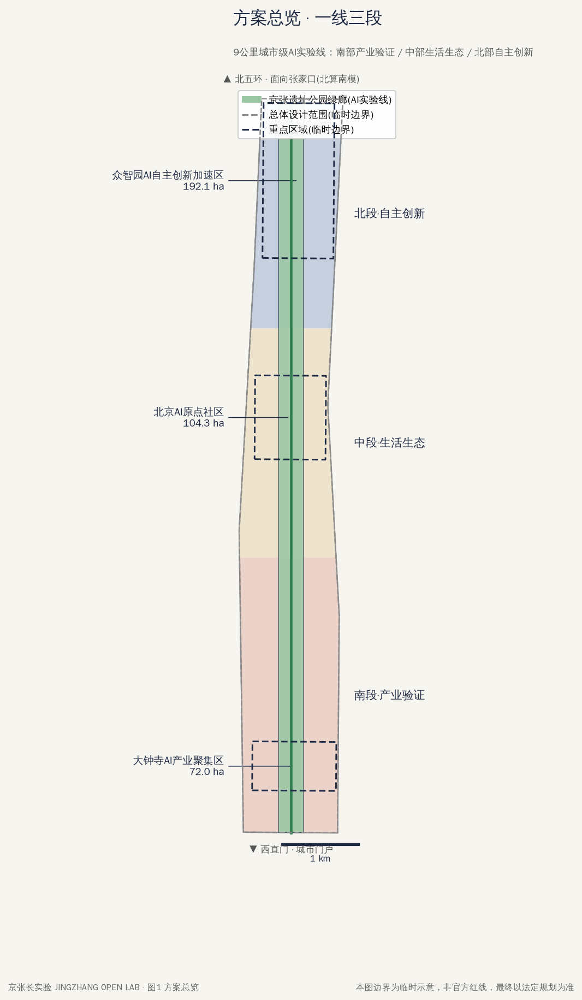
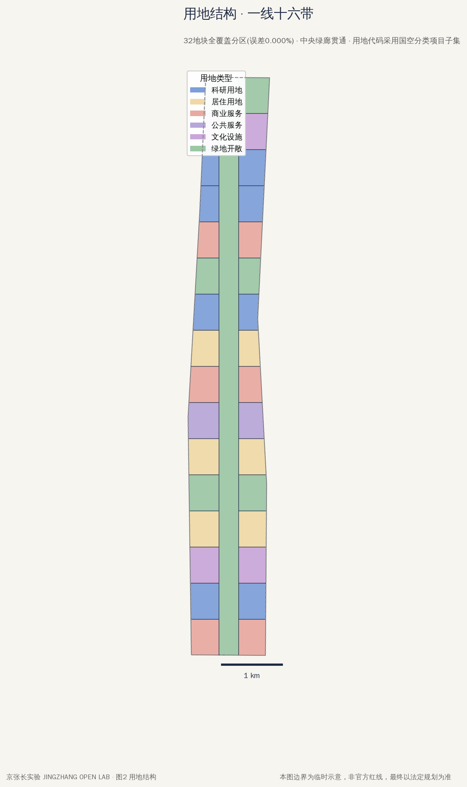
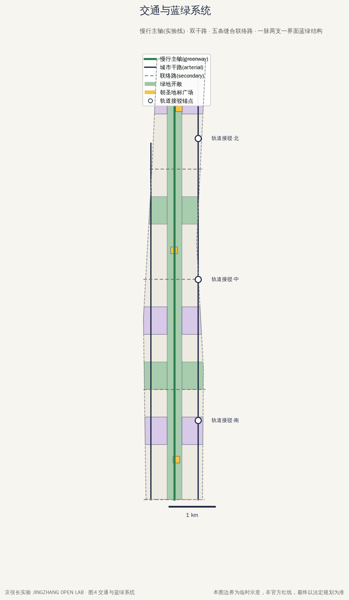
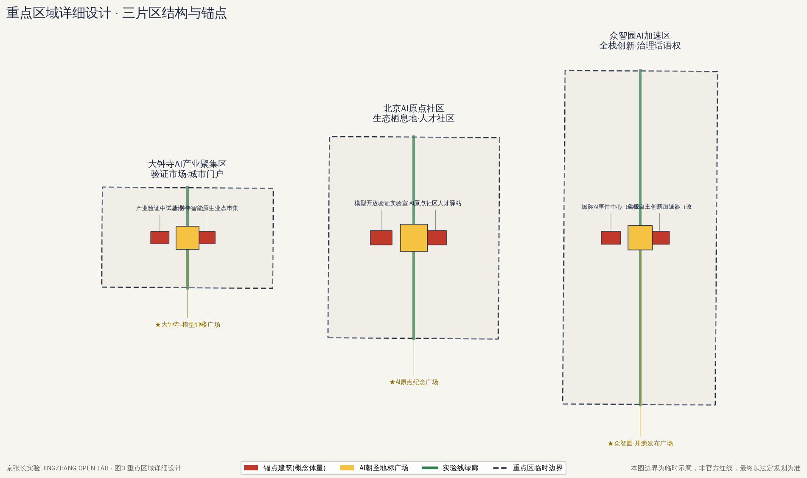
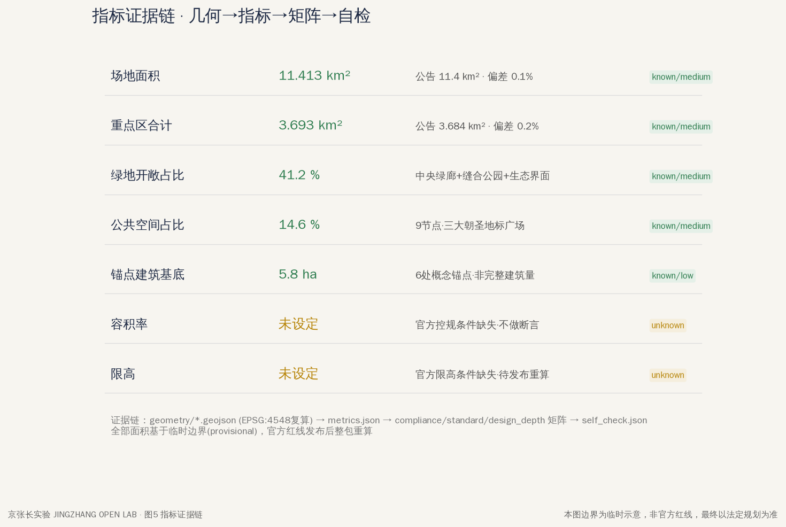

# JINGZHANG OPEN LAB — Turning the Centennial Jingzhang AI Innovation Belt into a Continuously Operating City-Scale AI Experiment Line

## Design Basis and Source Inventory

This formal proposal takes the "Prequalification Announcement for the International Solicitation of Urban Design Proposals for the Centennial Jingzhang AI Innovation Belt" as its primary basis [source:OFFICIAL-ANNOUNCEMENT], the "Excerpt of the Task Book for the Global Agent Open-Source Solicitation of Urban Design for the Centennial Jingzhang AI Innovation Belt" as the agent-task basis [source:AGENT-TASKBOOK], and the provisional boundaries, enumerations, metric limits, and source inventory registered in `brief/site-package/` as the machine-readable basis [source:SITE-PACKAGE]. Complete sources, metrics, standards, depth, and task coverage are stored in `sources.json`, `metrics.json`, `compliance_matrix.json`, `standard_matrix.json`, and `design_depth_matrix.json`; the main text does not duplicate the machine index.

Boundary of data use: formal-ready materials registered in `data/source_registry.json` are used for formal judgments; background-only and provisional-only materials are used solely for background understanding and provisional generation, and are never elevated into official boundaries, statutory regulatory-plan conditions, or formal scoring bases [source:SOURCE-REGISTRY]. Official precise red lines, floor area ratio, height limits, green-space ratio, and other regulatory-plan conditions are missing from the site package; this proposal treats them all as "to be confirmed" and does not disguise them as approved indicators. Once official data are released, all layers under `geometry/` and `metrics.json` must be recomputed as a complete package.

## Three-Tier Scope Framework

This proposal organizes its work within three tiers of scope. All three tiers use the provisional boundaries registered by the maintainer (`geometry_role="provisional_constraint"`, `boundary_precision="provisional_rough"`), which do not serve as official red lines or precise area bases [data:geometry/site_boundary.geojson#PROV-SITE-001].

**Coordinated research scope (approx. 43.6 km²)**: bounded by the North Fifth Ring Road to the north, the Jingzang Expressway to the east, Xizhimenwai Street to the south, and Wanquanhe Road to the west [source:OFFICIAL-ANNOUNCEMENT]. No spatial design is done at this tier; it answers a single question: how the Jingzhang AI Innovation Belt forms a "three-zones, two-wings" collaborative loop with the Zhongguancun Sci-Tech Services Wing and the Xiaoyue River Scenario Enablement Wing, and how it establishes corridor-level links with Haidian's district-wide AI industry spaces, the university-and-institute belt, and Zhangjiakou's compute-and-green-power base.

**Overall design scope (approx. 11.4 km²)**: the urban area within 1–2 km around the Jingzhang Relic Park [source:OFFICIAL-ANNOUNCEMENT]. This proposal organizes it as "one spine, sixteen segments": the central 24% of the width is the Jingzhang Relic Park green corridor (the AI experiment line proper), with the east and west sides divided by functional bands into 16 east–west parcel segments that, from south to north, host four dominant functions — industrial validation, everyday-life scenarios, innovation ecosystem, and self-reliant R&D [data:geometry/land_use.geojson#LU-SPINE-A]. The submitted provisional boundary converts to an area of 11.413 km² [metric:site_area_sqm], consistent with the announced 11.4 km²; the parcel zoning covers the boundary with 0.000% error — no gaps, no overlaps.

**Key-area scope (approx. 368.4 ha)**: three areas — the Zhongzhiyuan AI Acceleration Area (192.1 ha), the Beijing AI Origin Community (104.3 ha), and the Dazhongsi AI Industry Cluster (72.0 ha) [data:geometry/key_areas.geojson#PROV-KEY-001]. The three submitted provisional polygons total 369.3 ha [metric:key_areas_total_sqm], deviating about 0.2% from the announced value — an inherent precision limit of provisional boundaries; all detailed design conclusions remain directional recommendations until the official red lines are released.

Items to be recomputed once the official polygons replace the provisional ones: `site_boundary`, `key_areas`, all parcel areas in `land_use`, `green_ratio`, `public_space_ratio`, plus the renewal project list and phasing scale that depend on those areas.

## Industry and Future-City Research at the Coordinated Research Scope

**Overall concept: JINGZHANG OPEN LAB.** In 1909, the Jingzhang Railway was the first trunk railway completed by Chinese people through self-reliant engineering capability; in 2026, the Centennial Jingzhang AI Innovation Belt should become the first long-horizon project in which Chinese AI achieves self-reliant innovation with "the city as laboratory." The proposal defines the 9-km relic park and the urban districts on both sides as a **continuously operating city-scale AI experiment line**: urban space is the test bench, AI scenarios are the experiments, citizens and Agents are co-experimenters, and public returns are the experiments' mandatory output [source:AGENT-TASKBOOK].

Spatial translation of the three headline positionings: the Centennial Jingzhang Culture Belt = the experiment line's narrative axis (Zhan Tianyou's spirit of self-reliant engineering as the century-old prequel to AI self-reliant innovation); the Urban AI Life Experience Belt = the experiment line's scenario layer (each of the 16 parcel segments hosts at least one AI life scenario that is experienceable, evaluable, and exitable); the AI Integrated Innovation Belt = the experiment line's production layer (the three key areas form a complete "R&D–ecosystem–validation" innovation loop) [source:OFFICIAL-ANNOUNCEMENT].

Placement of the five major functions: the full-stack self-reliant AI innovation system lands in Zhongzhiyuan (the northern LU-12x–13x research parcel cluster); the world-class AI innovation ecosystem lands in the AI Origin Community (middle segment); the "AI + scenario enablement" new paradigm is distributed along the full experiment line; the intelligent, vibrant AI city is carried by the 16 scenario bands; and global voice in AI governance is carried by the public "Experiment Protocol" library and the International AI Events Center (cultural parcel LU-14A) [data:geometry/land_use.geojson#LU-14A].

Three-zones, two-wings collaborative loop: the three key areas are threaded by the central green-corridor slow-mobility spine into a north–south innovation assembly line [data:geometry/roads.geojson#RD-AXIS]; the Zhongguancun Sci-Tech Services Wing connects via the eastern arterial along the Xueyuan Road alignment, supplying IP, capital, and global allocation; the Xiaoyue River Scenario Enablement Wing connects via the southwestern waterfront green band, supplying life scenarios and community test beds [data:geometry/green_space.geojson#G-BAND-04A]. The loop's operating medium is the "Experiment Protocol": any AI scenario entering the belt for deployment from either wing must be bound to verifiable metrics, an exit plan, and public-return clauses; validated solutions are then exported through the two wings to the city, the nation, and the world.

At the coordinated tier, the Beijing–Zhangjiakou collaboration is expressed as "compute in the north, models in the south": Zhangjiakou's green-power compute base carries training loads, while the belt carries model R&D, validation, and scenario deployment, with the Jingzhang high-speed rail's one-hour commuting circle supporting two-city talent flows. This is a regional-collaboration recommendation; specific infrastructure arrangements await deepening by professional teams and the two municipal governments.

## Urban Renewal and Regulatory-Plan-Depth Urban Design at the Overall Design Scope

**Spatial structure: one spine, three segments, sixteen bands, two arterials, three plazas.** One spine = the central Jingzhang Relic Park green corridor (approx. 330 m wide, the backbone of the blue-green open system occupying 41.2% of the total area [metric:green_ratio]); three segments = the southern industrial validation segment (LU-00x–05x), the middle life-and-ecosystem segment (LU-06x–11x), and the northern self-reliant innovation segment (LU-12x–15x); sixteen bands = east–west functional parcel bands corresponding to the existing east–west streets of the urban fabric; two arterials = the north–south arterial roads along the eastern Xueyuan Road–Xitucheng Road alignment and the western Dazhongsi East Road–Heqing Road alignment [data:geometry/roads.geojson#RD-E]; three plazas = the three AI pilgrimage landmark nodes [data:geometry/public_space.geojson#PLAZA-N].

**Overall urban renewal framework**: as a highly built-up area, the proposal adopts a "stock-first, protocol-triggered renewal" strategy — the Experiment Protocol is the trigger for renewal, and only renewal units bound to a clear AI scenario, validation metrics, and public returns enter the implementation list. Renewal objects fall into four treatments: retain (the relic park itself, the main bodies of existing residential areas, universities and institutes), retrofit (existing commercial facilities such as the Dazhongsi market → carriers of AI-native businesses [data:geometry/buildings.geojson#BLD-S1]), renew (underperforming industrial land → research and incubation facilities), and build new (a small number of anchor facilities, such as the International AI Events Center). Specific demolish/retrofit/retain classifications must be based on official property-rights and building-condition data; this proposal only provides the classification logic and indicative anchors, and draws no parcel-level demolition conclusions.

**Functional mix** (converted from provisional zoning): research land approx. 24%, residential approx. 19%, commercial services approx. 12%, public services and culture approx. 14%, green and open space approx. 31% (excluding roads). These are conceptual proportions, to be adjusted per official control conditions during regulatory-plan deepening.

**Traffic organization**: the slow-mobility spine (greenway class) carries the experiment line's main public-activity flows; the two north–south arterials carry motor traffic and transit corridors; five east–west connector roads (secondary class) stitch together the east and west districts historically severed by the railway relics [data:geometry/roads.geojson#RD-X08]. For rail transit, the existing Line 13 and its stations provide three interchange anchors for the experiment line; AI service nodes and shared-mobility facilities are prioritized within 300 m of stations; specific rail densification and station retrofit recommendations await special studies by the rail authorities.

**Municipal utilities and public services**: a new type of "validation-as-a-service" municipal facility is deployed along the experiment line — segment-by-segment edge-compute cabinets, sensing benchmark stations, and trusted data-collection environments as public infrastructure for AI scenario validation; conventional municipal carrying-capacity calculations require official pipe-network data and are listed as a data gap. Public service facilities are configured at a minimum of one community-level AI experience service station per each of the 16 segments, layered onto rather than replacing the existing community service system.

**Jingzhang Relic Park vitality band and urban character**: the green corridor maintains the continuity of the relic narrative, juxtaposing train-themed nodes, old-track remnants, and AI scenario installations to form a character theme of "century-old engineering memory × contemporary intelligent experimentation." Built character is controlled by segment: the southern urban frontage continues the scale of the Dazhongsi district, the middle segment expresses community-scale mixed vitality, and the northern segment allows larger-volume research facilities with setbacks from the green corridor; specific heights and frontage controls await confirmation of official character and height-limit conditions [metric:building_height_max_m].

## Detailed Design of the Key Areas

All three key areas are organized as "positioning + spatial structure + building renewal + traffic and slow mobility + public space + AI scenarios + implementation risks," reaching directional design at the depth of a comprehensive planning implementation scheme; all three boundaries are provisional, and parcel-level conclusions await confirmation of official red lines [data:geometry/key_areas.geojson#PROV-KEY-001].

### Zhongzhiyuan AI Acceleration Area (approx. 192.1 ha, northern segment)

Positioning: the production end of the full-stack self-reliant innovation system and the carrier of global voice in AI governance [source:AGENT-TASKBOOK]. Spatial structure: organized as a triad of "accelerator matrix + events center + ecological interface" — the LU-12x–13x research parcel cluster hosts the full-stack innovation accelerator (vertical incubation across the four layers of chips–frameworks–models–applications, anchor building BLD-N1 [data:geometry/buildings.geojson#BLD-N1]); cultural parcel LU-14A hosts the International AI Events Center (BLD-N2) for global releases, standards symposia, and governance dialogue; LU-15x along the North Fifth Ring is the ecological-protection and sports-leisure interface. Building renewal: the existing industrial parks are primarily upgraded through retrofit, with new volumes concentrated in the accelerator cluster. Traffic: the experiment line's north gateway sits at the north end, connecting to the North Fifth Ring and the Shangqing Bridge traffic node. Public space: the Open-Source Release Plaza (PLAZA-N) serves as the ceremonial ground for annual model releases and Agent solicitations. AI scenarios: compute-scheduling visualization, an autonomous-driving shuttle test segment, and robotic campus services. Implementation risks: transitional relocation of existing park tenants for research facilities needs a dedicated policy; the precise relationship between the northern segment within the provisional boundary and the Fifth Ring green belt awaits calibration against official red lines.

### Beijing AI Origin Community (approx. 104.3 ha, middle segment)

Positioning: the community-scale expression of a world-class AI innovation ecosystem — not a campus, but an "ecological habitat" [source:AGENT-TASKBOOK]. Spatial structure: centered on the AI Origin Memorial Plaza (PLAZA-M), with the LU-06A public-service parcel ringed by the Open Model Validation Laboratory (BLD-M2), the Talent Hostel (BLD-M1), and the Community AI Experience Hall; the LU-08x residential band provides mixed housing for international talent and existing residents [data:geometry/land_use.geojson#LU-08A]. Building renewal: primarily organic renewal of existing residential stock, with community-level innovation facilities inserted infill-style — no wholesale demolition and rebuild. Traffic and slow mobility: at the green corridor's widest point in this segment, an "Origin Loop" slow-mobility circuit links the plaza, the laboratory, and the waterfront. Public space: the memorial plaza takes "Chinese AI set out from here" as its theme (statements involving specific institutional narratives require authorization from the relevant organizations before use). AI scenarios: community co-governance Agents, elderly-and-child care assistance, and multilingual talent services. Implementation risks: gentrification pressure from residential mixing must be constrained by public-return clauses (talent-housing ratios; community facilities prioritizing existing residents).

### Dazhongsi AI Industry Cluster (approx. 72.0 ha, southern segment)

Positioning: the validation market for AI-native new businesses and the belt's urban gateway [source:AGENT-TASKBOOK]. Spatial structure: centered on the Model Bell Tower Plaza (PLAZA-S), with the existing Dazhongsi commercial facilities retrofitted into an AI-native business market (BLD-S1: Agent Market, Model Validation Workshop, Dataset Bazaar), and the LU-01A research parcel hosting an industrial pilot-testing base (BLD-S2) [data:geometry/buildings.geojson#BLD-S2]. Building renewal: primarily functional conversion of existing large commercial buildings, retaining the main structures and retrofitting them into "storefront-plus-workshop" validation businesses. Traffic: the south end is the experiment line's urban gateway, connecting to the Xizhimen transport hub, with the belt's main entrance frontage. Public space: the Bell Tower Plaza borrows the "bell" imagery of the Dazhongsi Ancient Bell Museum to establish an urban ritual of "ringing the bell for major open-source releases" (the mode of cooperation with the museum is to be negotiated; this is a conceptual suggestion). AI scenarios: retail-automation validation, payment and identity experiences, and cultural-tourism guide Agents. Implementation risks: owner coordination for commercial conversion takes long cycles — a Phase-1 pioneer policy toolkit is recommended; cultural linkage with the Ancient Bell Museum requires heritage-authority participation.

> This file is the draft of Chapters 2 and 3 of the overall JINGZHANG OPEN LAB proposal. All spatial statements are **conceptual suggestions and reference schemes**, constituting neither statutory planning, approval conclusions, nor government commitments; they involve no conclusions on floor area ratio, building height, or demolish/retrofit/retain. Parcel codes are cited from the proposal's geometry layers (provisional boundaries, not used for formal area scoring).

---

## AI Innovation Ecosystem, Talent Profiles and AI+ Scenarios

### Full-Stack Self-Reliant AI Innovation System and World-Class AI Ecosystem

### 1.1 Overall Approach: Turning an "Ecosystem" into "Ecological Niches"

A world-class AI innovation ecosystem is not a stack of campus signage but a set of interlocking **ecological niches**: each niche occupies a defined space, carries a defined function, is bound to a defined operating mechanism, and delivers verifiable public returns to the entire 9-km experiment line through the "Experiment Protocol" [source:AGENT-TASKBOOK]. Benchmarking global precedents — Silicon Valley's Stanford Research Park with its "university–industry ground-rent feedback loop," Shenzhen Nanshan's vertical "innovation upstairs, entrepreneurship downstairs" ecosystem, Singapore one-north's thematic zoning, Paris's Station F super-incubator, Tel Aviv's military-to-civilian technology-transfer community, and London King's Cross's open-data district — the common denominator is: **clear niche boundaries, explicit element-flow mechanisms, and public space serving as the lowest-transaction-cost collision interface**. This chapter translates these precedents into a seven-niche system spanning the northern Zhongzhiyuan area (approx. 192.1 ha, full-stack self-reliant acceleration), the middle AI Origin Community (approx. 104.3 ha, innovation ecosystem and talent), and the Zhongguancun Sci-Tech Services Wing (all conceptual suggestions; case-level deepening awaits professional teams).

### 1.2 The Seven Niches: Parcels and Mechanisms

**Niche 1: Full-Stack Self-Reliant Innovation Accelerator (northern core).** Sited on the northern research parcel [data:geometry/land_use.geojson#LU-12A] (approx. 25.4 ha) and LU-12B, organized as vertical blocks along the five full-stack layers of "chips — frameworks — models — agents — applications": upstream and downstream firms are physically adjacent within the same block, shortening the "bottleneck feedback loop." Mechanically it adopts joint-research contracts of "chain-leader poses the problem, cluster solves it": chain-leader enterprises publish technical bottleneck lists, resident teams apply for space and compute quotas per bottleneck, and outcomes are open-sourced or licensed per agreement [metric:年度卡点清单发布≥2批、卡点关闭率年度复盘公开]. The industrial-collaboration model is a conceptual suggestion; no specific company names are fabricated, and investment-attraction arrangements await determination by the relevant parties through due procedure.

**Niche 2: Urban Compute and Green Energy Center.** Sited on the northern compute-and-validation facility parcel [data:geometry/land_use.geojson#LU-13A] and LU-13B (facility units within a combined approx. 44.9 ha). The core mechanism is "compute vouchers + tiered pricing": compute vouchers are issued to in-belt startup teams, training jobs are load-shifted to off-peak overnight power windows, and waste-heat recovery is conceptually connected to district heating in adjacent blocks (engineering feasibility awaits professional study) [metric:初创团队算力券覆盖率、算力平均排队时长]. The compute center does not pursue a scale narrative; it operates as **public infrastructure of the experiment line**, with (de-identified) usage data folded into the annual ecosystem white paper.

**Niche 3: Model Validation and Evaluation Laboratory.** Distributed across the northern and middle segments: hardware-in-the-loop and robot field testing rely on LU-13B, while model evaluation and red-team laboratories sit on the middle-segment research parcels [data:geometry/land_use.geojson#LU-09A] and LU-09B. The mechanism is "evaluation as admission": any AI scenario applying for deployment on the experiment line (see Chapter 2) must first pass this laboratory's safety, robustness, and bias testing and receive a publicly numbered validation report before it may sign an Experiment Protocol [metric:验证报告平均出具周期≤30天（目标值，概念建议）]. The laboratory is operated by a third party with no equity ties to the parties under test, guaranteeing independent evaluation.

**Niche 4: Open-Source Community House.** Sited on the middle-segment university-collaboration commercial parcels [data:geometry/land_use.geojson#LU-11A] and LU-11B, adjacent to the Xueyuan Road university cluster, with ground floors opening onto the green corridor [data:geometry/land_use.geojson#LU-SPINE-A]. Mechanisms include: year-round open-source workshops and code-sprint space, a "contributions-for-space" system (certified open-source contributions offset desk fees), and a quarterly open-source release festival [metric:年度活跃贡献者数、带内孵化开源项目数]. The Community House also serves as the public archive of all scenario code and data-interface documentation on the experiment line, making the "city as code repository" reviewable by developers worldwide.

**Niche 5: Urban Data Trust.** Sited on the middle-segment model-and-data experiment zone [data:geometry/land_use.geojson#LU-09B], co-located with the evaluation laboratory. Urban operating data generated by all scenarios on the experiment line belongs to no single enterprise; it enters a fiduciary **data trust**: the trustee approves data uses under a public charter, all person-related data is de-identified and aggregated, and resident representatives hold supervisory seats in the trust [source:AGENT-TASKBOOK] [metric:数据用途审批公示率100%（章程目标）]. The data trust is a conceptual suggestion; its legal structure awaits deepening by professional teams under current law.

**Niche 6: Incubation-Acceleration and Patient-Capital Corridor.** Sited on the middle-segment talent-service commercial parcels [data:geometry/land_use.geojson#LU-07A] and LU-07B, connecting to the AI Origin Community core [data:geometry/land_use.geojson#LU-06A]. Mechanically it organizes a "three-stage rocket": pre-incubation (university research topic → prototype; 6-month rent-free as a conceptual suggestion) → acceleration (prototype → real-scenario validation on the experiment line, directly linked to the scenario cards in Chapter 2) → graduation (relocation to the northern segment or the Zhongguancun Sci-Tech Services Wing). On the funding side it advocates a milestone-based matchmaking mechanism for patient capital; any financial support is a matchmaking service, not a commitment [metric:年度进入实验线验证的孵化项目数].

**Niche 7: International AI Events and Talent Hub.** Sited on the northern International AI Events Center parcels [data:geometry/land_use.geojson#LU-14A] and LU-14B, linked with the international talent community [data:geometry/land_use.geojson#LU-08A] and residential support on LU-08B. The mechanism is "recruit through competition, gather through convening": the annual Global Agent Challenge uses real experiment-line scenarios as its problems, winning teams gain direct access to Niche 6's acceleration channel and residency in the talent community; the international scholars-in-residence program provides a standard package of "one desk + one scenario + one compute voucher" [metric:年度国际团队驻留数、赛题转化为常驻场景数].

### 1.3 The Zhongguancun Sci-Tech Services Wing and the Eight-Element Mechanism

The seven niches are laterally bonded by the **Zhongguancun Sci-Tech Services Wing**: intellectual-property, legal-compliance, testing-certification, and cross-border service institutions are embedded along the green corridor as "service posts" in each segment, forming a division of labor of "niches on the belt, services on the wing." The conceptual flow rules of the eight elements are: **land/space** — supplied by niche function rather than by single ownership, encouraging flexible short leases and shared pilot-testing space; **industry** — pulled bidirectionally by the bottleneck list and the scenario list; **capital** — milestone-based and matchmaking-based, with no fiscal-commitment statements; **talent** — contributions-for-space and recruit-through-competition; **compute** — voucher-based allocation and off-peak scheduling; **data** — trust-based governance; **scenarios** — all entering and exiting through the "Experiment Protocol" of Chapter 2 [source:AGENT-TASKBOOK]. Wherever these mechanisms touch ownership, taxation, or legal arrangements, they are conceptual suggestions awaiting professional deepening.

---

## The "AI + Scenario Enablement" New Paradigm and the Intelligent, Vibrant AI City

### 2.1 The New Paradigm: From "Deploying Scenarios" to "Experiment Protocols"

Traditional smart cities treat AI scenarios as one-off procurement projects — failures cannot exit, successes cannot be explained. The new paradigm proposed by JINGZHANG OPEN LAB is: **any AI scenario that runs on the 9-km experiment line must sign an "Experiment Protocol"** — binding (1) publicly verifiable quantitative metrics, (2) an explicit exit plan, and (3) public returns to citizens (free services, open data, or public-space improvements) [source:AGENT-TASKBOOK]. A scenario is not a permanent facility but an experiment with start and end dates; at expiry, metrics determine renewal, improvement, or exit, and the exit plan guarantees that space and data can be fully restored. All scenarios carry an "under testing" label, **none constitutes approved operation**, and any judgment concerning individuals retains a human-review channel.

### 2.2 Ten AI Scenario Cards

The following 10 scenario cards cover the southern Dazhongsi segment (industrial validation and AI-native businesses), the middle AI Origin Community, the northern Zhongzhiyuan, and the central green corridor; all are conceptual suggestions [data:geometry/land_use.geojson#LU-SPINE-A].

| # | Scenario | Location / Parcel | Users Served | AI Capability | Validation Metrics | Exit Plan |
|---|---------|----------|---------|--------|---------|---------|
| 1 | Green-corridor autonomous shuttle micro-bus | Dedicated lane along the full central green corridor, LU-SPINE-A | Commuters, elderly visitors, tourists | L4 low-speed autonomous driving, dynamic dispatching | On-time rate ≥95%, passenger satisfaction, zero at-fault accidents (trial-period targets) | Restore human-driven shuttle; dedicated lane reverts to slow mobility; vehicles removed within ≤30 days |
| 2 | Relic-park AI narrator | Exhibition gallery on southern cultural parcels LU-02A/LU-02B and relic points along the line | Tourists, students, railway-heritage enthusiasts | Multimodal interpretive agent, AR storytelling | Daily usage count, factual-correction response ≤48 h | Switch off the digital layer; retain physical exhibits and human guides |
| 3 | AI-native market "unstaffed night lane" | Southern commercial parcels LU-00A/LU-00B | Nearby residents, nighttime consumers, micro-merchants | Vision-based checkout, inventory agent, energy optimization | Checkout error rate ≤0.5%, merchant retention, 100% human review of disputes | Restore staffed counters; remove recognition devices and delete local data |
| 4 | Community health early-screening post | Southern residential parcel LU-03A, renewal unit LU-05A | Elderly residents, chronic-disease groups | Gait/vital-sign screening prompts (non-diagnostic) | High-risk-prompt follow-up conversion, false-positive rate, voluntary usage rate | Convert to a regular community health service point; screening data destroyed or transferred after personal confirmation |
| 5 | Xiaoyue River ecological sensing and waterside alert | Scenario-wing green space LU-04A/LU-04B | Waterfront users, river managers | Water-quality/level sensor network + anomaly-alert model | Alert lead time, false-alarm rate, zero water-entry accidents in flood season (collaborative target) | Retain conventional hydrological monitoring; removing the AI alert layer does not affect river management |
| 6 | AI Origin Community co-governance assembly hall | Middle public-service core LU-06A/LU-06B | Community residents, tenants, community workers | Agenda-summarizing agent, multilingual translation, resolution tracking | Issue-response closure rate, resident participation count, 100% human confirmation of AI summaries | Return to traditional meeting minutes; full transfer of historical resolution archives to the community |
| 7 | Xueyuan Road stitching park smart lighting and safety companion | Nighttime walking loop in green spaces LU-10A/LU-10B | Night runners, late-returning students, female pedestrians | Flow-adaptive lighting, one-touch help dispatch | Increase in nighttime foot traffic, help-response time, zero-tolerance handling of privacy complaints | Switch to timed lighting mode; help calls revert to the regular security hotline |
| 8 | University-collaboration "real problems, real work" training block | Middle commercial parcels LU-11A/LU-11B | University students, young developers, street merchants | Merchant-operations agent sandbox, A/B testing platform | Student projects launched, merchant adoption rate, 100% research-ethics review pass rate | Take the sandbox offline; merchant systems roll back to the original version; student data archived |
| 9 | Zhongzhiyuan shared robot testing gallery | Connector gallery between northern research parcel LU-12A and compute facility LU-13A | Robotics companies, research teams | Multi-robot coordination, remote teleoperation takeover | Thousand-hour mileage without human takeover, public disclosure rate of fault-reproduction reports | Gallery reverts to an ordinary logistics/pedestrian connector; all robots withdrawn |
| 10 | International AI Events Center multilingual volunteer agent | Northern cultural parcels LU-14A/LU-14B | International attendees, volunteers, public audiences | Real-time translation, agenda navigation, accessibility services | Translation complaint rate, accessibility coverage, volunteer workload-relief hours | Auto-deactivated outside event periods; event data deleted per protocol timeline |

All metrics above are trial-period target values (conceptual suggestions); specific thresholds are agreed case by case in the Experiment Protocol by the evaluation laboratory (Niche 3 of Chapter 1) together with the operator [metric:全部场景验证报告公开编号率100%].

### 2.3 Three Industrial Test-and-Validation Scenarios (Deepened Focus)

Scenario cards 1, 3, and 9 constitute the **industrial test-and-validation anchors** of the southern, middle, and northern segments [source:AGENT-TASKBOOK]; their validation mechanisms are deepened here:

**Validation Scenario A: Green-corridor autonomous micro-bus (scenario card 1).** The 9-km green corridor [data:geometry/land_use.geojson#LU-SPINE-A] is a rare domestic testing environment that is "long-linear, low-speed, with dense mixed pedestrian flows." Validation proceeds in three phases: closed-segment nighttime empty runs → limited-hours cargo runs → daytime speed-limited passenger runs (each phase advances only after a phase report from the evaluation laboratory). The industrial value lies in opening an **edge-case dataset** to the whole industry (published after de-identification via the data trust), turning one greenway into a public question bank of long-tail autonomous-driving scenarios [metric:年度公开边缘案例数]. Safety operators and remote takeover are retained throughout; testing does not equal an operating license.

**Validation Scenario B: AI-native retail night lane (scenario card 3).** A lane of about 200 m is carved out of the Dazhongsi commercial parcel [data:geometry/land_use.geojson#LU-00A] as retail AI's "real cash register": vision checkout, dynamic pricing, and restocking agents undergo a continuous 90-day assessment amid real customer flows. Validation prioritizes **commercial sustainability** over technical showmanship — per-unit-area labor efficiency, shrinkage rate, and merchants' net-income change all enter public reports; any checkout dispute is resolved on the spot by a staffed review desk, precluding the pseudo-intelligence of "technically correct, experientially awful" [metric:争议人工复核平均处理≤5分钟（目标值）].

**Validation Scenario C: Shared robot testing gallery (scenario card 9).** In the northern segment, an all-weather robot testing gallery is set between the compute facility [data:geometry/land_use.geojson#LU-13A] and the LU-12A accelerator: delivery, inspection, and cleaning robots mix in the same physical space, validating multi-agent coordination and dispatch protocols. The mechanism innovation is the "shared test slot" — small and medium robotics teams book by time slot, and test data flows back to the data trust, sparing every firm from duplicating its own facility [metric:测试位时段利用率、参测团队中初创占比]. The gallery is physically separated from public-activity space, with an observation face opening onto the green corridor — a "visible experiment."

### 2.4 Five User Personas

| Persona | Typical Traits | Relationship to the Experiment Line | Core Needs | Corresponding Scenarios |
|------|---------|--------------|---------|---------|
| ① Silver-haired original resident (68, LU-03A community) | Thirty years living along the railway; cautious about new technology | Service recipient and overseer of scenarios; candidate for the data trust's resident seat | Hassle-free health services, no privacy capture, always able to reach a "real person" | Scenario cards 4, 6, 7 |
| ② University geek (22, studying on Xueyuan Road) | Classes by day, code by night; hungry for real data and real users | Open-source community contributor; mainstay of the training block | Low-barrier compute, real-problem scenarios, visible recognition of contributions | Scenario card 8; Niches 4/2 |
| ③ Hard-tech founder (34, robotics) | Team of 12; most lacking test venues and first orders | Incubation-corridor tenant; shared-testing-gallery booker | Affordable pilot-testing space, credible third-party validation reports | Scenario card 9; Niches 3/6 |
| ④ Dual-income young family (35 + 33, LU-08A talent community) | Commutes across the southern and northern segments; child in primary school | Micro-bus commuters; high-frequency weekend green-corridor users | Reliable shuttles, nighttime safety, a child who can learn something on the "experiment line" | Scenario cards 1, 7, 2 |
| ⑤ International visiting researcher (41, residence-program scholar) | Six months in Beijing; language and daily services are pain points | Events-center participant; evaluation-laboratory collaborator | Multilingual services, reusable open data, publishable take-home results | Scenario card 10; Niches 5/7 |

Together the five personas define the experiment line's "lowest common denominator": **any scenario that cannot simultaneously be explained clearly to Persona ① and open its interfaces to Persona ② is not qualified for deployment** — written into the Experiment Protocol's admission clause (conceptual suggestion).

### 2.5 Scenario–Space–Operations Mapping and the Public Experience Path

Spatially, scenarios follow a "validate south, co-create middle, breakthrough north" distribution: the southern segment (LU-00x–05x) hosts validation scenarios close to consumption and community life; the middle segment (LU-06x–11x) hosts co-governance, education, and talent-service scenarios; the northern segment (LU-12x–15x) hosts high-intensity industrial testing; and the LU-SPINE-A green corridor, as the public-experience spine, threads together the "observable interfaces" of all scenarios [data:geometry/land_use.geojson#LU-SPINE-A]. Operationally, each scenario has one Experiment Protocol, one public metric dashboard, and one scenario steward; the Xiaoyue River scenario wing (LU-04A/B) and the green corridor jointly form the **public experience path**: guided by signage, citizens can watch each in-test scenario's live metric screen and scan a code to read its validation report and exit plan — turning "the served" into the experiment's witnesses and jury [metric:公共体验路径年度访客数、指标看板扫码查阅量].

### 2.6 Privacy and Human-Review Boundaries

All scenarios observe a uniform baseline: no deployment of facial-recognition applications that track individuals' movements; all public-space sensing data is "de-identified at the edge, aggregated to the cloud" and enters data-trust governance; any AI judgment affecting personal rights (health prompts, checkout disputes, help dispatch) must provide an immediate human-review channel with auditable review records [source:AGENT-TASKBOOK]. Scenarios that fail these boundaries — however advanced the technology or impressive the metrics — may not sign an Experiment Protocol. Immature technologies exist only in "under testing" status; no scenario in this chapter is represented as approved for operation; no exclusivity clauses attach to vendors or data sources.

---

*End of chapters. The sections above are the conceptual-suggestion text of the JINGZHANG OPEN LAB proposal; metric thresholds, legal structures, and engineering feasibility all await deepening by professional teams.*

## AI Public Space, AI-Native New Businesses, and Pilgrimage Landmarks

### Overall Approach: From a "Linear Relic Park" to a "Ring-able AI Public-Space System"

JINGZHANG OPEN LAB takes the approx. 9-km Jingzhang Railway Relic Park experiment line as its skeleton — the Zhongzhiyuan AI Acceleration Area at the north end, the AI Origin Community in the middle, and the Dazhongsi AI Industry Cluster at the south end — responding to the task book's requirements for "AI public space in the Jingzhang Relic Park," "conceptual strategies for east–west stitching and north–south continuity," and "no fewer than 3 AI pilgrimage landmarks" [source:AGENT-TASKBOOK]. The design principle: public space is not a passive display backdrop but a generator of AI innovation events — every plaza, gallery, and pocket green reserves a "programmable public interface" (screens, lights, sound, sensing, and open data interfaces), grounding the belt's "Urban AI Life Experience Belt" positioning in touchable everyday space. All spatial suggestions in this chapter are concept-level open co-creation proposals, involving no demolish/retrofit/retain, bridge-and-tunnel engineering, or property-space conversion conclusions.

East–west stitching and north–south continuity follow an "acupuncture" strategy: north–south, the relic park's combined walking–cycling corridor serves as the "experiment spine" threading the three pilgrimage landmarks; east–west, small-scale "stitching nodes" are placed where the line meets city side streets and community entrances — AI pocket galleries, developer posts, model experience kiosks — so the urban fabric once severed by the railway is re-stitched through high-frequency small events rather than heavy engineering.

### The Three AI Pilgrimage Landmarks

### (1) PLAZA-N Zhongzhiyuan Open-Source Release Plaza [data:geometry/public_space.geojson#PLAZA-N]

**Spatial design**: an open plaza at the experiment line's north end facing the Zhongzhiyuan acceleration area, with "release" as its core scenario. At the center is a sunken circular Release Circle whose ring of steps doubles as everyday seating; at its heart is a liftable open-source release podium, backed by a "Commit Wall" — updatable e-ink modules scrolling the belt's latest open-source commits, model versions, and contributor bylines (public, rights-cleared information only). The paving extends the herringbone track-junction motif into a ground-level wayfinding pattern, isomorphic with the open-source branching imagery of the belt's logo.

**Ritual**: a "Version Landing Ceremony" is established — whenever a team in the area releases a major open-source model or dataset, a public release rite can be held here: the releaser walks across the herringbone-fork paving toward the podium, the Commit Wall lights up the new version number in sync, and the plaza's light bands flow through the three signal-lamp colors in sequence. The ceremony is short (under 15 minutes), replicable, and open to the public, avoiding over-staged, influencer-bait scenography.

**Operations**: jointly scheduled by the area operator and the open-source community; on weekdays it serves as an open-air pitch venue and developers' lunchtime gathering ground; on weekends it hosts open-source fairs and newcomers' "first commit workshops"; release slots are claimed through a public calendar, with priority for releases in self-reliant innovation and full-stack technology directions [source:AGENT-TASKBOOK].

### (2) PLAZA-M AI Origin Memorial Plaza [data:geometry/public_space.geojson#PLAZA-M]

**Spatial design**: located in the middle-segment AI Origin Community, themed "origin and coordinates." At the plaza's core is an "Origin Marker" embedded in the ground — a bronze-and-glass composite disc about 3 m in diameter, engraved with a publicly verifiable chronology of Chinese AI and Zhongguancun innovation history; coordinate score-lines radiate outward from the marker, each terminating in a "milestone stone" recording one publicly confirmed technical milestone. Along the plaza's edge stands the honors system's main carrier, the "Contributors' Colonnade": a semi-outdoor colonnade whose columns can be inscribed with the names of developers, teams, and open-source projects selected through a public process, forming a continuously accruing interface of honor.

**Ritual**: this is the belt's "pilgrimage origin" — visiting developers are encouraged to photograph themselves at the Origin Marker and take rubbings of the coordinate score-lines, seeding a low-cost, self-propagating pilgrimage practice; an annual "Origin Day" public commemoration unveils the year's additions to the roll. Monumentality is achieved through restrained materials (bronze, stone, glass) and negative space, not megastructure.

**Operations**: open daily as a community plaza; roll selection follows public rules with human juries, keeping commercial naming from eroding the honor system's public character; the colonnade reserves expansion columns so the honors can be written sustainably for decades.

### (3) PLAZA-S Dazhongsi Model Bell Tower Plaza [data:geometry/public_space.geojson#PLAZA-S]

**Spatial design**: located in the southern Dazhongsi district, leveraging the cultural field of the Ancient Bell Museum (no alteration of the protected heritage fabric; only a contemporary echo on the urban plaza outside its protection zone). The plaza features a contemporary "Model Bell Tower" — a lightweight steel tower suspending a set of programmable chime bells, its skin a semi-transparent metal mesh that at night displays a "model genealogy tree" in light. Beneath the tower is a circular listening ground, its paving engraved with an index of sound memories from generations of the Jingzhang line and Zhongguancun.

**Ritual**: an "Open-Source Bell-Ringing" institution is established — whenever a major open-source model release occurs globally or within the belt (determined by public criteria), the tower rings in commemoration: nine strikes for a belt project, three for a global milestone. The ancient bell symbolizes "time and public annunciation"; the AI bell continues this ancient function: the toll is the announcement, translating abstract technical progress into a public moment the whole city can feel.

**Operations**: a cooperative curatorial mechanism with the Ancient Bell Museum (content collaboration, not spatial occupation); bell-ringing rules, recognition criteria, and schedules are fully public; on ordinary days the tower's ground level serves as a small "Sound and Models" exhibition space, combined with Dazhongsi's AI-native consumption scenarios, hosting open-air lectures and chime performances in the evening.

### Spatial Carriers of AI-Native New Businesses

The Dazhongsi cluster and nodes along the line carry three types of "AI-native consumption and business" [source:AGENT-TASKBOOK]:

- **Agent Market**: using leasable modular canopy units along the line (3×3 m standard stalls — "plug-in" booths with power, network, and public-compute interfaces), developers demonstrate and "sell" agent services to the public in stall form — trip planners, tutoring agents, shop-operations agents, and more; the market opens on weekends, where the public can try, subscribe, and give face-to-face feedback to the authors, cultivating an AI-era, "Electronics Street"-style culture of in-person exchange.
- **Model Validation Workshop**: a mid-size industrial-shed space in the Dazhongsi district, divided into an intake zone, blind-test chambers, a review zone, and a public-notice wall; companies and individuals can book their models into a standardized validation pipeline, with results published together with methods. The space emphasizes "spectatable validation" — a visitors' gallery lets the public see how evaluation happens, turning trustworthy AI into a visible spatial experience; every validation retains a human-review step.
- **Dataset Bazaar**: a "rights-cleared data shop" set into the block's ground-floor retail: only openly licensed, source-traceable datasets are traded; datasets are displayed as physical "dataset cards" (printed with source, license, samples, and a QR code), with a data-cleaning bar offering on-site curation services. Data shifts from an invisible asset to a street-front commodity with a counter, a clerk, and a negotiable price.

### Honors Display System and Public-Space Component Library

The honors system is deployed at three levels: the Contributors' Colonnade at the Origin Plaza (highest level, annual additions), the Commit Wall at the Release Plaza (high-frequency, auto-updating), and "contributor banners" on light columns along the line (lightweight, quarterly rotation). The public-space component library defines eight standard parts — programmable light columns, e-ink information steles, plug-in market canopies, model experience kiosks, coordinate score-line pavers, tri-color signal light bands, the open-source release podium, and chime units — with unified interfaces and visual specifications, so nodes along the entire line can assemble them as needed, keeping the 9-km experiment line "everywhere different, yet everywhere of one source."

## A Fused Narrative of Centennial Jingzhang Culture, Zhongguancun Culture, and New AI Culture

### Narrative Motif: One Railway's Three Acts of Self-Reliance

The root of the Jingzhang cultural narrative is the Jingzhang Railway completed in 1909 under Zhan Tianyou — the first trunk railway surveyed, designed, and built by Chinese people on their own; the herringbone switchback at Qinglongqiao conquered the Guangou pass through engineering ingenuity and became a symbol of national engineering self-reliance. The second act of self-reliance happened in Zhongguancun: starting from "Electronics Street," Zhongguancun turned intellectuals' technical ideals into a torrent of market-driven innovation, forging a culture of daring first moves and tolerance of failure. The third act is happening now: the campaign for a full-stack self-reliant AI innovation system is the echo, in the age of intelligence, of the century-old spirit of "doing it without outside hands" [source:AGENT-TASKBOOK]. The Three Acts of Self-Reliance form one complete spiritual lineage: **a self-reliant railway — a self-reliant market — a self-reliant intelligence**. This is the unified cultural narrative behind the three positionings of "Centennial Jingzhang Culture Belt, Urban AI Life Experience Belt, AI Integrated Innovation Belt." The narrative rests strictly on public historical sources, fabricates no historical details, and never demotes culture to techno-decoration.

### Naming System and Logo Direction

**Primary name**: 京张长实验; **English name**: JINGZHANG OPEN LAB. The character 长 ("long/lasting/growing") carries three meanings: length in space — a 9-km linear experiment field; length in time — a century-long scroll from 1909 to the AI era; and growth — the proposal itself is a continuously iterating, never-finished open experiment. "OPEN LAB" states the methodology of open source and open co-creation outright.

**Sub-naming system**: the three pilgrimage landmarks are named along "release — origin — bell" (Zhongzhiyuan Open-Source Release Plaza, AI Origin Memorial Plaza, Dazhongsi Model Bell Tower Plaza); nodes along the line uniformly adopt the sequence "Jingzhang · Test Field No. X," echoing the railway's milestone tradition.

**Logo direction**: taking the Qinglongqiao herringbone track junction as prototype, abstracted into an open-source branch (git branch) figure — a main line that forks at a node and merges again, at once the railway's 人 ("person") character, the branch-and-merge of collaborative code, and a declaration that the human "人" remains present in human–machine collaboration; the auxiliary graphic adopts the railway's tri-color signal band (red–yellow–green) as a dynamic identity system, corresponding to the three state semantics of "guard — experiment — proceed." This direction is an original concept only, using no existing typefaces, trademarks, or corporate marks; the cultural wayfinding symbol system and the belt's overall logo system are managed in separate layers without confusion [source:AGENT-TASKBOOK].

### A Three-Layer Cultural Narrative Structure

1. **Base layer: Engineering Memory (1905–1949).** Materials: Jingzhang Railway relics and Zhan Tianyou's engineering archives (public collections and publications), telling the story of "self-reliant engineering." Spatial carriers: milestone stones along the line, coordinate score-lines, and the preservation and interpretation system of sightline corridors to the old station buildings.
2. **Middle layer: Innovation Street-Market (1980–2020).** Materials: Zhongguancun's Electronics Street and garage-startup culture, telling the story of "knowledge entering the market." Spatial carriers: the Agent Market (deliberately rewriting the face-to-face trading gene of "the Street"), the Dataset Bazaar, and the Validation Workshop — so today's AI-native businesses are understood as the contemporary reincarnation of Electronics Street.
3. **Top layer: Intelligent Co-Creation (the present, ongoing).** The story of "human–machine collaboration and open-source co-creation," starring developers, agents, and citizens. Spatial carriers: the ritual systems of the three pilgrimage landmarks (Version Landing Ceremony, Origin Day, Open-Source Bell-Ringing), the contributors' honors system, and this global agent open-source solicitation itself — the solicitation is the first exhibit.

The three layers are not parallel display boards but a walkable timeline: visitors and developers set out from the bell at the south end (a dialogue of past and present), pass the Origin (the historical coordinate), and arrive at the northern Release Circle (the future in progress) — a 9-km walk is one complete pilgrimage through a century of spirit.

### Cultural Facilities and Event-Based Expression

**Cultural facilities** (all conceptual suggestions):
- **Herringbone Narrative Hall**: at a middle-segment stitching node, a small-volume permanent exhibition whose single 人-shaped exhibition route tells both the railway's herringbone and the herringbone of human–machine collaboration;
- **Sound Archive Kiosks**: three along the line, collecting openly licensed soundscapes — steam-locomotive whistles, electronics-market hawking, keyboards and server rooms, model-synthesized voices — composing a "century of sound strata";
- **Wayfinding and symbol system**: built on the base vocabulary of the tri-color signal lights and the herringbone fork arrow, establishing unified line-wide wayfinding (four template classes: direction, interpretation, honors, warning), supporting Chinese–English bilingual text and machine-readable QR codes so agents and humans can "read" this street together.

**Event-based expression**: culture is sustained not by slogans but by repeatable public events — the annual "Origin Day" commemoration and roll unveiling, the quarterly "Jingzhang Open-Source Fair," occasional "Open-Source Bell-Ringing" moments, and the annual short film for international audiences, *Listen, the Bell*: opening with the Dazhongsi bell, it tells the world how, beside a century-old railway, people ring a bell for open-source models. The keynote of this narrative's international communication is restraint and truthfulness: no claims of official endorsement, no inflated results — only the presentation of how a city keeps writing its century-old spirit of self-reliance into public space, which is itself the most persuasive urban temperament.

## Land Use, Building Scale, and the Demolish/Retrofit/Retain Scheme

Land-use organization follows three principles: "green corridor as axis, functions in bands, mixing in gradients." The classification, area, and use codes of all 32 parcels are given in `geometry/land_use.geojson`, using a project subset of the national territorial-spatial land-use classification codes [standard:MNR-LAND-USE-CLASSIFICATION-GUIDE]: research land (0802) concentrates in the northern segment and the southern pilot-testing zone; residential land (07) concentrates in the middle segment and the southern transition band; commercial-services land (05) is arranged along gateways and talent-service nodes; cultural land (0803) carries the events center and AI experience facilities; and park green space (1401) constitutes the central green corridor and the two stitching parks [data:geometry/land_use.geojson#LU-10A].

Building scale: this proposal submits conceptual massing for only 6 anchor buildings (combined building footprint approx. 5.8 ha [metric:building_footprint_area_sqm]) to illustrate each key area's renewal logic; it is not a complete building-volume schedule. With official regulatory-plan conditions missing, no numerical commitments are made on total building scale, floor area ratio, or height limits [metric:floor_area_ratio]; once conditions are clarified, deepening will follow the principle of "setbacks increasing toward the green corridor, moderate clustering at key-area cores."

Demolish/retrofit/retain logic: retain class (the relic park, existing residential main bodies, university facilities) → retrofit class (existing commercial and underperforming industrial facilities, functionally converted to AI-native businesses and research incubation) → new-build class (anchor facilities only). All classifications are conceptual suggestions; parcel-level demolish/retrofit/retain conclusions require property-rights surveys and official renewal policies, to be issued by professional teams — this proposal makes no demolition judgment on any specific parcel [source:AGENT-TASKBOOK].

## Transport, Rail Transit, Municipal Utilities, and Public Service Facilities

The road system is organized at three levels: two north–south arterial roads carry through traffic and transit corridors; five east–west connector roads (secondary) stitch the east and west districts at roughly 600-m spacing; and the central slow-mobility spine (greenway) is the experiment line proper [data:geometry/roads.geojson#RD-AXIS]. All road alignments are approximate representations based on public maps (confidence=low); red-line widths and cross-section designs await official road data.

Rail connections: stations along the existing Line 13 provide north, middle, and south interchange anchors for the experiment line; within 300 m of stations, AI service nodes, shared mobility, and last-mile delivery facilities are prioritized, forming seamless "rail-to-experiment-line" transfers. Rail densification and station retrofits are recommendations only, pending special studies by the rail authorities.

For municipal utilities, a new category of "validation infrastructure" is proposed: edge-compute cabinets, sensing benchmark stations, and trusted data-collection environments deployed segment by segment along the experiment line as the public foundation for AI scenario validation, managed uniformly by the Experiment Protocol Committee and open to all approved experiment projects. Conventional municipal carrying capacity (water, power, gas, heat, telecom) requires official pipe-network data, listed as a data gap; renewal projects must complete special assessments before implementation.

Public services: each of the 16 segments is configured with at least one community-level AI experience service station (retrofitted from existing community service facilities), and each of the three key areas with one district-level facility (events center, validation laboratory, business market). Basic public services such as education and healthcare rely on the existing system, supplemented during renewal as population changes; specific scales await confirmation of population and facility baseline data.

## Blue-Green Space, Public Space, and Urban Character

The blue-green system takes the central green corridor as its main artery (9.7 km continuous north–south), the two east–west stitching parks (Xueyuan Road Stitching Park LU-10A and the Xiaoyue River waterfront green band LU-04A) as branches, and the North Fifth Ring ecological interface as the northern terminus, forming a "one artery, two branches, one interface" structure; green and open space accounts for approx. 41.2% [metric:green_ratio]. The Xiaoyue River waterfront segment simultaneously serves as the access interface of the scenario-enablement wing, hosting waterfront AI experience scenarios.

The public-space network contains 9 nodes [metric:public_space_ratio]: the three pilgrimage landmark plazas (Open-Source Release, AI Origin Memorial, Model Bell Tower) plus 6 segment-level public spaces within the public-service band, threaded by the slow-mobility spine into a continuous public-space sequence [data:geometry/public_space.geojson#PLAZA-M].

Urban character is themed "century-old engineering memory × contemporary intelligent experimentation": the relic-park segment maintains the authenticity and narrative continuity of the railway remains [standard:MOHURD-URBAN-DESIGN-MEASURES]; the urban frontages on both sides are controlled by segment — the southern segment continues the urban scale of the Dazhongsi district, the middle segment offers community-scale mixed vitality, and the northern segment permits larger research volumes with setbacks and refined frontages toward the green corridor. Nighttime lighting features the experiment line's "signal-lamp language": the green–yellow–red three-color signal system reflects the real-time operating status of AI scenarios along the line, making the urban character itself a readable public information interface.

## Renewal Project List, Implementation Policies, and Phasing Plan

Phasing follows "start in the south, cultivate in the middle, unfold in the north" [data:geometry/phasing.geojson#PH-1]:

**Phase 1 (years 1–3, Dazhongsi + Xiaoyue River first)**: the Model Bell Tower Plaza and business-market retrofit, pilot-testing base phase 1, waterfront scenario-wing continuity, and the formation of the Experiment Protocol Committee with the protocol library going online. First-mover logic: retrofitting the southern commercial stock delivers quick results, and the gateway image has strong catalytic effect.

**Phase 2 (years 3–5, AI Origin Community + Xueyuan Road stitching)**: the Memorial Plaza and validation laboratory, the Talent Hostel, the Origin Loop slow-mobility system, the Xueyuan Road Stitching Park, and the full rollout of community AI service stations.

**Phase 3 (years 5–8, Zhongzhiyuan + ecological interface)**: the innovation accelerator matrix, the International AI Events Center, the North Fifth Ring ecological interface, full continuity of the experiment line, and the integrated release of "City Version v1.0."

Recommended implementation policies (all recommendations, pending confirmation by the organizer and government departments): Experiment Protocol admission (binding scenario deployment to renewal rights), a fast-track approval channel for stock retrofits, a public-return ledger system (each experiment project's public benefits openly auditable), and clauses on talent-housing and existing-resident protection ratios. The parcel-level detail of the renewal project list depends on property-rights and baseline data; this proposal provides the phasing framework and project types, with the detailed list to be compiled in the deepening stage.

## The Belt's Global AI Innovation Activity System and Long-Term Operations

> Positioning statement: all activities, mechanisms, funding, and collaboration arrangements in this chapter are **conceptual operating recommendations**, produced as open co-creation outputs, subject to confirmation by the organizer and relevant parties before deepening; they constitute no government commitment, investment commitment, or official endorsement. [source:AGENT-TASKBOOK]

### Overall Operating Philosophy: Run City Operations as an "Open-Source Project"

The core creative idea of JINGZHANG OPEN LAB's long-term operations is to organize the urban operation of the Jingzhang AI Innovation Belt itself as a continuously evolving **open-source project**: with a public "code repository" (the open Experiment Protocol library), rhythmic "version releases" (annual versions of the city experiment line), a transparent "issue and PR mechanism" (a routine co-creation channel for the public and global Agents), and an honest "error log" (the Museum of Failed Cases). This global Agent open solicitation is the mechanism's first instance — it proves that an urban-design task can be written as a task book, responded to in parallel by global agents and human contributors, and openly reviewed and iterated [source:AGENT-TASKBOOK]. Long-term operations means converting this one-off solicitation into a **routine operating system for urban co-creation**.

### Annual Activity Calendar (recommended framework, pending organizer confirmation)

Around an annual rhythm of "launch in spring, co-create in summer, release in autumn, drill in winter," four flagship events plus interspersed community activities are recommended:

| Season | Flagship Event (recommended) | Key Content |
|---|---|---|
| Spring (Mar–Apr) | **Open-Source Model Release Season** | Convening enterprises, universities, and open-source communities along the line to release models, datasets, and Experiment Protocols in a concentrated window; simultaneously publishing the year's city-experiment-line task book and opening a new round of global Agent open solicitation |
| Summer (Jun–Aug) | **Youth Agent Marathon** | A continuous 48–72-hour co-creation marathon for young developers and autonomous-agent teams, with problems drawn from the belt's real scenarios (leveraging summer university resources); winning solutions enter the open scenario-pilot channel |
| Autumn (Sep–Oct) | **Jingzhang AI Biennale** (alternate years) / Annual Version Release Conference | Biennale years host an international exhibition and forum; non-biennale years host the "City Experiment Line vX.0" release conference, publishing the year's experiment results, public-return ledger, and the list of new entries to the Museum of Failed Cases |
| Winter (Nov–Dec) | **Urban AI Safety Drill (red-team exercise)** | Security research institutions and red teams are invited to run adversarial testing and ethics review on deployed AI scenarios along the line; drill reports are de-identified and published as rectification input for the next version |

Interspersed activities include: monthly "Experiment Protocol Open Days" (public visits and Q&A), quarterly developer meetups, the Museum of Failed Cases' annual new exhibition, and AI civic-literacy workshops for primary and secondary schools. Every activity should carry an explicit **conversion path**: talent conversion (internship/residency matchmaking recommendations), enterprise conversion (scenario-pilot and incubation matchmaking recommendations), and developer conversion (community-status advancement and protocol bylines) — avoiding "events that leave no assets."

### The City Version-Release Mechanism

Borrowing semantic versioning from software engineering, the city experiment line is recommended to release major versions annually (v1.0, v2.0, …) and minor versions quarterly:

- **Version contents**: each major version includes the annual experiment list, the status of validated/pending scenarios, spatial-interface updates (concept level), the public-return ledger, a safety-audit summary, and the failed-case archive.
- **Release process (recommended)**: draft publication (≥30-day public comment period) → deliberation by the Experiment Protocol Committee → version freeze and release → full text archived in the open Experiment Protocol library.
- **Museum of Failed Cases**: any experiment terminated or falling short of expectations must be archived and curated in a standardized "incident/failure report" format, converting failure into a public knowledge asset — the sharpest break from conventional city-promotion logic and the key to long-term credibility.
- **Rollback mechanism**: every experiment entering physical space must pre-declare its exit conditions and rollback plan, published together with the version release.

### Governance Architecture (recommended mechanism, pending organizer confirmation)

- **Experiment Protocol Committee**: a multi-party governance body composed of government representatives, enterprise representatives, residents along the line, academic institutions, and Agent/developer community representatives, responsible for experiment admission deliberation, ethics review, version-release approval, and dispute arbitration. The committee's composition ratios, selection methods, and rules of procedure are recommended to be determined through public consultation before the v1.0 release.
- **Public-return ledger**: every experiment using public space, public data, or public funds must disclose annually in the ledger the value it returns to the public (open datasets, open-source code, jobs, public-facility improvements, etc.); the ledger is published with each version release.
- **Public complaint and suspension channel**: residents may file complaints against any local experiment, triggering a time-limited committee review; major safety or ethics issues can trigger an emergency suspension.

### Sustainable Funding and Community Incentives (recommended directions)

Funding sources are recommended as a diversified mix, avoiding sole reliance on fiscal input: organizer seed funding (recommended), enterprise scenario sponsorship and naming (subject to committee ethics review), ticketing and brand-partnership revenue from the biennale and marathons, and an open-source-foundation-style channel for social donations. Community incentives are recommended to include: public contributor bylines and a points system, a "city gratitude wall" for outstanding Experiment Protocols, incubation-resource matchmaking recommendations for young teams, and verifiable contribution credentials for Agent contributors (consistent with this solicitation's attribution and licensing rules) [source:AGENT-TASKBOOK]. All funding and incentive arrangements above are recommended mechanisms; specific amounts, channels, and policy support await confirmation by the organizer and relevant departments and constitute no definitive commitment.

### Beijing–Zhangjiakou Collaboration

Continuing the historical thread of the Jingzhang Railway — "one line connecting two cities" — a two-way collaboration of "Haidian poses the problems, Zhangjiakou validates" and "Zhangjiakou supplies energy, Haidian supplies intelligence" is recommended: compute and green-power scenarios (Zhangjiakou's renewable-energy and data-center clusters) as the belt's green foundation for model training and experimentation (conceptual suggestion); Winter Olympics legacy venues as satellite venues for the Jingzhang AI Biennale and candidate sites for large-scale robot/autonomous-driving test scenarios; and a dual Beijing–Zhangjiakou track for the Youth Agent Marathon, with "Experiment Train"-themed activities organized along the one-hour high-speed-rail corridor. The collaboration mechanism is recommended for inclusion in the Experiment Protocol Committee's annual agenda, to be settled by consultation between the two cities' stakeholders; this proposal provides the conceptual framework only.

---

## Metric System, Area Recalculation, and Compliance Matrices

All metrics are recalculated from the submitted geometry in the EPSG:4548 projection [metric:site_area_sqm]: site area 11.413 km² (announced 11.4, deviation 0.1%); key areas total 3.693 km² (announced 3.684, deviation 0.2%) [metric:key_areas_total_sqm]; parcel-zoning coverage error against the boundary 0.000%; green and open-space share 41.2% [metric:green_ratio]; public-space share 14.6% [metric:public_space_ratio]. Floor area ratio and height limits are marked unknown due to missing official control conditions, with no numerical assertions made [metric:floor_area_ratio].

The coverage relationship between announcement tasks 1.3/1.4/1.5 and agent task-book items agent.1–agent.6 is given in `compliance_matrix.json`; responses to mandatory professional standards are given in `standard_matrix.json` [standard:MOHURD-CONTROL-DETAILED-PLANNING]; the completion status of formal-depth items is given in `design_depth_matrix.json`. The metric evidence chain is illustrated below.

## Risk, Copyright, and Legal-Boundary Statements

### Data Privacy, Algorithmic Safety, and Fairness Risks and Mitigations (recommended)

- **Data privacy**: sensing, imagery, and behavioral data involved in urban experiments carry personal-information leakage risks. Recommended mitigations: edge de-identification and minimal collection by default; anonymization review before public dataset release; mandatory declaration of data scope and retention period in every Experiment Protocol; residents able to query and request deletion of data relating to themselves. This proposal uses, and requires the use of, no non-public government data, internal corporate data, or personal private data [source:AGENT-TASKBOOK].
- **Algorithmic safety**: AI systems deployed in public space may fail, be adversarially attacked, or behave unpredictably. Recommended mitigations: pre-launch red-team testing (corresponding to the annual Urban AI Safety Drill), staged rollout with human-takeover backstops, pre-set exit conditions and rollback plans for every experiment, and mandatory incident archiving in the Museum of Failed Cases.
- **Fairness**: algorithmic decisions and scenario admission may affect different groups unevenly, and the distribution of activities and opportunities may favor technically advantaged groups. Recommended mitigations: seats for residents and vulnerable groups on the Experiment Protocol Committee; fairness impact assessments for key algorithms (conceptual suggestion); low-barrier participation channels in the activity system for non-technical publics and youth; and disclosure of benefit distribution in the public-return ledger.

### Geometric Precision Statement (provisional)

All spatial extents, boundary lines, node locations, and drawing geometry in this proposal are **indicative, provisional geometry**, drawn from public materials and the site information provided in the task book, without survey-grade verification, and must not serve as a basis for statutory planning, engineering design, land tenure, or approvals. Any spatial implementation requires deepened study by professional teams based on statutory survey data.

### Conceptual-Suggestion Nature Statement

Per the task book's boundary clauses, the entire content of this proposal (including the activity system, governance architecture, funding mechanisms, and Beijing–Zhangjiakou collaboration) constitutes **conceptual suggestions, reference schemes, and planning-research outputs of open co-creation**, available for deepened study by professional teams; it does not replace formal planning, does not constitute government-approved conclusions, does not involve statutory-planning or engineering judgments such as regulatory-plan adjustments, floor area ratio, road alignments, or municipal-engineering feasibility, and does not represent any investment-attraction, policy, or funding statement as a definitive commitment [source:AGENT-TASKBOOK]. All mechanisms and activities labeled "recommended" or "envisioned" in the text are conceptions pending organizer confirmation and must not be read as settled government decisions or implementation arrangements.

### Copyright Traceability Statement

The text of this proposal is originally written within this co-creation; citations of the task book are marked with [source:AGENT-TASKBOOK], pointing to `brief/site-package/agent_taskbook.json` in the repository. The proposal uses no unauthorized trademarks, typefaces, images, personal likenesses, paper figures, or other copyrighted material; if future versions introduce external data or assets, the publisher, source link, retrieval time, license terms, and transformation process will be recorded per the task book's requirements, keeping all content source-traceable, license-verifiable, and attribution-preserving. Anyone reusing this proposal's content should comply with the repository's declared license terms and retain contributor attribution.

## References

- Haidian Branch, Beijing Municipal Commission of Planning and Natural Resources, "Prequalification Announcement for the International Solicitation of Urban Design Proposals for the Centennial Jingzhang AI Innovation Belt" [source:OFFICIAL-ANNOUNCEMENT]
- "Excerpt of the Task Book for the Global Agent Open-Source Solicitation of Urban Design for the Centennial Jingzhang AI Innovation Belt" [source:AGENT-TASKBOOK]
- `brief/site-package/` site package (provisional boundaries, enumerations, limits, standard snapshots) [source:SITE-PACKAGE]
- `data/source_registry.json` public-materials registry [source:SOURCE-REGISTRY]
- Local reference snapshots of the "Measures for the Administration of Urban Design," "Measures for the Formulation and Approval of Regulatory Detailed Plans for Cities and Towns," "Guide on Land and Sea Use Classification for Territorial Spatial Surveys, Planning and Use Control," and "Provisions on the Depth of Construction Engineering Design Documents (2016 Edition)" [standard:MOHURD-URBAN-DESIGN-MEASURES]

Complete source records are in `sources.json`; all spatial data are conceptual suggestions generated from provisional boundaries registered by the maintainer, constituting neither statutory planning, government commitments, nor engineering-implementation conclusions; once official red lines and regulatory-plan conditions are released, the geometry and metrics will be recomputed as a complete package.
