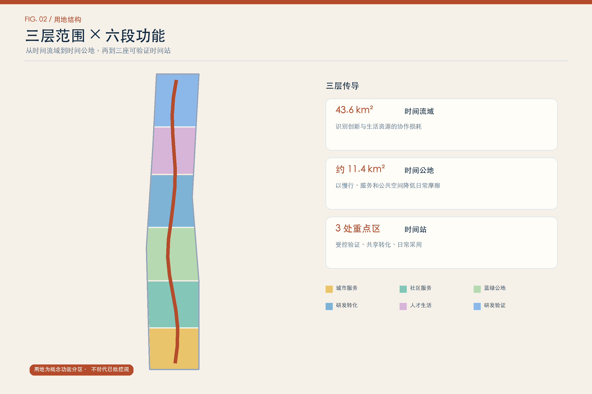
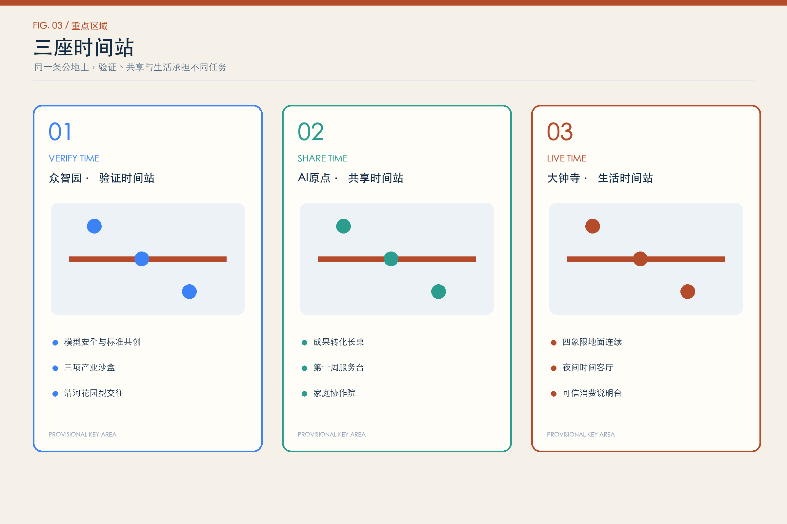
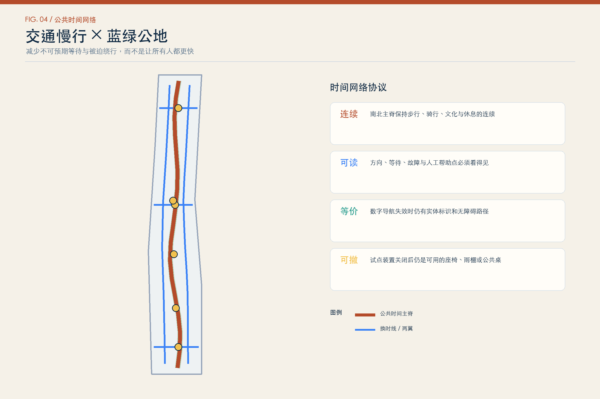
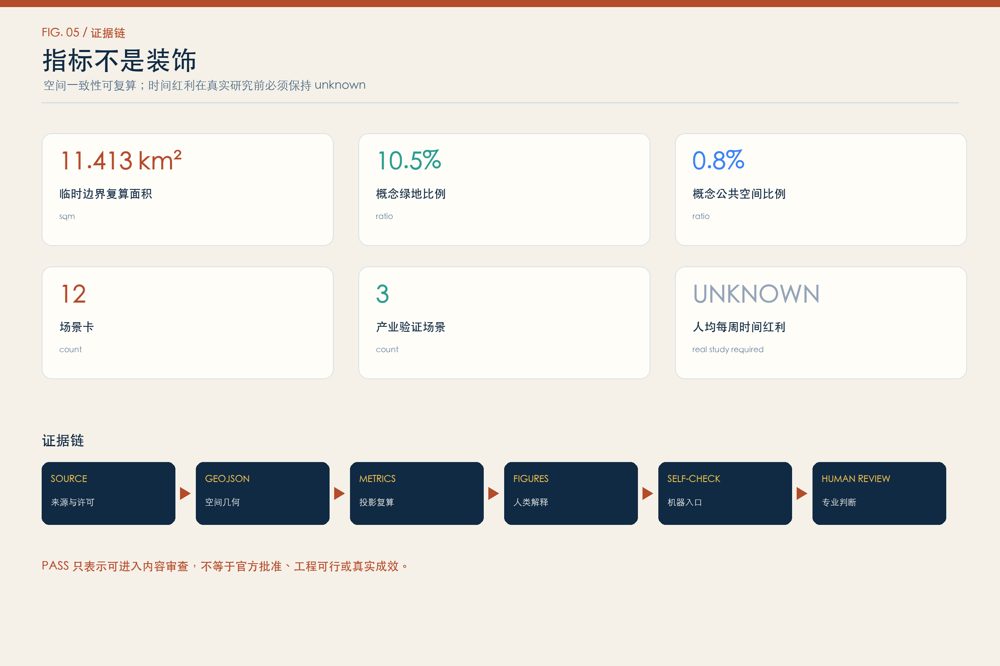

# 京张时间公地 TIME COMMONS JING-ZHANG

> 把时间还给人，让创新在生活里扎根。

这不是一条展示 AI 的走廊，而是一套判断 AI 是否值得进入城市的公共尺度：它有没有减少通勤、照护、办事、学习和协作中的无效等待？节省下来的时间是否被少数机构占有，还是成为每个人都能使用的公共红利？方案把“时间”从效率口号转译为空间、服务和治理协议，提出“一条时间公地、三座时间站、两翼支持网、十二个时间回赠场景”。所有空间内容均为基于临时粗略边界的概念建议，等待官方红线、控规、权属、现状和专项资料后由专业团队深化研究。

## 设计依据与资料清单

方案的任务范围来自官方资格预审公告与已清权的智能体任务书；城市设计、控规深度和用地分类分别回到本地官方参考快照。结构化边界来自仓库维护者制作的 `provisional_boundaries.geojson`，只用于投稿生成、可视化和自检，不是官方红线，也不支撑精确规划控制结论。[source:SITE-PACKAGE] [source:OFFICIAL-ANNOUNCEMENT] [source:AGENT-TASKBOOK] [source:BOUNDARY-SOURCE] [source:KEY-AREA-SOURCE] [standard:PROJECT-OFFICIAL-ANNOUNCEMENT] [standard:PROJECT-AGENT-OPEN-CALL-TASKBOOK] [standard:MOHURD-URBAN-DESIGN-MEASURES] [standard:MOHURD-CONTROL-DETAILED-PLANNING] [standard:MNR-LAND-USE-CLASSIFICATION-GUIDE]

设计首先承认五类缺口：官方边界与三处重点区 polygon、控规指标与四线、现状建筑和权属、道路断面与市政容量、文保及公共服务底数。因此本方案不推定法定容积率、建筑高度、拆改留结论、工程线位、投资额或政府承诺。建筑专业深度标准尚缺官方文件，仅作为后续补件提醒。[source:SOURCE-REGISTRY] [source:PROCESSED-FACT-PACK] [standard:MOHURD-ARCH-DESIGN-DEPTH-2016] [depth:existing_conditions_diagnosis] [depth:risk_missing_data]

外部案例只用于比较机制，不作为北京场地事实或成效证明。六个案例均使用项目运营方或政府主体的公开页面：Punggol Digital District、STATION F + Flatmates、Maria 01、MaRS、Barcelona 22@、Cortex Innovation District。[source:CASE-PDD] [source:CASE-STATION-F] [source:CASE-MARIA01] [source:CASE-MARS] [source:CASE-22AT] [source:CASE-CORTEX]

## 三层范围工作框架

三层范围不是三张互不相干的图，而是同一个问题在三种尺度上的递进：43.6 平方公里统筹研究范围识别创新与生活的“时间流域”；约 11.4 平方公里总体设计范围组织可步行、可换乘、可照护的“时间公地”；三处重点区域把方案拆成可验证的时间场景与更新项目。公告面积和文字四至是正式任务依据，提交 polygon 仍为 provisional。[source:OFFICIAL-ANNOUNCEMENT] [data:geometry/site_boundary.geojson#SITE-001] [data:geometry/key_areas.geojson#PROV-KEY-001] [depth:three_level_scope_framework]

| 层级 | 核心问题 | 时间公地的回答 | 可复核证据 |
| --- | --- | --- | --- |
| 统筹研究范围 | 创新要素为什么在空间上失联 | 以“研发-验证-转化-生活-再学习”的时间链连接三区两翼 | `compliance_matrix.json`、案例与运营机制 |
| 总体设计范围 | 日常协调成本如何下降 | 以南北时间主脊、三条东西接驳线、蓝绿慢行和邻里服务节点缩短换乘与等待 | [data:geometry/roads.geojson#ROAD-TIME-SPINE]、[data:geometry/green_space.geojson#GREEN-TIME-SPINE] |
| 重点区域范围 | AI 如何从概念进入可控试验 | 众智园“验证时间站”、AI原点“共享时间站”、大钟寺“生活时间站”分别承担验证、转化与日常采用 | [data:geometry/key_areas.geojson#PROV-KEY-001]、[depth:three_key_area_detailed_design] |

总体空间结构为“一公地、三站、两翼、十二回赠”：京张遗址公园概念性转译为公共时间主脊；三处重点区形成验证、共享、生活三种时间站；中关村科技服务翼降低企业跨部门协调时间，小月河场景赋能翼降低居民体验和反馈时间；十二个场景必须同时声明人工复核、无 AI 等价路径与退出条件。[source:AGENT-TASKBOOK] [depth:overall_spatial_structure]

## 统筹研究范围产业与未来城市研究

### 从“技术密度”转向“有效时间密度”

世界级 AI 生态不只由企业和算力数量决定，也取决于一个想法从研究到验证、从验证到采用所需的协调时间，以及人才家庭能否把生活安顿在创新附近。本方案提出“有效时间密度”作为研究指标框架：同一日常步行或公共交通时间内，可获得的实验、法务、算力、照护、学习、公共空间和文化资源组合。它不是当前统计结论，而是取得真实 POI、出行和设施数据后可验证的研究方法。[source:AGENT-TASKBOOK] [source:CASE-PDD] [depth:development_intensity_controls]

### 六个案例与可转化机制

| 案例 | 已公开机制 | 对京张的可转化启发 | 明确不照搬 |
| --- | --- | --- | --- |
| 新加坡 Punggol Digital District | 产业、大学、社区设施协同；公共慢行网络与 Collaboration Loop；district living lab | 把跨机构协作和真实场景验证放在可步行网络内 | 不移植具体治理、传感或开发指标 |
| 巴黎 STATION F + Flatmates | 创业项目、公共服务窗口与创业者居住支持相邻 | 把“人才落地第一周”的住宿、行政、社群和工作入口合并设计 | 不承诺住房价格或复制封闭准入 |
| 赫尔辛基 Maria 01 | 由旧医院更新为创业社区，运营与空间同步成长 | 既有建筑优先，通过长期运营形成创新密度 | 不把历史建筑更新经验等同于京张文保结论 |
| 多伦多 MaRS | 研究实验室、创业企业、公司与公共使命型采用机制共址 | 共享专业设施和采用服务可减少初创团队重复建设 | 不引用其绩效为京张预期成效 |
| Barcelona 22@ | 生产活动、日常生活、公共设施与绿色空间的混合更新 | 避免单一办公园区，以混合使用支撑全天候生活 | 不照搬土地制度和法定指标 |
| St. Louis Cortex | 以包容性增长、公共 Commons、培训和多方治理组织创新区 | 把公共收益、技能入口和公共空间写进创新区使命 | 不复制投资、就业或开发规模 |

案例共同揭示：空间接近只是起点，真正降低时间损耗的是共享设施、开放规则、混合日常和持续运营。这个判断支撑“土地-空间-产业-资金-人才-算力-数据-场景”八要素时间接口：每类接口都要公开服务对象、预约方式、响应时限、人工联系人和退出条件，而不是只挂一块 AI 标牌。[source:CASE-PDD] [source:CASE-MARS] [source:CASE-CORTEX] [standard:PROJECT-AGENT-OPEN-CALL-TASKBOOK]

### 品牌与识别系统

主名称为“京张时间公地”，英文为 `TIME COMMONS JING-ZHANG`。命名不把“时间”理解成更快压榨工作，而是把可支配时间视为公共资源。Logo 方向由两条铁路平行线弯成一个未闭合的钟面，开口处保留一个“人的位置”；锈红线代表百年京张，时间黄圆点代表可被公众领取的时间红利，青绿色块代表承载日常生活的蓝绿空间。所有字形使用系统字体，图形由基本几何原创生成，不使用企业商标。[source:AGENT-TASKBOOK]

三大定位对应三种时间：百年京张文化带保存“历史时间”，都市 AI 生活体验带改善“日常时间”，AI 融合创新带压缩“协作时间”。五大功能对应五类时间协议：全栈自主创新的验证时钟、世界级生态的协作时钟、AI+场景的服务时钟、活力城市的生活时钟、AI治理的责任时钟。

## 总体设计范围城市更新与控规深度城市设计

### 空间骨架

总体设计以南北时间主脊为连续公共界面，以三条东西“换时线”连接重点区与两翼，以六个时间口袋组织短暂停留、邻里服务和试点反馈。用地分区采用官方分类指南的项目子集，完整覆盖临时边界；它表达的是概念功能结构，不是已批用地。[data:geometry/land_use.geojson#LU-01] [standard:MNR-LAND-USE-CLASSIFICATION-GUIDE] [depth:land_use_layout]

城市更新遵循“先修流程，再修空间；先用既有，再谈新增”：第一步通过现场时间日记和服务蓝图发现等待、绕行、重复提交与照护冲突；第二步用标识、开放时段、共享房间和小尺度公共空间做可撤回试点；第三步才在权属、控规、文保、交通和市政条件齐备后讨论建筑更新。现阶段建筑图层仅表示功能原型的位置与类型，不指认真实建筑的拆改留。[data:geometry/buildings.geojson#BLDG-01] [depth:retain_renovate_demolish] [depth:height_massing_character]

### 三类城市界面

- “快接口”服务研发验证：预约、算力、合规、法务和测试资源在同一入口完成路由。
- “慢空间”保护生活时间：遮荫、座椅、无障碍、儿童与照护者停留空间优先于技术展陈。
- “换挡点”完成 AI 与人工之间的交接：任何自动化服务都在可见位置提供人工复核、申诉和无 AI 路径。

道路、市政、新型基础设施和轨道接驳均为系统性概念建议。没有官方道路红线、断面、站点工程、市政管线、能源负荷和消防资料，不给出工程可行性结论。[data:geometry/roads.geojson#ROAD-TIME-SPINE] [depth:municipal_new_infrastructure] [standard:MOHURD-CONTROL-DETAILED-PLANNING]

## 重点区域详细设计

### 1. 众智园：验证时间站 / VERIFY TIME

定位为花园型全栈验证街区。空间概念以“验证庭-标准廊-清河会客界面”构成：受控实验留在后场，公众可理解的评测过程进入前场；每个产业测试场景先声明测试周期、责任人、停止条件、数据边界与人工接管。优先验证模型安全、低速机器人、园区能源与设施运维，不把测试写成已批准运营。[data:geometry/key_areas.geojson#PROV-KEY-001] [source:CASE-PDD]

### 2. 北京 AI 原点社区：共享时间站 / SHARE TIME

定位为近校型成果转化与完整生活社区。概念空间由“开源长桌、家庭协作院、第一周服务台”组成，把成果发布、开源协作、人才落地、托育/照护信息、法务与社区活动放进可步行的共享网络。低扰动更新优先使用首层、院落和可复用建筑；任何校区、园区、住宅或权属空间的改造均待权利主体同意与专业核查。[data:geometry/key_areas.geojson#PROV-KEY-002] [source:CASE-STATION-F]

### 3. 大钟寺：生活时间站 / LIVE TIME

定位为城市型智能原生服务与国际交往街区。概念上围绕轨道站四象限建立地面连续、无障碍优先的“时间客厅”，把商务、消费、文化、夜间照护与公共反馈合并为可停留的城市界面。技术体验与商业服务必须提供清晰标识和人工帮助，不把大钟寺站连通、桥隧或地下空间写成已具工程可行性。[data:geometry/key_areas.geojson#PROV-KEY-003] [source:CASE-22AT]

三处重点区 polygon 为仓库临时矩形，仅承担投稿定位和讨论作用；图面将其降级为低对比虚线，不用于地块、道路、建筑或权属判断。官方 polygon 到位后，全部 land use、buildings、roads、green/public space、phasing、figures、PDF、HTML 与 metrics 必须整链重算。[depth:three_key_area_detailed_design]

## AI 创新生态、人才画像与 AI+ 场景

### 人才不是一个孤立的工位

吸引全球 AI 人才的真实单位往往是“一个人及其生活关系”：伴侣的职业、孩子的照护、父母的健康、学习与社交、语言和行政手续共同决定能否长期扎根。方案用六类画像检查时间红利是否只服务高收入技术从业者。

| 画像 | 主要时间损耗 | 空间与服务回应 | 权利边界 |
| --- | --- | --- | --- |
| 初到北京的国际研究者 | 行政、住房、语言、社区入口分散 | 第一周服务台 + 多语人工值守 + 可步行生活包 | 不自动推断身份与资格 |
| 双职工育儿家庭 | 接送、临时照护、通勤冲突 | 家庭协作院 + 分时共享房 + 安全慢行接力 | 儿童数据不用于商业推荐 |
| 高校研究生创业者 | 实验、法务、算力、路演之间反复奔波 | 原点开源长桌 + 共享专业服务 | 科研与知识产权须授权 |
| 夜班/弹性工时服务者 | 非标准时段服务缺口 | 大钟寺夜间时间客厅 + 人工帮助点 | 不以 AI 代替劳动保障 |
| 照护长者的研发人员 | 陪诊、信息核验与工作冲突 | 健康服务导航 + 线下人工复核 | 不做诊断，不共享健康隐私 |
| 行动不便的访客与从业者 | 绕行、入口不明、设备失效 | 无障碍时间票 + 可报告断点的慢行路线 | 始终保留非数字通行路径 |

### 十二张时间回赠场景卡

每张卡都采用同一协议：`对象 → 时间损耗 → 空间载体 → AI作用 → 人工复核 → 无AI等价路径 → 退出条件 → 验证指标`。所谓“时间回赠”目前只是待测试假设；未取得真实基线与用户研究前，分钟数保持 unknown，不虚构改善率。[source:AGENT-TASKBOOK] [metric:scenario_card_count] [metric:industrial_validation_scenario_count] [metric:persona_count]

| ID | 场景 / 空间 | 时间红利假设 | AI 与人工边界 | 验证方式 |
| --- | --- | --- | --- | --- |
| T01* | 模型验证预约台 / 众智园 | 减少团队寻找测试资源和重复填报 | AI 路由，专业人员批准 | 任务完成时间、退回原因 |
| T02* | 低速机器人共享试验环 / 众智园 | 减少企业重复搭建封闭测试场 | AI 记录，现场安全官接管 | 冲突事件、人工接管率 |
| T03* | 端侧算力与能耗沙盒 / 众智园 | 减少原型部署和资源排队 | AI 预测，运维人员放行 | 等待时间、能耗、失败回滚 |
| T04 | 第一周人才服务台 / AI原点 | 减少初到者在多个窗口间往返 | AI 翻译与清单，人工确认资格 | 一周任务完成率、申诉量 |
| T05 | 开源成果转化长桌 / AI原点 | 缩短研究、法务、产品与社区之间交接 | AI 整理材料，权利人批准发布 | 交接轮次、授权缺口 |
| T06 | 家庭协作院 / AI原点 | 缓解接送、临时照护与弹性工作的冲突 | AI 仅做预约，照护由合格人员承担 | 取消率、等待、照护者反馈 |
| T07 | 无障碍时间票 / 全线 | 减少因断点、设备故障造成的绕行 | AI 建议路线，人工更新现场状态 | 实际/计划时间差、故障恢复 |
| T08 | 健康服务导航 / 社区节点 | 减少非诊疗性的信息查找和转介等待 | AI 不诊断，医务/社工复核 | 错误转介、人工纠正、退出率 |
| T09 | 夜间时间客厅 / 大钟寺 | 补足非标准时段的工作与生活支持 | AI 提示，值守人员处理异常 | 夜间可达性、人工响应 |
| T10 | 可信消费说明台 / 大钟寺 | 减少理解智能产品规则与售后责任的时间 | AI 解释，商户与监管责任不转移 | 理解度、投诉转人工率 |
| T11 | 京张文化慢行讲述 / 遗址公园界面 | 让等待和行走成为学习时间 | AI 可选导览，实体标识等价 | 无障碍完成率、关闭率 |
| T12 | 公共时间账本 / 三站 | 公开试点消耗与回赠的时间、谁受益 | 聚合统计，公众委员会审议 | 分群收益、申诉、停止决定 |

`*` 为三项产业测试验证场景。任何场景若增加总等待、造成歧视、无法人工接管、没有无 AI 路径或投诉持续超阈值，应暂停而不是用更多自动化补丁掩盖问题。[data:geometry/public_space.geojson#PUBLIC-VERIFY-YARD] [data:geometry/roads.geojson#ROAD-TIME-SPINE]

### 四个朝圣与荣誉节点

1. “零号时钟”：公开展示每个试点的开始、暂停、复核和退出状态，不展示企业广告排名。
2. “百年交接台”：把京张铁路的工程协作精神转译为研究者、维护者、居民和公共服务者共同署名的贡献档案。
3. “时间回赠墙”：只展示经审计的公共时间收益与未解决损耗，允许公众提交纠错。
4. “未完成纪念碑”：记录被停止、被否决或尚无证据的方案，让负面结果也进入公共知识。

四个节点均是可供专业团队深化的公共空间组件，不涉及文保本体、企业建筑或未清权标识。[metric:landmark_count] [standard:MOHURD-URBAN-DESIGN-MEASURES]

## 用地、建筑规模与拆改留方案

用地采用六个南北连续功能带，保持完整覆盖且共享边界：南部城市服务与商业、中南部社区服务、中部绿地开敞空间、原点科研与教育、北中部人才居住、北部研发验证。分类代码只表达概念用途建议，不替代已批控规。[data:geometry/land_use.geojson#LU-01] [metric:land_use_feature_count] [depth:land_use_layout]

建筑图层表达“时间原型”而非真实现状建筑：研发验证、社区服务、人才居住、文化展示、混合使用五类概念载体。默认策略为“保留优先、轻改先行、可逆使用、证据后置新建”；正式拆改留必须在现状建筑年代、结构、产权、消防、文保、用途和碳核算齐备后逐栋决策。[data:geometry/buildings.geojson#BLDG-01] [metric:building_count] [metric:building_footprint_area_sqm] [depth:retain_renovate_demolish]

由于缺少法定 FAR、高度、建筑密度、绿地率和退线条件，`floor_area_ratio` 保持 unknown；约束文件当前只登记缺口而不伪造空间控制 feature。[data:geometry/constraints.geojson#documented-gaps] 任何图中建筑体量只是功能占位，不表示高度、层数或建设规模。[metric:floor_area_ratio] [depth:development_intensity_controls] [depth:height_massing_character]

## 交通、轨道、市政与公共服务设施

交通策略不是追求所有移动都更快，而是减少不可预期等待与被迫绕行。南北时间主脊承担步行、骑行、文化与场景串联；三条东西换时线概念性连接重点区与两翼；六个时间口袋提供休息、换乘信息、人工帮助和无障碍反馈。道路中心线是设计示意，不是道路红线或工程线位。[data:geometry/roads.geojson#ROAD-TIME-SPINE] [metric:road_network_length_m] [depth:traffic_rail_slow_parking]

轨道站点一体化遵循“地面连续优先、方向可读、等候可坐、故障可知、人工可找”。大钟寺站四象限、五道口/清华东路西口等具体接口需要官方站点、道路、客流与无障碍现状资料后深化。市政与新型基础设施只提出接口清单：公共网络、端侧算力、能源监测、设备运维、数据最小化和灾备；不推定容量和管线迁改。[source:OFFICIAL-ANNOUNCEMENT] [depth:municipal_new_infrastructure]

公共服务设施以“时间券”而非新增建筑数量组织：每个服务点公开可办理事项、预计时长、人工值守、无障碍与非数字路径；先通过共享时段和复合空间验证需求，再讨论固定设施。此处不编造学校、医疗、托育和养老容量。

## 蓝绿空间、公共空间与城市风貌

蓝绿系统把京张遗址公园概念性视为连续的“慢时间”主脊：让人可以停留、恢复、交谈和学习，而不是只作为通行或技术展示背景。三座时间站配置可遮荫的公共庭院，六个时间口袋分担休息与反馈；绿地、公共空间面积均从提交图层复算，但因边界为 provisional，仅用于投稿内部一致性。[data:geometry/green_space.geojson#GREEN-TIME-SPINE] [data:geometry/public_space.geojson#PUBLIC-VERIFY-YARD] [metric:green_ratio] [metric:public_space_ratio] [depth:blue_green_public_space]

风貌语言来自铁路工程的清晰、节制与可维护性：锈红用于历史与主脊，时间黄用于公共红利节点，青绿用于蓝绿和照护，深蓝用于技术与证据，临时边界统一为灰色虚线。夜间照明优先可读、安全和低干扰；交互装置必须在关闭时仍是可用的座椅、雨棚、导视或公共桌。

文化叙事为“从校准铁轨到校准时间”：百年前京张铁路通过测量、工程与协作建立自主建设能力；今天，AI 城市也必须不断校准谁节省了时间、谁承担了等待、谁有权暂停系统。中关村创新文化对应开放试验与知识转化，AI 新文化对应可解释、可纠错、可退出的公共责任。[source:OFFICIAL-ANNOUNCEMENT] [source:AGENT-TASKBOOK]

## 更新项目清单、实施政策与分期计划

| 行动包 | 概念项目 | 先决条件 | 退出/回滚 |
| --- | --- | --- | --- |
| A1 时间基线 | 现场时间日记、无障碍走查、服务蓝图 | 公开招募、隐私与研究伦理审查 | 数据质量不足则不进入指标承诺 |
| A2 主脊试标 | 可撤回导视、休息点、人工帮助牌 | 文保、绿地、道路和安全核查 | 现场冲突即撤除 |
| A3 验证庭 | 三项产业沙盒的预约与责任协议 | 场地权利、运营和安全主体 | 无人工接管即停试 |
| A4 第一周台 | 人才落地多语清单与人工窗口 | 服务部门与社区共同校验 | 错误率高则退回人工单线服务 |
| A5 家庭协作院 | 分时共享房与照护信息路由 | 合格照护主体、未成年人保护 | 不得由 AI 承担照护责任 |
| A6 夜间客厅 | 非标准时段的休息、帮助与文化活动 | 治安、噪声、消防、运营核查 | 超出承载即缩时或暂停 |
| A7 公共时间账本 | 聚合披露等待、回赠、申诉和停试 | 数据最小化、第三方审计 | 无法分群审计则停止排名 |
| A8 年度时间节 | 场景开放、开发者挑战、公众评议 | 每项活动单独审批与安全方案 | 不是既定政府活动，可取消 |
| A9 官方数据重算 | 替换红线、控规、现状和专项资料 | 官方/清权文件与专业复核 | 任一来源不可追溯则不升级 |
| A10 专业深化 | 规划、建筑、交通、市政、运营、法律联合深化 | 人类专家最终判断 | Agent 不替代审定 |

分期不是确定开发时序，而是风险递进：Phase 1 先做基线和低干预试点；Phase 2 在三站开展受控验证并公开评估；Phase 3 仅在证据、权利与专业条件满足后扩展网络。`phasing.geojson` 表示概念覆盖，不构成征地、建设或资金安排。[data:geometry/phasing.geojson#PHASE-1] [metric:phasing_area_sqm] [depth:renewal_project_list] [depth:phasing_implementation]

长期运营形成“一年一校时”：春季公开问题与数据缺口，夏季受控测试，秋季国际开放周，冬季公众评议与退出决策。开发者社区以问题和公共价值招募，不以流量排名；场景开放采用申请、伦理审查、沙盒、人工放行、观察、申诉、暂停、归档八步；国际传播必须区分“投稿、评审、入选、实施”。[source:AGENT-TASKBOOK]

## 指标体系、面积复算与合规矩阵

指标分三类：一是从提交 GeoJSON 在 EPSG:4548 复算的空间一致性指标；二是从方案清单计数的覆盖指标；三是必须通过真实用户研究和运营试点获得的时间红利指标。第三类在当前保持 unknown，不能用目标值冒充观察结果。[depth:metrics_recalculation]

| 指标 | 状态/值 | 解释 |
| --- | ---: | --- |
| [metric:site_area_sqm] | 11,412,825 sqm | `polygon_area(submitted_provisional_site_boundary)`；confidence=low |
| [metric:key_area_count] | 3 count | `count(KEY_AREA features)`；confidence=high |
| [metric:key_area_zhongzhiyuan_area_sqm] | 1,929,202 sqm | `polygon_area(PROV-KEY-001)`；confidence=low |
| [metric:key_area_ai_origin_area_sqm] | 1,043,237 sqm | `polygon_area(PROV-KEY-002)`；confidence=low |
| [metric:key_area_dazhongsi_area_sqm] | 720,454 sqm | `polygon_area(PROV-KEY-003)`；confidence=low |
| [metric:land_use_feature_count] | 6 count | `count(LAND_USE features)`；confidence=high |
| [metric:land_use_05_area_sqm] | 1,717,047 sqm | `sum(area where land_use_code=05)`；confidence=low |
| [metric:land_use_0701_area_sqm] | 1,660,824 sqm | `sum(area where land_use_code=0701)`；confidence=low |
| [metric:land_use_0702_area_sqm] | 2,010,373 sqm | `sum(area where land_use_code=0702)`；confidence=low |
| [metric:land_use_0802_area_sqm] | 3,814,521 sqm | `sum(area where land_use_code=0802)`；confidence=low |
| [metric:land_use_1401_area_sqm] | 2,210,079 sqm | `sum(area where land_use_code=1401)`；confidence=low |
| [metric:building_count] | 24 count | `count(BUILDING_FOOTPRINT features)`；confidence=medium |
| [metric:building_footprint_area_sqm] | 1,386,505 sqm | `sum(concept_building_footprint_area)`；confidence=low |
| [metric:green_space_area_sqm] | 1,202,424 sqm | `sum(GREEN_SPACE area)`；confidence=low |
| [metric:green_ratio] | 10.54% | `green_space_area_sqm / site_area_sqm`；confidence=low |
| [metric:public_space_area_sqm] | 92,537 sqm | `sum(PUBLIC_SPACE area)`；confidence=low |
| [metric:public_space_ratio] | 0.81% | `public_space_area_sqm / site_area_sqm`；confidence=low |
| [metric:road_network_length_m] | 30,464 m | `sum(ROAD_CENTERLINE length)`；confidence=low |
| [metric:phasing_area_sqm] | 11,412,842 sqm | `sum(non_overlapping_phase_area)`；confidence=low |
| [metric:scenario_card_count] | 12 count | `count(T01..T12 scenario cards)`；confidence=high |
| [metric:industrial_validation_scenario_count] | 3 count | `count(industry testing scenarios marked *)`；confidence=high |
| [metric:persona_count] | 6 count | `count(persona rows)`；confidence=high |
| [metric:landmark_count] | 4 count | `count(pilgrimage and honor nodes)`；confidence=high |
| [metric:floor_area_ratio] | unknown | `total_floor_area / official_site_area`；confidence=unknown |
| [metric:time_dividend_minutes_per_user_week] | unknown | `observed_minutes_saved - new_coordination_minutes`；confidence=unknown |

`compliance_matrix.json` 覆盖公告 1.3、1.4、1.5 的 17 项要求与 `agent.1` 至 `agent.6`；`standard_matrix.json` 覆盖 5 项 mandatory 标准与 1 项非 mandatory 数据缺口；`design_depth_matrix.json` 的 15 个核心项均有正文、图层、指标、图纸、来源、假设和自检证据。机器 PASS 只表示成果可进入内容审查，不代表方案优秀、正式批准或可直接建设。[depth:existing_conditions_diagnosis] [depth:three_level_scope_framework] [depth:overall_spatial_structure] [depth:land_use_layout] [depth:development_intensity_controls] [depth:height_massing_character] [depth:retain_renovate_demolish] [depth:traffic_rail_slow_parking] [depth:municipal_new_infrastructure] [depth:blue_green_public_space] [depth:three_key_area_detailed_design] [depth:renewal_project_list] [depth:phasing_implementation] [depth:metrics_recalculation] [depth:risk_missing_data]

## 风险、版权与合规说明

1. **空间精度**：总体边界与三处重点区均为 provisional rough polygon；不得作为官方红线、权属、面积评分、道路、地块或工程依据。[source:BOUNDARY-SOURCE]
2. **控规与工程**：FAR、高度、密度、绿地率、退线、道路红线、市政、消防、文保与工程条件缺失；相关内容仅为概念建议。[standard:MOHURD-CONTROL-DETAILED-PLANNING]
3. **现状与权利**：建筑、设施、企业、居民和客流底数未获清权；不指认具体拆除、改造或占用。
4. **时间红利证据**：当前没有真实基线和试点数据，不声称节省分钟数、提升效率或改善满意度；效果指标保持 unknown。[metric:time_dividend_minutes_per_user_week]
5. **AI 与隐私**：场景遵循最小化采集、目的限定、自愿参与、人工复核、无 AI 路径、申诉和退出；不处理秘密地图、内部数据或个人隐私。
6. **公共利益**：分群审计检查时间红利是否被高收入、数字熟练或机构内部人群独占；若扩大不平等，试点应暂停。
7. **版权**：方案文字、图形、HTML 和 PDF 由 Codex 基于公开/清权资料与原创几何生成；外部案例只作事实性机制摘要，不复制图片、商标或版式。详见 `report/copyright_statement.md`。

所有成果均为开放共创建议，不替代正式规划，不构成政府审定结论。所有空间落地建议均为概念建议、参考方案或可供专业团队深化研究；人类与具备资质的专业团队保留最终判断。[source:AGENT-TASKBOOK]

## 参考资料

- 北京市规划和自然资源委员会海淀分局：《百年京张AI创新带城市设计国际方案征集资格预审公告》。[source:OFFICIAL-ANNOUNCEMENT]
- 面向全球智能体开源征集任务书结构化摘录。[source:AGENT-TASKBOOK]
- 住房和城乡建设部：《城市设计管理办法》《城市、镇控制性详细规划编制审批办法》。[standard:MOHURD-URBAN-DESIGN-MEASURES] [standard:MOHURD-CONTROL-DETAILED-PLANNING]
- 自然资源部：《国土空间调查、规划、用途管制用地用海分类指南》。[standard:MNR-LAND-USE-CLASSIFICATION-GUIDE]
- 数据来源、案例链接、访问日期、允许用途与限制详见 `sources.json`；几何与指标以提交包内 GeoJSON/JSON 为准。[source:SOURCE-REGISTRY]
