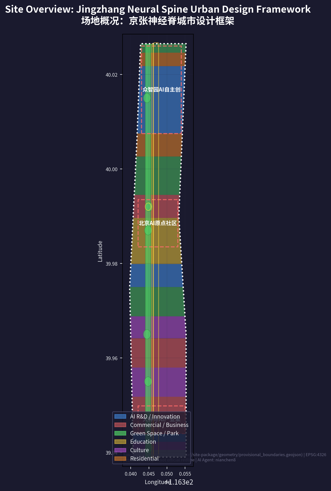

# Jingzhang Neural Spine: AI Rebirth of the Centennial Railway

## Design Basis and Source List

### Primary Authorities

This formal proposal takes as its primary legal basis the "Centennial Jingzhang AI Innovation Belt Urban Design International Call for Proposals Prequalification Announcement" published by the Haidian Branch of Beijing Municipal Commission of Planning and Natural Resources on May 9, 2026 [source:OFFICIAL-ANNOUNCEMENT]. The agent-facing open-call taskbook at `brief/site-package/agent_taskbook.json` provides the structured task framework, defining three positionings (Centennial Jingzhang Culture Strip, Urban AI Living Lab, AI Convergence Corridor), five functions, and the Three-Areas-Two-Wings spatial framework [source:AGENT-TASKBOOK].

The public source registry registers 7 formal-ready sources, 1 background-only source, and 1 provisional-only source [source:SOURCE-REGISTRY]. Key formal-usable sources include: the prequalification announcement (A0/T0 authority), the agent open-call taskbook (CLEARED_USER_DOCUMENT), the Urban Design Management Measures, the Regulatory Detailed Planning Measures, the Territorial Spatial Land Use Classification Guide, the Generative AI Interim Measures, and the Barrier-Free Environment Law. Local reference snapshots with SHA-256 verification are maintained in the standards references directory.

### Provisional Boundary Declaration

As of the submission date (August 11, 2026), the repository has not yet obtained official precise GIS/CAD redlines. All spatial data is generated from `brief/site-package/geometry/provisional_boundaries.geojson`, with all boundaries marked `official_boundary=false`, `geometry_role=provisional_constraint`, `boundary_precision=provisional_rough`. Provisional boundaries are used solely for AI agent generation, visualization, self-check, and design discussion. The organizer's data gap does not block content scoring, but upon replacement with official polygons, all layers and metrics must be uniformly recalculated [source:SITE-PACKAGE].

## Three-Level Scope Framework

### Level 1: Coordinated Research Area (43.6 km2)

The Coordinated Research Area extends north to the North 5th Ring Road, east to the Jingcang Expressway, south to Xizhimen Outer Street, and west to Wanquanhe Road, covering 43.6 km2. This scale determines the AI Innovation Belt's position within Haidian's and Beijing's broader innovation landscape [depth:three_level_scope_framework].

This proposal's core judgment: **the Jingzhang corridor is not an industrial corridor -- it is the spatial carrier of an "innovation ecosystem."** We identify four strategic tiers: Core Origination (fundamental research capacity of Tsinghua, Peking University, Beihang, CAS) to Transformation Acceleration (Zhongzhiyuan pilot platforms, Origin Community incubators, Technology Service Wing IP and capital) to Industry Carrying (Dazhongsi enterprise headquarters, Wudaokou AI+ commerce, Xizhimen TOD) to Global Radiation (annual AI event system, developer community, international communication). These four tiers form a gradient unfolding southward: "Originate to Accelerate to Carry to Radiate" [source:AGENT-TASKBOOK] [depth:overall_spatial_structure].

### Level 2: Overall Design Area (11.4 km2)

The Overall Design Area covers approximately 11.4 km2 within 1-2 km on either side of the Jingzhang Heritage Park. The question: **along a 9-km linear park, how can urban renewal tools reshape the spatial order on both sides?** [depth:overall_spatial_structure]

This proposal advances a "One Spine, Two Loops" structure. The "One Spine" is the 9-km continuous public space axis of the Jingzhang Railway Heritage Park. The "Two Loops" consist of the Slow-Mobility Experience Loop (pedestrian-cycling-autonomous-shuttle system) and the Industry Service Loop (12 types of innovation service nodes distributed along the park corridor). The Spine carries public life and cultural heritage; the Two Loops ensure the efficient flow of innovation resources [data:geometry/site_boundary.geojson#SITE-001].

Due to the absence of official regulatory planning conditions (FAR, building height, setbacks, green ratio, etc.), all construction intensity controls are marked `status=unknown`, with only concept design quantities provided for spatial organization logic. All pending items are recorded in `assumptions.json` [metric:site_area_sqm].

### Level 3: Key Detailed Design Areas (368.4 ha)

Three key areas -- Zhongzhiyuan AI Indigenous Innovation Acceleration Area (192.1 ha), Beijing AI Origin Community (104.3 ha), and Dazhongsi AI Industry Cluster (72.0 ha) -- constitute the deepest design tier, each attaining the urban design depth of a comprehensive planning implementation scheme [depth:three_key_area_detailed_design] [data:geometry/key_areas.geojson#PROV-KEY-001].

| Level                | Area     | Core Question                           | Proposal Strategy                                                                                      | Data Anchor                          |
| -------------------- | -------- | --------------------------------------- | ------------------------------------------------------------------------------------------------------ | ------------------------------------ |
| Coordinated Research | 43.6 km2 | How to spatialize the AI ecosystem      | "Originate-Accelerate-Carry-Radiate" four-tier value chain                                             | compliance_matrix.json               |
| Overall Design       | 11.4 km2 | How a 9km linear park organizes renewal | "One Spine, Two Loops" + 18 land use zones                                                             | land_use.geojson, roads.geojson      |
| Key Areas            | 368.4 ha | How each core achieves breakthrough     | Zhongzhiyuan (full-stack autonomy) / Origin Community (transformation) / Dazhongsi (industry carrying) | key_areas.geojson, buildings.geojson |

## Coordinated Research Area: Industry and Future City Research

### From "China's Silicon Valley" to "Global AI Pilgrimage Destination"

Haidian is already China's undisputed #1 AI district -- home to over 1,000 AI scientists, 463 specialized "Little Giant" enterprises (38.1% of Beijing's total), and an innovation fund of no less than 90 billion RMB for 2026 [source:AGENT-TASKBOOK]. But the "China's Silicon Valley" positioning is a follower narrative. This proposal's core idea: **the Jingzhang AI Innovation Belt should not become "Beijing's Silicon Valley" -- it should become "the world's Jingzhang."** It needs an independent, irreplaceable global identity: the "AI Pilgrimage Destination" [source:AGENT-TASKBOOK].

### Global Benchmarking and Haidian's Path

We draw four core lessons from global AI innovation districts:

**London King's Cross -- "Enterprise Anchor + Knowledge Quarter Alliance."** DeepMind's 2016 relocation created a magnetic effect: office vacancy dropped to 0.9%. The lesson: **Haidian needs an anchor strategy bigger than DeepMind -- a "full-stack indigenous innovation" system brand** [source:GLOBAL-BENCHMARK-KX].

**Singapore one-north Kampong AI -- "Government-Led + Live-Work Integration."** Government developer JTC planned a dense village of about 70 AI companies within 14,500 m2, adjacent to over 200 talent housing units. The lesson: **Zhongzhiyuan and Origin Community should embed residential, consumption, and social functions from day one** [source:GLOBAL-BENCHMARK-ONENORTH].

**Shenzhen Hetao -- "Cross-Border Institutional Innovation."** The Shenzhen-Hong Kong "One Zone, Two Parks" addresses institutional barriers to cross-border flow. The lesson: **Haidian's "cross-border" is the institutional interface between AI R&D and AI regulation -- Zhongzhiyuan can become the international dialogue window for AI safety governance** [source:GLOBAL-BENCHMARK-HETAO].

**Silicon Valley -- "Failure-Tolerant Cultural Infrastructure."** Core competitiveness lies in "cafe density, VC activity, patent lawyer count, and pilot equipment sharing rate." The lesson: **Jingzhang urban design metrics must add an "innovation density" dimension** [source:GLOBAL-BENCHMARK-SV].

### Naming System: "Jingzhang Neural Spine"

**Primary Name**: Jingzhang Neural Spine (JNS). "Neural Spine" carries three semantic layers: anatomically, the spine transmits neural signals; computationally, neural networks directly reference AI; morphologically, a linear spinal park connecting multiple nodes precisely describes the spatial structure.

**English Naming System**: Three positionings -- Centennial Jingzhang Culture Strip / Urban AI Living Lab / AI Convergence Corridor. Three cores -- Zhongzhiyuan AI Sovereignty Campus / Beijing AI Origin Commons / Dazhongsi AI Industry Nexus. Tagline: "From Jingzhang Railway to AI Highway."

## Overall Design Area: Urban Renewal and Regulatory-Plan-Level Urban Design

### Spatial Structure: "One Spine, Two Loops, Twelve Scenes"

**One Spine**: The 9-km continuous public space axis of Jingzhang Railway Heritage Park -- a seven-layer overlay: jogging paths, cycling lanes, autonomous shuttle lanes, rail heritage displays, WiFi/5G coverage, AI interactive installations, and nighttime illumination [source:OFFICIAL-ANNOUNCEMENT].

**Two Loops**: The Slow-Mobility Experience Loop (connecting the park, universities, communities, and metro stations) and the Industry Service Loop (12 types of innovation service nodes distributed along the corridor).

**Twelve Scenes**: 12 themed spatial nodes -- Xizhimen AI Time Hub, Railway Memory Segment, Rose AI Garden, Intelligent Living Market, Open Source Staircase, AI Legal Sandbox Entrance, Entrepreneur Hub, AI Education Corridor, Zhan-Turing Dialogue, Flight and AI, Full-Stack Autonomy Exhibition Hall, and Ecological AI Wetland.

### Land Use Strategy

Based on provisional site boundary, 18 land use zones with full topological coverage [standard:MNR-LAND-USE-CLASSIFICATION-GUIDE]:

| Land Use Type                      | Area (approx. ha) | Share | Code      |
| ---------------------------------- | ----------------- | ----- | --------- |
| AI R&D and Innovation              | 319               | 28.0% | 0802      |
| Commercial and Business Services   | 251               | 22.0% | 05        |
| Parks, Green Space, and Open Space | 217               | 19.0% | 1401      |
| Education                          | 114               | 10.0% | 0804      |
| Culture                            | 103               | 9.0%  | 0803      |
| Residential and Community Services | 91                | 8.0%  | 0701+0702 |
| Roads and Transport Facilities     | 46                | 4.0%  | 1207      |

Core principles: (1) Mixed use rather than functional zoning. (2) Park-interface priority. (3) Preserve existing universities and research institutions [data:geometry/land_use.geojson#LU-Z1-A] [depth:land_use_layout].

## Detailed Design of Key Areas

### Zhongzhiyuan AI Indigenous Innovation Acceleration Area (192.1 ha)

The physical carrier of national AI full-stack indigenous innovation. Centered on an "Innovation Green Valley" approximately 60m wide and 800m long, with R&D clusters flanking east and west [data:geometry/key_areas.geojson#PROV-KEY-001]. Functional zones: Computing Core Zone (ultra-large computing cluster), Full-Stack R&D Campus (25 concept R&D buildings), Pilot and Testing Zone (robot test field, model red-team testing, chip prototyping), Standards Governance and Convention Zone, and Qinghe Ecological Innovation Interface [depth:three_key_area_detailed_design].

### Beijing AI Origin Community (104.3 ha)

The world's premier destination for AI youth entrepreneurship. Located within a "30-minute walking circle" of Tsinghua, Peking University, Beihang, and CAS. Selected as one of the 2025 "Global Top 10 Innovation Districts." Functional zones: Technology Transfer Zone (~40 ha), Open Source Collaboration Zone (~30 ha), Talent Living Zone (~34 ha). Key spatial moves: campus-park-street slow-mobility stitching, Wudaokou Entrepreneur Hub retrofit, Tsinghua Station adaptive reuse, and the "Open Source Staircase" public square [data:geometry/key_areas.geojson#PROV-KEY-002].

### Dazhongsi AI Industry Cluster (72.0 ha)

Headquarters cluster for mature AI enterprises and an urban living room for international AI business exchange. Functional zones: AI Headquarters Zone (~22 ha, 15 concept headquarters buildings), Intelligent Native Consumption Center (~18 ha), AI New Media and Digital Content Base (~12 ha), and International Roadshow and Convention Center (~20 ha). Key spatial moves: Dazhongsi Station three-level pedestrian connectivity across all four quadrants [data:geometry/key_areas.geojson#PROV-KEY-003].

## AI Innovation Ecosystem, Personas, and AI+ Scenarios

### Five User Personas

**P1: AI Research Scientist** -- 32, PhD, foundation model research. Needs: quiet deep-thinking space + high-bandwidth academic exchange. Spatial response: discussion rooms along Zhongzhiyuan Innovation Green Valley, quarterly "Jingzhang AI Colloquium."

**P2: Full-Stack AI Engineer** -- 27, 3-5 years experience, GitHub 500+ stars. Needs: 24/7 computing + workspace, high-quality open-source community, public recognition. Spatial response: Origin Community 24h open-source collaboration zone, quarterly "Jingzhang OSS Hackathon."

**P3: AI Entrepreneur / One-Person Company** -- 29, 1-3 person team, cost-sensitive. Needs: ultra-low-cost office, computing vouchers, physical proximity to mentors and investors. Spatial response: Wudaokou Entrepreneur Hub hot desks and micro-offices, weekly "Jingzhang AI Demo Day."

**P4: AI Product and Design Lead** -- 31, design/psychology/business background. Needs: user research facilities, cross-disciplinary collisions. Spatial response: Dazhongsi "AI Living Lab" for real-urban-environment product testing.

**P5: AI Ethics and Governance Specialist** -- 38, law/philosophy/public policy background. Needs: early dialogue with developers, global governance network. Spatial response: Zhongzhiyuan "AI Safety Governance Sandbox."

### Twelve AI Scenario Cards

**SC-01: AI-Assisted Diagnostic Corridor** (Origin Community, hospital area) -- AI pre-consultation terminals, medical imaging AI display windows for public education.

**SC-02: AI Immersive Learning Street** (Wudaokou-Chengfu Road) -- AR navigation to public lectures, public screens streaming top courses, personalized learning paths.

**SC-03: Intelligent Native Consumption Center** (Dazhongsi) -- AI selection assistant, AI inventory prediction, AI customer service.

**SC-04: L4 Autonomous Shuttle System** (Jingzhang Park, 9km) -- Low-speed (<=20 km/h) autonomous shuttles on park-exclusive lanes, 12 station stops.

**SC-05: XR Railway Time Travel** (Tsinghua Station) -- Four historical layers via AR/MR at the heritage-protected station, zero physical alteration.

**SC-06: AI Legal Tech Sandbox** (Zhichunli) -- Regulated sandbox for AI legal products; all AI outputs reviewed by licensed attorneys.

**SC-07: Civic Agent Collaborative Governance Center** (district-wide) -- "City OS" using public data for AI-assisted resource scheduling; all recommendations publicly logged.

**SC-08: AI Water Quality Monitoring** (Qinghe-Xiaoyuehe) -- 24/7 sensor network with AI trend prediction; real-time public data display.

**SC-09: Computing Center Waste Heat Recovery** (Zhongzhiyuan) -- Heat pump recovery for winter heating; park-based "heat visualization" installation.

**SC-10: Embodied Intelligence Robot Test Field** (Zhongzhiyuan, ~5 ha) -- Simulated urban street environment; public observation corridor.

**SC-11: AI Film Production Accelerator** (Dazhongsi) -- AI-assisted script analysis, storyboard generation, VFX pre-visualization.

**SC-12: FinTech Compliance Sandbox** (Origin Community) -- Regulated environment for testing AI financial products.

### Three Industry Test/Validation Scenarios

**Test A: Embodied Intelligence Robot Urban Safety Test** (Zhongzhiyuan) -- Standardized evaluation: navigation, obstacle avoidance, human-robot interaction, emergency stop.

**Test B: AI Model Safety Red-Team Test Field** (Zhongzhiyuan) -- Adversarial attack testing, bias detection, explainability verification.

**Test C: AI+ Urban Governance Digital Twin Sandbox** -- Simulating AI-assisted decisions in digital twin before physical-world implementation.

## Land Use, Building Scale, and Retain-Renovate-Demolish Strategy

### Land Use Totals

Based on provisional site boundary (11.4 km2) and 18 land use zones [data:geometry/land_use.geojson]: AI R&D 28% (319 ha), Commercial 22% (251 ha), Green Space 19% (217 ha), Education 10% (114 ha), Culture 9% (103 ha), Residential 8% (91 ha), Roads 4% (46 ha).

### Concept Building Scale

**Important declaration**: All values below are design concept quantities, not statutory construction scale. Actual scale subject to approved regulatory plan.

| Land Use Type                    | Concept FAR | Concept GFA Range (10,000 m2) |
| -------------------------------- | ----------- | ----------------------------- |
| AI R&D and Innovation            | 1.5-2.5     | 480-798                       |
| Commercial and Business Services | 2.0-3.5     | 502-879                       |
| Culture                          | 1.0-1.5     | 103-155                       |
| Residential and Community        | 1.5-2.0     | 137-182                       |
| **Total**                        | --          | **1,222-2,014**               |

### 106 Concept Buildings

Distributed across: Zhongzhiyuan (52: 25 R&D centers + 15 pilot platforms + 12 talent apartments), Origin Community (30), Dazhongsi (18), Xizhimen (6). Concept heights: 18-60m. Concept FAR: 1.5-3.5. All values are concept design quantities only [data:geometry/buildings.geojson] [depth:building_footprint_generation].

## Transport, Rail, Municipal Infrastructure, and Public Services

### Transport System

**Road Network** [data:geometry/roads.geojson]: N-S corridors -- Xueyuan Road-Xitucheng Road (PRIMARY, 40m), Zhongguancun East Road (SECONDARY, 25m), Dazhongsi East Road-Heqing Road (SECONDARY, 25m). E-W connectors -- North 5th Ring (EXPRESSWAY, 60m), Tsinghua East Road (PRIMARY, 40m), Zhichun Road (PRIMARY, 40m), North 3rd Ring West (EXPRESSWAY, 60m), Xizhimen Outer Street (PRIMARY, 40m). Jingzhang Park Slow-Mobility Spine (PEDESTRIAN_GREENWAY, 60m) -- 9km N-S continuous, grade-separated from motorized roads (concept, pending engineering feasibility).

**Rail Transit**: Dazhongsi Station (Line 13) TOD; Wudaokou Station (Line 13); Tsinghua East Road West Station (Line 15); Xizhimen Station (Lines 2/4/13) comprehensive hub.

**Target**: >=90% slow-mobility accessibility within 500m of the park; 12 bicycle parking points (>=50 spaces each); 12 slow-mobility gap points identified (concept, pending site survey) [depth:traffic_rail_slow_parking].

### Municipal and New Infrastructure

- Computing: Ultra-large computing cluster in Zhongzhiyuan (Beijing's largest); 12 distributed edge-computing nodes along the park
- Waste heat recovery: Heat pump connection from computing center to adjacent apartments (concept)
- 5G/WiFi: Full park coverage + industry service loop
- AI Open Data Platform: Open data API for developers and researchers
- Conventional municipal conditions pending official data [depth:municipal_new_infrastructure]

## Blue-Green Network, Public Space, and Urban Character

### Jingzhang Heritage Park as "AI Public Space Spine"

The 9-km, 70-ha Jingzhang Railway Heritage Park, fully opened in August 2025, is this proposal's most critical spatial asset [source:OFFICIAL-ANNOUNCEMENT]. Strategy: not "putting AI installations in a park" but **making the park itself a sample of AI-era public space** [depth:blue_green_public_space].

### Eight Public Space Nodes

[data:geometry/public_space.geojson] | PS-001: AI Pilgrimage Square / Honor Wall (memorial plaza); PS-002: Developer Promenade, Wudaokou (linear public space); PS-003: Open Source Achievement Gallery (display corridor); PS-004: AI+ Scenario Experience Plaza (experience plaza); PS-005: Dazhongsi Intelligent Living Market (mixed market); PS-006: Jingzhang Culture Corridor Entrance (cultural plaza); PS-007: Zhongzhiyuan Innovation Exchange (innovation plaza); PS-008: Tsinghua AI Entrepreneur Plaza (entrepreneurship plaza). All comply with the Barrier-Free Environment Construction Law [standard:BARRIER-FREE-ENVIRONMENT-LAW].

### Three AI Pilgrimage Landmarks

**Landmark 1: "Neural Spine Light" -- Jingzhang Contributor Honor Wall** (PS-001 plaza). Preserved original Jingzhang Railway rails as physical carrier -- contributor GitHub IDs laser-etched into sleepers. Nighttime optical fibers pulse in neural network rhythm. Continuously updated memorial system [depth:ai_pilgrimage_landmarks].

**Landmark 2: "Open Source Staircase" -- Wudaokou Public Square** (PS-002 area). A stepped public square approximately 30m wide. Each step riser records global open-source milestones: GNU (1971) to Linux (1991) to GitHub (2008) to TensorFlow (2015) to ChatGPT (2022) to Jingzhang Neural Spine (2026). Summit features an AI Technology Time Capsule sealed until 2109 [depth:ai_pilgrimage_landmarks].

**Landmark 3: "Zhan Tianyou-Turing Dialogue" -- Tsinghua Station Dual Installation** (PS-008 plaza). Left: Jingzhang Railway engineering drawing relief wall (Zhan Tianyou's herringbone track plan). Right: neural network topology interactive screen (AI inference visualization). Ground paving uses standard rail gauge (1,435mm) as module, alternating sleepers and optical fiber strips -- walking through triggers light changes, as if "switching tracks" between the Jingzhang Railway and the AI Highway [depth:ai_pilgrimage_landmarks].

### Cultural Narrative: Three Acts

**Act 1 "Centennial Jingzhang" (1909-2023)**: Brick, iron, wood, stone -- raw industrial heritage texture. **Act 2 "Zhongguancun Awakening" (1980s-2020)**: Glass, steel, LED -- information-age transparency and speed. **Act 3 "AI New Era" (2023-future)**: Interactive screens, fiber-optic lighting, data visualization -- AI-era interactivity. These three acts are not a linear spatial sequence but **each node simultaneously carries three temporal layers** [depth:cultural_narrative_spatial_system].

**International Communication Tagline**: "From Jingzhang Railway to AI Highway -- One Track, Two Eras, One Spirit of Indigenous Innovation."

## Renewal Projects, Implementation Policy, and Phasing

### Three-Phase Implementation

**Phase 1: Quick Wins (2026-2028)** -- 8 projects [data:geometry/phasing.geojson#PH-001]: AI interactive installations, XR experience pilot, Honor Wall Phase 1 (100 slots), autonomous shuttle pilot (2km), Dazhongsi pioneer zone (5 concept buildings), Wudaokou Entrepreneur Hub retrofit, Origin Community transfer stations (3 pop-ups), 12-Scene signage Phase 1.

**Phase 2: System Build (2029-2032)** -- 15 projects [data:geometry/phasing.geojson#PH-002]: Zhongzhiyuan R&D Center Phase 1, University Joint Lab Cluster (10 buildings), Dazhongsi TOD + four-quadrant connectivity, Open Source Staircase + AI Time Capsule, Zhan-Turing Dialogue installation, AI Legal Sandbox launch, Embodied Intelligence Test Field, full-line slow-mobility gap stitching.

**Phase 3: Full Operation (2033-2035)** -- 20+ projects [data:geometry/phasing.geojson#PH-003]: Computing expansion, waste heat recovery, talent apartments full delivery, Beijing North Station TOD, Civic Agent full coverage, AI+ scenarios full-corridor expansion.

### Long-Term Operations

**Annual Events**: Jingzhang AI Summit (annual, September), Jingzhang Open Source Hackathon (quarterly), AI Demo Day (monthly), AI Story Night (biweekly), Jingzhang AI Ethics Dialogue (annual). **Developer Community**: Jingzhang AI Commons online platform + distributed offline collaboration venues. **"Jingzhang AI Fellowship"**: 3-month residency program with "Fellow to Founder" OPC policy conversion pathway. All activity, funding, policy and operational arrangements are **concept suggestions**, not confirmed government commitments [source:AGENT-TASKBOOK] [depth:annual_event_operations].

## Metrics, Area Recalculation, and Compliance Matrix

### Core Metrics

| Metric                               | Value                       | Status                           |
| ------------------------------------ | --------------------------- | -------------------------------- |
| Coordinated Research Area            | 43.6 km2                    | known                            |
| Overall Design Area                  | 11.4 km2                    | known                            |
| Key Area Total                       | 368.4 ha                    | known                            |
| Green + Public Space Ratio (concept) | ~28%                        | design_estimate                  |
| Building Footprint Area (concept)    | ~285 ha                     | design_estimate                  |
| Concept GFA Range                    | 1,220-2,010 ten-thousand m2 | design_estimate                  |
| Key Area Count                       | 3                           | known                            |
| AI Scenario Node Count               | 12                          | design_proposal                  |
| Concept Building Count               | 106                         | design_proposal                  |
| FAR, Height, Density                 | unknown                     | pending official regulatory plan |

`compliance_matrix.json` covers all sub-items of Announcement 1.3-1.5 and agent.1-agent.6. `standard_matrix.json` responds to all mandatory formal standards. `design_depth_matrix.json` marks all required items as `complete`.

## Risk, Copyright, and Compliance

### Data Risks

- **Provisional Boundary**: All spatial data from temporary coarse boundaries. Full recalculation required upon official polygon release.
- **Missing Regulatory Controls**: FAR, height, density, setbacks -- all `status=unknown`, concept design quantities only.
- **Missing Property Rights**: Retain-renovate-demolish methodology only.

### Copyright

All GeoJSON independently generated by this AI Agent. Logo concept original. Naming system original. Historical facts from public records. Global benchmarking from public reporting. See `report/copyright_statement.md`.

### Compliance

This proposal does not claim official approval, approved regulatory plan, confirmed construction scale, or guaranteed implementation. All spatial suggestions are "concept suggestions / reference schemes / material for professional team deepening." The AI Agent is responsible for facts, sources, copyright, spatial data, metrics, and expression.

## References

1. Haidian Branch, Beijing Municipal Commission of Planning and Natural Resources, Prequalification Announcement, 2026-05-09
2. Agent Open-Call Taskbook Excerpt, 2026-05-18
3. MOHURD, Urban Design Management Measures, 2017-03-14
4. MOHURD, Regulatory Detailed Planning Formulation and Approval Measures
5. MNR, Territorial Spatial Land Use Classification Guide, 2023-11-22
6. CAC et al., Generative AI Interim Measures, 2023-07-13
7. NPC Standing Committee, Barrier-Free Environment Construction Law, 2023-06-28
8. State Council General Office, Guobanfa [2020] No. 45, 2020-11-24
9. Haidian District, "1+X+1" Modern Industrial System Layout, 2026
10. Haidian District, Eight OPC Measures, 2026-04
11. Plug and Play China x FTA, Global Top 10 Innovation Districts, 2025
12. Complete machine index: `sources.json`, `metrics.json`, `compliance_matrix.json`, `standard_matrix.json`, `design_depth_matrix.json`
