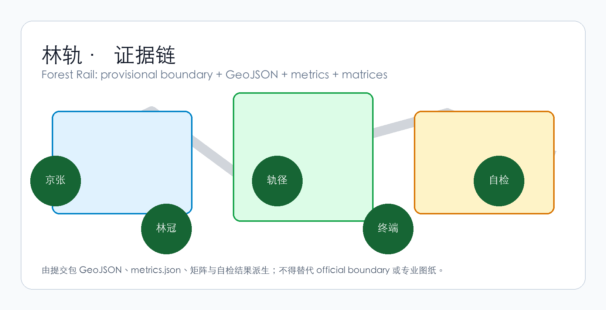
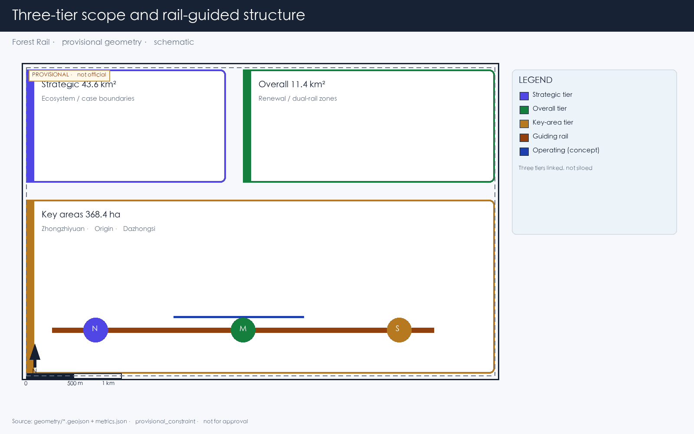
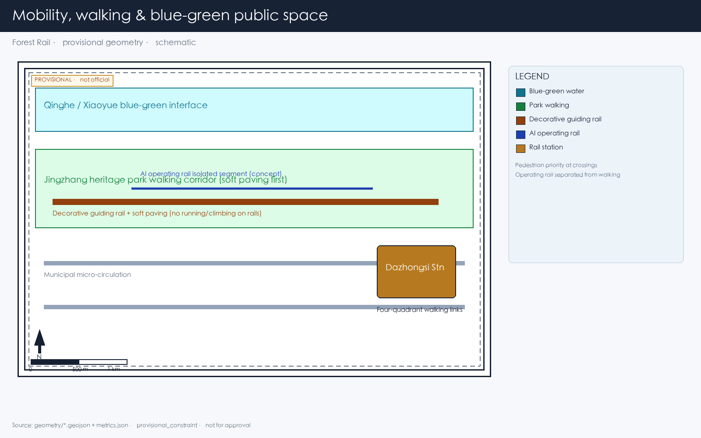
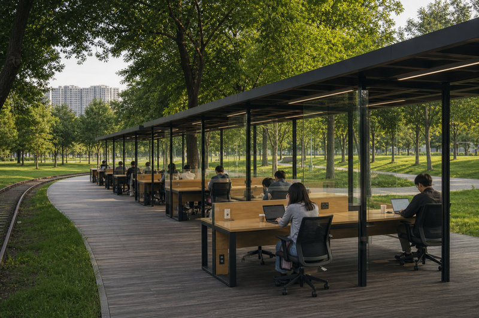
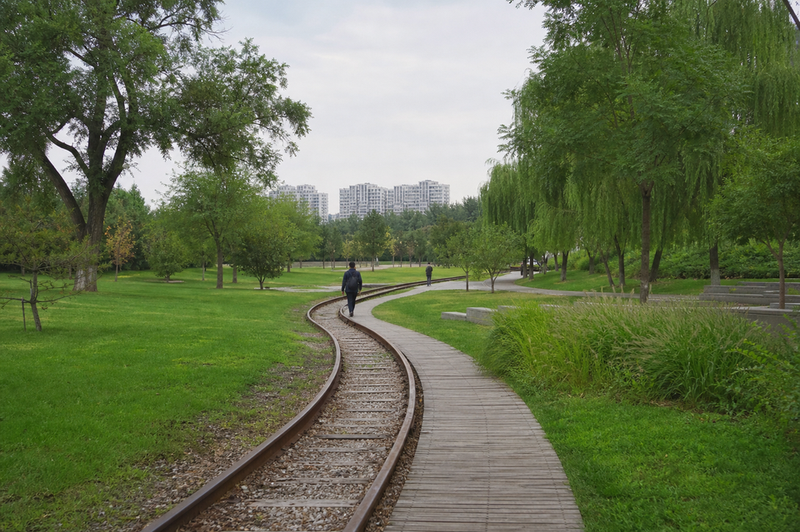
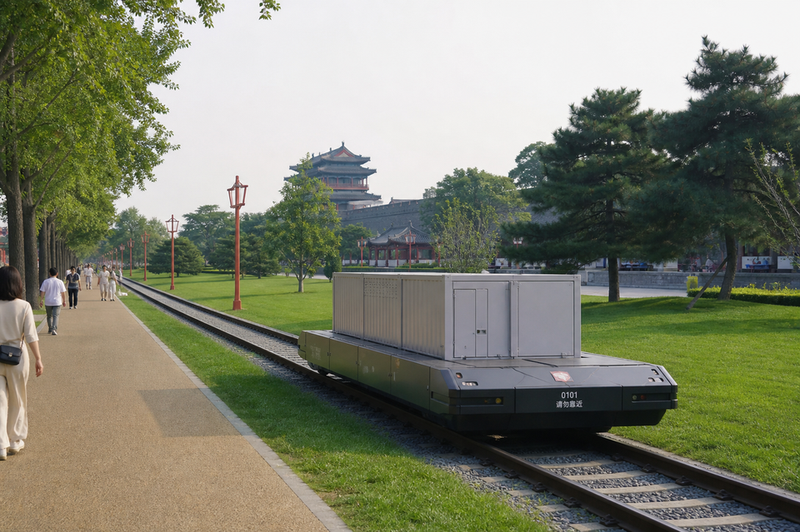
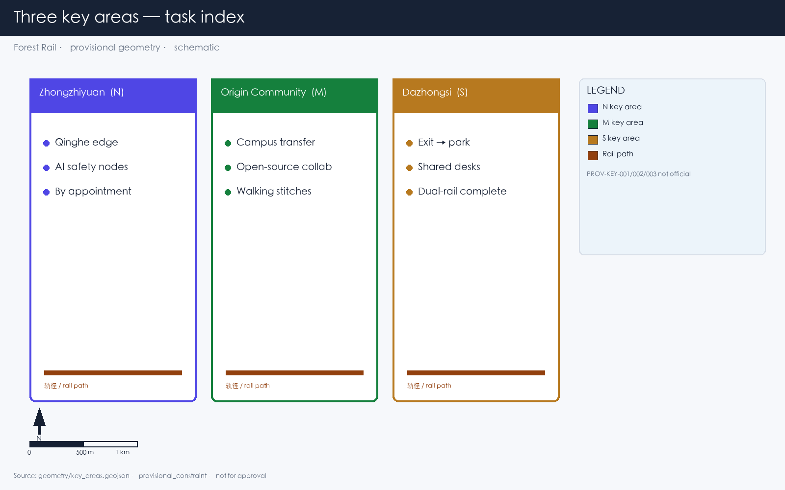
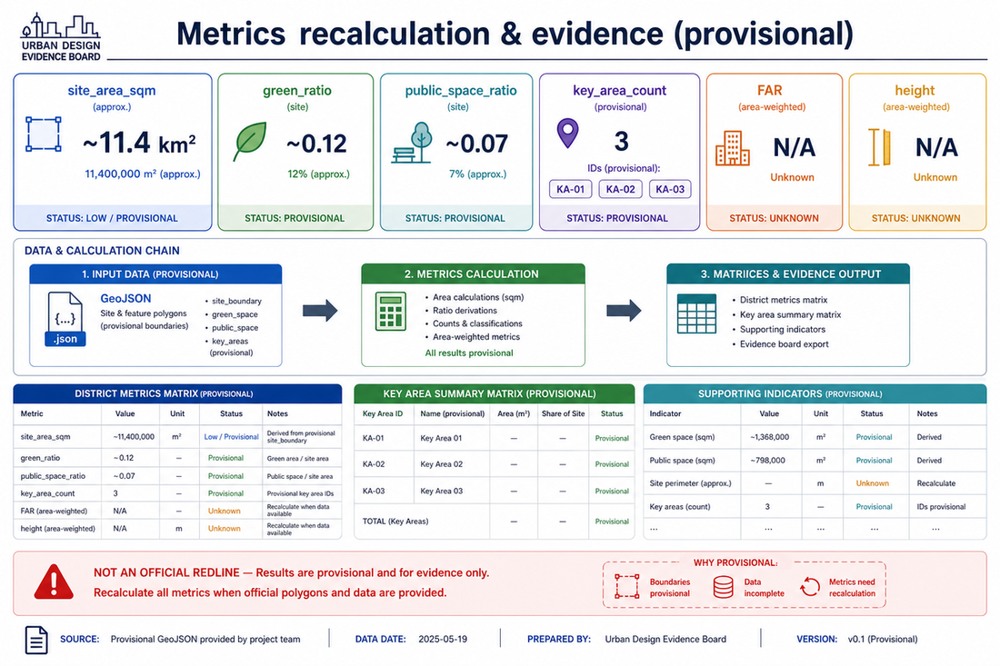

# Forest Rail

The Jingzhang Railway Heritage Park already left the rails in the city: people run, push strollers, walk along the tracks. This proposal does not reinvent that park, and does not turn it into a tech showcase. It asks something narrower — **how the Dazhongsi end connects into the park, where people go after exiting the metro, where they can stop, and whether they can sit down and work quietly** [source:AGENT-TASKBOOK].

The answer is Forest Rail:

- **Forest**: Treat the Dazhongsi section as a park — manicured lawn, spaced trees, canopy above rooftops. Look out and see trees, not the glass wall opposite.
- **Rail**: Rusted rails guide the eye; soft timber or crushed stone between them. Between key nodes, low-speed short-haul stays conceptual and separated from walking.

> One line: buildings under trees, people in a park, rusted rails pointing the way — look out and see nature.

**What this proposal refuses**: district-wide building control, viral landmarks, light shows, planting strips posing as parks, private pods disguised as shared desks.

Only one rail-guided corridor is added. Outside it, the existing street network stays.

## Design Basis and Source List

This proposal follows the Pre-qualification Announcement for the Centennial Jingzhang AI Innovation Belt Urban Design International Open Call [source:OFFICIAL-ANNOUNCEMENT], with machine-readable references from `brief/site-package/` [source:SITE-PACKAGE].

Current spatial data uses provisional boundaries (`geometry/site_boundary.geojson`, `geometry/key_areas.geojson`), labeled `provisional_constraint`, `official_boundary=false`. All metrics and drawings must be recalculated when official boundaries are released. This limitation does not block content scoring, but spatial conclusions in this text are for design discussion only.

The source registry (`data/source_registry.json`) lists 7 formal sources, 1 background source, and 1 provisional-only source. Background and provisional sources are not elevated to statutory authority [source:SOURCE-REGISTRY].

Authority order in this package: GeoJSON → metrics → matrices → sources/assumptions/self_check → proposal.md → figures → HTML → PDF. Concept renders do not replace evidence diagrams.



## Three-Level Scope Framework

The proposal follows the three tiers specified in the announcement [source:SITE-PACKAGE]:

| Tier | Area | What Forest Rail does here |
|------|------|---------------------------|
| Strategic research (43.6 km²) | AI industry ecosystem and urban morphology | Confirms the Jingzhang corridor as spine; Forest Rail can extend north from Dazhongsi |
| Overall design (11.4 km²) | Urban renewal around the heritage park | Rail corridor links three key areas; park walking and soft paving; canopy as character control |
| Key area design (368.4 ha) | Three detailed design zones | Dazhongsi completes the park set: canopy, rail path, soft paving, shared desks, rust |

Tiers are linked: strategy sets direction, overall design lands layers, key areas test whether components fit parcels.



## Coordinated Research Area: Industry and Future City Research

The Jingzhang Railway is the narrative already embedded here. It opened in 1909; after going underground in 2019, the surface alignment became a heritage park corridor. The announcement requires integrating centennial Jingzhang culture, Zhongguancun innovation culture, and AI innovation culture [source:AGENT-TASKBOOK].

Forest Rail's judgment is narrow: **do not invent a new story — use the rails; do not invent a new green corridor — connect the park to everyday Dazhongsi.** Rails stay on the ground and rust; people walk soft paving between them. The line connects three key areas — Zhongzhiyuan by Qinghe, Origin Community near universities, Dazhongsi by the metro. The rail-guided corridor is the spine, not decoration.

Industry links follow routes people actually walk:

- **University sourcing**: work moves south along the heritage corridor, not floating circles
- **Open-source collaboration**: Origin Community hosts release and code work
- **Enterprise translation**: Dazhongsi hosts agents, terminals, and data-element firms
- **Public services**: ask-a-person nodes along the rail path, not unmanned screen walls
- **International visits**: walkable rail-path itineraries, not parade stages

Naming: Forest Rail is both title and spatial description. No logo needed — the track is the mark. Rust and canopy green are enough.

## Overall Design: Rail-Guided Corridor and Urban Renewal

### Corridor Structure

The rail-guided corridor follows the Jingzhang heritage park alignment, with Dazhongsi as the southern gateway. It is not a newly drawn boundary — it reuses the railway alignment. **The park is already walked; this proposal mainly connects Dazhongsi Station into that park.**

```
Zhongzhiyuan (N) ──rail── AI Origin Community (M) ──rail── Dazhongsi (S)
                    │                           │
               Qinghe interface         Campus-district walking link
```

Tracks along the corridor serve two purposes [source:AGENT-TASKBOOK]:

| Purpose | Material | Function | Boundary |
|---------|----------|----------|----------|
| **Wayfinding** | Rusted/replica rails + soft paving | Direction for eyes and feet: walk on timber or crushed stone, follow the rusted rail | Walkable, sittable, slow; no light strips; signage minimal (Mode A) |
| **Transit (concept)** | Operable rail segments | Low-speed short-haul between nodes (goods, materials) | Separated from walking; not described as commercially mature; subject to professional feasibility study |

Most stretches are wayfinding-only. A few conceptually retain short-haul capacity. Pedestrians have priority at crossings. If short-haul fails or is never deepened, wayfinding rails and the park still stand on their own.

## Land Use, Building Scale, and Retain-Renovate-Demolish Strategy

Renewal within the overall design scope falls into three categories:

- **Retain**: Existing quality buildings along the heritage corridor — unchanged
- **Renovate**: Buildings needing ground-floor program and facade adjustment — remove LED screens, increase under-canopy transparency
- **Renew**: New construction on identified low-efficiency sites — building height controlled below tree canopy

Land use classification follows national standards [standard:MNR-LAND-USE-CLASSIFICATION-GUIDE], covering the design boundary without overlap [data:geometry/land_use.geojson#LU-001]. Building footprints and retain/renovate/renew classification are recorded in [data:geometry/buildings.geojson#BLDG-001].

Where FAR, building height, or road setbacks lack official data, they are marked as unknown. No numbers are fabricated.

## Transport, Rail, Municipal Infrastructure, and Public Services

Transport responds to the announcement's requirements for rail station integration, road micro-circulation, walking network gaps, and green transport [depth:traffic_rail_slow_parking].

Key interventions:

1. **Dazhongsi Station four-quadrant pedestrian connection**: Metro Line 13 Dazhongsi Station — establish walking connections across all four quadrants of the intersection, with rail paths extending from station exits into the district
2. **North Fifth Ring crossing node**: Pedestrian linkage where the heritage corridor crosses the North Fifth Ring Road (underpass or overhead facility) to maintain north-south continuity
3. **Rail path / municipal road intersections**: Pedestrians have priority at crossings; rail tracks embedded in road surface indicate direction; no traffic signals govern the rail path

Road and walking network layers remain within the submission boundary [data:geometry/roads.geojson#ROAD-001], cross-checked with public space and green space. With a provisional boundary, transport conclusions serve as design discussion only.



Municipal infrastructure covers edge-computing nodes, distributed energy, and traditional utility integration. Missing utility, energy, and drainage data are listed as prerequisites for detailed design, not fabricated.

## Blue-Green Network, Public Space, and Urban Character

Blue-green space follows the Jingzhang heritage corridor as its spine, coordinating Qinghe River, Xiaoyue River, and surrounding community movement [depth:blue_green_public_space].

**The tree canopy layer is the primary character control mechanism**: native trees with crown spread ≥8m (Chinese Scholar Tree, ash, ginkgo, goldenrain tree), targeting ≥70% coverage of building rooftops. Trees are not pruned into geometric shapes. Building height below the canopy — this is the basic criterion for the urban forest.

Character principles:

- Building facades use materials that age: brick, concrete, wood. No smooth glass curtain walls
- Rust and grey-green are the base colors, derived from oxidized rail and tree canopy
- Rooftops are for greening or equipment, not sculptural form
- Public art accepts only site-history-related, aging-compatible works — iron, stone, wood. No stainless steel or lighting installations

Which elements are design recommendations versus those pending official confirmation is itemized in `standard_matrix.json`.

## Key Area Detailed Design

### Zhongzhiyuan AI Autonomous Innovation Accelerator

**Location**: Northern end, along Qinghe River [data:geometry/key_areas.geojson#PROV-KEY-001].

**Position**: Garden-type full-stack autonomous innovation district. The Qinghe interface is its public living room — combining green space, stormwater management, walking and cycling, and AI safety testing display.

**Spatial actions**:
- Qinghe interface: Set back buildings, create under-canopy walkways and waterfront grass slopes
- Industry display: Standards development, safety evaluation, model red-team testing translated into visitable collaboration nodes — by appointment, not as open attractions
- External transport: Strengthen walking connections to areas north of the Fifth Ring
- Low-carbon energy: Distributed PV combined with edge computing, as an infrastructure prototype for further development

### Beijing AI Origin Community

**Location**: Middle section, near Tsinghua, Beihang and other universities [data:geometry/key_areas.geojson#PROV-KEY-002].

**Position**: University-adjacent technology transfer and talent community.

**Spatial actions**:
- Campus-park-district walking integration: Break through walls and gaps, connect campus gates to park entrances via rail paths
- Launch space: Open-source release hall, public code wall (physical screen displaying real-time open-source contributions), small presentations
- Talent services: Housing, dining, sports embedded in the streetscape, not concentrated in a "talent apartment complex"
- Open-source collaboration: 24-hour open collaboration spaces, divided into quiet zones and discussion zones by usage intensity

### Dazhongsi AI Industry Cluster — Urban Forest

**Location**: Southern end, adjacent to Metro Line 13 Dazhongsi Station [data:geometry/key_areas.geojson#PROV-KEY-003].

**Position**: Urban intelligent economy district, and the fullest end of Forest Rail — **exit the station into a park, and find a shared desk in that park**.

Five components:

| Component | How it is used in Dazhongsi | What is not allowed |
|-----------|-----------------------------|---------------------|
| **Canopy layer** | Chinese Scholar Tree and ash as primary species, crown spread ≥8m, covering existing building roofs and new low-rise structures | No geometric pruning; no ornamental small trees as substitutes |
| **Rail path** | Rusted rails embedded from Dazhongsi Station exits guide people into the park | No elevated landscape bridges; no polishing; no painting; no light strips |
| **Soft paving** | Between-rail walkways use timber boardwalk, permeable brick, or crushed stone; comfortable underfoot | No large-area asphalt; no polished stone (slippery in rain) |
| **Under-canopy workspace** | Dedicated shared workstation precinct in the park: many desks, glass partitions, hot-desks anyone can use; building ground floors also shaded by canopy | No private assigned pods; no LED facades; no viral photo-booth cabins |
| **Rust** | Rail tracks and steel elements maintain natural oxidation as time markers | No Cor-Ten imitation rust panels; no artificial aging with clear coat |

**Dazhongsi Station integration**: From exits A/B/C/D, a rail path enters each quadrant. Emerging underground, the first view should be park and rusted rail — not ad screens.

**Commercial services**: Spread along the rail path, not concentrated in a mall. Showrooms face the path; data-element services require compliance, authorization, and auditability.

**Park integration**: The rail path sits in a park — manicured lawn, spaced trees, soft paving. Shared desks are a dedicated precinct inside the park, not an office lobby moved outdoors.

Concept views (not formal evidence figures; spatial claims remain in GeoJSON / metrics / the five evidence diagrams):










All three key areas appear in `geometry/key_areas.geojson`. Current data is provisional constraint; the proposal, HTML, and self_check state that it cannot serve as approval or scoring basis.

## A Day Here: Personas and Scenarios

### Five User Personas

| Persona | Who | What they do on Forest Rail | Data boundary |
|---------|-----|----------------------------|---------------|
| **Walking commuter programmer** | AI engineer living nearby, walks to work daily | Exits Dazhongsi Station, walks 800m along the rail path to the office; eats lunch under the canopy; walks back along the rail path after work | No personal commute tracking; rail path foot traffic is anonymous counting only |
| **Parent walking with child** | Resident of surrounding neighborhoods | Pushes a stroller along the soft paving in the evening; child runs on the rusted rails; sits on under-canopy benches chatting | No family profiling; no commercial push notifications |
| **Corporate visitor** | Business guest of a major company | Arrives at Dazhongsi Station, rail path guides to company showroom; walks along rail path to next node after the meeting | Company logos and cases require rights clearance |
| **Solo freelancer** | Person without a fixed office | Finds an open shared desk in the park workstation precinct; opens when quiet, closes when crowded; hot-desk, no reserved seats | No recording of workstation user identity |
| **Retired daily walker** | 70-80 years old, lives nearby | Walks along the rail path every morning, sits on the bench at the curve watching trees; pavement must be non-slip | No health data collection |

### Scenario Cards (≥10)

| # | Scenario | Spatial carrier | What happens | Who uses it |
|---|----------|----------------|--------------|-------------|
| 01 | Exit station, enter park | Dazhongsi Station exits | Rusted rails guide into the park. Shade from trees, not light shows | All arrivals |
| 02 | Rail path walking | Entire Dazhongsi rail path | Walk on timber or crushed stone along rusted rails. Speed naturally slows. No destination signs urging you forward | Commuters, walkers |
| 03 | Shared under-canopy workstations | Dedicated park precinct with glass-partitioned multi-desk bays | Shared hot-desks: sit if free. Opens when quiet (noise <55dB, no extreme heat, no heavy rain). AI manages open/close by time and environment | Freelancers, lunch-breakers, passersby working briefly |
| 04 | Rusted rail curve bench | Rail path turning points | Benches on the outside of curves; sit and watch the rusted rail and trees. No signage; you discover it naturally by sitting down | Elderly, parents with children |
| 05 | Company showroom along the rail | Dazhongsi ground-floor retail | AI agent and terminal company display spaces open toward the rail path; visible as you walk past | Visitors, passersby |
| 06 | Rainy day under-canopy shelter | Dense canopy segments | When it rains, canopy-covered areas become natural rain corridors. AI opens more under-canopy seating during these periods | Everyone |
| 07 | Open-source launch hall | Origin Community | Code contribution display and small presentations for universities and open-source communities. Physical screen scrolling real-time commits | Developers, university faculty and students |
| 08 | Inter-node short-haul (concept) | Operable rail segments | On top of wayfinding rails, conceptual low-speed unmanned short-haul transit — connecting Zhongzhiyuan, Origin Community, and Dazhongsi for goods and materials. Separated from walking space | Concept verification stage, not daily use |
| 09 | Night walking | Entire rail path | Night lighting is minimal: ground-embedded low-illuminance lights mark soft paving edges only. No light shows, no projections | Night runners, late returners |
| 10 | Qinghe innovation corridor | Zhongzhiyuan along Qinghe | Waterfront walkway connects to the rail path, stormwater grass slopes double as resting lawns. AI safety testing nodes open by appointment | Visitors, walkers |
| 11 | Data element salon | Dazhongsi district | Under compliance, authorization, and auditability, displays data element and digital asset circulation as an urban service interface | Enterprise clients, regulators |
| 12 | University tech transfer street | Origin Community | Incubation, display, legal, IP, and investment services organized along the rail path for university technology transfer | Startup teams, investors |

All AI governance follows data minimization, open sourcing, explainability, and human review. Urban intelligent agents assist in identifying walking network gaps, public space activity, and facility maintenance needs but do not replace planning approvals or output unauthorized personal profiles.

### Three Quiet Landmarks (Not Attractions)

No "check-in points" are designated here. The following are places you notice while walking — no signage, no wayfinding, no photo-taking recommendations:

1. **Rusted rail curve with an old Scholar Tree**: At a bend in the rail path, an existing large Scholar Tree. The curve makes you turn your head and see the tree. Unnamed, unmarked.
2. **Rail path–Xiaoyue River junction, crushed stone square**: Where the rail path crosses Xiaoyue River, a crushed stone surface forms a small square. Water, rusted rail, and canopy meet here. No sculpture.
3. **Old platform retaining wall**: If Jingzhang Railway-era platform remnants exist in the district (retaining walls, steps), they are kept as found. The wall surface is not cleaned; moss grows. A bench is placed beside it.

## Renewal Project List and Phasing

| ID | Project | Type | Key dependencies | Phase |
|----|---------|------|-----------------|-------|
| FR-01 | Dazhongsi Station four-quadrant rail path connection | Walking / rail integration | Rail station, intersection traffic organization | Near-term pilot |
| FR-02 | Rail path wayfinding segment installation (Dazhongsi) | Public space | Rusted rail sourcing, soft paving materials, drainage | Near-term pilot |
| FR-03 | Canopy layer planting (Dazhongsi) | Greening | Tree specification, soil improvement, utility avoidance | Near-term start, 3-5 year canopy maturity |
| FR-04 | Under-canopy workspace ground floor renovation | Building renovation | Ownership, ground-floor program adjustment | Medium-term |
| FR-05 | Zhongzhiyuan Qinghe innovation interface | Blue-green / industry | River blue line, ecology and flood control conditions | Medium-term |
| FR-06 | Origin Community campus walking integration | Walking | Campus boundary, wall removal negotiation | Medium-term |
| FR-07 | Inter-node short-haul concept verification segment | New infrastructure (concept) | Engineering feasibility study, safety assessment | Long-term / pending |
| FR-08 | Full rail path connection (three key areas linked) | Public space / walking | North Fifth Ring crossing, corridor ownership | Long-term |

Near-term pilots can start with lightweight interventions (spread crushed stone, place benches, plant saplings) without waiting for all engineering conditions. Medium and long-term projects require confirmed regulatory plans, municipal engineering, and property rights.

Phasing spatial evidence [data:geometry/phasing.geojson#PHASE-001].

## Metrics Framework

Metrics are divided into three categories:

| Type | Examples | Data source | Precision |
|------|----------|-------------|-----------|
| Spatial metrics calculable from submitted geometry | Boundary area, green ratio, public space ratio, building footprint | GeoJSON layers | Limited by provisional boundary |
| Control metrics requiring official regulatory plans | FAR, building height, building density, setbacks | Pending official plans | Currently marked unknown |
| Performance metrics requiring ongoing operational data | Rail path daily foot traffic, under-canopy workstation utilization, node access frequency | Post-operation collection | Currently design reference values |

Three categories enter `metrics.json`, `assumptions.json`, and `compliance_matrix.json` respectively. Full calculations are in `metrics.json`; this text explains design intent only.



Key spatial metrics can be verified against [metric:site_area_sqm] and [data:geometry/green_space.geojson#GREEN-001].

### Compliance Matrix Coverage

`compliance_matrix.json` maps each requirement from Announcement 1.3-1.5 and agent.1-agent.6:

| Requirement | Proposal section | Core evidence |
|-------------|-----------------|---------------|
| 1.3 World-class AI innovation ecosystem | Strategic research + Key areas | Innovation chain spatial layout, scenario cards |
| 1.4 Three-tier scope | Three-tier scope | Task table per tier |
| 1.5.3.1 Zhongzhiyuan | Key areas: Zhongzhiyuan | key_areas PROV-KEY-001 |
| 1.5.3.2 Origin Community | Key areas: Origin Community | key_areas PROV-KEY-002 |
| 1.5.3.3 Dazhongsi | Key areas: Dazhongsi | key_areas PROV-KEY-003 |
| agent.1 Overall concept | Overall design: Corridor structure | Rail-guided corridor + three key area linkage |
| agent.2 AI full-stack innovation | Strategic research + Zhongzhiyuan | Innovation chain, safety governance nodes |
| agent.3 AI+ scenarios | Personas and scenarios | 12 scenario cards |
| agent.4 Public space and landmarks | Dazhongsi urban forest + quiet landmarks | Five components + three quiet landmarks (not attractions) |
| agent.5 Cultural narrative integration | Strategic research: Why rails | Jingzhang Railway to rusted rail to Forest Rail |
| agent.6 Global activities and long-term operations | Renewal projects: Phasing | Near-term lightweight to medium-term renewal to long-term connection |

## Risk, Copyright, and Compliance

### Provisional Boundary

All spatial conclusions are limited by provisional boundary status. When official boundaries are released: re-run scaffold, self-check, drawings, and HTML. Single-file replacement is not sufficient.

### Transit Concept

Short-haul transit on the rail-guided corridor is a conceptual suggestion, not an engineering feasibility conclusion. Rail-based logistics in the Jingzhang heritage / dense urban road network cannot be described as commercially mature. Proposal language: conceptual suggestion, subject to professional feasibility study, separated from heritage preservation and pedestrian safety zones.

### Missing Data

Gaps listed in `missing_data_checklist.csv` — official boundaries, regulatory plans, roads, municipal engineering, heritage protection — enter `assumptions.json` and self-check. Conclusions lacking official conditions are downgraded to pending confirmation.

### Copyright

The proposal provides bilingual versions (this file and `proposal.md`). Images, data, and code assets are documented in `sources.json` and `report/copyright_statement.md`. HTML pages do not load remote scripts, map tiles, fonts, iframes, or external APIs.

### Disclaimer

This proposal does not claim official approval, regulatory plan status, final property rights, final construction scale, or implementation guarantee.

## References

See [source:OFFICIAL-ANNOUNCEMENT], [source:AGENT-TASKBOOK], [source:SITE-PACKAGE], `sources.json`, `metrics.json`, `compliance_matrix.json`.

- brief/public-brief.md
- brief/site-package/design_brief.json
- brief/site-package/allowed_design_space.json
- data/processed/agent_fact_pack.md
- data/processed/project_scope_summary.csv
- data/processed/agent_task_requirements.csv
- data/processed/missing_data_checklist.csv
- Full source index: `sources.json`, `metrics.json`, `compliance_matrix.json`, `standard_matrix.json`, `design_depth_matrix.json`
