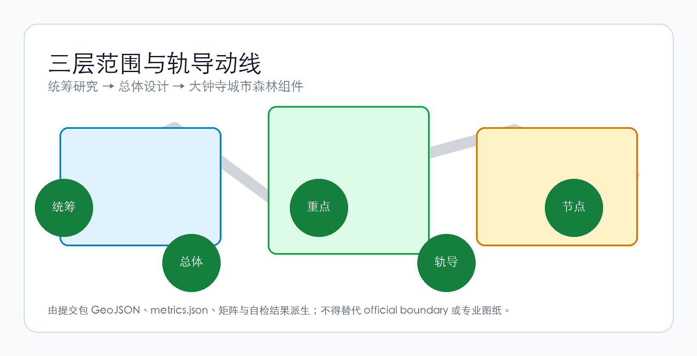
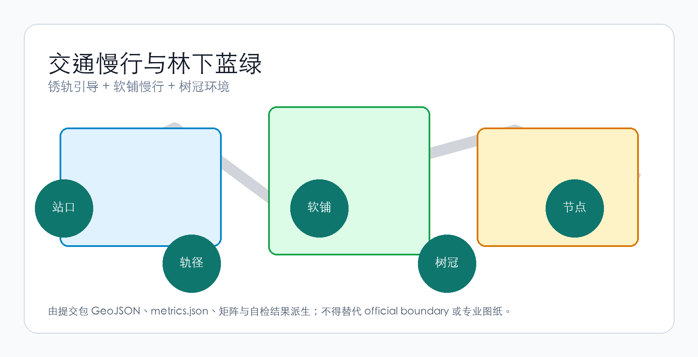
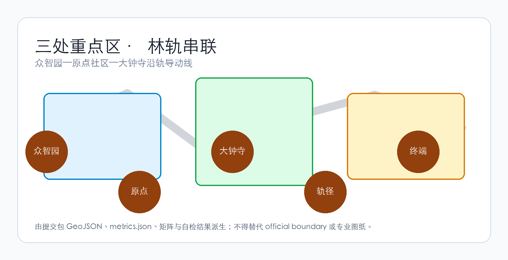
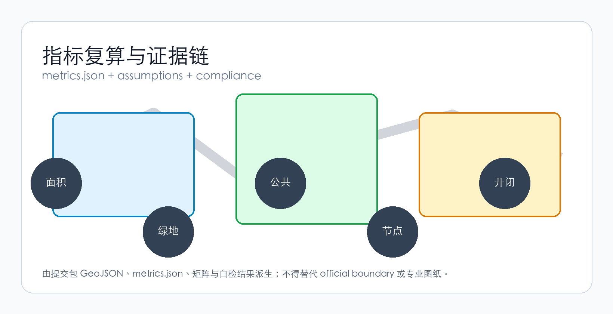

# 林轨 / Forest Rail

> 大钟寺不做科技秀场，做 AI 老巢的城市森林——楼在树下，人在林中，铁轨穿林而生锈，望出去是自然。

本方案的名字叫「林轨」。两个字各管一件事：

- **林**：在大钟寺片区种足够多、冠幅够大的乔木，让建筑屋顶低于树冠。人在室内望出去看到的是树干和树叶，不是对面的玻璃幕墙。
- **轨**：接续京张铁路遗址走廊的叙事，在片区内保留或重置铁轨作为地面引导线。轨条生锈，人走在轨间的木栈道和石粉路面上。重要节点之间，概念上保留低速短驳通行的可能。

这两件事合在一起，构成一条穿过树林的动线。动线以外的地方，人怎么走还怎么走，路网不动。

## 设计依据与资料清单

本方案以《百年京张AI创新带城市设计国际方案征集资格预审公告》为第一依据 [source:OFFICIAL-ANNOUNCEMENT]，以 `brief/site-package/` 中登记的临时边界、重点区域和指标范围为机器可读依据 [source:SITE-PACKAGE]。

当前采用 provisional boundary（`geometry/site_boundary.geojson`、`geometry/key_areas.geojson`），标注 `provisional_constraint`、`official_boundary=false`。正式边界发布后，所有空间数据、指标和图纸需要重新计算。这个限制不阻断内容评分，但正文中涉及面积、比例和空间位置的结论只能作为可讨论、可替换的设计参考。

资料登记表（`data/source_registry.json`）登记 formal 可用资料 7 条、背景资料 1 条、provisional-only 资料 1 条。背景和 provisional 资料不升级为法定依据 [source:SOURCE-REGISTRY]。


## 三层范围工作框架

方案按公告三个层次组织 [source:SITE-PACKAGE]：

| 层级 | 面积 | 林轨在这层做什么 |
|------|------|------------------|
| 统筹研究（43.6 km²） | AI 产业生态与城市形态判断 | 确认京张走廊是组织主轴，林轨概念从遗址公园南端（大钟寺）向北延伸的可能性 |
| 总体设计（11.4 km²） | 遗址公园周边城市更新框架 | 轨导动线串联三处重点区，树冠覆盖作为风貌控制手段，软铺慢行替代硬质铺装 |
| 重点区域（368.4 ha） | 三处详细设计 | 大钟寺片区落实城市森林组件：树冠层、轨径、软铺、林下办公、锈 |

三层不割裂。统筹研究决定轨导动线的走向逻辑，总体设计把动线落到用地和道路图层，重点区域验证组件在地块上能不能放下。



## 统筹研究范围产业与未来城市研究

京张铁路是这片区域里已有的、不需要发明的叙事线。1909 年通车，2019 年地下化后地面段变成遗址公园。公告要求融合百年京张文化、中关村创新文化与 AI 创新文化 [source:AGENT-TASKBOOK]。

林轨的回答：不另造叙事，用铁轨本身。轨条留在地上，生锈，长草，人沿着它走。这条线把三处重点区域串起来——众智园在北端临清河，AI 原点社区在中段近高校，大钟寺在南端临地铁。轨导动线是空间组织的脊柱，不是装饰。

AI 产业生态的空间协同框架：

- **高校策源**：清华、北大、北航等高校的 AI 研究成果沿遗址走廊向南流动
- **开源协作**：原点社区提供成果发布和代码协作空间
- **企业转化**：大钟寺片区承接智能体、智能终端、数据要素企业
- **公共服务**：沿轨径分布的 AI 服务节点（医疗分诊、法律咨询、教育辅助）
- **国际传播**：依托轨径步行路线组织可步行的国际交流活动

命名系统服务于辨识度：「林轨」二字既是方案名也是空间描述。不需要 logo——轨道本身就是标识。视觉识别用锈色和树冠绿，不加多余符号。

## 总体设计范围城市更新与控规深度城市设计

### 动线结构

轨导动线沿京张遗址公园走廊布置，大钟寺段为南端门户。动线不是新画的红线，是对既有铁路线位的复用。

```
众智园（北）──轨── AI 原点社区（中）──轨── 大钟寺（南）
                │                    │
              清河界面              近校慢行缝合
```

动线上的铁轨分两种作用 [source:AGENT-TASKBOOK]：

| 作用 | 用什么 | 干什么 | 边界 |
|------|--------|--------|------|
| **引导** | 锈轨/假轨 + 软铺 | 人的方向：脚下走木栈或石粉，眼睛跟着锈轨走 | 可走、可坐、可慢；不加灯带，标志极弱（模式 A） |
| **运输（概念）** | 可运行轨段 | 节点间低速短驳（货、物料） | 与步行分区；不写已成熟商用；待专业团队深化 |

同一条走廊分段处理：有的路段只做引导锈轨，有的路段概念上保留短驳通行能力，交叉处慢行优先。

## 用地、建筑规模与拆改留方案

总体设计范围内的更新按三类处理：

- **保留**：京张遗址走廊两侧已建成且质量良好的建筑，不动
- **改造**：首层业态和外立面需要调整的建筑——去掉 LED 屏、增加林下通透性
- **更新**：低效空间识别后的新建机会——新建建筑高度控制在树冠以下

用地方案依据国土空间分类标准表达 [standard:MNR-LAND-USE-CLASSIFICATION-GUIDE]，覆盖设计边界且无重叠 [data:geometry/land_use.geojson#LU-001]。建筑基底和保留/改造/更新分类记录在 [data:geometry/buildings.geojson#BLDG-001]。

凡涉及容积率、建筑高度、道路红线等控制条件，当前无官方数据的标注 unknown，不编数字。

## 交通、轨道、市政与公共服务设施

交通方案回应公告对轨道站点一体化、道路微循环、慢行断点和绿色交通的要求 [depth:traffic_rail_slow_parking]。

重点处理：

1. **大钟寺站四象限步行连通**：地铁 13 号线大钟寺站周边，打通路口四个象限的步行联系，轨径从站口延伸进片区
2. **北五环跨越节点**：遗址走廊跨北五环处的慢行衔接（桥下空间或跨线设施），保持南北贯通
3. **轨径与市政道路交叉**：交叉处慢行优先，轨条嵌入路面标识方向，不设信号灯管轨径

道路和慢行图层保持在提交边界内 [data:geometry/roads.geojson#ROAD-001]，与公共空间、绿地相互校核。当前边界为 provisional，交通结论只能作为设计讨论。



市政设施覆盖端侧算力节点、分布式能源和传统市政融合。缺少管线、能源、排水等工程资料时列为深化前置条件，不编工程参数。

## 蓝绿空间、公共空间与城市风貌

蓝绿空间以京张遗址走廊为骨架，统筹清河、小月河和周边社区出行 [depth:blue_green_public_space]。

**树冠层是风貌控制的核心手段**：选冠幅 ≥8m 的本土乔木（国槐、白蜡、银杏、栾树），覆盖率目标 ≥70% 建筑屋面。树不修剪成几何造型。建筑高度低于树冠——这是城市森林的基本判据。

风貌原则：

- 建筑外立面用砖、混凝土、木材等可老化材料，不用光滑玻璃幕墙
- 锈色和灰绿是基调色，来源于轨道氧化和树冠
- 屋顶不做造型，做绿化或设备平台
- 公共艺术只接受与场地历史相关的、可老化的作品——铁、石、木，不用不锈钢和灯光装置

城市风貌控制中哪些是设计建议、哪些待官方确认，在 `standard_matrix.json` 中逐条标注。

## 重点区域详细设计

### 众智园 AI 自主创新加速区

**位置**：最北段，临清河 [data:geometry/key_areas.geojson#PROV-KEY-001]。

**定位**：花园型全栈自主创新街区。清河界面是它的公共客厅——把绿色空间、雨洪管理、步行骑行和 AI 安全测试展示结合起来。

**空间动作**：
- 清河界面：退让建筑，留出林下步道和滨水草坡
- 产业展示：标准制定、安全评测、模型红队测试转译为可参观的协作节点——预约制，不做开放景点
- 对外交通：强化与北五环以北区域的慢行连接
- 低碳能源：分布式光伏与端侧算力结合，作为待深化的新型基础设施原型

### 北京 AI 原点社区

**位置**：中段，近清华、北航等高校 [data:geometry/key_areas.geojson#PROV-KEY-002]。

**定位**：近校型成果转化与人才社区。

**空间动作**：
- 校区-园区-街区慢行缝合：打通围墙和断点，用轨径连接校门和园区入口
- 成果发布空间：开源发布厅、公共代码墙（物理屏幕展示实时开源贡献），小型路演
- 人才服务：居住、餐饮、运动嵌入街区，不集中做"人才公寓综合体"
- 开源协作：24 小时开放的协作空间，按使用强度分安静区和讨论区

### 大钟寺 AI 产业聚集区——城市森林

**位置**：最南段，临地铁 13 号线大钟寺站 [data:geometry/key_areas.geojson#PROV-KEY-003]。

**定位**：城市型智能经济街区，也是林轨概念最完整落地的地方。

这里的设计用五个空间组件搭建：

| 组件 | 在大钟寺怎么用 | 不许做什么 |
|------|---------------|-----------|
| **树冠层** | 国槐、白蜡为主，冠幅 ≥8m，覆盖既有建筑屋面和新建低层 | 不修剪成球形或方形；不用观赏小乔木充数 |
| **轨径** | 从大钟寺站出站后，锈轨嵌入地面引导人进入片区 | 不架高做景观桥；不抛光；不喷漆；不加灯带 |
| **软铺** | 轨间走道用木栈道、透水砖、石粉路面，脚感舒适 | 不铺大面积沥青；不用光滑石材（雨天滑） |
| **林下办公** | 建筑首层/裙房在林冠遮蔽下，窗外看到树干 | 不做玻璃幕墙；不装 LED 外立面 |
| **锈** | 轨条和钢构件保持自然氧化，作为时间标记 | 不用 Cor-Ten 仿锈面板；不人工做旧后喷透明漆 |

**大钟寺站一体化**：从地铁站 A/B/C/D 四个出口各引一条轨径进入片区四个象限。出站即入林——地铁口上方种树，人从地下出来第一眼看到树冠。

**商业服务**：沿轨径分布，不集中做商业综合体。智能体和智能终端企业的展厅在首层，面向轨径开放，不需要单独入口。数据要素和数字资产服务以合规、授权、可审计为前提运营。

**规划绿地复合利用**：把规划绿地和轨径动线结合——绿地不是观赏草坪，是人可以走进去、坐下来的林地。



三处重点区域在 `geometry/key_areas.geojson` 中出现。当前为 provisional constraint，正文、HTML 和 self_check 均说明不能作为审批依据。

## AI 创新生态、人才画像与 AI+ 场景

场景卡与画像对齐公告 agent.3 要求 [source:AGENT-TASKBOOK]，深度矩阵见 [depth:design_depth_matrix.json#scenario-cards]。

| 画像 | 谁 | 在林轨上做什么 | 数据边界 |
|------|----|---------------|---------|
| **走路通勤的程序员** | 住在附近、每天步行上班的 AI 工程师 | 从大钟寺站出来，沿轨径走 800m 进办公楼；中午在林下吃饭；下班沿轨径散步回家 | 不采集个人通勤轨迹；轨径人流只做匿名计数 |
| **带孩子散步的居民** | 片区周边小区住户 | 傍晚推婴儿车沿软铺走，孩子在锈轨上跑；在林下座椅坐着聊天 | 不采集家庭画像；不推送商业信息 |
| **来开会的企业访客** | 头部企业的商务客人 | 大钟寺站出来，轨径引导到企业展厅；开完会沿轨径走到下一个节点 | 企业标识和案例需清权 |
| **独自工作的自由职业者** | 不在固定公司上班的人 | 早上来找一个林下开放工位坐下；环境安静时工位自动开放，人多时关闭 | 不记录工位使用者身份 |
| **退休后每天散步的老人** | 70-80 岁，住附近 | 每天早上沿轨径走一圈，在弯道处的长椅坐一会儿看树；路面必须防滑 | 不采集健康数据 |

### 场景卡（≥10）

| # | 场景 | 空间载体 | 做什么 | 谁用 |
|---|------|---------|--------|------|
| 01 | 出站入林 | 大钟寺站各出口 | 地铁出站后，锈轨引导进入林下。树冠遮蔽站口上方阳光和雨水 | 所有到达者 |
| 02 | 轨径慢行 | 大钟寺轨径全段 | 沿锈轨走在木栈或石粉上，速度自然放慢。没有目的地标识催人前进 | 通勤者、散步者 |
| 03 | 林下静坐工位 | 沿轨径分布的开放节点 | 环境安静（噪声 <55dB、非高温、非暴雨）时自动开放的桌椅和电源。AI 按时刻和环境数据管理开闭 | 自由职业者、午休者 |
| 04 | 锈轨弯道长椅 | 轨径转弯处 | 弯道外侧放长椅，人坐着看弯道上的锈轨和树。不设标识，坐下来自然发现 | 老人、带孩子的人 |
| 05 | 企业沿轨展厅 | 大钟寺片区首层商铺 | 智能体和终端企业的展示空间面向轨径开放，走过路过可以看到 | 访客、路人 |
| 06 | 雨天林下避让 | 树冠密集段 | 下雨时，树冠覆盖区成为天然避雨走廊。AI 在这些时段开放更多林下座椅 | 所有人 |
| 07 | 开源发布厅 | 原点社区 | 面向高校和开源社区，提供代码贡献展示和小型路演。物理屏幕滚动显示实时 commit | 开发者、高校师生 |
| 08 | 节点间短驳（概念） | 轨径中可运行段 | 在引导轨的基础上，概念上保留低速无人短驳——串联众智园、原点社区和大钟寺的货物和物料。与步行空间分区 | 概念验证阶段，非日常使用 |
| 09 | 夜间慢行 | 轨径全段 | 夜间照明极弱：地面嵌入式低照度灯，只照亮软铺边缘。不做灯光秀、不做投影 | 夜跑者、晚归者 |
| 10 | 清河创新廊 | 众智园临清河段 | 滨水步道与轨径衔接，雨洪草坡兼做休息草地。AI 安全测试节点以预约制开放参观 | 参观者、散步者 |
| 11 | 数据要素会客厅 | 大钟寺片区 | 合规、授权、可审计前提下，展示数据要素和数字资产流通的城市服务界面 | 企业客户、监管方 |
| 12 | 近校成果转化街 | 原点社区 | 沿轨径组织孵化、展示、法务、知识产权和投融资服务，面向高校成果转化 | 初创团队、投资人 |

每个场景的 AI 治理遵守数据最小化、公开来源、可解释和人工复核原则。城市智能体辅助识别慢行断点、公共空间热力和设施维护需求，不替代规划审批，不输出未经授权的个人画像。

### 三处弱地标（非网红）

这里不设"打卡点"。以下三处只是走在路上会注意到的地方，不做标识、不做导视、不推荐拍照：

1. **锈轨弯道大槐树**：轨径在某处弯道旁，一棵既有的大槐树。弯道使人自然转头，看到树。不命名，不挂牌。
2. **轨径-小月河交汇石粉广场**：轨径与小月河交叉处，铺一片石粉做小广场。河水、锈轨、树冠在这里交汇。没有雕塑。
3. **旧站台矮墙**：如果片区内留有京张铁路时期的站台遗构（矮墙、台阶），保留原样。墙面不清洗，长苔藓。旁边放一条长椅。

## 更新项目清单、实施政策与分期计划

| 编号 | 项目 | 类型 | 主要依赖 | 分期 |
|------|------|------|---------|------|
| FR-01 | 大钟寺站四象限轨径连通 | 慢行/轨道一体化 | 轨道站点、路口交通组织 | 近期试点 |
| FR-02 | 轨径引导段铺设（大钟寺段） | 公共空间 | 锈轨来源、软铺材料、排水 | 近期试点 |
| FR-03 | 树冠层种植（大钟寺段） | 绿化 | 苗木规格、土壤改良、管线避让 | 近期启动，3-5 年成冠 |
| FR-04 | 林下办公首层改造 | 建筑改造 | 权属、首层业态调整 | 中期 |
| FR-05 | 众智园清河创新界面 | 蓝绿/产业 | 河道蓝线、生态和防洪条件 | 中期 |
| FR-06 | 原点社区校区慢行缝合 | 慢行 | 校区边界、围墙拆除协商 | 中期 |
| FR-07 | 节点间短驳概念验证段 | 新基建（概念） | 工程可行性研究、安全评估 | 长期/待深化 |
| FR-08 | 全线轨径贯通（三处重点区连通） | 公共空间/慢行 | 北五环跨越、沿线权属 | 长期 |

近期试点可以用轻量设施启动（铺石粉、放长椅、种树苗），不需要等全部工程条件到位。中期和长期项目需要正式控规、市政和权属条件确认。

分期空间证据 [data:geometry/phasing.geojson#PHASE-001]。

## 指标体系、面积复算与合规矩阵

指标分三类：

| 类型 | 示例 | 数据来源 | 精度 |
|------|------|---------|------|
| 可由提交几何复算的空间指标 | 边界面积、绿地比例、公共空间比例、建筑基底 | GeoJSON 图层 | 受 provisional boundary 限制 |
| 需要官方控规支撑的管控指标 | 容积率、建筑高度、建筑密度、退线 | 待正式控规 | 当前标注 unknown |
| 需要运营数据持续校准的绩效指标 | 轨径日均人流、林下工位使用率、节点开闭频次 | 运营后采集 | 当前为设计建议值 |

三类指标分别进入 `metrics.json`、`assumptions.json` 和 `compliance_matrix.json`。完整复算保存在 `metrics.json`，正文只解释设计含义。



关键空间指标可由 [metric:site_area_sqm] 和 [data:geometry/green_space.geojson#GREEN-001] 复核。

### 合规矩阵覆盖

`compliance_matrix.json` 逐条映射公告 1.3-1.5 和 agent.1-agent.6：

| 要求 | 本方案章节 | 核心证据 |
|------|-----------|---------|
| 1.3 构建世界级 AI 创新生态 | 统筹研究 + 重点区域 | 创新链空间布局、场景卡 |
| 1.4 三层范围 | 三层范围 | 各层任务表 |
| 1.5.3.1 众智园 | 重点区域·众智园 | key_areas PROV-KEY-001 |
| 1.5.3.2 原点社区 | 重点区域·原点社区 | key_areas PROV-KEY-002 |
| 1.5.3.3 大钟寺 | 重点区域·大钟寺 | key_areas PROV-KEY-003 |
| agent.1 一带总体概念 | 总体设计·动线结构 | 轨导动线 + 三处重点区串联 |
| agent.2 AI 全栈创新 | 统筹研究 + 众智园 | 创新链、安全治理节点 |
| agent.3 AI+ 场景 | 画像与场景 | 12 张场景卡 |
| agent.4 公共空间与地标 | 大钟寺·城市森林 + 弱地标 | 五组件 + 三处弱地标（非网红） |
| agent.5 文化融合叙事 | 统筹研究·为什么是轨 | 京张铁路→锈轨→林轨 |
| agent.6 全球活动与长期运营 | 更新项目·分期 | 近期轻量→中期更新→长期贯通 |

## 风险、版权与合规说明

缺资料与 provisional 边界处理见 [source:SOURCE-REGISTRY] 与 [data:geometry/site_boundary.geojson#SITE-001]。

所有空间结论受 provisional boundary 限制。正式边界发布后需要：重新运行脚手架、自检、图纸和 HTML。不能只替换单个文件。

### 物流概念

轨导动线中的短驳运输是概念建议，不是工程可行性结论。在京张遗址/城区密路网上的有轨物流不能写成已经成熟落地。方案措辞：概念建议，待专业团队深化，与文保和慢行安全分区。

### 缺资料清单

`missing_data_checklist.csv` 中列出的官方边界、控规、道路、市政、文保等缺口进入 `assumptions.json` 和自检。缺少官方条件的结论降级为待确认事项。

### 版权

方案必须提供中英双语（`proposal.en.md`）。图片、数据和代码资产在 `sources.json` 和 `report/copyright_statement.md` 中说明来源和授权。HTML 页面不加载远程脚本、地图瓦片、字体、iframe 或外部 API。

### 声明

本方案不声称官方批准、审定控规、最终权属、最终建设规模或保证实施。

## 参考资料

完整索引见 [source:OFFICIAL-ANNOUNCEMENT]、[source:AGENT-TASKBOOK]、[source:SITE-PACKAGE]、`sources.json`、`metrics.json`、`compliance_matrix.json`。

- brief/public-brief.md
- brief/site-package/design_brief.json
- brief/site-package/allowed_design_space.json
- data/processed/agent_fact_pack.md
- data/processed/project_scope_summary.csv
- data/processed/agent_task_requirements.csv
- data/processed/missing_data_checklist.csv
- 完整来源索引：`sources.json`、`metrics.json`、`compliance_matrix.json`、`standard_matrix.json`、`design_depth_matrix.json`
