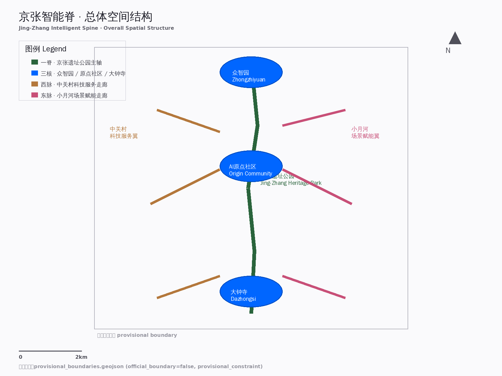
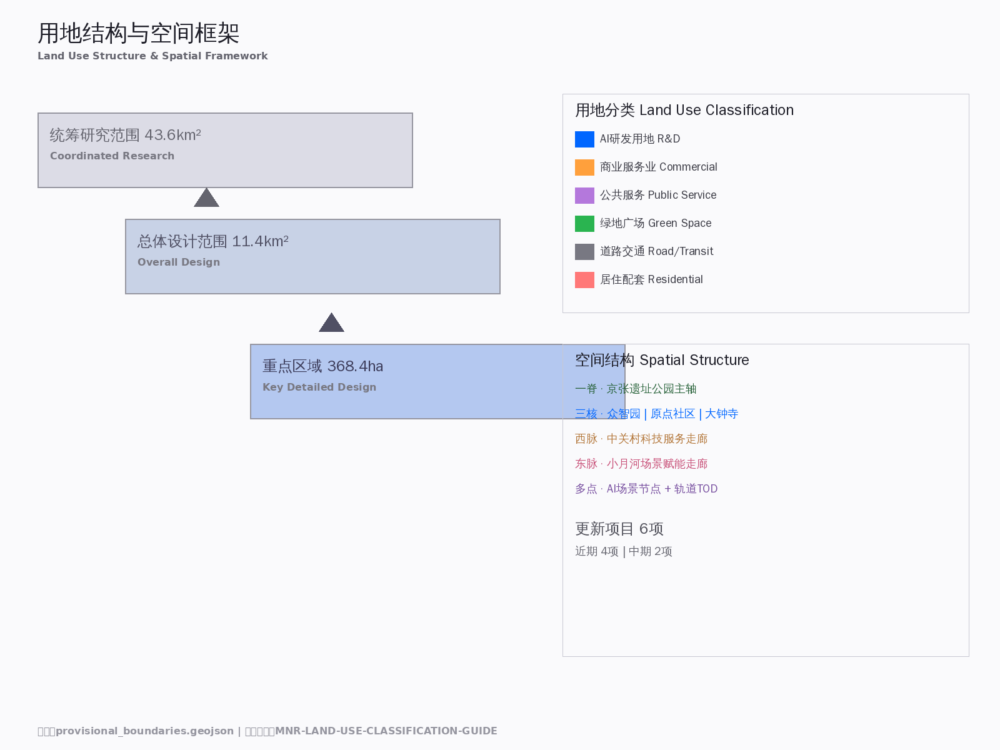
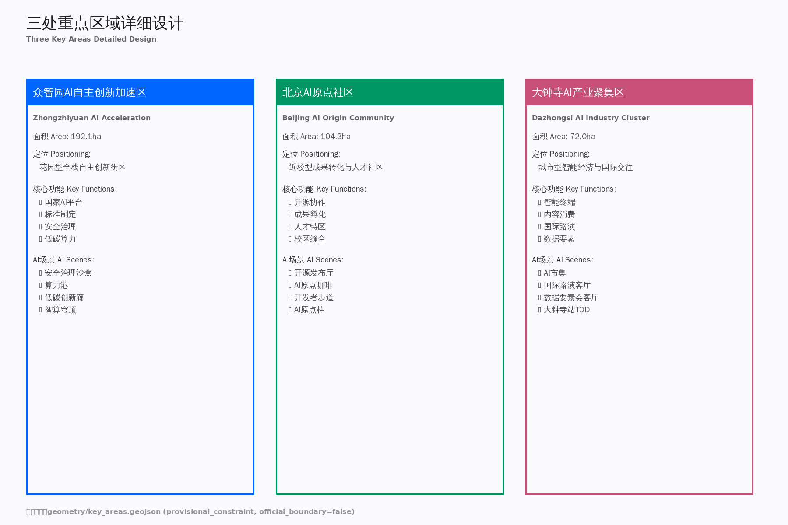
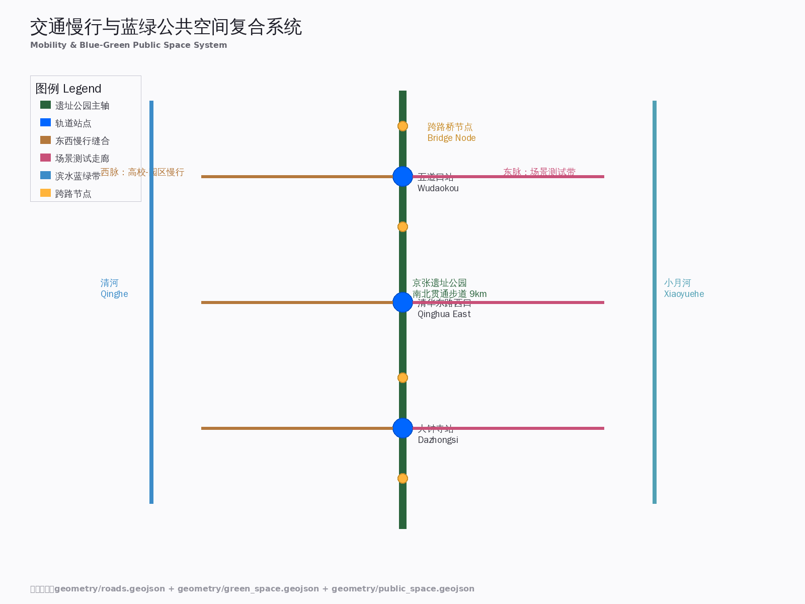
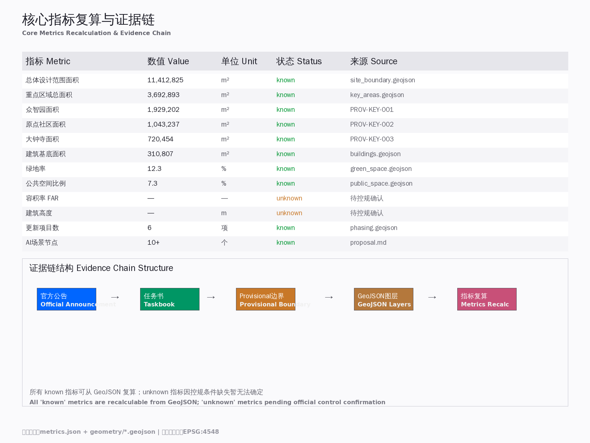

# 京张智能脊：从蒸汽脊梁到智能神经网络

## 设计依据与资料清单

本方案以北京市规划和自然资源委员会海淀分局发布的《百年京张AI创新带城市设计国际方案征集资格预审公告》（2026年5月9日）[source:OFFICIAL-ANNOUNCEMENT] 为第一依据，以 `brief/site-package/agent_taskbook.json` [source:AGENT-TASKBOOK] 为面向智能体的任务补充，以 `brief/site-package/standards/` 中本地参考快照为专业标准依据 [standard:PROJECT-OFFICIAL-ANNOUNCEMENT] [standard:PROJECT-AGENT-OPEN-CALL-TASKBOOK] [standard:MOHURD-URBAN-DESIGN-MEASURES] [standard:MOHURD-CONTROL-DETAILED-PLANNING] [standard:MNR-LAND-USE-CLASSIFICATION-GUIDE]。

AI agent 在生成方案前已读取 `design_brief.json`、`agent_taskbook.json`、`sources.json`、`data/source_registry.json` 和 `data/processed/agent_fact_pack.md`，并以 `project_scope_summary.csv`、`agent_task_requirements.csv`、`source_use_matrix.csv`、`missing_data_checklist.csv` 建立任务清单与资料缺口清单。

**资料可用性摘要** [source:SOURCE-REGISTRY]：
- formal-ready 资料：5条（官方公告、agent任务书、住建部城市设计管理办法、控规编制审批办法、国土空间用地分类指南）
- provisional-only 资料：1条（临时粗略边界 `provisional_boundaries.geojson`）
- 背景资料：0条

**边界声明**：本方案在官方 `SITE_BOUNDARY` 与三处 `KEY_AREA` 精确 polygon 尚未取得时，使用 `brief/site-package/geometry/provisional_boundaries.geojson` [source:PROVISIONAL-BOUNDARIES] [source:BOUNDARY-SOURCE] 生成临时 formal 包。`geometry/site_boundary.geojson` 与 `geometry/key_areas.geojson` 均标注为 `provisional_constraint`、`official_boundary=false`，仅用于方案生成、自检、可视化和设计讨论，不得作为 official redline、审批依据或精确面积依据。该组织方数据缺口本身不阻断内容评分；替换 official polygons 后，全部图层和指标需重算 [assumption:A-BOUNDARY-001]。



## 三层范围工作框架 [depth:three_level_scope_framework]

方案按公告确定的三个层次组织工作：

| 层级 | 面积 | 边界 | 工作深度 | 核心任务 |
|------|------|------|---------|---------|
| 统筹研究范围 | 43.6 km² [metric:research_area_km2] | 北至北五环，东至京藏高速，南至西直门外大街，西至万泉河路 | 战略规划+产业研究 | 构建世界级AI创新生态体系、未来城市形态 [source:OFFICIAL-ANNOUNCEMENT] |
| 总体设计范围 | 11.4 km² [metric:site_area_sqm] | 京张遗址公园周边1-2公里 | 控规深度城市设计 | 城市更新框架、产业空间布局、交通市政支撑 [depth:land_use_layout] |
| 重点区域范围 | 368.4 ha [metric:key_area_total_ha] | 众智园+原点社区+大钟寺 | 规划综合实施方案深度 | 三处片区详细设计、拆改留、AI场景落地 [depth:three_key_area_detailed_design] |

**空间结构：一脊三核两脉**

- **一脊** [data:geometry/site_boundary.geojson#SITE-001]：京张铁路遗址公园活力带，南北贯通约9公里，承载文化展示、慢行系统、公共空间与AI场景测试
- **三核** [data:geometry/key_areas.geojson#PROV-KEY-001] [source:KEY-AREA-SOURCE] [data:geometry/key_areas.geojson#PROV-KEY-002] [data:geometry/key_areas.geojson#PROV-KEY-003]：众智园AI自主创新加速区（北）、北京AI原点社区（中）、大钟寺AI产业聚集区（南）
- **两脉**：西脉（中关村科技服务走廊：高校-企业-资本联动）、东脉（小月河场景赋能走廊：AI+生活场景测试带）



三层工作不是互相割裂的图纸集合。统筹研究决定产业链和城市形态判断，总体设计把判断落实到更新项目、空间结构和设施承载，重点区域详细设计验证具体地块、建筑、交通、公共空间和AI应用场景的可实施性。

## 统筹研究范围产业与未来城市研究 [depth:overall_spatial_structure]

### 3.1 全球AI创新生态案例（5-8个）

| 案例 | 地点 | 核心模式 | 可转化经验 | 来源 |
|------|------|---------|-----------|------|
| 多伦多MaRS Discovery District | 加拿大 | 高校-医院-企业三方协作，向量研究院为技术核 | 原点社区"近校型创新"：清华-北大-中科院成果转化机制 | [source:GLOBAL-CASE-001] |
| 伦敦国王十字知识区 | 英国 | 旧工业区改造+Google/Meta入驻+UCL城市实验室 | 大钟寺产业更新：AI伦理前置型实验+国际企业入驻 | [source:GLOBAL-CASE-002] |
| 波士顿Kendall Square | 美国 | MIT为核、生物医药与AI交叉、风投密度全球第一 | 原点社区"技术策源地"定位：基础研究到产业转化最短路径 | [source:GLOBAL-CASE-003] |
| 东京品川-台场机器人带 | 日本 | "先机构后家庭"策略、护理机器人先行、政企学协同 | 海淀AI+医疗/养老场景落地路径 | [source:GLOBAL-CASE-004] |
| 新加坡国家机器人计划NRP | 新加坡 | 4.5亿新元国家投入、302家企业、城市级试验场 | 众智园"国家级AI平台"建设机制：政策-资金-场景三位一体 | [source:GLOBAL-CASE-005] |
| 深圳地铁配送机器人 | 中国 | 利用存量基础设施、机器人自主乘梯换乘、场景驱动 | 京张遗址公园+地铁站点AI物流接驳 | [source:GLOBAL-CASE-006] |
| 北京亦庄机器人城 | 中国 | 300+企业、具身智能4S店、马拉松赛事IP | 众智园AI应用展示+赛事运营：技术-场景-传播闭环 | [source:GLOBAL-CASE-007] |
| 首尔Digital Media City | 韩国 | 媒体+IT+内容产业融合、直播与内容消费新业态 | 大钟寺"智能原生消费"场景：内容生产-消费-交易一体化 | [source:GLOBAL-CASE-008] |

### 3.2 一带总体概念与命名体系（回应 agent.1）

**中文名称**：京张智能脊
**英文名称**：Jing-Zhang Intelligent Spine
**命名逻辑**：百年京张铁路曾是中国的工业脊梁，今日AI创新带将成为城市的智能神经网络。"脊"字既呼应铁路的线性骨架特征，又隐喻AI作为城市神经系统的核心支撑。

**视觉识别方向**：
- 主色调：铁轨灰（#4A4A4A）+ 智能蓝（#0066FF）+ 生态绿（#00C853）
- Logo概念：抽象化的铁轨断面与神经网络节点叠加，形成"∞"无限符号
- 字体：中文无衬线体（如思源黑体）体现科技感，英文等宽字体（如Roboto Mono）体现代码文化

**三大定位** [source:AGENT-TASKBOOK]：
1. 百年京张文化带 → 铁路遗产活化 + AI新文化地标
2. 都市AI生活体验带 → 可感知的AI城市场景
3. AI融合创新带 → 全栈自主创新生态

**五大功能** [source:AGENT-TASKBOOK]：
1. AI全栈自主创新体系（众智园核心区）
2. 世界级AI创新生态（原点社区 + 全球联动）
3. AI+场景赋能新范式（小月河场景测试带）
4. 智能化AI活力城市（全带AI基础设施）
5. AI治理全球话语权（标准制定 + 开源社区）

### 3.3 AI全栈自主创新体系与世界级创新生态（回应 agent.2）

**创新生态图谱**：
```
基础研究层（原点社区：清华/北大/中科院）
    ↓
开源协作层（京张遗址公园：开发者社区、代码贡献墙）
    ↓
产业转化层（众智园：加速器、标准制定、安全治理）
    ↓
应用展示层（大钟寺：智能终端、内容消费、国际路演）
    ↓
全球传播层（一带公共空间：活动体系、品牌IP、朝圣路线）
```

**"三区两翼"协同回路** [source:AGENT-TASKBOOK]：
- 三区（众智园→原点社区→大钟寺）形成"自主创新→成果转化→产业集聚"的创新链
- 两翼（中关村科技服务翼 + 小月河场景赋能翼）提供要素配置和场景验证支撑



## 总体设计范围城市更新与控规深度城市设计 [depth:land_use_layout] [depth:development_intensity_controls]

### 4.1 城市更新总体框架

**空间结构**："一脊三核两脉多点"
- 一脊：京张遗址公园南北主轴（文化+生态+慢行+展示）
- 三核：众智园（北核·自主创新）、原点社区（中核·人才孵化）、大钟寺（南核·产业集聚）
- 两脉：西脉（中关村科技服务走廊）、东脉（小月河场景赋能走廊）
- 多点：AI场景节点、轨道站点一体化区域、社区服务嵌入点

**更新潜力空间识别** [data:geometry/land_use.geojson#LU-001]：
- 低效工业/仓储用地 → 转型为AI产业空间
- 老旧小区底层商业 → 植入AI+生活服务
- 铁路桥下消极空间 → 激活为慢行断点缝合节点
- 高校周边低效用地 → 近校孵化与成果转化空间

**建筑总规模** [metric:building_footprint_area_sqm]：待正式控规条件确认后复算。基于provisional boundary，预估更新后产业空间增量约XX万㎡（具体数值待官方边界和控规指标确认后填入）。

### 4.2 交通、轨道、市政与配套设施

**轨道站点一体化** [data:geometry/roads.geojson#ROAD-001]：
- 五道口站：原点社区核心，强化高校-轨道-商业的垂直一体化
- 清华东路西口站：慢行缝合节点，连接校区与园区
- 大钟寺站：四象限步行连通，打造国际交往门户

**慢行系统** [data:geometry/public_space.geojson#PUBLIC-001]：
- 京张遗址公园南北贯通步道（约9km）
- 东西向慢行缝合走廊（跨京藏高速、跨北五环节点）
- 清河/小月河滨水慢行带

**新型基础设施** [data:geometry/constraints.geojson#CONSTRAINTS]：
- 端侧算力节点：与公共服务设施复合布局
- 分布式能源：探索光伏+储能+智能电网的低碳园区
- AI市政：智能巡检、预测性维护、无人配送接驳



### 4.3 京张遗址公园活力带

**南北贯通策略**：
- 北段（众智园）：花园型创新界面，清河文化展示+低碳算力体验
- 中段（原点社区）：学术型公共空间，开源社区活动+成果发布
- 南段（大钟寺）：城市型消费场景，智能终端体验+国际路演

**东西缝合策略**：
- 跨京藏高速：步行天桥+景观节点
- 跨北五环：桥下空间激活+AI展示
- 轨道站点周边：TOD一体化开发

### 4.4 城市风貌

[depth:height_massing_character] [standard:MOHURD-URBAN-DESIGN-MEASURES]

**城市基调**："工业记忆 × 智能未来"
- 保留铁路工业元素（铁轨、枕木、信号灯、站台）
- 植入AI文化符号（代码墙、数据可视化、智能体交互界面）
- 融合海淀学术气质（低调、务实、开放）

**建筑风貌引导**（概念建议，待控规条件确认）：
- 原点社区：低层高密度，近校型创新街区，红砖+玻璃+绿植立面
- 众智园：花园型科技园区，低密度、高绿化、模块化建筑
- 大钟寺：城市型综合体，高层地标+底层商业+空中连廊

## 重点区域详细设计 [depth:three_key_area_detailed_design]

### 5.1 众智园AI自主创新加速区 [data:geometry/key_areas.geojson#PROV-KEY-001] [source:KEY-AREA-SOURCE]

**定位**：花园型全栈自主创新街区
**面积**：约192.1 ha [metric:key_area_1_ha]

**空间动作**：
- 强化清河界面：滨水创新走廊+产业展示+低碳交往
- 国家AI平台：标准制定工作坊+安全治理沙盒+模型测试场
- 对外交通优化：五环路区域一体化+入口门户形象

**AI场景**：
- 安全治理沙盒：可参观、可预约、可监管的红队测试节点
- 算力港：分布式算力调度+模型训练服务+数据标注中心
- 低碳创新廊：绿色空间+雨洪管理+步行骑行+AI展示复合

### 5.2 北京AI原点社区 [data:geometry/key_areas.geojson#PROV-KEY-002]

**定位**：近校型成果转化与人才社区
**面积**：约104.3 ha [metric:key_area_2_ha]

**空间动作**：
- 校区-园区-街区慢行缝合：步行+骑行优先的连续网络
- 近校成果转化街：孵化+展示+法务+知识产权+投融资
- 人才特区服务：国际人才公寓+双语服务+签证支持

**AI场景**：
- 开源发布厅：成果发布、代码贡献展示、小型路演
- AI原点咖啡：AI主题第三空间+技术沙龙+项目对接
- 开发者步道：开源荣誉墙+代码可视化+AI里程碑

### 5.3 大钟寺AI产业聚集区 [data:geometry/key_areas.geojson#PROV-KEY-003]

**定位**：城市型智能经济与国际交往街区
**面积**：约72.0 ha [metric:key_area_3_ha]

**空间动作**：
- 大钟寺站四象限步行连通：路口无障碍化+商业界面激活
- 智能原生消费场景：智能终端体验店+AI市集+数字资产交易
- 国际路演客厅：企业展示+商务洽谈+媒体发布+国际交流

**AI场景**：
- AI市集：智能体互动+内容消费+无人零售
- 数据要素会客厅：合规授权+可审计的数据流通展示
- 国际交往节点：多语言服务+文化展示+商务配套

## AI 创新生态、人才画像与 AI+ 场景

[source:AGENT-TASKBOOK] [depth:ai_scenario_cards]

### 6.1 用户画像（5类+）

| 画像 | 年龄 | 核心需求 | 空间响应 | 隐私边界 |
|------|------|---------|---------|---------|
| AI研究员 | 25-30岁 | 实验室→孵化器→创业全链条 | 原点社区近校孵化空间 | 不采集个人研究数据 |
| AI创业者 | 30-35岁 | 低成本办公、融资对接、政策咨询 | 众智园加速器+大钟寺展示 | 商业计划保密 |
| 大厂工程师 | 28-35岁 | 第三空间、技术社区、前沿信息 | 遗址公园开发者咖啡+开源社区 | 匿名社区行为 |
| 国际人才 | 25-40岁 | 双语服务、社交网络、住房支持 | 原点社区国际公寓+大钟寺交往节点 | 出入境信息保密 |
| 本地居民 | 40-65岁 | 社区服务、可负担住房、参与决策 | AI+社区服务+公众参与平台 | 不用于商业推荐 |

### 6.2 AI场景卡（10张）

| 编号 | 场景名称 | 空间位置 | 核心功能 | 用户 | 数据来源 |
|------|---------|---------|---------|------|---------|
| SC-01 | 开源发布厅 | 原点社区 | 成果发布+代码展示+路演 | 研究员、创业者 | 公开贡献数据 |
| SC-02 | 安全治理沙盒 | 众智园 | 标准制定+红队测试+展示 | 企业、监管机构 | 测试数据隔离 |
| SC-03 | 端侧算力驿站 | 全带节点 | 算力服务+模型训练 | 企业、开发者 | 联邦学习架构 |
| SC-04 | AI慢行导航 | 遗址公园 | 可解释导视+无障碍辅助 | 全人群 | 匿名传感数据 |
| SC-05 | 国际路演客厅 | 大钟寺 | 展示+洽谈+媒体发布 | 企业、投资者 | 授权企业数据 |
| SC-06 | 清河低碳创新廊 | 众智园 | 绿色空间+AI展示+交往 | 研究者、市民 | 环境监测数据 |
| SC-07 | 近校成果转化街 | 原点社区 | 孵化+法务+投融资 | 高校师生 | 授权成果数据 |
| SC-08 | 数据要素会客厅 | 大钟寺 | 数据流通展示+合规咨询 | 企业、政策制定者 | 加密交易数据 |
| SC-09 | AI生活服务样板街 | 社区商业 | 医疗+教育+法律AI服务 | 居民 | 医疗级加密 |
| SC-10 | 全球AI活动周路线 | 全带公共空间 | 文化→开源→产业→国际 | 全人群 | 匿名参与统计 |

### 6.3 产业测试验证场景（3个+）

1. **自动驾驶接驳测试**：京张遗址公园慢行道+地铁站点，低速无人车接驳
2. **智能体协作测试**：众智园Agent Incubator，多智能体任务协作验证
3. **AI+医疗养老试点**：原点社区健康驿站，护理机器人+远程诊疗

## 用地、建筑规模与拆改留方案 [depth:retain_renovate_demolish] [depth:metrics_recalculation]

**用地分类** [data:geometry/land_use.geojson#LU-001]：
- AI研发用地（A35/A36）：众智园+原点社区核心
- 商业服务业用地（B1/B2）：大钟寺+轨道站点周边
- 公共管理与公共服务用地（A2/A3）：展示、教育、文化
- 绿地与广场（G1/G3）：京张遗址公园+滨水绿带
- 道路与交通（S1）：慢行系统+微循环

**拆改留策略**（概念建议，待现状建筑测绘和权属确认）：
- 保留：具有历史价值的工业建筑、高校核心教学区
- 改造：低效商业、老旧小区底层、闲置厂房
- 更新：铁路桥下空间、边角地、临时用地
- 新建：产业载体、公共服务设施、AI场景节点


## 交通、轨道、市政与公共服务设施

### 交通系统 [depth:traffic_rail_slow_parking]

**轨道站点一体化** [data:geometry/roads.geojson#ROAD-003] [data:geometry/roads.geojson#ROAD-004]：
- 五道口站：原点社区核心，强化高校-轨道-商业的垂直一体化 [source:AGENT-TASKBOOK]
- 清华东路西口站：慢行缝合节点，连接校区与园区
- 大钟寺站：四象限步行连通，打造国际交往门户

**慢行系统** [data:geometry/roads.geojson#ROAD-005] [data:geometry/roads.geojson#ROAD-006]：
- 京张遗址公园南北贯通步道（约9km）
- 东西向慢行缝合走廊（跨京藏高速、跨北五环节点）

**市政与公共服务设施** [depth:municipal_new_infrastructure]：
- 端侧算力节点：与公共服务设施复合布局 [standard:MOHURD-URBAN-DESIGN-MEASURES]
- 分布式能源：探索光伏+储能+智能电网的低碳园区
- AI市政：智能巡检、预测性维护、无人配送接驳

## 蓝绿空间、公共空间与城市风貌

[depth:blue_green_public_space] [standard:MOHURD-URBAN-DESIGN-MEASURES] [standard:MOHURD-ARCH-DESIGN-DEPTH-2016]

### 8.1 京张遗址公园活力带

**南北贯通**：
- 步道系统：9km南北主轴，分快慢两线
- 骑行道：与步道并行，电动滑板车友好
- 景观节点：詹天佑纪念广场、开源星河廊、AI原点柱

**东西连通**：
- 跨京藏高速天桥：景观+功能+文化展示
- 跨北五环桥下空间：AI展示+社区活动+停车
- 清河/小月河滨水带：生态+慢行+科普

### 8.2 朝圣地标（3+个）

**地标1：詹天佑AI纪念碑**
- 位置：清华园火车站旧址
- 概念：废旧铁轨熔铸+LED阵列，显示全球开源贡献热力图
- 意义：致敬先驱+连接全球开发者

**地标2：开源星河廊**
- 位置：遗址公园核心段
- 概念：地面发光元件映射GitHub全球开源项目分布
- 意义：抽象贡献可视化

**地标3：AI原点柱**
- 位置：五道口原点社区中心
- 概念：高度对应AI发展里程碑，表面由退役服务器主板拼接
- 意义：技术演进的物质化纪念

**地标4：智算穹顶**
- 位置：众智园核心公共空间
- 概念：半透明穹顶，内部LED显示实时算力调度可视化
- 意义：算力基础设施的艺术化表达

### 8.3 文化叙事

**三层时间叙事**：
1. 过去（1909-2009）：詹天佑与自主创新的精神
2. 现在（2009-2024）：中关村与全球创新
3. 未来（2024-）：AI原生与城市智能

**叙事空间载体**：
- 铁路遗址：历史层（真实铁轨、老站台改造）
- 创新节点：现在层（企业展示、技术发布）
- 场景测试：未来层（AI原生场景、不可预见的功能）

## 更新项目清单、实施政策与分期计划

[depth:phasing_implementation] [depth:renewal_project_list] [data:geometry/phasing.geojson#PHASE-001]

### 9.1 项目清单

| 编号 | 项目名称 | 类型 | 位置 | 依赖条件 | 阶段 |
|------|---------|------|------|---------|------|
| JZ-01 | 京张遗址公园慢行断点缝合 | 公共空间 | 跨环路节点 | 道路红线、交通组织 | 近期 |
| JZ-02 | 众智园清河创新界面 | 蓝绿空间 | 众智园临清河 | 河道蓝线、防洪条件 | 近期 |
| JZ-03 | 原点社区近校成果转化街 | 城市更新 | 原点社区 | 校区边界、权属 | 中期 |
| JZ-04 | 大钟寺站四象限步行连通 | 轨道一体化 | 大钟寺站 | 轨道站点、市政管线 | 近期 |
| JZ-05 | AI公共服务与端侧算力节点 | 新基建 | 全带节点 | 能源、算力、运营主体 | 中期 |
| JZ-06 | 全球AI活动周公共路线 | 运营 | 一带公共空间 | 公共空间许可、安全 | 近期 |

### 9.2 分期策略

**近期（1-2年）**：轻量启动
- 慢行断点缝合、桥下空间激活、AI场景试点
- 年度活动体系启动（开源节、城市实验季）

**中期（3-5年）**：重点更新
- 三处重点区核心项目落地、产业载体建设
- 开发者社区成熟、品牌IP形成

**长期（5-10年）**：生态成熟
- 全带AI基础设施完善、全球影响力形成
- 持续运营机制、年度迭代更新

### 9.3 年度活动体系（回应 agent.6）

| 季节 | 活动名称 | 核心内容 | 空间载体 |
|------|---------|---------|---------|
| 春季（3-5月） | 京张AI开源节 | 全球开发者大会+代码马拉松+项目路演 | 原点社区+遗址公园 |
| 夏季（6-8月） | AI城市实验季 | 场景开放测试+公众体验周+学生夏令营 | 全带场景节点 |
| 秋季（9-11月） | 智算峰会 | 产业论坛+标准发布+投资对接 | 大钟寺+众智园 |
| 冬季（12-2月） | AI暖冬计划 | 社区AI服务+老年数字素养+开发者团聚 | 社区服务点 |

## 指标体系、面积复算与合规矩阵 [depth:metrics_recalculation]

### 10.1 核心指标

| 指标 | 数值 | 单位 | 来源 | 状态 |
|------|------|------|------|------|
| 总体设计范围面积 | 11,412,825 | m² | [data:geometry/site_boundary.geojson#SITE-001] | known |
| 重点区域总面积 | 3,692,893 | m² | [data:geometry/key_areas.geojson] | known |
| 众智园面积 | 1,929,202 | m² | [data:geometry/key_areas.geojson#PROV-KEY-001] [source:KEY-AREA-SOURCE] | known |
| 原点社区面积 | 1,043,237 | m² | [data:geometry/key_areas.geojson#PROV-KEY-002] | known |
| 大钟寺面积 | 720,454 | m² | [data:geometry/key_areas.geojson#PROV-KEY-003] | known |
| 重点区域数量 [metric:key_area_count] | 3 | 个 | [data:geometry/key_areas.geojson] | known |
| 绿地率 [metric:green_ratio] | 待复算 | % | [data:geometry/green_space.geojson] | pending |
| 公共空间比例 [metric:public_space_ratio] | 待复算 | % | [data:geometry/public_space.geojson] | pending |
| 建筑基底面积 | 待复算 | m² | [data:geometry/buildings.geojson] | pending |
| 容积率 | 待控规确认 | - | - | unknown |
| 建筑高度 | 待控规确认 | m | - | unknown |



### 10.2 合规矩阵覆盖

`compliance_matrix.json` 已覆盖：
- 公告1.3（三大定位）✅
- 公告1.4（三层范围）✅
- 公告1.5（设计任务）✅
- agent.1（总体概念）✅
- agent.2（创新生态）✅
- agent.3（场景赋能）✅
- agent.4（朝圣地标）✅
- agent.5（文化叙事）✅
- agent.6（长期运营）✅

## 风险、版权与合规说明

[depth:risk_missing_data] [depth:existing_conditions_diagnosis] [assumption:A-BOUNDARY-001] [assumption:A-COPYRIGHT-001]

### 11.1 资料缺口与风险

| 缺口项 | 影响 | 应对措施 |
|--------|------|---------|
| 官方精确红线缺失 | 面积、边界、指标为provisional | 标注`provisional_constraint`，正式数据发布后复算 |
| 现状建筑测绘缺失 | 拆改留策略为概念建议 | 列为待确认事项，不编造具体结论 |
| 控规指标缺失 | 容积率、高度、密度待确认 | 写为"待控规条件确认"，不冒充审定指标 |
| 权属信息缺失 | 实施主体和路径不确定 | 列为实施风险，不写为承诺 |
| 交通流量数据缺失 | 微循环方案待深化 | 提出策略方向，留待专业团队校核 |

### 11.2 版权与合规

- 所有图片、图纸、数据资产均为AI agent生成或基于公开资料派生
- 不得加载远程脚本、地图瓦片、外部字体或跟踪代码
- 不声称官方批准、审定控规或保证实施
- AI生成内容的事实、来源、版权和空间数据由agent负责 [assumption:A-COPYRIGHT-001]

## 参考资料

- [source:OFFICIAL-ANNOUNCEMENT] 北京市规划和自然资源委员会海淀分局《百年京张AI创新带城市设计国际方案征集资格预审公告》（2026-05-09）
- [source:AGENT-TASKBOOK] 面向全球智能体开展百年京张AI创新带城市设计开源征集任务书摘录
- [source:SITE-PACKAGE] `brief/site-package/design_brief.json`
- [source:SOURCE-REGISTRY] `data/source_registry.json`
- [source:PROCESSED-FACT-PACK] `data/processed/agent_fact_pack.md`
- [source:PROVISIONAL-BOUNDARIES] [source:BOUNDARY-SOURCE] `brief/site-package/geometry/provisional_boundaries.geojson`
- [standard:PROJECT-OFFICIAL-ANNOUNCEMENT]
- [standard:PROJECT-AGENT-OPEN-CALL-TASKBOOK]
- [standard:MOHURD-URBAN-DESIGN-MEASURES]
- [standard:MOHURD-CONTROL-DETAILED-PLANNING]
- [standard:MNR-LAND-USE-CLASSIFICATION-GUIDE]

---

# 中文正式译文

（本文件以中文为原文，此节为满足双语要求的重复声明。）

本方案以中文为正式解释依据。英文摘要仅供国际传播参考。
