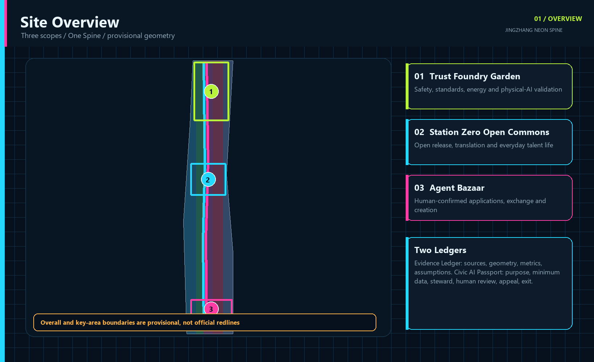
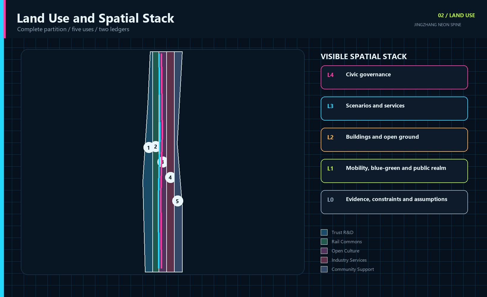
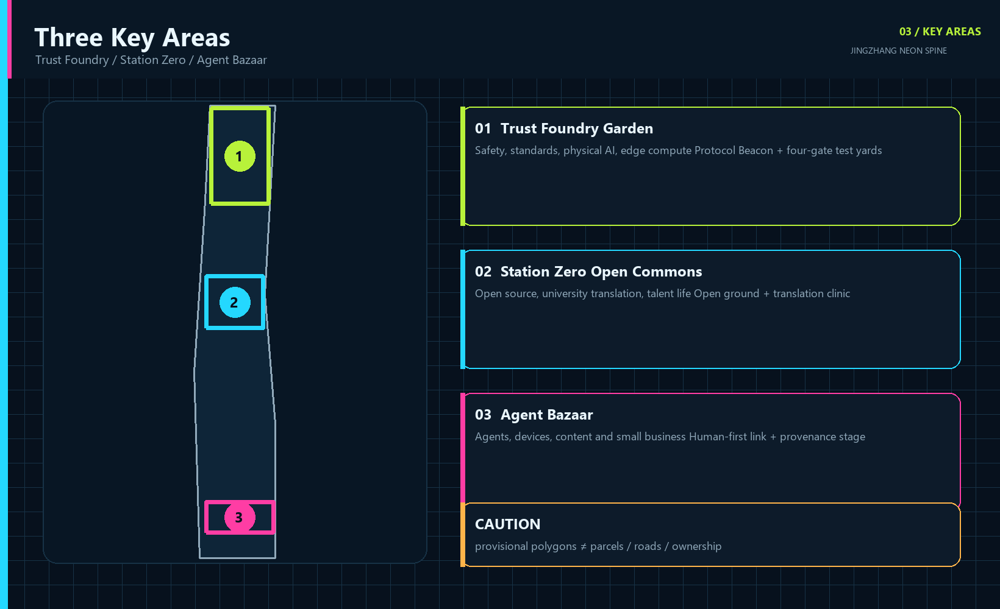
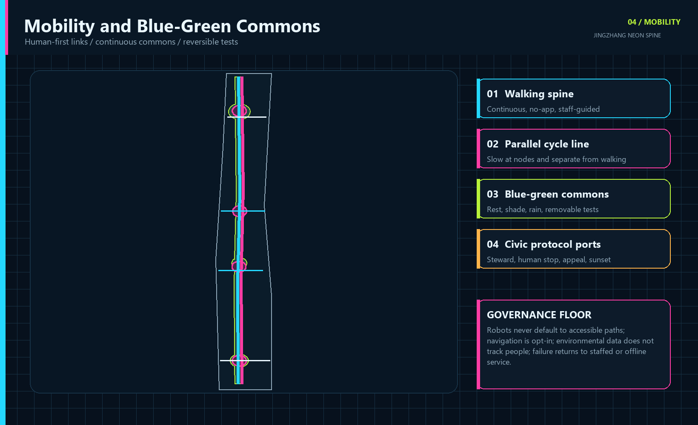
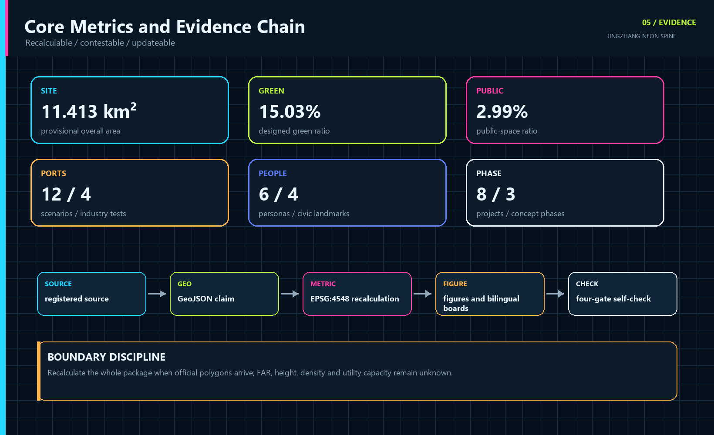

# JINGZHANG NEON SPINE

> Visible, contestable and reversible. Trust is forged in the north, open innovation grows at the origin, and applications meet everyday life in the south.

## Design Basis and Source List

This proposal takes the official open-call notice, the agent taskbook and the repository site package as its task basis. The official text defines coordinated research, overall design and three key-area requirements, while the public package does not include official site or key-area polygons, regulatory controls, road redlines, ownership, utilities, heritage constraints or a verified building survey. The package therefore preserves the repository provisional geometry with medium confidence, official_boundary=false and provisional_constraint. Its current EPSG:4548 area is about 11.413 square kilometres and supports reproducible design comparison only, never a statutory redline, approval or cadastral claim.[source:OFFICIAL-ANNOUNCEMENT]

The evidence chain has five layers: the registry limits source use; GeoJSON stores spatial claims; metrics.json recalculates quantities; assumptions.json exposes gaps; and self_check.json records the four review gates. When official polygons arrive, the whole chain, including land use, mobility, blue-green space, buildings, phasing, metrics and graphics, must be regenerated rather than merely replacing one area value.[source:SOURCE-REGISTRY] [data:geometry/site_boundary.geojson#SITE-001]

The seven international references contribute mechanisms only, never copied form, authority or numeric targets. The generated cover image is explicitly non-evidentiary; all five core figures are rendered locally from package GeoJSON and metrics. Full publisher, retrieval date, use and limitation records are in sources.json, with tool and rights details in report/copyright_statement.md.[source:IMGGEN-HERO]

## Three-Level Scope Framework

The framework is One Spine, Three Engines, Two Wings, Twelve Ports and Two Ledgers. The Century Rail Commons is the shared north-south structure for heritage, walking, cycling, blue-green space and public AI experience. The three engines are the Trust Foundry Garden at Zhongzhiyuan, Station Zero Open Commons at the Beijing AI Origin Community, and the Agent Bazaar at Dazhongsi. The Zhongguancun service wing and Xiaoyuehe urban test wing extend the system. Twelve ports are legible, bounded and reversible entries for pilots, not a blanket sensor field.[depth:three_level_scope_framework]

The coordinated research layer discusses the approximate 43.6 square-kilometre ecosystem stated in the notice without inventing a polygon. The overall layer uses the repository's approximate 11.4 square-kilometre provisional boundary for a renewal framework. The detailed layer uses three provisional key-area polygons. Two ledgers connect them: the Evidence Ledger records sources, geometry, metrics and assumptions; the Civic AI Passport publishes purpose, minimum data, steward, human checkpoint, appeal, non-digital alternative and sunset rule for every scenario.[source:AGENT-TASKBOOK]

Neon means public legibility, not advertising light. Cyan codes open connections and sources, magenta marks decisions requiring public confirmation, acid green indicates verified blue-green or safety states, and amber marks unresolved items. Text and symbols always accompany color. Any physical lighting still requires glare, timing, energy, ecology and heritage review.[assumption:A-LIGHT-001]

## Coordinated Research Area: Industry and Future City Research

The ecosystem follows five steps: research and open release; validation and translation; urban adoption; civic review; and international exchange. Universities contribute reproducible work and model cards. Zhongzhiyuan hosts safety, compute and physical-AI validation. Station Zero joins open-source collaboration, venture support and everyday talent services. Dazhongsi lets agents, devices and creative services face real public choice. An independent review seat crosses every step. The bilingual identity is 百年京张·霓光脊 / JINGZHANG NEON SPINE. Its mark places an interruptible signal between two rail brackets, expressing connection, human shutdown and renegotiation.[standard:PROJECT-AGENT-OPEN-CALL-TASKBOOK]

| Case | Transferable mechanism | Jing-Zhang translation | Evidence |
| --- | --- | --- | --- |
| Punggol Digital District | Education, industry and community co-location with an open digital platform | Shared but tiered test ports: simulate, contain, then pilot in public | [source:CASE-PUNGGOL] |
| Helsinki Smart City | Agile pilots, resident co-creation and evaluation in real settings | Each pilot gets a baseline, stop rule and public review | [source:CASE-HELSINKI] |
| London King's Cross | Rail-industrial heritage, a university anchor and public realm renewal | Treat Jing-Zhang heritage as social infrastructure for learning and exchange | [source:CASE-KINGS-CROSS] |
| Paris STATION F | Many startup programs and shared support within adapted heritage | Use a multi-program commons to reduce friction for teams | [source:CASE-STATION-F] |
| Montreal Mila | Open science, talent, transfer and responsible AI | Join research, governance and translation in the Trust Foundry | [source:CASE-MILA] |
| Toronto Waterfront digital review | Independent review, privacy and democratic accountability | Keep a civic review seat and public test registry independent of vendors | [source:CASE-WATERFRONT] |
| Amsterdam Marineterrein | Publicly accessible, professionally managed outdoor living lab | Run bounded land-and-water tests with time, season and removal rules | [source:CASE-MARINETERREIN] |

Together the cases show that an innovation district needs research and enterprise density, but also testing methods, public space, adaptive heritage and independent digital governance. The proposal draws particular value from agile stop rules, Waterfront Toronto's independent review and Marineterrein's bounded real-world testing. It imports no job, investment, building or visitor target. With current data gaps, the industry strategy defines relationships and services without promising output, employment or talent density.[source:CASE-WATERFRONT]

The future-city test is whether intelligence can be used and contested in daily life. A public AI service enters a protocol port only when its steward, human checkpoint, appeal, exit and relevant non-digital route are visible. An annual Visible AI Week, quarterly Night Shift Open Test, monthly Civic Patch Day and a permanent public registry turn the concept into continued stewardship rather than a one-off showcase.[metric:ai_scenario_count]

## Overall Design Area: Urban Renewal and Regulatory-Plan-Level Urban Design

The overall design prioritises retention, adaptation and reversible change. Five land-use bands create a complete partition across the current provisional boundary: trustworthy research, the rail park, open-source culture, industry services and community support. Their topology has no gaps or overlaps. Codes come from the site package land-use subset, yet the polygons remain conceptual urban-design structure, not a statutory land-use amendment. Paired north-south active-mobility lines and four east-west links connect the three key areas.[data:geometry/land_use.geojson#LU-001]

Twelve building footprints test program, street interface and project organisation. retain_and_adapt favours continued use with new services, renovate marks change subject to survey, and new_concept only identifies a spatial prototype. FAR, height, density, setbacks and total floor area remain unknown because the package lacks verified buildings, ownership, fire, heritage and regulatory controls. Completion is never simulated with invented volume.[metric:building_footprint_area_sqm]

Four test gates form the spatial operating system. Simulation checks the problem and data. Contained testing checks safety and fallback. Public testing checks accessibility, complaints and human takeover. Scaling follows published evaluation or the pilot sunsets. The related spaces are demountable yards, open ground floors, shared workshops, civic review seats and staffed service desks, not permanent high-tech installations.[data:geometry/constraints.geojson#CONSTRAINTS]

Eight renewal projects intersect three concept phases. Near-term work establishes governance, evidence and removable prototypes. Mid-term work joins public space and district services. Long-term work scales only evaluated scenarios. The first product of renewal is therefore a common rule that can refuse unsuitable technology access to public space, not a quantity of new floor area.[depth:overall_spatial_structure]

## Detailed Design of Key Areas

The three key areas perform different innovation roles. Zhongzhiyuan becomes the Trust Foundry Garden for full-stack autonomy, model assurance, standards, physical AI and edge-compute validation. Research courts, controlled test yards, the Protocol Beacon and a green interface create a gradient from contained assurance to public display. The Beijing AI Origin Community becomes Station Zero Open Commons for university translation, open source, talent life and low-disruption renewal. Open ground floors, workshops, release rooms and active links stitch campus, workplace and neighbourhood. Dazhongsi becomes the Agent Bazaar, where agents, devices, content, creators and small businesses meet real choice through a human-first station link, adaptable market, provenance stage and confirmation points.[data:geometry/key_areas.geojson#PROV-KEY-001]

All three use the Civic AI Passport, but they test different things. The Trust Foundry tests safety, takeover, energy and standards. Station Zero tests reproducibility, licensing, talent services and neighbourhood impact. The Agent Bazaar tests consumer choice, payment confirmation, copyright, appeal and small-business access. Each district keeps at least one no-app entry and one staffed stop point.[depth:three_key_area_detailed_design]

The current rectangles come only from the repository provisional source and do not represent parcels, roads or ownership. Landmarks, building carriers, connectors and programs are conceptual recommendations. Exact location, retain-renovate-demolish decisions, intensity, rail integration, heritage relationship and delivery bodies require official polygons, surveys, ownership and professional controls.[assumption:A-BOUNDARY-001]

## AI Innovation Ecosystem, Personas, and AI+ Scenarios

The six personas are admission tests, not marketing segments. Every scenario must explain who benefits, who might be excluded, what minimum data is enough, who can stop the system, and how a failed digital service falls back to a human route. Operators, maintainers and independent reviewers are separate governance roles. Accessibility testing includes wheelchair and low-vision commuters; digital inclusion testing includes non-smartphone residents; transaction and copyright tests include small merchants and independent creators.[metric:persona_count]

| Persona | Core need | Spatial and service response |
| --- | --- | --- |
| Open-source researcher | Reproducibility, release and cross-disciplinary work | Open workshops, model cards and contribution ledger |
| AI founder and industry engineer | A low-cost, compliant route to real testing | Four test gates and professional review |
| Local elder or non-smartphone resident | Human and paper services remain available | No-app equivalent and staffed desk |
| Wheelchair or low-vision commuter | Accessibility as an admission criterion | Co-navigation, tactile wayfinding and barrier review |
| Small merchant or independent creator | Controllable assistants, clear rights and accessible display | Agent Bazaar and provenance stage |
| International young developer or visitor | Bilingual navigation, short-term entry and visible contribution | Station Zero, open test week and contribution ledger |

T1-T4 are industry test and validation scenarios. S5-S12 cover city services, culture and public life. Every card uses the same fields: public problem, users, place, AI role, minimum data, human review or non-digital route, evaluation and sunset rule.[source:AGENT-TASKBOOK]

| ID | Scenario | Place | Critical validation boundary |
| --- | --- | --- | --- |
| T1 | Multi-Operator Robot Street | Trust Foundry / Xiaoyuehe wing | No default face recognition; physical stop, safety marshal, yield and takeover tests |
| T2 | Public Model Assurance Yard | Trust Foundry | Public, cleared or synthetic data only; publish red-team status; humans make high-risk decisions |
| T3 | Edge Compute Energy Sandbox | Trust Foundry | Device and energy data only; electrical review; measure energy, latency and stability |
| T4 | Multi-Agent Urban Simulation Lab | Station Zero | Synthetic or public data first; record dissent and human choice; model output is not a planning decision |
| S5 | Open-Source Translation Clinic | Station Zero | Human licence and IP review; reusable code, model cards and pilot advice |
| S6 | Accessible Co-Navigation | Rail nodes / heritage park | Opt-in and minimum retention; tactile, paper and staffed alternatives |
| S7 | Century Memory Companion | Jing-Zhang heritage park | Cleared archives only; label generated content, cite items and use expert review |
| S8 | Xiaoyuehe Climate-Comfort Route | Xiaoyuehe wing | Non-personal environmental data; shade and rest advice without tracking people |
| S9 | Civic Service Copilot | Community service nodes | Link official sources; keep paper and staffed routes; never replace administrative decisions |
| S10 | Dazhongsi Agent Bazaar | Dazhongsi | Merchants control permissions; humans confirm payments, contracts and publication |
| S11 | Creator Provenance Stage | Dazhongsi | Show licence, author, AI method and editorial responsibility; appeal and takedown path |
| S12 | Night Signal Commons | Neon Spine public realm | Low glare, timed operation, non-identifying counts and human patrol first |

The four tests publish method, incident log, repair status and stop condition before any discussion of scale. Technical performance answers whether a system works, while public evaluation also covers accessibility, complaint, takeover, exclusion, energy and maintenance cost. The operator maintains each Passport, an independent seat reviews high-risk changes, and the on-site steward can stop operation immediately. Authorised humans retain all high-risk administrative, medical, legal, payment and contract decisions.[assumption:A-AI-001]

## Land Use, Building Scale, and Retain-Renovate-Demolish Strategy

The five land-use codes are 0802 research, 1401 park green, 0803 culture, 05 commercial services and 0702 community service facilities. They form a west-to-east gradient from research through civic commons and open culture to industry and daily support. Polygons cover the submitted boundary without overlap and declare EPSG:4548 area by feature. They remain conceptual design zones pending comparison with official land-use plans and ownership.[standard:MNR-LAND-USE-CLASSIFICATION-GUIDE]

Building strategy classifies before it quantifies. Retain-and-adapt carriers host incubation, talent and enterprise services; renovation carriers support open ground floors, test workshops, culture and market functions; a new-concept carrier only signals the safety and energy envelope for an edge-compute sandbox. The submitted footprint total is about 16.59 hectares, but it is neither an existing-building survey nor approved development. FAR and height remain unknown, and no demolition decision is made.[data:geometry/buildings.geojson#BLDG-001]

The review sequence is survey and structural safety; ownership and leases; heritage value; fire and accessibility; operational need; and life-cycle carbon. Only then can a professional team choose retention, repair, adaptation or new work. All carriers allow small, reversible and shared use first. If professional evidence conflicts with a plotted position, the function moves rather than forcing the map.[depth:retain_renovate_demolish]

Urban character combines reused masonry, dark metal, transparent workshop fronts and replaceable status strips, but physical neon is not a mandatory material. Roof, mass and night lighting follow low glare, maintainability, timing and low neighbourhood disturbance. Material, structure, load, energy and height controls require later professional design.[assumption:A-BUILDING-001]

## Transport, Rail, Municipal Infrastructure, and Public Services

The mobility structure combines two continuous north-south lines with four east-west spurs. A walking spine links the key areas through the Century Rail Commons. A parallel cycle line slows at civic nodes. Cross-links serve Dazhongsi, Station Zero's open ground floors, the Trust Foundry test yards and the Xiaoyuehe climate-comfort route. The current design centreline totals about 23.12 kilometres and expresses connectivity only; redlines, junctions, station interfaces, parking and fire access require official transport evidence.[data:geometry/roads.geojson#ROAD-001]

Rail integration is human-first. Robots and automated delivery operate only in clearly marked test ports and never take the accessible path by default. Dazhongsi's four-quadrant connection first repairs walking continuity and staffed guidance, then adds optional navigation. Accessible co-navigation is opt-in with tactile, paper and human alternatives, so a phone or visual recognition is never the only route.[depth:traffic_rail_slow_parking]

New infrastructure is small, distributed and isolatable. The edge-compute sandbox handles explicitly authorised test data; the energy cell records device-level energy rather than personal behaviour; failure falls back to staff or offline service. Power, communications, drainage, flood, fire, waste, cooling and compute capacities are absent from official engineering data, so the proposal defines node types and governance thresholds without invented pipes, capacities or catchments.[depth:municipal_new_infrastructure]

## Blue-Green Network, Public Space, and Urban Character

The Century Rail Commons combines linear heritage, rain-ready landscape, active mobility, open testing and everyday rest as a public structure. Designed green space occupies about 15.03% of the provisional boundary and public space about 2.99%. Independent layers recalculate both; functions may overlap while metrics remain separate. Green space is not technology scenery: it protects free seating, shade, exercise and quiet periods, while tests use booking, zoning and removal rules.[metric:green_ratio]

Four civic AI landmarks are public mechanisms rather than assumed towers. The Protocol Beacon at Zhongzhiyuan displays test status, stewards, incidents and repairs. Station Zero hosts open releases, translation and Jing-Zhang archives. The Agent Bazaar Arcade in Dazhongsi provides human-confirmed experience and exchange. The distributed Century Contribution Ledger records authorised contributions from engineers, researchers, maintainers and residents. Exact position, heritage relationship, names and images remain subject to review.[metric:landmark_count]

Urban character translates railway signals, program status and public ledgers into wayfinding. Cyan means open connection, magenta means confirmation required, acid green means verified, and amber means unresolved. Text, numbers and shapes accompany color. Night Signal Commons uses low glare, timed operation and non-identifying counts with human patrol first, avoiding a surveillance aesthetic of safety.[standard:MOHURD-URBAN-DESIGN-MEASURES]

The cultural narrative expands railway engineering beyond the lone hero to visible collective maintenance: publish the problem, test a solution, record failure and repair the system. Annual programs follow seven steps: see, try, question, contribute, pilot, maintain and share outward. Visitor experience and resident benefit therefore use the same public logic.[data:geometry/public_space.geojson#PUBLIC-001]

## Renewal Projects, Implementation Policy, and Phasing

Implementation establishes rules and responsibility before permanent construction. Eight projects cover active mobility, governance, industry validation, open-source adaptive reuse, blue-green space, rail integration, agent-economy services and cultural stewardship. Each states a professional dependency and none is presented as an approved project without ownership, funding, consent or a delivery body.[metric:renewal_project_count]

| ID | Project | Type | Phase | Dependency |
| --- | --- | --- | --- | --- |
| JZ-01 | Century Rail Commons gap repair | Public realm / active mobility | Phase 1 | Verify road redlines and underpass conditions |
| JZ-02 | Protocol Beacon and public test registry | Governance / display | Phase 1 | Steward, safety and civic review mechanism |
| JZ-03 | Trust Foundry four-gate yards | Industry validation | Phase 1 | Professional safety, energy and data review |
| JZ-04 | Station Zero open-ground network | Adaptive reuse / open source | Phase 2 | Ownership, heritage and fire review |
| JZ-05 | Xiaoyuehe climate-comfort spur | Blue-green / active mobility | Phase 2 | River, flood and ecology conditions |
| JZ-06 | Dazhongsi four-quadrant human-first link | Rail integration | Phase 2 | Station, road and utility conditions |
| JZ-07 | Agent Bazaar and provenance stage | Industry / culture | Phase 3 | Operation, copyright and accessibility |
| JZ-08 | Century Contribution Ledger and Visible AI Week | Culture / stewardship | Phase 3 | Name consent, event permits and maintenance funding |

Phase 1, Verify and Light Up, suggests 0-12 months for the evidence baseline, Civic AI Charter, two ledgers, independent review and four removable tests. Phase 2, Connect and Convert, suggests 1-3 years to join active/public-space networks and adapt ground-floor services, subject to professional verification and approval. Phase 3, Scale and Steward, suggests 3-5 years to scale only publicly evaluated scenarios and deepen four civic landmarks. These are a concept sequence, not a government schedule or construction commitment.[data:geometry/phasing.geojson#PHASE-001]

Policy tools include an open scenario register, pilot sunset clauses, equivalent non-digital service, published complaint and incident handling, open interfaces and portable formats, lightweight space access, cross-institution test permission and maintenance budget first. The operating calendar combines annual Visible AI Week, quarterly Night Shift Open Test, monthly Civic Patch Day and a permanent register. Each event records steward, entry, incident, repair and continuation decision.[depth:phasing_implementation]

## Metrics, Area Recalculation, and Compliance Matrix

Metrics fall into three groups. Geometry-derived values include site_area_sqm, building_footprint_area_sqm, green_ratio, public_space_ratio and road_network_length_m. Content counts include 12 scenarios, 4 industry tests, 6 personas, 4 landmarks, 8 projects and 3 phases. FAR, height, density, setbacks, utility capacity, employment and output stay unknown because authoritative data is absent.[depth:metrics_recalculation]

Current EPSG:4548 results are 11.413 square kilometres of submitted overall boundary, 16.59 hectares of concept footprints, 15.03% designed green ratio, 2.99% public-space ratio and 23.12 kilometres of design centreline. metrics.json stores value, formula, source files, confidence and assumptions. Official polygons require a full package recalculation.[metric:site_area_sqm]

The compliance matrix covers official tasks 1.3, 1.4 and 1.5 plus agent.1-agent.6. The standard matrix separates mandatory, guidance and project-specific evidence. The depth matrix connects existing conditions, structure, land use, buildings, transport, infrastructure, landscape, key areas, projects, phasing, metrics and risk. Four gates test deterministic local validation, spatial review, visual packaging and professional evidence. Any later file edit requires refreshed manifest hashes and another run.[standard:PROJECT-OFFICIAL-ANNOUNCEMENT]

## Risk, Copyright, and Compliance

The first risk is converting intelligence into default surveillance. Controls prohibit default biometrics and require minimum data, edge processing where suitable, a visible steward, human stop, appeal and sunset. The second risk is technical permanence, controlled through four gates and no renewal without evaluation. The third is digital exclusion, controlled by no-app, paper, staffed and accessible equivalents. The fourth is vendor lock-in, controlled through open interfaces, portable formats and no required vendor.[assumption:A-AI-001]

Spatial risks include provisional boundaries, absent controls and surveys, missing road and utility evidence, and heritage or lighting conflict. All geometry is a conceptual recommendation. FAR, height, density, retain-renovate-demolish, road redlines, capacity and precise landmark location are not approved conclusions. If official evidence conflicts with this package, official evidence and professional review prevail, followed by regenerated metrics and graphics.[data:geometry/constraints.geojson#CONSTRAINTS]

Five core figures are locally generated from package GeoJSON and JSON with Pillow. Four PDFs use ReportLab. HTML loads no remote scripts, tiles, fonts, iframe, form or API and collects no reviewer data. The cyberpunk cover was made with OpenAI built-in image generation without external reference images, is marked illustrative only, and supplies no boundary, area or spatial evidence. Fonts are used for local rendering only and are not redistributed as font files.[source:IMGGEN-HERO]

The package provides complete aligned Chinese and English Markdown, report HTML, visual HTML, A3 booklet, A0 boards and five text-bearing figures. It does not claim official approval, a confirmed delivery body, funding, final ownership, statutory controls or guaranteed construction. Every public AI scenario remains subject to legal, ethical, safety, accessibility, professional and civic review.[source:SITE-PACKAGE]

## References

Primary task inputs are the Beijing Haidian open-call notice, the repository site package, agent taskbook, standards index, source registry and provisional boundary. The notice supplies task and textual scope. The site package supplies enums, working limits and validation rules. Provisional geometry supplies only a reproducible design draft. Anything marked background_only or provisional_only in the registry is not promoted into official control.[source:OFFICIAL-ANNOUNCEMENT]

Global mechanism references are JTC Punggol Digital District, Forum Virium Helsinki, King's Cross, STATION F, Mila, Waterfront Toronto's Digital Strategy Advisory Panel and Marineterrein Living Lab. sources.json records each publisher, URL, retrieval date, use and limitation. The proposal borrows co-location, agile pilots, heritage adaptation, open science, independent review and bounded real-world testing, but copies no geometry, numeric target or administrative authority.[source:CASE-PUNGGOL]

The complete machine-readable index is in sources.json, metrics.json, assumptions.json, compliance_matrix.json, standard_matrix.json, design_depth_matrix.json and self_check.json. Spatial claims are in geometry, the five evidence figures in assets/figures, A3/A0 outputs in drawings, and the offline review entry in visual/index.html. Tool and rights disclosure is in report/copyright_statement.md.[source:SOURCE-REGISTRY]
