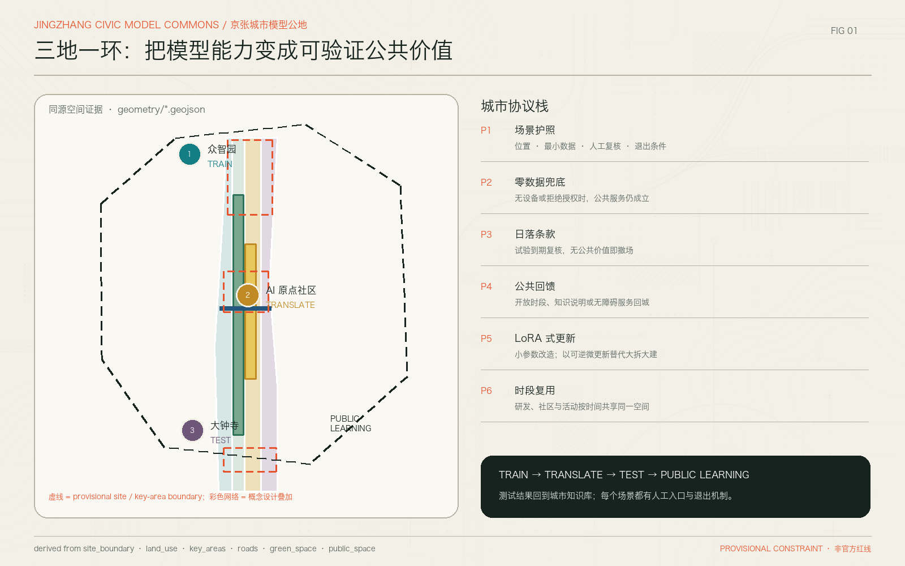
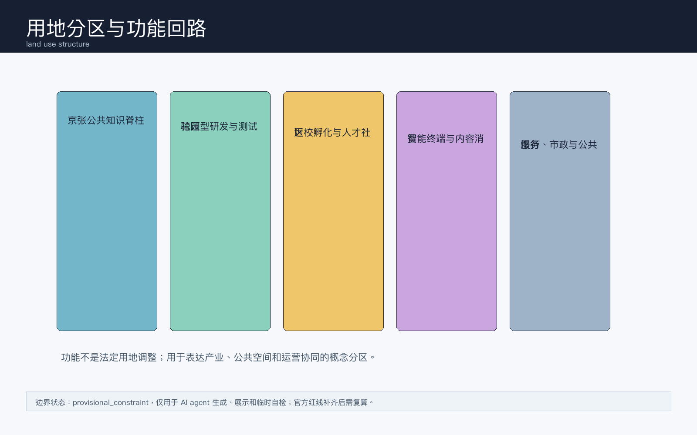
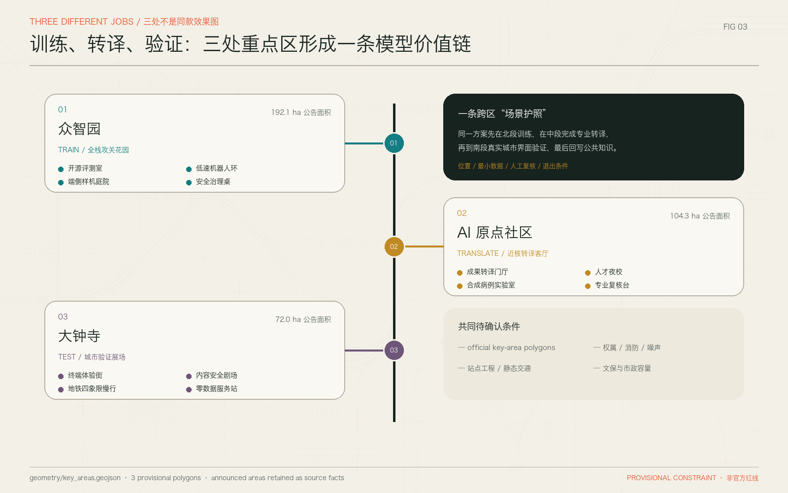
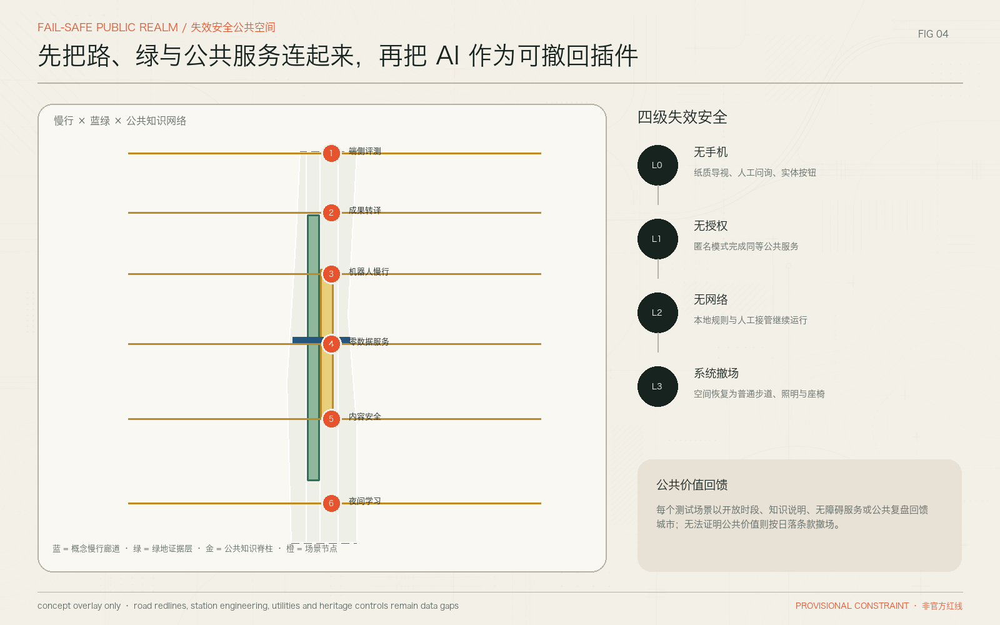
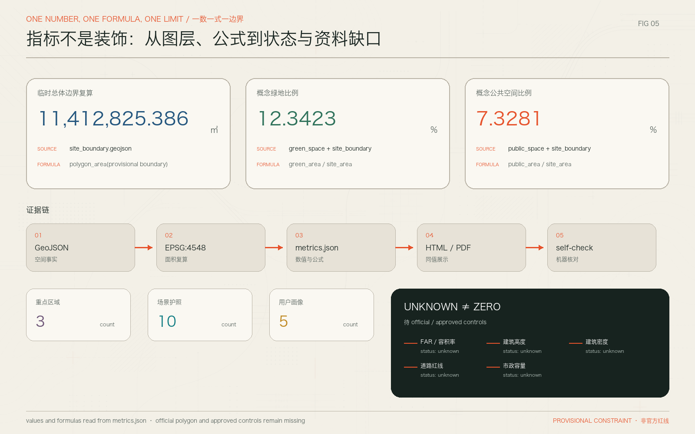

# 京张智环：百年轨道上的AI共创城市带

## 设计依据与资料清单

本方案面向仓库中的独立社区公开征集入口编制，依据官方公告中关于百年京张 AI 创新带的项目名称、三层范围、设计目的和任务要求展开，并读取面向智能体任务书、资料登记表、事实包、标准矩阵和临时边界数据。[source:OFFICIAL-ANNOUNCEMENT] [source:AGENT-TASKBOOK] [source:SOURCE-REGISTRY] [source:PROCESSED-FACT-PACK] 方案提交包的机器证据以 `geometry/*.geojson`、`metrics.json`、`compliance_matrix.json`、`standard_matrix.json`、`design_depth_matrix.json` 为准；正文只解释这些证据的设计含义，不把展示图或 HTML 当作精确边界依据。[data:geometry/site_boundary.geojson#PROV-SITE-001] [metric:site_area_sqm]

当前官方精确红线、三处重点区 official polygon、控规条件、道路红线、权属、市政管线、文保控制线和现状建筑底数尚未进入清权资料包。因此，本方案采用 `brief/site-package/geometry/provisional_boundaries.geojson` 生成临时粗略边界，所有面积、比例和空间位置都标记为 provisional intake 复算结果。[source:BOUNDARY-SOURCE] [source:KEY-AREA-SOURCE] [data:geometry/key_areas.geojson#PROV-KEY-001] [data:geometry/key_areas.geojson#PROV-KEY-002] [data:geometry/key_areas.geojson#PROV-KEY-003] 这些结论可供 AI 共创、开源讨论和专业团队深化研究，不构成 official redline、审批依据或工程实施承诺。[depth:risk_missing_data]

专业依据采用项目公告、智能体任务书、城市设计管理办法、控规编制要求、建筑工程设计文件编制深度和国土空间用地分类参考。[standard:PROJECT-OFFICIAL-ANNOUNCEMENT] [standard:PROJECT-AGENT-OPEN-CALL-TASKBOOK] [standard:MOHURD-URBAN-DESIGN-MEASURES] [standard:MOHURD-CONTROL-DETAILED-PLANNING] [standard:MOHURD-ARCH-DESIGN-DEPTH-2016] [standard:MNR-LAND-USE-CLASSIFICATION-GUIDE] 方案深度按“现状诊断、三层范围、总体结构、用地布局、强度控制、风貌体量、拆改留、交通市政、蓝绿公共空间、三处重点区、项目清单、分期、指标复算、风险缺口”逐项表达。[depth:existing_conditions_diagnosis] [depth:metrics_recalculation]

## 三层范围工作框架

“京张智环 / Jingzhang AI Civic Loop”把 43.6 平方公里统筹研究范围理解为 AI 产业生态和未来城市样机的策略场，把约 11.4 平方公里总体设计范围理解为京张遗址公园周边一至两公里内的空间结构和更新框架，把约 368.4 公顷重点区域理解为三处可被连续深化的概念详细设计片区。[source:OFFICIAL-ANNOUNCEMENT] [data:geometry/site_boundary.geojson#PROV-SITE-001] [metric:key_area_count] 三层范围的深度由上至下收敛：研究层回答产业链、人才链、文化链和场景链，总体层回答用地、公共空间、交通和指标，重点层回答建筑更新、慢行缝合、公共界面和示范运营。[depth:three_level_scope_framework]

总体结构采用“一脊三核两翼多场景”。“一脊”是京张遗址公园公共知识脊柱，承载慢行、展示、开发者活动和城市记忆；“三核”是众智园 AI 自主创新加速区、北京 AI 原点社区、大钟寺 AI 产业聚集区；“两翼”分别指向学院路-中关村知识网络和清河-小月河蓝绿生活网络。图层表达上，`land_use.geojson` 提供概念分区，`public_space.geojson` 表达公共知识脊柱，`roads.geojson` 表达慢行和微循环，`phasing.geojson` 表达先行示范范围。[data:geometry/land_use.geojson#LU-001] [data:geometry/public_space.geojson#PUBLIC-001] [data:geometry/roads.geojson#ROAD-001] [data:geometry/phasing.geojson#PHASE-001]

由于边界仍为临时粗略 polygon，任何与面积、比例、建筑规模、强度、道路断面和实施项目相关的表达都以“概念建议”“参考方案”“可供专业团队深化研究”表述。官方 polygon 到位后，需重新生成 site boundary、key areas、land use partition、roads/public space overlay、metrics、HTML 和 PDF 图纸。[depth:overall_spatial_structure] [depth:risk_missing_data]

## 统筹研究范围产业与未来城市研究

总体命名为“京张智环”，英文名为 “Jingzhang AI Civic Loop”。“京张”保留百年铁路和国家创新走廊的历史坐标，“智环”强调 AI 产业、公共空间、人才生活和城市治理形成可反馈的循环，而非单点园区开发。视觉识别方向采用轨道弧线、开源节点和公共界面三类元素，色彩建议使用深墨蓝、清河绿、工程银和少量警示朱红；Logo 不使用未授权企业标识或人物肖像。[source:AGENT-TASKBOOK] [standard:PROJECT-AGENT-OPEN-CALL-TASKBOOK]

三大定位是：世界级 AI 全栈自主创新带、面向人才的 AI 原生生活城区、可人工复核的城市级 AI 场景开放场。五大功能是基础研究与模型工具链、芯片端侧与智能终端、场景测试与合规沙盒、人才居住与公共服务、京张文化与全球活动传播。它们通过三处重点区形成协同回路：北部众智园偏向全栈攻关和测试验证，中部北京 AI 原点社区偏向高校成果转化和人才日常，南部大钟寺偏向智能终端、内容消费和城市级展示。[depth:overall_spatial_structure]

可转化的全球案例以机制为主而非照搬形态：Kendall Square 的高校-企业-资本近距离协作，Station F 的创业服务平台，Toronto MaRS 的健康与科技转化，Seoul Digital Media City 的内容产业展示，Singapore one-north 的研发生活混合，Paris-Saclay 的校城融合，Shenzhen Nanshan 的硬件供应链和产品化速度。对应到京张智环，转译为近校转化界面、共享测试场、开源会议节点、端侧硬件样机街区、公共服务数据合规台账和可步行的人才生活半径。[source:AGENT-TASKBOOK] [depth:existing_conditions_diagnosis]

AI 全栈生态不按“企业名单”堆砌，而按可落地的城市载体分为六层。第一层是模型与基础软件开源协作，需要安静研发、评测会议和贡献展示；第二层是芯片、传感器、机器人和智能终端，需要可预约的小尺度中试与低速测试；第三层是数据合规、公共服务和行业知识库，需要人工复核、审计台账和最小化数据采集；第四层是孵化转化和企业服务，需要近校办公、路演、法务财税和客户试用；第五层是人才生活，需要学习、运动、托育、夜间服务和可负担共享空间；第六层是全球传播，需要会议、展览、公共导览和开源荣誉系统。六层生态分别映射到三处重点区和京张公共知识脊柱，使产业组织、公共体验和城市更新可以在同一套空间语言中被复核。[standard:PROJECT-AGENT-OPEN-CALL-TASKBOOK] [depth:overall_spatial_structure]

## 总体设计范围城市更新与控规深度城市设计

总体设计范围内的城市更新框架不以大拆大建为前提，而以“存量空间复合利用、公共界面补丁、慢行连通修复、场景验证嵌入、待控规深化的强度弹性”为主线。`buildings.geojson` 目前只作为概念建筑更新证据层，不宣称现状建筑全量普查；`constraints.geojson` 记录资料缺口和控制条件，提示专业团队后续接入道路红线、权属、文保和市政资料。[data:geometry/buildings.geojson#BLDG-001] [data:geometry/constraints.geojson#CONSTRAINT-001] [depth:retain_renovate_demolish]

用地结构建议把京张遗址公园周边由“经过型绿带”转为“停留型公共知识界面”：面向轨道遗产、AI 展示、公共教育和开发者社区设置连续活动节点；两侧存量产业和高校界面以小尺度更新、底层开放、共享会议和样机测试空间补强。由于缺少控规强度和高度条件，容积率、建筑高度、建设规模只列为 unknown 或待专业确认，不写成审定指标。[metric:floor_area_ratio] [depth:development_intensity_controls] [depth:height_massing_character]

交通、市政和公共服务以“先连接、再承载、后增量”为策略：近期优先修复慢行断点、导入可逆的街角公共空间和非机动车组织；中期结合站点一体化和停车优化，形成东西向微循环；远期在市政容量、消防、管线和权属清楚后，再评估端侧算力、分布式能源、充换电和地下空间的工程可行性。[depth:traffic_rail_slow_parking] [depth:municipal_new_infrastructure]

控规深度的表达采用“控制语言前置、数值结论后置”的原则：先明确公共界面、慢行连通、蓝绿渗透、历史风貌、产业混合和人工复核等城市设计控制意图，再等待 official polygon、控规条件、道路红线和现状测绘进入资料包后计算容积率、建筑高度、建筑密度和停车指标。这样做可以避免 AI 方案把缺失资料补成虚假精度，也让维护者能在未来补齐官方资料后用同一套 geometry 和 metrics 复算。[standard:MOHURD-CONTROL-DETAILED-PLANNING] [standard:MOHURD-ARCH-DESIGN-DEPTH-2016] [depth:development_intensity_controls]

## 重点区域详细设计

众智园 AI 自主创新加速区定位为“全栈攻关花园”。概念空间结构为研发中试组团、开源工具链广场、清河文化界面和低扰动测试环。设计建议在公共空间中设置模型评测、机器人配送、端侧感知和安全审计的可预约测试点，建筑更新优先利用既有产业空间，新增体量待控规和权属确认。[data:geometry/key_areas.geojson#PROV-KEY-001] [depth:three_key_area_detailed_design]

众智园的详细设计建议分三类空间单元：安静研发院落用于模型、系统软件和安全研究；共享中试庭院用于机器人、端侧设备和智能硬件的短周期验证；清河界面用于文化展示、散步休憩和公众可理解的 AI 展示。交通组织以低速、预约、可关闭的测试环为主，测试路径不得占用应急通道或制造长期交通冲突。实施上先做首层开放、围墙消隐、步行入口识别和临时测试管理，再根据 official 控规判断是否需要新增建筑或调整强度。[depth:retain_renovate_demolish]

北京 AI 原点社区定位为“近校转化客厅”。概念空间结构为高校成果展示廊、创业孵化小院、人才服务客厅和夜间学习生活节点。设计重点不是制造封闭园区，而是把研究者、学生、创业者、居民和公共服务通过步行半径、共享教室、路演空间、托育健身和合规数据服务连接起来。[data:geometry/key_areas.geojson#PROV-KEY-002]

北京 AI 原点社区的空间尺度应更接近日常社区而不是会展园区：小街区界面承载咖啡、学习、路演和社区服务，二层及以上承载弹性办公、共享实验和人才居住服务，公共空间承载高校成果发布、创业咨询和居民参与。拆改留策略以保留可再利用建筑、改造低效首层、补齐慢行入口为优先，任何涉及高校、社区、园区和居住功能调整的建议都必须等权属、消防、噪声和交通条件确认后深化。[depth:land_use_layout]

大钟寺 AI 产业聚集区定位为“智能终端城市展场”。概念空间结构为地铁站四象限慢行连通、智能终端体验街、内容消费测试厅和静态交通整合界面。这里适合展示端侧模型、智能硬件、数字内容和文旅消费，但所有企业入驻、交通组织和工程改造均需在后续专业阶段确认。[data:geometry/key_areas.geojson#PROV-KEY-003]

大钟寺片区的关键不是做单一商业展示，而是把轨道站点、智能终端、内容消费、夜间活动和停车管理组合成可测试的城市界面。建议把站点四象限慢行连通、地面过街安全、非机动车秩序和临街体验空间作为优先项目；智能终端展示必须设置人工服务台、故障退出机制和明确的未成年人保护边界；大型活动和夜间消费应先通过运营复核，而不是直接承诺固定活动强度。[depth:traffic_rail_slow_parking]

## AI 创新生态、人才画像与 AI+ 场景

五类用户画像分别是：基础研究者，需要安静协作、算力接入、会议和合规数据；产品工程师，需要样机测试、端侧调试、快速通勤和夜间服务；创业团队，需要低成本工位、路演、法务财税和客户试用；周边居民，需要可解释的公共服务、隐私保护和高品质日常空间；国际访客和开发者，需要清晰导览、活动日历、城市文化体验和双语服务。[metric:persona_count]

十张 AI 场景卡按“空间位置、服务对象、数据边界、人工复核、退出机制”组织。1 模型评测开放日：众智园公共测试厅，服务研究者和创业团队，使用公开基准与合成样本，结果由专业评审复核。2 机器人慢行配送沙盒：京张公共知识脊柱限定时段运行，服务园区物流和公众体验，安全员现场接管，遇人流高峰即暂停。3 端侧感知路灯测试：大钟寺体验街，只采集匿名环境数据，不采集人脸和个人轨迹，设备故障即切换普通照明。4 AI 医疗转化问诊模拟：近校社区共享实验室，使用合成病例和专家复核，不作真实诊断。5 AI 教育导师亭：人才社区公共学习点，服务学生和居民，保留人工教师入口和内容申诉机制。6 AI 法律与创业合规台：孵化客厅，输出建议必须经专业人员确认。7 城市运行数字孪生看板：公共展厅展示聚合指标，不展示个人行踪。8 京张历史叙事导览：遗址公园节点，内容来源可追溯并允许人工讲解替代。9 国际开发者路演周：三处重点区轮换活动，所有日程、安保和交通组织均为概念建议。10 无障碍出行助手：慢行节点，面向老人、儿童和残障人士，必须提供人工问询和无手机替代路径。[metric:scenario_card_count] [standard:MOHURD-URBAN-DESIGN-MEASURES]

其中 1、2、3 是 AI 产业测试验证场景；4、6、7 是转化服务和治理场景；5、8、10 是公共生活场景；9 是长期运营场景。每张卡都必须记录空间位置、服务对象、数据类型、隐私边界、人工复核、运营主体建议和退出机制，避免过度监控或无法解释的自动化决策。[source:AGENT-TASKBOOK] [depth:municipal_new_infrastructure]

## 用地、建筑规模与拆改留方案

`land_use.geojson` 表达概念用地分区，服务于产业、公共空间、交通和蓝绿系统的协同表达，不作为国土空间法定用地调整结论。[data:geometry/land_use.geojson#LU-002] 设计建议保留具有再利用潜力的研发、办公、教育和公共服务空间，改造低效首层界面、围墙边界和断点街角，谨慎评估拆除和新建。缺少权属、现状建筑安全、控规指标和文保资料时，不提出具体拆除清单、建设规模或高度数值。[standard:MNR-LAND-USE-CLASSIFICATION-GUIDE]

建筑供给采用“基础研究安静空间、创业弹性空间、样机测试空间、公共活动空间、人才生活空间”五类产品，而不是单一写字楼逻辑。`buildings.geojson` 的建筑基底面积指标仅为概念层复算，不能替代现状测绘。[metric:building_footprint_area_sqm] [depth:land_use_layout]

拆改留建议按四个问题排序：是否具有结构和消防安全风险，是否承载可保留的产业或社区功能，是否能通过首层开放和立面更新改善公共界面，是否阻断京张公共知识脊柱与东西向慢行联系。只有同时满足安全、权属、控规和公众影响评估条件的对象，才进入“可拆除或新建”的后续研究；其余对象优先采用微更新、临时使用、共享会议、屋顶设备整合和低碳改造。[depth:retain_renovate_demolish]

## 交通、轨道、市政与公共服务设施

交通策略强调公共交通可达、站点一体化、步行骑行优先和低扰动测试。南北向依托京张遗址公园形成连续体验路线，东西向以短连廊、口袋广场、过街改善和共享街道缝合学院路、西土城路、大钟寺东路等边界。停车策略先做共享泊位、分时管理和非机动车秩序，再评估地下或结构性工程。[data:geometry/roads.geojson#ROAD-001] [depth:traffic_rail_slow_parking]

市政与新基建策略采用可替换模块：边缘算力、传感节点、充换电、低碳能源和应急通信均应与传统管线、市政容量、消防和道路红线一并校核。公共服务设施围绕人才生活半径补足托育、运动、学习、会客、展览和夜间服务，优先嵌入既有公共空间和存量建筑首层。[depth:municipal_new_infrastructure]

## 蓝绿空间、公共空间与城市风貌

蓝绿公共空间以京张遗址公园、清河和小月河为基础，形成“历史轨道、创新界面、生活水岸”三类体验。`green_space.geojson` 与 `public_space.geojson` 的比例指标说明了概念层开放空间供给，但不替代绿线、蓝线和公园实施边界。[data:geometry/green_space.geojson#GREEN-001] [data:geometry/public_space.geojson#PUBLIC-001] [metric:green_ratio] [metric:public_space_ratio] [depth:blue_green_public_space]

三类 AI 朝圣地标为：京张百年算法站，展示铁路工程精神、AI 发展里程碑和开源贡献；中关村开源荣誉墙，展示可授权的开发者贡献、论文、模型和公共服务案例；AI 城市样机剧场，在大钟寺片区展示智能终端、内容消费和人机协作。地标只作为公共艺术、展示和活动策划方向，不宣称已批准建设，也不使用未授权 Logo、字体、肖像或企业商标。[source:AGENT-TASKBOOK]

城市风貌建议控制为“克制、可读、可维护”：建筑首层强调透明、开放和遮阴；屋顶和立面优先服务节能、雨洪、设备维护和公共识别；夜景照明避免过度屏幕化，保留京张遗址和社区生活的尺度。[depth:height_massing_character]

## 更新项目清单、实施政策与分期计划

近期项目包括公共知识脊柱导览、三处重点区临时开放节点、慢行断点修复、AI 场景预约台账和数据合规模板；中期项目包括站点一体化界面、低效首层改造、共享会议和测试验证空间、蓝绿公共空间连续化；远期项目包括在官方控规、权属和市政资料明确后开展的复合开发、地下空间、产业平台和国际活动永久设施。[data:geometry/phasing.geojson#PHASE-001] [depth:renewal_project_list] [depth:phasing_implementation]

长期运营采用“一年四季、三类人群、十个场景”的节奏：春季开源工具链周，夏季城市 AI 测试季，秋季全球开发者大会，冬季 AI 公共服务复盘展。开发者社区负责 issue 公开、场景复盘和贡献展示；公共部门和专业机构负责合规边界、人工复核和安全底线；企业、高校和居民共同参与可解释的场景评估。全部运营均为概念建议，不构成政府活动安排、财政承诺或招商承诺。[depth:risk_missing_data]

运营评估采用可公开复核的轻量 KPI，而不是承诺产值和投资额：场景开放次数、人工复核响应时长、公众投诉闭环率、无障碍服务可达性、低速测试安全事件、公共空间停留时长、开源贡献展示数量、活动后交通影响复盘。KPI 只用于比较运营质量和风险，不用于替代正式统计、财政绩效或招商考核。[source:AGENT-TASKBOOK] [depth:phasing_implementation]

## 指标体系、面积复算与合规矩阵

核心指标包括临时总体边界复算面积约 11,412,825.386 平方米、绿地比例 0.123423、公共空间比例 0.073281、三处重点区数量 3、可读 AI 场景卡 10 张、用户画像 5 类。[metric:site_area_sqm] [metric:green_ratio] [metric:public_space_ratio] [metric:key_area_count] [metric:scenario_card_count] [metric:persona_count] 这些指标的设计含义是：边界面积界定了概念研究容器，绿地和公共空间支撑人才日常与公共体验，重点区数量保证 agent 任务逐项落地，场景卡和用户画像保证 AI 不是抽象口号。

合规矩阵覆盖公告 1.3、1.4、1.5 和 agent.1 至 agent.6；标准矩阵覆盖项目公告、智能体任务书、城市设计、控规和用地分类；深度矩阵覆盖 formal 方案所需的十五个设计深度项。指标、图层、图纸和 HTML 之间保持同名引用，后续 official polygon 到位后可复算并更新 manifest hash。[depth:metrics_recalculation]

## 风险、版权与合规说明

主要风险包括：官方红线缺口导致面积和空间关系需要复算；控规和权属缺口导致建设规模、拆改留和分期只能作概念建议；道路、市政、消防和文保资料缺口导致工程组织不能作实施结论；AI 场景存在隐私、偏见、不可解释和运维成本风险；视觉和品牌元素必须清权。方案采用自绘图、仓库清权资料和本地生成 HTML，不加载远程媒体，不采集个人信息。[source:SOURCE-REGISTRY]

复核优先级建议分为三步。第一步补齐 official redline、key-area polygons 和公告附件，统一重算空间图层与面积指标。第二步补齐现状建筑、道路红线、管线、权属、消防、文保和绿蓝线资料，校核拆改留、站点一体化和市政承载。第三步开展公众参与、隐私影响评估、活动运营测试和维护成本测算，再决定哪些 AI 场景可以进入长期运营。[depth:risk_missing_data]

版权声明见 `report/copyright_statement.md`。本方案中的图纸、HTML、场景卡和文字用于社区展示和开源讨论，所有政府审批、工程实施、投资运营和企业入驻相关内容均需由合法主体、专业团队和官方资料进一步确认。[depth:risk_missing_data]

## 参考资料

- `brief/site-package/design_brief.json`
- `brief/site-package/allowed_design_space.json`
- `brief/site-package/agent_taskbook.json`
- `brief/site-package/sources.json`
- `data/source_registry.json`
- `data/processed/agent_fact_pack.md`
- `data/processed/project_scope_summary.csv`
- `data/processed/agent_task_requirements.csv`
- `brief/site-package/standards/standards.json`

上述参考资料均以仓库登记和本地资料包为准，核心证据入口为 [source:SITE-PACKAGE]、[source:SOURCE-REGISTRY]、[source:PROCESSED-FACT-PACK] 与 [standard:MOHURD-ARCH-DESIGN-DEPTH-2016]。
