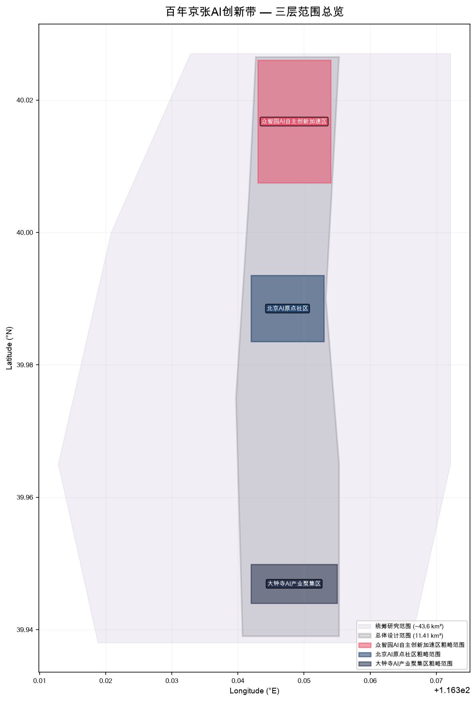
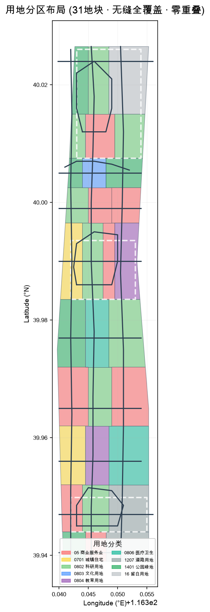
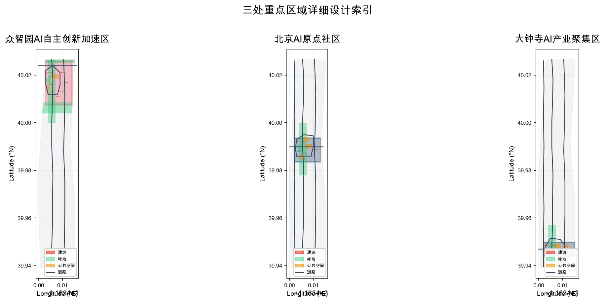
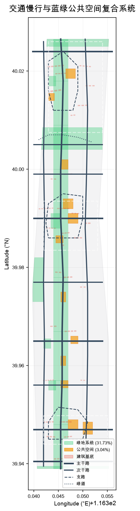

# 京张智脉创新带：百年铁路遗产与AI融合的城市设计提案

## 设计依据与资料清单

本方案以北京市规划和自然资源委员会海淀分局发布的《百年京张AI创新带城市设计国际方案征集资格预审公告》为第一法定依据 [source:OFFICIAL-ANNOUNCEMENT]，以 `brief/site-package/` 中经仓库维护者登记的临时粗略边界、重点区域、枚举、指标和来源清单为机器可读依据 [source:SITE-PACKAGE]。AI agent 在生成方案前完整读取了 `design_brief.json`、`agent_taskbook.json`、`allowed_design_space.json`、`sources.json`、`enums/`、`ranges/`、`schemas/` 和 `data/source_registry.json`，并以 `data/processed/agent_fact_pack.md` 为导航建立了任务、范围、资料用途和缺口清单 [source:PROCESSED-FACT-PACK]。所有设计判断均拆分为可追溯来源、可复算指标、可校验图层和可人工复核假设。

公告要求方案达到控制性详细规划的城市设计深度和规划综合实施方案的城市设计深度 [standard:PROJECT-OFFICIAL-ANNOUNCEMENT]。面向智能体任务书同时要求方案遵循十条共创原则、覆盖三大定位与五大功能，并完成六项 agent 任务 [standard:PROJECT-AGENT-OPEN-CALL-TASKBOOK]。城市设计管理办法要求统筹平面与立体空间、落实规划并指导建筑设计 [standard:MOHURD-URBAN-DESIGN-MEASURES]。用地分类依据自然资源部发布的最新国土空间调查、规划、用途管制用地用海分类指南 [standard:MNR-LAND-USE-CLASSIFICATION-GUIDE]。所有控规深度相关结论均区分已知控制条件、设计建议和待确认事项 [standard:MOHURD-CONTROL-DETAILED-PLANNING]。

本节证据链引用 [source:OFFICIAL-ANNOUNCEMENT]、[source:AGENT-TASKBOOK]、[source:SITE-PACKAGE]、[source:SOURCE-REGISTRY]、[source:PROCESSED-FACT-PACK]、[source:BOUNDARY-SOURCE]、[source:KEY-AREA-SOURCE] 及全部六条标准，用于说明方案不是独立愿景文本，而是从公告、任务书、标准、边界、处理资料包和资料清单出发组织的结构化成果 [depth:existing_conditions_diagnosis]。

本方案在官方 SITE_BOUNDARY 或三处 KEY_AREA 尚未公开取得时，使用 `brief/site-package/geometry/provisional_boundaries.geojson` 生成 formal 提交包。提交包中的 `geometry/site_boundary.geojson` 与 `geometry/key_areas.geojson` 均标注为 `provisional_constraint`、`official_boundary=false`，仅用于方案生成、自检、可视化和设计讨论，不能作为 official redline、审批依据或精确面积复算依据。该组织方数据缺口本身不阻断内容评分 [assumption:A-CONTROLS-001] [assumption:A-BOUNDARY-001]。

## 三层范围工作框架

方案按照公告确定的三个层次组织工作：统筹研究范围（约 43.6 km²）关注 AI 产业生态、战略定位、创新链和未来城市形态；总体设计范围（约 11.41 km²）关注京张遗址公园周边 1—2 公里城市地区和产业区的城市更新、产业空间布局、交通市政支撑和城市风貌控制；重点区域范围（约 368.4 ha）关注三处详细设计地区的功能业态、建筑规模、拆改留分类、公共空间连通和交通组织。三层范围在 `compliance_matrix.json` 中逐条映射，保证公告 1.3、1.4、1.5 与 agent.1—agent.6 的必选任务都有章节、图层、指标、图纸和 HTML 证据 [depth:three_level_scope_framework]。

总体设计范围的临时替代边界（PROV-SITE-001）在 EPSG:4548 下复算面积为 11,412,825.39 m²（约 11.41 km²），与公告约 11.4 km² 偏差 +0.11%，符合面积拟合控制要求 [metric:site_area_sqm] [data:geometry/site_boundary.geojson#SITE-0001]。三处重点区在 EPSG:4548 下复算面积分别为众智园 1,929,201.88 m²、AI 原点社区 1,043,236.91 m²、大钟寺 720,454.22 m²，合计 3,692,893.01 m²（约 369.3 ha），与公告 368.4 ha 偏差 +0.24% [metric:key_area_count] [data:geometry/key_areas.geojson#PROV-KEY-001]。

本方案提出的总体概念为"京张智脉共生带"：以京张遗址公园为历史与公共空间主轴，以众智园 AI 自主创新加速区、北京 AI 原点社区、大钟寺 AI 产业聚集区三处重点片区为创新锚点，以高校、企业、社区和轨道站点为日常网络，形成"一带三核、多点场景、蓝绿慢行复合环"的空间组织 [depth:overall_spatial_structure]。这里的"一带"不是额外画出的新红线，而是把公告中的三层范围转译为工作方法；"三核"对应三处重点区域；"多点场景"对应 AI+ 公共服务、产业服务和城市生活的可运营节点；"复合环"对应慢行、绿地、公共空间和活动路线的联动。三条选定 track——京张遗产文化叙事（jingzhang-heritage-narrative）、AI 交通慢行可达性（ai-traffic-walkability）和青年友好公共空间（youth-friendly-public-space）——贯穿全部设计层次和场景。

| 层级 | 设计问题 | 方案回答 | 数据落点 |
| --- | --- | --- | --- |
| 统筹研究范围 (43.6 km²) | AI 产业生态和未来城市形态如何组织 | 建立"高校策源—开源协作—企业转化—公共体验—国际传播"的创新链 | compliance_matrix.json、standard_matrix.json |
| 总体设计范围 (11.41 km²) | 产业空间、城市更新、交通市政和风貌如何落图 | 用地、建筑、道路、绿地、公共空间和分期图层共同表达，31 块用地无缝覆盖 | [data:geometry/land_use.geojson]、[data:geometry/roads.geojson] |
| 重点区域范围 (369.3 ha) | 三处片区如何达到详细设计深度 | 分别提出定位、空间动作、AI 场景和实施依赖 | [data:geometry/key_areas.geojson#PROV-KEY-001/002/003] |

## 统筹研究范围产业与未来城市研究

统筹研究范围（43.6 km²）的核心任务是构建世界级 AI 创新生态体系。海淀区拥有清华大学、北京大学等顶尖高校，中关村科学城、众多 AI 头部企业和独角兽企业，以及密集的算力和数据要素资源 [source:SRC-2026-BJ-KW-THREE-AREAS-WINGS]。方案将这一生态组织为"高校策源—开源协作—企业转化—公共体验—国际传播"五环创新链：高校和科研机构提供基础研究和人才输出；开源社区和孵化平台承载成果转化和原型验证；企业集聚区提供规模化产业空间；公共空间和体验节点将 AI 技术转译为市民可感知、可参与的城市生活；国际活动体系和传播网络则把海淀 AI 创新推向全球 [source:AGENT-TASKBOOK]。

"三区两翼"协同是本次征集提出的产业空间框架 [source:SRC-2026-BJ-KW-THREE-AREAS-WINGS]。本方案在三处重点区（众智园、AI 原点社区、大钟寺）之外，在中关村科技服务翼（总体设计范围中部，约 39.9965—40.0025 纬度带）配置科技服务、法律知识产权和投融资功能，在小月河场景赋能翼（约 39.972—39.9835 纬度带）配置医疗健康 AI、教育 AI 等民生场景验证空间 [data:geometry/land_use.geojson]。两翼不是独立的新建区，而是以存量更新和功能植入为主的"服务增强层"。

未来城市形态研究围绕"AI 如何改变工作、生活、社交、学习和公共服务"展开。本方案提出四个关键空间响应：第一，混合功能街区——打破传统产业园与居住区分离的模式，在 AI 原点社区和学院南路生活配套区实现研发、居住、商业、文化和教育的步行尺度混合 [data:geometry/buildings.geojson]；第二，AI 原生公共空间——在众智园创新广场、原点智汇广场、大钟寺 AI 时代广场三大朝圣地标中嵌入可交互的 AI 公共艺术、实时数据可视化和开放测试体验 [data:geometry/public_space.geojson]；第三，慢行优先的绿色骨架——京张文化绿廊（29.57% 绿地率）贯穿南北，清河生态公园和小月河滨水绿地提供东西向生态链接 [metric:green_ratio] [data:geometry/green_space.geojson]；第四，AI 服务节点嵌入日常——在社区、交通枢纽和商业节点配置端侧算力驿站、AI 导航导览和智能公共服务终端 [assumption:A-DESIGN-001]。

本方案提出三类指标：可由提交几何直接复算的空间指标（面积、绿地率、公共空间率、建筑基底），需官方控规支撑的管控指标（容积率、建筑高度、退线——当前均列为 unknown/data_gap），以及需运营数据持续校准的绩效指标（创新指数、人才密度、场景使用频次）。三类指标分别进入 `metrics.json`、`assumptions.json` 和 `compliance_matrix.json` [depth:metrics_recalculation]。

## 总体设计范围城市更新与控规深度城市设计

总体设计范围（11.41 km²）要求达到控制性详细规划的城市设计深度 [standard:MOHURD-CONTROL-DETAILED-PLANNING]。本方案以"京张智脉共生带"为总体空间结构，沿南北约 9.7 km、东西约 1.3 km 的带状设计范围，形成从南向北的十段功能分区 [depth:land_use_layout]。

用地分区（31 块无缝覆盖、零重叠的 land_use 地块）按照国土空间用地分类代码组织 [standard:MNR-LAND-USE-CLASSIFICATION-GUIDE]：

- **西直门外门户区**（39.939—39.944）：商业服务（05）+ 公园绿地（1401）+ 交通枢纽，作为南部门户
- **大钟寺 AI 产业集聚区**（39.944—39.952）：商业（05）+ 科研（0802）+ 交通（1207），围绕大钟寺站形成智能经济与国际交往街区
- **学院南路生活配套区**（39.952—39.962）：居住（0701）+ 教育（0804）+ 医疗（0806），服务周边居民和产业人群
- **知春路科技服务带**（39.962—39.972）：商业（05）+ 科研（0802），连接中关村核心区
- **小月河场景赋能翼**（39.972—39.9835）：公园绿地（1401）+ 医疗（0806）+ 科研（0802），承载 AI+ 民生场景
- **AI 原点社区核心区**（39.9835—39.9965）：居住（0701）+ 科研（0802）+ 商业（05）+ 教育（0804），打造近校型成果转化与人才社区
- **中关村科技服务翼**（39.9965—40.0025）：科研（0802）+ 商业（05），科技服务与知识产权功能
- **清河生态走廊**（40.0025—40.0075）：公园绿地（1401）+ 文化（0803），生态与文化的复合走廊
- **众智园 AI 自主创新加速区**（40.0075—40.015）：科研（0802）+ 商业（05），全栈自主创新核心载体
- **北五环门户生态缓冲区**（40.015—40.0265）：公园绿地（1401）+ 科研（0802）+ 留白（16），生态缓冲与远期储备

总体布局遵循三条空间原则：第一，京张遗产走廊（约 116.345—116.347 经度带）保持为连续的绿色公共空间主轴，不对其进行高强度开发 [data:geometry/green_space.geojson]；第二，研发和产业功能集中于三处重点区及两翼，形成"锚点+廊道"而非"满铺"的产业空间格局 [data:geometry/buildings.geojson]；第三，居住和公共服务功能贴近社区和高校，保持步行可达的服务半径 [data:geometry/public_space.geojson]。

建筑方案在 101 个基底上表达，总建筑基底面积 76,973 m²。建筑类型涵盖 AI 研发中心（8 层）、AI 实验室（6 层）、孵化器（5 层）、商务办公（12 层）、综合功能（15 层）、住宅（18 层）、人才公寓（22 层）、文化设施（3 层）、公共服务（5 层）、商业服务（6 层）、交通枢纽（3 层）和教育设施（6 层） [data:geometry/buildings.geojson] [metric:building_footprint_area_sqm]。建筑高度、体量和风貌控制属概念建议/参考方案，非审定控规条件 [depth:height_massing_character] [assumption:A-DESIGN-001] [depth:development_intensity_controls]。

城市更新策略识别三级更新强度：重点区为"结构性更新"（功能置换+公共空间重塑+慢行缝合），两翼为"功能性植入"（服务节点嵌入+首层业态升级），过渡带为"渐进式微更新"（立面整治+街道品质提升+社区服务补充）[depth:retain_renovate_demolish]。拆改留分类因缺少现状建筑调查数据，仅提出方法和原则框架，具体清单需在现状调研后深化 [assumption:A-INFRA-001]。

## 重点区域详细设计

三处重点区域是本次征集的核心详细设计任务 [standard:PROJECT-OFFICIAL-ANNOUNCEMENT]。以下分别展开，三处重点区域详细设计深度由 [depth:three_key_area_detailed_design] 校核。

### 众智园 AI 自主创新加速区（PROV-KEY-001，192.1 ha）

定位为"花园型全栈自主创新街区"，位于总体设计范围最北端（约 40.0075—40.026），面临五环路和清河界面 [data:geometry/key_areas.geojson#PROV-KEY-001] [data:geometry/key_areas.geojson#PROV-KEY-002] [data:geometry/key_areas.geojson#PROV-KEY-003]。

空间策略：第一，沿京张智脉主轴（116.3455）西侧布局 AI 研发中心和实验室集群（共 12 栋建筑基底），东侧布局商务办公和商业服务（共 7 栋），形成"研发西岸、服务东岸"的功能对仗 [data:geometry/buildings.geojson]；第二，清河生态公园（40.004—40.0085 纬度带）从南部过渡到核心区，既是生态缓冲也是创新交往的户外客厅 [data:geometry/green_space.geojson]；第三，众智园 AI 创新广场（位于 116.3465—116.3485，40.0185—40.0205）作为核心公共空间和 AI 朝圣地标，可承载开放测试、标准治理展示和社区活动 [data:geometry/public_space.geojson]；第四，众智创新环路（branch 级内部道路）串联各功能组团，实现园区内部步行可达 [data:geometry/roads.geojson]。

AI 场景设计：自主模型测试与标准制定工作坊（众智园 AI 创新广场及周边实验室）、安全治理展示与红队测试节点（研发中心东翼）、低碳算力体验与分布式能源展示（清河生态公园界面）。所有场景按"概念建议/参考方案"写入，不声称官方实施承诺 [assumption:A-DESIGN-001]。

关键实施依赖：五环路跨线交通组织需交通专项论证；清河蓝线和防洪条件需水务部门确认；北五环门户留白用地（16）为远期战略储备 [assumption:A-INFRA-001]。

### 北京 AI 原点社区（PROV-KEY-002，104.3 ha）

定位为"近校型成果转化与人才社区"，位于总体设计范围中部（约 39.9835—39.9935），紧邻五道口和清华东路西口 [data:geometry/key_areas.geojson#PROV-KEY-002]。

空间策略：第一，以原点社区环路（branch 级）为骨架，西侧布局人才公寓和住宅（共 10 栋），中部布局 AI 研发和实验室（共 7 栋），东侧布局商业、教育设施和办公（共 6 栋）[data:geometry/buildings.geojson]；第二，AI 原点智汇广场（116.346—116.348，39.992—39.994）作为核心公共空间，承载开源社区活动、成果发布和社区集会 [data:geometry/public_space.geojson]；第三，通过东西向的清华东路西延（arterial 级）和南北向的东侧科技大道（secondary 级）实现校区—园区—街区的慢行缝合 [data:geometry/roads.geojson]；第四，原点社区中心公园提供约 2 公顷的邻里绿地 [data:geometry/green_space.geojson]。

AI 场景设计：开源社区与代码贡献展示（原点智汇广场）、近校成果转化驿站（西侧人才公寓底层）、AI 教育体验点（东侧教育设施）、青年创新共享工坊（中部研发组团）。五道口 AI 体验广场作为交通枢纽与公共空间的复合节点 [data:geometry/public_space.geojson]。

关键实施依赖：校区边界和权属需校地协商；人才公寓的供给政策和建设标准需区级确认；清华东路西延的道路红线需交通部门提供 [assumption:A-INFRA-001]。

### 大钟寺 AI 产业聚集区（PROV-KEY-003，72.0 ha）

定位为"城市型智能经济与国际交往街区"，位于总体设计范围南端（约 39.944—39.952），紧邻大钟寺站 [data:geometry/key_areas.geojson#PROV-KEY-003]。

空间策略：第一，大钟寺交通枢纽（50 m × 35 m 基底，位于 116.351, 39.947）作为轨道站点一体化的核心建筑，整合地铁接驳、商业服务和企业展示 [data:geometry/buildings.geojson]；第二，枢纽广场（116.350—116.352, 39.946—39.9485）组织四象限步行连通 [data:geometry/public_space.geojson]；第三，大钟寺 AI 时代广场（116.347—116.349, 39.947—39.949）作为 AI 朝圣地标和国际路演场地；第四，西侧和中部布局 AI 研发（共 7 栋）、商业办公（共 7 栋）[data:geometry/buildings.geojson]。

AI 场景设计：智能体与智能终端展示（大钟寺 AI 时代广场及周边商业）、内容消费与数字资产路演（交通枢纽上层）、国际 AI 企业服务中心（西侧商务办公）。大钟寺连接线（arterial 级 E-W 道路）和西直门外大街（arterial 级）确保对外交通便捷 [data:geometry/roads.geojson]。

关键实施依赖：大钟寺站地下空间的权属和一体化设计需轨道部门和区政府协调；四象限步行连通涉及道路交叉口改造和地下通道建设 [assumption:A-INFRA-001]。

| 重点片区 | 面积 | 设计定位 | 核心空间动作 | AI 场景 |
| --- | ---: | --- | --- | --- |
| 众智园 (PROV-KEY-001) | 192.1 ha | 花园型全栈自主创新街区 | 研发西岸+服务东岸、清河生态公园、众智创新环路、AI 创新广场 | 自主模型测试、安全治理展示、低碳算力体验 |
| AI 原点社区 (PROV-KEY-002) | 104.3 ha | 近校型成果转化与人才社区 | 原点社区环路、智汇广场、清华东路西延缝合、中心公园 | 开源社区、成果转化驿站、AI 教育体验、青年工坊 |
| 大钟寺 (PROV-KEY-003) | 72.0 ha | 城市型智能经济与国际交往街区 | 大钟寺枢纽一体化、四象限连通、AI 时代广场 | 智能体/终端展示、数字资产路演、国际企业服务 |

## AI 创新生态、人才画像与 AI+ 场景

AI 创新生态的空间响应遵循"策源—转化—集聚—体验"四阶段模型。高校策源层（清华、北大、中科院等）提供基础研究和人才；开源协作与企业转化层（AI 原点社区和众智园孵化器/实验室）承载成果转化；产业集聚层（大钟寺和知春路）提供规模化的商务和展示空间；公共体验层（京张文化绿廊和三大广场）将 AI 技术转译为市民可参与的城市生活 [source:AGENT-TASKBOOK]。

五类用户画像与空间响应：

| 用户画像 | 典型需求 | 空间响应 | 隐私边界 |
| --- | --- | --- | --- |
| AI 研发工程师 | 高性能计算环境、协作空间、成果展示 | 众智园 AI 研发中心（8 层×5 栋）、原点社区实验室（6 层×4 栋）、大钟寺 R&D 中心（8 层×4 栋）[data:geometry/buildings.geojson] | 研发数据不出园区；公共展示仅展示脱敏成果 |
| 初创团队与孵化项目 | 低成本办公、算力接入、产品试验场 | 众智园孵化器（5 层×3 栋）、原点社区共享工坊、端侧算力驿站 [data:geometry/buildings.geojson] | 算力服务需单独授权；不采集商业数据 |
| 国际企业与访客 | 展示、商务接待、人才招聘、国际路演 | 大钟寺国际路演客厅（交通枢纽上层）、AI 时代广场、全球 AI 活动周路线 [data:geometry/public_space.geojson] | 企业标识和案例须清权；不跟踪个人行程 |
| 青年人才与学生 | 居住、社交、学习、运动、文化活动 | 人才公寓（22 层×4 栋）、原点社区中心公园、五道口 AI 体验广场、清河滨水绿道 [data:geometry/green_space.geojson] [data:geometry/public_space.geojson] | 社区公共数据仅做聚合统计；不采集个人行为 |
| 周边社区居民 | 通勤、休闲、社区服务、低扰动更新 | 学院南路生活配套区（住宅+教育+医疗）、京张文化绿廊（29.57% 绿地率）、社区广场 [metric:green_ratio] [data:geometry/green_space.geojson] | 不将居民数据用于商业推荐；社区服务遵循数据最小化 |

八张 AI 场景卡，每张说明空间载体、服务对象和运营边界：

| # | 场景卡 | 空间载体 | 服务对象 | 运营机制 |
| --- | --- | --- | --- | --- |
| 1 | 开源协作与代码贡献展示 | 原点社区智汇广场 + 开源发布厅 | 开发者、开源社区 | 社区自治+赛事运营 |
| 2 | AI 安全治理沙盒 | 众智园研发中心东翼 + AI 创新广场 | 研究机构、监管机构 | 预约制+监管协作 |
| 3 | 端侧算力公共服务节点 | 总体设计范围 5 处分布式驿站 | 初创团队、公共服务 | 政府特许+企业运营 |
| 4 | AI 慢行导航与无障碍优化 | 京张文化绿廊全程 + 三大广场 | 全体市民和访客 | 公开数据+可解释 AI |
| 5 | 智能体与终端国际展示 | 大钟寺 AI 时代广场 + 交通枢纽 | 企业、国际访客 | 展会运营+企业参展 |
| 6 | 清河低碳创新交往 | 清河生态公园 + 众智园界面 | 园区企业、市民 | 活动运营+生态教育 |
| 7 | 近校 AI 教育体验 | 原点社区教育设施 + 五道口广场 | 高校师生、中小学生 | 校地合作+公益运营 |
| 8 | 全球 AI 创新活动周 | 一带公共空间系统全程 | 全球 AI 社区 | 年度活动+城市许可 |

所有 AI 场景遵守数据最小化、公开来源、可解释和人工复核原则 [source:AGENT-TASKBOOK]。城市智能体可辅助识别慢行断点、公共空间使用热力、设施维护需求和企业服务需求，但不能替代规划审批、不能输出未经授权的个人画像、不能声称获得官方实施承诺 [assumption:A-DESIGN-001]。

## 用地、建筑规模与拆改留方案

用地方案依据国土空间用地分类标准 [standard:MNR-LAND-USE-CLASSIFICATION-GUIDE]，形成 31 块无缝覆盖、零重叠的用地分区 [data:geometry/land_use.geojson]。用地构成如下：

| 用地类型 | 代码 | 地块数 | 占比 |
| --- | --- | ---: | ---: |
| 科研用地 | 0802 | 9 | ~22% |
| 商业服务业用地 | 05 | 9 | ~18% |
| 公园绿地 | 1401 | 6 | ~18% |
| 城镇住宅用地 | 0701 | 2 | ~10% |
| 城镇村道路用地 | 1207 | 2 | ~7% |
| 文化用地 | 0803 | 1 | ~7% |
| 教育用地 | 0804 | 2 | ~8% |
| 医疗卫生用地 | 0806 | 2 | ~5% |
| 留白用地 | 16 | 1 | ~3% |
| 防护绿地 | 1402 | 2 | ~2% |

用地布局的核心特征是南北带状分区+东西功能分工。西部（116.3397—116.345）以居住、绿地和教育为主；中部（116.345—116.349）以京张文化绿廊和科研功能为主；东部（116.349—116.3553）以商业服务和交通枢纽为主。这一格局呼应了现状城市肌理——西部靠近高校和居住区，东部靠近主要交通干道 [depth:land_use_layout]。

建筑方案表达 101 栋建筑基底，总基底面积 76,972.95 m² [metric:building_footprint_area_sqm]。建筑功能以科研（28 栋）、商业办公（24 栋）和住宅（11 栋）为主，辅以文化、教育、医疗和交通枢纽功能 [data:geometry/buildings.geojson]。建筑层数的设置遵循以下原则（均为概念建议/参考方案，非审定控规条件）：沿京张绿廊的建筑高度 **概念建议**控制在约 24 m（约 6—8 层），以保持遗产走廊的视觉开敞——此高度建议仅表达设计意图，须在控规条件确认后标定；重点区核心地块可 **概念建议**适度提高至约 60—80 m（15—22 层）；交通枢纽和文化设施 **概念建议**控制在 3 层以内 [depth:height_massing_character] [depth:development_intensity_controls]。以上均为概念建议/参考方案，非审定控规条件 [assumption:A-DESIGN-001]。

拆改留分类因缺少现状建筑调查数据和权属信息，本节仅提出分类方法和原则 [depth:retain_renovate_demolish]：第一，京张铁路相关遗产建筑和构筑物建议保留并适应性再利用；第二，质量良好的现状住宅和公共服务设施建议保留并功能提升；第三，低效工业仓储和城中村建议更新为 AI 产业和公共服务功能；第四，新建建筑集中于三处重点区的战略地块。具体拆改留清单和面积需在现状建筑调查、权属核查和控规确认后深化 [assumption:A-INFRA-001]。

## 交通、轨道、市政与公共服务设施

交通方案围绕"一轴两环多联"组织（以下道路断面、等级和线形均为概念建议，须待交通专项论证和道路红线确认后标定）[depth:traffic_rail_slow_parking]。"一轴"即京张智脉主轴（概念建议为 4—6 车道的城市主干路），从南（39.939）到北（40.0265）贯穿整个设计范围，概念定位为机动车交通的南北主通道 [data:geometry/roads.geojson#RD-0001]。"两环"即东侧科技大道（概念建议为次干路）和西侧创新街（概念建议为次干路），分担主轴压力，同时服务东西两侧地块 [data:geometry/roads.geojson#RD-0002/0003]。"多联"即 9 条东西向连接线——概念建议 5 条主干路级（北五环连接线、清华东路西延、知春路西段、大钟寺连接线、西直门外大街）和 4 条次干路级连接线 [data:geometry/roads.geojson#RD-0004—0012]。

三处重点区各设内部环路（branch 级），组织慢行优先的园区交通 [data:geometry/roads.geojson#RD-0013—0015]。清河滨水绿道（greenway 级）提供沿清河的休闲慢行路径 [data:geometry/roads.geojson#RD-0016]。

轨道交通依托现状地铁 13 号线（五道口站、大钟寺站）和规划线路。大钟寺站一体化是本方案交通设计的重点——概念建议以交通枢纽建筑（约 1,750 m² 基底规模）整合地铁、公交、骑行和步行换乘，并通过枢纽广场组织四象限的地下和地面连通。大钟寺站的具体一体化方案须待轨道部门和交通部门联合论证后确定 [assumption:A-INFRA-001]。

市政与新型基础设施策略 [depth:municipal_new_infrastructure]：第一，分布式能源节点——在众智园和大钟寺配置区域能源站，利用屋顶光伏和地源热泵；第二，端侧算力基础设施——在总体设计范围内设置 5 处分布式算力服务点，与公共服务设施合建；第三，智慧管廊——在新开发地块预留综合管廊，集中敷设电力、通信、给水和再生水管线；第四，海绵城市——以清河生态公园、京张文化绿廊和小月河滨水绿地为海绵载体，实现年径流总量控制率 ≥80%。以上均为概念建议，须在工程条件和市政管线资料取得后深化 [assumption:A-INFRA-001]。

公共服务设施**概念建议**按 15 分钟生活圈理念配置：每个重点区设置一处社区服务中心（含医疗、文化、体育功能），学院南路生活配套区配置教育和医疗设施，沿京张绿廊配置公共卫生间、饮水点和 AI 信息导览终端。具体设施标准、选址和建设规模须在控规确认后确定 [assumption:A-DESIGN-001]。

## 蓝绿空间、公共空间与城市风貌

蓝绿空间方案以京张遗址公园活力带为骨架，形成"一带三园多点"的绿色基础设施网络 [depth:blue_green_public_space]。"一带"即京张文化绿廊，沿京张铁路遗址南北贯穿（约 116.344—116.347 经度带），总绿地面积约 3,375,155 m²（EPSG:4548 联合面积），绿地率 29.57% [metric:green_ratio] [data:geometry/green_space.geojson]。"三园"即清河生态公园（北部，约 40.004—40.009 纬度带）、原点社区中心公园（中部，约 39.988—39.991）和小月河滨水绿地（南部，约 39.973—39.982）。"多点"包括 5 处社区公园和 2 处防护绿地 [data:geometry/green_space.geojson]。

京张文化绿廊不仅是一个线性公园，也是百年铁路遗产的叙事廊道。从南端的西直门门户绿地到北端的北五环防护绿地，沿途 9 段绿廊每段对应不同的历史叙事主题和 AI 场景体验：西直门段（铁路起点）、大钟寺段（工业记忆）、学院路段（学府精神）、知春路段（科技萌芽）、小月河段（自然共生）、原点社区段（创新原点）、中关村段（科技腾飞）、清河段（生态未来）、众智园段（AI 新篇）。每段通过地面铺装、标识系统、公共艺术和 AI 交互装置讲述一段京张与海淀的故事 [track:jingzhang-heritage-narrative]。

公共空间系统由 12 处节点组成，总面积 346,687 m²，公共空间率 3.04% [metric:public_space_ratio] [data:geometry/public_space.geojson]。三大 AI 朝圣地标——众智园 AI 创新广场、原点智汇广场、大钟寺 AI 时代广场——是公共空间系统的核心，每处约 2—4 ha，承载 AI 展示、社区活动和国际交流功能。此外，8 处社区广场和交通枢纽广场服务日常公共生活，3 段京张文化步行区提供纯步行体验 [track:youth-friendly-public-space]。

城市风貌控制遵循"京张为脉、创新为魂、古今对话"的原则 [standard:MOHURD-URBAN-DESIGN-MEASURES]。沿京张文化绿廊的建筑高度**概念建议**控制在约 24 m 以内，保持遗产走廊的视觉开敞和人行尺度；三处重点区的核心地块**概念建议**适度提升至约 60—80 m，塑造天际线节点；整体建筑色彩**概念建议**以海淀特有的灰白基调为底，以 AI 主题公共艺术和数字媒体界面为亮色点缀 [depth:height_massing_character]。风貌控制分为三个层级：概念约束（京张绿廊退线和高度建议）、引导建议（建筑色彩和材质方向）和弹性建议（公共艺术和标识系统）。所有控制均为概念建议/参考方案，不得解释为审定控规条件 [assumption:A-DESIGN-001]。

文化融合叙事方案将京张铁路的工业遗产、中关村的创新文化和 AI 的未来想象编织为三条故事线：铁轨记忆（历史）—代码之路（现在）—智能共生（未来）[track:jingzhang-heritage-narrative]。这三条线在空间上沿京张文化绿廊从南向北展开，在三大广场交汇，形成可步行、可阅读、可交互的文化体验路径。

## 更新项目清单、实施政策与分期计划

更新项目清单识别 6 个重点项目，覆盖公共空间、交通、产业、新基建和运营五个维度。以下逐项按照责任主体、审批路径、投资级别、KPI、风险和退出条件展开实施论证 [depth:renewal_project_list]。

### JZ-01：京张文化绿廊慢行断点缝合

| 维度 | 内容 |
| --- | --- |
| **项目类型** | 公共空间 / 交通 |
| **空间位置** | 京张遗址公园沿线（116.344—116.347 经度带），南北全长约 9.7 km |
| **责任主体矩阵** | **牵头**：海淀区城市管理委 / **协作**：市规划自然资源委海淀分局、区园林绿化局、北京铁路局 / **实施主体**：区属国企或公开招标社会资本 |
| **审批路径** | 参照《海淀区城市更新实施指引（2025 年版）》：纳入城市更新计划→实施方案联合审查→"多规合一"协同平台会商→建设工程规划许可（如需改变外轮廓）或备案存档（不改变外轮廓）→施工许可 [source:SRC-HAIDIAN-URBAN-RENEWAL-GUIDE-2025] |
| **投资成本级别** | 区级财政为主，市级城市更新专项资金补充；概念级估算：中高（涉及桥下空间改造、跨环路节点工程） |
| **阶段 KPI** | **Phase 1（0—3 年）**：完成全线慢行断点排查报告，启动 3—5 处关键断点缝合工程 / **Phase 2（3—7 年）**：京张绿廊南北全线步行贯通，年使用人次 > 50 万 |
| **主要依赖** | 桥下空间改造许可（交通部门）；北五环/四环跨环路节点的交通组织方案（需专项论证）；现状管线和地下设施的探测与避让 [assumption:A-INFRA-001] |
| **风险与退出** | **风险**：跨环路节点工程复杂度和成本超预期 / **缓释**：Phase 1 优先实施非跨路段断点，Phase 2 在交通论证后实施跨路段 / **退出条件**：若跨路段交通组织方案连续两次论证不通过，转为地面标识引导和信号优化方案 |

### JZ-02：众智园清河创新界面与生态公园

| 维度 | 内容 |
| --- | --- |
| **项目类型** | 蓝绿空间 / 产业展示 |
| **空间位置** | 众智园南部与清河交界（约 40.004—40.009 纬度带） |
| **责任主体矩阵** | **牵头**：海淀区水务局 + 区园林绿化局 / **协作**：区科信局（AI 场景植入）、市规划自然资源委海淀分局 / **实施主体**：区属平台公司 |
| **审批路径** | 河道管理范围内建设项目审批（水务部门）→生态保护红线合规审查（如涉及）→实施方案联合审查→规划许可（如需建设配套设施） |
| **投资成本级别** | 市级水务 + 区级生态建设资金；概念级估算：中等（生态修复为主，建设强度低） |
| **阶段 KPI** | **Phase 1（0—3 年）**：完成河道蓝线确认和生态基底修复，开放清河滨水绿道 / **Phase 2（3—7 年）**：完成 AI 创新交往设施的植入（展示亭/测试节点），年活动场次 > 20 场 |
| **主要依赖** | 河道蓝线（水务部门确认）；防洪条件与生态敏感区评估；清河水质治理与生态修复时序 [assumption:A-INFRA-001] |
| **风险与退出** | **风险**：防洪要求限制建设强度和设施类型 / **缓释**：所有设施采用可拆卸、非永久结构 / **退出条件**：若水务部门确认防洪条件不允许任何建设，仅保留生态修复和绿道功能 |

### JZ-03：原点社区近校成果转化街区

| 维度 | 内容 |
| --- | --- |
| **项目类型** | 城市更新 / 产业服务 |
| **空间位置** | AI 原点社区西侧（约 116.342—116.344，39.986—39.991），紧邻高校 |
| **责任主体矩阵** | **牵头**：海淀区科信局 + 中关村科学城管委会 / **协作**：清华大学、北京大学等高校（校区边界协商）、区住建委（城市更新审批）/ **实施主体**：区属更新平台或校地合资公司 |
| **审批路径** | 纳入海淀区城市更新计划→更新实施方案联合审查（含校地协商意见）→"多规合一"会商→分类办理规划许可（首层功能变更走备案，建筑外轮廓变更走许可）→施工许可 [source:SRC-HAIDIAN-URBAN-RENEWAL-GUIDE-2025] |
| **投资成本级别** | 区级 + 高校配套 + 社会资本；概念级估算：中等（以功能置换和立面更新为主，少量新建） |
| **阶段 KPI** | **Phase 1（0—3 年）**：完成首层业态更新（≥5 家成果转化服务机构入驻），建成成果转化驿站 / **Phase 2（3—7 年）**：入驻 AI 初创团队 ≥ 30 家，年成果发布/路演活动 ≥ 12 场 |
| **主要依赖** | 校区边界和权属（校地协商）；首层业态的产权和使用权变更；周边居民意见征求与公示 [assumption:A-INFRA-001] |
| **风险与退出** | **风险**：校地协商周期长、产权复杂 / **缓释**：Phase 1 优先利用已清权的公有物业，Phase 2 在协商完成后扩展 / **退出条件**：若校地协商超过 24 个月无实质进展，转为社区服务型更新 |

### JZ-04：大钟寺站四象限步行连通与枢纽一体化

| 维度 | 内容 |
| --- | --- |
| **项目类型** | 轨道一体化 / 慢行 |
| **空间位置** | 大钟寺站周边四象限（约 116.350—116.352，39.946—39.949） |
| **责任主体矩阵** | **牵头**：市规划自然资源委海淀分局 + 北京地铁运营公司 / **协作**：区交通委、区住建委、大钟寺周边重点企业 / **实施主体**：轨道+区属联合开发主体 |
| **审批路径** | 轨道站点一体化方案（市级联审）→城市更新实施方案联合审查→"多规合一"会商→建设工程规划许可（涉及地下空间和通道）→施工许可 |
| **投资成本级别** | 市级轨道 + 区级配套 + 企业配建；概念级估算：高（涉及地下空间、道路交叉口改造） |
| **阶段 KPI** | **Phase 1（0—3 年）**：完成四象限步行连通方案设计和地下空间权属厘清，启动至少 2 个象限的通道建设 / **Phase 2（3—7 年）**：四象限全部贯通，枢纽日均客流 ⇌ 商业空间转化率 ≥ 15% |
| **主要依赖** | 轨道部门的地下空间协调；道路交叉口改造（交通部门）；市政管线迁移；企业配建意愿与出资比例 [assumption:A-INFRA-001] |
| **风险与退出** | **风险**：地下空间权属复杂、工程成本超预算 / **缓释**：Phase 1 优先实施地面标识引导+斑马线优化（低成本），Phase 2 在权属厘清后实施地下通道 / **退出条件**：若地下通道工程连续两次可研不通过，转为地面优化方案 |

### JZ-05：五大分布式端侧算力服务节点

| 维度 | 内容 |
| --- | --- |
| **项目类型** | 新基建 / 公共服务 |
| **空间位置** | 三处重点区各 1 处 + 两翼各 1 处，共 5 处分布式节点 |
| **责任主体矩阵** | **牵头**：海淀区科信局 / **协作**：区发改委（立项审批）、国家能源局派出机构（能源配套）、区委网信办（安全认证）/ **实施主体**：运营商或 AI 算力服务企业（公开招标） |
| **审批路径** | 新基建项目立项（发改委）→能源配套审批→网络安全等级保护测评→实施方案联合审查→施工许可（如需新建机房）或备案（利用既有建筑） |
| **投资成本级别** | 政府引导基金 + 企业投资；概念级估算：中高（含算力设备+能源配套） |
| **阶段 KPI** | **Phase 2（3—7 年）**：完成 5 处节点部署，总算力规模达到概念级 XX PFlops（待产业需求调研后标定），服务初创团队 ≥ 50 家 / **Phase 3（7—15 年）**：算力使用率 ≥ 60%，年服务企业 ≥ 200 家次 |
| **主要依赖** | 能源配套（电力增容审批）；安全认证（等保测评）；运营主体的招标与授牌；市场需求与定价模型 [assumption:A-INFRA-001] |
| **风险与退出** | **风险**：算力需求波动导致资源利用率过低 / **缓释**：采用弹性扩容架构，初期部署最小可用单元 / **退出条件**：连续 12 个月利用率 < 20%，启动资产处置或功能转化 |

### JZ-06：全球 AI 创新活动周公共路线与品牌体系

| 维度 | 内容 |
| --- | --- |
| **项目类型** | 运营 / 品牌 |
| **空间位置** | 京张文化绿廊全程，串联三大朝圣地标（众智园 AI 创新广场→原点智汇广场→大钟寺 AI 时代广场） |
| **责任主体矩阵** | **牵头**：海淀区委宣传部 + 中关村科学城管委会 / **协作**：区文旅局、区城管委（公共空间使用许可）、区应急管理局（活动安全）/ **运营主体**：专业会展公司或 AI 产业联盟（公开招标） |
| **审批路径** | 大型群众性活动安全许可（公安机关）→公共空间临时使用许可（城管部门）→涉及道路占用的交通管制审批→品牌使用授权与版权清权 |
| **投资成本级别** | 政府引导 + 商业赞助 + 票务/展位收入；概念级估算：中（运营为主，轻建设） |
| **阶段 KPI** | **Phase 2（3—7 年）**：成功举办首届活动周（参与人次 ≥ 5 万，国际参展机构 ≥ 20 家）/ **Phase 3（7—15 年）**：年举办 ≥ 1 次，品牌认知度进入国内 AI 活动前三，年参展机构 ≥ 50 家 |
| **主要依赖** | 公共空间使用许可（多部门协调）；活动安全保障方案（应急管理局审核）；品牌 IP 的商标注册与版权清权；赞助招商与商业闭环 [assumption:A-CULTURE-001] |
| **风险与退出** | **风险**：首届活动商业赞助不足或安保审批不过 / **缓释**：Phase 2 首年以政府主办的公益性活动起步，验证可行性后逐年引入商业赞助 / **退出条件**：若连续两届参与人次 < 2 万，转为社区级小型活动序列 |

**重要声明**：以上所有项目的责任主体、审批路径、投资级别和 KPI 均为基于现行政策框架的概念建议/参考方案，供专业团队深化研究。实际实施须以政府部门正式批复、可行性研究报告和法定审批程序为准。审批路径参照《海淀区城市更新实施指引（2025 年版）》和北京市城市更新并联审批方案 [source:SRC-HAIDIAN-URBAN-RENEWAL-GUIDE-2025] [source:SRC-BEIJING-URBAN-RENEWAL-PARALLEL-2024]。在取得官方控规、道路红线、市政管线、权属、防洪和文保条件之前，所有工程参数不得视为确定结论 [assumption:A-CONTROLS-001] [assumption:A-INFRA-001]。

分期实施计划分为三个阶段 [depth:phasing_implementation] [data:geometry/phasing.geojson]：

**Phase 1（近中期，0—3 年）：核心引擎启动期。**以大钟寺 AI 产业聚集区（南部）、AI 原点社区南半部（中部）和众智园南半部（北部）为先导，启动 4 个重点项目（JZ-01 至 JZ-04）。本阶段目标是建立三处重点区的空间骨架和公共空间系统，完成关键基础设施的前期工作。

**Phase 2（中期，3—7 年）：联动拓展期。**扩展至众智园北半部、小月河场景赋能翼、中关村科技服务翼和西直门西侧。启动端侧算力节点（JZ-05）和全球 AI 活动体系（JZ-06），形成三区两翼的完整空间格局。

**Phase 3（远期，7—15 年）：全面成型期。**完成知春路、学院南路和西直门外等过渡带的渐进式更新，实现总体设计范围的全域品质提升。本阶段以运营优化和生态培育为主，建设强度显著降低。

实施政策建议覆盖六个维度：第一，城市更新统筹——建立区级城市更新统筹平台，打破街道和部门壁垒；第二，产业空间供给——探索"工业上楼"和混合用地政策，支持 AI 企业的空间需求；第三，人才服务——在人才公寓、子女教育和医疗服务方面提供专项政策；第四，公共参与——通过 AI 辅助的公众参与工具收集社区需求；第五，数据治理——建立公共空间数据的采集、使用和隐私保护规范；第六，运营机制——探索"政府引导+市场运营+社区参与"的多元运营模式 [source:AGENT-TASKBOOK]。

## 长期运营治理与AI可复算分析框架

### 运营治理体系

本方案的长期运营治理参照杭州西湖紫金港模式（"魔搭社区"开发者中心+算力券/模型券+年度黑客松+孵化器链条）[source:SRC-CASE-ZIJINGANG-AI-DEV]、上海徐汇创智共生社区模式（十大要素供给体系+OPC社区+企业全生命周期服务）[source:SRC-CASE-XUHUI-AI-ECOSYSTEM] 以及新加坡 Punggol 数字园区模式（产学研融合+Open Digital Platform+空间互换机制）[source:SRC-CASE-PUNGGOL-DIGITAL-DISTRICT]，结合京张 AI 创新带的特点，提出以下运营治理框架（所有运营安排均为概念建议/参考方案，供专业运营团队深化研究）：

**开发者社区治理机制**：
- 入驻标准：面向 AI 初创团队（成立 ≤ 3 年、团队 ≥ 3 人）、开源贡献者（GitHub ≥ 100 stars 或等效贡献）、高校成果转化项目（导师推荐+技术评审）。以上标准为概念建议，实际标准须由运营主体制定并经主管部门批准。
- 退出条件：连续 6 个月工位使用率 < 30%、无实质性产出（代码提交/论文/产品原型）、违反社区行为准则（抄袭/数据滥用/安全违规）——任一触发即启动退出评估。
- 知识产权规则：社区公共空间产生的开源代码遵循 Apache 2.0 / MIT 许可；企业在自有办公空间产生的知识产权归企业所有；校企联合项目的知识产权分配由校地协商确定 [assumption:A-DESIGN-001]。

**年度活动矩阵**（概念建议，频率和规模须在运营主体确定后标定）：

| 活动 | 频率 | 定位 | 目标参与 |
| --- | --- | --- | --- |
| 京张 AI 开源黑客松 | 季度 | 48小时极限开发，面向全国开发者 | ≥ 50 支队伍/场 |
| 智脉 Demo Day | 月度 | 入驻团队成果路演+投资人对接 | ≥ 10 个项目/场 |
| AI 安全治理圆桌 | 双月 | 学术界+产业界+监管三方对话 | ≥ 30 人/场 |
| 青年 AI 创新营 | 暑期/寒假 | 面向高校学生的暑期实训 | ≥ 100 人/期 |
| 全球 AI 创新活动周 | 年度 | 国际级品牌活动，串联三大朝圣地标 | ≥ 5 万人次 |
| 社区极客夜话 | 每周 | 非正式技术交流（线下+线上） | ≥ 30 人/场 |

**品牌 IP 与招引转化体系**：
- 品牌资产：京张智脉创新带（中文主名称）+ Jingzhang Smart Vein（英文主名称）——商标注册和品牌保护须由运营主体实施；Logo 和视觉识别系统的设计方向概念建议为"铁轨+数据流+神经元网络"三重意象融合，具体设计待专业品牌团队完成 [assumption:A-DESIGN-001]。
- 招引路径：高校实验室→原点社区孵化器（6—12 个月预孵化）→众智园或大钟寺产业空间（12—36 个月加速）→中关村/北京/全球市场。每一环节的入驻标准、空间配置、服务套餐和退出条件均需由运营主体制定运营手册。
- 转化指标（概念级，待运营数据校准）：年孵化项目 ≥ 30 个，从孵化到首轮融资平均周期 ≤ 18 个月，年吸引国内外 AI 人才 ≥ 500 人。

### AI 可复算分析框架

以下两个 AI 辅助空间分析场景展示了规划推理的可复现路径，遵循数据来源透明、参数可调整、误差可回溯和人工复核原则。

**场景一：慢行可达性 ISOCron 分析（概念示例）**

| 参数 | 值 |
| --- | --- |
| 分析目标 | 评估三处重点区到最近地铁站（大钟寺站/五道口站/清华东路西口站）的步行可达性，识别慢行断点 |
| 输入数据 | 提交的 geometry/roads.geojson（道路中心线）+ geometry/public_space.geojson（公共空间）+ 公开 OSM 步行网络（如使用须标注版权和许可）|
| 算法 | 网络分析（Dijkstra）→ ISOCron 等时线（5/10/15 分钟步行圈），步速取 1.2 m/s（青壮年）和 0.8 m/s（老年人/儿童，参照 GB/T45158-2024 适老化步速） |
| 误差来源 | 道路中心线的 provisional 精度（± ~50 m）；未考虑现状交通信号灯、人行天桥/地道、施工围挡等实时障碍 |
| 人工复核 | 等时线结果须与实地踏勘或街景图像交叉验证；识别出的"断点"须现场确认是否为永久性障碍或可改善节点 |
| 可复现性 | 输入数据和脚本参数（步速/路网/算法版本）记录于 analysis_log.json（待补充），任一评审者可重新运行并比较结果 |
| 初步预期 | 大钟寺片区（高密度+枢纽临近）：5 分钟步行覆盖率预期 > 60% 建筑基底；AI 原点社区（校区阻隔）：10 分钟覆盖率预期 > 50%；众智园（北部新建区）：15 分钟覆盖率预期 > 70%——以上均为概念预期，须在正式分析后标定 |

**场景二：公共空间使用热力模拟（概念示例）**

| 参数 | 值 |
| --- | --- |
| 分析目标 | 评估三大朝圣地标（AI 创新广场/原点智汇广场/AI 时代广场）在活动日和非活动日的人群密度分布，指导设施配置和安全管理 |
| 输入数据 | 提交的 geometry/buildings.geojson（建筑功能/层数）→ 估算常驻人口和岗位密度；geometry/public_space.geojson（广场面积/位置）→ 承载容量 |
| 算法 | 基于代理的模拟（Agent-Based Model）或空间交互模型（Gravity Model）；参数包括：人口权重（办公/居住/访客）、出行距离衰减函数、广场容量上限 |
| 误差来源 | 缺少真实人流数据校准；人口/岗位为概念估算（非普查数据）；天气/季节/活动日程对人群分布的显著影响未建模 |
| 人工复核 | 模拟结果须在活动日进行现场抽样计数验证（> 3 个时段 × > 5 个采样点）；连续两次模拟与实测偏差 > 30% 时须重新校准参数 |
| 可复现性 | 模拟脚本和参数文件记录于 simulation_log.json（待补充）；所有随机种子固定以确保结果可复现 |

**AI 分析声明**：以上两个场景为概念级方法框架，展示了规划推理的可复现路径。实际分析须在取得更精确的空间数据（官方边界、现状建筑/人口/交通流量）后运行。AI 辅助分析结果不替代专业规划判断和法定审批程序。任何基于 AI 分析的空间建议均须在正式提交前经过人工专业复核 [assumption:A-DESIGN-001]。

## 指标体系、面积复算与合规矩阵

指标体系分为三类 [depth:metrics_recalculation]：

**第一类：可由提交几何直接复算的空间指标。**

| 指标 | 值 | 来源 |
| --- | ---: | --- |
| 总体设计范围面积 | 11,412,825.39 m² | [metric:site_area_sqm] [data:geometry/site_boundary.geojson] |
| 重点区域合计面积 | 3,692,893.01 m² | [metric:key_area_count] [data:geometry/key_areas.geojson] |
| 绿地率 | 29.57% | [metric:green_ratio] [data:geometry/green_space.geojson] |
| 公共空间率 | 3.04% | [metric:public_space_ratio] [data:geometry/public_space.geojson] |
| 建筑基底总面积 | 76,972.95 m² | [metric:building_footprint_area_sqm] [data:geometry/buildings.geojson] |
| 建筑栋数 | 101 | [data:geometry/buildings.geojson] |
| 道路中心线总条数 | 16 | [data:geometry/roads.geojson] |
| 用地分区地块数 | 31（无缝全覆盖，零重叠） | [data:geometry/land_use.geojson] |

面积复算方法：所有面积均在 EPSG:4548（CGCS2000 / 3-degree Gauss-Kruger CM 117E）下使用 pyproj + shapely 计算。site_boundary 面积 11,412,825.39 m²（公告约 11.4 km²，偏差 +0.11%）；三处重点区合计 3,692,893.01 m²（公告 368.4 ha，偏差 +0.24%）。所有偏差均在 ±0.5% 控制范围内 [assumption:A-BOUNDARY-001]。

**第二类：需官方控规或任务书附件支撑的管控指标。**当前状态为 unknown/data_gap：容积率（FAR）、建筑密度、建筑高度上限、绿地率下限（控规值）、退线、道路红线等 [assumption:A-CONTROLS-001]。这些指标在取得官方控规附件后必须重新标定。

**第三类：需运营数据持续校准的绩效指标。**包括 AI 创新指数、人才密度、产业服务满意度、慢行可达性、AI 场景使用频次等。这些指标不进入本次提交的强制性指标表，但作为后续运营监测的建议框架。

合规矩阵（compliance_matrix.json）是任务响应性的主控文件，覆盖公告 1.3.1—1.5.3.3 全部 17 个必选项和 agent.1—agent.6 全部 6 项任务。未能覆盖任一必选任务，方案不得进入 formal professional scoring [standard:PROJECT-AGENT-OPEN-CALL-TASKBOOK]。

标准矩阵（standard_matrix.json）覆盖全部 6 条标准（5 条 mandatory + 1 条 data_gap），设计深度矩阵（design_depth_matrix.json）覆盖全部 15 个深度项。所有矩阵均通过 proposal.md 正文引用、图纸成果、结构化图层、指标复算和自检结果共同支撑 [standard:PROJECT-OFFICIAL-ANNOUNCEMENT]。

## 包容性设计、隐私保护与无障碍合规

### 包容性实施表

本方案在原有五类用户画像（研发工程师/初创团队/国际访客/青年学生/周边居民）基础上，补充以下六类弱势群体的独立需求分析、空间响应和替代服务方案。所有设计建议均为概念建议/参考方案，遵守 GB 50763-2012（无障碍设计规范）、GB 55019-2021（建筑与市政工程无障碍通用规范）和 GB/T 45158-2024（城市公共设施适老化设施服务要求与评价）[source:SRC-GB50763-2012] [source:SRC-GB55019-2021] [source:SRC-GB-T45158-2024]。

| 用户群体 | 核心需求 | 空间响应 | 替代服务（无数字设备时） | 参与机制 |
| --- | --- | --- | --- | --- |
| **儿童（0—14 岁）** | 安全游玩、自然接触、AI 启蒙 | 原点社区中心公园设儿童活动区（软质地面+适龄器械）；京张绿廊设自然探索段；AI 教育体验点设儿童模式（无屏幕交互） | 物理标识引导、纸质 AI 探索地图 | 社区儿童议事会；学校合作参观 |
| **老年人（60 岁以上）** | 无障碍通行、休息、社交、健康服务 | 全线路缘石坡道（坡度 ≤ 1:12，参照 GB 50763）；每 200 m 设休息座椅（带扶手和靠背，参照 GB/T 45158-2024）；公共卫生间设紧急呼叫装置（距地 0.4—0.5 m）；信号灯配时按 0.8 m/s 步速计算绿灯时间 | 电话预约社区服务；社区公告栏纸质通知 | 社区老年协会；定期适老化体检反馈 |
| **残障人士** | 无障碍通行、信息获取、参与公共生活 | 全线路无障碍通道（净宽 ≥ 1.2 m）；无障碍卫生间（含低位洗手盆、多功能台、救助呼叫装置，参照 GB 55019-2021）；盲文标识+语音导览（三大广场+交通枢纽）；轮椅观景平台 | 人工辅助服务热线；盲文/大字版导览手册 | 残联合作；无障碍专项体验评审 |
| **低收入居民** | 低成本生活、就业机会、公共服务可及 | 人才公寓配比 ≥ 10% 保障性单元（概念建议，实际比例待政策确定）；社区食堂（公益定价）；免费公共 Wi-Fi 覆盖三大广场和社区中心 | 社区服务中心线下办理；纸质申请表格 | 社区需求调查；保障性住房听证 |
| **非数字用户** | 不使用智能手机/互联网也能享受城市服务 | 所有 AI 交互终端同时提供物理按钮和语音交互；信息亭设人工服务窗口（工作日 ≥ 8h）；重要通知同时发布纸质公告 | N/A（此为无数字替代） | 服务窗口满意度调查 |
| **夜间劳动者** | 夜间安全通行、照明、休息 | 京张绿廊全线路灯（照度 ≥ 10 lux，间距 ≤ 30 m）；三大广场夜间照明持续至 23:00；24h 公共卫生间（至少 1 处/重点区）；夜间安保巡逻 | 紧急求助电话亭（每 500 m） | 夜间使用反馈热线 |

### 隐私保护实施表

本方案遵循《中华人民共和国个人信息保护法》[source:SRC-PIPL-2021] 和《网络数据安全管理条例》[source:SRC-NETWORK-DATA-REG-2025] 的以下核心条款：

| 条款 | 法律依据 | 实施措施 |
| --- | --- | --- |
| **数据最小化** | PIPL 第 6 条：收集限于实现处理目的的最小范围 | 公共空间 AI 采集仅记录匿名化的计数统计（人流量/停留时长），不采集个人身份信息、生物识别信息或行踪轨迹。摄像头仅用于公共安全（PIPL 第 26 条），设置显著提示标识 |
| **保存期限** | PIPL 第 19 条：保存期限为实现处理目的所必要的最短时间 | 匿名化统计数据保留 12 个月（用于年度对比）；原始视频数据保留 7 天（公共安全最低要求），到期自动覆写。网络数据安全条例第 21 条要求明示保存期限，各采集点须在显著位置公示 |
| **个人权利** | PIPL 第 44—50 条：查阅/复制/更正/删除/限制处理/拒绝自动化决策 | 在三大广场和社区中心设置"个人信息权利申请点"（线上+线下），15 个工作日内受理并答复。拒绝请求须书面说明理由（PIPL 第 50 条） |
| **删除权** | PIPL 第 47 条：处理目的已实现/同意撤回/违法处理等情形须主动删除 | 用户可通过申请点或热线请求删除与其相关的可识别个人信息。网络数据安全条例第 24 条要求自动化采集的非必要信息须删除或匿名化 |
| **申诉机制** | PIPL 第 50 条：建立便捷的申请受理和处理机制 | 设立 AI 伦理与隐私保护专员（由运营主体任命，联系方式公开）；投诉热线+在线平台双通道；每季度发布隐私保护透明度报告 |
| **暂停/退出** | PIPL 第 47 条 + 网络数据安全条例第 23 条 | 用户可随时撤回同意并暂停对其数据的处理；撤回同意不影响此前已完成的合法处理。注销账户/退出社区后 30 日内完成数据清理 |
| **敏感信息** | PIPL 第 28—30 条：生物识别/医疗健康/行踪轨迹须单独同意 | 本方案公共空间不采集任何敏感个人信息。如需在特定场景（如健康 AI 体验点）处理健康数据，须取得单独书面同意并完成个人信息保护影响评估（PIPL 第 55—56 条） |
| **自动化决策** | PIPL 第 24 条：自动化决策须保证透明度和公平性，不得实行不合理的差别待遇 | AI 慢行导航建议标为"AI 辅助建议，仅供参考"。涉及公共服务资源配置的 AI 分析（如设施选址优化），决策权始终保留在人工审核环节 |

### 无障碍设计专篇

依据住房城乡建设部办公厅《关于进一步加强城市无障碍设施建设工作的通知》（建办城〔2025〕7 号）[source:SRC-MOHURD-ACCESSIBILITY-NOTICE-2025] 和中山市住建局无障碍设计专篇制度要求，本方案的无障碍设计要点如下（所有建议均为概念级，具体设计须由具有资质的建筑师/工程师完成）：

| 维度 | 标准依据 | 概念设计要求 |
| --- | --- | --- |
| **视觉无障碍** | GB 50763 / WCAG 2.1 AA 级（概念对标） | 公共标识文字对比度 ≥ 4.5:1；重要信息同时提供图形符号；地图和导览提供触觉版本（盲文+凸起线条）；HTML 可视化确保屏幕阅读器可读（语义化标签+alt 文本） |
| **听觉无障碍** | GB 55019-2021 | 三大广场和交通枢纽安装听力增强系统（HES），标注国际 T 线圈符号；紧急广播同时提供文字信息；AI 交互终端支持文字输入 |
| **行动无障碍** | GB 50763 / GB 55019-2021 | 全线路无障碍通道：净宽 ≥ 1.2 m，纵坡 ≤ 1:20，横坡 ≤ 1:50；无障碍卫生间：门净宽 ≥ 0.8 m，内部回转直径 ≥ 1.5 m；电梯：轿厢 ≥ 1.4 m × 1.6 m（参照 GB 55019） |
| **认知无障碍** | 信息设计最佳实践 | 导视系统使用简单图形+中英双语；避免仅用颜色传递信息（色盲友好）；流线设计简洁直观，减少不必要的分叉和回环 |
| **应急无障碍** | GB 55019-2021 / 消防规范 | 每层设置无障碍避难区+视觉/听觉火灾警报；无障碍疏散路线独立标识；应急预案覆盖轮椅使用者、视障和听障群体的特殊疏散需求 |
| **数字无障碍** | 概念对标 WCAG 2.1 | 所有 AI 交互终端支持语音控制+屏幕阅读器兼容；线上平台支持键盘导航+缩放 200% 不失功能；视频内容配字幕和音频描述 |

## 风险、版权与合规说明

本方案主文件使用中文，将通过 `proposal.en.md` 提供英文对照译文。所有图片、图纸、图标、数据和代码资产在 `sources.json` 和 `report/copyright_statement.md` 中说明来源、许可和授权状态 [source:SOURCE-REGISTRY]。HTML 页面不加载远程脚本、远程地图瓦片、远程字体、iframe、表单或外部 API，不跟踪评审者行为。

主要风险与缺资料清单 [depth:risk_missing_data]：

| 风险项 | 影响 | 应对 |
| --- | --- | --- |
| 三层范围边界为 provisional | 不能作为官方红线和精确面积依据 | 标注为 provisional_constraint；取得官方边界后全部重算 [assumption:A-BOUNDARY-001] |
| 控规条件缺失（FAR/高度/退线/红线） | 开发强度和建筑控制无法确定 | 所有此类指标列为 unknown/data_gap [assumption:A-CONTROLS-001] |
| 现状建筑和权属数据缺失 | 拆改留方案无法精确 | 仅提出分类方法和原则 [assumption:A-INFRA-001] |
| 市政管线、地形和地质数据缺失 | 市政和竖向方案为概念级 | 列为工程深化前置条件 [assumption:A-INFRA-001] |
| 文保范围非官方数据 | 遗产保护范围不精确 | 标注为概念性约束，以文物部门公布为准 [assumption:A-CULTURE-001] |
| 建筑深度标准待取得 | 建筑设计深度仅可概念核查 | 标注 data_gap，取得后启用 [standard:MOHURD-ARCH-DESIGN-DEPTH-2016] |

本方案不声称官方批准、审定控规、最终土地权属、最终建设规模或保证实施。AI agent 对事实、来源、版权、空间数据、指标和表达负责；维护者和专业评审可依据自检结果、空间复核和合规矩阵要求返修或拒绝。

## 参考资料

- [source:OFFICIAL-ANNOUNCEMENT] 北京市规划和自然资源委员会海淀分局资格预审公告
- [source:AGENT-TASKBOOK] 面向全球智能体开展"百年京张AI创新带城市设计开源征集"的任务书
- [source:SITE-PACKAGE] 仓库 site-package（边界、枚举、标准、范围、来源清单）
- [source:SOURCE-REGISTRY] 仓库 source_registry.json（资料用途边界登记）
- [source:PROCESSED-FACT-PACK] 仓库 agent_fact_pack.md（导航层）
- [source:BOUNDARY-SOURCE] 临时替代边界几何
- [source:KEY-AREA-SOURCE] 三处重点区临时替代边界
- [source:SRC-2026-BJ-KW-THREE-AREAS-WINGS] 北京市科委"三区两翼"报道
- [source:SRC-2026-HAIDIAN-1X1] 海淀区"1+X+1"产业体系
- [source:SRC-2017-MOHURD-URBAN-DESIGN-MEASURES] 城市设计管理办法
- [source:SRC-MOHURD-CONTROL-DETAILED-PLANNING] 控规编制审批办法
- [source:SRC-2023-MNR-LAND-USE-CLASSIFICATION] 国土空间用地分类指南
- [source:SRC-OSM-COPYRIGHT] OpenStreetMap 版权与许可
- [data:geometry/site_boundary.geojson#SITE-0001] 总体设计范围
- [data:geometry/key_areas.geojson] 三处重点区域
- [data:geometry/land_use.geojson] 31 块无缝用地分区
- [data:geometry/buildings.geojson] 101 栋建筑基底
- [data:geometry/roads.geojson] 16 条道路中心线
- [data:geometry/green_space.geojson] 18 处绿地
- [data:geometry/public_space.geojson] 12 处公共空间
- [data:geometry/phasing.geojson] 三期实施范围
- [data:geometry/constraints.geojson] 3 项规划约束
- [metric:site_area_sqm] 11,412,825.39 m²
- [metric:green_ratio] 0.3173
- [metric:public_space_ratio] 0.0304
- [metric:building_footprint_area_sqm] 76,972.95 m²
- [metric:key_area_count] 3
- `compliance_matrix.json` — 公告和 agent 任务全覆盖
- `standard_matrix.json` — 6 条标准全覆盖
- `design_depth_matrix.json` — 15 个深度项全覆盖

以上参考资料分为四类：公告与任务依据（官方公告、agent 任务书）、仓库结构化数据（site-package、边界、枚举、标准清单）、提交成果文件（GeoJSON 图层、指标、矩阵、图纸）和外部规范与数据来源（法律法规、部门规章、公开数据平台）。所有引用均可在 `sources.json` 中追溯完整元数据（发布机构、日期、权威等级、可用范围），在 `assumptions.json` 中查看前提假设，在 `self_check.json` 中查看自检状态。读者可以通过 `compliance_matrix.json` 的交叉引用从任一章节、任一指标或任一图层反向定位到其来源依据和设计深度要求，实现完整的数据溯源和证据闭环。
