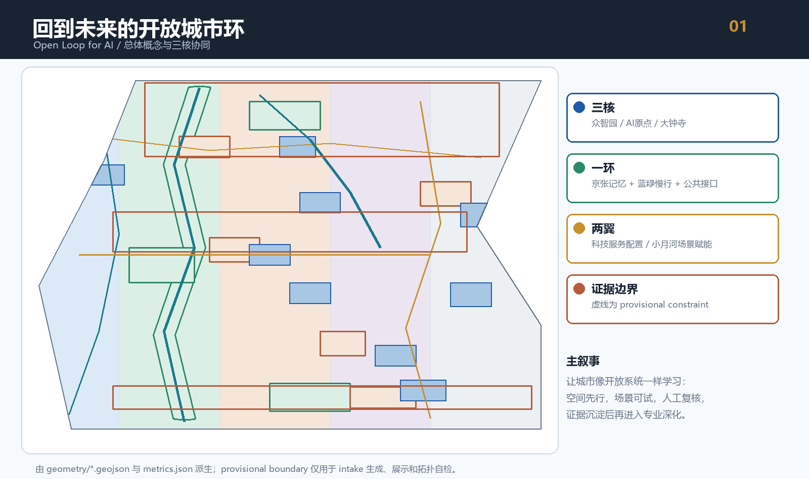
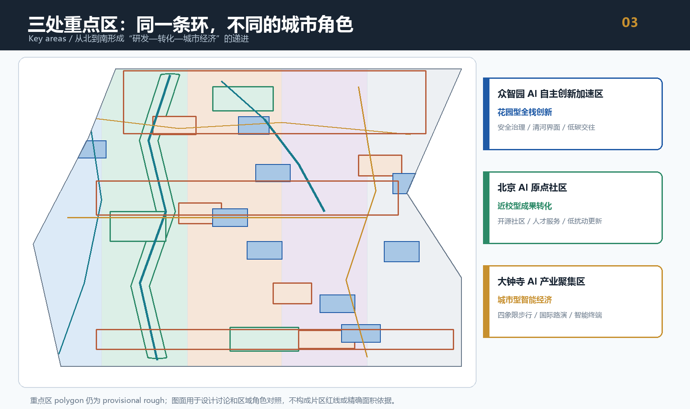
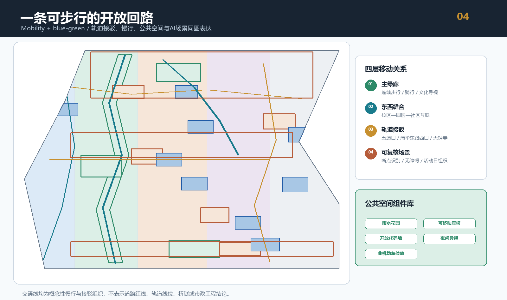
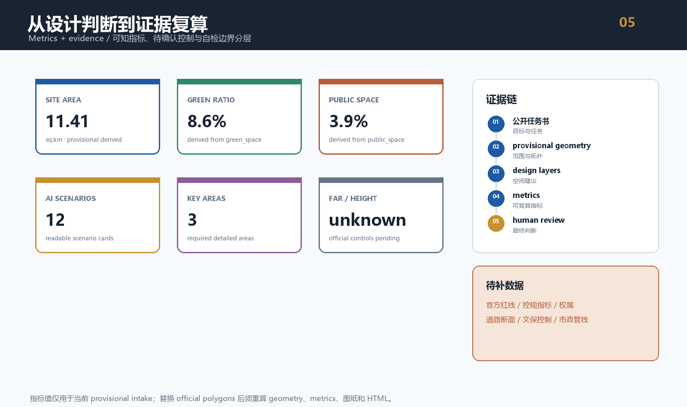
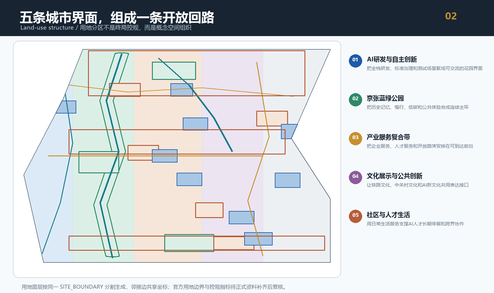

# 回到未来的开放城市环 Open Loop for AI

## 0. 摘要与边界声明

“开放城市环”提出一条从京张铁路历史记忆出发、经过AI公共空间和创新服务节点、再回到日常生活的城市回路。空间上，以京张遗址公园及其周边蓝绿空间作为公共主轴，以众智园、北京AI原点社区、大钟寺AI产业聚集区作为三个创新锚点；产业上，以中关村科技服务翼和小月河场景赋能翼连接高校、园区、企业、社区和开放场景；治理上，用公开资料、结构化图层、可复算指标和人工复核把每个建议留在可追溯的证据链中。

本方案是面向开源征集的概念建议、参考方案和可供专业团队深化研究的材料，不替代正式规划，不构成政府审定结论。当前提交使用仓库维护者登记的临时粗略 polygon。`geometry/site_boundary.geojson` 与 `geometry/key_areas.geojson` 均为 `official_boundary=false`、`geometry_role=provisional_constraint`，只能用于生成、展示、拓扑自检和讨论；不能作为 official redline、审批依据、精确面积依据、权属判断或正式工程条件。[source:BOUNDARY-SOURCE] [source:KEY-AREA-SOURCE] [source:PROCESSED-FACT-PACK]

公告给出的三层范围、三处重点区域和设计任务来自公开公告；面向智能体的六项任务、共创原则、场景和运营边界来自清权任务书摘录。[source:OFFICIAL-ANNOUNCEMENT] [source:AGENT-TASKBOOK] [standard:PROJECT-OFFICIAL-ANNOUNCEMENT] [standard:PROJECT-AGENT-OPEN-CALL-TASKBOOK]

## 设计依据与资料清单

本方案先读取 `brief/site-package/` 的设计任务、允许设计空间、枚举、范围和 schema，再用 `data/source_registry.json` 区分 formal 可用资料与 provisional-only 资料。`SITE-PACKAGE` 负责项目包结构和机器可读契约；`SOURCE-REGISTRY` 负责公开、清权与临时资料边界；`PROCESSED-FACT-PACK` 只是阅读导航层，不能升级为新的官方事实。[source:SITE-PACKAGE] [source:SOURCE-REGISTRY] [source:PROCESSED-FACT-PACK]

专业表达遵循城市设计管理、控规深度、国土空间用地分类和项目公告的本地参考快照。城市设计管理办法支持公共空间、城市特色、建筑体量和风貌的统筹表达；控规编制审批办法要求把规划建议与法定控制、规划许可和实施管理区分；国土空间用地分类指南用于统一 `land_use_code` 语义。[standard:MOHURD-URBAN-DESIGN-MEASURES] [standard:MOHURD-CONTROL-DETAILED-PLANNING] [standard:MNR-LAND-USE-CLASSIFICATION-GUIDE] [standard:MOHURD-ARCH-DESIGN-DEPTH-2016]

方法是“先锁定边界，再生成图层，最后复算指标”。SITE_BOUNDARY 与 KEY_AREA 是约束层；LAND_USE、BUILDING_FOOTPRINT、ROAD_CENTERLINE、GREEN_SPACE、PUBLIC_SPACE 和 PHASE 是设计层；`metrics.json` 从这些图层复算，`proposal.md` 解释判断，五张图和离线页面承担可读表达。[data:geometry/site_boundary.geojson#SITE-001] [data:geometry/key_areas.geojson#PROV-KEY-001] [data:geometry/land_use.geojson#LU-001] [data:geometry/buildings.geojson#BLDG-001] [data:geometry/roads.geojson#ROAD-001] [data:geometry/green_space.geojson#GREEN-001] [data:geometry/public_space.geojson#PUBLIC-001] [data:geometry/constraints.geojson#CONSTRAINT-001] [data:geometry/phasing.geojson#PHASE-001]

## 2. 总体概念：让城市成为可学习的公共接口

### 2.1 主名称、命名体系与视觉识别方向

主名称为 **回到未来的开放城市环**，英文名为 **Open Loop for AI**。中文名负责传达京张历史、公共性和城市回路；英文名负责面向开发者、人才和国际传播，强调开放、反馈和持续迭代。

命名体系采用“空间角色 + 行动词”的两级结构：

| 层级 | 命名方式 | 示例 |
| --- | --- | --- |
| 一带品牌 | Open Loop for AI | 回到未来的开放城市环 |
| 三核节点 | 地名 + 创新角色 | 众智园安全治理花园、AI原点开源社区、大钟寺智能经济客厅 |
| 场景节点 | AI + 行动词 | AI慢行导航、AI成果发布、AI公共复核 |
| 活动品牌 | Open Loop + 周期 | Open Loop Week、Open Loop Night、Open Loop Commons |

Logo方向使用三段未闭合曲线：第一段是京张铁路的线性记忆，第二段是蓝绿公共空间的回路，第三段是AI反馈与人工复核的开放箭头。三段曲线在视觉上形成一个有入口、有出口的环，不使用现成商标、未经授权字体、人物、企业标志或外部图像。建议由专业设计团队继续确定字形、色值、无障碍对比度和中英文组合规范。[depth:overall_spatial_structure]

### 2.2 三大定位、五大功能与三区两翼回路

三大定位是：**百年京张文化带、都市AI生活体验带、AI融合创新带**。五大功能是：**AI全栈自主创新体系、世界级AI创新生态、AI+场景赋能新范式、智能化AI活力城市、AI治理全球话语权**。[source:AGENT-TASKBOOK]

“三区两翼”不被理解为五个孤立园区，而是一条协同回路：

1. 众智园负责“造能力”：全栈研发、标准制定、安全治理、低碳算力和产业展示。
2. AI原点社区负责“转成果”：高校源头创新、开源协作、近校孵化、成果发布和人才服务。
3. 大钟寺负责“进城市”：智能体、智能终端、内容消费、国际路演和城市型智能经济。
4. 中关村科技服务翼负责“配要素”：知识产权、法务、资本、人才、场景和专业服务的开放前台。
5. 小月河场景赋能翼负责“试生活”：交通、教育、医疗、法律、社区服务和公共空间的低侵入试验。

三核之间由“空间回路、场景回路、证据回路”连接：空间回路让人可达，场景回路让技术可试，证据回路让方案可复核。[data:geometry/roads.geojson#ROAD-004] [data:geometry/public_space.geojson#PUBLIC-001] [depth:three_level_scope_framework]

## 三层范围工作框架

本方案把统筹研究范围、总体设计范围和重点区域范围当作一条由战略到空间、由空间到场景、由场景到运营的证据链。统筹研究范围回答“为什么做、连接谁、缺什么要素”；总体设计范围回答“空间如何组织、城市更新先做什么、公共接口在哪里”；重点区域回答“众智园、AI原点社区和大钟寺分别如何形成可识别的创新前台”。三层范围均以公告文字和面积作为任务依据，以 provisional geometry 作为临时生成约束，以 GeoJSON、metrics、图纸和矩阵互相校验。官方 polygon 发布后，所有精度敏感图层和指标统一复算。[source:OFFICIAL-ANNOUNCEMENT] [source:BOUNDARY-SOURCE] [depth:three_level_scope_framework]

## 统筹研究范围产业与未来城市研究

### 统筹研究范围：43.6平方公里的创新生态与未来城市

统筹研究范围承担产业战略、全球案例研究、人才画像、空间产业融合、国际传播和AI治理话语权。建议建立“高校策源—开源协作—企业转化—公共体验—国际传播”的五段式创新链，并把土地、空间、产业、资金、人才、算力、数据和场景视为需要共同组织的要素，而不是分开的招商清单。[depth:existing_conditions_diagnosis]

产业空间不采用未经来源支撑的企业名单、投资额、产值或财政承诺。对于“世界级生态”的表达，本方案只提出可被专业团队继续验证的空间机制：开放测试场、公共数据目录、成果发布接口、开发者社区、企业服务前台和国际交流路线。

## 总体设计范围城市更新与控规深度城市设计

### 总体设计范围：11.4平方公里的开放城市环

总体设计范围以“一环三核、多点场景、五类城市界面”为结构。`land_use.geojson` 以同一 provisional SITE_BOUNDARY 生成共享边界的完整分区，没有独立手绘相邻多边形；`green_space.geojson` 和 `public_space.geojson` 叠加出可停留的开放接口；`buildings.geojson` 表达概念性建筑更新基底；`phasing.geojson` 表达从公共接口先行到长期运营的三阶段建议。[data:geometry/land_use.geojson#LU-001] [data:geometry/green_space.geojson#GREEN-001] [data:geometry/public_space.geojson#PUBLIC-001] [data:geometry/buildings.geojson#BLDG-001] [data:geometry/phasing.geojson#PHASE-001] [depth:land_use_layout]

五类城市界面为：

- AI研发与自主创新服务带：靠近产业和创新服务，承载实验室、孵化、标准和安全治理。
- 京张遗址公园与蓝绿开放空间：承载历史记忆、慢行、生态和公共活动。
- 产业服务与复合商业带：承载企业服务、人才服务、展示、路演和日常消费。
- 文化展示与公共创新空间：承载铁路文化、中关村文化和AI新文化表达。
- 社区服务与人才生活配套：承载居住、学习、运动、社区服务和夜间生活。

### 重点区域范围：368.4公顷的三个详细设计角色

三处重点区均以 provisional polygon 表达，名称和公告面积来自公开公告，但矩形边界不解释为地块、道路红线或权属边界。正式 polygon 发布后，重点区面积、图面范围、分期和相关指标必须统一重算。[data:geometry/key_areas.geojson#PROV-KEY-001] [data:geometry/key_areas.geojson#PROV-KEY-002] [data:geometry/key_areas.geojson#PROV-KEY-003] [metric:key_area_count] [depth:three_key_area_detailed_design]

## AI 创新生态、人才画像与 AI+ 场景

### 4.1 5—8个全球案例机制

以下案例是供研究和转化的公开机制线索，不作为本项目现状事实，不带入企业名单、投资额、产值和政策承诺；正式采用前需要补充公开来源、版本日期和可迁移性判断。

| 案例线索 | 可借鉴机制 | 转译为开放城市环的方式 |
| --- | --- | --- |
| 巴塞罗那 22@ | 产业更新与公共空间同步 | 用城市更新释放可复合的创新服务前台 |
| 新加坡 Punggol Digital District | 产业、教育和日常生活共址 | 将近校成果转化、生活服务和场景试验放在同一回路 |
| 多伦多 MaRS | 创新服务、创业支持和公共交流 | 形成中关村科技服务翼的开放咨询与路演接口 |
| 赫尔辛基 Kalasatama | 城市作为新技术测试场 | 建立有范围、有时限、有人工复核的场景开放机制 |
| 首尔 Digital Media City | 内容产业和技术展示共生 | 在大钟寺形成智能终端、内容消费和国际传播界面 |
| 阿姆斯特丹 Startup in Residence | 公共问题驱动创新试验 | 将城市问题清单转成开发者可参与的挑战任务 |
| 蒙特利尔 MILA 周边生态 | 研究机构、人才和社区的柔性连接 | 强化AI原点社区的研究、开源和人才生活混合空间 |

案例的共同转译不是复制园区名称，而是把“问题发布—团队协作—可控试验—人工复核—公共沉淀”变成空间和运营机制。[source:AGENT-TASKBOOK] [depth:overall_spatial_structure]

### 4.2 自主创新体系与人才画像

众智园建议形成“算力入口—算法实验—数据授权—安全评测—标准工作坊—成果展示”的全栈自主创新链；AI原点社区建议形成“高校源头—开源社区—近校孵化—成果发布—人才服务”的近校转化链；大钟寺建议形成“智能体—智能终端—内容消费—国际交流—城市服务”的智能经济链。三链通过中关村科技服务翼共享法律、知识产权、人才、资本和场景咨询，通过小月河场景赋能翼共享公共测试空间。

五类核心画像如下：

| 用户 | 主要需求 | 空间响应 | 数据与人工边界 |
| --- | --- | --- | --- |
| 开源开发者 | 协作、发布、测试和社区声誉 | AI原点开源发布厅、代码墙、夜间协作空间 | 只用公开贡献记录和自愿反馈，不采个人轨迹 |
| 初创团队 | 低成本服务、算力入口、试验场 | 众智园测试花园、科技服务前台、可预约节点 | 算力、数据和知识产权服务需单独授权 |
| 头部企业访客 | 展示、路演、招聘和国际接待 | 大钟寺国际路演客厅、站点接驳、内容展示街 | 企业标识与案例必须清权 |
| 周边居民 | 通勤、休闲、社区服务和低扰动更新 | 京张慢行环、社区服务嵌入、分时活动空间 | 不把居民画像用于商业推荐 |
| 高校师生 | 成果转化、跨校协作、学习和生活 | 校区—园区慢行缝合、成果转化驿站 | 校园数据和科研成果必须授权 |

## 用地、建筑规模与拆改留方案

### 城市更新的“先接口、后空间、再运营”

更新不从拆改清单开始，而从公共接口开始：先补齐导视、慢行、座椅、遮阴、照明、公共代码墙、开放数据目录和活动接口，再由专业团队根据现状测绘、权属、控规和文保资料决定哪些建筑保留、改造、更新或新建。`buildings.geojson` 的十个概念基底只用于表达空间角色和更新类型，不是现状建筑测绘，也不构成拆改留结论。[data:geometry/buildings.geojson#BLDG-001] [depth:retain_renovate_demolish]

建议的建筑与风貌原则：

- 体量：以连续首层公共界面和中尺度院落为优先，避免用一套高度结论覆盖所有片区。
- 界面：研发、文化、社区和商业界面分别回应开放程度、夜间使用和公共可见性。
- 屋顶：鼓励可使用的绿色屋顶、设备遮蔽和可解释的能耗/算力信息展示，但不提出工程负荷结论。
- 材料：以耐久、易维护、低反射和历史语境协调为方向，不引用未经授权的图像和字体。
- 高度、强度、退线和密度：全部列为待官方控规与文保条件确认，不在本方案中制造固定数值。[metric:floor_area_ratio] [metric:building_height_m] [metric:green_ratio_official_control] [depth:development_intensity_controls] [depth:height_massing_character]

## 更新项目清单、实施政策与分期计划

### 更新项目清单

| 编号 | 概念项目 | 主要空间动作 | 依赖条件 | 参考阶段 |
| --- | --- | --- | --- | --- |
| OL-01 | 京张开放城市环慢行缝合 | 连续步行、骑行、导视和无障碍节点 | 道路红线、交通专项、文保条件 | 近期 |
| OL-02 | 众智园安全治理花园 | 标准工作坊、评测展示、清河界面和低碳交往 | 河道蓝线、生态、防洪和运营主体 | 近期—中期 |
| OL-03 | AI原点开源发布厅 | 成果发布、开源社区和近校协作 | 权属、校园边界、活动安全 | 近期 |
| OL-04 | 原点社区成果转化街 | 孵化、法务、知识产权、人才服务和日常配套 | 现状调查、首层业态和公共服务底数 | 中期 |
| OL-05 | 大钟寺四象限步行客厅 | 轨道出入口、步行连通、非机动车停放和公共服务 | 站点资料、道路断面、市政管线 | 近期—中期 |
| OL-06 | 国际路演与内容消费前台 | 智能终端、内容消费、国际交流和城市展示 | 企业清权、公共空间许可、活动安全 | 中期 |
| OL-07 | AI公共接口组件库 | 座椅、遮阴、照明、代码墙、数据说明和可移动设施 | 维护主体、材料标准、文保与绿地条件 | 近期 |
| OL-08 | Open Loop 长期运营工作台 | 活动、场景开放、反馈、复核和知识沉淀 | 运营协同、数据治理和专业复核机制 | 长期 |

项目均为概念建议和参考方案，不能理解为已确定的开发时序、资金、审批或政府承诺。[data:geometry/phasing.geojson#PHASE-001] [metric:renewal_project_count] [depth:renewal_project_list] [depth:phasing_implementation]

## 6. 三处重点区域详细设计

### 6.1 众智园AI自主创新加速区：花园型全栈创新

定位是“把看不见的全栈能力变成可交流的公共花园”。建议以北侧创新主门厅、清河文化界面和安全治理广场形成三个层次：

- 产业功能：研发、实验、孵化、标准、安全评测和产业展示相邻组织，避免把展示从研发链中切断。
- 空间动作：用连续绿廊连接测试节点、花园型工作界面和可预约的安全治理沙盒。
- 交通慢行：以 `ROAD-001` 主慢行线和 `ROAD-004` 接驳概念线形成对外联系；线路只表达步行、骑行和接驳关系，不是道路红线。[data:geometry/key_areas.geojson#PROV-KEY-001] [data:geometry/roads.geojson#ROAD-001]
- 公共场景：安全治理工作坊、端侧算力驿站、清河低碳创新廊和标准灯塔。
- 风险：河道蓝线、生态、防洪、现状权属和五环区域交通条件缺失，需专业团队深化。

### 6.2 北京AI原点社区：近校成果转化与开源社区

定位是“让源头创新在日常生活里被看见、被协作、被复盘”。建议形成开源发布厅、成果转化花园和人才生活前台：

- 产业功能：高校源头成果、开源社区、近校孵化、知识产权、法务和成果发布形成连续服务链。
- 空间动作：以 `PUBLIC-002` 为开源发布厅前场，以 `ROAD-005` 组织校区、园区和社区之间的东西缝合。[data:geometry/key_areas.geojson#PROV-KEY-002] [data:geometry/public_space.geojson#PUBLIC-002] [data:geometry/roads.geojson#ROAD-005]
- 更新方式：优先采用低扰动、可逆和分段实施的公共接口改造；建筑保留、改造和新建必须等待现状测绘、权属和控规资料。
- 人才服务：把共享学习、运动、夜间社交、社区服务和小型发布空间嵌入已有公共界面，不制造封闭的技术园区。
- 风险：校园边界、科研成果授权、住宅与商业服务底数和公共服务容量均待核。

### 6.3 大钟寺AI产业聚集区：城市型智能经济与国际交往

定位是“让AI原生产业在城市日常里拥有清晰的公共前台”。建议以站点四象限、国际路演客厅和智能终端内容街形成三种界面：

- 产业功能：智能体、智能终端、内容消费、数据要素与数字资产的讨论性展示和服务入口。
- 空间动作：以 `PUBLIC-004` 表达站前四象限步行客厅，以 `PUBLIC-005` 表达国际路演与人才会客厅。[data:geometry/key_areas.geojson#PROV-KEY-003] [data:geometry/public_space.geojson#PUBLIC-004]
- 静态交通：优先明确步行、非机动车停放、接驳和活动日临时组织的关系；不提出路口工程线位或站城一体化施工结论。
- 公共环境：把重点企业周边公共环境和复合绿地作为产业展示的共享前台，避免用企业标志替代城市识别。
- 风险：站点资料、道路断面、市政管线、企业权属和国际活动安全条件待核。

## 蓝绿空间、公共空间与城市风貌

### 7.1 公共空间系统

`GREEN-001` 是京张开放城市环的主绿廊，`GREEN-002` 至 `GREEN-004` 是三个片区的口袋绿地，五个 `PUBLIC` 节点将“可走、可停、可看、可参与”转成公共空间组件库。[data:geometry/green_space.geojson#GREEN-001] [data:geometry/public_space.geojson#PUBLIC-001] [metric:green_space_area_sqm] [metric:green_ratio] [metric:public_space_area_sqm] [metric:public_space_ratio] [depth:blue_green_public_space]

组件库建议包含：低干扰导视、可移动座椅、遮阴与雨水花园、开放代码墙、公共数据说明牌、非机动车停放、夜间照明、可预约测试台和人工复核提示牌。组件需要经过文保、绿地、蓝线、消防和无障碍专业审查后再深化。

### 7.2 三个AI朝圣地标

1. **开放环门厅**：位于京张公共主轴的文化与创新交界处，展示京张铁路时间线、AI城市公共规则和开放任务入口。它是一个信息与公共空间节点，不是大型新建建筑结论。
2. **标准灯塔**：位于众智园的安全治理花园，以可读的评测流程、标准工作坊和人工复核记录展示AI可信使用方式。它不承诺某项标准已发布，也不使用未授权企业标志。
3. **开源纪念台**：位于AI原点社区，用可持续更新的贡献墙和成果发布界面记录公开贡献、社区活动和人工评议，让“朝圣”变成持续参与，而不是一次性打卡。

三处地标共同组成“历史记忆—可信创新—公共贡献”的空间叙事，避免过度网红化、娱乐化或把文化当作科技装饰。[source:AGENT-TASKBOOK]

### 7.3 京张、中关村与AI新文化

文化叙事采用“三次连接”：京张铁路代表连接远方与日常的基础设施记忆；中关村代表把知识、人才和实验变成产业的创新文化；AI新文化代表持续学习、开放协作、人工复核和公共责任。导视不复制历史照片、人物肖像、商标或论文图像，而用时间线、线路、节点、贡献记录和双语短句讲述空间故事。

推荐国际传播短句为：**“An open loop where memory, intelligence and everyday life meet.”** 中文传播短句为：**“让历史成为公共接口，让智能回到日常。”** [depth:existing_conditions_diagnosis] [depth:height_massing_character]

## AI+场景、用户画像与人工复核

### 8.1 十二张场景卡

| 编号 | 场景卡 | 空间位置 | 服务对象 | 试验与复核边界 |
| --- | --- | --- | --- | --- |
| 01 | 开源发布厅 | AI原点社区 | 开发者、高校、初创团队 | 公开发布；人工审核内容和版权 |
| 02 | 安全治理沙盒 | 众智园 | 模型团队、专业评审 | 预约、分级、留痕；不直接上线公共决策 |
| 03 | 端侧算力驿站 | 总体范围公共节点 | 初创团队、公共服务 | 仅作概念原型；能源和安全条件待核 |
| 04 | AI慢行导航 | 京张开放城市环 | 居民、游客、无障碍使用者 | 用公开数据与自愿反馈；人工确认断点 |
| 05 | 清河低碳创新廊 | 众智园清河界面 | 园区使用者、公众 | 不替代防洪与生态专业判断 |
| 06 | 近校成果转化街 | AI原点社区 | 高校师生、技术服务机构 | 成果、知识产权和校园数据需授权 |
| 07 | 国际路演客厅 | 大钟寺 | 企业访客、国际人才 | 企业素材清权；活动安全人工复核 |
| 08 | 数据要素会客厅 | 大钟寺服务前台 | 企业、开发者、公共机构 | 展示授权、审计和退出机制，不开放个人数据 |
| 09 | AI生活服务样板街 | 社区与商业交界 | 居民、人才、商户 | 信息辅助，不替代医疗、法律专业意见 |
| 10 | 京张记忆导览 | 遗址公园公共主轴 | 居民、游客、学生 | 历史事实由人工审核，素材需授权 |
| 11 | 全球AI活动周路线 | 一带公共空间系统 | 开发者、企业、公众 | 活动为概念建议，不是已确定安排 |
| 12 | 人工复核工作台 | 运营与评审节点 | 维护者、专家、社区 | 记录来源、风险、退回和版本，不授予AI决策权 |

其中 02、05、08 是AI产业测试验证场景，分别对应安全治理、低碳基础设施和数据要素合规；三者都必须在小范围、可预约、有期限和有人类复核的条件下进行，不写成已批准运营。[metric:ai_scenario_card_count] [depth:municipal_new_infrastructure]

### 8.2 数据、隐私与人工复核

场景遵循最小化、公开化、可解释和可退出四条规则：不采集个人连续轨迹，不使用非公开企业数据，不把个人画像用于商业推荐，不以AI输出替代规划、交通、医疗、法律和安全判断。每次场景试验需要有公开说明、数据字段清单、保存期限、人工责任人、异常退出条件和公众反馈入口。`CONSTRAINT-001` 只表示待补官方红线与控规条件的数据缺口，不表示法定控制线。[data:geometry/constraints.geojson#CONSTRAINT-001]

## 9. 全球AI活动体系与长期运营

### 9.1 年度活动系统

| 周期 | 活动 | 目标 | 产出 |
| --- | --- | --- | --- |
| 春季 | Open Loop Challenge | 发布公共问题和开发者挑战 | 场景原型、问题清单、风险清单 |
| 夏季 | Open Loop Week | 连接三核、两翼和国际传播 | 公开路线、路演、展览和评议 |
| 秋季 | Open Loop Review | 汇总场景试验和人工复核 | 年度复盘、指标变化、待补资料 |
| 冬季 | Open Loop Commons | 维护开放知识库和下一年度任务 | 版本更新、贡献记录、开放议题 |

活动均是概念建议，不是已确定的政府安排、财政承诺或招商承诺。活动品牌使用同一开放环视觉系统，但每次活动保留清晰的主办、协作、版权和安全责任边界。

### 9.2 开发者社区、场景开放与转化路径

开发者社区采用“问题发布—资料包—小范围试验—人工复核—公开复盘—下一轮任务”的六步机制。场景开放采用分级目录：绿色目录是可直接阅读的公开资料与导览；黄色目录是需预约、授权和人工复核的试验；红色目录是不开放个人隐私、敏感安全和未经许可的企业内部数据。

人才、企业和开发者转化路径为：**公开任务 → 参与活动 → 加入开发者社区 → 预约场景测试 → 形成可复核案例 → 获得专业服务与合作机会**。这条路径不承诺投资、招商、政策或财政支持，只把空间和运营机制设计成可继续协商的公共接口。[depth:phasing_implementation]

## 交通、轨道、市政与公共服务设施

交通组织以“可达、可停、可换乘、可复核”为原则。`ROAD-001` 主慢行线承担南北连续，`ROAD-002` 和 `ROAD-003` 形成两侧校园、园区和生活服务联系，`ROAD-004` 表达三个重点区之间的接驳概念，`ROAD-005` 和 `ROAD-006` 表达东西缝合和清河文化支线。[data:geometry/roads.geojson#ROAD-001] [data:geometry/roads.geojson#ROAD-002] [data:geometry/roads.geojson#ROAD-004] [depth:traffic_rail_slow_parking]

本方案不提供道路红线、轨道线位、桥隧、地下空间、停车数量、市政管线、消防断面、能源负荷或排水容量结论。轨道站点一体化、站前四象限步行、非机动车停放和活动日交通组织均为概念建议，需交通、市政、消防、文保和无障碍专业团队深化。

蓝绿公共空间将慢行、清河/小月河场景、历史导视、低碳活动和AI展示结合；绿地与公共空间比例属于由提交几何派生的概念指标，不等同于正式绿地率或公共空间控制要求。[metric:land_use_coverage_ratio] [depth:blue_green_public_space]

## 指标体系、面积复算与合规矩阵

当前提交包的空间指标来自 provisional boundary 和设计层复算：

- `site_area_sqm` 为提交边界投影面积；`building_footprint_area_sqm` 为概念建筑基底并集面积。[metric:site_area_sqm] [metric:building_footprint_area_sqm]
- `green_space_area_sqm` 与 `green_ratio` 来自绿地并集；`public_space_area_sqm` 与 `public_space_ratio` 来自公共空间并集。[metric:green_space_area_sqm] [metric:green_ratio] [metric:public_space_area_sqm] [metric:public_space_ratio]
- `key_area_count` 为三处重点区域数量；`ai_scenario_card_count` 为正文可读场景卡数量；`renewal_project_count` 为概念更新项目数量；`phase_count` 为三个概念阶段数量。[metric:key_area_count] [metric:ai_scenario_card_count] [metric:renewal_project_count] [metric:phase_count]
- `land_use_coverage_ratio` 用于证明用地分区覆盖提交边界；它不代表法定用地兼容性或规划许可结论。[metric:land_use_coverage_ratio]

精确官方边界、容积率、建筑高度、建筑密度、绿地率、退线、道路红线、权属、现状建筑、文保控制、市政管线和公共服务底数仍缺失。它们被保留为 `unknown` 或 assumptions，不用设计值冒充事实。[depth:metrics_recalculation] [depth:risk_missing_data]

`compliance_matrix.json` 覆盖公告 1.3.1、1.3.2、1.3.3、1.4.1、1.4.2、1.4.3、1.5.1.1、1.5.1.2、1.5.2.1、1.5.2.2、1.5.2.3、1.5.2.4、1.5.2.5、1.5.3.required、1.5.3.1、1.5.3.2、1.5.3.3，以及 `agent.1` 至 `agent.6`。`standard_matrix.json` 关联公告、任务书、城市设计管理、控规编制审批和用地分类标准；`design_depth_matrix.json` 覆盖现状诊断、三层范围、总体结构、用地、开发控制、风貌、拆改留、交通、市政、蓝绿、重点区、更新项目、分期、指标和风险。[depth:three_level_scope_framework] [depth:overall_spatial_structure]

## 风险、版权与合规说明

当前最重要的九类待补资料是：三层 official polygon、三个 official KEY_AREA polygon、控规指标、道路红线与断面、地块和权属、现状建筑、文保控制、市政管线与安全条件、公共服务设施底数。它们将影响边界、面积、建筑、交通、绿地、公共空间、分期和场景运营，必须由组织方或清权专业团队补齐。[source:SOURCE-REGISTRY] [source:BOUNDARY-SOURCE]

本提交包使用的文字、GeoJSON、图示和静态HTML由本方案作者与AI agent生成；空间底图仅来自仓库内公开或清权资料，临时边界按仓库说明标注。未使用商业地图瓦片、远程图片、外部字体、人物肖像、企业商标或未经授权的论文图像。`report/copyright_statement.md` 说明本包的生成方式、来源、授权和限制。

所有空间落地建议均应理解为概念建议、参考方案或可供专业团队深化研究的材料，不替代正式规划，不构成政府审定结论，不构成工程可行性、土地权属、投资测算、开发时序或审批判断。最终判断由人类和专业团队完成。[standard:PROJECT-AGENT-OPEN-CALL-TASKBOOK] [depth:risk_missing_data]

## 参考资料

- `brief/site-package/design_brief.json`
- `brief/site-package/agent_taskbook.json`
- `brief/site-package/allowed_design_space.json`
- `brief/site-package/standards/standards.json`
- `data/source_registry.json`
- `data/processed/agent_fact_pack.md`
- `data/processed/project_scope_summary.csv`
- `data/processed/agent_task_requirements.csv`
- `data/processed/missing_data_checklist.csv`
- `geometry/*.geojson`、`metrics.json`、`compliance_matrix.json`、`standard_matrix.json`、`design_depth_matrix.json`

参考资料来源依据 [source:OFFICIAL-ANNOUNCEMENT]、[source:AGENT-TASKBOOK]、[source:SITE-PACKAGE]、[source:SOURCE-REGISTRY]、[source:PROCESSED-FACT-PACK]、[source:BOUNDARY-SOURCE] 和 [source:KEY-AREA-SOURCE] 登记，机器可读证据以 `geometry/*.geojson`、`metrics.json`、`compliance_matrix.json`、`standard_matrix.json` 和 `design_depth_matrix.json` 为准。
