# X JINGZHANG

> **Let city questions enter research along Jing-Zhang, and let AI answers return along the same line to daily life.**

## Jing-Zhang does not lack innovation resources. It lacks a public line between questions and answers

The first phase of the Jing-Zhang Railway Heritage Park has already converted roughly nine kilometres of railway corridor into open public space while retaining memories of the main line, old rail, turnouts and Qinghuayuan Station. [source:BEIJING-JZ-PARK-PHASE1] [source:BEIJING-JZ-PARK-9KM]

Universities, research campuses, neighbourhoods, metro stations, commerce and blue-green spaces sit along it. The brief assigns full-stack innovation, technology translation, urban AI experience and the three-zone/two-wing ecosystem to different places on this corridor. Jing-Zhang already contains both urban questions and innovation capacity. What is missing is public infrastructure that lets the two meet repeatedly, work together and leave shared outcomes. [source:OFFICIAL-ANNOUNCEMENT] [source:AGENT-TASKBOOK]

Today's missing links are not only roads. A neighbourhood's mobility difficulty, a riverside maintenance issue or an accessible-transfer problem rarely arrives at a developer as a workable test condition. University and enterprise prototypes likewise lack a continuous public interface for reproduction, joint improvement and real-life use. Urban questions remain at the complaint desk while technical answers remain inside labs or displays. X Jingzhang turns the heritage line into a **public innovation line**: questions enter laterally, move through co-development, opening and use, then return upstream with new field conditions.

| First-principles diagnosis | X Jingzhang response |
| --- | --- |
| Already present | An open heritage corridor with research, industry, neighbourhoods and daily life on both sides |
| Actually missing | A continuous public interface from city question to research, from research to life and from lived feedback back to research |
| AI value | Turn real problems into testable conditions, open tools and public capabilities that ordinary users can use and change |
| Jing-Zhang role | Lines connect phases; stations organise handovers; turnouts match problems with capabilities; return carries feedback upstream |

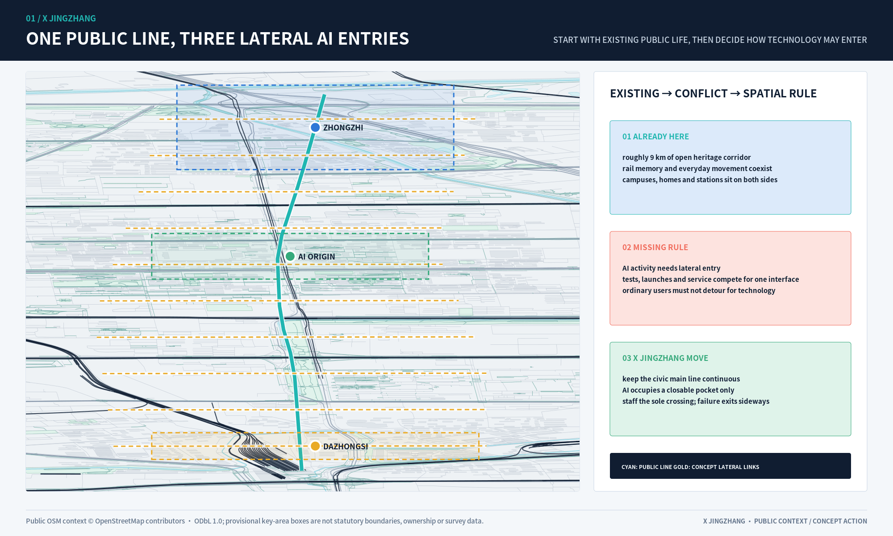

> **Evidence boundary:** the overall and key-area geometries are provisional constraints. They support concept relationships, public map slices and package recomputation only. Official boundaries, controls, ownership, field dimensions, engineering conditions and operators require a rebuild; no concept space is presented as approval or delivery commitment.

## The three stations are an innovation chain, not three gates

Their sequence comes from urban roles assigned by the official brief, not from a convenient product flow. Northern Zhongzhi combines full-stack innovation, a garden research district and Qinghe ecological scenes, so it turns urban questions into prototypes. Near-campus AI Origin connects original research, translation, open source, talent life and public events, so it turns prototypes into reproducible, collaborative public capabilities. Southern Dazhongsi combines transit arrival, intelligent terminals, commerce and high-frequency daily life, so it asks whether those capabilities actually improve life and generates the next question. [source:OFFICIAL-ANNOUNCEMENT] [source:HAIDIAN-2025-STATISTICAL-BULLETIN] [source:HAIDIAN-AI-ORIGIN-PLAN]

| Place | Primary urban duty | Why people come | Professional foundation |
| --- | --- | --- | --- |
| Zhongzhi | **Turn questions into prototypes** | Developers co-build in open lab courts, a robot test street, ecological fixtures and workbenches; residents and children can observe and propose conditions | BUILD contains TEST; test space can close, stop and evacuate while the civic path remains continuous |
| AI Origin | **Turn prototypes into public capabilities** | Universities, developers and start-ups reproduce and improve work in an open hall, prototype workshop, open-source theatre and city-question wall | OPEN contains RELEASE; method, rights, responsibility and withdrawal remain visible together |
| Dazhongsi | **Put capabilities into daily life** | Commuters, older people, children, residents, shopkeepers and staff use and evaluate services in transit, commerce and community life | LIVE contains USE; staffed equivalents, the accessible chain and a question-return desk operate in parallel |

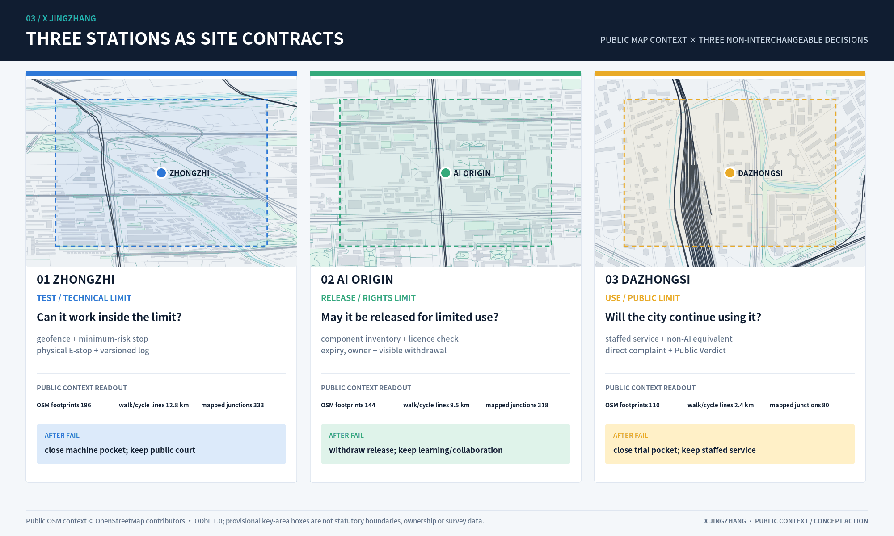

## One city question travels the whole line

The brief explicitly asks for better station integration and four-quadrant walking connections at Dazhongsi. Without inventing a surveyed defect, X Jingzhang converts that task into a field question to be verified: **can a 72-year-old non-digital user complete an accessible arrival through a complex interchange with clear, staffed support?** Residents, commuters and service staff frame the question at Dazhongsi. Zhongzhi converts crowding, device parking, spectators and human takeover into repeatable conditions and builds a low-speed service prototype. AI Origin opens the method and interface for reproduction by developers and accessibility professionals. The product then returns to Dazhongsi for limited use. [source:OFFICIAL-ANNOUNCEMENT] [data:visual/assets/lived-lifecycle.json]

Ms Zhou can report without a phone that the device has not collided with anyone, yet its parking and spectators still invade the priority route. Staff pause the trial, keep staffed service operating and turn “device parking + spectators + wheelchair priority” into a new urban question. Version 0.10 carries that condition back to Zhongzhi. RETURN is not simply rejection; it is the moment when lived experience changes the next round of research. SC-03 is a tool for answering the question, not the protagonist of the line. [data:visual/assets/lived-lifecycle.json] [data:visual/assets/x-lifecycle-valid-example.json]

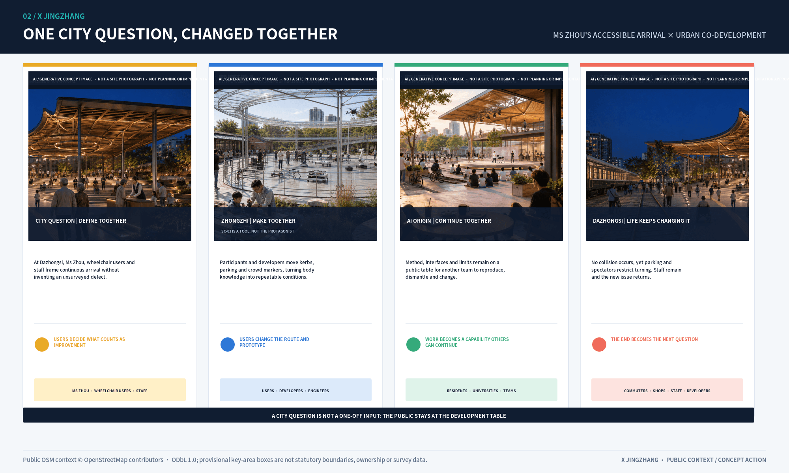

### Why this must happen along Jing-Zhang

Jing-Zhang is not a landscape axis connecting three AI halls. It is an existing urban operating logic. A line turns separated nodes into one system. Stations hand work between different actors. Sidings hold temporary research and experiments. Turnouts match laterally arriving city questions with suitable capabilities. Sections let each station work independently. Return carries a problem exposed in daily use back to an earlier section for repair and upgrade. Risk controls remain, but railway language first organises **how questions and answers move**. [source:NRA-TECHNICAL-RULES] [source:BEIJING-JZ-PARK-PHASE1] [data:visual/assets/railway-operating-translation.json]

The order follows a real urban gradient: full-stack research and ecological testing in the north; university ideas, open collaboration and translation in the centre; transit, commerce and high-frequency public life in the south. Communities, campuses, industrial parks, Xiaoyue River and regional capabilities enter laterally at different stations. Jing-Zhang organises them longitudinally as a public innovation line that can be travelled both ways. A sealed technology park could not continuously receive everyday problems and return answers to the same public corridor. [source:OFFICIAL-ANNOUNCEMENT] [data:geometry/key_areas.geojson#PROV-KEY-001] [data:geometry/key_areas.geojson#PROV-KEY-003]

The public main line, AI sidings, staffed turnouts and three records remain, but at a different level. The main line carries long-term civic life and its questions. Sidings hold temporary research. A turnout is a human match between a question and a capability. RETURN is an input to the next research cycle. Test Receipt, Release Ticket and Public Verdict record professional decisions inside BUILD, OPEN and LIVE; fields, states and machine checks sit in the appendix. [data:visual/assets/verify-x-lifecycle.js] [metric:x_lifecycle_test_case_count]

## Coordinated Research Area: Industry and Future City Research

The first reading layer retains one innovation chain: **city question - co-develop at Zhongzhi - open at AI Origin - use at Dazhongsi - return with a new question**. TEST-RELEASE-USE-RETURN, two wings, ten stitches, fourteen ledgers, twelve scenes and three delivery gates remain as professional support for testing, opening, feedback and accountable failure. [source:OFFICIAL-ANNOUNCEMENT] [source:AGENT-TASKBOOK]

At coordination scale, communities and Xiaoyue River provide everyday and ecological questions; universities and science cities provide research and talent; Zhongzhi provides full-stack development; AI Origin provides open collaboration and translation; the technology-service wing provides IP, capital and professional services; Dazhongsi provides lived use and market feedback; E-Town is a candidate manufacturing interface; Beijing-Tianjin-Hebei supplies different urban questions and replication conditions. None is an assumed partner. X Jingzhang's planning innovation is to organise need, research, translation, use and feedback along one public-space chain. [data:geometry/site_boundary.geojson#SITE-001] [depth:overall_spatial_structure]

## Design Basis and Source List

The official announcement establishes tasks, textual scopes, approximate areas, and three key areas. The agent taskbook establishes three positions, five functions, the three-zone/two-wing structure, and agent.1-agent.6. Local standard snapshots constrain planning language. The overall and key-area geometries remain `provisional_constraint`; derived areas serve package consistency only. When official polygons arrive, all GeoJSON, metrics, drawings, bilingual HTML, A3/A0 files, and narrative numbers must be rebuilt as one chain. [source:BOUNDARY-SOURCE] [source:KEY-AREA-SOURCE]

Two Haidian public records provide a bounded operational baseline. The 2025 statistical bulletin records progress in the “Zhongzhi” stack and RoboOS/RoboBrain, so Zhongzhi first serves reproducible TEST rather than generic display. A district public plan states the initiation of the “Haidian AI Origin Community”, so AI Origin first serves the civic translation from method and rights to limited release. Neither source proves a candidate site, institutional partnership, product performance or operating commitment; field and accountable-party review remain required. [source:HAIDIAN-2025-STATISTICAL-BULLETIN] [source:HAIDIAN-AI-ORIGIN-PLAN]

Evidence has four uses. The announcement and taskbook support objectives and deliverables; national and ministry standards support classification and depth; international cases support mechanism comparison; provisional geometry supports topology and internal recalculation only. `sources.json` records publisher, URL, status, applicability, and non-transfer limits. `assumptions.json` retains gaps in official geometry, controls, ownership, existing buildings, utilities, fire, and heritage. No gap is filled with data from a similar project. New evidence must be registered, spatial checks rerun, and impacts recorded in `changelog.md`. [standard:MOHURD-URBAN-DESIGN-MEASURES] [standard:MNR-LAND-USE-CLASSIFICATION-GUIDE] [source:SOURCE-REGISTRY]

## Three-Level Scope Framework

| Scale | Question answered | Completed output | Boundary not crossed |
| --- | --- | --- | --- |
| Approx. 43.6 km² coordination area | How do innovation resources circulate regionally? | Five-node interface matrix, eight cases, seven-factor ecosystem | No inferred institutional commitment or performance |
| Approx. 11.4 km² overall area | How do industry, life, green space and movement connect? | 14 land-use cells, 13 concept routes, 7 green units, 15 public nodes | Not a regulatory plan, road redline or engineering alignment |
| Three key areas | Which spatial prototypes can be verified? | Three concept plans, building interfaces, scenes, sections and exit paths | No existing-building, ownership or demolition inference |

### Closing the three-position, five-function and two-wing loop

The three positions form one innovation sequence. The heritage belt contributes a cultural grammar of connected nodes, handover, maintenance and upgrade. The urban AI experience belt makes residents and users authors and reviewers of city questions. The AI fusion belt carries questions into full-stack research, open translation and real use. Full-stack innovation turns questions into prototypes at Zhongzhi; the world-class ecosystem improves them together at AI Origin; AI+ scenes generate tasks along Xiaoyue River and civic nodes; Dazhongsi tests whether they improve daily life; human-centred governance makes every handover accountable, stoppable and returnable. [source:AGENT-TASKBOOK]

| Regional interface | Contribution to the chain | Jingzhang entry | Candidate outcome | Data/IP boundary | Annual measure |
| --- | --- | --- | --- | --- | --- |
| Beiwei Community | Everyday service and inclusion questions | Xiaoyue question points | Accessible and offline service briefs | No resident tracking or commercial profile | Questions with accountable owners; offline participation |
| Future Science City | Research methods, platforms and enterprise questions | Zhongzhi co-development field | Joint prototypes and repeatable conditions | Tiered permission; no assumed sharing | Questions reaching prototype; closed retest loops |
| Huairou Science City | Scientific facilities and research outputs | AI Origin open-collaboration interface | Reproducible tools and translation tasks | Rights holder authorises results and instrument data | Independently reproduced outputs |
| Beijing E-Town | Terminal manufacturing and industrialisation | Dazhongsi lived-feedback interface | Conditions for prototype-to-small-batch referral | Design, code and supply-chain isolation | Compliant referrals and field-problem return time |
| Beijing-Tianjin-Hebei | Different city questions, talent and scenes | Annual question exchange and open week | Cross-regional problem and method comparison | No unauthorised cross-region data pool | Reused methods and completed feedback records |

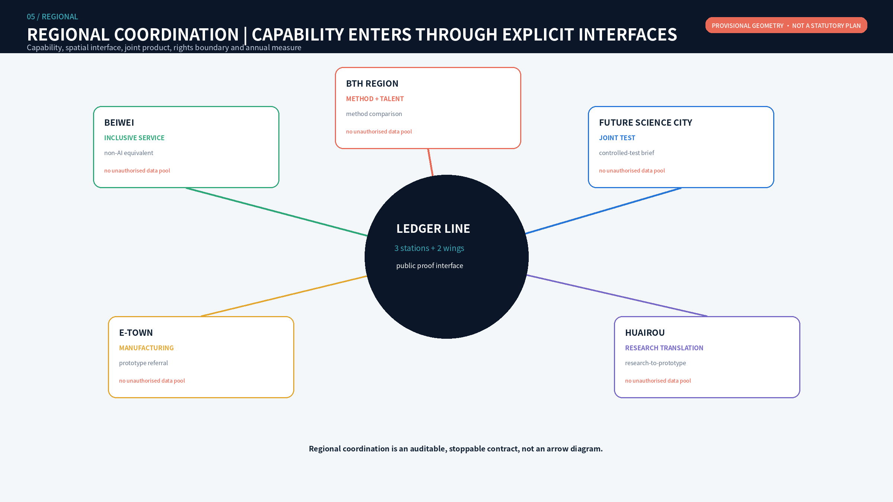

### Eight cases: transfer mechanisms, not urban form

Eight primary institutional sources inform the proposal. Cambridge contributes a commercialisation front door, Helsinki contributes bounded real-city testing, and Decidim contributes open-source hybrid participation. [source:CASE-CAMBRIDGE] [source:CASE-HELSINKI] [source:CASE-DECIDIM]

AI Verify contributes neutral testing and an assurance sandbox, Seoul contributes public experience and digital inclusion, and London's Knowledge Quarter contributes cross-institution exchange. [source:CASE-AIVERIFY] [source:CASE-SEOUL] [source:CASE-KQ]

Barcelona 22@ contributes mixed innovation and public-realm renewal; Toronto Port Lands contributes resilient public realm and long-horizon phasing. [source:CASE-22AT] [source:CASE-TORONTO]

Local translation produces seven safeguards: reversible land use and an official-data trigger; three stations and active-ground-floor interfaces; four industrial verification scenes; resource bands and an exit reserve research direction rather than funding promises; a developer community and staff exchange; small edge-compute nodes with energy gates; and data permission, minimisation, expiry, deletion, and appeal. No case predicts local companies, investment, talent, or output.

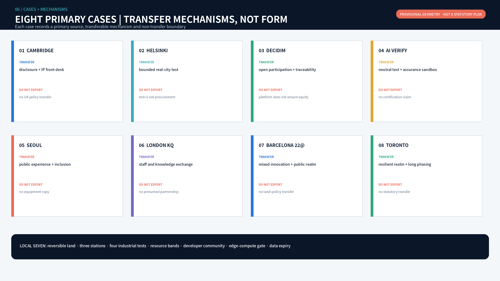

## Overall Design Area: Urban Renewal and Regulatory-Plan-Level Urban Design

### Overall space: one public innovation line with seven bands and two wings

The provisional overall area is divided into seven north-south bands and two east-west wings, producing fourteen concept cells without intentional gaps or overlaps. The western wing brings universities, R&D, professional services, IP and industrial translation into the line. The eastern wing brings community services, talent life, culture, education and Xiaoyue ecological questions into it. The central heritage corridor is the continuous public interface where questions are made visible, work changes hands and answers return to life. The south gateway frames city questions and international arrival; Dazhongsi handles lived use; middle bands bring professional service and university work; AI Origin handles open collaboration; northern bands and Zhongzhi handle full-stack co-development and ecological conditions. [data:geometry/land_use.geojson#LU-01-W] [metric:land_use_feature_count]

The rail civic spine, east-west stitches, adaptive building interfaces, blue-green walking loop and three station anchors in the aerial point back to `roads.geojson`, `buildings.geojson`, `green_space.geojson` and `public_space.geojson`. The images explain intent rather than replace plan evidence. [data:geometry/roads.geojson#ROAD-SPINE] [depth:overall_spatial_structure]

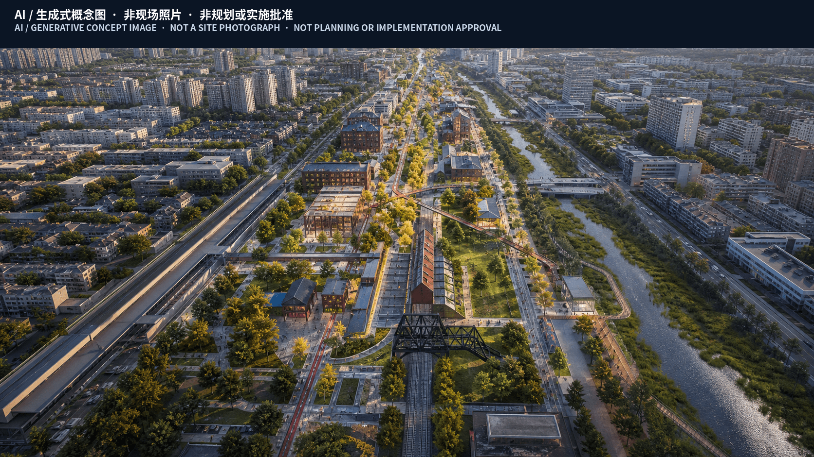

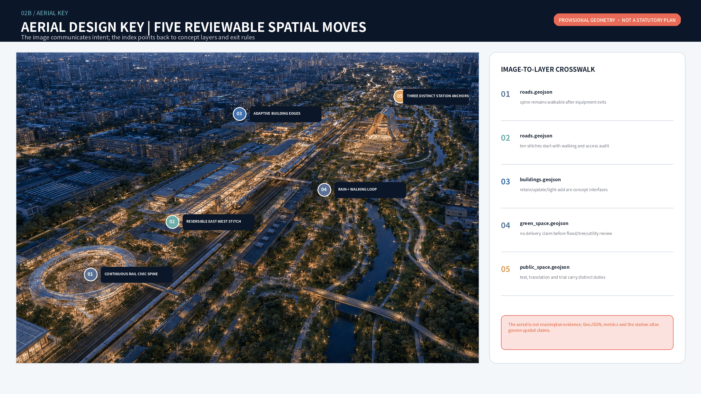

Conceptual building interfaces are not an existing-building inventory. Courtyards, active ground floors, and traversable edges test spatial relationships through three priorities: adaptive retention, ground-floor retrofit, and reversible light additions. Demolition, construction, intensity, and height await survey, ownership, structure, regulatory, heritage, fire, and utility evidence. [data:geometry/buildings.geojson#BLDG-101] [metric:conceptual_building_interface_count]

The fourteen cells are independent design decisions, not repeated names applied to coloured zones. Each record stores a spatial move, proposed operating role, acceptance evidence, stop condition and restoration action. Full fields are in `visual/assets/review-evidence.json#spatial_ledgers`. This allows each spatial ledger to be signed off independently instead of using overall area and generic ratios as substitutes for delivery evidence.

| Ledger | Lead function | Primary spatial move | Acceptance before opening | Civic use retained after failure |
| --- | --- | --- | --- | --- |
| 01W / 01E South Gateway | Railway provenance / equivalent arrival | Verification desk, staffed window, tactile map | 100% source traceability; offline service available | Arrival, walking and rest |
| 02W / 02E Dazhongsi | Device trial / transit and consumption | Separate trial, appeal and non-AI service | Four rights channels complete; resident route uninterrupted | Ordinary retail and staffed service |
| 03W / 03E Jimeng | Professional service / community feedback | Compliance front desk and civic problem table | Responsibility and deadlines complete; dissent traceable | Ordinary office and offline deliberation |
| 04W / 04E Campus Link | Research translation / talent life | Open ground floor and quiet courts | Licence and retest complete; night boundary passes | Learning, living and non-commercial stay |
| 05W / 05E AI Origin | Open interoperability / civic collaboration | Release desk, continuous ground floor and two stitches | Reproducibility, licence and public access pass | Collaboration, exhibition and ordinary courts |
| 06W / 06E North Segment | Edge facilities / Xiaoyue ecology | Degradable loads and accessible green route | Energy, noise and route breaks recorded | Logistics and safe passage |
| 07W / 07E Zhongzhi | Model assurance / embodied test | Staffed test loop, separate public route and restoration belt | Legal operator, safety approval, stop and restoration drills pass | Ordinary courts and open green space |

## Land Use, Building Scale, and Retain-Renovate-Demolish Strategy

Fourteen concept land-use cells express functional relationships rather than statutory controls. Sixty building interfaces compare adaptive retention, ground-floor retrofit, and reversible light additions; they are not an existing-building survey, demolition decision, floor-area schedule, or development intensity. FAR, height, gross floor area, and ownership remain `unknown` until official controls and existing-condition evidence trigger a rebuild. [data:geometry/land_use.geojson#LU-01-W] [data:geometry/buildings.geojson#BLDG-101] [metric:conceptual_building_interface_count]

Retention applies only after structure and rights are verified and where public-facing adaptation is feasible. Retrofit requires accessibility, fire, energy, and traversability review. Addition means removable low-impact test infrastructure, not permanent construction. Demolition is not predicted and can enter comparison only after survey, structural, heritage, ownership, and statutory procedures. Footprint area checks layer consistency and does not derive gross floor area. Standard land-use codes and separate design-role fields prevent concept functions from being presented as statutory zoning. [standard:MNR-LAND-USE-CLASSIFICATION-GUIDE] [standard:MOHURD-CONTROL-DETAILED-PLANNING] [metric:building_footprint_area_sqm]

## Detailed Design of Key Areas

The three key areas move one city question from prototype to public capability and daily use. They retain one governance evidence template, but governance is not their spatial protagonist. Zhongzhi is a garden research district where urban questions meet full-stack development; AI Origin is a public room for open knowledge, talent collaboration and translation; Dazhongsi is an urban district where intelligent economy meets everyday life. The polygons remain `provisional_constraint` and cannot support precise area, demolition quantity, or engineering-interface claims. [data:geometry/key_areas.geojson#PROV-KEY-001] [depth:three_key_area_detailed_design] [metric:conceptual_building_interface_count]

### 6.1 Zhongzhi Park: city-question co-development field

Zhongzhi combines a city-question hall, open lab courts, a robot test street, Qinghe ecological conditions and developer workbenches. Community, campus and Xiaoyue questions are translated into users, places, constraints and observable outcomes. Developers, enterprises and university teams build at reconfigurable workbenches; the test street holds low-speed terminals and safety fixtures; the river edge carries environmental sensing, maintenance and low-altitude interface research only after water, flood and ecological review. Residents, children and riverside users can observe what is being solved and propose conditions without entering the test area.

Three parallel relations organise the site: an open laboratory court for questions and collaboration, a central observation gallery, and an inner test street connected to labs and service withdrawal. Equipment crosses into the test street only at one controlled point with visible staff, a physical stop and status. Failure closes the test segment, not the question hall, workbenches, riverside walking or open court. The existing TEST contract remains inside BUILD. [data:visual/assets/station-topology.json#ZHONGZHI_TEST]

### 6.2 AI Origin: public innovation room

AI Origin combines a city-question wall, open laboratory hall, prototype workshop, open-source theatre, developer steps and talent-life court. A prototype arriving from Zhongzhi must be explained, reproduced, modified and recombined here. The question wall shows the city need it answers; the hall exposes method and limits; the workshop supports university, developer and start-up collaboration; the theatre hosts tool releases, city challenges and international exchange; the steps and court make learning, discussion, coffee and community events ordinary daily uses. Two stitches connect campus, park and neighbourhood while night collaboration remains separated from quiet residential edges.

Before work moves from the workshop to the open-source theatre, method, version, rights, accountable people and withdrawal remain visible together; this is the RELEASE foundation inside OPEN. If an output is held or withdrawn, its display returns to an ordinary worktable while teaching, discussion, the question wall, coffee and collaboration continue. AI Origin is therefore not a release desk but the public front room of Beijing's AI innovation capacity. [data:visual/assets/station-topology.json#AI_ORIGIN_RELEASE]

### 6.3 Dazhongsi: daily-life feedback field

Dazhongsi combines a transit arrival hall, city-service street, staffed service island, community question desk, intelligent-terminal workshop and public activity room. It is not the chain's final showroom but the place where commuting, shopping, rest, community service and intelligent economy meet each day. Four-quadrant pedestrian connection remains a concept target pending professional evidence. Older people, children, residents, shopkeepers, visitors and employees choose staffed or AI service along the arrival chain; service staff turn repeated difficulty into the next city question. The terminal workshop displays and maintains only tools currently permitted for daily use, while ordinary commerce, rest and community activity continue.

AI and staffed service split from the same point, and the accessible main chain depends on neither equipment nor a phone. The question desk touches the main chain, staffed service and limited-use area, allowing staff to turn one specific difficulty into a new task. Equipment enters maintenance and withdrawal from the side or rear rather than crossing transit, commerce or rest. Existing USE and Public Verdict rules remain inside LIVE: if a service does not improve life, staff maintain an equivalent service and return both problem and product rather than describing the user as resistant to technology. [data:visual/assets/station-topology.json#DAZHONGSI_USE]

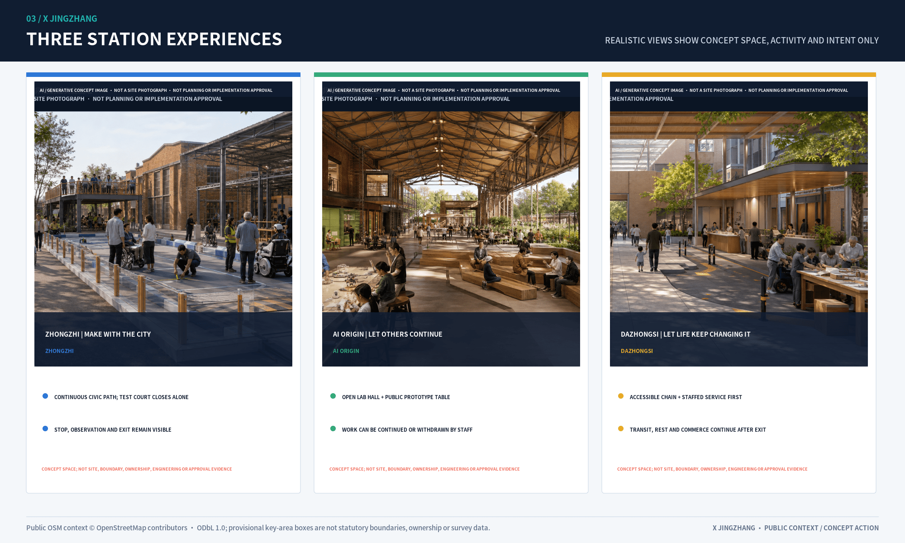

The images describe three kinds of innovation activity within ordinary city life. Zhongzhi shows how a problem becomes a prototype, AI Origin lets people join open collaboration, and Dazhongsi lets an answer face daily use. Developers, students, residents and commuters each have a reason to come even without knowing the ticket system.

The station atlas aligns plan, civic section, innovation activity and safety foundation. Zhongzhi uses a question hall, workbenches, observation gallery and test street for co-making. AI Origin uses a continuous ground floor, prototype workshop, open-source theatre and talent court for open improvement. Dazhongsi uses transit arrival, city services, a staffed island and question desk for lived use. Test boundaries, rights disclosure, staffed service and restoration stay visible without replacing the spatial programme. [data:geometry/buildings.geojson#BLDG-101] [data:geometry/public_space.geojson#LANDMARK-01] [depth:three_key_area_detailed_design]

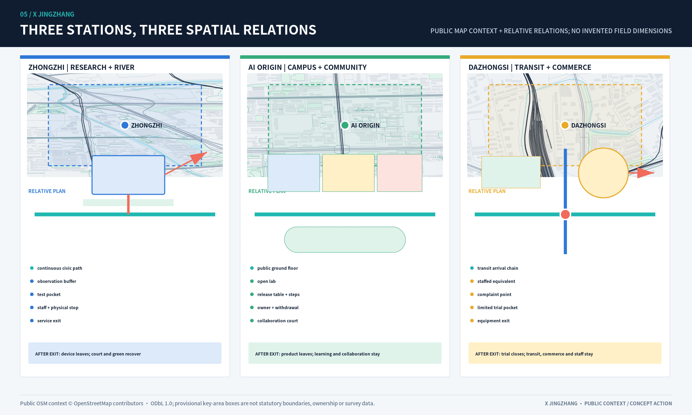

The three key areas use distinct first-stage delivery packages instead of waiting for every engineering condition before acting. Full fields are in `visual/assets/review-evidence.json#station_delivery_packages`.

| Key area | First innovation task | First spatial move | Proposed acceptance | Does not yet enter |
| --- | --- | --- | --- | --- |
| Zhongzhi | Turn one city question into repeatable conditions and a prototype | Question hall, mobile benches, observation gallery and one closable test segment | Developers can execute the question; observation and passage do not depend on testing | Permanent test facilities and utility connection |
| AI Origin | Let a third party understand, reproduce and improve the same prototype | Question wall, prototype workshop, open theatre and collaboration steps | Method and responsibility visible; one independent reproduction recorded | Permanent ground-floor works and additions |
| Dazhongsi | Test whether the capability improves everyday arrival and service | Staffed island, limited-use point, community question desk and ground guidance | Core task remains completable; new issue returns to a named research responsibility | Permanent station-city and vertical works |

## Transport, Rail, Municipal Infrastructure, and Public Services

One north-south civic verification spine, ten east-west stitches, and two wing service routes form the concept network. Walking and cycling lead on the spine. Embodied devices operate only within key areas, limited times, low speeds, and staffed takeover routes. Each stitch needs field review of traffic, accessibility, underpass conditions, and ownership. `ROAD-SPINE` and `ROAD-X01`-`ROAD-X10` are concept centrelines, not rail or road redlines. [data:geometry/roads.geojson#ROAD-SPINE] [metric:east_west_stitch_count]

Reliable municipal evidence is unavailable. Energy, drainage, flood, fire, communications, and equipment connections therefore remain design-development prerequisites; no capacity, pipe alignment, or engineering interface is inferred. Public service uses a staffed desk, non-digital channel, and continuous accessible route as its equivalence floor.

## Blue-Green Network, Public Space, and Urban Character

Three sections make boundaries explicit. The everyday green section retains walking, cycling, rain gardens, quiet zones, and active ground floors. The controlled-test section adds a low-speed device lane, physical emergency stop, and observer zone. The urban-trial section adds staffed service, a non-digital channel, and removable display edges. Green and public-space ratios are provisional internal checks, not statutory controls. [metric:green_ratio] [metric:public_space_ratio]

Urban character comes from rail traces, rain planting, durable paving, reversible structures, and active ground floors rather than screens or device clutter. Everyday green space remains complete for shade, rest, children, older adults, and accessible movement after equipment leaves. Controlled test areas use boundaries, speed, noise, light, and physical stops; urban-trial areas protect choice with staff and a non-AI route. Heat, storm, lighting failure, or accessibility interruption closes technical operation while keeping safe passage. Official greenline, water, flood, tree, and sponge-city evidence triggers ecological and engineering review and full ratio recalculation. [standard:MOHURD-URBAN-DESIGN-MEASURES] [data:geometry/green_space.geojson#GREEN-001] [data:geometry/public_space.geojson#PUBLIC-SPINE]

The three east-west stitch sections share one public route that cannot be interrupted, while the controlled event layer can close independently after an incident, extreme weather, accessibility failure or permit lapse. Field accessibility audit, non-AI equivalent service, night-safety review, human-takeover drill and failed restoration form the continuity acceptance chain. Technical functions do not open while any link remains unresolved. [standard:MOHURD-URBAN-DESIGN-MEASURES] [data:geometry/roads.geojson#ROAD-X01] [metric:east_west_stitch_count]

### agent.5 Centennial X Jing-Zhang Cultural Route: 1909-2026-2126

The cultural route is not a scatter of QR codes. It is one continuous six-stop, three-era public journey along `ROAD-SPINE`. South Gateway explains autonomous railway engineering in 1909; Dazhongsi X Station translates arrival into present-day rights of use; Jimen Stitch shows how the railway can reconnect neighbourhoods; AI Origin X Station discloses versions, licences and release responsibility in 2026; Xiaoyue River reads infrastructure memory together with climate adaptation; Zhongzhi X Station asks how urban technology should be tested and retired by 2126. Every stop provides an onsite panel, paper foldout, tactile abstract and staffed interpretation. AI may retrieve and organise only cleared source material; it cannot invent historical claims. [data:visual/assets/x-cultural-route.json] [metric:cultural_route_stop_count] [metric:cultural_narrative_era_count]

Each published item records source, rights, version and human historical reviewer. Untraceable material stays out; disputed material displays its evidence status. Targets are 100% static-alternative availability and 100% source traceability for published content, while route continuity, stop locations and accessibility remain pending official geometry and field audit. AI improves retrieval without replacing human judgment over urban memory.

## AI Innovation Ecosystem, Personas, and AI+ Scenarios

The twelve scenes are no longer organised by asking where AI can be placed. They ask who frames a problem, who turns it into a prototype, who opens it for reproduction, who uses it in life, and who returns the next question. Communities, Xiaoyue River and civic-service nodes are question entries; Zhongzhi, AI Origin and Dazhongsi provide co-development, opening and use; the service wing and regional interfaces contribute specialist capacity. The table retains responsibility and risk foundations, but every scene must first answer a task that a real user can describe.

| Scene | Type and anchor | Accountable / consulted | Data boundary | Human takeover and SLA | KPI, stop and restoration |
| --- | --- | --- | --- | --- | --- |
| SC-01 Model Assurance Court | Industry test, Zhongzhi | Platform / red team, legal | Authorised test sets, model version, risk log | Safety lead approves; severe incident stops in 15 min | Defect closure; unauthorised access or irreproducibility freezes logs and removes test |
| SC-02 Edge Compute Energy Bench | Industry test, Zhongzhi | Facility operator / energy, safety | Power, temperature, anonymous load; no task content | Engineer takes over within 30 min | Energy per task; heat, noise or uncertain supply stops operation |
| SC-03 Embodied AI Controlled Field | Industry test, Zhongzhi | Test-field operator / traffic, safety, community | Device telemetry and incidents; no face recognition | Physical stop under 5 sec; staffed whenever open | Takeover success; boundary breach, collision or unresolved complaint restores ordinary use |
| SC-04 Interoperability Bench | Industry test, AI Origin | Open-source community / third-party tester, rights holder | Interface versions and success; no private code upload | Dual review before release; dispute response in 2 days | Reproducibility; two failed rounds or lock-in risk removes display |
| SC-05 Open-source Release Hall | Ecosystem, AI Origin | Translation platform / community | Licensed metadata and licences | Rights check before release; withdrawal in 5 days | Clearance rate; rights, privacy or accessibility failure withdraws project |
| SC-06 Data Rights Salon | Service, Dazhongsi | Compliance service / legal, rights holder | Authorised catalogue only | Unclear rights transfer to a person; no transaction ruling | Rights completeness; unclear source or excessive use stops service |
| SC-07 Accessible Route Station | Civic service, spine | Park operator / transport, disability representatives | Facility state, segment flow, voluntary feedback | Human field audit before advice; unsafe advice removed at once | Continuous access; safety conflict falls back to paper and staff |
| SC-08 Community Translation Desk | Civic service, east wing | Service centre / translator, case worker | On-device text, no default retention or ID originals | Rights-impacting content goes to staff; wait under 15 min | Correction rate; rights-impacting error stops AI answer |
| SC-09 Railway Engineering Memory | Culture, spine | Cultural operator / historian | Cleared records and versions | Expert check before publication; dispute marked in 7 days | Traceability; unknown source removes exhibit |
| SC-10 Low-carbon Maintenance Station | Governance, green spine | Park/utility operator / engineer | Asset ID and environmental status, no personal data | People decide work orders; urgent response in 30 min | False alerts and closure time; repeated misrouting returns to manual inspection |
| SC-11 Co-governed Night Safety | Civic service, AI Origin | Public-space operator / community, security | Non-identifying heat and human reports | Person confirms every alert; immediate response to incidents | False alert and complaint rate; tracking or glare removes equipment |
| SC-12 Global Open Collaboration Week | Operations, full line | Annual committee / venue, rights, accessibility | Event plan, consented registration, aggregate feedback | Staffed sessions; complaint response in 2 hours | Joint tasks and issue closure; permit, safety or rights gap cancels the unit |

### Typical task: how an accessible-arrival question changes a robot

The task starts at Dazhongsi: can a non-digital user complete accessible arrival when crowding, device parking and spectators overlap? SC-03 is one candidate tool built at Zhongzhi for that question. Its proposed stack is a low-speed geofenced robot, lidar/depth sensing, odometry and local map, independent envelope monitoring, minimum-risk stop, and physical plus staffed remote emergency stops. Perception identifies movement classes such as person and wheelchair without face recognition; images are not retained and the system cannot expand its own operating envelope. AI Origin opens the method, interface and unresolved question rather than displaying only a device. Dazhongsi evaluates the whole arrival service, not merely collision avoidance. [data:visual/assets/x-receipt.schema.json] [data:visual/assets/x-lifecycle-valid-example.json]

The package retains one explicitly **synthetic tabletop rehearsal**, not a field pilot. The prototype enters a controlled test, meets an unexpected crossing, is stopped by staff, leaves the pocket, and the ordinary court is restored. This checks whether the rules are internally repeatable. A real pilot cannot begin until the site, operator, device parameters, insurance and approval are confirmed. Detailed fixtures and machine results sit in the professional appendix. [data:visual/assets/sc03-tabletop-evidence.json] [metric:sc03_tabletop_rehearsal_count] [metric:sc03_synthetic_fixture_count]

### Governance foundation: show how the question is answered; retain complete history behind it

The opening already tells the city-question journey. This section adds only its professional foundation. Only one product version is valid at a time. Crossing a station must reference the preceding record. A change in version, route, model or licence invalidates downstream decisions. A public objection must create a new development task. Technical failure returns to Zhongzhi, rights failure stops at AI Origin, and public-use failure changes both the product fixture and Dazhongsi spatial layout. [data:visual/assets/lived-lifecycle.json] [metric:product_lifecycle_event_count]

The three records answer different questions. Test Receipt stores version, fixtures, test boundary and human stop. Release Ticket stores the software, model and data-rights bill, limits and withdrawal owner. Public Verdict stores notice comprehension, staffed equivalent service, objections and the continue/revise/return decision. Test handover, paired release tables and a public-service desk make those decisions visible on site. Fields, hashes, expiry and machine checks remain in the professional appendix rather than occupying the first urban-design reading. [metric:handover_ticket_type_count] [metric:ticket_hash_chain_target_percent]

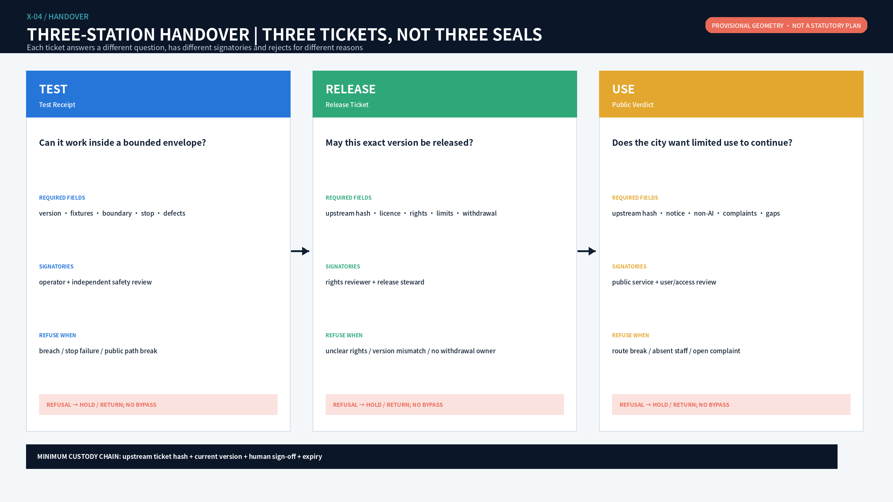

### Minimum pilot: fourteen days take one city question through the whole line

The minimum pilot does not seek event scale. It asks whether one question framed by real users can become a repeatable condition, an open method, a limited use and the next development task. The proposed maximum remains one question, one specified device, one machine test pocket and one continuously open accessible public path. Exact dimensions, distance, speed and participation await official geometry, field measurement, hazard analysis and approval; the concept cannot pre-fill them. Without a question owner, candidate operator, insurance, safety duty, accessibility review and restoration resources, the fourteen-day clock does not begin.

The pilot first assembles a four-part main-line / siding / turnout / return-pocket kit rather than procuring permanent infrastructure. The civic main line uses static wayfinding, movable seating and staffed service and remains useful after power-down or demobilisation. The AI siding uses removable edges, a device bay and independent power isolation. The accountability turnout combines a staffed sign-off table, a visible physical stop action and a paper status board. The return pocket holds equipment, a component inventory and a restoration checklist, then recovers as an ordinary court, classroom, resting place or commercial frontage. Dimensions, materials, fire, structural, access and MEP conditions remain pending field and professional review. [metric:reversible_pilot_kit_type_count]

| Minimum spatial kit | Ordinary state | AI-running state | HOLD / RETURN action | Opening responsibility |
| --- | --- | --- | --- | --- |
| Civic main line | Continuous passage, rest and staffed service | Main chain does not change | Remains open; devices and queues clear | Accessibility and public-service steward |
| AI siding | Court, learning, rest or commercial frontage | Holds one exact version and bounded fixture | Isolate power, close and remove | Device and site-safety steward |
| Human accountability turnout | Ordinary service table | Checks upstream ticket, version, owner and expiry | No sign-off means HOLD | Station signatory |
| Return pocket | Recoverable civic use | Temporary device and removable kit standby | Isolate, inventory and issue retest task | Demobilisation and restoration lead |

Each opening shift assigns four responsibilities: site lead; safety observation and stop; accessibility/staffed service; and station-ticket review. Qualified people may combine roles where competence and independence permit, but no responsibility may be vacant. If any role is absent, the turnout cannot point toward the AI siding. This is a candidate operating arrangement, not a claim that an existing institution has committed. [metric:minimum_pilot_shift_role_count]

| Time | Accountable role that day | Required action | Passing evidence | Immediate stop / block |
| --- | --- | --- | --- | --- |
| D-30 | Candidate venue and operating lead | Name venue, insurance, safety and accessibility roles | Responsibility register with signable fields | Any duty has no owner |
| D-7 | Site lead + accessibility reviewer | Complete field walk, notice-comprehension test and ordinary-state restoration drill | Breakpoint map, notice result and restoration list | Accessible main chain breaks or restoration fails |
| D0 | Product team + independent reviewer | Repeat four synthetic fixtures and freeze X Receipt version | Reproducible tabletop record | Fixture, version or script mismatch |
| D1-D3 | Site steward + safety-stop role | Closed testing with no public user inside the machine pocket | Duty, stop, boundary and incident records | Boundary breach, lost link or takeover failure |
| D4 | Independent safety reviewer | Independent retest and Test Receipt decision | Dual sign-off and unresolved-defect list | Irreproducibility or concealed defect |
| D5-D7 | Rights reviewer + release lead | Review rights, version, limits and withdrawal route | Candidate Release Ticket | Unclear rights, version mismatch or absent withdrawal owner |
| D8-D12 | Public-service + accessibility steward | Limited staffed public use with non-AI service open | Opening check, complaint tickets and service log | Absent staff, broken alternative or serious objection |
| D13 | Public-service + data-rights reviewer | Publish de-identified issues, cohort gaps and restoration evidence | Public issue register | Missing incident, complaint or disparity |
| D14 | Three station signatories + user/access reviewer | Decide continue, revise or RETURN | Public Verdict | Event closure cannot substitute for a decision |

Day fourteen never grants automatic renewal. PASS only lets the same version, envelope and purpose enter another time-limited review. HOLD keeps the accountability turnout aligned with the civic main line. RETURN proceeds in order: isolate power, remove equipment along that station's withdrawal route, remove release or trial status, restore ordinary use, and issue a new test task. RESTORE ends only after component inventory, ordinary-use recovery and accessible-main-line review. A field pilot must prove more than the tabletop's `4/4`: duty presence, public comprehension, real stop performance, whether complaints alter decisions, and whether the place remains useful after demobilisation. [metric:minimum_pilot_duration_days]

### Three failures: technical, rights and public use

**F-TECH-01 technical failure.** At Zhongzhi, localisation uncertainty exceeds the tolerance declared in the test brief. Independent envelope monitoring first issues HOLD; the on-duty safety lead executes the physical or remote stop. The machine pocket and observation buffer close while the permanent public path stays open. Event telemetry freezes, but the no-image-retention rule remains; an incident does not license expanded collection. After removal, the court returns to seating, walking and open green. A new Test Receipt requires an independent repetition of lost-localisation, minimum-risk-stop and takeover fixtures on the same hardware, software and map versions.

**F-RIGHTS-01 rights failure.** At AI Origin, release staff find that a software licence has expired or cannot be tied to the exact Zhongzhi hash. The technical PASS remains historically valid, but release becomes HOLD. The contribution ring removes “available for trial”; its table becomes an ordinary methods class. Distribution freezes while audit records remain, and disputed code or data are not exposed. The rights reviewer records the gap, owner and deadline. Only a closed licence, component bill, version hash and withdrawal duty can support a new Release Ticket; company assurance or a live demonstration cannot replace clearance.

**F-PUBLIC-01 public-use failure.** The device does not collide, but its queue, observers or parking obstruct the wheelchair-priority route, or the staffed alternative disappears. Dazhongsi's public-service lead first stops the device, clears the crossing and switches to paper and staffed service without waiting for an algorithmic ruling. A person may complain anonymously and receive a paper receipt within the five-minute target; a de-identified event enters the public register. Return to use requires a user-led route test and two review cycles without a material cohort gap. Until then, ordinary accessible movement and staffed service remain, and the product returns to Zhongzhi. “Users are unfamiliar with technology” is not an acceptable failure explanation. [metric:failure_case_count]

The three failures cause three spatial actions: technical failure contracts the machine envelope, rights failure withdraws the release interface, and public failure restores ordinary movement and human service. The common rule is that the public does not pay for product failure through detours, delay or extra data. Failure and success appear together without ranking people. Every RETURN answers five questions: who stopped it, what closed, what stayed open, how records were handled, and what is required to come back. [data:visual/assets/lived-lifecycle.json]

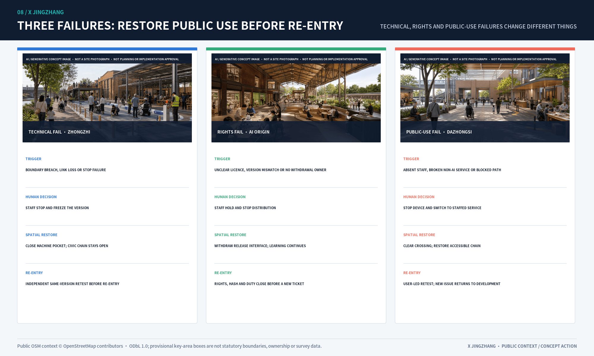

### Why AI makes the three places physically different

Without X, the three key areas could collapse into a laboratory, launch hall and experience shop. Each X station must reveal a civic main line independent of AI, a closable AI siding and a human-accountability turnout, but the three cannot copy one layout. Zhongzhi is a **test siding**: its permanent public path stays continuous at the outside, an observation buffer separates it from the machine pocket, and a controlled crossing is the only inner connection. Stop, envelope, version and accountable person are visible before entry. After FAIL, the pocket returns to an ordinary court and open green.

AI Origin is a **release siding**: methods table, rights table and withdrawal interface join the ground-floor civic main line in sequence. Learning and collaboration belong to the main line, so a rights failure withdraws the product without closing either. Dazhongsi is an **urban-use siding**: its limited trial pocket runs parallel to staffed/non-AI service; people reach commerce, rest and transport without crossing it, and staff clear devices and queues without closing the main line. The three sidings absorb technical, rights and public-use failures respectively. Removable edges, replaceable status, parallel service and permanent movement are therefore the spatial conditions for RETURN, not visual motifs.

The station topologies encode the civic main line, pocket isolation, independent accessibility, closure and recovery as nodes and links without invented field dimensions. Machine checks remain in the professional appendix to prevent later drawings from quietly losing these relationships; they do not replace a field audit. [data:visual/assets/station-topology.json] [data:visual/assets/station-topology-results.json]

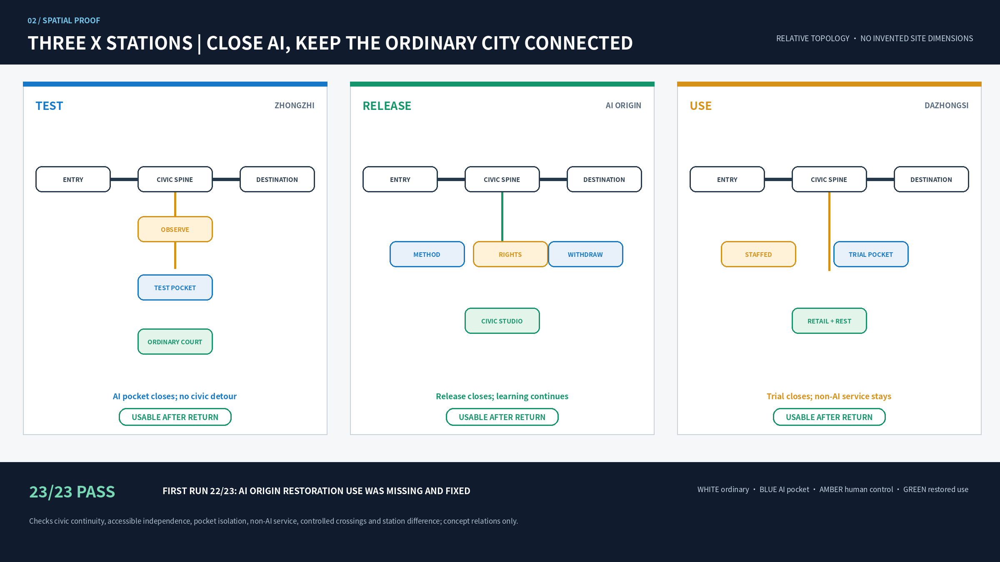

Every scene uses the same RACI floor: an operator is accountable, a professional group approves, users and communities are consulted, and the public is informed. AI is never the accountable actor. Resources use S (existing space and staff), M (removable components and specialist service), and L (engineering or long-term operation requiring a separate case). SC-01-SC-04 are industrial test and validation scenes. [metric:scenario_card_count] [metric:industry_validation_scenario_count]

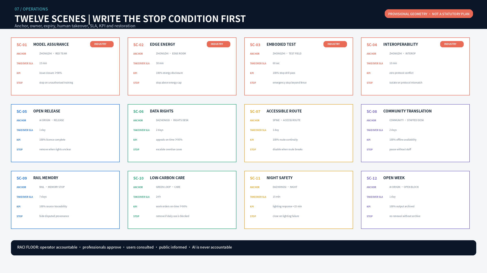

Resources follow a four-plus-eight strategy: four flagship scenes receive design development while eight remain registered reserves. Each flagship adds 90-day and 180-day gates. Full RACI, data expiry and restoration duties are in `visual/assets/review-evidence.json#flagship_scenarios`.

| Flagship scene | 90-day gate | 180-day gate | Immediate stop | Everyday state after restoration |
| --- | --- | --- | --- | --- |
| Model red-team and controlled robotics test | Three boundary, stop, demobilisation and public-route drills | Independent reproducibility; monthly takeover and complaint reporting | Boundary breach, collision, unauthorised data or takeover failure | Ordinary court and open green space |
| Open release and enterprise translation | Complete licence, retest, version and withdrawal tickets | Traceable research-prototype-enterprise retest chain | Unclear rights, two failed retests or lock-in risk | Collaboration, learning and ordinary exhibition |
| Public AI trial and appeal | Test notice comprehension, non-AI service and appeal access | Report cohort gaps, complaints and withdrawal execution | Identity tracking, absent staff or broken non-AI route | Ordinary retail, rest and staffed service |
| Accessible mobility and ecological stewardship | Register route breaks, alternatives and manual inspection | Quarterly access, night, false-alert and closure reporting | Route break, extreme weather or unverified ecological risk | Paper and staffed navigation with safe passage |

### Identity, three landmarks and eight components

The original mark combines two crossing tracks, a human-review node and an open extension path. Blue and green tracks form a clear `X` for the three crossings of heritage and renewal, research and public life, and trial and human judgment. The central node makes consequential decisions reviewable by people; the unclosed gold path allows revision, extension or exit. Colours are evidence blue, civic green, human-judgment gold, warning coral, and night ink. The mark must not imply endorsement beside enterprise logos or enter uncleared merchandise and permanent signage.

Three removable, low-glare, non-advertising landmarks are the Rail Evidence Gate at Zhongzhi, Open Contribution Ring at AI Origin, and Urban Trial Beacon at Dazhongsi. Eight components are source sign, test sign, staffed desk, offline service panel, movable seat, low-glare light, rain-garden sensor plinth, and tactile map. The contribution wall records verifiable public contributions, failures, and exits; it does not create a personal prestige ranking. [metric:pilgrimage_landmark_count] [metric:public_component_count]

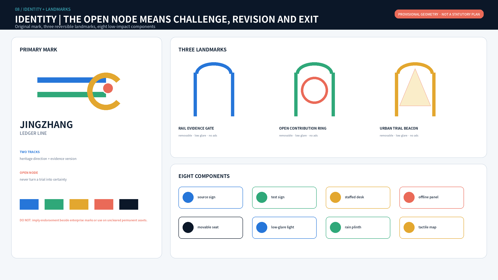

The executable VI standard fixes mark construction, minimum clearspace, minimum digital size, five functional colours, type hierarchy and three levels of public information. Every application shows scene status, rights information and staffed/non-AI action entry together. Mimicking an official seal, implying enterprise endorsement, permanent advertising and hiding pause or exit status are prohibited. Identity therefore becomes a consistent public interface for responsibility and choice rather than decoration. [source:AGENT-TASKBOOK] [metric:public_component_count]

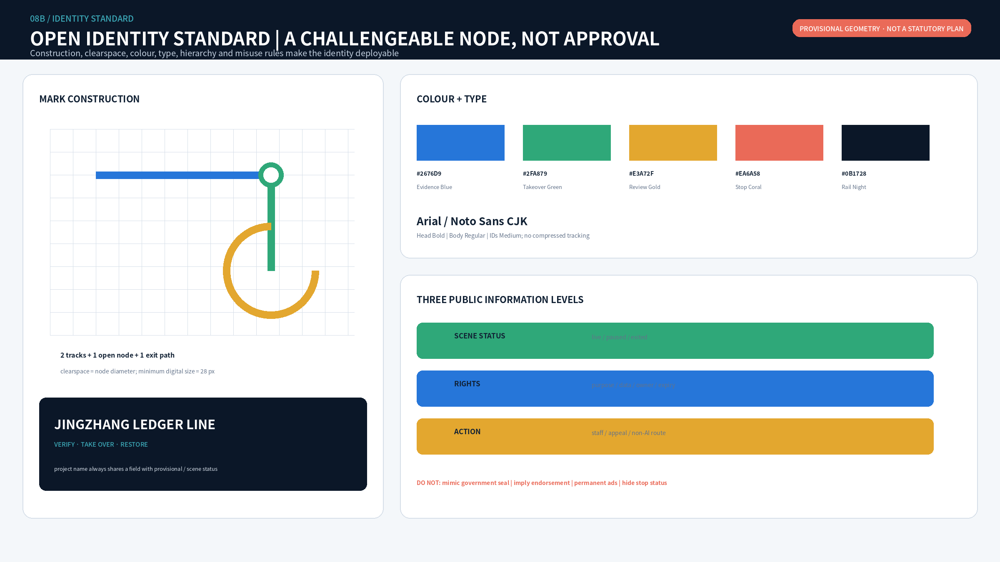

### Inclusion: equal service without an application

#### Ms Zhou's morning: stopping urban AI without a smartphone

Ms Zhou is a 72-year-old composite persona used to test the proposal, not a real resident. She walks slowly, needs a continuous step-free route and places to sit, does not use a smartphone for public services, and does not wish to tell a machine about herself. The design succeeds not when she learns AI but when she reaches her destination and receives equal service without it, then changes a real decision when technology affects her movement. [data:visual/assets/lived-lifecycle.json] [metric:lived_journey_step_count]

**08:10, Dazhongsi arrival edge.** The first interface is not a download prompt. It is a staffed desk, paper route and three parallel states: ordinary passage, limited trial and paused/withdrawn. Staff ask for neither account, phone number nor face data, only destination and whether a step-free route is needed. The foldout uses the same colours and numbers as ground wayfinding and remains legible when digital systems fail. Choosing paper neither lowers queue priority nor creates a “low digital ability” profile.

**08:25, urban-trial threshold.** Three-level notice first says what is being tested, then what event data may be recorded and for how long, then shows staffed help, non-AI route, anonymous complaint and immediate exit. She need not understand the model; she needs to know where the device moves, who is on duty and how to continue without participating. She remains on the civic chain while the trial pocket sits to one side. Queue and observers cannot cross the tactile boundary. Dimensions are future acceptance items, not built facts inferred from a concept drawing.

**08:42, accessible-priority crossing.** A limited-use prototype approaches. It should HOLD and yield, but observers reduce usable clearance. Even without collision this is a public-use failure: safety and dignity cannot be measured only by whether a device strikes someone. Staff stop the machine and move observers first while the civic path remains open. Ms Zhou is not asked to detour around the trial pocket.

**08:43, objection.** She can press a staffed-call control, speak at the desk or use paper. Staff record place, time, affected service and requested outcome, not identity number, contact or a lasting behaviour trail. She receives a paper event receipt within the five-minute target. An anonymous report has equal status. If she volunteers a collection method, a response is available at the same desk within the five-working-day target; otherwise the public register shows state by event number. [metric:anonymous_complaint_receipt_target_minutes]

**08:45, Public Verdict becomes RETURN.** Public-service and accessibility roles decide that this is not a single yield event but an untested relationship between device, observation and priority route. The trial pocket closes, status light changes to RETURN and equipment leaves. Ordinary retail, seating, toilet wayfinding and staffed service continue. The issue cannot be coded as “older user resists technology”. It creates a new Zhongzhi fixture: how does public clearance survive when device parking, observers and wheelchair priority coincide?

**09:05, ordinary journey continues.** Ms Zhou reaches her destination by paper route. Service surviving AI withdrawal proves the place is civic infrastructure rather than an equipment-dependent display. She need not wait for a technical review or join later testing because she complained. The desk still answers transport, toilet, rest and cultural-route questions after the site returns to ordinary state.

**11:30, public without profiling.** The register shows event number, scene version, responsible role, temporary action, next review and whether the case returned to TEST. It does not show name, age or identifiable trajectory. Age and non-digital status belong only to this synthetic design review, not a real complaint record. If the issue may affect similar users, the operator invites user and disability groups to route retesting, but participation is voluntary and not a condition of receiving an answer.

**D+5, closure rather than reassurance.** At the desk, the response lists three checkable facts: whether the device remains stopped, how the place changed and which test must pass before return. If only wording changes while route conflict remains, the Public Verdict remains RETURN. Ms Zhou may reject the response and request independent review. One ordinary objection thus travels through service desk, public verdict, new Zhongzhi fixture and the next X Receipt, changing both product and place.

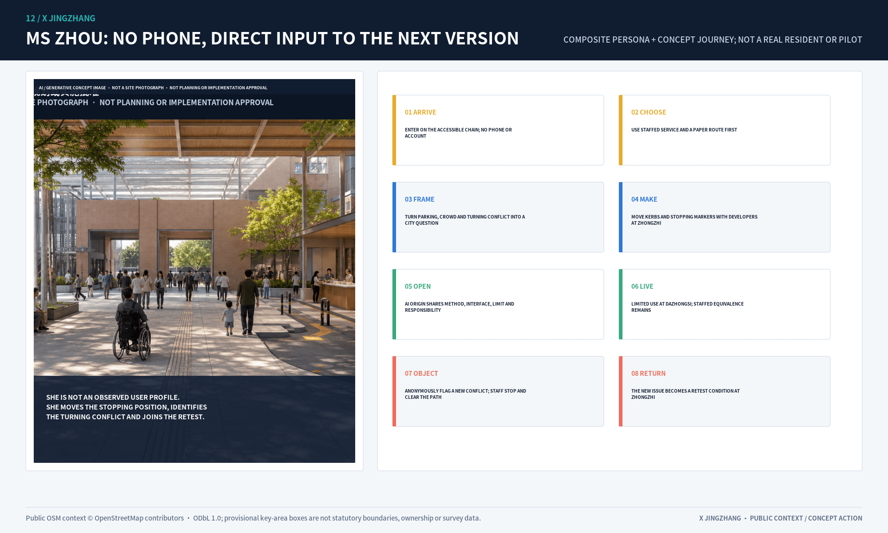

The journey operationalises five indivisible rights: see status before entry, receive an equal service without AI, reach staff without an account, obtain a receipt for anonymous objection, and make objection affect continuation. Reviewers should not merely check that a desk exists. They should complete the task from transit arrival to paper route, destination under device and network failure, complaint submission and public response. Failure at any step blocks the related AI scene.

Eight personas include developers, startups, university users, enterprise visitors, residents, operators, children and caregivers, and older, disabled, and non-digital users. A continuous accessible route, concept rest nodes within 400 metres, tactile and high-contrast information, low-glare night light, paper and staffed service, and use without face recognition or a smartphone are entry conditions. Distances and locations require field audit after official geometry.

Equity measures include 100% non-digital service availability, 100% human takeover coverage for high-risk scenes, accessibility issue closure, task-completion gaps between user groups, night complaint response, and timely permission withdrawal. A scene is downgraded or stopped when one group's failure remains materially worse for two review cycles.

## Renewal Projects, Implementation Policy, and Phasing

| Project | Proposed accountable / partners | Window and resource | Dependency | Acceptance and failed exit |
| --- | --- | --- | --- | --- |
| JZ-01 Official-data rebuild | Planning-data coordinator / survey and design | 30 days after release; M | Official polygons and CRS | Full-chain difference report; unresolved mismatch pauses precise metrics |
| JZ-02 Heritage evidence review | Cultural operator / historian and heritage expert | 0-6 months; S | Resource and rights inventory | 100% traceability; unclear material removed |
| JZ-03 Accessibility continuity audit | Park operator / users and transport | 0-6 months; S | Field survey | Breakpoint register and owners; major break blocks route service |
| JZ-04 North-south walking prototype | Public-space operator / park and transport | 3-12 months; M | Road and management evidence | Continuous route and alternative; safety conflict removes prototype |
| JZ-05 Ten east-west stitch studies | Transport team / district and community | 6-18 months; L | Flow, redline and levels | Alternatives for each; infeasible stitch remains wayfinding only |
| JZ-06 Zhongzhi verification court | Site operator / safety, firms, community | 6-18 months; M/L | Boundary, safety, noise, energy | Stop and restoration drill; failure prevents opening |
| JZ-07 AI Origin open front desk | University platform / community | 3-12 months; M | Cooperation and IP | Complete rights ticket; disputed project not published |
| JZ-08 Dazhongsi urban trial window | Industry platform / transit, retail, access | 9-24 months; L | Transit, ownership, fire | Staffed and non-AI channels; otherwise temporary event only |
| JZ-09 Scene register and incident protocol | Annual committee / legal and technical | 0-6 months; S | Data charter | Complete owner, term and stop fields; incomplete application refused |
| JZ-10 Landmark/component trial | Public-space operator / design, structure, rights | 6-18 months; M | Site, fire, heritage | Night, structure and access tests; failure removes and restores site |
| JZ-11 Developer/community governance | Community secretariat / universities, firms, residents | Ongoing; S/M | Published charter | Dissent recorded and answered; repeated failure pauses events |
| JZ-12 Open collaboration week | Annual committee / venue, safety, international | Annual; M | Permit, insurance, rights | Continue/revise/stop list; unresolved major risk cancels unit |

Gate one, evidence and low-impact prototypes, permits only research, audits, guidance, and removable components. Gate two, controlled testing at three stations, requires clear responsibility, place, safety, data, and public review. Gate three, assessed institutional translation, lets an independent review decide whether anything enters planning, engineering, procurement, or long-term operation. A pilot is not procurement, a display is not certification, and event participation is not permanent data permission. [data:geometry/phasing.geojson#PHASE-001] [metric:renewal_project_count]

Annual operation is a cancellable four-season loop rather than an event list. Spring ISSUE is led by the community secretariat and publishes problems and rights limits. Summer TEST is led by site operators and produces Test Receipts. Autumn RELEASE + USE is led by release and public-service teams and produces Release Tickets and Public Verdicts. Winter RETURN + REVIEW is led by independent reviewers and publishes continue, revise or stop decisions. Each season checks problem-response, fixture completion, rights-ticket completeness, complaint closure and restoration. Roles, outputs, KPIs and cancellation conditions are fixed in a machine-readable operations file. [data:visual/assets/x-operations-cycle.json] [metric:annual_operating_season_count]

The cadence is weekly public issue triage, monthly scene-status register, quarterly public review and one annual public continue/revise/stop register. Developers maintain the open roadmap; residents and target users define problems; professionals retain legal, safety and stop authority; AI only organises records, flags conflict and tracks versions. Each scene must pass public issue, bounded test, rights review, limited public use and continue/return decision. Missing legal owner, venue permission, rights ticket, human takeover, non-AI equivalent service or restoration resources cancels the seasonal unit rather than defaulting it to approval. [metric:annual_public_decision_register_count]

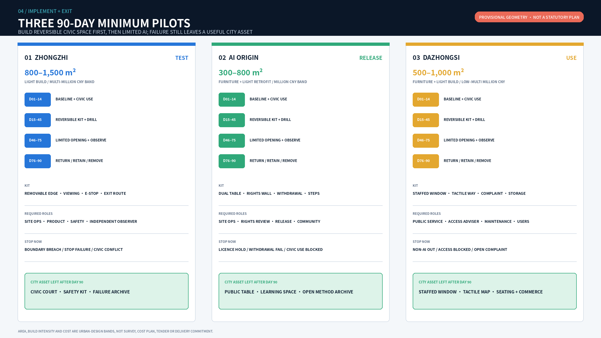

### Professional handoff package: moving from concept to the next gate

Before any project enters a controlled pilot it must produce ten signable handoff items: official-data difference report, key-area existing-condition base, candidate operator responsibility charter, scene register, safety case, data-and-rights impact check, field accessibility audit, lifecycle resource brief, failed-restoration plan, and a continue/revise/stop gate decision. If legal ownership, professional approval, public notice, human takeover, non-digital service, data expiry or restoration resources are missing, the project remains in research status.

The handoff package does not invent authorisation. This submission supplies fields, candidate roles, acceptance evidence and failed actions; organisation names, signatures, budgets, insurance, field measurements and approvals remain pending. A professional team can sign off JZ-01 through JZ-12 without reverse-engineering tasks from narrative prose. [depth:phasing_implementation] [metric:renewal_project_count]

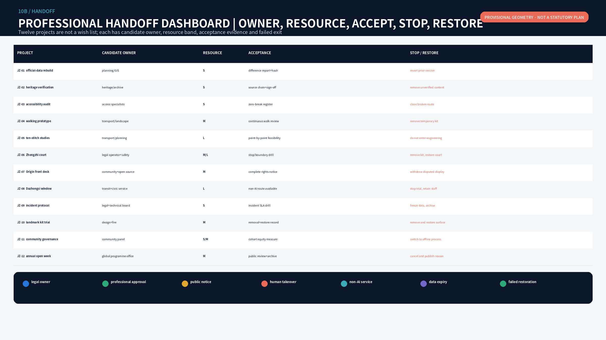

## Metrics, Area Recalculation, and Compliance Matrix

The leading risks are unclear responsibility, misleading precision, and an unfunded exit, not only technical failure. `risk.json` records privacy, implementation complexity, public acceptance, operating cost, policy uncertainty, spatial dispute, technology maturity, and inclusion, each with mitigation and human review. Before opening, every scene rehearses data expiry, takeover, complaint, incident, deletion, and spatial restoration.

Recomputable measures include provisional area, concept green and public space, building interfaces, spine and network length, 14 land-use cells, 10 stitches, 12 scenes, 4 industrial tests, 8 personas, 3 landmarks, 8 components, and 3 phases. FAR, height, road redlines, total floor area, budget, and ownership remain unknown. [metric:site_area_sqm] [metric:floor_area_ratio] [metric:implementation_budget_cny]

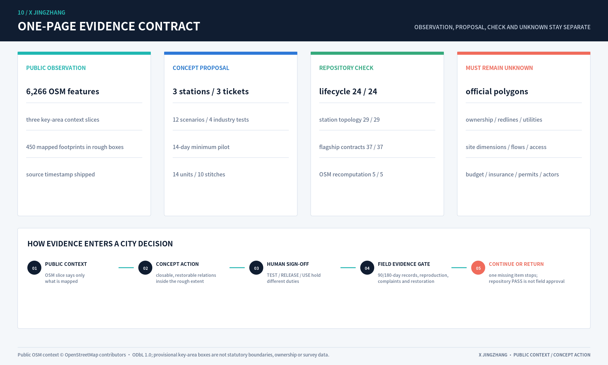

## Risk, Copyright, and Compliance

Text, graphics, design layers, HTML, and PDFs were produced by the declared AI agent and local tools. The participant supplied experience images generated through a web interface; the files retain no verifiable provider or model metadata, so the package does not guess a model. All are labelled as concepts rather than site photographs. No commercial map, third-party photo, enterprise logo, or personal data is loaded. Noto CJK is used under its open font licence. The asset ledger is in `report/copyright_statement.md`. [source:COPYRIGHT-LEDGER]

This is an open-source concept proposal. It cannot replace professional planning, architecture, transport, utility, heritage, legal, safety, operations, or approval work. Repository intake, self-check, or review does not represent government endorsement, implementation approval, procurement, certification, or an award.

Compliance begins with source registration and ends with restorative exit. Operators remain legally and operationally accountable; relevant professionals approve planning, mobility, safety, legal, and accessibility gates; communities and target users define problems; the public receives purpose, expiry, appeal, and alternative-service information; AI is never accountable. `risk.json` records triggers, mitigation, human review, and stopping rules across eight risks. High-risk scenes rehearse stop, takeover, data freeze, deletion, and spatial restoration. The three generated source images are retained separately from bilingual crops and labels, and unavailable model sub-version details are disclosed rather than guessed. [source:COPYRIGHT-LEDGER] [source:SOURCE-REGISTRY] [metric:scenario_card_count]

Public-data boundaries, personal privacy, asset copyright, and data authorisation are checked separately before opening. Unknown provenance, expired permission, or missing review responsibility stops the related scene; technical availability never substitutes for compliance.

## References

### Appendix: rerunnable professional evidence

The lifecycle verifier is an executable state machine rather than a descriptive checklist. It checks ten states, upstream-ticket hashes, configuration fingerprints, human sign-off, rights HOLD, expiry, retesting after RETURN and immutable failure history. All 24 deterministic cases pass; 22 are paths that must be rejected for skipping, broken chains or invalid status. The station verifier retains three non-interchangeable opening gates alongside civic continuity, AI closure, non-AI service, accessible independence and RETURN restoration: no bypass around Zhongzhi's controlled crossing; co-visible method-rights-withdrawal at AI Origin; and non-AI route parity with complaint at the Dazhongsi conflict point. The result is `29/29 PASS`. [data:visual/assets/x-lifecycle-test-results.json] [data:visual/assets/station-topology-results.json] [metric:station_topology_pass_count]

These PASS results prove only that repository rules, synthetic tickets and concept topology can be rerun. They do not establish field conditions, product safety, public acceptance, certification or implementation approval. SC-03 remains an explicitly labelled tabletop; a real trial remains BLOCKED without a site, operator, device, insurance and approvals. [data:visual/assets/sc03-tabletop-evidence.json]

### Appendix: internal language audit

X Census and its reading log remain in the package but do not support the design-value claim. They check keyword saturation in public submissions, not semantic equivalence, originality or quality. The narrative therefore displays no peer counts or rarity percentages. [data:visual/assets/x-census-details-index.json] [data:visual/assets/x-census-reading-log.json] [source:X-CENSUS-CURRENT-TREE]

`sources.json` records primary task sources, provisional-boundary provenance, professional standards, and eight international primary sources with publication status, applicability, and rights notes. Inline `[source:*]` markers resolve to that registry; unregistered material is not used as evidence. [source:SOURCE-REGISTRY] [source:OFFICIAL-ANNOUNCEMENT] [source:AGENT-TASKBOOK]

References fall into five groups: the announcement and taskbook; planning and design-depth standards; provisional sources used only for concept geometry; eight institutional cases used only for mechanism transfer; and National Railway Administration plus Beijing public sources used for bounded translation of Jing-Zhang history, operating rules and the heritage park. [standard:PROJECT-OFFICIAL-ANNOUNCEMENT] [standard:PROJECT-AGENT-OPEN-CALL-TASKBOOK] [source:NRA-TECHNICAL-RULES]

- `brief/public-brief.md`: repository public brief draft, used only for task context and proposal boundaries.
- `brief/README.md`: repository public-data boundary note, used to constrain evidence status and review responsibility.
