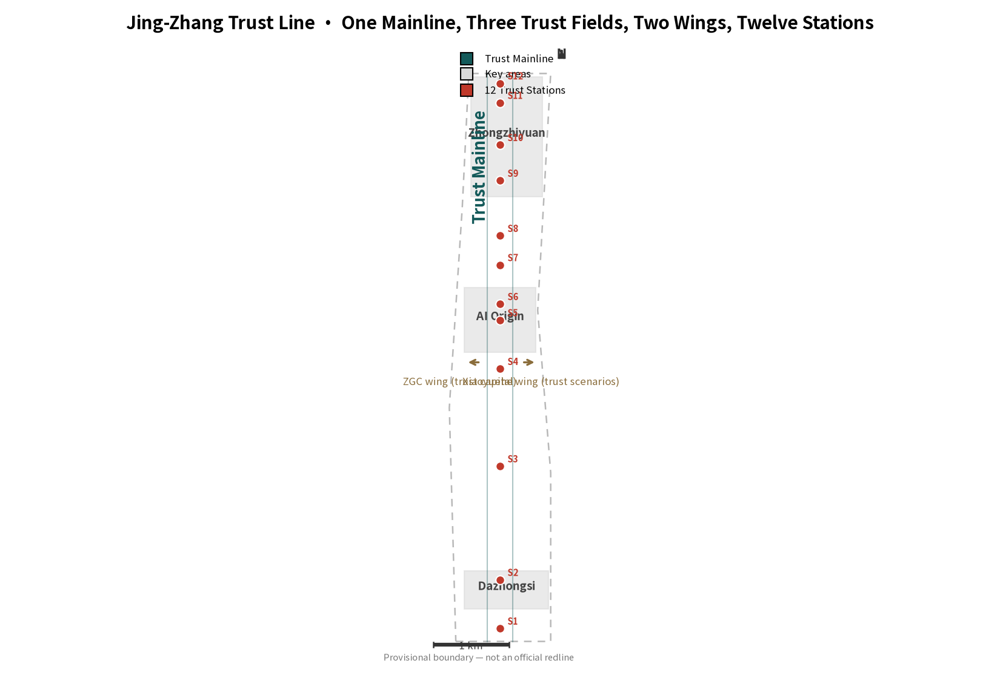
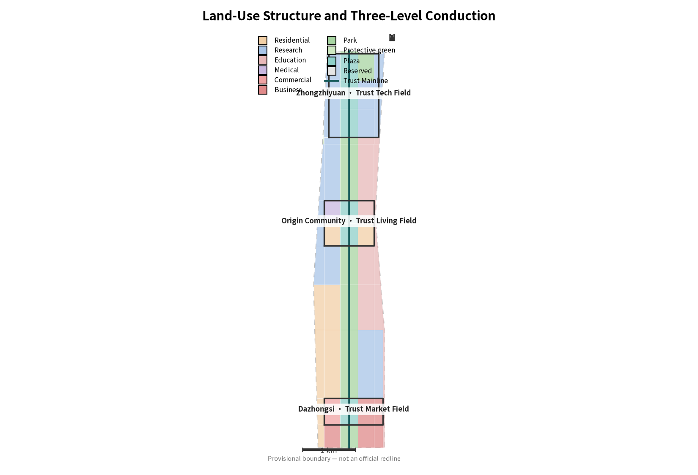
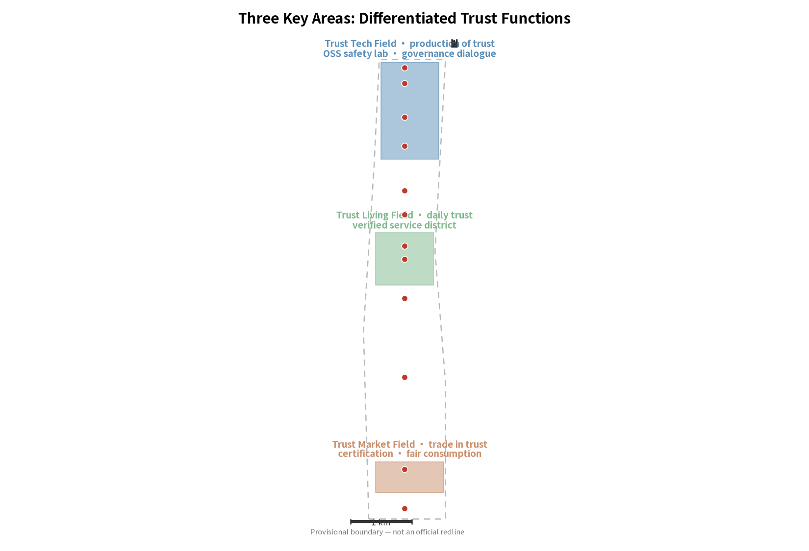
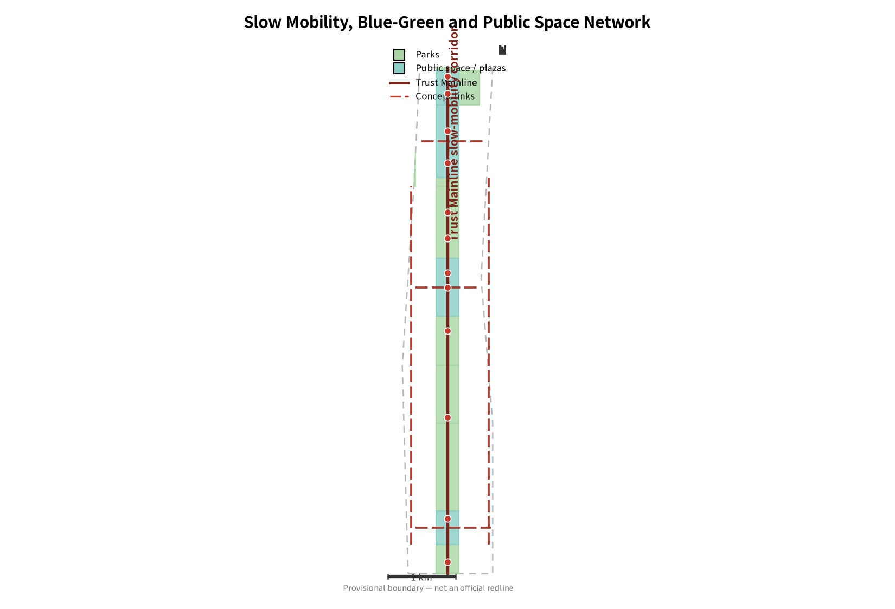
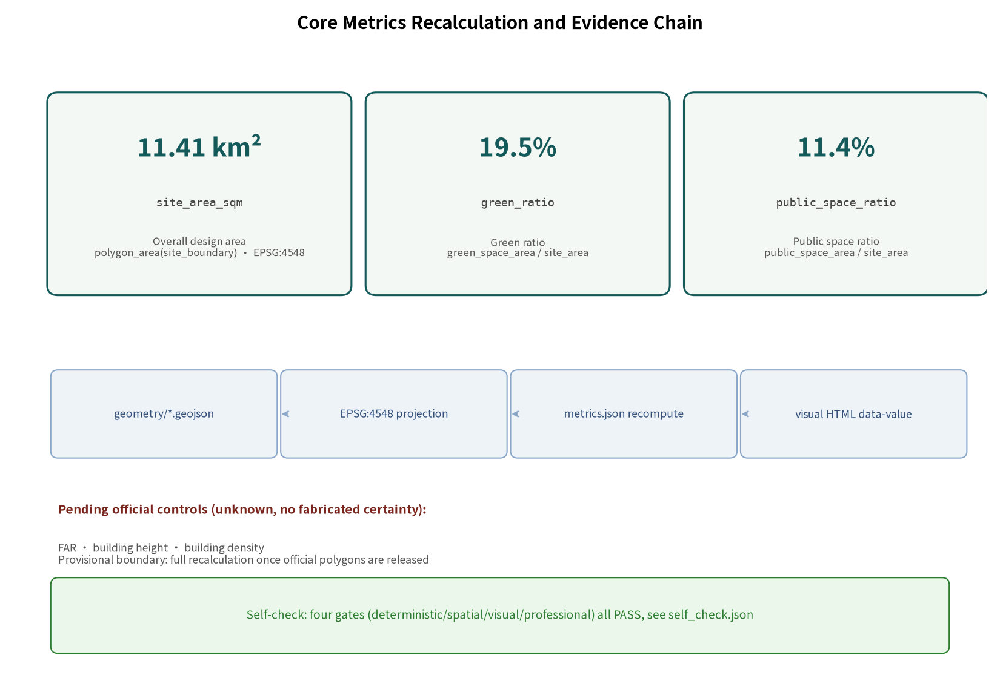

# Jing-Zhang Trust Line

**Core proposition: trust is the scarcest infrastructure of the AI era.** A century ago, Zhan Tianyou answered "can engineering be trusted?" with a railway designed and built by Chinese engineers. Today, this land answers "can AI be trusted?" The precondition for scaling the AI industry is not compute - it is public trust. Trusted, it can scale. This proposal translates "global AI governance voice" - one of the five mandated functions - from policy language into an experienceable, visitable, testable spatial system: every governance mechanism has a physical node; every public space demonstrates a trust technology. All spatial proposals are conceptual suggestions and reference schemes for professional teams to deepen; they do not replace formal planning and do not constitute government-approved conclusions.[source:AGENT-TASKBOOK] [standard:PROJECT-AGENT-OPEN-CALL-TASKBOOK]

## Design Basis and Source List

This proposal takes the official pre-qualification announcement (Haidian Branch, Beijing Municipal Commission of Planning and Natural Resources) as its primary basis [source:OFFICIAL-ANNOUNCEMENT], the agent open-call taskbook as its task and boundary basis [source:AGENT-TASKBOOK], and the repository source registry to separate formal, background and provisional material [source:SOURCE-REGISTRY].

An honest statement comes first: **no official precise redline has been made public**. The announcement gives textual four-boundaries and approximate areas for the three scopes, but no boundary drawing or spatial data with a verifiable coordinate system; the qualification package requires a download password, and the public-channel check (as of 2026-08-07) found none. All boundaries in this proposal therefore use the provisional rough boundaries derived by the repository maintainers from the announcement text, marked in the proposal, HTML, assumptions and self-check results - not presented as an official redline and not used for precise-area claims. The organizer's data gap does not block content scoring; once official polygons are released, land use, green space, public space, buildings, phasing, metrics, figures and HTML must all be recalculated.[source:BOUNDARY-SOURCE]

Professional judgment follows the Urban Design Measures (public space and character), the Regulatory Plan Rules (statutory control and approval boundaries), and the land-use classification guide (land-use codes) [standard:MOHURD-URBAN-DESIGN-MEASURES] [standard:MOHURD-CONTROL-DETAILED-PLANNING] [standard:MNR-LAND-USE-CLASSIFICATION-GUIDE]. Missing regulatory controls (FAR, height, density) are written as "pending official data" - no fabricated certainty. Full source and license records live in sources.json.

## Three-Level Scope Framework

The three scopes unfold from north to south along the Jing-Zhang heritage park: the **coordinated research area** (~43.6 km²; north to the 5th Ring Road, east to Jingzang Expressway, south to Xizhimen Outer Street, west to Wanquanhe Road) carries industry strategy and regional synergy research; the **overall design area** (~11.4 km²) carries urban renewal and regulatory-plan-level urban design; the **key detailed-design area** (~368.4 ha) comprises Zhongzhiyuan AI Acceleration Area (~192.1 ha), Beijing AI Origin Community (~104.3 ha) and Dazhongsi AI Industry Cluster (~72.0 ha) from north to south. The submitted geometry recomputes the overall design area as 11.41 km² under EPSG:4548, +0.11% off the announced figure - a fitting result of the provisional boundary, not a precise-area claim.[data:geometry/site_boundary.geojson#SITE-001] [metric:site_area_sqm] [depth:three_level_scope_framework]

The conduction is: industry strategy answers "why a trust belt" at 43.6 km² (three-areas-two-wings synergy); overall urban design answers "how trust becomes space" at 11.4 km² (one mainline, three fields); key-area detail answers "how trust gets built" at 368.4 ha (twelve stations and district mechanisms). Each level's downward interface is the next level's design task.

The provisional-boundary limits must be stated plainly: PROV-SITE-001 was derived from the announcement text and shows hundreds-of-meters offsets from OSM-measured road centerlines (background check recorded in Issue #846). It serves generation, visualization and self-check only. Replacing official polygons triggers full recalculation.[source:BOUNDARY-SOURCE]

## Coordinated Research Area: Industry and Future City Research

**Naming and brand direction (agent.1):** the belt is named "Jing-Zhang Trust Line". Logic: the Jing-Zhang Railway is the trust origin of Chinese self-engineered construction; the Trust Line is the public trust infrastructure of the AI era - one line threading a century of engineering trust into AI governance's future. The three positionings align as "engineering-trust history (Centennial Jing-Zhang Culture Belt) → trust living (Urban AI Life Experience Belt) → trust technology (AI Convergence Innovation Belt)". Visual identity direction: a linear symbol system superimposing a railway lineform with a trust-handshake texture, in the brick red of old Jing-Zhang stations and the deep blue of Zhongguancun - no decorative logo stacks; the logo direction is conceptual, to be deepened by professional teams; all fonts actually rendered in this package are cleared: Noto Sans SC 2.004 (SIL OFL 1.1, embedding and redistribution permitted - subset embedded in HTML, PDF and figures), license and version in [source:FONT-NOTO-SANS-SC].[source:AGENT-TASKBOOK] [standard:PROJECT-AGENT-OPEN-CALL-TASKBOOK]

**Five functions mapped to space (agent.2):** the full-stack autonomous innovation system lands in Zhongzhiyuan (the verification side); the world-class AI ecosystem in the Origin Community (the translation side); AI+ scenario empowerment in the Xiaoyuehe wing (the feedback side); the smart vibrant city on the Trust Mainline (the experience side); and **the global AI governance voice in the dialogue center, the open audit lab and the certification-station system (the trust-infrastructure side)**. The two wings form the synergy loop: the Zhongguancun wing delivers capital, IP and standards (trust-capital loop); the Xiaoyuehe wing returns usage feedback and runtime evidence (trust-scenario loop) - making trust a verifiable cycle rather than one-way messaging.[source:AGENT-TASKBOOK]

**Global ecosystem cases (6, per-case sources registered in sources.json, all conceptual background, not implemented facts):** San Francisco Bay Area open-source ecosystem (how open standards build industrial trust; background reference to Linux Foundation public research) [source:CASE-SF-OSS]; Zurich municipal algorithm registry and audit practice (public-sector algorithm transparency direction) [source:CASE-ZURICH-AUDIT]; Singapore AI Verify toolkit (governance tools cutting corporate compliance costs) [source:CASE-SG-AIVERIFY]; data-trust research practice (directional research on trusted data-flow institutions) [source:CASE-TORONTO-DATATRUST]; Paris municipal AI ethics charter and public deliberation (city-level AI ethics deliberation formats) [source:CASE-PARIS-ETHICS]; Shenzhen smart-device certification systems (certification as trust credential for going global) [source:CASE-SZ-CERT]. None of the six constitutes an implemented fact, technology choice or institutional-transplant commitment - only transferable mechanisms are extracted; no spatial indicators are transplanted.[depth:overall_spatial_structure]

**Regional innovation synergy matrix (agent.1 supplement, conceptual):** the Trust Line does not stand alone; the roles, factor flows, interfaces and trigger conditions below are conceptual proposals, not confirmed inter-government arrangements.

| Partner | Synergy role (conceptual) | Factor flow | Interface | Trigger |
|---|---|---|---|---|
| Beiwei community | AI industry-community operations feedback | operations and community-governance experience to Origin Community | Origin Community operation responsibility matrix | after annual pilot review |
| Future Science City / Huairou | big-science validation scenarios for Zhongzhiyuan | validation needs and evaluation methods to Zhongzhiyuan | OSS model safety evaluation public lab | after test protocols open for public comment |
| E-Town (Beijing ETDZ) | smart-manufacturing industry customers | certification demand and industry scenarios to Dazhongsi | AI product certification public window | after first enterprise test intents are pooled |
| Jing-Jin-Ji | mutual recognition of standards and certification results | governance toolkit pilot, mutual-recognition channel | governance dialogue center + certification stations | after competent authorities launch recognition |
| International | global AI governance topics and reviewable Beijing practice | international topics in exchange with dialogue-center agenda | Global AI Governance Dialogue Center | after annual summit agenda is published |

[source:AGENT-TASKBOOK]

**Twelve-station operation responsibility matrix (agent.6, conceptual):** operator types, funding-source tiers, maintenance duties and budget tiers are all conceptual proposals, not investment estimates or government arrangements.

| Station | Location | Operator type (conceptual) | Funding tier (conceptual) | Maintenance duty | Budget tier |
|---|---|---|---|---|---|
| Certification public window | Dazhongsi | certification body + industry platform | self-operated + government purchase | window facilities and protocols | conceptual |
| Trusted smart-consumption station | Dazhongsi | commercial operator + third-party verification | commercial rent and service fees | experience facilities | conceptual |
| Algorithm-transparent consumption | Dazhongsi | commercial operator + third-party verification | commercial revenue | explanation display system | conceptual |
| Generative-AI compliance experience station | Origin | public science outreach operator | public outreach budget | experience-course facilities | conceptual |
| Human-takeover response test station | Origin | public test operator | test special fund | takeover window and dispatch | conceptual |
| AI legal-consulting compliance cabin | Origin | legal-service institution + platform | legal-service revenue | cabin facilities | conceptual |
| Elderly- and accessibility-friendly trust station | Origin | community service operator | community service budget | traditional parallel windows | conceptual |
| Data-trust service station | Zhongzhiyuan | data-service institution | data-service revenue | privacy-computing demo cabin | conceptual |
| OSS model safety evaluation test field | Zhongzhiyuan | evaluation body + OSS community | evaluation fees + research grants | protocols and venue | conceptual |
| Oath plaza and honor wall | Heritage park | public culture operator | culture budget + donation registry | annual inscription-module renewal | conceptual |
| Governance dialogue center | Zhongzhiyuan | public institution + universities + industry orgs | summit topic co-building | venue and open agenda | conceptual |
| Algorithm audit open station | Zhongzhiyuan | evaluation body + regulatory guidance | audit-service revenue | audit trace system | conceptual |

[source:AGENT-TASKBOOK]

**Reviewable logo/wordmark prototype (agent.4, conceptual direction prototype):** the primary symbol is a linear "twin rails + handshake arc" mark (black-and-white line prototype on A3 booklet page 12.5): twin rails = century of engineering trust and AI public trust; handshake arc = reviewable human-AI cooperation. Minimum size: 12 mm print / 48 px screen. Three application samples: station signage (station code + trust-function icon), event key visual (governance dialogue week, landscape), digital icon (monochrome simplified). Wordmark typeface direction: Alimama FangYuanTi VF (free license from Alimama, commercial and embedded use permitted, used unmodified, see [source:FONT-ALIMAMA-FANGYUANTI]); rendering typeface Noto Sans SC (SIL OFL 1.1, see [source:FONT-NOTO-SANS-SC]). The prototype is a conceptual direction with no trademark registration claimed; the final logo is to be deepened and separately cleared by a professional team.[source:AGENT-TASKBOOK]

## Overall Design Area: Urban Renewal and Regulatory-Plan-Level Urban Design

The overall spatial structure is **"one mainline · three trust fields · two wings · twelve stations"** [depth:overall_spatial_structure]:

- **Mainline (Trust Mainline)**: a conceptual green corridor and slow-mobility spine of about 340 m width along the heritage-park direction, threading the three fields south to north. The mainline is itself the public-space sequence: from "how trust is consumed" (Dazhongsi) to "how trust is lived" (Origin Community) to "how trust is produced" (Zhongzhiyuan).
- **Three fields**: each key area carries one differentiated trust function, avoiding homogeneity (see the key-area chapter).
- **Two wings**: the Zhongguancun tech-service wing and the Xiaoyuehe scenario wing form the trust-capital and trust-scenario loops.
- **Twelve stations**: twelve trust nodes (spatial entities of governance mechanisms) along the mainline - the minimal units of "spatialized governance".

The land-use structure partitions the provisional boundary into 66 parcels with no gaps, no overlaps and identical shared-edge coordinates, all recomputed under EPSG:4548 [data:geometry/land_use.geojson#LU-001] [metric:land_use_area_0802_sqm]. Development intensity (FAR, height, density) is **pending official regulatory controls** - this proposal gives no statutory values, expressing only the direction of industrial space supply through concept volumes [depth:development_intensity_controls].

The renewal framework: the three areas lead with renewal and upgrading, the mainline with green stitching, the wings with connection strengthening. Retain/renovate/demolish classification needs existing-building and tenure data and is listed as pending confirmation; the text gives only directional principles (see the land-use chapter).[depth:retain_renovate_demolish]

## Detailed Design of Key Areas

**Zhongzhiyuan AI Acceleration Area - Trust Tech Field (production of trust)** [data:geometry/key_areas.geojson#PROV-KEY-001] [depth:three_key_area_detailed_design]: carries the full-stack innovation and global governance-voice functions. Core moves: a public open-source model safety evaluation lab (its process open to visitors), the Global AI Governance Dialogue Center (spatial carrier of the annual governance summit; a pilgrimage landmark), and data-trust infrastructure. The spatial sequence is "evaluation plaza - dialogue center - research clusters", with the mainline plaza as the dialogue center's forecourt.

**Beijing AI Origin Community - Trust Living Field (daily trust)**: carries the world-class AI ecosystem function. Core moves: a verified-AI service district (trusted demonstrations of AI+medical, AI+education, AI+legal services), human-takeover stations (the non-AI fallback when services fail, with response times published), and an accessible trust station. Design principle: **before any AI service enters the district it must state its public purpose, non-AI fallback, human takeover and stop conditions**.

**Dazhongsi AI Industry Cluster - Trust Market Field (trade in trust)**: carries the AI-native new-business function. Core moves: an AI product testing and certification public window (third-party testing for smart hardware and AI applications), a fair-consumption station (explainability experience for algorithmic pricing and recommendations), and a trust-consumption district. Design principle: **trust first, consumption second** - trust infrastructure leads, commercial formats follow.

All three key-area polygons are provisional rough ranges; the detailed design conclusions are directional, not parcel-level; recalculation follows boundary replacement.[data:geometry/key_areas.geojson#PROV-KEY-002]

## AI Innovation Ecosystem, Personas, and AI+ Scenarios

**Personas (5, agent.3):** AI entrepreneur (needs: validation environments and compliance guidance; main ground: Zhongzhiyuan); resident and senior resident (needs: verified services and human fallbacks; main ground: Origin Community); developer (needs: open-source community and honor systems; main ground: heritage park and oath plaza); regulator and compliance officer (needs: reviewable evaluation infrastructure; main ground: dialogue center and testing station); international visitor (needs: an experienceable trust narrative; main ground: the full mainline).

**Scenario cards (12, including 3 industry test scenarios)**, each binding location, users, runtime data, privacy boundary, human review, operator and risk [standard:PROJECT-AGENT-OPEN-CALL-TASKBOOK]:

1. **AI legal advisory cabin** (Origin Community): a trusted demonstration of legal consultation - human lawyer review boundary, fee transparency, privacy boundary, complaint channel. This is the highest-governance-density card: every AI answer traces to a reviewable human channel.
2. **Verified medical Q&A** (Origin Community): AI-assisted triage and health navigation; the physician's review is the sole conclusion.
3. **AI education companion** (Origin Community): parental visibility and opt-out for learning assistance.
4. **Transparent algorithmic consumption** (Dazhongsi): explainability experience for AI recommendations and pricing.
5. **Elderly-friendly smart living** (Origin Community): traditional service channels run in parallel.
6. **AI cultural guide** (full mainline): traceable guidance on Jing-Zhang culture and AI governance.
7. **Robot delivery** (Dazhongsi): low-speed, supervised, reviewable pilots.
8. **Generative-AI compliance experience** (Origin Community): public experience of generative-AI labeling, content governance and complaint channels, within current regulatory boundaries.
9. **Data trust service** (Zhongzhiyuan): trusted data-flow spaces and privacy-computing demonstrations.
10. **Open-source model safety evaluation testfield** (Zhongzhiyuan, test): the safety-evaluation pipeline for open models entering real scenarios, publicly demonstrated.
11. **Human-takeover response test** (Origin Community, test): measured and published takeover response times when AI services fail.
12. **Algorithm transparency test** (Dazhongsi, test): explainability grading for consumer-facing algorithms.

Privacy boundaries and human-review channels are mandatory on every card: no personal data opened, no scenario deployed that cannot be human-reviewed, no immature technology described as fully deployable.[source:AGENT-TASKBOOK]

**Scenario-space-operation matrix (summary; full record in compliance_matrix.json):**

| Scenario | Location | Operator type (conceptual) | Human review / non-AI fallback | Stop condition (conceptual) |
|---|---|---|---|---|
| AI legal advisory cabin | Origin Community S6 | Legal service provider + platform operator | Human lawyer review as the sole conclusion | Review pass rate below threshold |
| Verified medical Q&A | Origin Community | Medical institution | Physician review as the sole conclusion | Diagnostic answers force human handover |
| AI education companion | Origin Community | Education institution | Parental visibility and opt-out | Minor-data violation stops service |
| Transparent algorithmic consumption | Dazhongsi S3 | Commercial operator + third-party check | Human guides in parallel | Explanation failure rate exceeds limit |
| Elderly-friendly smart living | Origin Community S7 | Community service operator | Traditional channels in parallel (offline window) | Usability for seniors fails |
| AI cultural guide | Full mainline | Public cultural operator | On-site human guides in parallel | Content provenance failure stops service |
| Robot delivery | Dazhongsi | Delivery company (low-speed pilot) | Human dispatcher intervention | Accident-rate threshold triggers halt |
| GenAI compliance experience | Origin Community S4 | Public science operator | Human docents in parallel | Content violation stops service |
| Data trust service | Zhongzhiyuan S8 | Data-service specialist | Human authorization review | Authorization chain break stops service |
| OSS safety evaluation testfield | Zhongzhiyuan S9 | Evaluation body + OSS community | Human-signed evaluation process | Evaluation protocol failure stops service |
| Human-takeover response test | Origin Community S5 | Public test operator | The test itself is a human channel | Response time over limit stops service |
| Algorithm transparency test | Dazhongsi | Certification body | Human-reviewed reports | Metric fraud stops service |

All twelve cards carry the double safeguard of human review plus stop conditions - the discipline that separates this proposal from "AI-scenario stacking": scenarios come to be tested, not displayed.[source:AGENT-TASKBOOK] [standard:PROJECT-AGENT-OPEN-CALL-TASKBOOK]

## Land Use, Building Scale, and Retain-Renovate-Demolish Strategy

Land-use layout (provisional design model, not statutory) [data:geometry/land_use.geojson#LU-001]: research ~3.22 km² (Zhongzhiyuan and the eastern Xueyuan-Road corridor), residential ~1.78 km² (western renewal area and Origin Community), education ~1.76 km² (eastern university belt), park ~2.22 km² (mainline corridor and 5th-Ring green belt), plaza ~1.30 km² (twelve station plazas), business ~0.73 km² (Xizhimen gateway and market field), commercial ~0.19 km², medical ~0.17 km², reserved ~0.04 km². Every area is recomputed from geometry and checkable parcel by parcel.[metric:land_use_area_1401_sqm] [depth:land_use_layout]

Building scale and retain/renovate/demolish must respect the taskbook boundary: **no statutory planning, approval or engineering conclusions on FAR, height, intensity or specific demolition decisions**. This proposal expresses directional judgments only: the three areas lead with renewal, the mainline with green stitching; 80 concept footprints concentrate in the three key areas (confidence=low, not surveyed conditions) to express industrial space supply direction [data:geometry/buildings.geojson#BLD-001] [metric:building_footprint_area_sqm]. FAR, height and density are marked "pending official data" with recalculation triggers in assumptions.json.[depth:development_intensity_controls] [depth:height_massing_character]

## Transport, Rail, Municipal Infrastructure, and Public Services

The transport organization takes the Trust Mainline slow-mobility corridor as its skeleton: a pedestrian- and cycling-priority conceptual corridor threading the twelve stations and three fields [data:geometry/roads.geojson#RD-001] [depth:traffic_rail_slow_parking]. Three lateral connectors link the three areas to the wings (Dazhongsi market axis, Origin living axis, Zhongzhiyuan tech axis); the Heqing-Road and Xueyuan-Road connectors interface with the city arterial system. **All alignments are conceptual suggestions - not road redlines, not rail alignments**; redlines and rail alignments are engineering conclusions awaiting official transport data and professional deepening.[depth:traffic_rail_slow_parking]

Rail interface concept: integrated slow-mobility connection at line stations (station boundaries pending official data). Municipal and new infrastructure: distributed energy, edge computing and traditional utilities as a conceptual merged strategy; capacity calculations are professional scope and this proposal gives no engineering conclusions [depth:municipal_new_infrastructure]. Public services stack onto the trust stations: the certification window, takeover stations and accessible station are simultaneously public-service nodes, avoiding isolated facilities.

## Blue-Green Network, Public Space, and Urban Character

The blue-green system centers on the Trust Mainline green corridor, connecting toward the Qinghe and Xiaoyuehe conceptual bands (official blue-line data pending) [data:geometry/green_space.geojson#GS-001] [metric:green_ratio]. The green ratio recomputes at 19.5% and the public-space ratio at 11.4% (provisional design-model values; recalculation after official boundaries). The public-space system takes the twelve station plazas as nodes, the mainline slow path as its line, and the three fields as its faces [data:geometry/public_space.geojson#PS-001] [metric:public_space_ratio] [depth:blue_green_public_space].

**AI pilgrimage landmarks (agent.4, three):** the Global AI Governance Dialogue Center (Zhongzhiyuan, spatial carrier of the governance summit), the Jing-Zhang Trust Monument (heritage park, a century-spanning dialogue between engineering trust and AI trust), and the Agent Honor Wall (heritage park, commemorating open-source and Agent contributions - echoing the open call's own commemoration system). The honor-display system is designed as a continuously updated mechanism: each year's most outstanding contributions enter the wall, making "pilgrimage" a public ritual with an annual cycle rather than a one-off sculpture. All landmarks are conceptual proposals, with no conclusions on corporate buildings or tenure spaces; forms await professional deepening and rights clearance.

Urban character: the brick red of Jing-Zhang industrial heritage and the deep blue of Zhongguancun innovation form the base palette; mainline character control stresses restraint, legibility and reviewability - urban design is not spectacle, it is making trust visible.[standard:MOHURD-URBAN-DESIGN-MEASURES]

## Renewal Projects, Implementation Policy, and Phasing

Phasing (three segments in geometry/phasing.geojson) [data:geometry/phasing.geojson#PH-001] [depth:phasing_implementation]:

- **Near term (2026-2028)**: Dazhongsi Trust Market Field first - the certification window and trust-consumption district launch; the south mainline opens. Market-field trust infrastructure has the highest demonstration effect and the lowest startup threshold.
- **Mid term (2028-2031)**: Origin Community Trust Living Field - the verified service district and takeover-station system take shape; the middle mainline opens.
- **Long term (2031-2035)**: Zhongzhiyuan Trust Tech Field - the open-source safety lab and dialogue center are completed; the full mainline opens and the wing loops close.

**Global AI event system and long-term operation (agent.6):** annual Global AI Governance Dialogue Week (Zhongzhiyuan, Trust Assembly as its spatial carrier); annual Trusted AI Marathon (Developer Oath Plaza); annual Algorithm Audit Open Contest (audit open lab); quarterly Public Trust Experience Days (rotating across the three fields). Developer community operation centers on the oath mechanism and the continuously updated honor wall; scenario open operation centers on opening testfields to SMEs; attraction and conversion center on the **trust-credential mechanism** - corporate compliance performance becomes a publicly verifiable credential, serving as a trusted basis for investment attraction and financing. All events, investment, policy and operation arrangements are conceptual suggestions, not confirmed government arrangements.[source:AGENT-TASKBOOK] [depth:renewal_project_list]

## Metrics, Area Recalculation, and Compliance Matrix

Core metrics are all recomputed from submitted geometry (EPSG:4548), never copied from narrative text [metric:site_area_sqm] [depth:metrics_recalculation]:

- site_area_sqm = 11,412,825 m² (provisional recompute; announced ~11.4 km²)
- green_ratio = 19.5% (green geometry / site geometry)
- public_space_ratio = 11.4% (public-space geometry / site geometry)
- land-use areas by code (12 known entries)
- key_area_count = 3; footprint area and concept road length known
- FAR, height, density = pending official data (unknown + recalculation triggers)

The three core visual metrics are declared in visual/index.html with data-metric/data-value matching metrics.json, verifiable by the visual review script. The compliance matrix covers all 22 items (announcement 1.3/1.4/1.5 plus agent.1-agent.6), mapping sections, layers, metrics, drawings and HTML sections [depth:metrics_recalculation]. The standard matrix responds to all five mandatory standards; the design-depth matrix marks all 15 core items complete.[depth:existing_conditions_diagnosis]

## Risk, Copyright, and Compliance

**Data and copyright**: all sources come from the official announcement, the cleared taskbook and repository-registered public data; the report text, figures and geometry are generated by the Agent (infinite), License=COMMUNITY-DISPLAY-ONLY, with the copyright statement in report/copyright_statement.md. No internal data, personal privacy or unauthorized material is used.[depth:risk_missing_data]

**Certainty discipline**: FAR, height, density, demolition decisions, road redlines, rail alignments, investment estimates, government promises - none written as conclusions; wherever touched they appear as "conceptual suggestion" or "pending official data". **The provisional boundary is marked in five places: proposal, HTML, sources, assumptions, self-check**; full recalculation follows official data.

**Pending-data list**: official boundary polygons, regulatory controls, existing buildings and tenure, heritage protection ranges (Qinghuayuan station direction pending official data), road redlines, utility pipelines, metro station boundaries.[depth:risk_missing_data] [source:SOURCE-REGISTRY]

## References

1. Haidian Branch, Beijing Municipal Commission of Planning and Natural Resources: Pre-qualification Announcement of the Centennial Jing-Zhang AI Innovation Belt Urban Design International Call (2026-05-09).
2. Agent open-call taskbook excerpt for the Centennial Jing-Zhang AI Innovation Belt urban design open call (user-provided cleared).
3. Ministry of Housing and Urban-Rural Development: Urban Design Administration Measures.
4. Ministry of Housing and Urban-Rural Development: Measures for the Compilation and Approval of Regulatory Detailed Plans for Cities and Towns.
5. Ministry of Natural Resources: Classification Guide for Land and Sea Use in Territorial Spatial Survey, Planning and Use Control (自然资发〔2023〕234号).
6. Repository provisional-boundary derivation and public-source check record (provisional_boundaries_basis.md, checked 2026-08-07).
7. Issue #846: background cross-check between the provisional overall boundary and OSM data.
8. CAC et al.: Interim Measures for the Management of Generative AI Services (scenario compliance background reference).
9. NPC Standing Committee: Barrier-Free Environment Construction Law of the PRC (public-space accessibility background reference).

Complete machine indexes live in sources.json, standard_matrix.json, compliance_matrix.json and design_depth_matrix.json.[source:SOURCE-REGISTRY]
