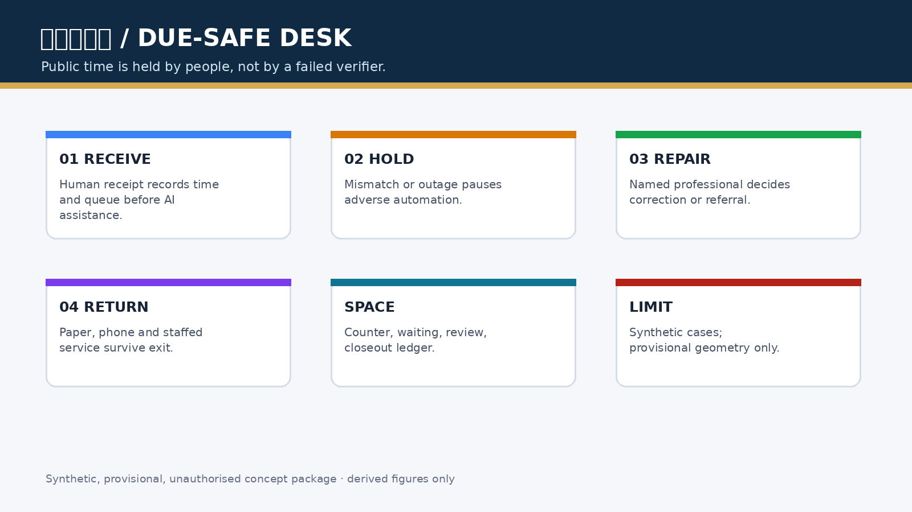
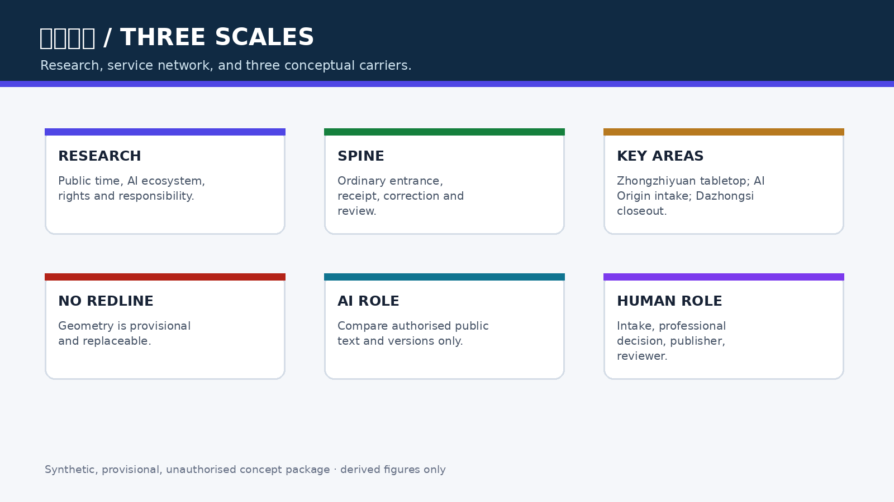
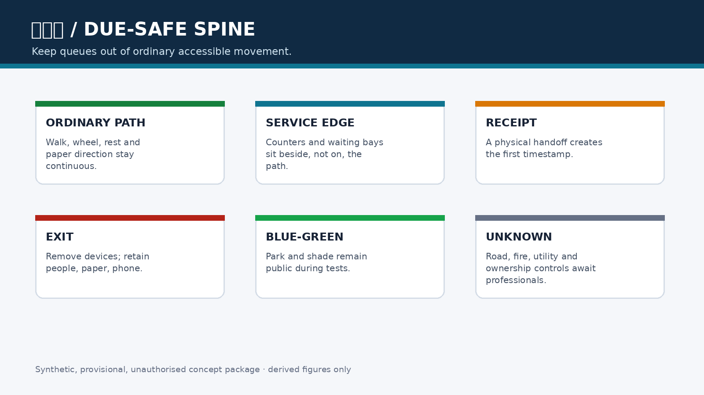
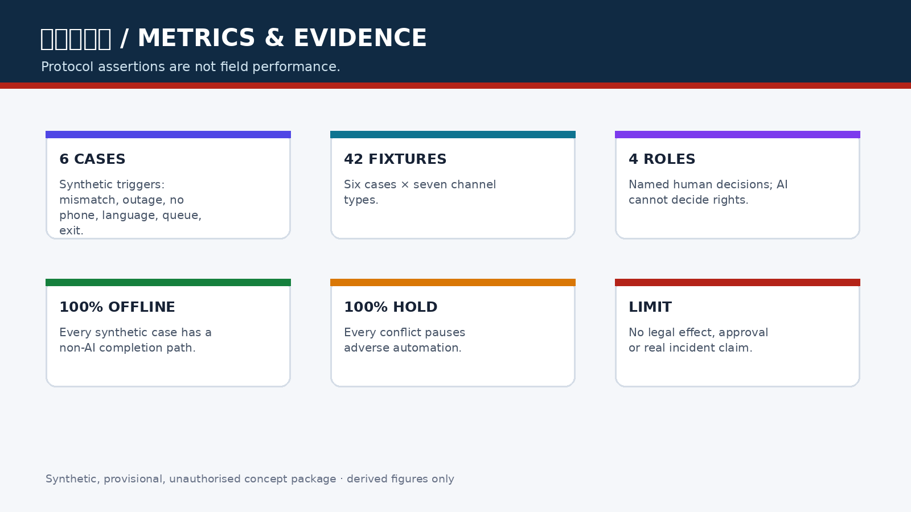

# 京张保期台 / JINGZHANG DUE-SAFE DESK

## 设计依据与资料清单

本方案是面向专业团队深化的 formal 概念包。它使用公告、智能体任务书、来源登记、标准快照和临时几何；临时边界只用于 intake 讨论，不能作为红线、审批、面积或真实服务点依据。[source:OFFICIAL-ANNOUNCEMENT] [source:AGENT-TASKBOOK] [data:geometry/site_boundary.geojson#SITE-001]

公共问题不是“AI 够不够快”，而是一次机器核验失败、断网、字段不一致或供应商退出，是否会吞掉人的原始收件日、队列位置和补正机会。保期台不承诺行政期限暂停、资格结果或赔偿；它提出一条可审计的空间—服务链：先收件、再提示、人工决定、失败不自动失权、退出仍可人工受理。[standard:PROJECT-AGENT-OPEN-CALL-TASKBOOK] [depth:risk_missing_data]

## 三层范围工作框架

统筹研究范围研究公共时间权、AI 创新生态和机构责任；总体设计范围把保期台组织为“保期脊”，由实体取号桌、无屏等候、人工补正、独立复核和副本撤换清单组成；重点区域范围分别承载合成桌演、人工受理和失败复盘。三层范围仍须在正式边界发布后重算。[source:PROCESSED-FACT-PACK] [depth:three_level_scope_framework] [metric:site_area_sqm]

## 统筹研究范围产业与未来城市研究

保期台把高校、企业、社区、公共服务机构、无障碍与法律专业者组织成“公开规则—人工回执—可撤提示—专业决定—退出复原”的创新链。AI 最小角色是比较经授权的公开文本/字段，标记渠道、版本、责任人和适用范围不一致，生成供人工修改的副本地图；AI 不判断资格、诚信、紧急程度、谁应占名额或哪份规则具有法律效力。[source:SOURCE-REGISTRY] [standard:GENERATIVE-AI-INTERIM-MEASURES]

命名识别使用“站台回执”视觉语汇：纸票形状、金色日期线和蓝色人工入口；Logo 仅为本方案原创方向，不使用他人字体、图片、商标或标识。国际传播、年度活动和开发者社区均为概念建议，不是已确定活动。[depth:overall_spatial_structure]

## 总体设计范围城市更新与控规深度城市设计

保期脊优先嵌入既有首层、社区服务前厅或公共空间边缘，不新增道路红线，不指认真实机构。空间顺序固定为：普通入口 → 纸面/电话回执 → 无屏等候 → 人工补正 → 独立复核 → 后场副本清单。任何数字入口都不能位于人工入口之前；退出时撤去临时设备，保留纸票、电话、人工版本表和去标识台账。[data:geometry/public_space.geojson#PUBLIC-001] [data:geometry/buildings.geojson#BLDG-001] [depth:overall_spatial_structure]

用地、建筑、道路、绿地、公共空间和分期图层均是设计提案，不是法定控制。FAR、高度、权属、道路红线、消防、文保和市政条件保持 unknown，待正式资料和专业复核后再决定保留、改造、移位或删除。[standard:MNR-LAND-USE-CLASSIFICATION-GUIDE] [depth:retain_renovate_demolish]

## 重点区域详细设计

| 区域 | 概念任务 | 失败后的公共结果 |
|---|---|---|
| 众智园AI自主创新加速区 | 规则冲突与供应商退出的无个人数据桌演；比较网页、纸表、热线、机器人、API 六类副本 | 冲突期间保持 HOLD，不自动退回；无法核清则人工/纸面办理 |
| 北京AI原点社区 | 保期回执台、无屏补正桌、电话入口与争议封存柜；让无手机和跨语言者完成同一受理步骤 | 原始收到时间和队列号保留，补正由具名责任人处理 |
| 大钟寺AI产业聚集区 | 独立复核间、机构副本撤换清单和去标识失败年鉴 | 逐项关闭下游副本；AI 退出后实体受理继续 |

三处区域是 `provisional_constraint` 概念载体，不是实际窗口、权属或施工点。[data:geometry/key_areas.geojson#PROV-KEY-001] [data:geometry/key_areas.geojson#PROV-KEY-002] [data:geometry/key_areas.geojson#PROV-KEY-003] [depth:three_key_area_detailed_design]

## AI 创新生态、人才画像与 AI+ 场景

受影响者包括无手机居民、跨语言使用者、残障人士、照护者、夜间劳动者、一线受理员、专业审核人、维护人员和未来接手机构。具名决定角色是当班受理责任人、事项专业责任人、规则发布责任人和独立复核人；AI、供应商、普通前台和单一标牌不得单独改变资格或期限。[metric:human_role_count] [depth:public_service_facilities]

| 场景卡 | 空间载体 | 机制与人工底线 |
|---|---|---|
| 01 保期回执台 | AI 原点社区 | 收到时间、队列号、缺口说明先由人工签发 |
| 02 规则冲突桌演 | 众智园 | 合成六类渠道冲突，暂停不利自动动作 |
| 03 无屏补正桌 | AI 原点社区 | 纸面、电话、多语和人工与数字入口同队列 |
| 04 队列保全演练 | AI 原点社区 | 重复提交、字段冲突不重置原始队列号 |
| 05 独立复核间 | 大钟寺 | 专业人员决定补正、转介、受理或拒绝 |
| 06 副本撤换清单 | 大钟寺 | 现场、网页、热线、机器人和 API 逐项回执 |
| 07 争议封存柜 | AI 原点社区 | 最小必要纸面记录，不公开个人事项 |
| 08 服务退出桌 | 三处重点区 | 关闭 AI 后复原人工、电话和纸面路径 |
| 09 多语缺口卡 | AI 原点社区 | AI 翻译可编辑，责任人确认内容 |
| 10 机构复盘年鉴 | 大钟寺 | 只公开去标识失败类型和恢复进度 |
| 11 无手机同入口 | AI 原点社区 | 不因拒绝数字入口降低服务等级 |
| 12 截止前拥堵桌演 | 众智园 | 先收件、后补正，不以自动拒绝换速度 |

其中 02、04、05 是产业/专业测试验证场景。最小原型使用六个合成人物和六类合成渠道，不使用真实案件、身份、服务记录或个人轨迹。[metric:synthetic_case_count] [metric:channel_closeout_fixture_count] [depth:ai_scenario_system]

## 用地、建筑规模与拆改留方案

保期台优先“留”既有人工服务前厅，按“改”加入无障碍桌、纸票柜、版本墙和隔音复核间，只有在专业确认后才讨论“新”建可逆组件。`metrics.json` 中的面积和比例只从提交 GeoJSON 复算；强度、容量、高度、产权和工程结论保持 unknown。[data:geometry/land_use.geojson#LU-001] [metric:building_footprint_area_sqm] [depth:development_intensity_controls]

## 交通、轨道、市政与公共服务设施

保期脊与慢行、轨道站点和普通服务入口相接，但不让排队侵入无障碍净通行。纸面、电话、人工和静态导视形成断网时的同任务路径；设备、电源和网络均为可拆、可替换组件。任何紧急安全处置仍由适用的专业责任人决定。[data:geometry/roads.geojson#ROAD-001] [depth:traffic_rail_slow_parking]

## 蓝绿空间、公共空间与城市风貌

公共空间表达“排队不占常路、回执不暴露个人、AI 关闭仍能找到人”。纸票金线、蓝色人工入口和低对比度状态牌构成克制的京张识别系统；不把屏幕、摄像头或数据柱当作地标。[data:geometry/green_space.geojson#GREEN-001] [data:geometry/public_space.geojson#PUBLIC-001] [depth:blue_green_public_space]

## 更新项目清单、实施政策与分期计划

近期先做合成桌演和纸面协议；中期由机构、专业团队和受影响者共同确认真实程序、权属、消防、无障碍、隐私和运营责任；长期才可能讨论小范围受控试验。项目必须有到期日、人工接管、删除/退出步骤和独立复核；没有这些条件就保持 OFF。分期仅是概念路径，不是投资、审批或实施承诺。[data:geometry/phasing.geojson#PHASE-001] [depth:phasing_implementation]

## 指标体系、面积复算与合规矩阵

结构化指标包括六个合成案例、42 个渠道夹具、7 类渠道、4 个具名人工角色、100% 合成离线完成和 100% 不利自动动作隔离；这些是桌演协议断言，不是现场绩效或法律效果。[metric:synthetic_case_count] [metric:channel_type_count] [metric:human_role_count] [metric:offline_completion_rate] [metric:adverse_action_isolation_rate]

五字段差异审计确认：服务对象是可能因机器失败失去公共时间的人；完整任务新增原始日期/队列保全和机构副本撤换；空间载体是实体回执—补正—复核链；权利把“判断哪份是真的”的成本移回发布机构；失败结果是待人工而非自动逾期。当前未发现合并方案完整覆盖此链，但投稿前仍须复跑最新 main、Issue 与 PR 审计。[depth:metrics_recalculation]

## 风险、版权与合规说明

若回执成为新的举证门槛、无法区分伪造材料、冲突隔离妨碍紧急安全、责任人无法关闭下游副本，或专业者认为不能普遍保护期限，方案立即缩小或拒绝。不得把“保期”写成法律上的信赖保护、期限恢复、福利资格或赔偿。所有图件由本包合成生成，数据来自仓库公开/清权资料；无外部人物、案件、敏感空间或未授权标识。[standard:BARRIER-FREE-ENVIRONMENT-LAW] [standard:GENERATIVE-AI-INTERIM-MEASURES] [depth:risk_missing_data]

## 参考资料

- `brief/site-package/design_brief.json`
- `brief/site-package/agent_taskbook.json`
- `data/source_registry.json`
- `docs/review-rubric.md`
- `docs/formal-submission-guide.md`
- `brief/site-package/standards/references/`
