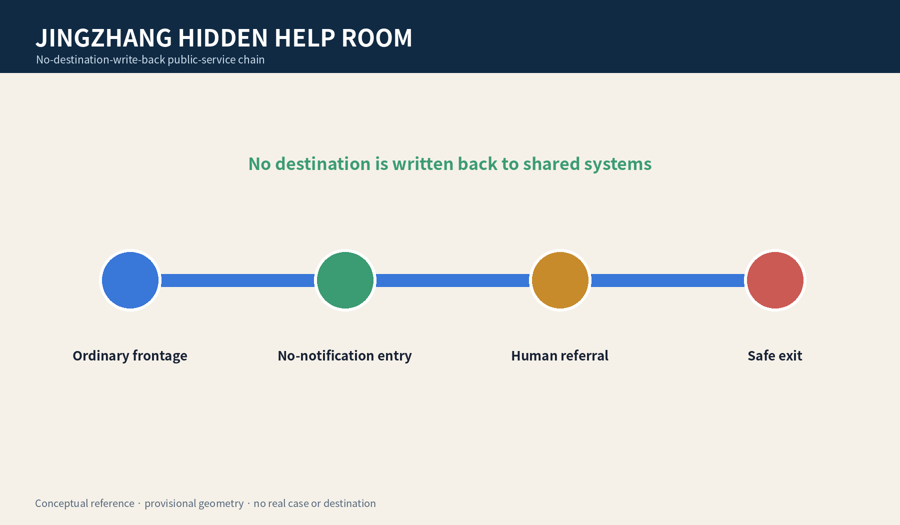
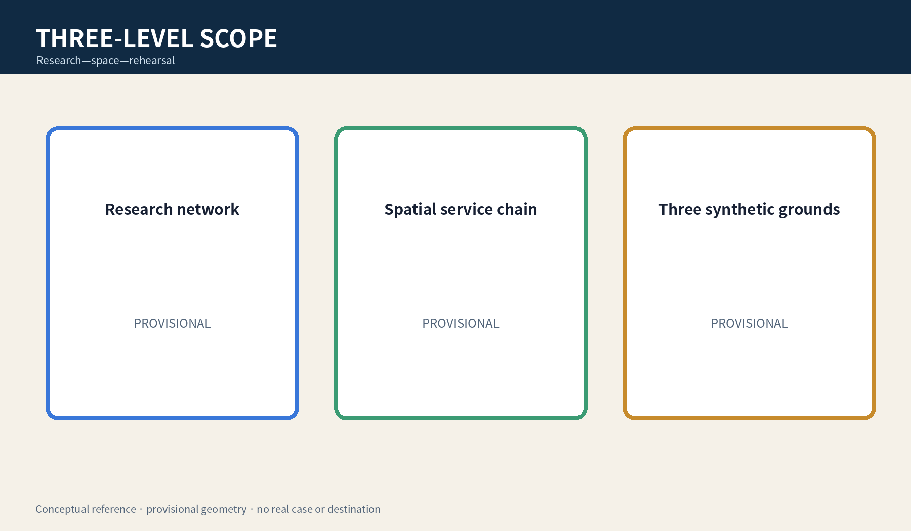
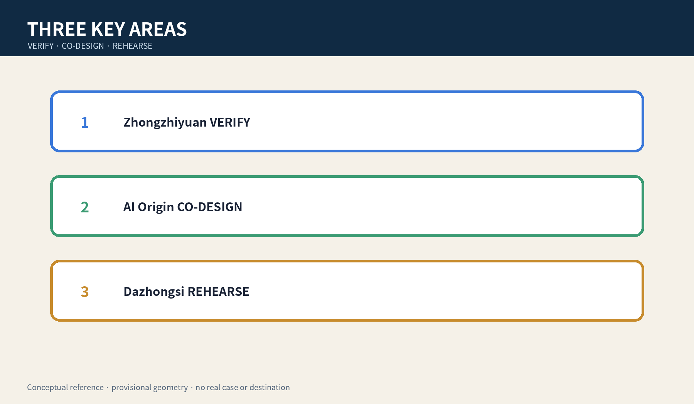

# JINGZHANG HIDDEN HELP ROOM

> Start without an account, do not expose the entry through notifications, let a named professional decide any referral, and leave without writing the next destination to a shared system.

**Boundary notice:** All geometry is provisional rough, low-confidence, and non-official. This is a conceptual reference for professional teams and affected-person representatives to deepen; it identifies no real case, guarantees no safety outcome, and replaces no statutory emergency or record procedure.

## Design Basis and Source List

The proposal uses the official announcement, agent taskbook, public source registry, local professional-standard snapshots, and provisional geometry. The announcement supports scopes and tasks; the taskbook supports agent.1–agent.6. None authorises a real location, security/fire conclusion, title decision, danger classification, or service deployment. Official polygons, real needs, confidential record handling, worker safety, and referral protocols remain pending professional confirmation. [source:OFFICIAL-ANNOUNCEMENT] [source:AGENT-TASKBOOK] [depth:existing_conditions_diagnosis]

Its five-field difference is specific: the user may face control of device, account, or space; the task is discreet discovery—no-notification entry—human referral—no destination write-back—safe exit; the carrier is ordinary frontage plus a multi-use private room; decisions belong to the person and a confidentiality-bound social worker/legal-aid professional; failure stops AI and switches to paper and phone without creating a destination.

## Three-Level Scope Framework

The coordinated layer studies public-service, professional, talent, and cultural networks; the overall layer studies ordinary frontage, private consultation, slow mobility, and exit; three key areas host synthetic rehearsal and conceptual validation only. They separately record sources, human decisions, failure results, and gaps. Recompute all geometry when official polygons arrive. [data:geometry/site_boundary.geojson#SITE-001] [metric:key_area_count] [depth:three_level_scope_framework]

The minimum spatial chain is multi-use ordinary frontage—non-identifying paper ticket—acoustic buffer—private consultation—human referral—safe exit. External signage says only “Private Consultation” and the rooms also serve general legal, health, and employment questions, so the queue does not expose the reason for arrival.

## Coordinated Research Area: Industry and Future City Research

HIDDEN HELP ROOM is a cross-professional urban capability, not a “victim detection” product. Upstream are public options, account-free sessions, paper cards, acoustics, and accessibility. Midstream are social work, legal aid, privacy/records, fire/security, and labour-capacity review. Downstream are synthetic rehearsal, de-identified failure receipts, exit clauses, and affected-person evaluation. The Zhongguancun wing provides cleared specifications; the Xiaoyuehe wing tests ordinary arrival and accessibility only. [depth:ai_ecosystem_case_studies] [source:SOURCE-REGISTRY]

Five case lenses compare data minimisation, address confidentiality, general-purpose private consultation, human referral, and vendor exit without importing foreign rules as local law. Three industry tests cover notification/history write-back, a shared-account proxy asking for records, and outage/staff absence.

## Overall Design Area: Urban Renewal and Regulatory-Plan-Level Urban Design

The overall structure is one no-destination-write-back service chain, three synthetic rehearsal grounds, and two professional support wings. Near term is evidence inventory, a 1:1 no-real-service prototype, and affected-person co-design. A bounded non-case display is discussable only after fire, security, accessibility, privacy, confidential retention, staffing, and referral duties are clear. Any real service requires a separate project and fresh approval. [data:geometry/land_use.geojson#LU-001] [depth:overall_spatial_structure] [standard:MOHURD-CONTROL-DETAILED-PLANNING]

Land-use, buildings, roads, green, and public-space layers express task adjacency only. If privacy, staffing, record isolation, or a safe contact cannot be confirmed, stop the AI session immediately.

## Detailed Design of Key Areas

Zhongzhiyuan VERIFY uses synthetic shared-device cases to check notification, history, and cross-system write-back. AI Origin Community CO-DESIGN tests ordinary frontage, multi-use private consultation, accessibility, and discoverability. Dazhongsi REHEARSE tests rail arrival, translation, no-phone use, staff absence, and vendor exit. Acceptance is not recognition accuracy; it is whether the person can choose without exposing the entry, a named human controls records/referral, and failure switches to paper and safe exit. [data:geometry/key_areas.geojson#PROV-KEY-001] [metric:industry_test_count] [depth:three_key_area_detailed_design]

## AI Innovation Ecosystem, Personas, and AI+ Scenarios

Agent.1 delivers naming, identity, three positions/five functions, and three areas/two wings. Agent.2 delivers five lenses, an ecosystem map, and three synthetic tests. Agent.3 delivers six personas, ten scenario cards, and scenario-space-operation mapping. Agent.4 delivers three landmarks and six components. Agent.5 delivers a culture of railway redundancy, ordinary frontage, and quiet exit. Agent.6 delivers quarterly rehearsal, half-yearly co-design, an annual forum, and a continuous exit ledger. [standard:PROJECT-AGENT-OPEN-CALL-TASKBOOK] [metric:scenario_card_count] [metric:persona_count]

Six personas are: shared-phone user, person without a personal device, minor, person needing translation/accessibility, accompanying caregiver, and frontline worker. They are design prompts, never inferred victim/perpetrator labels.

Ten cards are: 1 read public resources without an account; 2 shared-phone notification warning; 3 family proxy requests records; 4 no phone; 5 translation/easy read; 6 choose paper take-away/destruction; 7 professional creates lawful minimum record; 8 staff absent; 9 vendor outage; 10 safe exit after service. AI only presents reviewed public options, translates, checks shared-history write-back, and clears a local session after human confirmation.

## Land Use, Building Scale, and Retain-Renovate-Demolish Strategy

Four gapless zones express adjacency among ordinary service, Jing-Zhang park, private consultation/professional service, and community support. Footprints are movable no-real-case prototype envelopes, not existing or construction quantities. FAR, height, density, setbacks, structure, fire compartmentation, and title await official conditions. Retain/renovate/demolish means verify conditions and rights first, prefer ordinary rooms and movable components, and do not alter/build/test when conditions are unknown. [metric:building_footprint_area_sqm] [data:geometry/buildings.geojson#BLDG-001] [depth:retain_renovate_demolish]

The design intent is to let the task use general service space rather than create a recognisable special facility. The gapless land-use zones and conceptual building envelopes check whether the spatial chain fits inside the submission boundary; their areas prove package topology only, not that a room exists, can be acquired, or meets acoustic performance. Professional development must add room dimensions, acoustics, sightlines, access control, evacuation, fire, accessibility, title, and frontline-worker safety surveys, while affected-person representatives test whether multi-use presentation makes the entry undiscoverable. If any condition remains unresolved, retain ordinary human consultation and do not alter, build, or test with real cases.

## Transport, Rail, Municipal Infrastructure, and Public Services

The road layer is a task relation, not a road redline. The ordinary path lets a person without phone or account reach a human interface; the AI line must remain removable and cannot block paper/phone fallback. Rail access, crossings, parking, fire access, evacuation, and night safety await professional review. Municipal strategy is limited to local temporary sessions, physical disconnect, paper cards, phone, and minimal logs; capacity requires rosters, peaks, cover shifts, and recovery reconciliation. [data:geometry/roads.geojson#ROAD-001] [depth:traffic_rail_slow_parking] [standard:MOHURD-URBAN-DESIGN-MEASURES]

## Blue-Green Network, Public Space, and Urban Character

Blue-green slow mobility is not a “secret route”; it is an ordinary, accessible, revocable public path that displays no referral destination and publishes no small-sample attendance. Three conceptual landmarks are Quiet Gate (explains no write-back), Human Decision Table (shows roles and stop rights), and Clear Receipt Light (shows only that the session is cleared). An honour wall displays cleared specifications, synthetic tests, and version contributions; withdrawal can remove identity while retaining de-identified facts. [data:geometry/green_space.geojson#GREEN-001] [data:geometry/public_space.geojson#PUBLIC-001] [depth:blue_green_public_space]

The component library includes multi-use signage, non-identifying paper ticket, acoustic buffer, write-back check card, human-referral card, and exit-clear checklist, all subject to affected-person and professional review.

## Renewal Projects, Implementation Policy, and Phasing

JZ-01 inventories public-service/confidentiality/emergency procedures. JZ-02 builds a no-real-case 1:1 prototype. JZ-03 tests shared-device and notification write-back. JZ-04 conducts affected-person, social-work, legal, privacy, fire/security, and labour review. JZ-05 discusses bounded display only after critical items close. JZ-06 can trigger exit at any stage. Exit disables the smart layer, disposes logs under an applicable basis, hands over open matters, and preserves ordinary human consultation. [data:geometry/phasing.geojson#PHASE-001] [depth:renewal_project_list] [metric:implementation_gate_count]

Operations are a quarterly synthetic stress test, half-yearly affected-person co-design, annual revocable public-service forum, and continuous rights/version ledger. They are concepts, not government event, procurement, investment, or attraction commitments.

## Metrics, Area Recalculation, and Compliance Matrix

Metrics have three classes: spatial consistency recomputed from GeoJSON in EPSG:4548; conceptual counts of five lenses, three tests, ten scenarios, six personas, three landmarks, and five gates; and a synthetic “zero destination write-back to shared systems” target. Known values do not extrapolate real demand, capacity, legality, or safety. Agent.1–agent.6 each map to dedicated chapters, figures, spatial objects, metrics, sources, and outputs; exhaustive audit stays in structured files. [metric:site_area_sqm] [depth:metrics_recalculation] [metric:case_study_count]

## Risk, Copyright, and Compliance

Main risks are provisional geometry mistaken for redlines; multi-use signage making the entry undiscoverable; AI inferring danger or alerting on its own; notification/map/shared-calendar exposure; lawful retention being misread as avoidable; staff becoming unlimited fallback; and vendor exit leaving records. Controls are package-wide provisional notices, prohibited AI roles, named human decisions, paper fallback, staffing limits, exit lists, and affected-person co-design. All text, figures, HTML/PDF, and structured design were generated by this agent; Noto CJK fonts are embedded under their licence. There are no real cases, addresses, destinations, or uncleared brands. [source:SITE-PACKAGE] [depth:risk_missing_data] [standard:PROJECT-AGENT-OPEN-CALL-TASKBOOK]

## References

Full provenance, licences, and limits are in `sources.json`, `standard_matrix.json`, `design_depth_matrix.json`, and `report/copyright_statement.md`. The official announcement supports tasks and scopes; provisional geometry supports generation, visualisation, and discussion only. [source:OFFICIAL-ANNOUNCEMENT] [source:SOURCE-REGISTRY]

Source grades directly constrain design claims: the official announcement and cleared taskbook can describe objectives and deliverables; local professional-standard snapshots define questions for later review; provisional boundaries only check layer topology and cannot support redlines, precise areas, title, or engineering conclusions. Concept counts come from manual enumeration of this package's scenarios, personas, landmarks, and gates, not observed city statistics. When official polygons, controls, utilities, heritage, fire/security, real-service needs, or applicable procedures change, record provenance, purpose, licence, date, and limits first, then regenerate GeoJSON, metrics, figures, HTML, and PDFs. Unverifiable material remains pending official data and cannot be promoted into fact.
