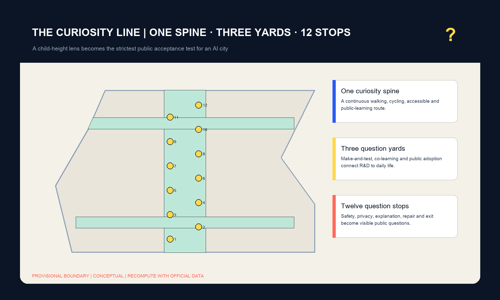
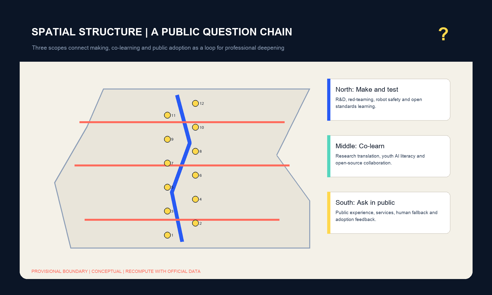
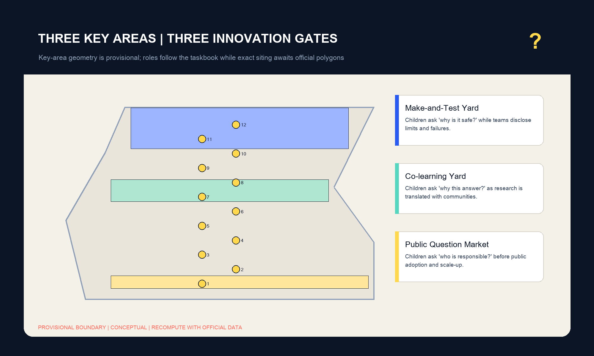
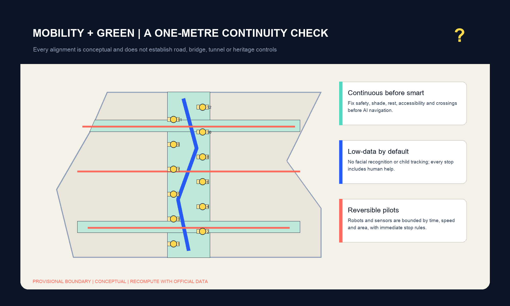
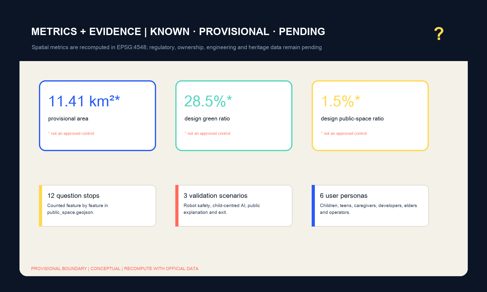

# THE CURIOSITY LINE

**Proposition.** An AI city should not be proven only by compute capacity, investment or polished demonstrations. It should also answer the questions of a child standing on a street corner: Why is this safe? Why did the system answer this way? Who can see the data? Who repairs a failure? Can I still receive the service if I refuse automation? The Curiosity Line turns those questions into public acceptance tests and reconnects the engineering curiosity of the historic Jing-Zhang railway with responsible urban innovation.

## Design Basis and Source List

This professional design package responds to the official announcement, the repository taskbook and the structured site package. It uses the repository provisional site and key-area polygons because official planning polygons, regulatory controls, building surveys, ownership, utilities and heritage controls are not available. Therefore every geometry-derived value is a reproducible intake metric, not a statutory conclusion. The source registry and processed fact pack guide navigation but do not create new authority [source:OFFICIAL-ANNOUNCEMENT] [source:AGENT-TASKBOOK] [source:SOURCE-REGISTRY].

The proposal separates facts, design choices and missing information. GeoJSON stores spatial proposals, `metrics.json` stores formulas and confidence, and the matrices map requirements to readable evidence. The official boundary, key areas, existing buildings, children’s participation and engineering constraints must be replaced or confirmed before implementation. The current package remains eligible for content review because its provisional status is visible in text, figures, HTML and drawings [source:SITE-PACKAGE] [source:BOUNDARY-SOURCE] [source:KEY-AREA-SOURCE].

## Three-Level Scope Framework

The coordinated research area establishes the innovation ecosystem and future-city position; the overall design area translates that strategy into renewal, land use, mobility, infrastructure and public-space systems; the three key areas test detailed spatial and operational responses. These scopes are connected by one method: every strategic claim must reach a location, a responsible actor, a review question and an exit rule. The framework follows the official scope structure while refusing false precision [standard:PROJECT-OFFICIAL-ANNOUNCEMENT] [depth:three_level_scope_framework].

The spatial concept is **one curiosity spine, three question yards, two wings and twelve question stops**. The north Make-and-Test Yard exposes technical limits, the central Co-learning Yard translates research with communities, and the south Public Question Market tests adoption and human fallback. East-west links connect university and research resources to neighbourhood life. The question-mark and railway-switch identity represents futures that remain open to public choice [depth:overall_spatial_structure].

## Coordinated Research Area: Industry and Future City Research

Five international mechanisms inform, but do not determine, the proposal. Punggol Digital District links industry, education and community through an open digital testbed. Seoul AI Hub provides city-level education, incubation, research and open innovation. Mila connects open science with responsible AI. Vector bridges universities, industry and government through a nonprofit institution. Paris-Saclay’s Urba(IA) uses a consortium, pilot territories and user review to evaluate urban AI [source:CASE-PUNGGOL] [source:CASE-SEOUL-AI-HUB] [source:CASE-MILA].

The Jing-Zhang response combines these mechanisms in public space: developers bring fallible prototypes into the Make-and-Test Yard; universities and communities translate limits in the Co-learning Yard; products undergo adoption, accessibility and exit tests in the Public Question Market. This creates a complete route from research to public value without confusing an innovation demonstration with approval [source:CASE-VECTOR] [source:CASE-PARIS-SACLAY] [standard:PROJECT-AGENT-OPEN-CALL-TASKBOOK].

## Overall Design Area: Urban Renewal and Regulatory-Plan-Level Urban Design

The overall design uses a complete land-use partition, a continuous north-south green and learning spine, three east-west stitching links, three conceptual adaptive-reuse footprints and twelve public-space stations. These elements describe an urban-design structure, not parcel approvals. The formal site boundary is still provisional, while floor-area ratio, height, density, setbacks and demolition decisions remain unknown until official controls and surveys arrive [data:geometry/site_boundary.geojson#SITE-001] [data:geometry/land_use.geojson#LU-001] [depth:land_use_layout].

Renewal begins with continuity rather than technology. Safe crossings, shade, rest, accessibility, clear sight lines and human help must work before AI navigation or sensing is introduced. New infrastructure is limited to auditable, low-data and reversible services with visible ownership and stop rules. This converts regulatory-plan-level intentions into objects that professional planning, transport, municipal, heritage and safety teams can verify [standard:MOHURD-CONTROL-DETAILED-PLANNING] [depth:development_intensity_controls].

## Detailed Design of Key Areas

The **Zhongzhiyuan Make-and-Test Yard** is a garden-based environment for red-teaming, low-speed robot safety, standards learning and honest failure display. The **AI Origin Co-learning Yard** connects research translation, youth AI literacy, open-source contribution and talent services. The **Dazhongsi Public Question Market** combines public experience, professional referral, human fallback and adoption feedback. Together they turn research, translation and use into a visible accountability loop [data:geometry/key_areas.geojson#PROV-KEY-001] [data:geometry/key_areas.geojson#PROV-KEY-002] [data:geometry/key_areas.geojson#PROV-KEY-003].

All three key-area geometries are provisional and their exact location, size and relationship to stations, heritage, ownership and roads must be confirmed. The proposed footprints represent spatial types for adaptive reuse rather than demolition or construction commitments. Detailed design therefore focuses on program, interfaces, access, public-space continuity, governance and implementation dependencies [depth:three_key_area_detailed_design] [metric:key_area_count].

## AI Innovation Ecosystem, Personas, and AI+ Scenarios

Six personas form the acceptance panel: children, teenagers, caregivers and disabled families, developers, older or low-digital-skill residents, and city operators. Success means that a service is understandable, reachable without a phone, contestable, repairable and equally available after refusing automation. Beijing’s child-friendly policy and UNICEF’s child-centred AI guidance inform this framework; however, no child consultation occurred in this AI-generated round, so children must become real co-reviewers before any pilot [source:BEIJING-CHILD-FRIENDLY] [source:UNICEF-AI-CHILDREN].

Twelve scenario cards occupy the question stops. Three are validation scenarios: a bounded low-speed robot safety class, a child-understandable AI explanation review, and a public-service exit drill for network failure, misclassification, complaint, deletion and human handover. Nine supporting scenarios cover one-metre-height walkability, tree and rain observation, sourced railway memory, open-source contribution, no-phone service days, night safety walks, professional referral, an honest-failure archive and an annual Global Curiosity Week [metric:question_station_count] [metric:test_scenario_count] [metric:persona_count].

Four conceptual landmarks create a pilgrimage narrative: the Visible Failure Tower, the Century Question Rail, the Common Learning Table and the Human Takeover Bell. They are public-art and operational prototypes for professional refinement, not approved structures. Each celebrates contribution while making limits, authorship, correction and withdrawal visible [metric:landmark_count].

## Land Use, Building Scale, and Retain-Renovate-Demolish Strategy

Four interoperable land-use bands support open validation, learning commons, translation services and community care. Their topology preserves the repository scaffold partition and remains free of gaps and overlaps. Three conceptual building footprints indicate possible adaptive-reuse yards, but no existing structure is classified for retention, renovation or demolition without survey, ownership, structural, fire and heritage evidence [standard:MNR-LAND-USE-CLASSIFICATION-GUIDE] [data:geometry/buildings.geojson#BLDG-001].

The provisional footprint area is approximately 213,617 square metres and has low confidence because it represents a design type rather than surveyed buildings. Building height, total floor area and floor-area ratio remain unknown. Professional deepening must first map every existing building, ownership unit, active tenant, heritage value and life-safety constraint, then apply a transparent retain-renovate-demolish decision matrix [metric:building_footprint_area_sqm] [depth:retain_renovate_demolish] [depth:height_massing_character].

## Transport, Rail, Municipal Infrastructure, and Public Services

The mobility proposal prioritises a continuous accessible walking and cycling spine, three east-west links, safe station access and low-speed public-space conditions. It does not establish road redlines, bridge or tunnel works, parking supply or rail engineering. Every crossing and discontinuity must be audited at a child’s eye height with caregivers, disabled participants and transport professionals before route alignment is fixed [data:geometry/roads.geojson#ROAD-001] [depth:traffic_rail_slow_parking].

Municipal and digital infrastructure follows a minimum-data rule. Edge computing, sensors or service kiosks may only be added when energy, communications, drainage, fire, maintenance, privacy and responsible-operator requirements are confirmed. Every digital service needs a paper or staffed alternative, a visible purpose statement, retention limits and an immediate stop mechanism. Missing utilities and statutory controls are recorded as gaps rather than drawn as invented infrastructure [data:geometry/constraints.geojson#CONSTRAINTS] [depth:municipal_new_infrastructure].

## Blue-Green Network, Public Space, and Urban Character

The Curiosity Green Spine and two cross-gardens link learning, rest, rain observation and innovation exchange. Twelve small question stops provide shade, seating, accessible information and human help. Their provisional union ratios are approximately 28.50 percent green space and 1.53 percent question-stop public space; these values describe submitted geometry, not approved controls [data:geometry/green_space.geojson#GREEN-001] [data:geometry/public_space.geojson#PUBLIC-001] [metric:green_ratio].

Urban character combines railway engineering memory, Zhongguancun’s open innovation culture and the ethics of asking before scaling. Deep navy represents evidence, cobalt the innovation chain, yellow public questions, coral human review and risk, and mint everyday walking and ecological continuity. Historical narratives must cite cleared sources and say “unknown” when evidence is absent. Public art and identity should remain legible without screens [metric:public_space_ratio] [depth:blue_green_public_space] [standard:MOHURD-URBAN-DESIGN-MEASURES].

## Renewal Projects, Implementation Policy, and Phasing

Ten work packages cover the continuity repair, three question yards, first four question stops, green network, human-fallback desk, public contribution landmarks, Global Curiosity Week and quarterly audit. Phase 1 observes and measures after official base data arrives; Phase 2 co-learns and validates after planning, ownership and engineering checks; Phase 3 connects and iterates only after pilot evidence is public. The list is a professional work plan, not an investment or delivery commitment [metric:renewal_project_count] [data:geometry/phasing.geojson#PHASE-001].

Operations occur monthly for open tests, quarterly for the line audit and annually for Global Curiosity Week. Every event publishes the question, responsible actor, incident log, correction deadline and unresolved list. A pilot pauses if it fails safety, explanation, human-fallback or data-minimisation requirements for two review cycles. Procurement and operating agreements must preserve public reporting, withdrawal, deletion and independent review [depth:renewal_project_list] [depth:phasing_implementation].

## Metrics, Area Recalculation, and Compliance Matrix

The provisional site area is approximately 11.41 square kilometres. The package recomputes site, building footprint, green and public-space ratios in EPSG:4548 and counts three key areas, twelve question stops, three validation scenarios, six personas, four landmarks and ten renewal packages. Formulas, source files, confidence and assumptions remain in `metrics.json` so reviewers can reproduce the result [metric:site_area_sqm] [depth:metrics_recalculation].

Known geometry metrics must be recalculated when official polygons arrive. Floor-area ratio remains unknown because approved controls and building surveys are absent. The compliance matrix maps every official task and agent task to report sections, geometry, drawings, sources, assumptions and self-checks. It intentionally distinguishes canonical planning controls from design suggestions and operational performance indicators [standard:MOHURD-ARCH-DESIGN-DEPTH-2016] [source:PROCESSED-FACT-PACK].

## Risk, Copyright, and Compliance

Four material gaps remain: provisional boundaries, missing regulatory and engineering controls, missing existing-building and ownership surveys, and missing participatory validation with children and other users. The proposal makes no claim of approval, final land use, demolition, investment, government commitment or guaranteed implementation. Geometry and diagrams must be reviewed by licensed planning, architecture, transport, municipal, heritage, safety and child-protection professionals [depth:risk_missing_data].

All created text, code, geometry, diagrams and drawings use the package licence and are documented in the copyright statement. External sources support policy and transferable mechanisms only; their text, images, marks and layouts are not copied. The offline HTML loads no remote script, map tile, font, iframe, form, API or tracking. A real participation round must provide child safeguarding, accessible consent and withdrawal, and a public record of how feedback changes the design.

## References

The structured inventory in `sources.json` is the controlling bibliography. It includes the official announcement and site package, the taskbook, Beijing child-friendly policy, UNICEF guidance, and official institutional sources for Punggol Digital District, Seoul AI Hub, Mila, Vector Institute and Paris-Saclay Urba(IA). Each source is used only for the purpose and limitation recorded in that inventory; the provisional boundary remains a generation and review aid rather than an official redline [source:CASE-PARIS-SACLAY] [source:UNICEF-AI-CHILDREN].

