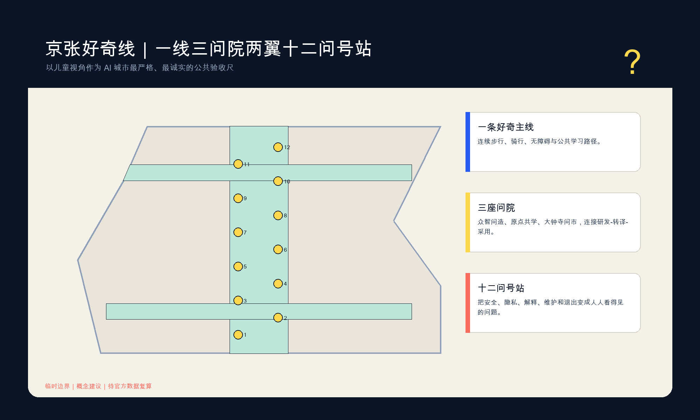
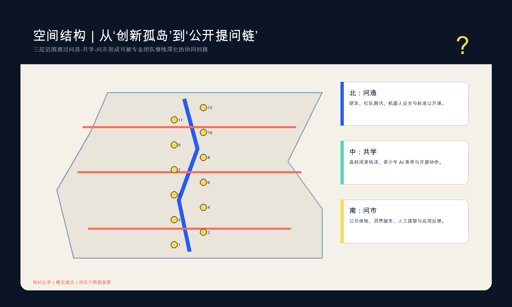
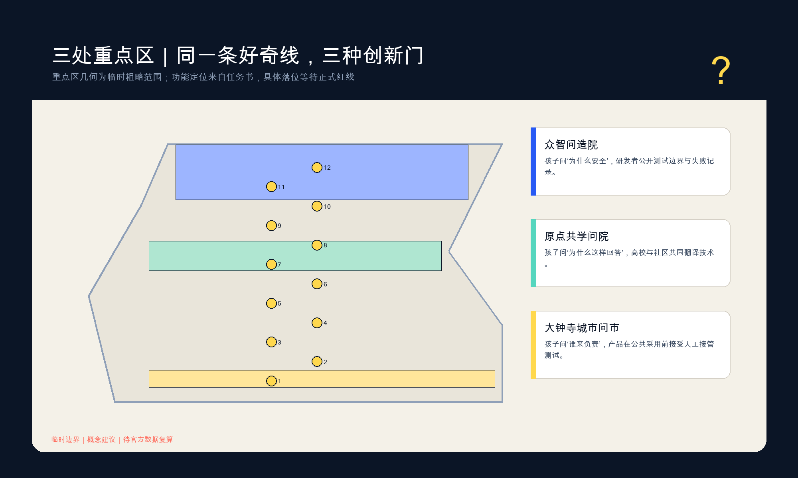
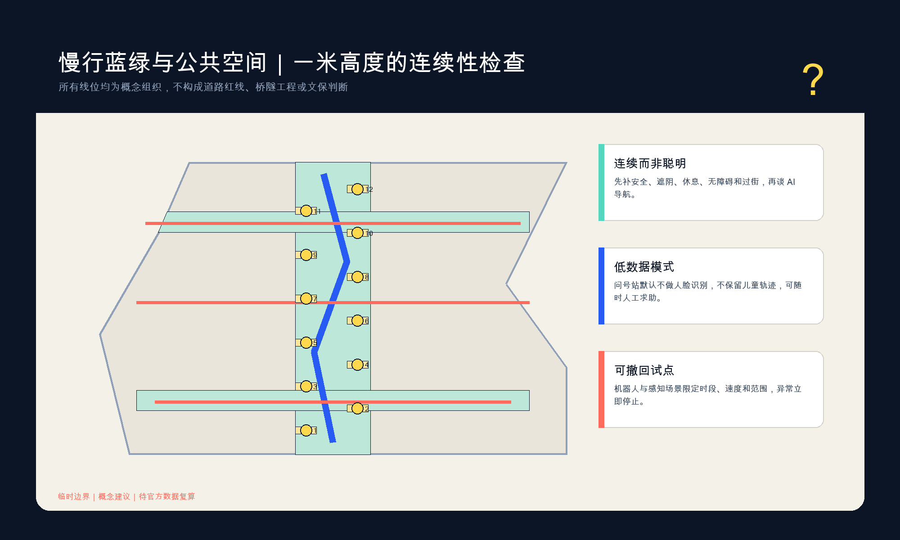
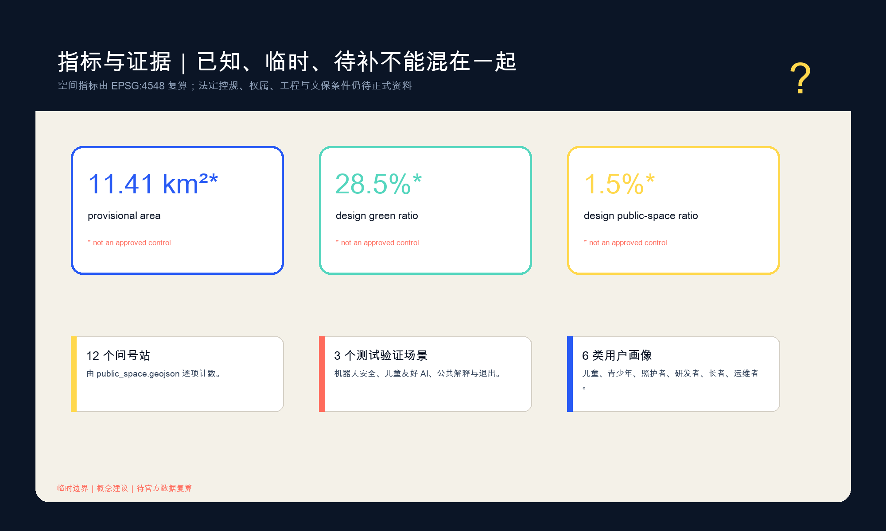

# 京张好奇线 / THE CURIOSITY LINE：把孩子的十万个为什么变成 AI 城市的公开测试题

**核心命题。** AI 城市不应只在算力榜单和企业园区里被证明，也应能回答一个孩子站在街角提出的问题：为什么安全、为什么这样回答、谁能看见数据、出错时谁负责、我不使用它行不行？“京张好奇线”以儿童的一米视角作为最严格、也最诚实的公共验收尺，把百年京张的工程求索精神转译为一条人人可提问、研发者必须回应、运营者持续复盘的公开测试带。

## 设计依据与资料清单

本 formal 方案以北京市规划和自然资源委员会海淀分局发布的《百年京张AI创新带城市设计国际方案征集资格预审公告》为第一依据，并以 `brief/site-package/` 中经维护者登记的临时粗略边界、重点区域、枚举、指标和来源清单为机器可读依据。AI agent 在生成方案前必须读取 `design_brief.json`、`allowed_design_space.json`、`sources.json`、`enums/`、`ranges/`、`schemas/`、`data/source_registry.json` 和 `data/processed/agent_fact_pack.md`，并用 `project_scope_summary.csv`、`agent_task_requirements.csv`、`source_use_matrix.csv`、`missing_data_checklist.csv` 建立任务、范围、资料用途和缺口清单。所有设计判断都要拆分为可追溯来源、可复算指标、可校验图层和可人工复核假设。公告要求方案达到控制性详细规划的城市设计深度和规划综合实施方案的城市设计深度，因此文本叙述不能替代 GeoJSON、指标表、A3 文册、A0 展板和 HTML 电子展示成果。

方案不是独立愿景文本，而是从公告、面向智能体任务书和场地资料出发组织成果；本节只把最关键依据放在判断旁边 [source:OFFICIAL-ANNOUNCEMENT] [source:AGENT-TASKBOOK] [depth:existing_conditions_diagnosis]。完整来源和标准覆盖分别保存在 `sources.json`、`standard_matrix.json` 与 `design_depth_matrix.json`，不在正文重复机器索引。

资料登记表的使用边界如下 [source:SOURCE-REGISTRY]：

- data/source_registry.json 登记公开、清权与临时资料的用途边界。
- 当前登记摘要：formal 可用资料 7 条，背景资料 1 条，provisional-only 资料 1 条。
- agent 不得把 background_only 或 provisional_only 资料升级为 official boundary、法定控规、正式评分依据或政府实施承诺。

`data/processed/agent_fact_pack.md` 是本方案的阅读导航层，不是新的权威来源 [source:PROCESSED-FACT-PACK]。它帮助 agent 把三层范围、三处重点区、公告任务、agent.1-agent.6、资料可用性和缺资料事项组织成可读方案；事实判断仍需回到已登记的原始材料 [source:OFFICIAL-ANNOUNCEMENT] [source:AGENT-TASKBOOK]，完整来源关系由 `sources.json` 保存。

本脚手架在官方 `SITE_BOUNDARY` 或三处 `KEY_AREA` 尚未取得时，使用 `brief/site-package/geometry/provisional_boundaries.geojson` 生成临时 formal 包。提交包中的 `geometry/site_boundary.geojson` 与 `geometry/key_areas.geojson` 均必须标注为 `provisional_constraint`、`official_boundary=false`，只能用于方案生成、自检、可视化和设计讨论，不能作为 official redline、审批依据、精确面积依据或法定控制结论。该组织方数据缺口本身不阻断内容评分；替换 official polygons 后，site boundary、key areas、land use、roads、green space、public space、buildings、phasing 和 metrics 均需重算。

本次提交状态为：**临时边界，保留精度警示并待正式数据发布后复算；不阻断内容评分**。因此，正文中的空间结构、场景、项目和指标均按“可讨论、可复核、可替换官方边界后重算”的原则写入；当官方边界和重点区 polygon 更新后，agent 必须重新运行空间复核、自检和图纸/HTML生成，不能只替换单个文件。

边界解释可回到总体范围图层和面积复算 [data:geometry/site_boundary.geojson#SITE-001] [metric:site_area_sqm]。三处重点区则由独立图层和数量指标核对 [data:geometry/key_areas.geojson#PROV-KEY-001] [metric:key_area_count]。这意味着读者可以从正文进入证据，但不必先读一串机器编号。

## 三层范围工作框架

方案按照公告确定的三个层次组织工作：统筹研究范围关注 43.6 平方公里的AI产业生态、战略定位、创新链和未来城市形态；总体设计范围关注 11.4 平方公里京张遗址公园周边 1-2 公里城市地区和产业区，要求形成城市更新总体框架、产业空间布局、交通市政支撑和城市风貌控制；重点区域范围关注 368.4 公顷三处详细设计地区，要求明确功能业态、建筑规模、拆改留分类、公共空间连通和交通组织。三层范围在 `compliance_matrix.json` 中逐条映射，保证公告 1.3、1.4、1.5 与 agent.1-agent.6 的必选任务都有章节、图层、指标、图纸和 HTML 证据。

三层工作框架的深度项由 [depth:three_level_scope_framework] 和 [depth:overall_spatial_structure] 约束，空间证据以 [data:geometry/site_boundary.geojson#SITE-001] 与 [data:geometry/key_areas.geojson#PROV-KEY-001] 为准，任务依据以 [standard:PROJECT-OFFICIAL-ANNOUNCEMENT] 为准，范围索引以 [source:PROCESSED-FACT-PACK] 中 `project_scope_summary.csv` 的三层范围表为导航。

三层工作不是互相割裂的图纸集合。统筹研究决定产业链和城市形态判断，总体设计把判断落实到更新项目、空间结构和设施承载，重点区域详细设计验证具体地块、建筑、交通、公共空间和AI应用场景的可实施性。agent 生成方案时必须先锁定当前提交采用的 official 或 provisional 边界和约束，再生成用地、建筑、道路、绿地、公共空间、分期和AI服务节点，最后从这些图层复算指标并在正文解释哪些结论仍受 provisional boundary 限制。任何无法从结构化数据复算的面积、比例、规模或项目数量，不得写入正式结论。

总体概念为“**一线三问院、两翼十二问号站**”：一线是沿京张遗址公园组织的好奇主线；三问院是北部众智问造院、中部原点共学问院、南部大钟寺城市问市；两翼是三条东西缝合线连接的高校研发翼与社区生活翼；十二个问号站把安全、隐私、解释、无障碍、维护和退出权做成可步行到达的公共接口。问号与铁路道岔组合为视觉符号：道岔代表可选择的未来，问号代表创新在进入城市生活前必须接受追问。

| 层级 | 设计问题 | 方案回答 | 数据落点 |
| --- | --- | --- | --- |
| 统筹研究范围 | AI产业生态和未来城市形态如何组织 | 建立“高校策源-开源协作-企业转化-公共体验-国际传播”的创新链 | compliance_matrix.json、standard_matrix.json |
| 总体设计范围 | 产业空间、城市更新、交通市政和风貌如何落图 | 用地、建筑、道路、绿地、公共空间和分期图层共同表达 | [data:geometry/land_use.geojson#LU-001]、[data:geometry/roads.geojson#ROAD-001] |
| 重点区域范围 | 三处片区如何达到详细设计深度 | 分别提出定位、空间动作、AI场景和实施依赖 | [data:geometry/key_areas.geojson#PROV-KEY-001]、[data:geometry/key_areas.geojson#PROV-KEY-002]、[data:geometry/key_areas.geojson#PROV-KEY-003] |

## 统筹研究范围产业与未来城市研究

统筹研究范围的核心任务是构建世界级 AI 创新生态体系。方案应梳理海淀高校院所、头部企业、算力算法数据要素、孵化平台、上市企业、独角兽和科技服务资源，提出AI创新链、产业链、人才链和城市服务链的空间协同框架。命名方案和 logo 设计应服务于“百年京张文化带、都市AI生活体验带、AI融合创新带”的整体辨识度，不能只停留在口号，应说明与产业生态、公共空间和文化资源的关联。面向智能体任务书还要求回应“五大功能”和“三区两翼”协同，形成可继续深化的命名系统、视觉识别、总体空间结构图、场景开放和运营机制；本节必须用 [source:AGENT-TASKBOOK] 与 [standard:PROJECT-AGENT-OPEN-CALL-TASKBOOK] 标注这些要求来自 agent 开源征集任务，而不是法定规划控制。

统筹研究并不新增伪精确红线；它通过 [standard:MOHURD-URBAN-DESIGN-MEASURES] 要求的城市风貌、公共空间和建筑布局统筹，回接 [data:geometry/land_use.geojson#LU-001]、[data:geometry/public_space.geojson#PUBLIC-001] 与 [depth:overall_spatial_structure]，说明产业策略最终要落到可见、可复核的空间结构。

未来城市形态研究应回答人工智能如何改变工作、生活、社交、学习、交通和公共服务。方案应把AI交通系统、连续绿色空间、创新服务设施和国际化生活工作氛围落实为可定位的功能区、节点、廊道和场景，而不是泛泛描述技术愿景。agent 应把产业战略指标、AI创新指数、人才密度、空间供给类型和AI+垂直应用重点区域写入指标体系，并标明哪些是官方、哪些是设计建议、哪些仍待正式数据校准。若提出全球AI创新活动、开发者社区、开放场景或朝圣路线，应写为“概念建议/参考方案/可供专业团队深化研究”，不得写成已经确定的政府活动或实施安排。

五个国际案例只提炼可迁移机制，不复制形态或宣传口径。新加坡榜鹅数字园区提示“产业—教育—社区共址”和开放数字平台可把城区变成日常测试床 [source:CASE-PUNGGOL]；首尔 AI Hub 提示市级平台可连续覆盖教育、孵化、研发和开放创新 [source:CASE-SEOUL-AI-HUB]；蒙特利尔 Mila 提示开放科学与负责任 AI 应成为社区制度 [source:CASE-MILA]；多伦多 Vector 提示非营利机构可做高校、产业与政府之间的可信桥梁 [source:CASE-VECTOR]；巴黎萨克雷 Urba(IA) 则提示多主体联盟、试点区域和用户委员会应共同评估城市 AI [source:CASE-PARIS-SACLAY]。

京张的差异不在于再建一座封闭 AI 园区，而在于把这五种机制折叠到公共空间：企业带着可失败的原型进入问造院，高校与社区在共学问院翻译模型边界，产品在问市接受儿童、照护者、长者和运维者的采用测试。品牌、空间和年度运营由同一套问题清单驱动，使“创新带”同时成为面向全球开发者的技术目的地和面向普通市民的公共学习设施。

## 总体设计范围城市更新与控规深度城市设计

总体设计范围要求达到控制性详细规划的城市设计深度。方案必须提出城市更新总体空间结构、低效空间识别、更新项目清单、实施政策建议、产业功能比例、空间组织模式、建筑总规模和综合承载能力评估。`geometry/land_use.geojson` 应完整覆盖设计边界且无重叠，`geometry/buildings.geojson` 应表达更新建筑基底或保留建筑基底，`geometry/roads.geojson` 应表达微循环、慢行和轨道接驳关系，`metrics.json` 应复算核心面积、比例和图层数量。

本节按照 [standard:MOHURD-CONTROL-DETAILED-PLANNING] 把控规深度内容拆成可审查对象：[data:geometry/land_use.geojson#LU-001] 表达用地结构，[data:geometry/buildings.geojson#BLDG-001] 表达建筑基底，[data:geometry/roads.geojson#ROAD-001] 表达交通组织，[metric:building_footprint_area_sqm] 用于复核建筑基底面积，[depth:land_use_layout] 与 [depth:development_intensity_controls] 约束成果深度。

总体设计还必须支撑交通、轨道、市政和配套设施。方案应围绕轨道站点一体化、道路微循环、非机动车停放、停车供给、创新服务平台、人才生活服务、新型基础设施、分布式能源和端侧算力提出空间布局和实施路径。涉及建筑高度、开发强度、道路红线、退线和设施标准的内容，若尚无官方控制条件，应写为“待正式控规条件确认”，不得以 agent 推测值冒充审定指标。

## 重点区域详细设计

重点区域详细设计是必选项。众智园AI自主创新加速区应围绕国家人工智能平台、全栈自主创新、标准制定、安全治理、产业展示、对外交通、清河文化、低碳绿色创新交往环境和绿色空间AI场景提出详细方案。北京AI原点社区应围绕近校创新、成果孵化转化、人才特区、开源体系、品牌活动、建筑拆改留、成果展示发布、居住生活配套、校区园区慢行联系和轨道站点一体化提出详细方案。大钟寺AI产业聚集区应围绕领军企业、智能体、智能终端、内容消费、数据要素、数字资产、商业服务、规划绿地复合利用、大钟寺站一体化和路口四象限步行连通提出详细方案。

三处重点区域详细设计必须引用 [data:geometry/key_areas.geojson#PROV-KEY-001]、[data:geometry/key_areas.geojson#PROV-KEY-002]、[data:geometry/key_areas.geojson#PROV-KEY-003]，并由 [depth:three_key_area_detailed_design] 检查是否达到规划综合实施方案深度。若只描述“打造示范区”而没有功能、建筑、交通、公共空间和实施项目证据，应被视为未完成。

三处重点区域必须在 `geometry/key_areas.geojson` 中出现。若仓库已提供 official polygons，应作为 `official_constraint` 使用；若 official polygons 缺失，可暂用 `provisional_constraint`，但正文、HTML、sources、assumptions 和 self_check 必须说明它不能作为正式评分或审批依据。`compliance_matrix.json` 应分别覆盖公告 1.5.3.1、1.5.3.2、1.5.3.3。设计表达应包含功能业态、建筑规模、建筑形态、拆改留分类、公共空间系统、交通组织、慢行连通和实施项目。HTML 页面应能切换查看三处重点区域，A3 文册和 A0 展板应至少包含重点片区总图、局部详图和指标说明。

| 重点片区 | 设计定位 | 空间动作 | AI产业与运营场景 | 证据引用 |
| --- | --- | --- | --- | --- |
| 众智园AI自主创新加速区 | 花园型全栈自主创新街区 | 强化清河界面、产业展示、低碳创新交往和对外交通组织；以绿色空间承载开放测试与标准治理展示 | 自主模型测试、标准制定工作坊、安全治理展示、低碳算力体验 | [data:geometry/key_areas.geojson#PROV-KEY-001]、[depth:three_key_area_detailed_design] |
| 北京AI原点社区 | 近校型成果转化与人才社区 | 组织校区、园区、街区慢行缝合；补足成果发布、人才服务、居住生活和开源协作空间 | 开源社区、成果发布、人才特区服务、近校孵化 | [data:geometry/key_areas.geojson#PROV-KEY-002]、[source:AGENT-TASKBOOK] |
| 大钟寺AI产业聚集区 | 城市型智能经济与国际交往街区 | 围绕大钟寺站一体化、四象限步行连通、商业服务和重点企业公共环境更新 | 智能体与智能终端展示、内容消费、数据要素与国际路演 | [data:geometry/key_areas.geojson#PROV-KEY-003]、[metric:key_area_count] |

## AI 创新生态、人才画像与 AI+ 场景

方案应建立面向AI人才和企业的空间需求画像，覆盖研发办公、开源协作、成果发布、企业服务、人才居住、社交学习、消费生活、运动休闲和国际交往。AI+场景应围绕公告提出的交通、服务、消费、医疗、教育、法律、生活服务等方向，形成产业发展场景和AI赋能城市功能场景。每个场景应说明服务对象、空间位置、数据来源、隐私边界、人工复核机制和运营主体。

AI 场景必须落到空间和治理边界：公共空间场景引用 [data:geometry/public_space.geojson#PUBLIC-001]，慢行与交通场景引用 [data:geometry/roads.geojson#ROAD-001]，开放空间场景引用 [data:geometry/green_space.geojson#GREEN-001] 和 [metric:public_space_ratio]、[metric:green_ratio]。这些引用让评审者知道场景不是口号，而是位于具体图层和指标中的设计对象。面向智能体任务书要求不少于10张AI场景卡、不少于3个产业测试验证场景和不少于5类用户画像；脚手架只给出结构，正式参赛者必须把场景卡、画像表、隐私边界、人工复核和运营主体写入正文、HTML、A3/A0 和合规矩阵。

北京儿童友好城市建设强调儿童优先、参与和全龄共享；海淀已有相关试点基础，但本轮 AI 生成没有开展真实儿童咨询，故儿童不是被代言的“装饰性用户”，而是下一轮必须邀请的共同评审者 [source:BEIJING-CHILD-FRIENDLY]。UNICEF 的儿童与 AI 指南进一步要求安全、隐私、公平、透明、福祉与儿童参与，本方案把这些要求转换为空间化的测试问题 [source:UNICEF-AI-CHILDREN]。

| 用户画像 | 成功标准 | 空间响应 | 不可越界 |
| --- | --- | --- | --- |
| 6—12岁儿童 | 看得懂、走得到、敢提问、能求助 | 一米高度导视、问号站、可触摸低技术说明 | 不做人脸识别，不保留儿童轨迹 |
| 13—18岁青少年 | 能拆解模型、参与测试并获得贡献署名 | 共学问院、开源工作台、红队课程 | 不以竞赛替代知情同意和保护责任 |
| 照护者与残障家庭 | 连续、安全、可休息、可人工接管 | 遮阴座椅、无障碍连续线、人工服务台 | 不强迫下载应用或提交敏感数据 |
| 研发者与初创团队 | 低成本验证真实边界，公开失败记录 | 问造院、可撤回测试区、标准咨询 | 未通过公共验收不得扩大试点 |
| 长者与低数字技能居民 | 不会用手机也能获得同等服务 | 纸质说明、实体按钮、人工窗口 | 不因拒绝自动化而降低服务质量 |
| 城市运营者与专业团队 | 发现异常、明确责任、可停可修 | 运营看板、事件账本、季度复盘桌 | AI 只辅助，不替代审批和责任人 |

| 场景卡 | 空间载体 | 公共验收问题与治理边界 |
| --- | --- | --- |
| TVS-01 低速机器人安全课 | 众智问造院 | “机器人何时该停？”限定时段、速度和地理围栏，儿童只观察不被采集，异常由现场安全员一键停止 |
| TVS-02 儿童友好 AI 解释赛 | 原点共学问院 | “AI为什么这样回答？”模型必须用儿童可理解语言说明不确定性，并由教师、照护者和儿童共同评分 |
| TVS-03 公共服务退出演练 | 大钟寺城市问市 | “一次试验如何退出？”模拟断网、误判和投诉，验证纸质流程、人工窗口、数据删除和责任交接 |
| SCN-04 一米高度慢行体检 | 好奇主线 | 儿童与照护者用纸卡记录过街、遮阴、休息和无障碍断点，先修物理空间再讨论智能导航 |
| SCN-05 树木与雨水观察站 | 好奇绿脊 | 公开显示传感器用途、更新时间和置信度；市民可用肉眼观察提出反证，维护人员人工复核 |
| SCN-06 京张记忆问答亭 | 历史节点 | 只使用清权史料并展示出处；无法确认时明确回答“不知道”，由文史专家定期校订 |
| SCN-07 开源贡献墙 | 原点共学问院 | 展示代码、数据文档、设计与社区贡献，允许匿名或撤回署名，不用排名替代合作质量 |
| SCN-08 无手机服务日 | 十二问号站 | 每季度关闭数字入口一天，检查纸质导视、人工问询和线下办理能否独立工作 |
| SCN-09 夜间安心共查 | 南北问号站 | 不做自动人脸追踪；儿童、女性、长者与安保共同走查照明、视线和求助响应 |
| SCN-10 AI 法律与医疗转介台 | 大钟寺城市问市 | 只做信息分流与材料清单，关键建议由有资质专业人员确认，显著提示非诊断、非法律意见 |
| SCN-11 开发者失败博物架 | 众智问造院 | 公开失效条件、偏差、能耗和修复过程，鼓励“诚实失败”而非只展示成功演示 |
| SCN-12 全球好奇周 | 一线三问院 | 以儿童问题为赛题连接全球开发者；成果必须经历本地采用测试，活动结束后公开复盘和未解决清单 |

agent 生成的AI治理建议必须遵守数据最小化、公开来源、可解释和人工复核原则。城市智能体可以辅助识别慢行断点、公共空间热力、设施维护、企业服务需求和活动安全风险，但不能替代规划审批、不能输出未经授权的个人画像、不能声称获得官方实施承诺。所有AI场景节点应进入结构化图层或合规矩阵，便于评审者看到它们与产业、空间和公共利益之间的关系。

四个概念性“朝圣地标”串起文化叙事：北端“失败可见塔”展示模型边界与修复版本；中段“百年问轨”把京张工程档案与今日开源贡献并置；原点“万人共学桌”支持跨年龄协作；南端“人类接管钟”每次启动都提示技术必须可被暂停。它们是供专业团队深化的公共艺术与运营原型，不是已批准建筑或政府活动承诺 [metric:landmark_count]。

## 用地、建筑规模与拆改留方案

用地方案应依据国土空间调查、规划、用途管制分类等公开标准表达，形成完整、闭合、无缝的用地分区。建筑方案应区分保留、改造、更新、新建或待确认对象，明确建筑基底、功能、规模、风貌、屋顶、体量和高度控制的建议层级。若缺少现状建筑、权属、控规和工程条件，方案只能提出方法和待校准清单，不能编造拆改留结论。

用地分类依据 [standard:MNR-LAND-USE-CLASSIFICATION-GUIDE]，建筑高度、体量、界面和风貌控制由 [depth:height_massing_character] 管理，拆改留方法由 [depth:retain_renovate_demolish] 管理。用地和建筑的主要证据是 [data:geometry/land_use.geojson#LU-001]、[data:geometry/buildings.geojson#BLDG-001] 和 [metric:building_footprint_area_sqm]。

建筑规模和强度指标必须与 `metrics.json` 和图层一致。若总建筑规模、容积率、建筑高度、建筑密度、绿地率、退线和建筑控制线缺少官方条件，应在指标体系中列为 unknown 或 pending_control，不得用固定数值制造精确感。A3 文册应给出更新项目清单和指标复核表，A0 展板应把关键空间结构和重点片区表达清楚，HTML 页面应提供指标和图层联动查看。

## 交通、轨道、市政与公共服务设施

交通方案应回应公告对轨道站点一体化、道路微循环、慢行断点、对外交通、停车、非机动车停放和绿色交通系统的要求。重点应覆盖北五环、京张遗址公园跨环路节点、五道口、清华东路西口、大钟寺站及重点企业周边交通联系。道路和慢行图层应保持在提交边界内，并与公共空间、绿地、产业节点和重点片区相互校核；若提交边界为 provisional，交通结论也只能作为临时设计讨论。

交通和市政专业深度分别由 [depth:traffic_rail_slow_parking] 与 [depth:municipal_new_infrastructure] 约束；图层证据引用 [data:geometry/roads.geojson#ROAD-001]、[data:geometry/public_space.geojson#PUBLIC-001] 和 [data:geometry/constraints.geojson#CONSTRAINTS]。当道路红线、管线、消防和市政条件缺失时，应通过 assumptions 说明待补，而不是把策略写成审定条件。

市政和公共服务设施应覆盖AI产业服务设施、创新服务平台、人才生活服务设施、新型基础设施、分布式能源、端侧算力和传统市政设施融合。方案应说明设施标准、空间布局、服务半径、运营模式和分期实施逻辑。缺少管线、能源、排水、防洪、消防等工程资料时，应列为正式深化前置条件。

## 蓝绿空间、公共空间与城市风貌

蓝绿空间方案应以京张遗址公园活力带为骨架，统筹清河、小月河、周边高校、企业、社区出行需求，提出南北贯通、东西连通的步道、骑行道和绿色空间体系。方案应识别慢行断点、上跨环路节点、公园南端和北端景观节点，提出停车、体育、创新交往、科技测试、应用展示和公共服务复合利用策略。

蓝绿公共空间由设计深度项和绿地、公共空间图层共同校核 [depth:blue_green_public_space] [data:geometry/green_space.geojson#GREEN-001] [data:geometry/public_space.geojson#PUBLIC-001]。绿地与公共空间比例在正文解释设计意义，完整复算保存在 `metrics.json`；城市风貌、公共空间和建筑控制的统筹则回到专业标准矩阵 [standard:MOHURD-URBAN-DESIGN-MEASURES]。

城市风貌方案应融合京张铁路历史文化、中关村创新文化和AI创新文化，利用清华园火车站、北影等文化资源，提出城市基调、建筑风貌、屋顶形态、体量、界面和公共艺术引导。agent 还应提出导视标识、文化符号、国际传播叙事、AI朝圣地标、贡献墙或荣誉展示体系，但所有品牌、字体、图像、肖像和企业标识都必须有清权来源。风貌控制应分清官方管控、设计建议和待确认条件，严禁在没有文保或控规依据时给出伪精确控制线。

## 更新项目清单、实施政策与分期计划

实施方案应形成可审查的更新项目清单，说明项目位置、类型、功能、责任主体、依赖条件、实施阶段、风险和评估指标。政策建议应覆盖城市更新统筹实施、空间供给、运营机制、产业服务、公共参与、数据治理和产权协同。`geometry/phasing.geojson` 应表达分期范围，`compliance_matrix.json` 应把每个任务与分期和图纸挂接。

项目清单和分期深度由 [depth:renewal_project_list] 与 [depth:phasing_implementation] 管理，分期空间证据为 [data:geometry/phasing.geojson#PHASE-001]。如果没有权属、资金、实施主体和审批路径，方案必须把它写成实施风险，而不是承诺落地。

| 项目编号 | 项目名称 | 类型 | 主要依赖 | 证据引用 |
| --- | --- | --- | --- | --- |
| JZ-01 | 好奇主线连续性修补 | 公共空间/交通 | 道路红线、桥下空间、无障碍与交通复核 | [data:geometry/roads.geojson#ROAD-001] |
| JZ-02 | 众智问造院 | 产业测试/公共教育 | 现状建筑、权属、消防和测试安全评估 | [data:geometry/buildings.geojson#BLDG-001] |
| JZ-03 | 原点共学问院 | 成果转译/人才服务 | 校区边界、首层业态、运营共建协议 | [data:geometry/buildings.geojson#BLDG-002] |
| JZ-04 | 大钟寺城市问市 | 公共采用/轨道一体化 | 站点条件、权属、商业与公共服务协同 | [data:geometry/buildings.geojson#BLDG-003] |
| JZ-05 | 十二问号站首期四站 | 轻量设施/参与 | 儿童与照护者共创、无障碍和版权清权 | [data:geometry/public_space.geojson#PUBLIC-001] |
| JZ-06 | 好奇绿脊与两条横向花园 | 蓝绿空间 | 生态、防洪、管线和养护责任 | [data:geometry/green_space.geojson#GREEN-001] |
| JZ-07 | 人工接管公共服务台 | 数字包容/治理 | 部门流程、人员排班、数据删除机制 | [data:geometry/public_space.geojson#PUBLIC-008] |
| JZ-08 | 失败可见塔与开源贡献墙 | 文化/荣誉系统 | 结构安全、内容治理、署名与撤回机制 | [data:geometry/key_areas.geojson#PROV-KEY-001] |
| JZ-09 | 全球好奇周 | 年度运营/国际交流 | 活动许可、儿童保护、公共安全和复盘制度 | [data:geometry/phasing.geojson#PHASE-002] |
| JZ-10 | 好奇线季度体检 | 长期运营/评估 | 公开指标、第三方评估与专业责任 | [data:geometry/phasing.geojson#PHASE-003] |

分期与征集周期严格区分。**一期“看见与测量”**先取得正式底图，开展儿童、照护者、残障代表与专业团队共同走查，以可撤回设施启动四个问号站；**二期“共学与验证”**在完成控规、权属和工程核查后推进三问院及三个 TVS 场景；**三期“开放与迭代”**才连接十二站、全球好奇周和长期评估。运营上每月开放测试、每季好奇线体检、每年全球好奇周；每次活动都公开问题、责任人、整改期限和未解决事项。任何试点连续两期不能满足安全、可解释、人工接管和数据最小化要求即暂停，不以“创新示范”作为免责理由。

## 指标体系、面积复算与合规矩阵

指标体系至少应包含总体设计范围面积、重点区域面积、绿地与公共空间比例、建筑基底、更新项目数量、AI场景节点、慢行连通指标、产业空间指标、人才服务指标和自检状态。所有 known 指标必须能从 GeoJSON 或可信来源复算；unknown 指标必须给出原因和正式提交前置条件。`scripts/spatial_review.py` 和 `scripts/visual_review.py` 的结果是 formal 自检的重要证据。

指标复算遵循统一的设计深度要求 [depth:metrics_recalculation]。当前临时边界面积约 11.41 平方公里，概念性三问院建筑基底约 21.36 万平方米，对应 [metric:site_area_sqm] 与 [metric:building_footprint_area_sqm]。绿地并集占比约 28.50%，十二问号站公共空间占比约 1.53%，对应 [metric:green_ratio] 与 [metric:public_space_ratio]，均需在正式红线和现状调查后复算。

内容指标与正文逐项对应：三处重点区和十二个问号站有结构化证据 [metric:key_area_count] [metric:question_station_count]；三个测试验证场景和六类用户画像在场景卡与画像表中可读核对 [metric:test_scenario_count] [metric:persona_count]。四个概念地标和十项更新工作包用于核对文化叙事与实施完整性；容积率因缺正式控规和建筑调查保持 unknown，不制造精确值 [metric:landmark_count] [metric:renewal_project_count]。

合规矩阵是任务响应性的主控文件。每条公告任务和 agent_taskbook 任务必须对应到报告章节、图层、指标、图纸、HTML 页面、来源、假设和自检项。未能覆盖公告 1.3、1.4、1.5 或 agent.1-agent.6 的任一必选任务，方案不得进入 formal professional scoring。

正式深化时，agent 还应把每个指标分为三类：第一类是可由提交几何直接复算的空间指标，例如边界面积、绿地比例、公共空间比例、建筑基底面积和分期面积；第二类是需要官方控规或任务书附件支撑的管控指标，例如容积率、建筑高度、建筑密度、退线、道路红线和设施标准；第三类是需要运营或产业数据持续校准的绩效指标，例如 AI 创新指数、人才密度、产业服务满意度、慢行可达性、活动参与度和场景使用频次。三类指标应分别进入 `metrics.json`、`assumptions.json` 和 `compliance_matrix.json`，避免把运营愿景误写成审定规划条件。

## 风险、版权与合规说明

**要求双语言。** 方案主文件可使用中文或英文，但必须通过 `proposal.en.md` 或 `proposal.zh.md` 提供完整对照译文；A3/A0、HTML 和含文字图件也必须提供对应语言副本，并优先使用 `docs/terminology-glossary.md` 的赛事推荐译法。v2 包缺少任一必需译稿、语言映射或有效文件时，finalize 与 CI 会阻断提交。所有图片、图纸、图标、数据和代码资产必须在 `sources.json` 或 `report/copyright_statement.md` 中说明来源、许可和授权状态。HTML 页面不得加载远程脚本、远程地图瓦片、远程字体、iframe、表单或外部 API，不得跟踪评审者行为。

风险和缺资料清单由风险深度项、约束图层和场地包共同校核 [depth:risk_missing_data] [data:geometry/constraints.geojson#CONSTRAINTS] [source:SITE-PACKAGE]。`missing_data_checklist.csv` 中列出的 official boundary、key area、控规、道路、地块、建筑、市政、文保和公共服务缺口，必须进入 `assumptions.json`、自检和正文风险章节。任何缺少官方控规、道路红线、权属、市政、消防或文保条件的结论，都必须降级为待确认事项；完整专业核对保存在标准矩阵中。

本方案不声称官方批准、审定控规、最终土地权属、最终建设规模或保证实施。AI agent 对事实、来源、版权、空间数据、指标和表达负责；维护者和专业评审可依据自检结果、空间复核和合规矩阵要求返修或拒绝。

## 参考资料

- brief/public-brief.md
- brief/site-package/design_brief.json
- brief/site-package/allowed_design_space.json
- brief/site-package/enums/
- brief/site-package/ranges/planning_limits.json
- data/processed/agent_fact_pack.md
- data/processed/project_scope_summary.csv
- data/processed/agent_task_requirements.csv
- data/processed/source_use_matrix.csv
- data/processed/missing_data_checklist.csv
- 完整机器索引：见 `sources.json`、`metrics.json`、`compliance_matrix.json`、`standard_matrix.json` 与 `design_depth_matrix.json`
- 本节书目入口依据场地包登记，完整出处和许可见结构化来源清单 [source:SITE-PACKAGE]
