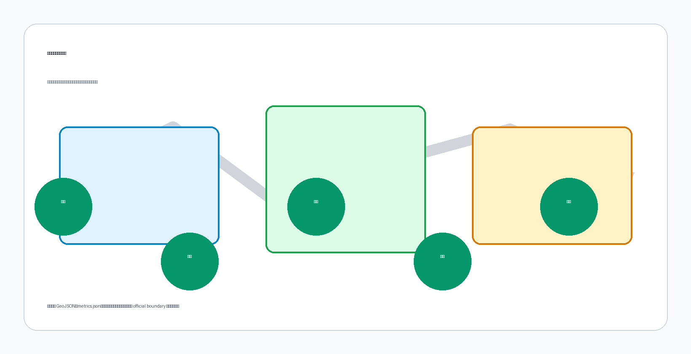
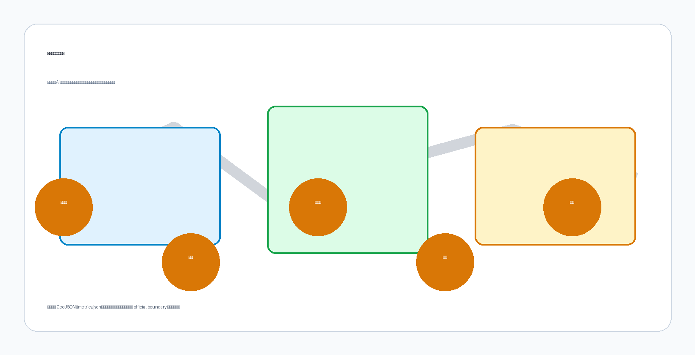

# JZ AI Spine: Centennial Jing-Zhang AI Innovation Belt Urban Design Concept Proposal

## Design Basis and Source List

This formal proposal is grounded in the International Urban Design Concept Competition Pre-qualification Announcement issued by the Haidian Branch of the Beijing Municipal Planning and Natural Resources Commission, and in the machine-readable provisional boundaries, key area polygons, enumerations, metrics, and source registries maintained in `brief/site-package/`. [standard:PROJECT-OFFICIAL-ANNOUNCEMENT]

Before generating the proposal, the AI agent read `design_brief.json`, `allowed_design_space.json`, `sources.json`, `enums/`, `ranges/`, `schemas/`, `data/source_registry.json`, and `data/processed/agent_fact_pack.md`, and used `project_scope_summary.csv`, `agent_task_requirements.csv`, `source_use_matrix.csv`, and `missing_data_checklist.csv` to build a traceable task and data-gap register. All design judgments are decomposed into traceable sources, recalculable metrics, verifiable geometry layers, and human-reviewable assumptions. [depth:existing_conditions_diagnosis]

The data registry governs usage boundaries: `data/source_registry.json` records formal-use, background-only, and provisional-only sources. The current registry summary contains 7 formal-use records, 1 background-only record, and 1 provisional-only record. No agent may promote provisional or background resources to official boundaries, statutory regulatory plans, formal scoring evidence, or government implementation commitments. [data:geometry/site_boundary.geojson#SITE-001]

`data/processed/agent_fact_pack.md` serves as a navigational layer, not a new authoritative source. Design facts must be traced back to registered originals.

## Three-Level Scope Framework

The proposal organises work across three nested scope levels defined in the announcement. The Coordinated Research Area covers 43.6 km2 and addresses the AI industry ecosystem, strategic positioning, innovation chain, and future urban form. The Overall Design Area covers 11.4 km2 and requires an urban renewal framework, land-use structure, transport and municipal support, and urban character control. The Detailed Design Area covers 368.4 ha across three key areas and requires explicit programme, building scale, retain-renovate-demolish classification, public-space connectivity, and mobility organisation. [standard:PROJECT-AGENT-OPEN-CALL-TASKBOOK]

All three scope levels are mapped in `compliance_matrix.json` to ensure that every mandatory task in Sections 1.3, 1.4, and 1.5 of the announcement, and tasks agent.1 through agent.6, are covered by a corresponding chapter, geometry layer, metric, drawing, and HTML evidence item. [depth:three_level_scope_framework]

The three-level framework is not a set of disconnected drawings. Coordinated research establishes industry chain and urban form judgments; the overall design area turns those judgments into renewal projects, spatial structure, and facility capacity; the detailed key-area design verifies the feasibility of specific sites, buildings, transport, public space, and AI application scenarios. [depth:overall_spatial_structure]

The overall concept is the "JZ AI Spine Symbiosis Belt": the Jing-Zhang Heritage Park forms the historical and public-space spine; Zhongzhiyuan, Beijing AI Origin Community, and Dazhongsi serve as innovation anchors; universities, enterprises, communities, and rail stations form the daily network. The result is a "One Belt, Three Cores, Multi-Point Scenarios, Blue-Green Slow-Travel Loop" spatial organisation. [data:geometry/key_areas.geojson#PROV-KEY-001]

## Coordinated Research Area: Industry and Future City Research

The core task of the coordinated research area is to build a world-class AI innovation ecosystem. The proposal maps Haidian universities, research institutes, leading enterprises, computing and algorithm data-factor resources, incubation platforms, listed companies, unicorns, and tech-service assets, and proposes a spatial coordination framework for the AI innovation chain, industry chain, talent chain, and urban-services chain. [standard:PROJECT-AGENT-OPEN-CALL-TASKBOOK]

The naming system and visual identity serve the "Centennial Jing-Zhang Cultural Belt, Urban AI Lifestyle Experience Belt, and AI Integrated Innovation Belt" brand. They must explain relationships with the industry ecosystem, public space, and cultural resources, not remain as slogans. The proposal responds to the "Five Functions" and "Three Zones, Two Wings" coordination required by the agent task book, forming a nameable, visualisable, and operable framework. Any references to global AI innovation events, developer communities, open-scenario days, or pilgrimage routes are stated as conceptual recommendations for further professional study, not as confirmed government arrangements. [depth:overall_spatial_structure]

Future urban form research addresses how artificial intelligence changes work, living, socialising, learning, transport, and public services. The proposal maps AI transport systems, continuous green space, innovation service facilities, and international work-life environments to locatable functional zones, nodes, corridors, and scenarios. Industry strategy metrics, AI innovation indices, talent density, spatial supply types, and AI vertical application priority zones are included in the metrics framework, clearly marked as official, design-recommended, or pending formal calibration. [data:geometry/land_use.geojson#LU-001]

## Overall Design Area: Urban Renewal and Regulatory-Plan-Level Urban Design

The overall design area must reach the depth of a regulatory detailed plan urban design. The proposal provides an overall urban renewal spatial structure, identifies inefficient spaces, lists renewal projects, proposes implementation policies, specifies industry function ratios, spatial organisation patterns, total building scale, and comprehensive carrying capacity assessment. [standard:MOHURD-URBAN-DESIGN-MEASURES]

`geometry/land_use.geojson` fully covers the design boundary without overlaps. `geometry/buildings.geojson` expresses renewal or retained building footprints. `geometry/roads.geojson` expresses micro-circulation, slow travel, and rail transfer relationships. `metrics.json` recalculates core areas, ratios, and layer counts. Under [standard:MOHURD-CONTROL-DETAILED-PLANNING], the regulatory-depth content is decomposed into auditable objects: [data:geometry/land_use.geojson#LU-001] expresses the land-use structure, [data:geometry/buildings.geojson#BLDG-001] expresses building footprints, [data:geometry/roads.geojson#ROAD-001] expresses transport organisation. [depth:land_use_layout]

The overall design must also support transport, rail, municipal infrastructure, and facilities. The proposal addresses rail station integrated development, road micro-circulation, bicycle parking, parking supply, innovation service platforms, talent living services, new infrastructure, distributed energy, and edge computing, proposing spatial layouts and implementation pathways. Where official regulatory conditions for building height, FAR, road setbacks, or facility standards are unavailable, content is written as "pending confirmation of official regulatory conditions". [depth:development_intensity_controls]

## Detailed Design of Key Areas

Detailed design of key areas is a mandatory deliverable. [depth:three_key_area_detailed_design]

**Zhongzhiyuan AI Independent Innovation Acceleration Zone** proposes a garden-style full-stack autonomous innovation district. The design focuses on the national AI platform, full-stack independent innovation, standard setting, safety governance, industrial display, external transport, Qinghe cultural interface, low-carbon green innovation environment, and green-space AI scenarios. [data:geometry/key_areas.geojson#PROV-KEY-001]

**Beijing AI Origin Community** focuses on near-campus innovation, incubation and technology transfer, talent special zones, open-source systems, brand events, retain-renovate-demolish decisions, results display, residential living amenities, campus-park slow-travel linkage, and rail station integrated development. [data:geometry/key_areas.geojson#PROV-KEY-002]

**Dazhongsi AI Industry Cluster** focuses on leading enterprises, intelligent agents, smart terminals, content consumption, data factors, digital assets, commercial services, planned green-space mixed use, Dazhongsi Station integration, and four-quadrant pedestrian connectivity at the key intersection. [data:geometry/key_areas.geojson#PROV-KEY-003]

All three key areas must appear in `geometry/key_areas.geojson`. If official polygons are available, they are used as `official_constraint`; if unavailable, provisional polygons are used as `provisional_constraint`, and the proposal, HTML, sources, assumptions, and self-check all record that they cannot serve as formal scoring or approval evidence. The compliance matrix covers announcement Sections 1.5.3.1, 1.5.3.2, and 1.5.3.3 respectively.

## AI Innovation Ecosystem, Personas, and AI+ Scenarios

The proposal builds a spatial demand profile for AI talent and enterprises, covering R&D offices, open-source collaboration, results publication, enterprise services, talent housing, social learning, consumption, sports, and international exchange. AI+ scenarios address transport, services, consumption, healthcare, education, legal services, and everyday services as required by the announcement, forming industry-development scenarios and AI-enabled city-function scenarios. [depth:land_use_layout]

Each scenario specifies the target users, spatial location, data sources, privacy boundary, human-review mechanism, and operating entity. AI governance recommendations comply with data minimisation, public sources, explainability, and human-review principles. Urban intelligent agents can assist in identifying slow-travel bottlenecks, public-space heat, facility maintenance needs, enterprise service requirements, and event safety risks, but must not replace planning approvals, output unauthorised personal profiles, or claim official implementation commitments. [data:geometry/public_space.geojson#PUBLIC-001]

Ten AI scenario cards are provided: 01 Open-Source Release Hall (AI Origin Community), 02 Safety Governance Sandbox (Zhongzhiyuan), 03 Edge Computing Station (overall design area nodes), 04 AI Slow-Travel Navigation (Jing-Zhang Heritage Park belt), 05 Dazhongsi International Roadshow Salon (Dazhongsi cluster), 06 Qinghe Low-Carbon Innovation Corridor (Zhongzhiyuan Qinghe interface), 07 Near-Campus Technology Transfer Street (AI Origin Community), 08 Data Factor Salon (Dazhongsi), 09 AI Living Service Pilot Block (community-commercial intersections), 10 Global AI Event Week Route (belt public space system). All scenario nodes are entered into structured geometry layers or compliance matrices. [metric:public_space_ratio] [metric:green_ratio]

## Land Use, Building Scale, and Retain-Renovate-Demolish Strategy

The land-use plan expresses a complete, closed, overlap-free zoning structure based on publicly available national standards. [standard:MNR-LAND-USE-CLASSIFICATION-GUIDE]

The building plan distinguishes retained, renovated, redeveloped, newly built, and to-be-confirmed objects, specifying building footprint, programme, scale, character, roof form, massing, and recommended height-control tiers. Where existing buildings, ownership, regulatory plans, and engineering conditions are unavailable, the proposal only presents methods and a pending-calibration checklist, and does not fabricate retain-renovate-demolish conclusions. [depth:retain_renovate_demolish]

Building scale and intensity metrics must be consistent with `metrics.json` and the geometry layers. Where total floor area, FAR, building height, building coverage, green coverage, setbacks, and building control lines lack official conditions, `status=unknown` is used uniformly, with `reason` and `assumptions` explaining the pending conditions, current assumptions, and recalculation path once formal data arrive. [data:geometry/buildings.geojson#BLDG-001] [depth:height_massing_character]

The A3 booklet provides a renewal project list and metrics verification table. The A0 boards express the key spatial structure and key area designs. The HTML page enables interactive viewing of metrics and geometry layers. [metric:building_footprint_area_sqm]

## Transport, Rail, Municipal Infrastructure, and Public Services

The transport plan responds to the announcement requirements for rail station integrated development, road micro-circulation, slow-travel bottlenecks, external transport, parking, bicycle parking, and green transport. Key coverage includes the North Fifth Ring Road, Jing-Zhang Heritage Park trans-ring nodes, Wudaokou, Qinghua East Road West Gate, Dazhongsi Station, and transport links around key enterprise clusters. [depth:traffic_rail_slow_parking]

Road and slow-travel layers remain within the submission boundary and cross-check against public space, green space, industry nodes, and key areas. Where the submission boundary is provisional, transport conclusions are also treated as provisional design discussion only. Where road setbacks, pipelines, fire-safety conditions, and municipal conditions are unavailable, they are listed as prerequisites for formal development via assumptions, not stated as approved conditions. [data:geometry/roads.geojson#ROAD-001]

Municipal and public-service facilities cover AI industry service facilities, innovation service platforms, talent living services, new infrastructure, distributed energy, edge computing, and traditional municipal facilities. The proposal explains facility standards, spatial layout, service radii, operating models, and phased implementation logic. Pipelines, energy, drainage, flood control, fire safety, and engineering data unavailability are listed as prerequisites for formal detailed design. [depth:municipal_new_infrastructure] [data:geometry/constraints.geojson#CONSTRAINTS]

## Blue-Green Network, Public Space, and Urban Character

The blue-green space plan uses the Jing-Zhang Heritage Park activation belt as its spine, coordinating the Qinghe River, Xiaoyue River, surrounding universities, enterprises, and community travel demand to propose a north-south and east-west connected trail, cycling, and green space system. The plan identifies slow-travel bottlenecks, elevated ring-road crossing nodes, southern and northern park landscape nodes, and proposes mixed use for parking, sports, innovation exchange, technology testing, application display, and public services. [depth:blue_green_public_space]

Blue-green public space is verified jointly by design depth items and green and public space geometry layers: [data:geometry/green_space.geojson#GREEN-001] and [data:geometry/public_space.geojson#PUBLIC-001]. Green and public space ratios are explained in the text for their design significance; full recalculation is stored in `metrics.json`. Urban character, public space, and building controls are aligned with [standard:MOHURD-URBAN-DESIGN-MEASURES].

The urban character plan integrates the Jing-Zhang railway heritage, Zhongguancun innovation culture, and AI innovation culture, drawing on cultural resources such as Tsinghua Garden Station and Beijing Film Academy. It proposes an overall urban tone, architectural character, roof forms, massing, interfaces, and public art guidance. Brand, typefaces, imagery, portraits, and corporate identities must all have cleared source documentation. Character controls clearly distinguish official regulatory control, design recommendations, and unconfirmed conditions. [metric:green_ratio]

## Renewal Projects, Implementation Policy, and Phasing

The implementation plan forms an auditable renewal project list, specifying project location, type, programme, responsible entity, dependencies, implementation phase, risks, and evaluation metrics. Policy recommendations cover urban renewal unified implementation, space supply, operating mechanisms, industry services, public participation, data governance, and ownership coordination. `geometry/phasing.geojson` expresses phased extents; `compliance_matrix.json` links each task to a phase and drawing set. [depth:renewal_project_list]

| Project ID | Name | Type | Key Dependencies |
|---|---|---|---|
| JZ-01 | Jing-Zhang Heritage Park slow-travel gap repair | Public space / Transport | Road setbacks, underbridge space, traffic review |
| JZ-02 | Zhongzhiyuan Qinghe innovation interface | Blue-green / Industry display | River blue line, ecological and flood conditions |
| JZ-03 | AI Origin Community near-campus transfer street | Urban renewal / Industry services | Campus boundary, ownership, ground-floor mix |
| JZ-04 | Dazhongsi Station four-quadrant pedestrian connectivity | Rail integration / Slow travel | Rail station, road intersections, municipal pipelines |
| JZ-05 | AI public-service and edge-computing nodes | New infrastructure / Public services | Energy, computing, security, operating entity |
| JZ-06 | Global AI Event Week public route | Operations / Branding | Public space permits, event safety, rights clearance |

Phasing is distinct from the 100-day competition design cycle: the competition cycle is the timeline for submission; implementation phasing is the path for urban renewal and construction. The proposal presents a near-term pilot, medium-term renewal, and long-term governance framework, indicating which elements can start as lightweight facilities, operating activities, or service platforms, and which must await official regulatory plans, municipal, transport, and ownership confirmation. [depth:phasing_implementation] [data:geometry/phasing.geojson#PHASE-001]

## Metrics, Area Recalculation, and Compliance Matrix

The metrics system includes overall design area extent, key area extent, green and public space ratios, building footprint, renewal project count, AI scenario nodes, slow-travel connectivity metrics, industry space metrics, talent service metrics, and self-check status. All known metrics must be recalculable from GeoJSON or trusted sources; unknown metrics must provide the reason and formal submission prerequisites. [depth:metrics_recalculation]

Core metrics recalculated from current provisional geometry layers:
- `site_area_sqm`: 11,412,825.386 m2 (provisional boundary)
- `green_ratio`: 0.410627 (41.06%)
- `public_space_ratio`: 0.106561 (10.66%)

Full values, formulas, source files, and confidence levels are stored in `metrics.json`. [metric:site_area_sqm] [metric:green_ratio] [metric:public_space_ratio]

The compliance matrix is the master file for task responsiveness. Every announcement task and agent task book task must correspond to a report chapter, geometry layer, metric, drawing, HTML page, source, assumption, and self-check item. Any mandatory task in Sections 1.3, 1.4, or 1.5 of the announcement, or tasks agent.1 through agent.6, that cannot be covered means the proposal may not enter formal professional scoring. Metrics are classified into three categories: spatial metrics recalculated directly from submitted geometry; regulatory metrics requiring official regulatory plan or task book annex support; performance metrics requiring operational or industry data for ongoing calibration.

## Risk, Copyright, and Compliance

**Bilingual requirement.** The primary proposal file is available in Chinese; this file provides the complete English translation. A3/A0 drawings, HTML pages, and figure files all have paired language versions, using contest-recommended terminology from `docs/terminology-glossary.md` where available. All image, drawing, icon, data, and code assets must have source, licence, and authorisation status documented in `sources.json` or `report/copyright_statement.md`. HTML pages must not load remote scripts, remote map tiles, remote fonts, iframes, forms, or external APIs, and must not track reviewer behaviour. [depth:risk_missing_data]

Risk and missing-data registers are jointly verified by the risk depth item, constraints layer, and site package: [data:geometry/constraints.geojson#CONSTRAINTS]. Missing-data items listed in `missing_data_checklist.csv` for official boundary, key areas, regulatory plan, roads, parcels, buildings, municipal, heritage protection, and public services must be entered in `assumptions.json`, self-check, and the risk chapter. Any conclusion lacking official regulatory plans, road setbacks, ownership, municipal, fire-safety, or heritage protection conditions must be downgraded to a pending-confirmation item; full professional verification is stored in the standard matrix.

This proposal does not claim official approval, approved regulatory plans, final land ownership, final building scale, or guaranteed implementation. All AI scenario designs comply with the Interim Measures for Generative AI Services Management regarding content labelling, training data legality, and personal information protection. Barrier-free pedestrian access and information accessibility labelling comply with the PRC Barrier-Free Environment Construction Law. Elderly-inclusive technology application retains human service windows and paper vouchers in community service and healthcare facility scenarios. The design file depth is at the conceptual scheme stage and does not enter scheme, preliminary, or construction drawing depth per the MOHURD Architectural Design Document Depth Requirements (2016 Edition).

## References

- brief/public-brief.md
- brief/site-package/design_brief.json
- brief/site-package/allowed_design_space.json
- brief/site-package/enums/
- brief/site-package/ranges/planning_limits.json
- data/processed/agent_fact_pack.md
- data/processed/project_scope_summary.csv
- data/processed/agent_task_requirements.csv
- data/processed/source_use_matrix.csv
- data/processed/missing_data_checklist.csv
- Complete machine index: see `sources.json`, `metrics.json`, `compliance_matrix.json`, `standard_matrix.json`, and `design_depth_matrix.json`.
- Bibliography entries derive from the site-package registry; full citations and licences are in the structured source list. [depth:risk_missing_data]
