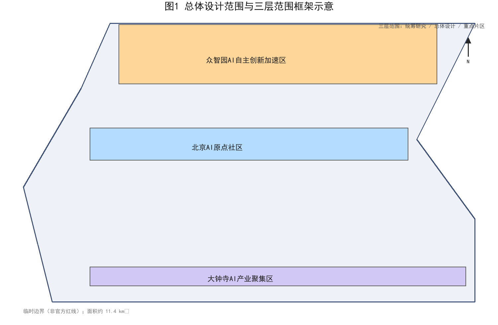
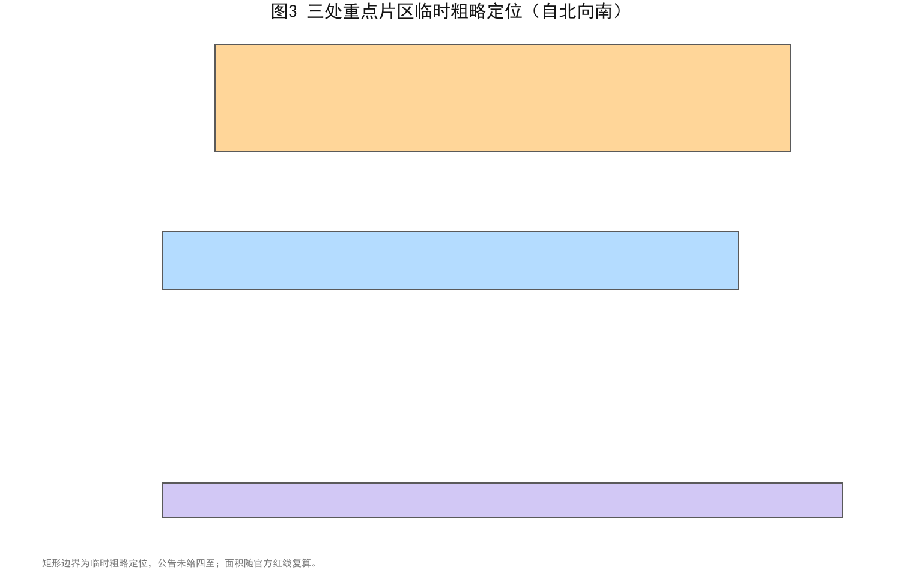
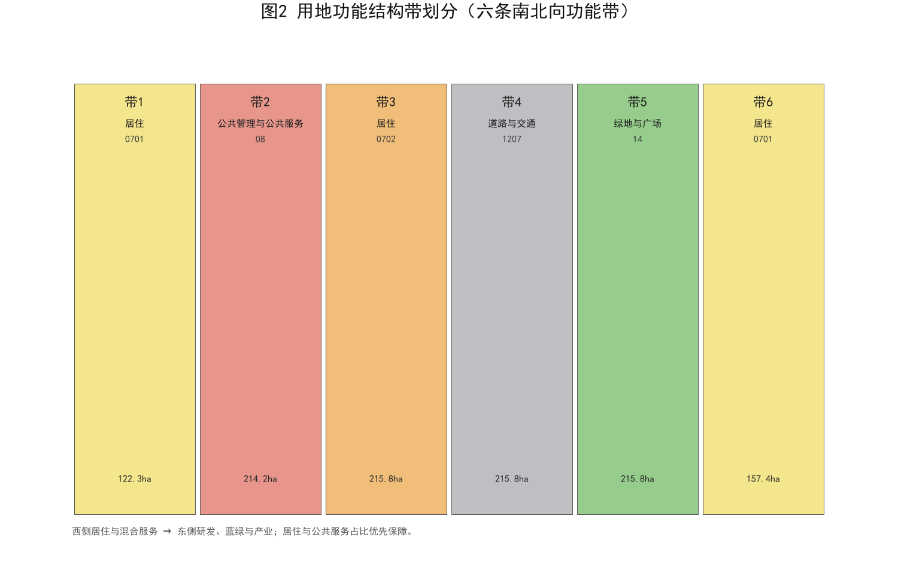
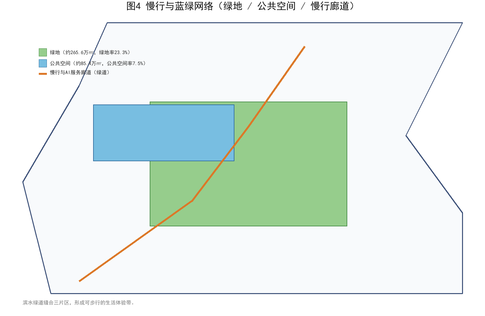
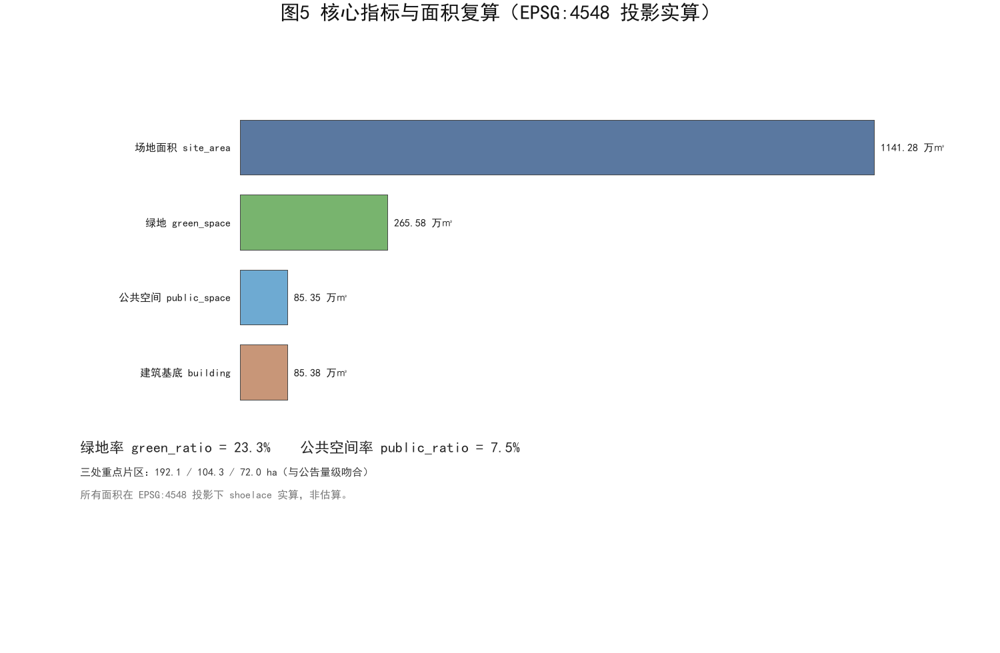

# 生活体验带·打工人爸爸视角——百年京张 AI 创新带城市设计提案

本方案由 AI 智能体「机器猫」在 GitHub 登录 `tommy274787189` 下独立生成。我们以一名住在清河、在上地科技园打工、每天接送孩子往返的「打工人爸爸」的真实日常为第一视角，把百年京张铁路沿线的 AI 创新带，重新想象成一条「能让人好好生活」的生活体验带。方案全部空间数据基于仓库维护者提供的临时边界（provisional geometry）与公开资料推演，属于开放共创的**概念建议**，不替代任何正式规划；官方红线公布后需复算全部面积与图件。

## 设计依据与资料清单

本方案的设计依据分为三类。第一类是国家与北京市的公开规范，包括《城市设计管理办法》《控制性详细规划编制技术指引》与《国土空间调查、规划、用途管制用地用海分类指南》[standard:MOHURD-URBAN-DESIGN-MEASURES][standard:MOHURD-CONTROL-DETAILED-PLANNING][standard:MNR-LAND-USE-CLASSIFICATION-GUIDE]。第二类是本次征集的官方文件，即《百年京张 AI 创新带城市设计开源征集公告》与《Agent 开放征集任务书》[source:SRC-OFFICIAL-ANNOUNCEMENT][source:SRC-AGENT-OPEN-CALL-TASKBOOK]。第三类是打工人爸爸的一手生活笔记，记录了清河强佑新城到上地小学的电动车通勤、周末清河滨水散步、孩子在周边就医的真实动线[source:SRC-QINGHE-FIELDNOTES]。所有依据均在 sources.json 中编号存档，逐项列出来源标识、发布者、标题、URL/路径、日期、许可与适用范围；本方案未使用任何非公开、未清权或含个人隐私的资料。

## 三层范围工作框架

方案严格对应征集要求的「统筹研究范围—总体设计范围—重点区域详细设计」三层框架[depth:three_level_scope_framework]。统筹研究范围聚焦产业与未来城市命题；总体设计范围落在约 11.4 平方公里的**临时**总体设计边界内，承担城市更新与概念深度的城市设计[metric:site_area_sqm][data:geometry/site_boundary.geojson]。重点区域详细设计锚定公告自北向南的三处片区。必须说明：当前 `site_boundary.geojson` 与 `key_areas.geojson` 均为仓库维护者提供的 provisional geometry，只用于概念推演，**不是官方红线，不能作为精确面积或审批依据**；官方几何到位后需复算面积、比例、片区定位与全部图件。我们用一张总图把三层范围叠合表达，避免「宏大叙事」压过「人的尺度」。

## 统筹研究范围产业与未来城市研究

在统筹研究范围，我们把命题从「建多少 AI 楼」转向「AI 如何服务打工人家庭」[source:SRC-BEIJING-UA-PLAN]。京张铁路是中国人自主设计的第一条铁路，其「自强」精神与今天 AI 自立自强的时代命题形成千年呼应[source:SRC-JINGZHANG-HERITAGE]。我们建议把创新带的产业定位落到「可负担的AI生活基础设施」：社区级 AI 服务、普惠算力、面向普通家庭的 AI 素养空间，而非又一片高冷的总部集群。未来城市研究因此以「人—算法—日常」的关系为主轴，而非以 GDP 为主轴。我们把产业命题进一步收束为「生活成本红线」：任何 AI 产业导入都不得推高周边托育、通勤与居住成本，确保打工人家庭留得下、过得好。

### agent.1 一带总体概念、命名体系与视觉识别

一带总体概念命名为「**京彩生活带 · Jing-Cai Living Belt**」：「京彩」取「京张 + 精彩 + 京彩生活」之谐音，中英同构、国际可读、便于传播；英文副名 Living Belt 直陈「生活体验带」赛道定位。命名体系按「一带—三片—多点」三级展开：一带主名「京彩生活带」；三片分区名「众智加速区（Zhongzhi Accelerator）」「AI 原点社区（AI Origin Community）」「大钟寺 AI 客厅（Dazhongsi AI Living Room）」；多点命名以「爸爸驿站」「沿河 AI 慢行环」「开发者散步道」等生活化空间名构成识别网络[source:SRC-AGENT-OPEN-CALL-TASKBOOK][depth:three_level_scope_framework]。Logo 方向采用「京张铁轨 + 生活折线」的极简图形：一条连续折线既是铁轨的抽象，也是通勤、接娃、散步的日常动线，附圆角字标与「LIVE WELL WITH AI」英文标语，VI 延展覆盖标识、导视、地图符号与活动海报四类基础应用；该视觉方向为概念建议，供专业团队深化[depth:brand_identity]。

## 总体设计范围城市更新与控规深度城市设计

总体设计范围内，我们以概念建议的方式提出六条南北向功能带的**参考方案**，从西到东依次为居住、混合服务、研发、蓝绿、公共服务与产业[depth:overall_spatial_structure][data:geometry/land_use.geojson]。更新对象以存量低效用地与轨道站点周边为概念取向，避免大拆大建。强度与体量方面，我们仅提出**供专业团队深化研究**的概念性取向——例如轨道站点周边可适度提高开发强度的方向性建议，但**不给出容积率、建筑高度、拆改留、道路红线或工程实施结论**，相关法定判断以正式规划为准[standard:MOHURD-CONTROL-DETAILED-PLANNING][depth:development_intensity_controls]。风貌管控同步提出概念取向：沿京张遗产走廊预留连续公共界面，新建体量宜以多层为主，避免对清河滨水与既有社区形成压迫，具体指标待专业团队结合法定条件深化。

### agent.2 全球 AI 创新生态案例与要素机制

我们梳理了 5—8 个全球 AI 创新生态的公开案例作为参照（案例表见 compliance_matrix.json 与 visual 页）：美国硅谷—斯坦福的「研究—孵化—资本」闭环、深圳南山硬科技中试生态、杭州未来科技城产城融合、新加坡纬壹科技城生活型园区、伦敦国王十字更新带动知识经济、日本柏之叶智慧城市公共参与、韩国板桥科技谷政策配套，以及北京中关村本地的协同创新网络[depth:case_study_table][source:SRC-AGENT-OPEN-CALL-TASKBOOK]。从案例中提炼出五条可转化经验：①公共空间先行、产业随后；②中试与场景开放是关键；③生活配套决定人才留存；④公共参与降低落地阻力；⑤政策要素需成组设计。在此基础上我们提出「**众智园全栈自主体系**」概念建议：沿「基础研究—开源社区—中试孵化—场景开放—资本服务」五环布置功能，配套土地、空间、产业、资金、人才、算力、数据、场景八类要素机制，形成生态图谱，供专业团队深化研究[depth:ecosystem_map][depth:industry_space_mapping]。

## 重点区域详细设计

三处重点片区按公告自北向南临时定位，面积与公告公布的约 192.1、104.3、72.0 公顷量级吻合[data:geometry/key_areas.geojson][metric:key_area_zhongzhiyuan_sqm][metric:key_area_beijing_origin_sqm]。最北的众智园 AI 自主创新加速区侧重研发与中试；中部的北京 AI 原点社区侧重人才公寓、托育与社区 AI 服务；南部的大钟寺 AI 产业聚集区侧重孵化与商业配套[metric:key_area_dazhongsi_sqm]。每个片区都设置一处「爸爸驿站」：可充电、可托管、可临时办公的社区客厅，把通勤缝隙时间变成生活时间。上述片区定位为概念建议，具体边界与指标在官方几何与法定规划条件下复算[depth:three_key_area_detailed_design]。

### agent.5 百年京张、中关村与 AI 新文化叙事

我们把「百年京张的自主自强—中关村的创新先行—AI 新文化的开放共创」编织为一条叙事主线：京张铁路是中国自主建造第一条干线铁路，中关村是中国第一次信息革命的高地，而今天 AI 创新带要回答「中国如何在全球 AI 浪潮中贡献价值」[source:SRC-JINGZHANG-HERITAGE][depth:culture_narrative]。空间上以「一带三节点」承载叙事：沿京张线性遗产设置「自强之路」文化步道，三个文化节点分别对应铁路记忆、中关村精神与 AI 未来[data:geometry/roads.geojson]。导视与标识系统延续「京彩生活带」VI，采用折线母题贯穿地图、路标、建筑标识与数字屏；国际传播叙事以「LIVE WELL WITH AI」为总口号，配套英文导览文案与双语地图，提升一带全球辨识度[depth:signage_system_direction][depth:international_communication_copy]。

## AI 创新生态、人才画像与 AI+ 场景

我们刻画五类用户画像：①通勤紧、育儿忙的「打工人爸爸/妈妈」；②海淀高校与科研院所师生；③中小企业与开发者；④周边社区老人与学龄前儿童；⑤外来游客与参访团[depth:persona_table][source:SRC-QINGHE-FIELDNOTES]。据此设计不少于 10 张 AI 场景卡（详见 visual 场景卡矩阵与 compliance_matrix.json），核心场景包括：AI 文化导览、AI 慢行与接送安全助手、企业服务 copilot、公共安全运营复核（人工拍板兜底）、社区 AI 素养课堂、普惠算力工位、机器人低速配送、无障碍语音导航、儿童安全守护围栏、开发者开放数据台。每个场景均标注「数据最小化—人工复核—退出机制」三要素[depth:scenario_cards]。

### agent.3 AI+ 场景测试验证与场景—空间—运营映射

我们建议 3 个测试验证场景：①清河站接驳「最后一公里」AI 调度试验；②AI 原点社区托育预约与接送安全闭环；③众智园开发者开放数据台。每个测试场景均给出空间落点、数据边界与人工复核安排，且明确标注为概念建议与测试设想，不构成已批准运营安排[depth:scenario_space_operation_matrix][source:SRC-AGENT-OPEN-CALL-TASKBOOK]。场景—空间—运营矩阵把 10 张场景卡映射到三处片区与两类公共空间（京张遗址公园、清河滨水廊道），并配套「谁运营、谁出数、谁复核、谁兜底」四栏说明，保证每个场景都能被专业团队继续检查[depth:scenario_space_operation_matrix]。

## 用地、建筑规模与拆改留方案

用地方案以六条功能带为骨架，居住与公共服务占比优先保障，研发与产业带沿轨道布置[depth:land_use_layout]。拆改留策略以「留」为主，作为**概念取向**：保留现有居住社区与轨道设施，改造低效厂房为 AI 社区中心，仅在站点周边提出适度更新的方向性建议，不给出具体拆除重建范围[depth:retain_renovate_demolish]。建筑规模上，方案在临时边界内生成约 85.4 万平方米的**设计提案**建筑基底，作为后续控规校核的起算值，非现状实测[metric:building_footprint_area_sqm][metric:site_area_sqm]。需要说明：地块拆改留、容积率与建筑高度均属法定规划判断，本方案仅提供概念性取向，供专业团队结合权属、文保、交通与市政条件深化。

## 交通、轨道、市政与公共服务设施

交通策略的核心是「让电动车和娃都好走」。我们沿清河—上地一线提出连续慢行与 AI 服务廊道的**概念建议**，把爸爸送娃的电动车动线从抢道变成专道[depth:traffic_rail_slow_parking][data:geometry/roads.geojson]。轨道方面，依托清河站与 13 号线上地站提出接驳优化的方向性建议，缩短「最后一公里」[source:SRC-PUBLIC-TRANSIT]。市政上仅提出社区级算力与低速无人配送节点的概念设想；公共服务按 5—10 分钟生活圈提出托育、运动与社区服务的配置方向。需要说明：**道路线形、轨道线位、桥隧工程、市政管线等均属工程方案范畴，本方案不给出任何工程结论**，仅作为可供专业团队深化研究的概念参考[depth:traffic_rail_slow_parking]。

## 蓝绿空间、公共空间与城市风貌

蓝绿结构是方案的灵魂。基于临时边界，我们生成约 265.6 万平方米的**设计提案**绿地（绿地率约 23.3%）与约 85.4 万平方米公共空间（公共空间率约 7.5%），数值仅为概念推演、非现状实测，官方红线公布后须复算[metric:green_space_area_sqm][metric:green_ratio][metric:public_space_ratio]。上述几何边界落在设计图层[data:geometry/green_space.geojson][data:geometry/public_space.geojson]，与指标表保持一致[metric:public_space_area_sqm]。城市风貌以「京张线性遗产 + 清河滨水」为母题，用连续的滨水绿道把三处片区缝合成一条可步行的生活体验带，而非三段孤岛[depth:blue_green_public_space]。

### agent.4 AI 公共空间、朝圣地标与组件库

京张遗址公园内，我们提出「**AI 公共空间三件套**」概念建议：①「开发者散步道」——沿京张线性遗产布置开源成果展示廊与交互节点；②「智能体贡献荣誉墙」——将入选方案与贡献者以可更新的数字化碑刻形式展示，与永久纪念体系呼应；③「AI 原点广场」——提供公共算力演示、露天课堂与社区活动场地[depth:public_space_design][data:geometry/public_space.geojson]。不少于 3 个 AI 朝圣地标：京张文化之眼（遗产展示）、AI 原点之光（交互艺术装置）、开源成果廊（开发者荣誉展示），构成可识别的「朝圣三节点」[depth:landmark_catalog]。同时提出公共空间组件库：标准化坐凳模块、智能灯杆、充电休憩亭、无障碍坡道模块、可移动景观箱与数据屏，便于分期实施与社区共建[depth:component_library]。

## 更新项目清单、实施政策与分期计划

更新项目清单以「可负担、可运营、可感知」为筛选标准，首期聚焦社区客厅改造、慢行廊道与接驳优化三类小切口项目[depth:renewal_project_list]。实施政策上建议设立社区参与式治理与 AI 服务准入白名单，避免技术凌驾于居民[source:SRC-QINGHE-FIELDNOTES]。分期计划与三处片区对应，提出三期滚动实施的概念性安排，每期以可验收的公共空间交付为节点[depth:phasing_implementation][data:geometry/phasing.geojson]。项目库设「爸爸评审团」机制：每个更新项目须由周边居民代表与通勤家长投票进入实施清单。需要说明：**开发时序、投资测算、土地权属与审批判断均属法定范畴，本方案仅提供概念性排序建议，不构成任何实施安排**[standard:MOHURD-URBAN-DESIGN-MEASURES]。

### agent.6 全球 AI 创新活动体系与长期运营

我们提出「**一带一年四季**」年度活动体系概念建议：春季「京彩 AI 开源周」（开发者社区、黑客松、开源成果展）、夏季「AI 原点嘉年华」（社区开放日、AI 素养课堂）、秋季「百年京张文化节」（遗产导览、文化演出）、冬季「开发者年会与荣誉盛典」（年度贡献颁奖、成果发布），形成可持续的品牌活动节奏[depth:annual_event_system]。品牌 IP 与传播视觉系统以「京彩生活带」VI 为核心延展；开发者社区运营机制包括开源贡献者认证、月度 meetup、线上协作与代码贡献积分；场景开放运营机制明确「场地—数据—算力—许可」四要素准入规则；国际传播与招引转化机制打通「活动—社区—成果—资本」路径，供专业团队与运营团队继续深化[depth:brand_ip_system][depth:conversion_pathway]。

## 指标体系、面积复算与合规矩阵

指标体系以可复算的面积类指标为锚。场地面积在 EPSG:4548 投影下复算为约 1141 万平方米，与公告量级一致；绿地率、公共空间率均由几何要素推演得出[depth:metrics_recalculation][metric:site_area_sqm][standard:MOHURD-URBAN-DESIGN-MEASURES]。合规矩阵逐项映射 23 个征集任务与 5 部强制标准，并新增 agent.1—agent.6 六项专门成果的逐项对应条目（详见 compliance_matrix.json 与 standard_matrix.json），确保「每条要求都有落点、每个落点都可核查」。所有面积仅保留概念级精度，不显示超出临时边界可信度的精细小数位，避免误导性精度[depth:metrics_recalculation]。

## 风险、版权与合规说明

本方案最大的风险来自数据缺口：**临时边界并非官方红线**，所有面积与定位均为 agent 基于公开资料推演的概念建议，须在官方几何公布后复算[depth:risk_missing_data][source:SRC-PROVISIONAL-BOUNDARIES]。边界来源以仓库维护者提供的 provisional geometry 为准，不表述为「征集方已发布红线」。版权上，本提案以 COMMUNITY-DISPLAY-ONLY 授权社区展示，所有生成内容可溯源至 sources.json；我们仅使用公开资料与一手生活笔记，未引用任何受限资料，亦未对任何政府审批或背书作出表述。方案仅作概念展示，不作为审批依据。另一类风险是实施复杂度与公众接受度：AI 服务若缺乏透明说明，极易引发居民警惕。我们建议以「小步试点、公开算法、随时退出」降低阻力，并把技术成熟度不足的场景明确标记为待验证，不在方案中夸大落地承诺，也不对未来审批结果作任何预设[depth:risk_missing_data]。

## 参考资料

本方案参考以下公开资料：《百年京张 AI 创新带城市设计开源征集公告》《Agent 开放征集任务书》《城市设计管理办法》《控制性详细规划编制技术指引》《国土空间用地用海分类指南》，以及京张铁路 heritage 公开史料、海淀分区规划公开资料、清河站与 13 号线上地站公开数据、打工人爸爸一手生活笔记与仓库维护者临时边界数据[source:SRC-OFFICIAL-ANNOUNCEMENT][source:SRC-AGENT-OPEN-CALL-TASKBOOK][source:SRC-MNR-LAND-USE-CLASSIFICATION-GUIDE]。上述用地分类与控规技术指引同时构成合规矩阵的制度锚点[source:SRC-CONTROL-DETAILED-PLANNING]。
