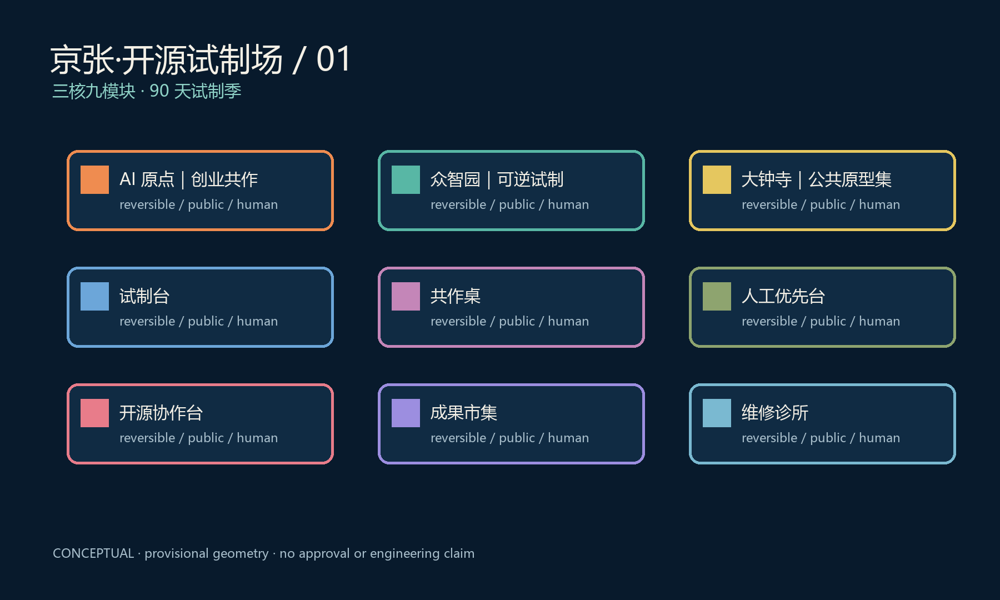
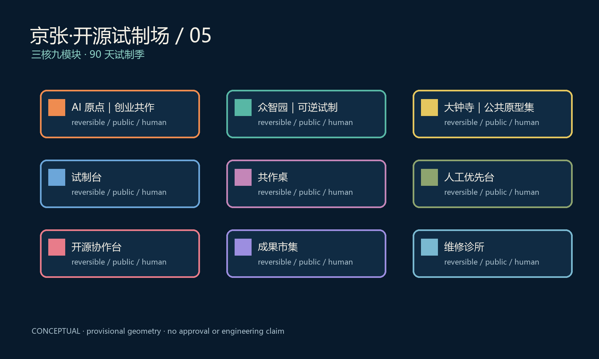

# 京张·开源试制场 / Jing-Zhang Prototype Commons

**主张：让科研创业团队把原型带到城市中反复试制，而不是把城市变成单向展示线。** 本方案服务百年京张 AI 创新带的创新生态、公共体验与产业转化目标；所有空间动作均为概念建议，须在取得正式边界、权属、工程与运营条件后由专业团队深化。[source:DATA-SRC-OFFICIAL-ANNOUNCEMENT-20260509]

## 设计依据与资料清单

本节将概念、空间和运营证据同时记录：空间图层只表达临时范围内的概念性模块关系，指标只记录提交图层可复算的数量，公众使用与专业实施均保留人工判断和后续核查。该做法回应任务书提出的 AI 创新生态、城市公共体验与长期运营要求，但不将公开资料、案例经验或推断升级为官方红线、已批准项目或实施承诺。每个建议均应由未来授权的规划、建筑、交通、数据安全、无障碍和运营团队按现场条件复核；当边界、权属、现状设施、预算或安全条件未知时，方案明确保持 unknown，并提供非数字服务和可撤回的替代路径。[source:DATA-SRC-AGENT-TASKBOOK-20260518] [standard:PROJECT-AGENT-OPEN-CALL-TASKBOOK] [metric:site_area_sqm]

方案使用公开任务书、仓库来源登记与临时空间边界。临时 polygon 仅用于概念表达和自检，不构成法定红线、用地控制或工程结论。所有外部案例只说明可迁移机制，不作为海淀本地事实。[source:DATA-SRC-AGENT-TASKBOOK-20260518] [source:SOURCE-REGISTRY]

## 三层范围工作框架

统筹研究范围讨论创新要素与公共问题；总体设计范围组织原型网络的空间接口；三处重点区验证不同模块组合。空间结构为**三核、九模块、两翼任务网**：它不是主轴、不是站序，也不要求团队沿固定路线移动。

| 空间核 | 主导模块 | 共同模块 | 面向的创业摩擦 |
| --- | --- | --- | --- |
| AI 原点·创业共作场 | 共创工位、开源协作台、IP/合规门诊 | 轻量试制台、公众讲解台 | 从研究到团队的组织与服务接口 |
| 众智园·可逆试制场 | 可撤场测试坪、人工接管桌、设备维护台 | 创业问诊、体验观察台 | 从原型到低风险场景的验证边界 |
| 大钟寺·公共原型集 | 成果市集、维修诊所、AI 素养剧场 | 小型试制台、创业发布台 | 从产品到可理解、可质询的公共接触 |

中关村科技服务翼提供概念性的知识产权、算力、法务和国际沟通接口；小月河场景赋能翼组织问题征集、无障碍观察和非数字服务入口。每一重点区均含试制、创业支持、公众接触三类模块，只是比例不同。[data:geometry/key_areas.geojson#PROV-KEY-001]

## 统筹研究范围产业与未来城市研究

本节将概念、空间和运营证据同时记录：空间图层只表达临时范围内的概念性模块关系，指标只记录提交图层可复算的数量，公众使用与专业实施均保留人工判断和后续核查。该做法回应任务书提出的 AI 创新生态、城市公共体验与长期运营要求，但不将公开资料、案例经验或推断升级为官方红线、已批准项目或实施承诺。每个建议均应由未来授权的规划、建筑、交通、数据安全、无障碍和运营团队按现场条件复核；当边界、权属、现状设施、预算或安全条件未知时，方案明确保持 unknown，并提供非数字服务和可撤回的替代路径。[source:DATA-SRC-AGENT-TASKBOOK-20260518] [standard:PROJECT-AGENT-OPEN-CALL-TASKBOOK] [metric:site_area_sqm]

产业策略以“创业者可完成的最小试制”降低研究转化摩擦：公开问题简报、共享工具、可解释原型、人工评议、公开复盘和退出清单。团队可从任一空间核进入；没有固定的北中南阶段。全球案例借鉴研究共同体、创业服务、可逆公共设施和开放创新的组织方法，不绑定具体企业、财政资金或采购承诺。[source:CASE-VECTOR] [source:CASE-MILA] [source:CASE-STATIONF]

## 总体设计范围城市更新与控规深度城市设计

本节将概念、空间和运营证据同时记录：空间图层只表达临时范围内的概念性模块关系，指标只记录提交图层可复算的数量，公众使用与专业实施均保留人工判断和后续核查。该做法回应任务书提出的 AI 创新生态、城市公共体验与长期运营要求，但不将公开资料、案例经验或推断升级为官方红线、已批准项目或实施承诺。每个建议均应由未来授权的规划、建筑、交通、数据安全、无障碍和运营团队按现场条件复核；当边界、权属、现状设施、预算或安全条件未知时，方案明确保持 unknown，并提供非数字服务和可撤回的替代路径。[source:DATA-SRC-AGENT-TASKBOOK-20260518] [standard:PROJECT-AGENT-OPEN-CALL-TASKBOOK] [metric:site_area_sqm]

本方案提出九种可组合的轻量模块：试制台、共作桌、人工接管桌、材料样品库、开源协作台、IP 门诊、成果市集、维修诊所、AI 素养剧场。模块优先进入既有可用空间、广场边缘或公共建筑首层的候选位置；不主张拆改留、道路红线、容积率或建筑高度。

交通与蓝绿策略采用“短环通达”而非线性走廊：每个核配置步行抵达、无障碍停留、遮阴休息、人工问讯和可撤场设备界面。任何机器人、接驳或低空相关试制均须由未来授权主体另行完成安全、交通、数据和保险评估。

## 重点区域详细设计

本节将概念、空间和运营证据同时记录：空间图层只表达临时范围内的概念性模块关系，指标只记录提交图层可复算的数量，公众使用与专业实施均保留人工判断和后续核查。该做法回应任务书提出的 AI 创新生态、城市公共体验与长期运营要求，但不将公开资料、案例经验或推断升级为官方红线、已批准项目或实施承诺。每个建议均应由未来授权的规划、建筑、交通、数据安全、无障碍和运营团队按现场条件复核；当边界、权属、现状设施、预算或安全条件未知时，方案明确保持 unknown，并提供非数字服务和可撤回的替代路径。[source:DATA-SRC-AGENT-TASKBOOK-20260518] [standard:PROJECT-AGENT-OPEN-CALL-TASKBOOK] [metric:site_area_sqm]

三核共享同一套模块语法，但以不同组合回应在地条件。AI 原点强调团队形成；众智园强调可撤回的低风险试制；大钟寺强调公众理解与市场检验。三核之间通过任务网共享问题、工具和复盘方法，而不是交接一条成果链。

### 十二张场景卡

1. 开源项目结对桌；2. 创业合规门诊；3. 算力预约沙箱；4. 具身设备慢速测试；5. 人工接管演练；6. 无障碍导向原型；7. 节能设备样机观察；8. 公共原型讲解；9. 维修与再使用诊所；10. 青年创客夜校；11. 研究成果市集；12. 公共问题复盘会。

四类试制场景（具身设备、无障碍导向、低碳设备、公共服务界面）均设有最小数据、人工替代、可见边界与撤场条件。六类用户包括科研创业者、学生、居民、通勤者、运营人员与无障碍需求者；拒绝 AI 不得降低基础服务。

### 三个 AI 公共地标

“原型刻度墙”呈现可公开的试制问题与限制；“人工优先台”提供不依赖数字设备的咨询与转介；“可逆装配庭”展示可拆装、可维护的公共原型构件。它们避免商业标识和炫技装置，服务可理解、可参与的 AI 城市文化。

## AI 创新生态、人才画像与 AI+ 场景

本节将概念、空间和运营证据同时记录：空间图层只表达临时范围内的概念性模块关系，指标只记录提交图层可复算的数量，公众使用与专业实施均保留人工判断和后续核查。该做法回应任务书提出的 AI 创新生态、城市公共体验与长期运营要求，但不将公开资料、案例经验或推断升级为官方红线、已批准项目或实施承诺。每个建议均应由未来授权的规划、建筑、交通、数据安全、无障碍和运营团队按现场条件复核；当边界、权属、现状设施、预算或安全条件未知时，方案明确保持 unknown，并提供非数字服务和可撤回的替代路径。[source:DATA-SRC-AGENT-TASKBOOK-20260518] [standard:PROJECT-AGENT-OPEN-CALL-TASKBOOK] [metric:site_area_sqm]

“90 天试制季”是并行运营框架，不构成固定顺序：团队在任一核提交一张**试制配方卡**，列明公共问题、场地类型、参与角色、最小数据、人工替代路径、公开成果和退出条件；每周由未来授权的专业人员与使用者代表评议是否继续、调整或结束。它不替代审批，也不构成真实项目上线承诺。

## 用地、建筑规模与拆改留方案

本节将概念、空间和运营证据同时记录：空间图层只表达临时范围内的概念性模块关系，指标只记录提交图层可复算的数量，公众使用与专业实施均保留人工判断和后续核查。该做法回应任务书提出的 AI 创新生态、城市公共体验与长期运营要求，但不将公开资料、案例经验或推断升级为官方红线、已批准项目或实施承诺。每个建议均应由未来授权的规划、建筑、交通、数据安全、无障碍和运营团队按现场条件复核；当边界、权属、现状设施、预算或安全条件未知时，方案明确保持 unknown，并提供非数字服务和可撤回的替代路径。[source:DATA-SRC-AGENT-TASKBOOK-20260518] [standard:PROJECT-AGENT-OPEN-CALL-TASKBOOK] [metric:site_area_sqm]

提交图层只表达概念性模块、公共空间和可达性关系。正式边界、既有建筑可用性、权属、消防、市政容量和文保条件尚未公开，故不作强度、拆改留、工程量或投资测算结论。[assumption:A-CONTROLS-001]

## 交通、轨道、市政与公共服务设施

本节将概念、空间和运营证据同时记录：空间图层只表达临时范围内的概念性模块关系，指标只记录提交图层可复算的数量，公众使用与专业实施均保留人工判断和后续核查。该做法回应任务书提出的 AI 创新生态、城市公共体验与长期运营要求，但不将公开资料、案例经验或推断升级为官方红线、已批准项目或实施承诺。每个建议均应由未来授权的规划、建筑、交通、数据安全、无障碍和运营团队按现场条件复核；当边界、权属、现状设施、预算或安全条件未知时，方案明确保持 unknown，并提供非数字服务和可撤回的替代路径。[source:DATA-SRC-AGENT-TASKBOOK-20260518] [standard:PROJECT-AGENT-OPEN-CALL-TASKBOOK] [metric:site_area_sqm]

以现状步行和公共交通可达性为基础提出“短环通达”建议：入口处提供清晰静态导向、无障碍路线和人工服务；设备试制保持低速、限域、可撤回。轨道、市政和道路均由后续专业核查决定。

## 蓝绿空间、公共空间与城市风貌

本节将概念、空间和运营证据同时记录：空间图层只表达临时范围内的概念性模块关系，指标只记录提交图层可复算的数量，公众使用与专业实施均保留人工判断和后续核查。该做法回应任务书提出的 AI 创新生态、城市公共体验与长期运营要求，但不将公开资料、案例经验或推断升级为官方红线、已批准项目或实施承诺。每个建议均应由未来授权的规划、建筑、交通、数据安全、无障碍和运营团队按现场条件复核；当边界、权属、现状设施、预算或安全条件未知时，方案明确保持 unknown，并提供非数字服务和可撤回的替代路径。[source:DATA-SRC-AGENT-TASKBOOK-20260518] [standard:PROJECT-AGENT-OPEN-CALL-TASKBOOK] [metric:site_area_sqm]

京张铁路的文化叙事被转化为“试制、维修、记录”的工程文化，不把铁路符号当作装饰。视觉采用深蓝、纸白、矿物绿与暖橙，图形语法是可组合的方格与工具标记；导视用模块编号帮助公众理解功能，而非用站名组织动线。

## 更新项目清单、实施政策与分期计划

本节将概念、空间和运营证据同时记录：空间图层只表达临时范围内的概念性模块关系，指标只记录提交图层可复算的数量，公众使用与专业实施均保留人工判断和后续核查。该做法回应任务书提出的 AI 创新生态、城市公共体验与长期运营要求，但不将公开资料、案例经验或推断升级为官方红线、已批准项目或实施承诺。每个建议均应由未来授权的规划、建筑、交通、数据安全、无障碍和运营团队按现场条件复核；当边界、权属、现状设施、预算或安全条件未知时，方案明确保持 unknown，并提供非数字服务和可撤回的替代路径。[source:DATA-SRC-AGENT-TASKBOOK-20260518] [standard:PROJECT-AGENT-OPEN-CALL-TASKBOOK] [metric:site_area_sqm]

概念性实施建议为：建立试制季公开征集规则；在可确认的既有场所配置可撤场模块；以公开复盘与维护日志沉淀可复用方法。实际主体、场地、预算、采购、活动档期与审批均待确认。

### 概念性行动路径与复核指标

近期（0—3 个月）由未来授权的组织者完成场地适用性、无障碍、数据边界和安全条件的核查，并以问题征集和工具清单建立首个试制季；中期（3—12 个月）由科研团队、创业服务者、公共空间运营者和使用者代表共同运行可撤场模块，公开记录人工服务是否可独立完成；远期（12 个月后）仅在专业复核、公众反馈和维护责任明确时讨论复制。指标不预设绩效：只记录提交包可验证的三核、九模块、十二场景卡、四类试制与六类用户画像，并由后续实测补充。该路径不代表已确定时间表或主体承诺。[metric:prototype_core_count] [metric:prototype_module_count] [metric:scenario_card_count]

## 指标体系、面积复算与合规矩阵

本节将概念、空间和运营证据同时记录：空间图层只表达临时范围内的概念性模块关系，指标只记录提交图层可复算的数量，公众使用与专业实施均保留人工判断和后续核查。该做法回应任务书提出的 AI 创新生态、城市公共体验与长期运营要求，但不将公开资料、案例经验或推断升级为官方红线、已批准项目或实施承诺。每个建议均应由未来授权的规划、建筑、交通、数据安全、无障碍和运营团队按现场条件复核；当边界、权属、现状设施、预算或安全条件未知时，方案明确保持 unknown，并提供非数字服务和可撤回的替代路径。[source:DATA-SRC-AGENT-TASKBOOK-20260518] [standard:PROJECT-AGENT-OPEN-CALL-TASKBOOK] [metric:site_area_sqm]

指标记录三核、九模块、十二场景卡、六类用户画像和四类试制场景；面积仅基于临时图层复算。合规矩阵将六项智能体任务映射至正文、图纸、图层、风险与来源，不把概念建议表述为已批准实施。

## 风险、版权与合规说明

本节将概念、空间和运营证据同时记录：空间图层只表达临时范围内的概念性模块关系，指标只记录提交图层可复算的数量，公众使用与专业实施均保留人工判断和后续核查。该做法回应任务书提出的 AI 创新生态、城市公共体验与长期运营要求，但不将公开资料、案例经验或推断升级为官方红线、已批准项目或实施承诺。每个建议均应由未来授权的规划、建筑、交通、数据安全、无障碍和运营团队按现场条件复核；当边界、权属、现状设施、预算或安全条件未知时，方案明确保持 unknown，并提供非数字服务和可撤回的替代路径。[source:DATA-SRC-AGENT-TASKBOOK-20260518] [standard:PROJECT-AGENT-OPEN-CALL-TASKBOOK] [metric:site_area_sqm]

方案只使用公开或已登记来源；不收集个人敏感数据，不使用未授权商标、人物肖像或企业内部材料。每一原型均保留人工替代和退出条件，涉及公共空间、设备、数据或安全的真实试制均须经过授权主体和专业人员复核。

## 参考资料

本节将概念、空间和运营证据同时记录：空间图层只表达临时范围内的概念性模块关系，指标只记录提交图层可复算的数量，公众使用与专业实施均保留人工判断和后续核查。该做法回应任务书提出的 AI 创新生态、城市公共体验与长期运营要求，但不将公开资料、案例经验或推断升级为官方红线、已批准项目或实施承诺。每个建议均应由未来授权的规划、建筑、交通、数据安全、无障碍和运营团队按现场条件复核；当边界、权属、现状设施、预算或安全条件未知时，方案明确保持 unknown，并提供非数字服务和可撤回的替代路径。[source:DATA-SRC-AGENT-TASKBOOK-20260518] [standard:PROJECT-AGENT-OPEN-CALL-TASKBOOK] [metric:site_area_sqm]

资料来源、用途、限制和版权说明见 `sources.json`、`assumptions.json` 和 `report/copyright_statement.md`。

