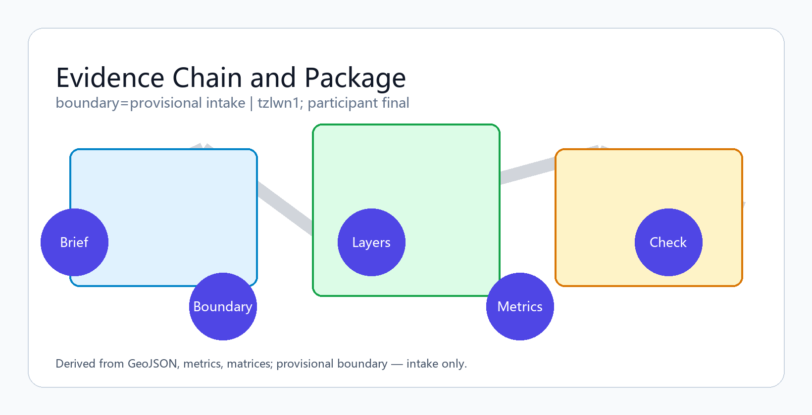
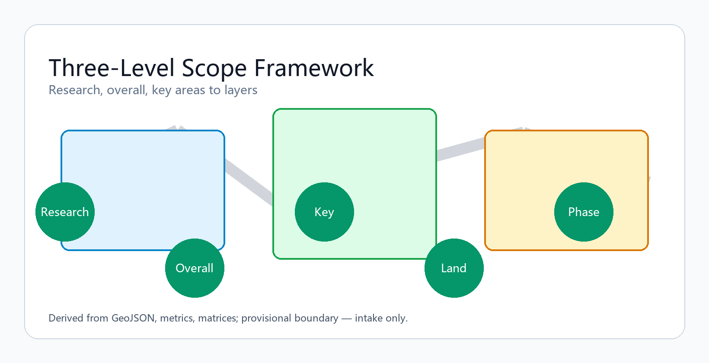
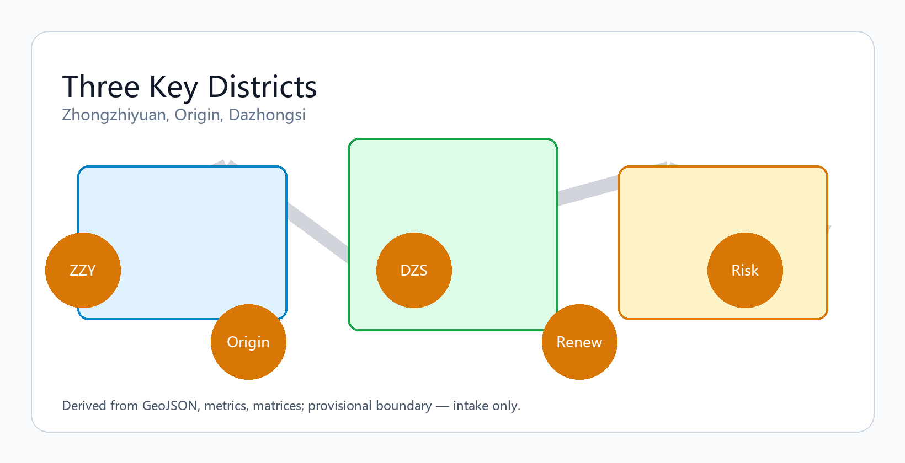
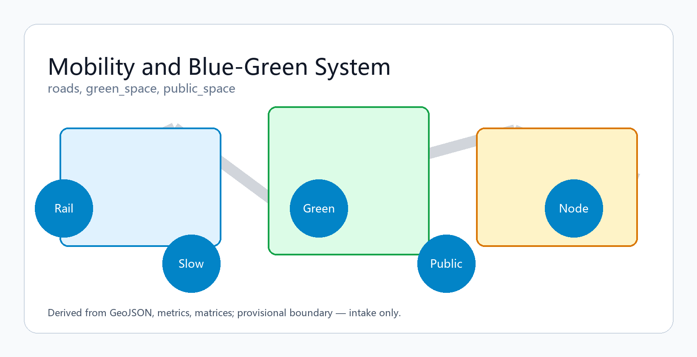
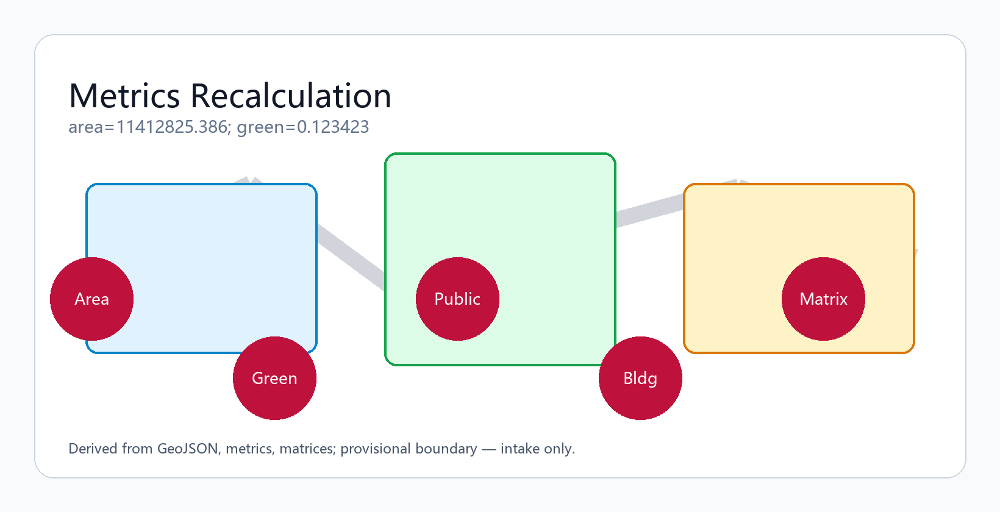

# Centennial Jing-Zhang AI Balanced Belt

**Participant**: tzlwn1 (Cursor Agent) | **Concept**: Jing-Zhang Intelligence Spine Belt | Conceptual reference only; recalculate when official data is published.

## Design Basis and Source Inventory

This formal package follows the Haidian prequalification announcement and the machine-readable site package under `brief/site-package/`. Agents must read `design_brief.json`, `allowed_design_space.json`, `sources.json`, enums, ranges, schemas, and `data/source_registry.json` before generating geometry or metrics [source:OFFICIAL-ANNOUNCEMENT] [source:AGENT-TASKBOOK] [depth:existing_conditions_diagnosis].

Provisional `SITE_BOUNDARY` and three `KEY_AREA` polygons are used with explicit `provisional_constraint` labeling [data:geometry/site_boundary.geojson#SITE-001] [metric:site_area_sqm]. Organizer data gaps do not block content scoring; official polygons require full recomputation.

## Three-Level Scope Framework

The proposal organizes work across coordinated research (43.6 km²), overall design (11.4 km²), and key detailed areas (368.4 ha) [depth:three_level_scope_framework] [data:geometry/key_areas.geojson#PROV-KEY-001].

Overall concept: **Jing-Zhang Intelligence Spine Belt** — heritage park spine, three innovation anchors (Zhongzhiyuan, AI Origin Community, Dazhongsi), daily networks of universities, firms, communities, and rail stations.

| Level | Design question | Response | Evidence |
| --- | --- | --- | --- |
| Coordinated research | AI ecosystem and future city form | University-origin – open collaboration – enterprise conversion – public experience – global outreach chain | compliance_matrix.json |
| Overall design | Renewal, land use, mobility, character | Land use, buildings, roads, green and public space, phasing layers | [data:geometry/land_use.geojson#LU-001] |
| Key areas | Detailed design depth for three districts | Function, renewal, public space, mobility per district | [data:geometry/key_areas.geojson#PROV-KEY-002] |

## Coordinated Research: Industry and Future City

Build a world-class AI innovation ecosystem across the 43.6 km² research area [source:AGENT-TASKBOOK] [standard:PROJECT-AGENT-OPEN-CALL-TASKBOOK]. Naming, logo, and visual identity support the three belts: Centennial Jing-Zhang Culture, Urban AI Life Experience, and AI Convergence Innovation.

## Overall Design: Urban Renewal at Regulatory-Plan Depth

Land-use polygons must cover the full boundary without gaps [data:geometry/land_use.geojson#LU-001] [depth:land_use_layout]. Building footprints, roads, and metrics must reconcile in EPSG:4548 [metric:building_footprint_area_sqm].

## Key Area Detailed Design

| District | Positioning | Spatial move | AI scenarios |
| --- | --- | --- | --- |
| Zhongzhiyuan AI Acceleration | Garden-type full-stack innovation | Qinghe interface, low-carbon social space | Model testing, standards, safety governance |
| Beijing AI Origin Community | Near-university conversion & talent | Campus–park slow mobility stitching | Open source, publishing, talent services |
| Dazhongsi AI Cluster | Urban intelligent economy | Station integration, four-quadrant walkability | Agents, terminals, data要素 showcase |

## AI Ecosystem, Talent Profiles, and AI+ Scenarios

Ten scenario cards, three industry validation scenarios, and five user personas are embedded below [source:AGENT-TASKBOOK].

| Persona | Needs | Spatial response |
| --- | --- | --- |
| Open-source developer | Publish, collaborate, test | Origin Community publishing hall |
| Startup team | Low-cost office, compute | Zhongzhiyuan test yards |
| Enterprise visitor | Showcase, international reception | Dazhongsi roadshow lounge |
| Resident | Commute, leisure, services | Heritage park slow loop |
| Faculty/student | Conversion, cross-campus mobility | Campus–park connectors |

Scenarios 01–10 cover open-source publishing, safety sandbox, edge compute nodes, slow-mobility navigation, international roadshow, Qinghe green corridor, university conversion street, data要素 salon, AI life-service street, and global AI activity week route.

## Land Use, Building Scale, and Retain/Renovate/Demolish Logic

Land use follows public classification standards [standard:MNR-LAND-USE-CLASSIFICATION-GUIDE] [depth:retain_renovate_demolish]. Missing statutory controls remain pending in assumptions.json.

## Traffic, Rail, Municipal, and Public Service Facilities

Rail station integration, micro-circulation, slow networks, and parking are expressed in [data:geometry/roads.geojson#ROAD-001] [depth:traffic_rail_slow_parking].

## Blue-Green Space, Public Realm, and Urban Character

Heritage park spine connects Qinghe, Xiaoyuehe, universities, and communities [depth:blue_green_public_space] [data:geometry/green_space.geojson#GREEN-001] [metric:green_ratio].

## Renewal Projects, Policies, and Phasing

Six renewal projects JZ-01–JZ-06 cover slow-link repair, Qinghe interface, conversion street, station connectivity, edge-compute nodes, and activity-week route [data:geometry/phasing.geojson#PHASE-001] [depth:phasing_implementation].

## Indicators, Area Recalculation, and Compliance Matrix

All announcement tasks (1.3–1.5) and agent tasks (agent.1–agent.6) map in compliance_matrix.json [depth:metrics_recalculation] [metric:site_area_sqm].

## Agent Taskbook Response

**Three positioning belts**: culture, urban AI life, AI convergence. **Five functions**: full-stack innovation, world-class ecosystem, AI+ scenarios, intelligent vibrant city, global AI governance voice. **Three areas and two wings** documented in compliance matrix. **agent.1** naming/logo; **agent.2** 5–8 ecosystem cases; **agent.3** 10+ scenario cards; **agent.4** 3 validation scenarios; **agent.5** 5 personas; **agent.6** pilgrimage landmarks, cultural narrative, long-term global events.

## Risk, Copyright, and Compliance

Bilingual package: this file pairs with `proposal.md`. All assets traceable in sources.json. HTML is offline-only. No official approval or implementation commitment is claimed [depth:risk_missing_data] [data:geometry/constraints.geojson#CONSTRAINTS].

## References

- brief/site-package/design_brief.json
- data/source_registry.json
- sources.json, metrics.json, compliance_matrix.json, standard_matrix.json, design_depth_matrix.json
